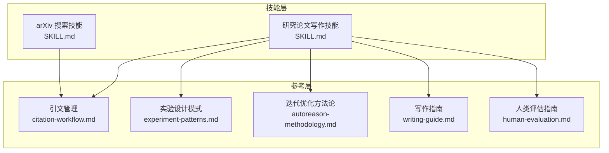
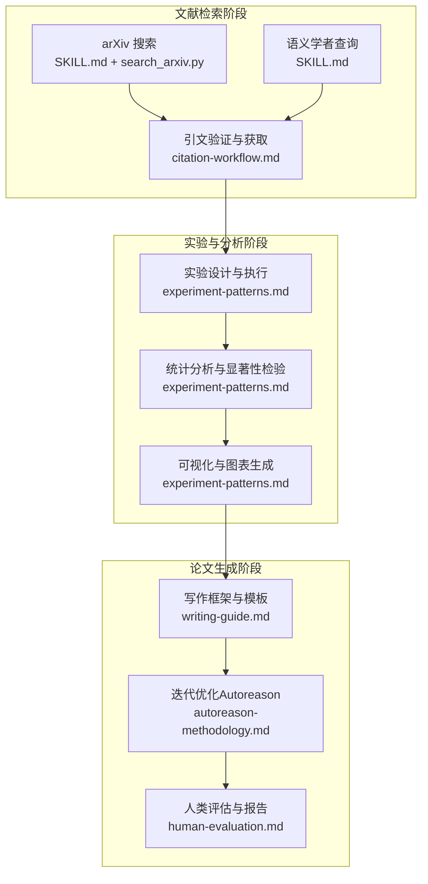
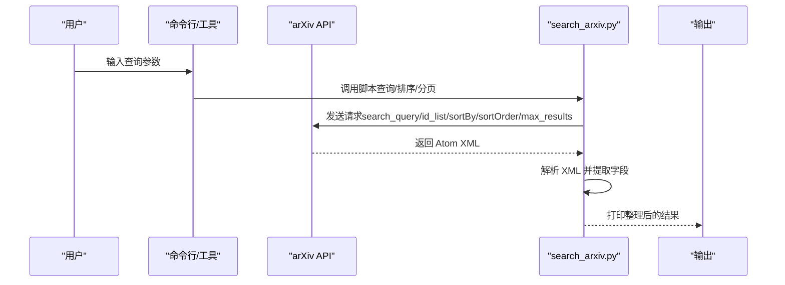
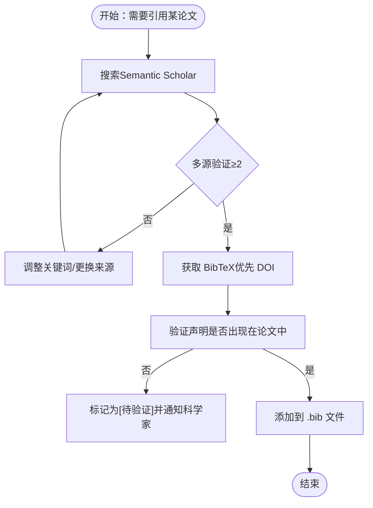
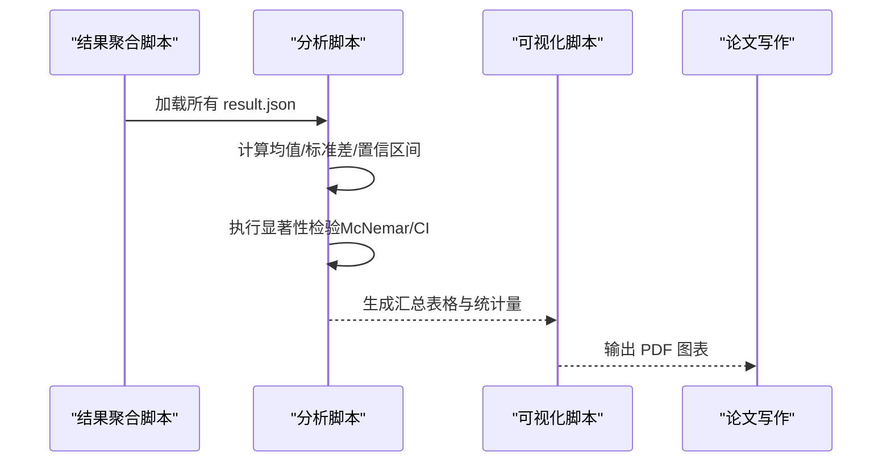
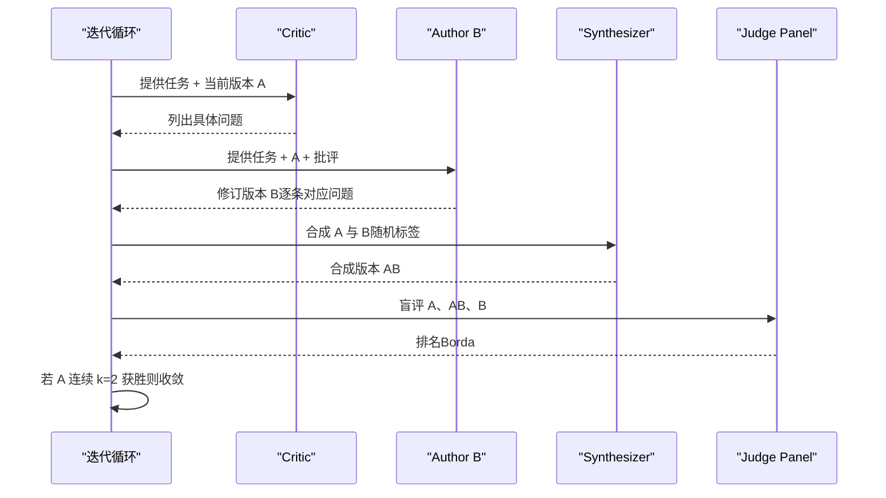
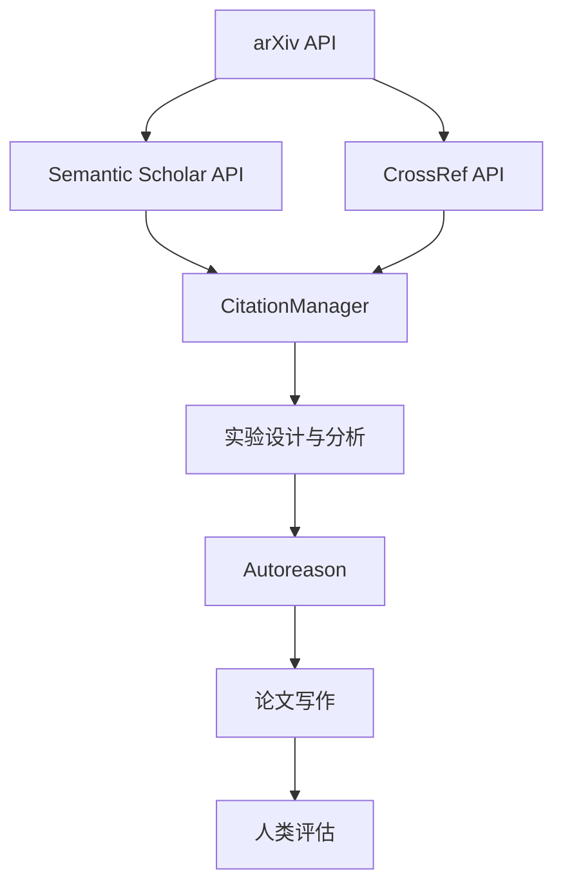

# 学术研究工具

<cite>
**本文档引用的文件**
- [SKILL.md（arXiv 搜索）](file://skills/research/arxiv/SKILL.md)
- [search_arxiv.py（arXiv 搜索脚本）](file://skills/research/arxiv/scripts/search_arxiv.py)
- [SKILL.md（研究论文写作）](file://skills/research/research-paper-writing/SKILL.md)
- [citation-workflow.md（引文管理）](file://skills/research/research-paper-writing/references/citation-workflow.md)
- [experiment-patterns.md（实验设计模式）](file://skills/research/research-paper-writing/references/experiment-patterns.md)
- [autoreason-methodology.md（迭代优化方法论）](file://skills/research/research-paper-writing/references/autoreason-methodology.md)
- [writing-guide.md（写作指南）](file://skills/research/research-paper-writing/references/writing-guide.md)
- [human-evaluation.md（人类评估指南）](file://skills/research/research-paper-writing/references/human-evaluation.md)
</cite>

## 目录
1. [简介](#简介)
2. [项目结构](#项目结构)
3. [核心组件](#核心组件)
4. [架构总览](#架构总览)
5. [详细组件分析](#详细组件分析)
6. [依赖关系分析](#依赖关系分析)
7. [性能考虑](#性能考虑)
8. [故障排除指南](#故障排除指南)
9. [结论](#结论)
10. [附录](#附录)

## 简介
本文件面向学术研究场景，围绕两类关键能力进行系统化说明：arXiv 论文搜索与研究论文写作。前者聚焦于 arXiv API 的使用、查询参数与结果解析；后者覆盖从文献检索到论文生成的完整工作流，包括模板系统、引用格式、图表生成与格式标准化，并提供可操作的学术规范与版权注意事项。

## 项目结构
该工具集由“技能”（Skill）与“参考文档”（references）两部分组成：
- 技能层：提供可直接调用的能力入口与使用说明（如 arXiv 搜索、研究论文写作）。
- 参考层：提供方法论、最佳实践与实现细节（如引文验证、实验设计、自动优化、写作规范、人类评估等）。

图示来源
- [SKILL.md（arXiv 搜索）:1-282](file://skills/research/arxiv/SKILL.md#L1-L282)
- [SKILL.md（研究论文写作）:1-800](file://skills/research/research-paper-writing/SKILL.md#L1-L800)
- [citation-workflow.md（引文管理）:1-565](file://skills/research/research-paper-writing/references/citation-workflow.md#L1-L565)
- [experiment-patterns.md（实验设计模式）:1-729](file://skills/research/research-paper-writing/references/experiment-patterns.md#L1-L729)
- [autoreason-methodology.md（迭代优化方法论）:1-395](file://skills/research/research-paper-writing/references/autoreason-methodology.md#L1-L395)
- [writing-guide.md（写作指南）:1-475](file://skills/research/research-paper-writing/references/writing-guide.md#L1-L475)
- [human-evaluation.md（人类评估指南）:1-477](file://skills/research/research-paper-writing/references/human-evaluation.md#L1-L477)

章节来源
- [SKILL.md（arXiv 搜索）:1-282](file://skills/research/arxiv/SKILL.md#L1-L282)
- [SKILL.md（研究论文写作）:1-800](file://skills/research/research-paper-writing/SKILL.md#L1-L800)

## 核心组件
- arXiv 搜索技能：提供基于 arXiv API 的论文检索、元数据解析与 BibTeX 生成能力，支持关键词、作者、分类与 ID 查询，以及排序与分页控制。
- 引文管理系统：通过多源交叉验证（Semantic Scholar、CrossRef、arXiv）确保引用准确性，提供 BibTeX 获取与格式化建议。
- 实验设计与分析：提供可复现的实验目录结构、增量保存、盲评打分（Borda 计数）、统计显著性检验与可视化最佳实践。
- 迭代优化方法论：定义在不同模型层级与任务类型下的优化策略选择、角色分工与收敛条件，确保输出质量稳定提升。
- 写作指南与模板：提供摘要公式、引言结构、句子清晰度原则、数学写作规范与图表设计要求，支撑论文结构化产出。
- 人类评估指南：涵盖评估类型、样本量规划、标注指南、平台选择、质量控制与报告要求，满足 NLP/ACL 等领域对主观评价的需求。

章节来源
- [SKILL.md（arXiv 搜索）:1-282](file://skills/research/arxiv/SKILL.md#L1-L282)
- [citation-workflow.md（引文管理）:1-565](file://skills/research/research-paper-writing/references/citation-workflow.md#L1-L565)
- [experiment-patterns.md（实验设计模式）:1-729](file://skills/research/research-paper-writing/references/experiment-patterns.md#L1-L729)
- [autoreason-methodology.md（迭代优化方法论）:1-395](file://skills/research/research-paper-writing/references/autoreason-methodology.md#L1-L395)
- [writing-guide.md（写作指南）:1-475](file://skills/research/research-paper-writing/references/writing-guide.md#L1-L475)
- [human-evaluation.md（人类评估指南）:1-477](file://skills/research/research-paper-writing/references/human-evaluation.md#L1-L477)

## 架构总览
下图展示了从“文献检索”到“论文生成”的端到端工作流，以及各组件之间的协作关系：

图示来源
- [SKILL.md（arXiv 搜索）:1-282](file://skills/research/arxiv/SKILL.md#L1-L282)
- [SKILL.md（研究论文写作）:1-800](file://skills/research/research-paper-writing/SKILL.md#L1-L800)
- [citation-workflow.md（引文管理）:1-565](file://skills/research/research-paper-writing/references/citation-workflow.md#L1-L565)
- [experiment-patterns.md（实验设计模式）:1-729](file://skills/research/research-paper-writing/references/experiment-patterns.md#L1-L729)
- [autoreason-methodology.md（迭代优化方法论）:1-395](file://skills/research/research-paper-writing/references/autoreason-methodology.md#L1-L395)
- [writing-guide.md（写作指南）:1-475](file://skills/research/research-paper-writing/references/writing-guide.md#L1-L475)
- [human-evaluation.md（人类评估指南）:1-477](file://skills/research/research-paper-writing/references/human-evaluation.md#L1-L477)

## 详细组件分析

### 组件A：arXiv 论文搜索与检索
- 功能概述
  - 支持按关键词、作者、分类与 ID 检索论文。
  - 提供排序（相关性、提交日期、最后更新）与分页控制。
  - 输出解析为可读格式，并支持生成 BibTeX。
- 关键接口与参数
  - 基础查询：search_query（all/ti/au/abs/cat/co 等前缀）
  - 排序：sortBy（relevance、lastUpdatedDate、submittedDate），sortOrder（ascending、descending）
  - 分页：start（偏移）、max_results（数量）
  - 指定 ID：id_list
- 结果处理
  - 解析 Atom XML，提取标题、作者、摘要、分类、链接等字段。
  - 支持生成 arXiv BibTeX 条目，包含 eprint、archivePrefix、primaryClass 等域。
- 使用示例路径
  - [快速参考与示例:17-185](file://skills/research/arxiv/SKILL.md#L17-L185)
  - [查询语法与布尔运算:59-87](file://skills/research/arxiv/SKILL.md#L59-L87)
  - [排序与分页参数:89-101](file://skills/research/arxiv/SKILL.md#L89-L101)
  - [指定 ID 检索:103-111](file://skills/research/arxiv/SKILL.md#L103-L111)
  - [BibTeX 生成:113-143](file://skills/research/arxiv/SKILL.md#L113-L143)
  - [脚本实现（search_arxiv.py）:20-80](file://skills/research/arxiv/scripts/search_arxiv.py#L20-L80)

图示来源
- [search_arxiv.py（arXiv 搜索脚本）:20-80](file://skills/research/arxiv/scripts/search_arxiv.py#L20-L80)
- [SKILL.md（arXiv 搜索）:17-185](file://skills/research/arxiv/SKILL.md#L17-L185)

章节来源
- [SKILL.md（arXiv 搜索）:26-185](file://skills/research/arxiv/SKILL.md#L26-L185)
- [search_arxiv.py（arXiv 搜索脚本）:1-115](file://skills/research/arxiv/scripts/search_arxiv.py#L1-L115)

### 组件B：引文管理与引用验证
- 核心流程
  - 搜索 → 验证存在性（多源交叉） → 获取 BibTeX（优先 DOI 内容协商） → 验证声明 → 添加到书目文件。
- 多源验证
  - Semantic Scholar、CrossRef（DOI）、arXiv（ID）至少两个来源确认。
- BibTeX 管理
  - 推荐使用 natbib + BibTeX 或 biblatex + Biber；统一引用键格式（author_year_firstword）。
- 引用格式
  - 会议论文、期刊文章、预印本等条目模板与字段说明。
- 使用示例路径
  - [引文验证工作流:71-85](file://skills/research/research-paper-writing/references/citation-workflow.md#L71-L85)
  - [多源验证函数:106-139](file://skills/research/research-paper-writing/references/citation-workflow.md#L106-L139)
  - [DOI → BibTeX 获取:141-161](file://skills/research/research-paper-writing/references/citation-workflow.md#L141-L161)
  - [BibTeX 管理与 LaTeX 设置:411-451](file://skills/research/research-paper-writing/references/citation-workflow.md#L411-L451)
  - [常见格式模板:464-507](file://skills/research/research-paper-writing/references/citation-workflow.md#L464-L507)

图示来源
- [citation-workflow.md（引文管理）:71-180](file://skills/research/research-paper-writing/references/citation-workflow.md#L71-L180)

章节来源
- [citation-workflow.md（引文管理）:1-565](file://skills/research/research-paper-writing/references/citation-workflow.md#L1-L565)

### 组件C：实验设计与分析
- 目录结构与脚本分离
  - experiments/、results/、analysis/、paper/ 等目录职责明确；生成、评估、可视化分离。
- 增量保存与断点恢复
  - 每个单元完成后立即保存结果，重启时跳过已完成项。
- 盲评打分（Borda 计数）
  - 随机化标签与呈现顺序，避免位置偏差；奇数评委（3/5/7）减少平局。
- 统计显著性与效应量
  - McNemar 检验、置信区间、Cohen’s h 等指标。
- 图表生成最佳实践
  - SciencePlots + matplotlib；颜色盲安全配色；矢量图输出。
- 使用示例路径
  - [目录结构与脚本设计:9-117](file://skills/research/research-paper-writing/references/experiment-patterns.md#L9-L117)
  - [盲评打分与 Borda 计数:121-176](file://skills/research/research-paper-writing/references/experiment-patterns.md#L121-L176)
  - [代码/客观评测示例:177-210](file://skills/research/research-paper-writing/references/experiment-patterns.md#L177-L210)
  - [统计分析脚本与测试:337-404](file://skills/research/research-paper-writing/references/experiment-patterns.md#L337-L404)
  - [图表生成与样式:558-729](file://skills/research/research-paper-writing/references/experiment-patterns.md#L558-L729)

图示来源
- [experiment-patterns.md（实验设计模式）:349-404](file://skills/research/research-paper-writing/references/experiment-patterns.md#L349-L404)
- [experiment-patterns.md（实验设计模式）:558-729](file://skills/research/research-paper-writing/references/experiment-patterns.md#L558-L729)

章节来源
- [experiment-patterns.md（实验设计模式）:1-729](file://skills/research/research-paper-writing/references/experiment-patterns.md#L1-L729)

### 组件D：迭代优化（Autoreason）
- 策略选择
  - 根据任务类型（客观/主观）、模型层级（弱/中/强/前沿）选择单次、批判修订或 Autoreason。
- 角色分工
  - Critic（仅找问题）、Author B（针对问题修订）、Synthesizer（合成最强元素）、Judge Panel（盲评排序）。
- 收敛与评分
  - Borda 计数，k=2 连续获胜即收敛；保守平局判给既有版本。
- 在论文写作中的应用
  - Ground-truth Critic（实际实验数据）与 CoT Judge 提升质量；提供原始数据、统计输出、代码以避免幻觉。
- 使用示例路径
  - [策略选择决策树:9-36](file://skills/research/research-paper-writing/references/autoreason-methodology.md#L9-L36)
  - [Autoreason 循环与角色:58-113](file://skills/research/research-paper-writing/references/autoreason-methodology.md#L58-L113)
  - [评分与随机化:172-195](file://skills/research/research-paper-writing/references/autoreason-methodology.md#L172-L195)
  - [论文优化推荐设置:338-380](file://skills/research/research-paper-writing/references/autoreason-methodology.md#L338-L380)

图示来源
- [autoreason-methodology.md（迭代优化方法论）:58-113](file://skills/research/research-paper-writing/references/autoreason-methodology.md#L58-L113)
- [autoreason-methodology.md（迭代优化方法论）:172-195](file://skills/research/research-paper-writing/references/autoreason-methodology.md#L172-L195)

章节来源
- [autoreason-methodology.md（迭代优化方法论）:1-395](file://skills/research/research-paper-writing/references/autoreason-methodology.md#L1-L395)

### 组件E：写作指南与模板系统
- 叙事原则
  - 明确“所做”“为何重要”“读者为何关心”，引言中清晰列出贡献要点。
- 时间分配
  - 抽象、引言、图表与其余内容投入时间相当，确保评审第一印象。
- 摘要公式
  - 五句公式：成就、难度与意义、方法、证据、最突出结果。
- 引言结构
  - 开场钩子、背景/挑战、方法、贡献要点、结果预览、论文组织。
- 句子级清晰度
  - 主谓近邻、强调位置、主题位置、旧信息先新信息后、一单位一功能、动词在句首、上下文先新信息后。
- 数学写作与图表设计
  - 符号一致性、颜色盲安全配色、自说明图注、矢量图输出。
- 使用示例路径
  - [叙事原则与时间分配:21-66](file://skills/research/research-paper-writing/references/writing-guide.md#L21-L66)
  - [摘要公式:69-105](file://skills/research/research-paper-writing/references/writing-guide.md#L69-L105)
  - [引言结构模板:108-142](file://skills/research/research-paper-writing/references/writing-guide.md#L108-L142)
  - [句子级清晰度原则:157-225](file://skills/research/research-paper-writing/references/writing-guide.md#L157-L225)
  - [数学写作与图表设计:334-406](file://skills/research/research-paper-writing/references/writing-guide.md#L334-L406)

章节来源
- [writing-guide.md（写作指南）:1-475](file://skills/research/research-paper-writing/references/writing-guide.md#L1-L475)

### 组件F：人类评估指南
- 何时需要人类评估
  - 文本生成质量、事实准确性、安全性、偏好比较、摘要质量、任务完成度等。
- 评估类型与样本量
  - 成对比较（最可靠）、Likert、排序、最佳-最坏缩放、二元判断、错误标注。
- 样本量规划与偏差控制
  - 最低样本量建议；随机化顺序、长度控制、锚定、疲劳管理。
- 质量控制与协议
  - 注意力检查、标注员资格、实时监控、协议模板与试点。
- 统计分析与报告
  - 成对比较（符号检验）、Likert（Wilcoxon）、多重比较校正；报告必须项清单。
- 使用示例路径
  - [何时需要人类评估:22-34](file://skills/research/research-paper-writing/references/human-evaluation.md#L22-L34)
  - [评估类型与样本量:37-84](file://skills/research/research-paper-writing/references/human-evaluation.md#L37-L84)
  - [偏差控制与协议:86-147](file://skills/research/research-paper-writing/references/human-evaluation.md#L86-L147)
  - [质量控制与监控:181-241](file://skills/research/research-paper-writing/references/human-evaluation.md#L181-L241)
  - [统计分析与报告:321-396](file://skills/research/research-paper-writing/references/human-evaluation.md#L321-L396)

章节来源
- [human-evaluation.md（人类评估指南）:1-477](file://skills/research/research-paper-writing/references/human-evaluation.md#L1-L477)

## 依赖关系分析
- arXiv 搜索技能依赖外部 API（arXiv、Semantic Scholar、CrossRef），并通过本地脚本解析 XML/JSON。
- 引文管理依赖 Python 标准库与第三方库（requests、semanticscholar、arxiv、habanero），并遵循严格的验证流程。
- 实验设计依赖 matplotlib、numpy、scipy、SciencePlots 等用于统计与可视化。
- 迭代优化方法论为论文写作提供通用策略，适用于多种任务类型与模型层级。
- 写作指南与人类评估指南为论文生成与评审提供规范与质量保障。

图示来源
- [SKILL.md（arXiv 搜索）:191-240](file://skills/research/arxiv/SKILL.md#L191-L240)
- [citation-workflow.md（引文管理）:45-63](file://skills/research/research-paper-writing/references/citation-workflow.md#L45-L63)
- [experiment-patterns.md（实验设计模式）:558-729](file://skills/research/research-paper-writing/references/experiment-patterns.md#L558-L729)
- [autoreason-methodology.md（迭代优化方法论）:1-395](file://skills/research/research-paper-writing/references/autoreason-methodology.md#L1-L395)
- [writing-guide.md（写作指南）:1-475](file://skills/research/research-paper-writing/references/writing-guide.md#L1-L475)
- [human-evaluation.md（人类评估指南）:1-477](file://skills/research/research-paper-writing/references/human-evaluation.md#L1-L477)

章节来源
- [SKILL.md（arXiv 搜索）:191-240](file://skills/research/arxiv/SKILL.md#L191-L240)
- [citation-workflow.md（引文管理）:45-63](file://skills/research/research-paper-writing/references/citation-workflow.md#L45-L63)
- [experiment-patterns.md（实验设计模式）:558-729](file://skills/research/research-paper-writing/references/experiment-patterns.md#L558-L729)
- [autoreason-methodology.md（迭代优化方法论）:1-395](file://skills/research/research-paper-writing/references/autoreason-methodology.md#L1-L395)
- [writing-guide.md（写作指南）:1-475](file://skills/research/research-paper-writing/references/writing-guide.md#L1-L475)
- [human-evaluation.md（人类评估指南）:1-477](file://skills/research/research-paper-writing/references/human-evaluation.md#L1-L477)

## 性能考虑
- API 请求频率与限流
  - arXiv：约每 3 秒一次请求；Semantic Scholar：免费版 1 RPS，有 API Key 可达更高频率。
- 并发与资源竞争
  - 同一 API 并发超过 4 个实验会降低整体吞吐；合理安排并行度与重试退避。
- 结果缓存与增量处理
  - 实验脚本采用增量保存与断点恢复，避免重复计算；引文获取应缓存以减少重复请求。
- 可视化与存储
  - 图表统一保存为 PDF 矢量图，保证打印与缩放清晰；颜色盲安全与灰度可读性验证。

## 故障排除指南
- arXiv API 错误
  - 429/402：等待后重试；检查查询参数与 ID 格式。
  - 结果为空：扩大关键词范围或切换到 Semantic Scholar。
- 引文验证失败
  - 多源验证未通过：尝试更精确关键词或使用 arXiv ID；必要时手动生成 BibTeX。
  - DOI 不可用：改用 arXiv ID 或手动补充字段。
- 实验执行失败
  - 进程崩溃：重启脚本（自动跳过已完成）；检查日志定位失败点。
  - 并发导致慢：减少并行数至 2-3；检查 API 速率限制。
- 图表显示异常
  - 颜色盲不可辨：更换 Okabe-Ito 配色；验证灰度可读性。
  - LaTeX 缺失：使用带 no-latex 的样式或安装 LaTeX。

章节来源
- [SKILL.md（arXiv 搜索）:253-282](file://skills/research/arxiv/SKILL.md#L253-L282)
- [citation-workflow.md（引文管理）:511-547](file://skills/research/research-paper-writing/references/citation-workflow.md#L511-L547)
- [experiment-patterns.md（实验设计模式）:473-513](file://skills/research/research-paper-writing/references/experiment-patterns.md#L473-L513)
- [experiment-patterns.md（实验设计模式）:558-729](file://skills/research/research-paper-writing/references/experiment-patterns.md#L558-L729)

## 结论
本工具集通过“检索—验证—实验—优化—写作—评估”的闭环，为学术研究提供了从文献发现到论文产出的系统化支撑。arXiv 搜索与引文管理确保研究起点的严谨性；实验设计与分析提供可复现的证据基础；迭代优化方法论与写作指南保障输出质量；人类评估指南则满足主观评价需求。结合规范的学术规范与版权注意事项，可有效提升论文质量与评审通过率。

## 附录
- 学术规范与版权注意事项
  - 引文必须通过程序化验证，避免 AI 生成的幻觉；缺失的引用标记为“[待验证]”。
  - 使用预印本与开放获取材料时，遵守相应许可与署名要求。
  - 图表与代码需注明来源与许可证，避免侵权。
  - 人类评估需伦理审查与知情同意，公平补偿标注员。
- 术语与格式约定
  - 统一术语、符号与引用键格式；图表使用颜色盲安全配色与自说明图注。
- 工具与环境
  - Python 标准库与常用科学计算库；matplotlib + SciencePlots；LaTeX（natbib 或 biblatex）。