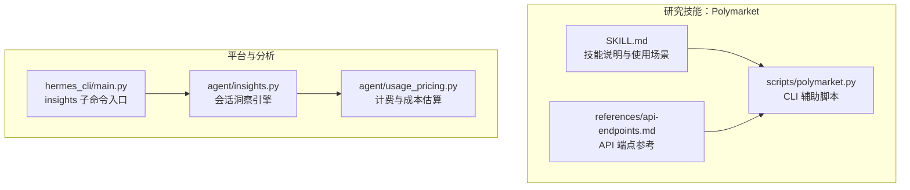
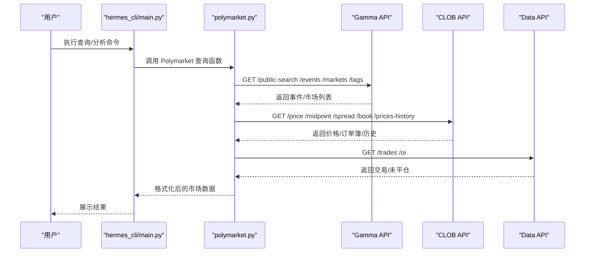
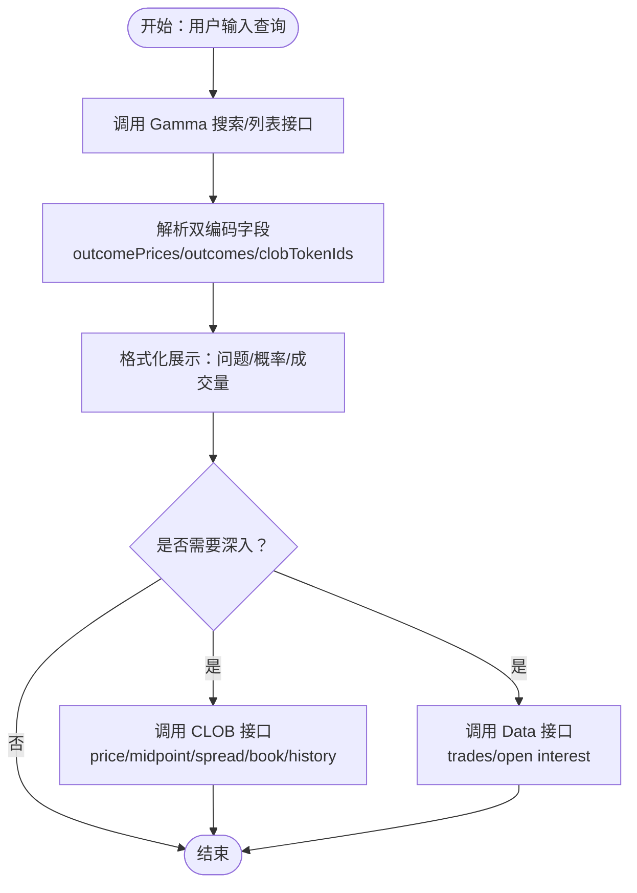
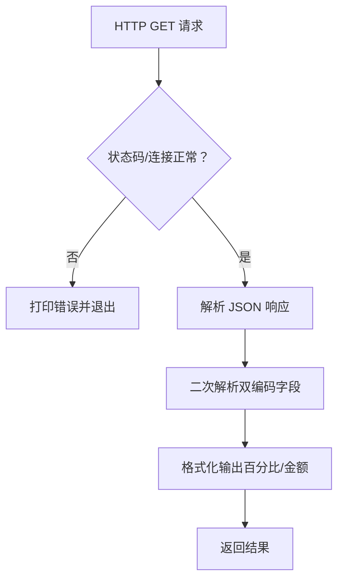
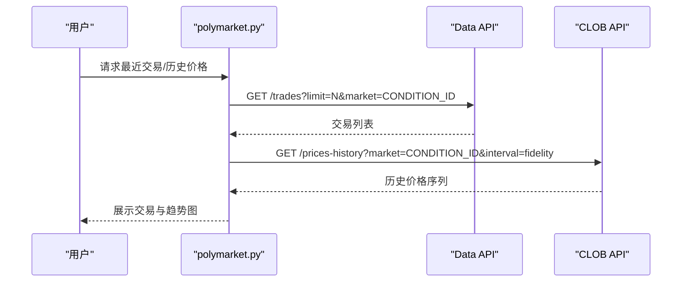
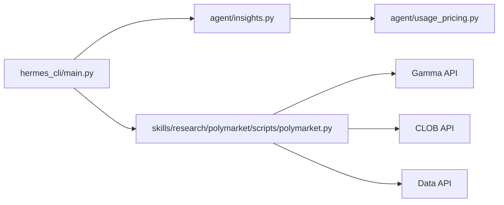

# 市场情报工具

<cite>
**本文引用的文件**
- [skills/research/polymarket/SKILL.md](file://skills/research/polymarket/SKILL.md)
- [skills/research/polymarket/references/api-endpoints.md](file://skills/research/polymarket/references/api-endpoints.md)
- [skills/research/polymarket/scripts/polymarket.py](file://skills/research/polymarket/scripts/polymarket.py)
- [agent/insights.py](file://agent/insights.py)
- [hermes_cli/main.py](file://hermes_cli/main.py)
- [agent/usage_pricing.py](file://agent/usage_pricing.py)
</cite>

## 目录
1. [简介](#简介)
2. [项目结构](#项目结构)
3. [核心组件](#核心组件)
4. [架构总览](#架构总览)
5. [详细组件分析](#详细组件分析)
6. [依赖关系分析](#依赖关系分析)
7. [性能考量](#性能考量)
8. [故障排查指南](#故障排查指南)
9. [结论](#结论)
10. [附录](#附录)

## 简介
本文件面向“市场情报工具”的设计与使用，聚焦于对 Polymarket 预测市场的 API 集成、数据获取策略与市场分析能力。内容覆盖：
- Polymarket 三大公开 API 的调用方式与数据结构解析
- 市场数据的采集流程、展示格式与解析要点（含双编码字段）
- 交易活动监控与价格趋势分析方法
- 决策支持与风险评估的分析框架
- 数据可视化、趋势识别与异常检测思路
- 金融数据使用的合规性与风险管理建议

## 项目结构
围绕市场情报工具的相关模块主要位于 skills/research/polymarket 目录，并与系统内的洞察引擎、CLI 入口及计费定价模块协同工作。

**图表来源**
- [skills/research/polymarket/SKILL.md:1-77](file://skills/research/polymarket/SKILL.md#L1-L77)
- [skills/research/polymarket/references/api-endpoints.md:1-221](file://skills/research/polymarket/references/api-endpoints.md#L1-L221)
- [skills/research/polymarket/scripts/polymarket.py:1-285](file://skills/research/polymarket/scripts/polymarket.py#L1-L285)
- [hermes_cli/main.py:5624-5645](file://hermes_cli/main.py#L5624-L5645)
- [agent/insights.py:1-200](file://agent/insights.py#L1-L200)
- [agent/usage_pricing.py:1-200](file://agent/usage_pricing.py#L1-L200)

**章节来源**
- [skills/research/polymarket/SKILL.md:1-77](file://skills/research/polymarket/SKILL.md#L1-L77)
- [skills/research/polymarket/references/api-endpoints.md:1-221](file://skills/research/polymarket/references/api-endpoints.md#L1-L221)
- [skills/research/polymarket/scripts/polymarket.py:1-285](file://skills/research/polymarket/scripts/polymarket.py#L1-L285)
- [hermes_cli/main.py:5624-5645](file://hermes_cli/main.py#L5624-L5645)
- [agent/insights.py:1-200](file://agent/insights.py#L1-L200)
- [agent/usage_pricing.py:1-200](file://agent/usage_pricing.py#L1-L200)

## 核心组件
- Polymarket 技能（SKILL.md）：定义了技能用途、关键概念、三类 API（Gamma/CLOB/Data）、典型工作流、结果呈现规范、速率限制与局限性。
- API 参考（api-endpoints.md）：提供 Gamma、CLOB、Data 三类 API 的端点清单、参数与响应结构，明确字段交叉关系（如 clobTokenIds、conditionId）。
- CLI 脚本（polymarket.py）：封装 HTTP GET 请求、错误处理、字段解析（双编码 JSON）、百分比与金额格式化、命令行接口与子命令（search/trending/market/event/price/book/history/trades）。
- 洞察引擎（insights.py）：从会话数据库中提取历史会话、消息与工具使用数据，生成概览、模型/平台/工具使用、活动模式与高价值会话等报告。
- CLI 入口（hermes_cli/main.py）：注册 insights 子命令，接收 --days 与 --source 参数，调用洞察引擎并输出终端可读报告。
- 计费与成本（usage_pricing.py）：提供令牌用量、成本估算、计费路由与定价条目等基础设施，用于在洞察报告中加入成本维度。

**章节来源**
- [skills/research/polymarket/SKILL.md:16-77](file://skills/research/polymarket/SKILL.md#L16-L77)
- [skills/research/polymarket/references/api-endpoints.md:5-221](file://skills/research/polymarket/references/api-endpoints.md#L5-L221)
- [skills/research/polymarket/scripts/polymarket.py:26-285](file://skills/research/polymarket/scripts/polymarket.py#L26-L285)
- [agent/insights.py:94-162](file://agent/insights.py#L94-L162)
- [hermes_cli/main.py:5624-5645](file://hermes_cli/main.py#L5624-L5645)
- [agent/usage_pricing.py:27-76](file://agent/usage_pricing.py#L27-L76)

## 架构总览
市场情报工具的运行链路如下：
- 用户通过 CLI 或平台入口发起查询或分析请求
- 对于 Polymarket 数据，CLI 调用脚本执行 HTTP GET 请求，解析响应并格式化输出
- 对于会话与使用洞察，CLI 调用洞察引擎，从数据库中抽取数据并生成报告
- 成本维度由计费模块提供支撑，用于在报告中体现 token 使用与成本估算

**图表来源**
- [hermes_cli/main.py:5624-5645](file://hermes_cli/main.py#L5624-L5645)
- [skills/research/polymarket/scripts/polymarket.py:26-285](file://skills/research/polymarket/scripts/polymarket.py#L26-L285)
- [skills/research/polymarket/references/api-endpoints.md:5-221](file://skills/research/polymarket/references/api-endpoints.md#L5-L221)

## 详细组件分析

### Polymarket 技能与 API 集成
- 技能定位：提供只读的预测市场数据查询能力，无需认证；适用于搜索、浏览、实时价格、订单簿、历史走势与近期交易等场景。
- 关键概念：
  - 事件包含多个市场（1:N），市场为二元结果（Yes/No），价格即概率
  - outcomePrices、outcomes、clobTokenIds 为双编码 JSON 字符串，需二次解析
  - conditionId 用于历史价格与交易数据查询
- 典型工作流：搜索 → 解析事件与市场 → 展示问题、概率与成交量 → 深入查询订单簿与历史
- 结果呈现：将概率格式化为百分比，显示市场问题、概率与成交量；必要时输出 slug、token_id、conditionId 等标识

**图表来源**
- [skills/research/polymarket/SKILL.md:40-56](file://skills/research/polymarket/SKILL.md#L40-L56)
- [skills/research/polymarket/references/api-endpoints.md:13-83](file://skills/research/polymarket/references/api-endpoints.md#L13-L83)
- [skills/research/polymarket/scripts/polymarket.py:71-95](file://skills/research/polymarket/scripts/polymarket.py#L71-L95)

**章节来源**
- [skills/research/polymarket/SKILL.md:16-77](file://skills/research/polymarket/SKILL.md#L16-L77)
- [skills/research/polymarket/references/api-endpoints.md:5-221](file://skills/research/polymarket/references/api-endpoints.md#L5-L221)
- [skills/research/polymarket/scripts/polymarket.py:71-232](file://skills/research/polymarket/scripts/polymarket.py#L71-L232)

### 数据获取策略与解析要点
- 错误处理：统一捕获 HTTP 与连接错误，打印错误信息并退出
- 字段解析：对 outcomePrices、outcomes、clobTokenIds 进行二次 JSON 解析
- 格式化：概率转百分比、成交量转人类可读单位（K/M）
- 命令行：支持 search、trending、market、event、price、book、history、trades 等子命令

**图表来源**
- [skills/research/polymarket/scripts/polymarket.py:26-69](file://skills/research/polymarket/scripts/polymarket.py#L26-L69)

**章节来源**
- [skills/research/polymarket/scripts/polymarket.py:26-69](file://skills/research/polymarket/scripts/polymarket.py#L26-L69)

### 交易活动监控与价格趋势分析
- 交易活动监控：通过 Data API 的 trades 接口获取近期交易，包含方向、价格、数量、时间戳、市场标识等字段，可用于监测流动性与异常交易。
- 价格趋势分析：通过 CLOB 的 prices-history 接口获取历史价格序列（时间戳与概率），结合订单簿 bids/asks 观察买卖压力与价差变化。
- 异常检测思路：基于历史窗口统计（均值、标准差、分位数）识别极端波动；对比近期交易量与历史均值偏离度；观察订单簿深度变化与价差异常扩大。

**图表来源**
- [skills/research/polymarket/references/api-endpoints.md:195-210](file://skills/research/polymarket/references/api-endpoints.md#L195-L210)
- [skills/research/polymarket/references/api-endpoints.md:139-162](file://skills/research/polymarket/references/api-endpoints.md#L139-L162)
- [skills/research/polymarket/scripts/polymarket.py:214-232](file://skills/research/polymarket/scripts/polymarket.py#L214-L232)
- [skills/research/polymarket/scripts/polymarket.py:198-212](file://skills/research/polymarket/scripts/polymarket.py#L198-L212)

**章节来源**
- [skills/research/polymarket/references/api-endpoints.md:195-210](file://skills/research/polymarket/references/api-endpoints.md#L195-L210)
- [skills/research/polymarket/references/api-endpoints.md:139-162](file://skills/research/polymarket/references/api-endpoints.md#L139-L162)
- [skills/research/polymarket/scripts/polymarket.py:198-232](file://skills/research/polymarket/scripts/polymarket.py#L198-L232)

### 决策支持与风险评估
- 决策支持：将市场概率转换为百分比，结合成交量与流动性指标辅助判断事件发生的可信度；对新市场或流动性不足的市场保持谨慎。
- 风险评估：关注价差（spread）与订单簿深度，价差扩大可能意味着流动性风险上升；历史价格波动率与近期交易量异常可作为潜在风险信号。
- 合规与限制：技能为只读访问，不支持下单；部分新市场可能出现历史数据为空；交易受地理限制但只读数据全球可用。

**章节来源**
- [skills/research/polymarket/SKILL.md:64-77](file://skills/research/polymarket/SKILL.md#L64-L77)

### 市场情报分析框架
- 数据可视化：将历史价格序列按时间轴绘制，配合概率条形图直观展示趋势；交易列表可按时间排序并标注方向与规模。
- 趋势识别：采用移动平均、分位数区间与回归拟合识别上升/下降/震荡趋势；结合成交量确认趋势强度。
- 异常检测：设定阈值（如价格偏离均值 N 倍标准差、价差超过历史上界）触发预警；结合订单簿深度变化与交易量突增进行交叉验证。

[本节为概念性内容，不直接分析具体文件，故无“章节来源”]

## 依赖关系分析
- Polymarket 技能依赖于三个公开 API（Gamma/CLOB/Data），并通过 CLI 脚本进行统一调用与格式化输出。
- CLI 入口（hermes_cli/main.py）注册 insights 子命令，调用洞察引擎（agent/insights.py）生成报告。
- 洞察引擎依赖计费模块（agent/usage_pricing.py）进行成本估算与展示。

**图表来源**
- [hermes_cli/main.py:5624-5645](file://hermes_cli/main.py#L5624-L5645)
- [agent/insights.py:94-162](file://agent/insights.py#L94-L162)
- [agent/usage_pricing.py:27-76](file://agent/usage_pricing.py#L27-L76)
- [skills/research/polymarket/scripts/polymarket.py:21-23](file://skills/research/polymarket/scripts/polymarket.py#L21-L23)

**章节来源**
- [hermes_cli/main.py:5624-5645](file://hermes_cli/main.py#L5624-L5645)
- [agent/insights.py:94-162](file://agent/insights.py#L94-L162)
- [agent/usage_pricing.py:27-76](file://agent/usage_pricing.py#L27-L76)
- [skills/research/polymarket/scripts/polymarket.py:21-23](file://skills/research/polymarket/scripts/polymarket.py#L21-L23)

## 性能考量
- 速率限制：Gamma/CLOB/Data 三类 API 均提供较高限额，常规使用下不易达到上限；建议在批量查询时增加退避与并发控制。
- 延迟优化：优先使用缓存策略（如对高频查询的市场 slug/conditionId 缓存）与分页参数（limit/offset）控制响应大小。
- 数据解析：对双编码字段进行一次性解析，避免重复解析带来的开销；格式化输出前进行数值校验，减少无效渲染。

[本节为通用建议，不直接分析具体文件，故无“章节来源”]

## 故障排查指南
- HTTP/URL 错误：检查网络连通性与目标域名可达性；确认 User-Agent 头设置；根据错误码调整重试策略。
- 响应格式异常：确认返回为 JSON；对双编码字段进行二次解析；对空数组/缺失字段进行容错处理。
- 速率限制：当出现频繁失败时，降低请求频率或增加退避等待；对批量任务分批执行。
- 输出格式问题：确保概率与金额格式化函数正确处理边界值（如非数字字符串）。

**章节来源**
- [skills/research/polymarket/scripts/polymarket.py:26-69](file://skills/research/polymarket/scripts/polymarket.py#L26-L69)

## 结论
市场情报工具以 Polymarket 的公开 API 为基础，提供了从数据获取、解析到可视化的完整链路。通过洞察引擎与 CLI 的结合，用户可以快速获得市场概览、交易活动与趋势分析，并在此基础上进行决策支持与风险评估。建议在实际部署中结合缓存、限速与异常处理机制，确保稳定性与可扩展性。

[本节为总结性内容，不直接分析具体文件，故无“章节来源”]

## 附录

### API 端点与字段速查
- Gamma API：public-search、events、markets、tags
- CLOB API：price、midpoint、spread、book、prices-history、markets
- Data API：trades、oi
- 关键字段交叉：clobTokenIds（用于 CLOB 查询）、conditionId（用于历史与交易查询）

**章节来源**
- [skills/research/polymarket/references/api-endpoints.md:5-221](file://skills/research/polymarket/references/api-endpoints.md#L5-L221)

### CLI 使用示例（路径）
- 搜索市场：[scripts/polymarket.py:96-112](file://skills/research/polymarket/scripts/polymarket.py#L96-L112)
- 热门事件：[scripts/polymarket.py:114-128](file://skills/research/polymarket/scripts/polymarket.py#L114-L128)
- 市场详情：[scripts/polymarket.py:130-150](file://skills/research/polymarket/scripts/polymarket.py#L130-L150)
- 事件详情：[scripts/polymarket.py:152-166](file://skills/research/polymarket/scripts/polymarket.py#L152-L166)
- 当前价格/订单簿/历史/交易：[scripts/polymarket.py:168-232](file://skills/research/polymarket/scripts/polymarket.py#L168-L232)

**章节来源**
- [skills/research/polymarket/scripts/polymarket.py:96-232](file://skills/research/polymarket/scripts/polymarket.py#L96-L232)

### 洞察引擎与成本估算
- 洞察生成：[agent/insights.py:112-162](file://agent/insights.py#L112-L162)
- 成本估算：[agent/usage_pricing.py:42-79](file://agent/usage_pricing.py#L42-L79)

**章节来源**
- [agent/insights.py:112-162](file://agent/insights.py#L112-L162)
- [agent/usage_pricing.py:42-79](file://agent/usage_pricing.py#L42-L79)