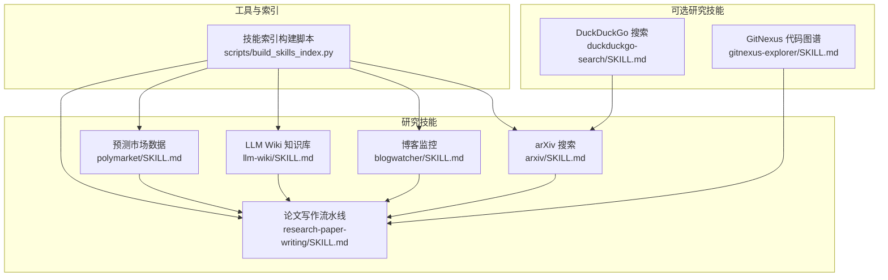
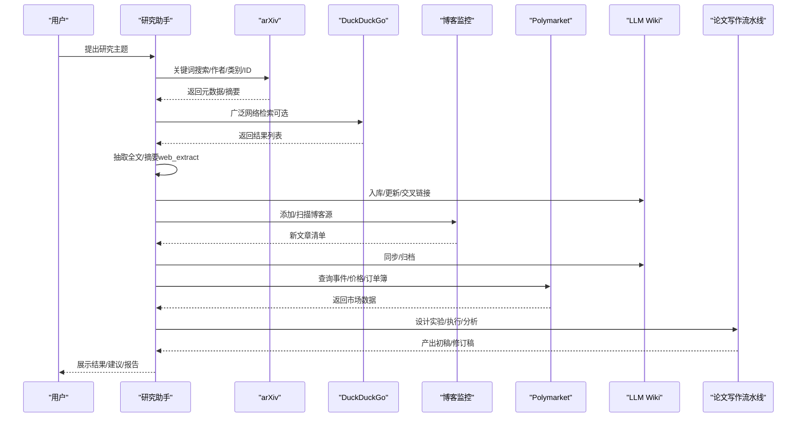
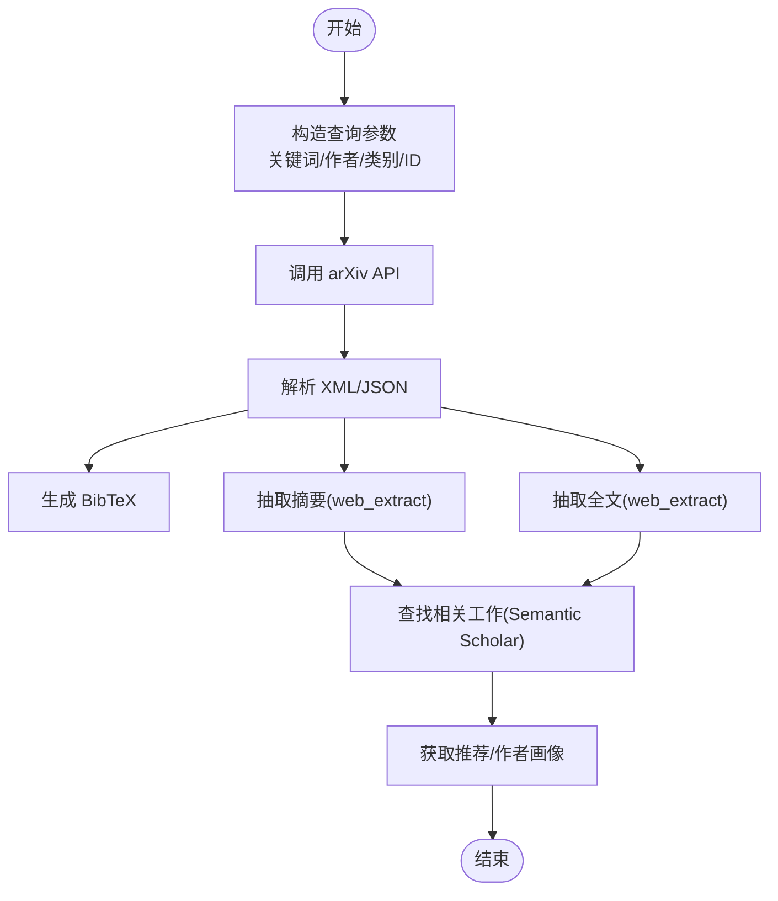
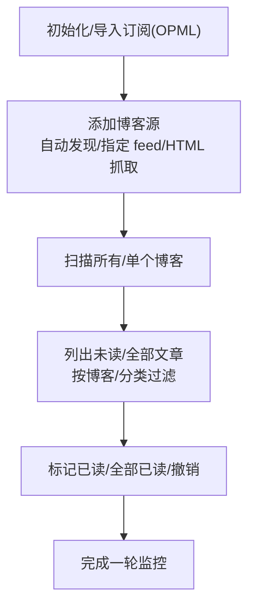
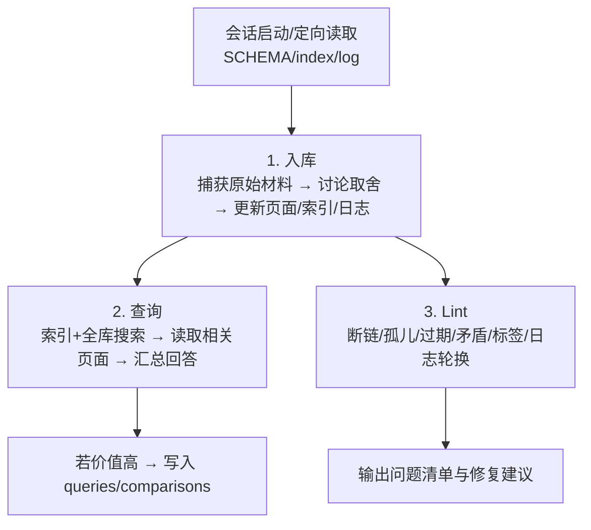
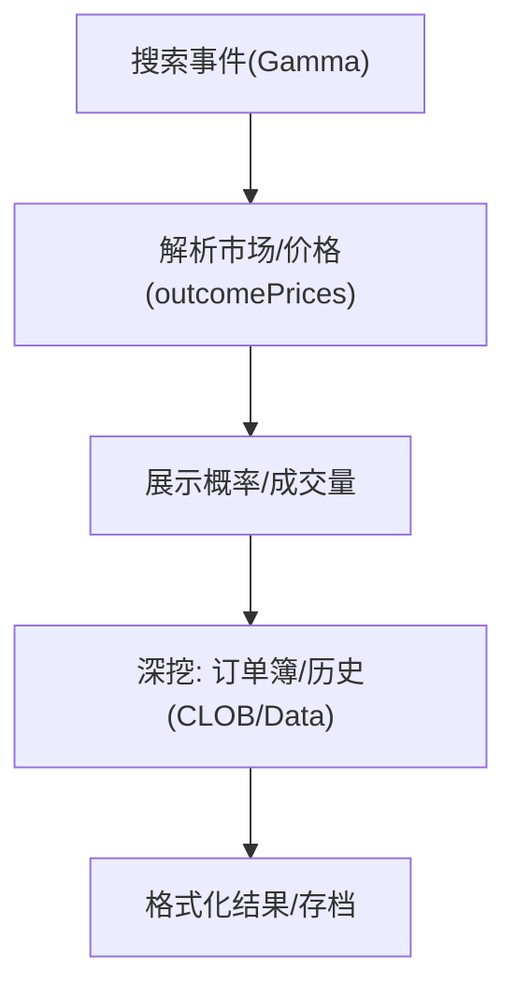
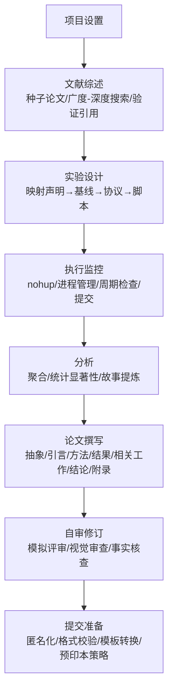
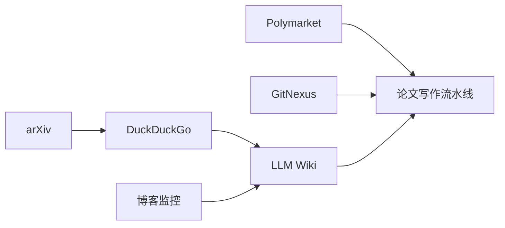
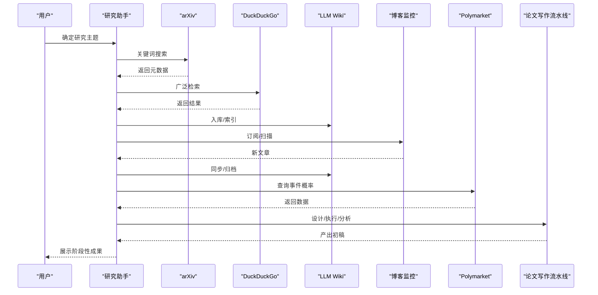

# 研究助手

<cite>
**本文引用的文件**
- [README.md](file://README.md)
- [skills/research/DESCRIPTION.md](file://skills/research/DESCRIPTION.md)
- [skills/research/arxiv/SKILL.md](file://skills/research/arxiv/SKILL.md)
- [skills/research/blogwatcher/SKILL.md](file://skills/research/blogwatcher/SKILL.md)
- [skills/research/llm-wiki/SKILL.md](file://skills/research/llm-wiki/SKILL.md)
- [skills/research/polymarket/SKILL.md](file://skills/research/polymarket/SKILL.md)
- [skills/research/research-paper-writing/SKILL.md](file://skills/research/research-paper-writing/SKILL.md)
- [optional-skills/research/duckduckgo-search/SKILL.md](file://optional-skills/research/duckduckgo-search/SKILL.md)
- [optional-skills/research/gitnexus-explorer/SKILL.md](file://optional-skills/research/gitnexus-explorer/SKILL.md)
- [scripts/build_skills_index.py](file://scripts/build_skills_index.py)
</cite>

## 目录
1. [简介](#简介)
2. [项目结构](#项目结构)
3. [核心组件](#核心组件)
4. [架构总览](#架构总览)
5. [详细组件分析](#详细组件分析)
6. [依赖关系分析](#依赖关系分析)
7. [性能与可扩展性](#性能与可扩展性)
8. [故障排查指南](#故障排查指南)
9. [结论](#结论)
10. [附录：研究工作流示例](#附录研究工作流示例)

## 简介
本文件面向“Hermes Agent 研究助手”技能集合，系统化梳理 arXiv 论文搜索、博客监控、LLM Wiki 知识库、Polymarket 预测市场与研究论文写作五大研究能力，阐明其功能特性、数据来源、使用方法与自动化工作流。文档同时提供从文献收集到报告生成的端到端实践路径，帮助研究者以 AI 技能显著提升研究效率，并给出学术规范、引用格式与知识产权注意事项。

## 项目结构
研究相关技能位于 skills/research 目录下，配套可选研究技能位于 optional-skills/research。仓库还包含一个构建技能索引的脚本，用于集中管理与分发技能元数据。

图表来源
- [skills/research/arxiv/SKILL.md:1-282](file://skills/research/arxiv/SKILL.md#L1-L282)
- [skills/research/blogwatcher/SKILL.md:1-137](file://skills/research/blogwatcher/SKILL.md#L1-L137)
- [skills/research/llm-wiki/SKILL.md:1-461](file://skills/research/llm-wiki/SKILL.md#L1-L461)
- [skills/research/polymarket/SKILL.md:1-77](file://skills/research/polymarket/SKILL.md#L1-L77)
- [skills/research/research-paper-writing/SKILL.md:1-2358](file://skills/research/research-paper-writing/SKILL.md#L1-L2358)
- [optional-skills/research/duckduckgo-search/SKILL.md:1-238](file://optional-skills/research/duckduckgo-search/SKILL.md#L1-L238)
- [optional-skills/research/gitnexus-explorer/SKILL.md:1-214](file://optional-skills/research/gitnexus-explorer/SKILL.md#L1-L214)
- [scripts/build_skills_index.py:1-326](file://scripts/build_skills_index.py#L1-L326)

章节来源
- [README.md:1-179](file://README.md#L1-L179)
- [skills/research/DESCRIPTION.md:1-4](file://skills/research/DESCRIPTION.md#L1-L4)

## 核心组件
- arXiv 学术搜索：基于免费 REST API 的论文检索、摘要提取、BibTeX 生成与语义学者（Semantic Scholar）补充查询。
- 博客监控：通过 blogwatcher-cli 自动发现 RSS/Atom、抓取文章、跟踪未读状态与分类过滤。
- LLM Wiki 知识库：三层结构（原始资料、实体/概念/比较/查询页面、Schema），支持增量维护、交叉链接与健康检查。
- Polymarket 预测市场：公开 REST API 查询事件、价格、订单簿与历史，无需认证。
- 论文写作流水线：覆盖从实验设计、执行监控、结果分析到论文撰写、自审修订与提交准备的全生命周期。

章节来源
- [skills/research/arxiv/SKILL.md:1-282](file://skills/research/arxiv/SKILL.md#L1-L282)
- [skills/research/blogwatcher/SKILL.md:1-137](file://skills/research/blogwatcher/SKILL.md#L1-L137)
- [skills/research/llm-wiki/SKILL.md:1-461](file://skills/research/llm-wiki/SKILL.md#L1-L461)
- [skills/research/polymarket/SKILL.md:1-77](file://skills/research/polymarket/SKILL.md#L1-L77)
- [skills/research/research-paper-writing/SKILL.md:1-2358](file://skills/research/research-paper-writing/SKILL.md#L1-L2358)

## 架构总览
研究助手以“技能即工具”的方式组织能力，围绕以下主线协作：
- 文献发现与整理：arXiv + 可选 DuckDuckGo 搜索 → 文章抽取 → LLM Wiki 归档
- 动态监测：博客监控持续扫描 → 新文章入库 → 与 Wiki 对齐
- 市场洞察：Polymarket 数据 → 结果解析 → 与研究主题关联
- 实验与写作：实验设计 → 执行监控 → 统计分析 → 论文撰写 → 自审修订 → 提交准备

图表来源
- [skills/research/arxiv/SKILL.md:1-282](file://skills/research/arxiv/SKILL.md#L1-L282)
- [optional-skills/research/duckduckgo-search/SKILL.md:1-238](file://optional-skills/research/duckduckgo-search/SKILL.md#L1-L238)
- [skills/research/blogwatcher/SKILL.md:1-137](file://skills/research/blogwatcher/SKILL.md#L1-L137)
- [skills/research/polymarket/SKILL.md:1-77](file://skills/research/polymarket/SKILL.md#L1-L77)
- [skills/research/llm-wiki/SKILL.md:1-461](file://skills/research/llm-wiki/SKILL.md#L1-L461)
- [skills/research/research-paper-writing/SKILL.md:1-2358](file://skills/research/research-paper-writing/SKILL.md#L1-L2358)

## 详细组件分析

### arXiv 学术搜索
- 功能特性
  - 免费 REST API 检索：关键词、作者、类别、ID、注释字段组合查询
  - 排序与分页：按相关度/更新时间/提交时间排序，支持偏移与最大结果数
  - BibTeX 生成：从元数据派生标准引用条目
  - 语义学者补充：引用计数、参考文献、推荐、作者画像
- 数据来源
  - arXiv API（Atom XML）、Semantic Scholar API（JSON）
- 使用方法
  - 命令行直接调用或结合 web_extract 获取全文
  - 使用 helper 脚本进行解析与输出美化
- 自动化要点
  - 发现 → 评估影响 → 抽取摘要/全文 → 查找相关工作/推荐 → 跟踪作者
  - 注意版本号与撤稿/更正提示，避免引用漂移

图表来源
- [skills/research/arxiv/SKILL.md:1-282](file://skills/research/arxiv/SKILL.md#L1-L282)

章节来源
- [skills/research/arxiv/SKILL.md:1-282](file://skills/research/arxiv/SKILL.md#L1-L282)

### 博客监控
- 功能特性
  - 自动发现 RSS/Atom 源，HTML 抓取回退
  - OPML 导入、批量添加、扫描与过滤
  - 未读/已读标记、按博客/分类筛选
- 数据来源
  - 各博客/站点的 RSS/Atom 或 HTML
- 使用方法
  - 安装 blogwatcher-cli（多平台二进制/容器）
  - 添加博客源、扫描、列出未读文章、标记状态
- 自动化要点
  - 持久化数据库（默认 ~/.blogwatcher-cli/blogwatcher-cli.db）
  - 环境变量控制并发、静默模式、默认分类等

图表来源
- [skills/research/blogwatcher/SKILL.md:1-137](file://skills/research/blogwatcher/SKILL.md#L1-L137)

章节来源
- [skills/research/blogwatcher/SKILL.md:1-137](file://skills/research/blogwatcher/SKILL.md#L1-L137)

### LLM Wiki 知识库
- 功能特性
  - 三层结构：原始资料(raw)、实体/概念/比较/查询页面、Schema
  - 持续维护：定向抓取、讨论取舍、跨页链接、索引与日志
  - 健康检查：断链、孤儿页、过期内容、标签审计、日志轮换
- 数据来源
  - 网页/论文/会议记录/笔记等原始材料
- 使用方法
  - 初始化目录结构与 SCHEMA/index/log
  - 入库 → 查询 → Lint → 归档/拆分
  - 支持 Obsidian 集成与 Headless 同步
- 自动化要点
  - 先定向后全局：先查索引再全库搜索
  - 批量更新：一次扫描识别所有实体/概念，统一更新
  - 严格遵循约定：标题/日期/类型/标签/来源/交叉引用

图表来源
- [skills/research/llm-wiki/SKILL.md:1-461](file://skills/research/llm-wiki/SKILL.md#L1-L461)

章节来源
- [skills/research/llm-wiki/SKILL.md:1-461](file://skills/research/llm-wiki/SKILL.md#L1-L461)

### Polymarket 预测市场
- 功能特性
  - 三类公开 API：Gamma（发现/搜索）、CLOB（实时价格/订单簿/历史）、Data（交易/未平仓）
  - 事件-市场-结果映射：二元结果（Yes/No），价格即概率
  - 解析双编码字段：outcomePrices/outcomes/clobTokenIds
- 数据来源
  - polymarket.com 公共 API
- 使用方法
  - 搜索事件 → 解析嵌套市场 → 展示当前价格与成交量 → 深挖订单簿/历史
- 自动化要点
  - 速率限制宽松；只读接口；注意地理限制与空历史

图表来源
- [skills/research/polymarket/SKILL.md:1-77](file://skills/research/polymarket/SKILL.md#L1-L77)

章节来源
- [skills/research/polymarket/SKILL.md:1-77](file://skills/research/polymarket/SKILL.md#L1-L77)

### 论文写作流水线
- 功能特性
  - 全生命周期：项目设置 → 文献综述 → 实验设计 → 执行监控 → 分析 → 撰写 → 自审修订 → 提交准备
  - 迭代闭环：结果触发新实验，评审驱动新分析
  - 多范式论文：实证/理论/调查/基准/立场等类型指导
- 数据来源
  - arXiv/语义学者/网页/实验结果/模板
- 使用方法
  - 选择目标会议/工作坊 → 设定贡献 → 文献检索与验证 → 实验设计与执行 → 结果分析 → 论文撰写 → 自审修订 → 提交准备
- 自动化要点
  - 任务清单(todo)与记忆(memory)跨会话持久化
  - Cron 定时监控实验状态，静默协议抑制无变化通知
  - LaTeX 模板与专业宏包，严格格式校验

图表来源
- [skills/research/research-paper-writing/SKILL.md:1-2358](file://skills/research/research-paper-writing/SKILL.md#L1-L2358)

章节来源
- [skills/research/research-paper-writing/SKILL.md:1-2358](file://skills/research/research-paper-writing/SKILL.md#L1-L2358)

## 依赖关系分析
- arXiv 与 DuckDuckGo：前者专注学术元数据与 PDF，后者提供广泛网络检索作为补充
- 博客监控与 LLM Wiki：博客内容可作为 Wiki 的原始资料，形成持续的知识积累
- Polymarket 与论文写作：可用于“技术/政策/市场”主题的实证分析与案例研究
- GitNexus：在大型代码库中提供可视化知识图谱，辅助实验与写作中的技术背景理解

图表来源
- [skills/research/arxiv/SKILL.md:1-282](file://skills/research/arxiv/SKILL.md#L1-L282)
- [optional-skills/research/duckduckgo-search/SKILL.md:1-238](file://optional-skills/research/duckduckgo-search/SKILL.md#L1-L238)
- [skills/research/blogwatcher/SKILL.md:1-137](file://skills/research/blogwatcher/SKILL.md#L1-L137)
- [skills/research/llm-wiki/SKILL.md:1-461](file://skills/research/llm-wiki/SKILL.md#L1-L461)
- [skills/research/polymarket/SKILL.md:1-77](file://skills/research/polymarket/SKILL.md#L1-L77)
- [optional-skills/research/gitnexus-explorer/SKILL.md:1-214](file://optional-skills/research/gitnexus-explorer/SKILL.md#L1-L214)
- [skills/research/research-paper-writing/SKILL.md:1-2358](file://skills/research/research-paper-writing/SKILL.md#L1-L2358)

## 性能与可扩展性
- API 限速与幂等性
  - arXiv：约每 3 秒一次请求
  - 语义学者：1 次/秒（有密钥可达更高）
  - Polymarket：公开 API 速率限制宽松
- 批处理与并行
  - 批量入库：一次性扫描识别实体/概念，统一更新，减少重复 IO
  - 并行子代理：并行撰写不同章节，提高产出效率
- 工具与脚本
  - 使用终端工具执行长任务（nohup）、进程管理与周期检查
  - 使用 cronjob 定时任务，静默协议降低噪音

[本节为通用指导，不直接分析具体文件]

## 故障排查指南
- arXiv
  - 版本号与撤稿提示：保留实际阅读版本，避免引用漂移
  - XML/JSON 解析：注意命名空间与双编码字段
- DuckDuckGo
  - CLI 与 Python 运行时隔离：终端安装不等于 execute_code 可导入
  - max_results 必须关键字传参
- 博客监控
  - 数据库持久化：默认路径与环境变量 BLOGWATCHER_DB
  - 并发与静默：WORKERS 与 SILENT 控制
- LLM Wiki
  - 断链/孤儿页/过期内容/标签审计：按 Lint 流程逐项检查
  - 日志轮换：超过阈值重命名并新建
- Polymarket
  - 双编码字段解析：outcomePrices/outcomes/clobTokenIds 需二次解析
  - 地理限制：读取数据全球可用，但交易需钱包认证
- GitNexus
  - 生产构建：隧道访问需生产构建与同源代理
  - 浏览器内存：节点过多可能导致卡顿或崩溃
- 论文写作
  - LaTeX 编译：chktex 预检、引用存在性检查、标签唯一性检查
  - 模板迁移：不要复制前言到不同模板，按页数调整并补全要求部分

章节来源
- [skills/research/arxiv/SKILL.md:1-282](file://skills/research/arxiv/SKILL.md#L1-L282)
- [optional-skills/research/duckduckgo-search/SKILL.md:1-238](file://optional-skills/research/duckduckgo-search/SKILL.md#L1-L238)
- [skills/research/blogwatcher/SKILL.md:1-137](file://skills/research/blogwatcher/SKILL.md#L1-L137)
- [skills/research/llm-wiki/SKILL.md:1-461](file://skills/research/llm-wiki/SKILL.md#L1-L461)
- [skills/research/polymarket/SKILL.md:1-77](file://skills/research/polymarket/SKILL.md#L1-L77)
- [optional-skills/research/gitnexus-explorer/SKILL.md:1-214](file://optional-skills/research/gitnexus-explorer/SKILL.md#L1-L214)
- [skills/research/research-paper-writing/SKILL.md:1-2358](file://skills/research/research-paper-writing/SKILL.md#L1-L2358)

## 结论
研究助手技能通过“发现—整理—分析—产出”的闭环，将 arXiv、博客、Wiki、预测市场与论文写作有机整合，既满足快速检索与持续监测，也支撑高质量论文的迭代产出。配合任务清单、记忆与定时任务，研究工作可实现低干扰、高复用与可持续演进。

[本节为总结性内容，不直接分析具体文件]

## 附录：研究工作流示例
以下示例展示如何利用 AI 技能提升研究效率，涵盖从主题确定到论文产出的关键步骤。

- 主题确定与文献发现
  - 使用 arXiv 搜索关键词，结合语义学者评估影响力
  - 若需要更广泛的背景，使用 DuckDuckGo 搜索补充
  - 将摘要与全文抽取至 LLM Wiki，建立领域知识库
- 持续监测与知识沉淀
  - 使用博客监控订阅相关站点，自动扫描并入库
  - 在 Wiki 中对齐新增内容，保持交叉引用与索引更新
- 市场与趋势分析
  - 使用 Polymarket 查询相关事件的概率与历史，辅助实证分析
- 实验与写作
  - 设计实验并执行监控，定期汇总结果
  - 利用论文写作流水线撰写初稿，进行自审修订
  - 准备提交材料，遵守匿名化与格式要求

图表来源
- [skills/research/arxiv/SKILL.md:1-282](file://skills/research/arxiv/SKILL.md#L1-L282)
- [optional-skills/research/duckduckgo-search/SKILL.md:1-238](file://optional-skills/research/duckduckgo-search/SKILL.md#L1-L238)
- [skills/research/llm-wiki/SKILL.md:1-461](file://skills/research/llm-wiki/SKILL.md#L1-L461)
- [skills/research/blogwatcher/SKILL.md:1-137](file://skills/research/blogwatcher/SKILL.md#L1-L137)
- [skills/research/polymarket/SKILL.md:1-77](file://skills/research/polymarket/SKILL.md#L1-L77)
- [skills/research/research-paper-writing/SKILL.md:1-2358](file://skills/research/research-paper-writing/SKILL.md#L1-L2358)

## 学术规范、引用格式与知识产权
- 引用规范
  - 严禁凭记忆生成引用，必须程序化获取（如 arXiv API、语义学者、CrossRef）
  - BibTeX 条目应包含：标题、作者、年份、电子编号、存档前缀、主要分类、URL
  - 对无法验证的条目标注占位符并告知用户
- 知识产权
  - 遵循各平台/期刊的版权与许可要求
  - 预印本发布需考虑匿名期与后续投稿政策（如 NeurIPS/ICML/ACL 等）
  - 代码与数据发布遵循 MIT/Apache 2.0 等开源许可
- 伦理与影响声明
  - 按目标会议要求撰写“更广泛影响声明”，涵盖社会影响、潜在风险、公平性、隐私与环境影响
- 会议与模板
  - 使用官方样式文件，严格遵守页数限制、盲审匿名化与必需部分（如局限性、伦理声明）

章节来源
- [skills/research/research-paper-writing/SKILL.md:1-2358](file://skills/research/research-paper-writing/SKILL.md#L1-L2358)