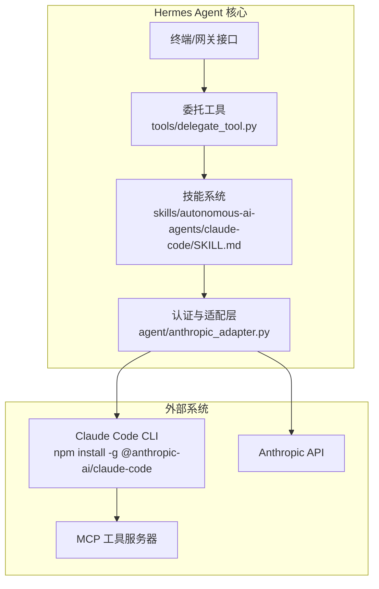
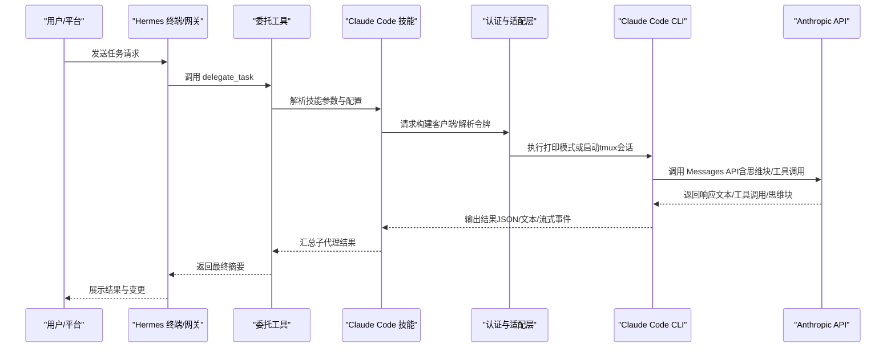
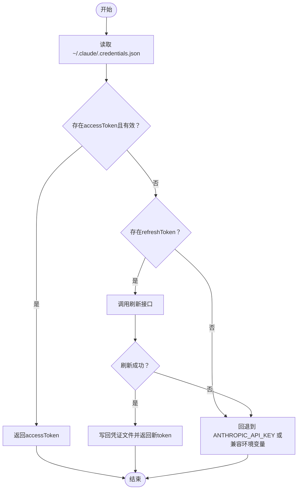
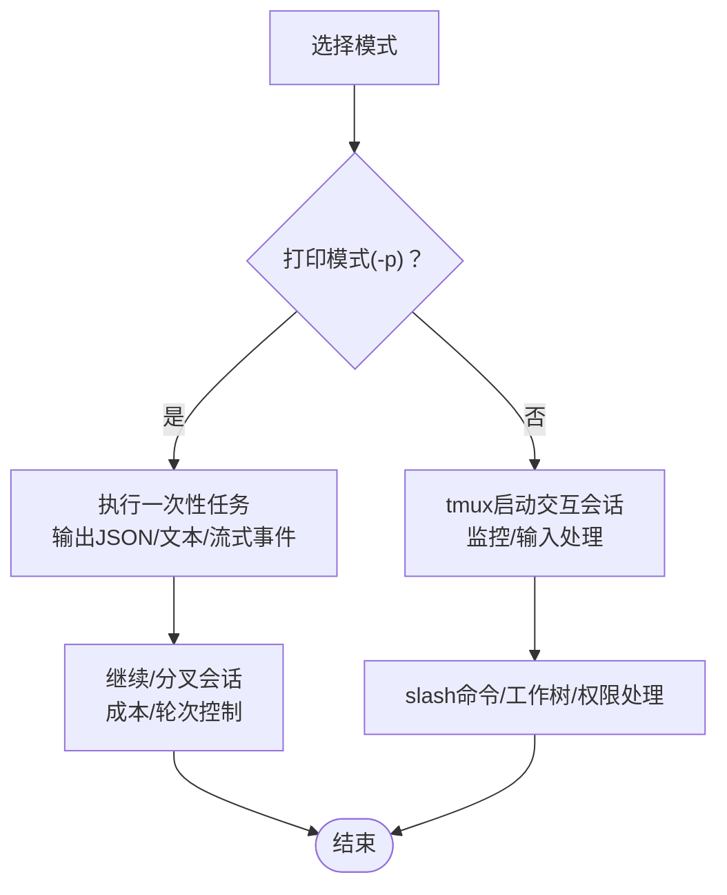
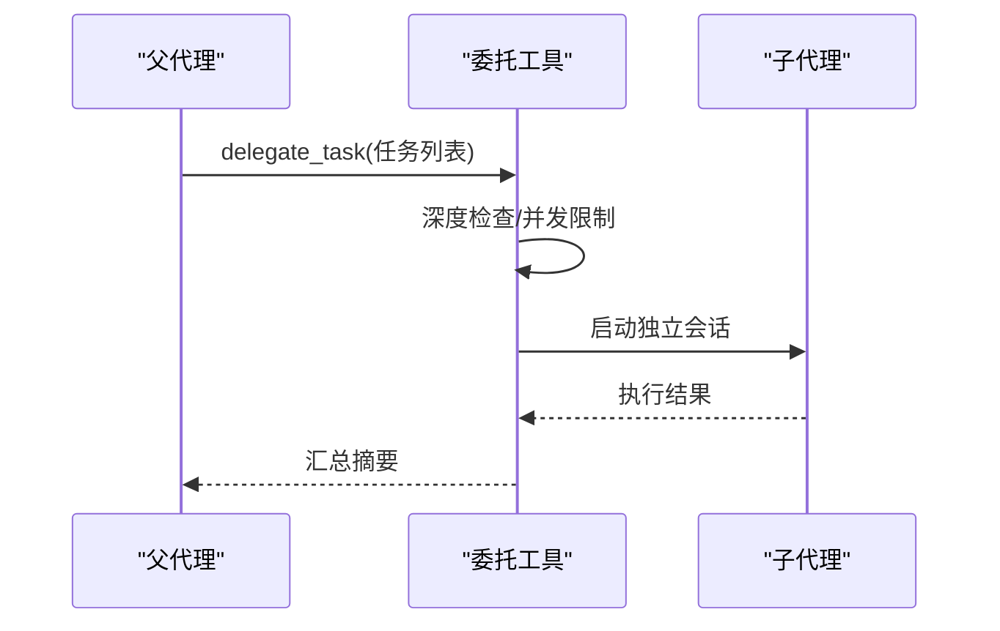
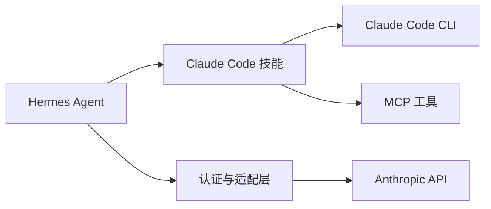

# Claude Code代理

<cite>
**本文引用的文件**
- [anthropic_adapter.py](file://agent/anthropic_adapter.py)
- [SKILL.md](file://skills/autonomous-ai-agents/claude-code/SKILL.md)
- [README.md](file://README.md)
- [skills-catalog.md](file://website/docs/reference/skills-catalog.md)
- [delegation.md](file://website/docs/user-guide/features/delegation.md)
- [delegate_tool.py](file://tools/delegate_tool.py)
- [test_anthropic_adapter.py](file://tests/agent/test_anthropic_adapter.py)
</cite>

## 目录
1. [简介](#简介)
2. [项目结构](#项目结构)
3. [核心组件](#核心组件)
4. [架构总览](#架构总览)
5. [详细组件分析](#详细组件分析)
6. [依赖关系分析](#依赖关系分析)
7. [性能考量](#性能考量)
8. [故障排查指南](#故障排查指南)
9. [结论](#结论)
10. [附录](#附录)

## 简介
本文件系统性阐述Claude Code代理（Autonomous AI Coding Agent）在Hermes Agent中的能力与实现。Claude Code代理通过两种模式与Claude Code CLI集成：非交互打印模式（-p）与交互式PTY（tmux）模式。前者适合一次性任务、自动化脚本与结构化输出；后者支持多轮对话、实时监控与slash命令。该代理在代码编写、分析与优化方面具备以下关键能力：
- 代码生成与重构：按需生成新模块、修复缺陷、优化结构
- 工具链集成：读取/编辑文件、执行shell命令、调用MCP工具
- 会话管理：继续/恢复/分叉会话、成本预算控制、超时限制
- 安全与权限：细粒度工具白名单、危险命令拦截、权限模式切换
- 多实例并行：独立任务并发执行，提升吞吐

此外，Hermes Agent提供统一的认证与适配层，兼容OAuth、Setup Token与API Key等多种鉴权方式，并对Anthropic Messages API进行消息格式转换与思维块签名处理，确保与第三方兼容端点的稳定性。

## 项目结构
围绕Claude Code代理的关键目录与文件：
- 技能定义与使用指南：skills/autonomous-ai-agents/claude-code/SKILL.md
- 认证与适配层：agent/anthropic_adapter.py
- 委托与子代理机制：tools/delegate_tool.py、website/docs/user-guide/features/delegation.md
- 文档索引：website/docs/reference/skills-catalog.md
- 测试用例：tests/agent/test_anthropic_adapter.py

**图表来源**
- [SKILL.md:1-745](file://skills/autonomous-ai-agents/claude-code/SKILL.md#L1-L745)
- [anthropic_adapter.py:1-1411](file://agent/anthropic_adapter.py#L1-L1411)
- [delegation.md:176-201](file://website/docs/user-guide/features/delegation.md#L176-L201)

**章节来源**
- [README.md:1-179](file://README.md#L1-L179)
- [skills-catalog.md:22-39](file://website/docs/reference/skills-catalog.md#L22-L39)

## 核心组件
- 认证与适配层（Anthropic Adapter）
  - 支持OAuth Setup Token、Bearer Auth与API Key三种鉴权路径
  - 自动检测Claude Code版本并设置User-Agent，保障OAuth路由正确
  - 提供令牌刷新、凭证持久化与优先级解析逻辑
  - 将Hermes内部消息格式转换为Anthropic Messages API所需格式，处理思维块签名与工具调用序列
- 技能（Claude Code）
  - 提供打印模式与交互模式的完整CLI参考、标志位与最佳实践
  - 支持结构化JSON输出、流式输出、会话继续/分叉、工作树隔离与tmux监控
  - 内置权限模型、Hook系统、自定义子代理与MCP集成
- 委托与子代理
  - 通过delegate_task创建独立子代理，限制深度（最多2层），继承父代理的凭据与模型配置
  - 子代理拥有独立终端会话，中断可传播至所有活跃子代理

**章节来源**
- [anthropic_adapter.py:243-566](file://agent/anthropic_adapter.py#L243-L566)
- [SKILL.md:1-745](file://skills/autonomous-ai-agents/claude-code/SKILL.md#L1-L745)
- [delegation.md:176-201](file://website/docs/user-guide/features/delegation.md#L176-L201)
- [delegate_tool.py:639-674](file://tools/delegate_tool.py#L639-L674)

## 架构总览
下图展示Hermes Agent如何通过认证与适配层对接Claude Code CLI与Anthropic API，以及与MCP工具的协作关系。

**图表来源**
- [anthropic_adapter.py:243-566](file://agent/anthropic_adapter.py#L243-L566)
- [SKILL.md:1-745](file://skills/autonomous-ai-agents/claude-code/SKILL.md#L1-L745)
- [delegation.md:176-201](file://website/docs/user-guide/features/delegation.md#L176-L201)

## 详细组件分析

### 组件A：认证与适配层（Anthropic Adapter）
- 功能要点
  - 鉴权优先级：环境变量（ANTHROPIC_TOKEN/CLAUDE_CODE_OAUTH_TOKEN）> Claude Code 凭证文件（~/.claude/.credentials.json）> ANTHROPIC_API_KEY
  - OAuth支持：自动检测Claude Code版本，设置User-Agent与必需beta头；支持刷新令牌并回写到凭证文件
  - 第三方端点兼容：针对MiniMax等不支持特定beta的端点动态裁剪头部；对思维块签名进行剥离或降级处理
  - 消息转换：将Hermes消息格式转换为Anthropic Messages API；处理工具调用、思维块签名、角色交替与空内容校验
  - 请求参数映射：模型名规范化、输出上限计算、推理配置（思维模式/努力级别）、快速模式（仅原生端点）
- 关键流程（令牌解析与刷新）

**图表来源**
- [anthropic_adapter.py:301-566](file://agent/anthropic_adapter.py#L301-L566)

**章节来源**
- [anthropic_adapter.py:243-566](file://agent/anthropic_adapter.py#L243-L566)
- [test_anthropic_adapter.py:147-359](file://tests/agent/test_anthropic_adapter.py#L147-L359)

### 组件B：Claude Code 技能（打印模式与交互模式）
- 打印模式（-p）
  - 一次性任务、无交互、适合自动化与CI
  - 支持结构化JSON输出、流式JSON事件、会话继续/分叉、成本预算与最大轮次限制
  - 可通过管道输入上下文，或指定系统提示追加/替换
- 交互模式（PTY via tmux）
  - 全功能REPL，支持slash命令、工作树隔离、权限对话处理
  - 通过tmux capture-pane监控进度，send-keys处理首次信任与权限确认
- MCP与Hook
  - 支持添加/列出/移除MCP服务器，严格配置模式
  - Hook系统覆盖PreToolUse/PostToolUse/Stop等事件，实现安全与自动化

**图表来源**
- [SKILL.md:28-117](file://skills/autonomous-ai-agents/claude-code/SKILL.md#L28-L117)

**章节来源**
- [SKILL.md:1-745](file://skills/autonomous-ai-agents/claude-code/SKILL.md#L1-L745)

### 组件C：委托与子代理（Subagent）
- 设计原则
  - 深度限制：最多两层（父→子，子不可再委派）
  - 并发限制：默认最多3个子代理并行
  - 凭据继承：子代理继承父代理的API密钥、提供商配置与凭据池（支持限流时轮换）
  - 中断传播：父代理中断将影响所有活跃子代理
- 使用场景
  - 复杂实现计划的并行执行与两阶段评审
  - 机械式数据处理与脚本化流水线（execute_code）

**图表来源**
- [delegation.md:176-201](file://website/docs/user-guide/features/delegation.md#L176-L201)
- [delegate_tool.py:639-674](file://tools/delegate_tool.py#L639-L674)

**章节来源**
- [delegation.md:176-201](file://website/docs/user-guide/features/delegation.md#L176-L201)
- [delegate_tool.py:639-674](file://tools/delegate_tool.py#L639-L674)

## 依赖关系分析
- 内部耦合
  - 认证与适配层与技能之间通过标准消息格式解耦，便于扩展其他Anthropic兼容端点
  - 委托工具依赖技能元数据与配置，同时受深度与并发限制约束
- 外部依赖
  - Claude Code CLI：npm安装，OAuth或API Key鉴权
  - Anthropic API：Messages API、思维块签名、工具调用
  - MCP工具：通过claude mcp命令注册，支持本地/远程传输与结果大小限制

**图表来源**
- [anthropic_adapter.py:243-566](file://agent/anthropic_adapter.py#L243-L566)
- [SKILL.md:1-745](file://skills/autonomous-ai-agents/claude-code/SKILL.md#L1-L745)

**章节来源**
- [anthropic_adapter.py:243-566](file://agent/anthropic_adapter.py#L243-L566)
- [SKILL.md:1-745](file://skills/autonomous-ai-agents/claude-code/SKILL.md#L1-L745)

## 性能考量
- 输出上限与上下文窗口
  - 根据模型名称推导最大输出token上限，必要时对输出cap进行“窗口内钳制”，避免超出上下文长度
  - 对于第三方端点，思维块签名会被剥离以避免无效签名导致的400错误
- 快速模式
  - 在原生Anthropic端点启用“fast”模式与对应beta头，可显著提升Opus 4.6的输出吞吐
- 令牌刷新与缓存
  - Claude Code凭证文件中保存refresh_token与过期时间，过期时自动刷新并回写，减少重复登录开销
- 会话与成本控制
  - 打印模式使用--max-turns与--max-budget-usd限制资源消耗
  - 交互模式使用/context查看阈值，及时compact降低上下文占用

[本节为通用指导，无需具体文件分析]

## 故障排查指南
- OAuth/Setup Token问题
  - 确认已安装Claude Code CLI并运行一次以完成OAuth登录
  - 检查~/.claude/.credentials.json是否存在且包含accessToken
  - 若过期，自动刷新失败时需重新运行setup-token或检查网络连通性
- 第三方端点兼容性
  - MiniMax等端点不支持特定beta与签名思维块，需在适配层自动裁剪头部与剥离签名
- 权限与对话框
  - 交互模式首次进入目录会弹出“信任工作区”对话框，需通过tmux发送Enter确认
  - 使用--dangerously-skip-permissions时，默认“退出”为首选项，需先向下再确认
- 会话恢复与工作树
  - --continue仅在相同工作目录查找最近会话；--worktree创建隔离工作树，配合--tmux便于监控
- 委托深度与并发
  - 子代理不可再次委派；超过并发限制的任务会被拒绝

**章节来源**
- [anthropic_adapter.py:301-566](file://agent/anthropic_adapter.py#L301-L566)
- [SKILL.md:718-745](file://skills/autonomous-ai-agents/claude-code/SKILL.md#L718-L745)
- [delegation.md:176-201](file://website/docs/user-guide/features/delegation.md#L176-L201)

## 结论
Claude Code代理通过Hermes Agent实现了对Claude Code CLI的无缝集成，既支持高吞吐的一次性任务，也支持多轮迭代的交互式开发。认证与适配层确保了与Anthropic API及第三方端点的兼容性，技能系统提供了丰富的CLI能力与安全控制。结合委托与子代理机制，用户可以高效地组织并行编码任务，实现从需求到实现的闭环。

[本节为总结性内容，无需具体文件分析]

## 附录

### 使用示例与最佳实践
- 打印模式（一次性任务）
  - 使用--allowedTools精确授权，设置--max-turns防止无限循环，必要时--max-budget-usd限制成本
  - 对需要结构化输出的任务，使用--output-format json与--json-schema
- 交互模式（多轮开发）
  - 使用tmux创建会话，通过capture-pane监控进度，send-keys处理信任与权限对话框
  - 利用/slash命令进行压缩、审查、模型切换与权限配置
- 并行与子代理
  - 对独立任务使用delegate_task创建子代理，两阶段评审（规范符合→代码质量）保证交付质量
  - 控制并发数量，避免资源争用

**章节来源**
- [SKILL.md:1-745](file://skills/autonomous-ai-agents/claude-code/SKILL.md#L1-L745)
- [delegation.md:176-201](file://website/docs/user-guide/features/delegation.md#L176-L201)