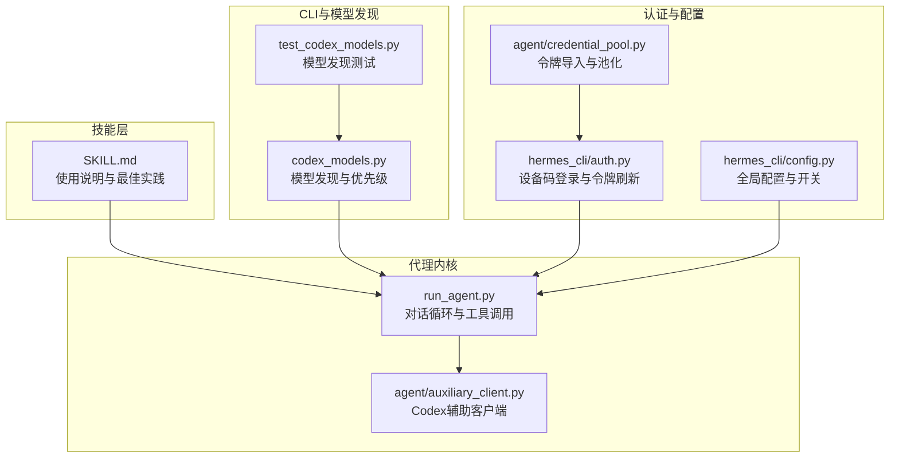
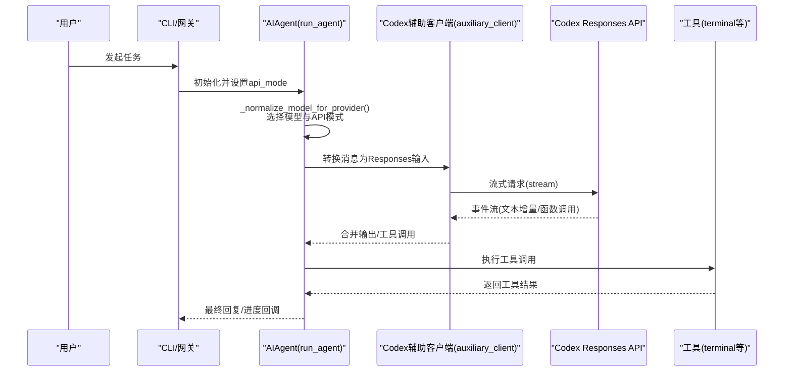
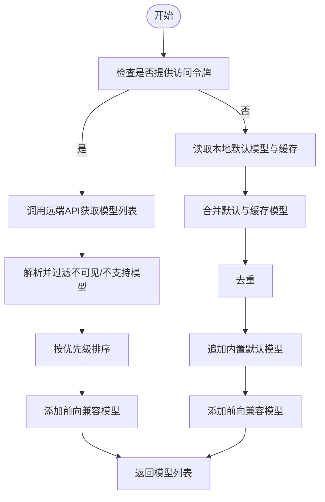
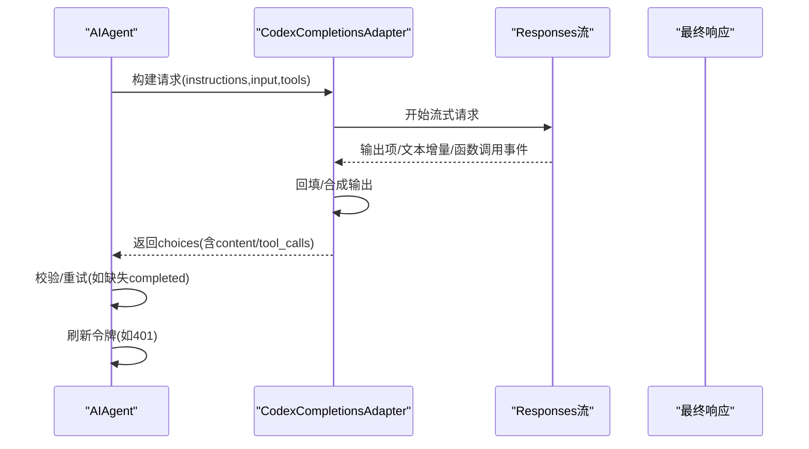
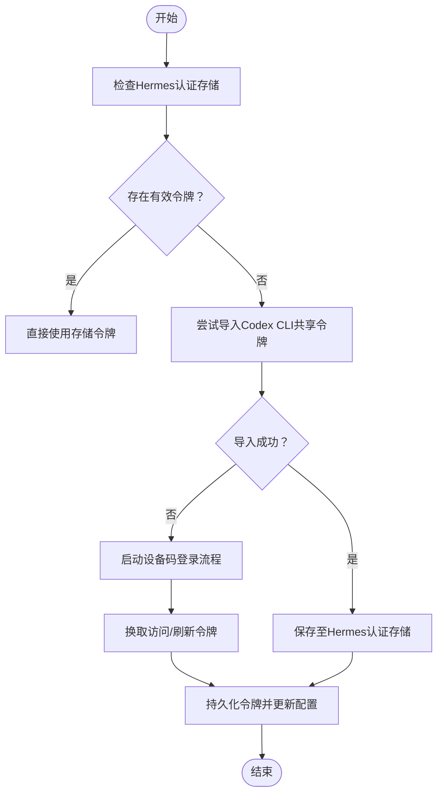
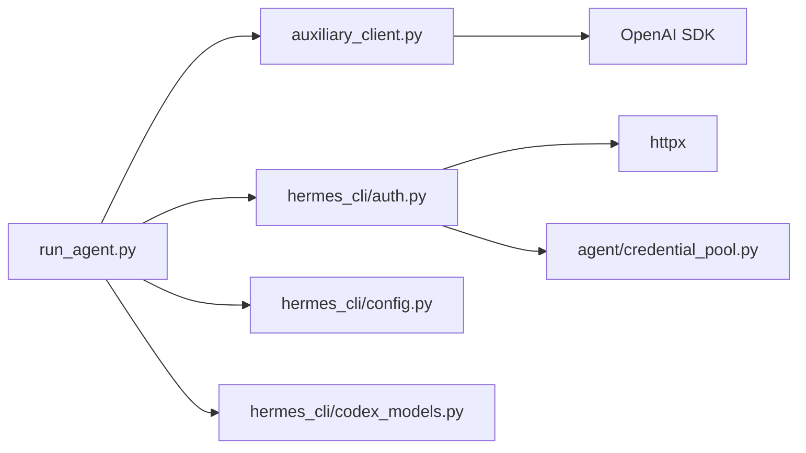

# Codex代理

<cite>
**本文引用的文件**
- [SKILL.md](file://skills/autonomous-ai-agents/codex/SKILL.md)
- [codex_models.py](file://hermes_cli/codex_models.py)
- [test_codex_models.py](file://tests/hermes_cli/test_codex_models.py)
- [test_run_agent_codex_responses.py](file://tests/run_agent/test_run_agent_codex_responses.py)
- [test_flush_memories_codex.py](file://tests/run_agent/test_flush_memories_codex.py)
- [run_agent.py](file://run_agent.py)
- [auxiliary_client.py](file://agent/auxiliary_client.py)
- [auth.py](file://hermes_cli/auth.py)
- [config.py](file://hermes_cli/config.py)
- [credential_pool.py](file://agent/credential_pool.py)
</cite>

## 目录
1. [简介](#简介)
2. [项目结构](#项目结构)
3. [核心组件](#核心组件)
4. [架构总览](#架构总览)
5. [详细组件分析](#详细组件分析)
6. [依赖关系分析](#依赖关系分析)
7. [性能考虑](#性能考虑)
8. [故障排查指南](#故障排查指南)
9. [结论](#结论)
10. [附录](#附录)

## 简介
本文件系统化阐述Codex代理技能：基于OpenAI Codex的代码生成与理解能力，结合Hermes平台的工具调用、认证与会话管理，实现从“一次性任务”到“后台长期任务”的全链路自动化。Codex代理擅长：
- 代码生成与重构：通过自然语言指令驱动终端命令执行，自动完成功能开发与代码优化
- 代码审查与批量评审：支持对PR进行并行审查与评论输出
- 批量问题修复：利用git工作树并行处理多个Issue，提升交付效率
- 智能模型发现与选择：自动解析本地缓存、默认模型与远端API返回的可用模型，提供前向兼容与优先级排序

## 项目结构
围绕Codex代理的关键模块与文件如下：
- 技能定义与使用说明：skills/autonomous-ai-agents/codex/SKILL.md
- 模型发现与选择：hermes_cli/codex_models.py 及其测试
- 代理运行与Codex响应适配：run_agent.py 与 agent/auxiliary_client.py
- 认证与令牌刷新：hermes_cli/auth.py 与 agent/credential_pool.py
- 配置项与行为开关：hermes_cli/config.py

**图表来源**
- [SKILL.md](file://skills/autonomous-ai-agents/codex/SKILL.md)
- [codex_models.py](file://hermes_cli/codex_models.py)
- [test_codex_models.py](file://tests/hermes_cli/test_codex_models.py)
- [run_agent.py](file://run_agent.py)
- [auxiliary_client.py](file://agent/auxiliary_client.py)
- [auth.py](file://hermes_cli/auth.py)
- [credential_pool.py](file://agent/credential_pool.py)
- [config.py](file://hermes_cli/config.py)

**章节来源**
- [SKILL.md:1-114](file://skills/autonomous-ai-agents/codex/SKILL.md)
- [codex_models.py:1-177](file://hermes_cli/codex_models.py)
- [run_agent.py:1-200](file://run_agent.py)

## 核心组件
- 模型发现与选择（codex_models.py）
  - 支持从远端API、本地配置与缓存中聚合可用模型，按优先级排序，并提供前向兼容合成模型
  - 解析顺序：远端API（有令牌时）> 本地默认模型 > 本地缓存 > 内置默认列表
- 代理运行与Codex响应适配（run_agent.py + auxiliary_client.py）
  - 将标准chat.completions输入转换为Codex Responses API格式，支持流式事件回填与工具调用
  - 提供Codex专用的请求预检、重试与错误恢复逻辑
- 认证与令牌管理（auth.py + credential_pool.py）
  - 设备码登录流程，独立OAuth会话避免与Codex CLI冲突
  - 自动导入Codex CLI共享令牌，统一写入Hermes认证存储
- 使用说明与最佳实践（SKILL.md）
  - 一次性任务、后台模式、PR审查、并行修复等典型场景与规则

**章节来源**
- [codex_models.py:147-177](file://hermes_cli/codex_models.py)
- [auxiliary_client.py:261-459](file://agent/auxiliary_client.py)
- [auth.py:2800-2999](file://hermes_cli/auth.py)
- [credential_pool.py:1153-1178](file://agent/credential_pool.py)
- [SKILL.md:17-114](file://skills/autonomous-ai-agents/codex/SKILL.md)

## 架构总览
Codex代理在Hermes中的运行路径如下：
- 用户通过CLI或网关发起任务
- 代理根据配置与模型发现策略确定API模式（chat_completions 或 codex_responses）
- 对于Codex模式，代理通过辅助客户端将消息转换为Responses API输入，流式消费事件并回填输出
- 工具调用（如terminal）由代理执行，结果回传给模型以继续推理
- 认证层负责令牌获取、刷新与持久化，确保长时间任务的稳定性

**图表来源**
- [run_agent.py:580-647](file://run_agent.py)
- [auxiliary_client.py:261-459](file://agent/auxiliary_client.py)
- [test_run_agent_codex_responses.py:246-294](file://tests/run_agent/test_run_agent_codex_responses.py)

## 详细组件分析

### 组件A：模型发现与选择（codex_models.py）
- 功能要点
  - 远端API拉取：在提供访问令牌时优先查询可用模型
  - 本地回退：读取本地默认模型与缓存，去重并按优先级排序
  - 前向兼容：当检测到模板模型存在时，合成更高版本模型以保持兼容性
- 关键流程

**图表来源**
- [codex_models.py:147-177](file://hermes_cli/codex_models.py)

**章节来源**
- [codex_models.py:55-91](file://hermes_cli/codex_models.py)
- [codex_models.py:111-144](file://hermes_cli/codex_models.py)
- [codex_models.py:147-177](file://hermes_cli/codex_models.py)
- [test_codex_models.py:11-58](file://tests/hermes_cli/test_codex_models.py)
- [test_codex_models.py:60-69](file://tests/hermes_cli/test_codex_models.py)
- [test_codex_models.py:71-108](file://tests/hermes_cli/test_codex_models.py)

### 组件B：代理运行与Codex响应适配（run_agent + auxiliary_client）
- 功能要点
  - 输入转换：将chat.completions的消息结构转换为Responses API所需的instructions与input数组
  - 流式回填：在final为空时，从已收集的事件中回填输出项或合成纯文本消息
  - 工具调用：识别function_call事件并转换为工具调用对象，支持call_id一致性
  - 错误恢复：针对未收到completed事件或401错误的重试与令牌刷新
- 关键流程

**图表来源**
- [auxiliary_client.py:261-459](file://agent/auxiliary_client.py)
- [test_run_agent_codex_responses.py:296-381](file://tests/run_agent/test_run_agent_codex_responses.py)
- [test_run_agent_codex_responses.py:445-474](file://tests/run_agent/test_run_agent_codex_responses.py)

**章节来源**
- [auxiliary_client.py:261-459](file://agent/auxiliary_client.py)
- [auxiliary_client.py:431-447](file://agent/auxiliary_client.py)
- [test_run_agent_codex_responses.py:246-294](file://tests/run_agent/test_run_agent_codex_responses.py)
- [test_run_agent_codex_responses.py:296-381](file://tests/run_agent/test_run_agent_codex_responses.py)
- [test_run_agent_codex_responses.py:445-474](file://tests/run_agent/test_run_agent_codex_responses.py)

### 组件C：认证与令牌管理（auth + credential_pool）
- 功能要点
  - 设备码登录：独立OAuth会话，避免与Codex CLI共享令牌冲突
  - 令牌刷新：支持刷新令牌复用与失效处理
  - 令牌导入：自动从Codex CLI共享位置导入令牌，写入Hermes认证存储
- 关键流程

**图表来源**
- [auth.py:2800-2999](file://hermes_cli/auth.py)
- [credential_pool.py:1153-1178](file://agent/credential_pool.py)

**章节来源**
- [auth.py:2800-2999](file://hermes_cli/auth.py)
- [credential_pool.py:1153-1178](file://agent/credential_pool.py)

### 组件D：使用场景与最佳实践（SKILL.md）
- 一次性任务：使用exec直接执行并退出
- 后台模式：使用background与process工具监控与交互
- PR审查：克隆仓库至临时目录，在基线分支上对比差异进行审查
- 并行修复：利用git工作树并行处理多个Issue，完成后推送并创建PR
- 规则清单：始终使用PTY、必须在git仓库内运行、合理选择--full-auto/--yolo等

**章节来源**
- [SKILL.md:24-114](file://skills/autonomous-ai-agents/codex/SKILL.md)

## 依赖关系分析
- 组件耦合
  - run_agent依赖auxiliary_client进行Codex模式适配
  - auxiliary_client依赖OpenAI SDK进行Responses API调用
  - 认证层为代理提供稳定的访问令牌，贯穿整个生命周期
- 外部依赖
  - OpenAI SDK（用于Responses API与聊天接口）
  - httpx（用于远端API与令牌刷新）
  - toml与json（用于本地配置与缓存解析）

**图表来源**
- [run_agent.py](file://run_agent.py)
- [auxiliary_client.py](file://agent/auxiliary_client.py)
- [auth.py](file://hermes_cli/auth.py)
- [config.py](file://hermes_cli/config.py)
- [codex_models.py](file://hermes_cli/codex_models.py)
- [credential_pool.py](file://agent/credential_pool.py)

**章节来源**
- [run_agent.py:60-110](file://run_agent.py)
- [auxiliary_client.py:261-459](file://agent/auxiliary_client.py)
- [auth.py:2800-2999](file://hermes_cli/auth.py)

## 性能考虑
- 模型选择与缓存
  - 优先使用远端API返回的高优先级模型；若离线，回退至本地缓存与默认模型，减少重复网络请求
  - 合理配置CODEX_HOME环境变量，确保缓存与默认模型路径正确
- 流式响应与回填
  - 利用事件流增量拼接文本，避免等待完整响应；在final为空时回填已收集事件，降低延迟
- 工具调用并发
  - 在Codex模式下启用并行工具调用，缩短整体任务时间
- 令牌与超时
  - 使用配置中的任务超时，避免硬编码超时导致的过早失败
  - 长任务开启后台模式，配合process工具轮询状态

[本节为通用指导，无需特定文件来源]

## 故障排查指南
- 401未授权
  - 代理会触发令牌刷新并重试；若仍失败，检查令牌有效性与刷新流程
- 缺少completed事件
  - 代理会重试并回退到create接口；确认网络稳定与服务端事件推送
- 无辅助客户端可用
  - 在Codex模式下，flush_memories会改用Responses API路径，确保消息与工具调用正确执行
- 令牌冲突或复用
  - 设备码登录采用独立会话；若出现“刷新令牌已被使用”，需重新登录获取新令牌

**章节来源**
- [test_run_agent_codex_responses.py:445-474](file://tests/run_agent/test_run_agent_codex_responses.py)
- [test_run_agent_codex_responses.py:296-381](file://tests/run_agent/test_run_agent_codex_responses.py)
- [test_flush_memories_codex.py:232-278](file://tests/run_agent/test_flush_memories_codex.py)
- [auth.py:1379-1451](file://hermes_cli/auth.py)

## 结论
Codex代理通过模型发现、响应适配、认证与工具调用的协同，实现了从自然语言到代码执行的高效闭环。借助后台模式与并行工作树，可显著提升批量任务的吞吐；通过设备码登录与令牌池化，保障了长期任务的稳定性与安全性。建议在生产环境中结合配置项与测试用例，持续优化模型选择与超时策略。

[本节为总结性内容，无需特定文件来源]

## 附录
- 使用场景速查
  - 一次性任务：terminal(command="codex exec '...'", pty=true)
  - 后台任务：terminal(..., background=true, pty=true)，随后process轮询
  - PR审查：在临时目录clone目标仓库，使用codex review
  - 并行修复：git worktree创建多分支，分别执行--yolo任务
- 配置与开关
  - tool_use_enforcement：控制工具调用强制提示
  - gateway_timeout与restart_drain_timeout：网关空闲与重启停机策略
  - service_tier：服务等级（如priority），影响响应速度与成本

**章节来源**
- [SKILL.md:24-114](file://skills/autonomous-ai-agents/codex/SKILL.md)
- [config.py:317-337](file://hermes_cli/config.py)