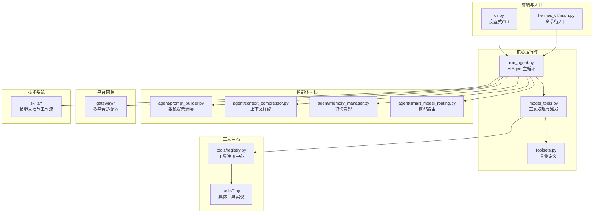
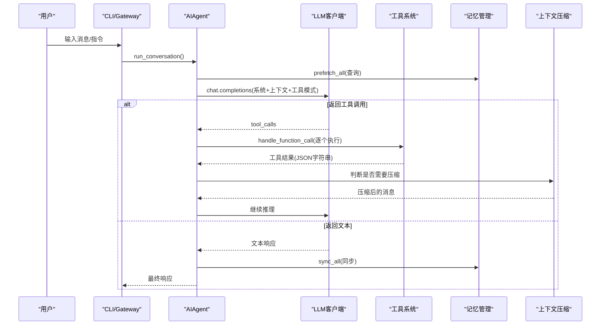
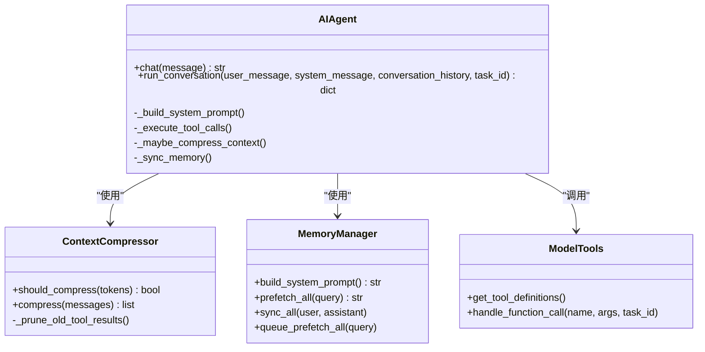
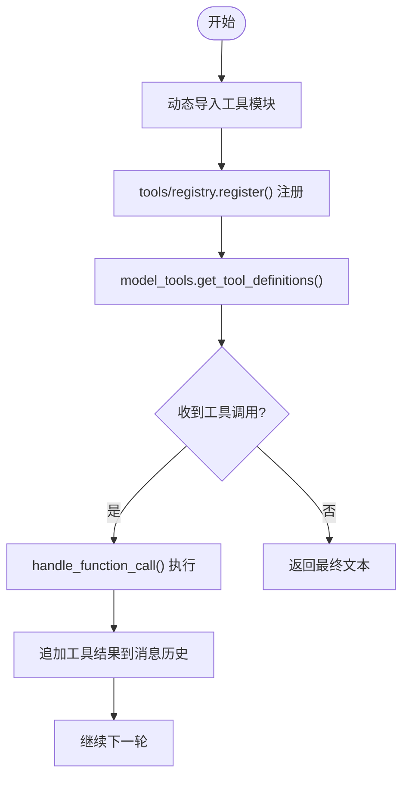
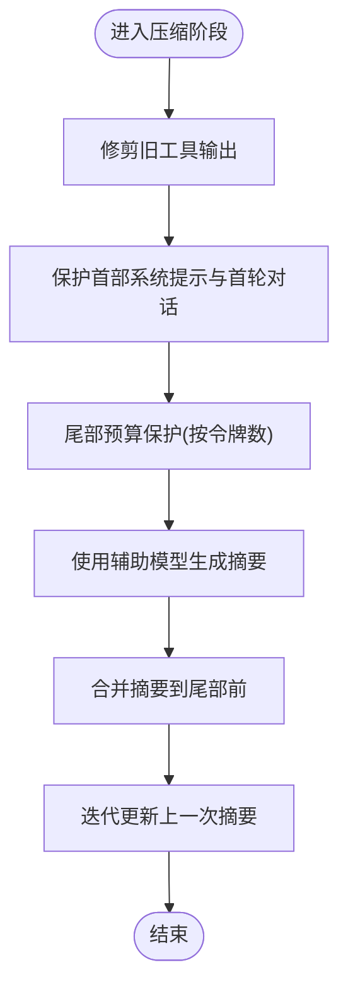
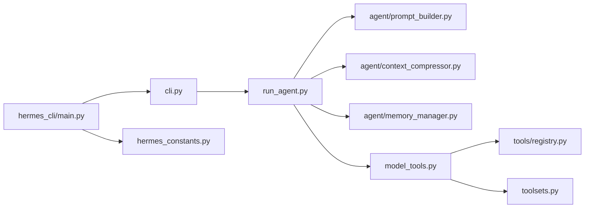

# Hermes Agent代理

<cite>
**本文引用的文件**
- [README.md](file://README.md)
- [AGENTS.md](file://AGENTS.md)
- [run_agent.py](file://run_agent.py)
- [cli.py](file://cli.py)
- [hermes_constants.py](file://hermes_constants.py)
- [model_tools.py](file://model_tools.py)
- [toolsets.py](file://toolsets.py)
- [agent/prompt_builder.py](file://agent/prompt_builder.py)
- [agent/context_compressor.py](file://agent/context_compressor.py)
- [agent/memory_manager.py](file://agent/memory_manager.py)
- [agent/smart_model_routing.py](file://agent/smart_model_routing.py)
- [hermes_cli/main.py](file://hermes_cli/main.py)
- [skills/autonomous-ai-agents/hermes-agent/SKILL.md](file://skills/autonomous-ai-agents/hermes-agent/SKILL.md)
</cite>

## 目录
1. [简介](#简介)
2. [项目结构](#项目结构)
3. [核心组件](#核心组件)
4. [架构总览](#架构总览)
5. [详细组件分析](#详细组件分析)
6. [依赖关系分析](#依赖关系分析)
7. [性能考量](#性能考量)
8. [故障排查指南](#故障排查指南)
9. [结论](#结论)
10. [附录](#附录)

## 简介
Hermes Agent 是由 Nous Research 开发的开源智能体框架，具备自我改进能力：通过“技能”（skills）从经验中学习，将可复用流程固化为可加载的技能文档；通过持久化记忆跨会话记住用户身份与偏好；支持多平台网关（Telegram、Discord、Slack、WhatsApp、Signal、邮件等），并可在 CLI、消息平台或 IDE 中运行。它采用工具调用（tool-calling）与函数式 API，结合上下文压缩、模型路由、记忆检索与会话搜索，形成“复杂推理—决策—执行”的闭环。

Hermes 的设计目标是：
- 多模态任务处理：文本、视觉、浏览器自动化、终端命令、文件操作、语音合成等。
- 复杂推理与决策：通过系统提示注入工具使用约束、推理策略、记忆与会话检索，提升复杂任务完成质量。
- 可扩展与可插拔：工具注册中心、插件系统、MCP 扩展、外部记忆后端、代理分身与子代理委托。
- 高效成本控制：上下文压缩、提示缓存、智能模型路由、令牌预算与计费估算。

## 项目结构
Hermes Agent 采用模块化分层设计：
- 核心运行时：run_agent.py 提供 AIAgent 主循环与工具调度。
- 工具体系：tools/* 工具文件通过 tools/registry 注册，model_tools.py 负责发现与派发。
- 前端入口：cli.py 提供交互式 CLI；hermes_cli/main.py 提供命令行入口与配置加载。
- 记忆与上下文：agent/memory_manager.py 组织内置与外部记忆提供者；agent/context_compressor.py 实现上下文压缩；agent/prompt_builder.py 组装系统提示与上下文文件。
- 模型与路由：agent/smart_model_routing.py 支持简单任务走廉价模型，复杂任务切换强模型。
- 平台网关：gateway/* 将消息平台适配为统一接口，支持多平台并发与状态管理。
- 技能系统：skills/* 为可复用的知识与工作流模板，通过 hermes-agent 技能加载到会话。

图示来源
- [run_agent.py](file://run_agent.py)
- [cli.py](file://cli.py)
- [hermes_cli/main.py](file://hermes_cli/main.py)
- [model_tools.py](file://model_tools.py)
- [toolsets.py](file://toolsets.py)
- [agent/prompt_builder.py](file://agent/prompt_builder.py)
- [agent/context_compressor.py](file://agent/context_compressor.py)
- [agent/memory_manager.py](file://agent/memory_manager.py)
- [agent/smart_model_routing.py](file://agent/smart_model_routing.py)

章节来源
- [AGENTS.md: 项目结构与文件依赖链](file://AGENTS.md)
- [README.md: 快速概览与特性](file://README.md)

## 核心组件
- AIAgent（run_agent.py）
  - 负责对话主循环：构建消息历史、调用模型、解析工具调用、执行工具、更新上下文、触发压缩与计费统计。
  - 支持迭代预算、中断机制、并行工具执行、提示缓存、推理配置、预填充消息、平台提示注入等。
- 工具系统（model_tools.py + toolsets.py + tools/*）
  - 通过 tools/registry 注册工具，model_tools 负责发现与派发；toolsets 定义工具集组合，便于按场景启用/禁用。
- 上下文压缩（agent/context_compressor.py）
  - 在接近上下文阈值时自动压缩中间轮次，保留首尾与尾部预算，使用辅助模型生成结构化摘要。
- 系统提示与上下文文件（agent/prompt_builder.py）
  - 组装默认身份、记忆指引、会话检索指引、技能指引、工具使用约束、平台提示与上下文文件扫描与安全过滤。
- 记忆管理（agent/memory_manager.py）
  - 统一内置与外部记忆提供者，支持预取、同步与队列预取，避免冲突与单点失败。
- 智能模型路由（agent/smart_model_routing.py）
  - 对简单任务自动切换廉价模型以降低成本，复杂任务保持强模型。
- 命令行与配置（cli.py + hermes_cli/main.py + hermes_constants.py）
  - CLI 提供 TUI、皮肤引擎、命令补全与帮助；main.py 处理配置加载、环境变量桥接、IPv4 优先、配置版本迁移与日志初始化。

章节来源
- [run_agent.py: AIAgent类与主循环](file://run_agent.py)
- [model_tools.py: 工具发现与异步桥接](file://model_tools.py)
- [toolsets.py: 工具集定义与组合](file://toolsets.py)
- [agent/context_compressor.py: 上下文压缩算法](file://agent/context_compressor.py)
- [agent/prompt_builder.py: 系统提示组装与安全扫描](file://agent/prompt_builder.py)
- [agent/memory_manager.py: 记忆提供者编排](file://agent/memory_manager.py)
- [agent/smart_model_routing.py: 简单任务路由策略](file://agent/smart_model_routing.py)
- [cli.py: CLI配置加载与TUI](file://cli.py)
- [hermes_cli/main.py: 命令行入口与配置桥接](file://hermes_cli/main.py)
- [hermes_constants.py: 路径与网络偏好常量](file://hermes_constants.py)

## 架构总览
Hermes Agent 的核心是“模型 + 工具 + 记忆 + 上下文”的闭环：
- 用户输入经系统提示与上下文文件注入后进入模型，模型返回文本或工具调用。
- 工具调用由 model_tools 派发至具体工具，结果回写消息历史，驱动下一轮推理。
- 当上下文接近阈值时，由 ContextCompressor 进行摘要压缩，保护尾部最新交互。
- MemoryManager 在每轮前后进行预取与同步，确保跨会话知识可用且不污染当前回合。
- 智能模型路由根据任务复杂度选择合适模型，平衡成本与质量。

图示来源
- [run_agent.py](file://run_agent.py)
- [model_tools.py](file://model_tools.py)
- [agent/context_compressor.py](file://agent/context_compressor.py)
- [agent/memory_manager.py](file://agent/memory_manager.py)

## 详细组件分析

### AIAgent 类与主循环
- 关键职责
  - 构建系统提示与平台提示、注入记忆与会话检索、构建工具模式、维护迭代预算与中断、处理工具并行与路径隔离、记录令牌用量与费用估算。
- 并发与安全
  - 工具并行执行遵循只读/路径隔离规则，避免破坏性命令并发；对终端命令进行破坏性模式检测。
- 上下文压缩触发
  - 接近阈值时自动压缩，保留尾部预算，迭代更新摘要，减少成本与延迟。
- 回调与可观测性
  - 支持工具进度、思考、推理、状态等回调，便于 CLI 与网关展示实时状态。

图示来源
- [run_agent.py](file://run_agent.py)
- [agent/context_compressor.py](file://agent/context_compressor.py)
- [agent/memory_manager.py](file://agent/memory_manager.py)
- [model_tools.py](file://model_tools.py)

章节来源
- [run_agent.py: AIAgent类与主循环细节](file://run_agent.py)

### 工具系统与工具集
- 工具注册与发现
  - tools/registry 提供统一注册接口；model_tools._discover_tools 动态导入各工具模块，触发注册。
- 工具集组合
  - toolsets.py 定义核心工具集（web、terminal、file、vision、browser、skills、memory、session_search、delegation、cronjob 等），支持组合与按平台启用。
- 工具执行
  - handle_function_call 将工具调用映射到具体处理器，要求返回 JSON 字符串，便于消息序列化与压缩。

图示来源
- [model_tools.py](file://model_tools.py)
- [toolsets.py](file://toolsets.py)

章节来源
- [model_tools.py: 工具发现与派发](file://model_tools.py)
- [toolsets.py: 工具集定义](file://toolsets.py)

### 上下文压缩与成本控制
- 压缩策略
  - 先修剪旧工具输出，保护首尾与尾部预算，再用辅助模型生成结构化摘要，迭代更新摘要以保留信息。
- 触发条件
  - 当提示令牌达到阈值（基于模型上下文长度与配置比例）时触发；支持静默模式与摘要模型覆盖。
- 成本收益
  - 显著降低长对话的输入成本与延迟，同时尽量保留最新交互的完整性。

图示来源
- [agent/context_compressor.py](file://agent/context_compressor.py)

章节来源
- [agent/context_compressor.py: 压缩算法与预算策略](file://agent/context_compressor.py)

### 系统提示与上下文文件安全
- 系统提示组装
  - 默认身份、记忆指引、会话检索指引、技能指引、工具使用约束、平台提示与模型执行指导共同构成系统提示。
- 上下文文件扫描
  - 对 AGENTS.md、.cursorrules、SOUL.md 等进行威胁模式与隐藏字符扫描，阻断潜在提示注入风险，并在发现异常时替换为阻断提示。

章节来源
- [agent/prompt_builder.py: 系统提示与安全扫描](file://agent/prompt_builder.py)

### 记忆管理与跨会话召回
- 提供者编排
  - 内置提供者始终注册；最多允许一个外部提供者，冲突将被拒绝；工具名称冲突会发出警告。
- 预取与同步
  - 每轮前预取相关记忆，轮后同步用户输入与助手响应；支持队列预取以提升下一轮体验。
- 上下文围栏
  - 记忆内容以围栏标签包裹，防止模型将其误认为用户输入。

章节来源
- [agent/memory_manager.py: 记忆提供者编排与上下文围栏](file://agent/memory_manager.py)

### 智能模型路由
- 路由策略
  - 对简单任务（短文本、少词、无代码片段、无URL、不含复杂关键词）自动切换到廉价模型；复杂任务保持主模型。
- 运行时解析
  - 解析提供商运行时参数，生成带标签的路由签名，便于日志与追踪。

章节来源
- [agent/smart_model_routing.py: 路由策略与运行时解析](file://agent/smart_model_routing.py)

### 命令行与配置
- CLI 加载
  - 合并用户配置与项目默认，桥接终端、浏览器、辅助模型等配置到环境变量；初始化皮肤引擎与工具预览长度。
- 命令入口
  - hermes_cli/main.py 支持多子命令（chat、gateway、setup、model、config、tools、skills、cron、sessions 等），并处理配置版本迁移与 IPv4 优先。
- 路径与环境
  - hermes_constants 提供统一的 HERMES_HOME 解析、显示路径、容器/WSL/Android 检测与网络偏好设置。

章节来源
- [cli.py: CLI配置加载与TUI](file://cli.py)
- [hermes_cli/main.py: 命令行入口与配置桥接](file://hermes_cli/main.py)
- [hermes_constants.py: 路径与网络偏好常量](file://hermes_constants.py)

## 依赖关系分析
- 模块耦合
  - run_agent.py 依赖 agent/* 子模块（提示构建、压缩、记忆、模型元数据、显示、轨迹保存等），并通过 model_tools 与工具生态解耦。
  - model_tools 仅依赖 tools/registry 与 toolsets，实现低耦合的工具发现与派发。
  - hermes_cli/main.py 在启动早期即设置 HERMES_HOME 与环境变量，保证后续模块一致解析路径。
- 外部依赖
  - OpenAI SDK、HTTP 客户端、prompt_toolkit、rich、pytest 等；通过异步桥接与线程池避免“事件循环已关闭”错误。
- 循环依赖规避
  - 工具注册在模块导入时完成，避免运行时循环；工具定义与处理器分离，仅在派发时耦合。

图示来源
- [run_agent.py](file://run_agent.py)
- [model_tools.py](file://model_tools.py)
- [toolsets.py](file://toolsets.py)
- [agent/prompt_builder.py](file://agent/prompt_builder.py)
- [agent/context_compressor.py](file://agent/context_compressor.py)
- [agent/memory_manager.py](file://agent/memory_manager.py)
- [cli.py](file://cli.py)
- [hermes_cli/main.py](file://hermes_cli/main.py)
- [hermes_constants.py](file://hermes_constants.py)

章节来源
- [AGENTS.md: 文件依赖链](file://AGENTS.md)
- [run_agent.py](file://run_agent.py)
- [model_tools.py](file://model_tools.py)

## 性能考量
- 成本优化
  - 上下文压缩显著降低输入成本；提示缓存（Anthropic）在多轮对话中减少重复输入；智能模型路由在简单任务上切换廉价模型。
- 延迟优化
  - 工具并行执行（只读/路径隔离）减少总轮次；队列预取记忆；异步桥接避免事件循环生命周期问题。
- 资源控制
  - 迭代预算限制总调用次数；尾部预算保护最新交互；工具执行超时与破坏性命令检测降低资源浪费与风险。
- 稳定性
  - 异常与错误分类、重试与降级、日志集中化、清理钩子与退出保障，确保长时间运行的稳定性。

## 故障排查指南
- 常见问题定位
  - 工具不可用：检查 hermes tools 与平台启用状态，确认 .env 中所需密钥；变更工具集需 /reset 生效。
  - 模型/提供商问题：使用 hermes doctor 检查配置与依赖；OAuth 提供商可通过 hermes login 重新认证。
  - 语音问题：检查 stt.enabled 与提供商配置（本地 faster-whisper 或 API 密钥），重启网关。
  - 技能未显示：确认 hermes skills list 与 hermes skills config；必要时 /skill name 或 hermes -s name 显式加载。
  - 网关异常：查看 ~/.hermes/logs/gateway.log，关注“发送失败/错误”等关键字。
- 诊断命令
  - hermes doctor：检查配置、依赖与提供商状态。
  - hermes status：查看组件状态。
  - hermes config check/migrate：检查与迁移配置。
  - hermes sessions browse/stats：查看会话统计与导出。

章节来源
- [skills/autonomous-ai-agents/hermes-agent/SKILL.md: 故障排查章节](file://skills/autonomous-ai-agents/hermes-agent/SKILL.md)

## 结论
Hermes Agent 通过“工具调用 + 记忆 + 上下文压缩 + 智能模型路由”的组合，实现了在多模态任务、复杂推理与决策制定上的高效与稳健。其模块化设计与可插拔生态使其既能满足个人开发者日常使用，也能支撑企业级多平台部署与大规模自动化任务。建议在生产环境中结合上下文压缩、提示缓存与模型路由策略，以获得更优的成本与性能表现。

## 附录
- 使用示例与实战案例
  - 一键安装与快速开始：参考 README 与 hermes-agent 技能中的安装与入门命令。
  - 多平台网关：通过 hermes gateway setup 与 hermes gateway start 启动，支持 Telegram、Discord、Slack、WhatsApp、Signal、Email 等。
  - 技能加载：使用 /skills 或 hermes -s name 加载技能，加速特定领域的任务执行。
  - 子代理与并行：通过 delegation 与并行工具执行提升复杂任务吞吐。
- 最佳实践
  - 不要破坏提示缓存：不要在会话中更改上下文、工具集或系统提示；如需变更，请在 /reset 后生效。
  - 合理启用工具集：按平台与场景启用最小必要工具集，避免不必要的成本与风险。
  - 使用上下文压缩与记忆：在长对话中充分利用压缩与记忆，减少输入成本并提升一致性。
  - 配置版本迁移：定期使用 hermes config migrate 更新配置，确保新特性与修复及时生效。

章节来源
- [README.md: 快速安装与入门](file://README.md)
- [skills/autonomous-ai-agents/hermes-agent/SKILL.md: CLI参考与最佳实践](file://skills/autonomous-ai-agents/hermes-agent/SKILL.md)