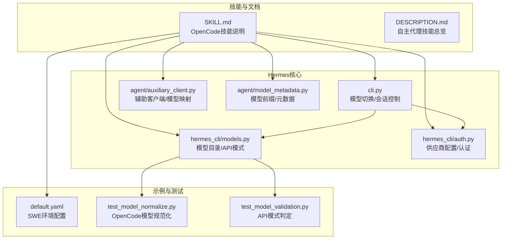
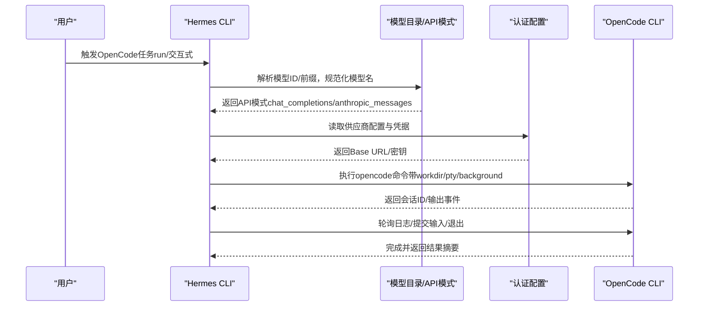
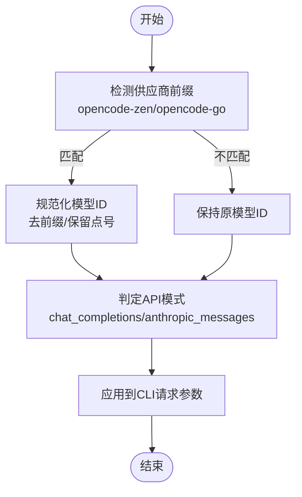
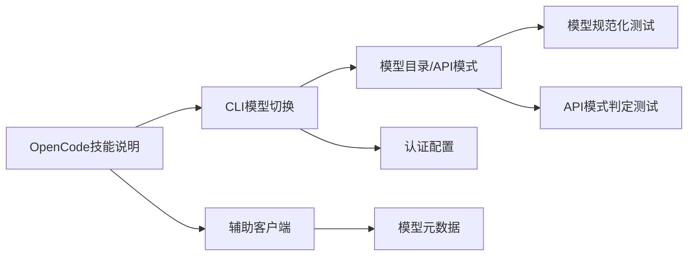

# Opencode代理

<cite>
**本文引用的文件**
- [SKILL.md](file://skills/autonomous-ai-agents/opencode/SKILL.md)
- [DESCRIPTION.md（自主代理技能总览）](file://skills/autonomous-ai-agents/DESCRIPTION.md)
- [辅助客户端：模型与供应商映射](file://agent/auxiliary_client.py)
- [模型元数据与前缀处理](file://agent/model_metadata.py)
- [CLI模型切换与OpenCode适配](file://cli.py)
- [认证与供应商配置（含OpenCode）](file://hermes_cli/auth.py)
- [模型目录与OpenCode模型清单](file://hermes_cli/models.py)
- [模型验证与API模式判定测试](file://tests/hermes_cli/test_model_validation.py)
- [模型规范化测试（含OpenCode回归）](file://tests/hermes_cli/test_model_normalize.py)
- [SWE环境默认配置](file://environments/hermes_swe_env/default.yaml)
</cite>

## 目录
1. [简介](#简介)
2. [项目结构](#项目结构)
3. [核心组件](#核心组件)
4. [架构总览](#架构总览)
5. [详细组件分析](#详细组件分析)
6. [依赖关系分析](#依赖关系分析)
7. [性能考虑](#性能考虑)
8. [故障排查指南](#故障排查指南)
9. [结论](#结论)
10. [附录](#附录)

## 简介
本文件面向希望在Hermes终端中使用OpenCode CLI作为“代理技能”的开发者与工程团队。OpenCode是一个开源、跨Provider的AI编码代理，具备TUI与CLI形态，适合在Hermes中以“外部编码工人的角色”被编排与调度。本文系统阐述：
- OpenCode代理在开源项目管理与代码协作中的专业能力与适用场景
- 在Hermes中工作原理、控制流与集成点
- 使用场景、配置方法、实践案例与最佳实践
- 与其他代理/工具的配合方式与性能优化建议

## 项目结构
围绕OpenCode代理的关键文件分布如下：
- 技能定义与使用手册：skills/autonomous-ai-agents/opencode/SKILL.md
- 自动化代理编排与上下文压缩等底层能力：agent/*（如辅助客户端、模型元数据）
- CLI层对OpenCode的模型识别、API模式选择与会话管理：cli.py、hermes_cli/models.py、hermes_cli/auth.py
- 测试用例覆盖OpenCode模型规范化与API模式判定：tests/hermes_cli/test_model_normalize.py、tests/hermes_cli/test_model_validation.py
- 示例环境配置：environments/hermes_swe_env/default.yaml

**图表来源**
- [SKILL.md:1-219](file://skills/autonomous-ai-agents/opencode/SKILL.md#L1-L219)
- [DESCRIPTION.md（自主代理技能总览）:1-4](file://skills/autonomous-ai-agents/DESCRIPTION.md#L1-L4)
- [辅助客户端：模型与供应商映射:100-110](file://agent/auxiliary_client.py#L100-L110)
- [模型元数据与前缀处理:25-39](file://agent/model_metadata.py#L25-L39)
- [CLI模型切换与OpenCode适配:2175-2196](file://cli.py#L2175-L2196)
- [认证与供应商配置（含OpenCode）:215-236](file://hermes_cli/auth.py#L215-L236)
- [模型目录与OpenCode模型清单:196-241](file://hermes_cli/models.py#L196-L241)
- [SWE环境默认配置:1-35](file://environments/hermes_swe_env/default.yaml#L1-L35)
- [模型规范化测试（含OpenCode回归）:18-36](file://tests/hermes_cli/test_model_normalize.py#L18-L36)
- [模型验证与API模式判定测试:372-378](file://tests/hermes_cli/test_model_validation.py#L372-L378)

**章节来源**
- [SKILL.md:1-219](file://skills/autonomous-ai-agents/opencode/SKILL.md#L1-L219)
- [DESCRIPTION.md（自主代理技能总览）:1-4](file://skills/autonomous-ai-agents/DESCRIPTION.md#L1-L4)

## 核心组件
- OpenCode技能说明与使用流程：提供安装、认证、二进制解析、一次性任务与交互式会话的完整指南，以及PR审查、并行工作、会话与成本管理、常见陷阱与验证步骤。
- 模型与供应商适配：Hermes侧对OpenCode Zen/Go的模型ID规范化、API模式自动判定（chat_completions 或 anthropic_messages），以及供应商前缀处理。
- 认证与供应商配置：内置OpenCode Zen/Go的认证类型、Base URL与环境变量映射，支持通过环境变量或令牌进行鉴权。
- 辅助客户端与上下文压缩：为OpenCode相关模型提供默认模型映射与提示词约束，确保与OpenCode生态一致的交互体验。

**章节来源**
- [SKILL.md:17-219](file://skills/autonomous-ai-agents/opencode/SKILL.md#L17-L219)
- [模型元数据与前缀处理:25-39](file://agent/model_metadata.py#L25-L39)
- [辅助客户端：模型与供应商映射:100-110](file://agent/auxiliary_client.py#L100-L110)
- [认证与供应商配置（含OpenCode）:215-236](file://hermes_cli/auth.py#L215-L236)

## 架构总览
下图展示Hermes在调用OpenCode时的关键交互路径：从命令解析到模型规范化、API模式选择、认证与执行，再到日志轮询与会话退出。

**图表来源**
- [CLI模型切换与OpenCode适配:2175-2196](file://cli.py#L2175-L2196)
- [模型目录与OpenCode模型清单:196-241](file://hermes_cli/models.py#L196-L241)
- [认证与供应商配置（含OpenCode）:215-236](file://hermes_cli/auth.py#L215-L236)
- [SKILL.md:73-95](file://skills/autonomous-ai-agents/opencode/SKILL.md#L73-L95)

## 详细组件分析

### 组件A：OpenCode技能说明与使用流程
- 适用场景：用户显式要求使用OpenCode；需要外部编码代理实现/重构/审查代码；需要长时间迭代会话；需要在隔离工作区并行执行任务。
- 前置条件：安装OpenCode CLI、完成认证、验证可用Provider、推荐使用Git仓库、交互式会话需启用pty。
- 二进制解析：若终端与Hermes解析到不同二进制，可通过显式路径固定。
- 一次性任务：使用opencode run执行有界任务，可附加文件、显示思考过程、强制指定模型。
- 交互式会话：后台启动TUI，通过process动作提交输入、轮询进度、退出时使用Ctrl+C或kill。
- PR审查：内置pr命令或在临时克隆中进行隔离审查。
- 并行工作：使用独立工作目录/工作树避免冲突。
- 成本与会话：列出历史会话、查看统计信息。
- 常见陷阱：交互式会话必须pty；不要使用/exit；PATH不一致可能导致错误二进制；卡顿时先查日志；避免共享同一工作目录；可能需要按两次回车提交。
- 验证：smoke test输出包含特定字符串且无Provider/模型错误。

**章节来源**
- [SKILL.md:17-219](file://skills/autonomous-ai-agents/opencode/SKILL.md#L17-L219)

### 组件B：模型与供应商适配（CLI层）
- OpenCode Zen/Go模型ID规范化：去除供应商前缀，保留模型原始标识（如含点号的minimax-m2.7）。
- API模式判定：根据模型类型自动选择chat_completions或anthropic_messages，确保与OpenCode官方文档一致。
- CLI集成：当检测到opencode-zen/opencode-go时，自动调整模型与API模式，并在必要时打印提示信息。

**图表来源**
- [CLI模型切换与OpenCode适配:2175-2196](file://cli.py#L2175-L2196)
- [模型目录与OpenCode模型清单:196-241](file://hermes_cli/models.py#L196-L241)
- [模型目录与OpenCode模型清单:1532-1563](file://hermes_cli/models.py#L1532-L1563)

**章节来源**
- [CLI模型切换与OpenCode适配:2175-2196](file://cli.py#L2175-L2196)
- [模型目录与OpenCode模型清单:1532-1563](file://hermes_cli/models.py#L1532-L1563)

### 组件C：认证与供应商配置
- OpenCode Zen/Go供应商配置：定义认证类型、推理接口Base URL、环境变量映射。
- 多模型API差异：Go版对不同模型采用不同的API表面（GLM/Kimi走OpenAI兼容接口，MiniMax走Anthropic Messages接口）。
- CLI侧自动选择：根据模型ID动态确定API模式，保证请求正确路由。

**章节来源**
- [认证与供应商配置（含OpenCode）:215-236](file://hermes_cli/auth.py#L215-L236)
- [模型目录与OpenCode模型清单:196-241](file://hermes_cli/models.py#L196-L241)

### 组件D：辅助客户端与上下文压缩
- 默认模型映射：为opencode-zen/opencode-go提供默认模型，便于在辅助任务中快速选择。
- 上下文压缩提示：遵循OpenCode的“不要回答任何问题”等提示风格，确保上下文聚焦与安全。

**章节来源**
- [辅助客户端：模型与供应商映射:100-110](file://agent/auxiliary_client.py#L100-L110)
- [模型元数据与前缀处理:25-39](file://agent/model_metadata.py#L25-L39)

### 组件E：测试与质量保障
- 模型规范化测试：确保opencode-go模型名称中的点号不被转换为连字符，避免破坏模型标识。
- API模式判定测试：验证opencode-zen/opencode-go在不同模型下的API模式选择是否符合文档。

**章节来源**
- [模型规范化测试（含OpenCode回归）:18-36](file://tests/hermes_cli/test_model_normalize.py#L18-L36)
- [模型验证与API模式判定测试:372-378](file://tests/hermes_cli/test_model_validation.py#L372-L378)

## 依赖关系分析
- OpenCode技能依赖Hermes CLI的模型目录与API模式判定逻辑，确保请求路由正确。
- 认证配置依赖供应商注册表，提供Base URL与环境变量映射。
- 辅助客户端与上下文压缩依赖模型元数据与前缀处理，保证与OpenCode生态一致的提示风格与行为。

**图表来源**
- [SKILL.md:1-219](file://skills/autonomous-ai-agents/opencode/SKILL.md#L1-L219)
- [CLI模型切换与OpenCode适配:2175-2196](file://cli.py#L2175-L2196)
- [模型目录与OpenCode模型清单:196-241](file://hermes_cli/models.py#L196-L241)
- [认证与供应商配置（含OpenCode）:215-236](file://hermes_cli/auth.py#L215-L236)
- [辅助客户端：模型与供应商映射:100-110](file://agent/auxiliary_client.py#L100-L110)
- [模型元数据与前缀处理:25-39](file://agent/model_metadata.py#L25-L39)
- [模型规范化测试（含OpenCode回归）:18-36](file://tests/hermes_cli/test_model_normalize.py#L18-L36)
- [模型验证与API模式判定测试:372-378](file://tests/hermes_cli/test_model_validation.py#L372-L378)

**章节来源**
- [SKILL.md:1-219](file://skills/autonomous-ai-agents/opencode/SKILL.md#L1-L219)
- [模型元数据与前缀处理:25-39](file://agent/model_metadata.py#L25-L39)
- [辅助客户端：模型与供应商映射:100-110](file://agent/auxiliary_client.py#L100-L110)
- [CLI模型切换与OpenCode适配:2175-2196](file://cli.py#L2175-L2196)
- [认证与供应商配置（含OpenCode）:215-236](file://hermes_cli/auth.py#L215-L236)
- [模型目录与OpenCode模型清单:196-241](file://hermes_cli/models.py#L196-L241)
- [模型规范化测试（含OpenCode回归）:18-36](file://tests/hermes_cli/test_model_normalize.py#L18-L36)
- [模型验证与API模式判定测试:372-378](file://tests/hermes_cli/test_model_validation.py#L372-L378)

## 性能考虑
- 交互式会话务必启用pty，避免非交互模式导致的阻塞与不可控。
- 对于长时间运行的任务，定期轮询日志并提供进度摘要，减少等待时间。
- 并行任务应使用独立工作目录/工作树，避免文件锁与状态冲突。
- 合理选择模型与API模式，避免不必要的路由切换与重试。
- 在多Shell环境中，优先固定OpenCode二进制路径，避免PATH差异导致的行为不一致。

## 故障排查指南
- 交互式会话无法退出：使用Ctrl+C或process(action="kill")，不要使用/exit。
- 会话卡住：先通过process(action="log")检查日志，再决定是否终止。
- 输出不符合预期：确认已正确安装与认证，检查opencode --version与opencode auth list。
- 并行任务冲突：确保每个任务在独立工作目录/工作树中执行。
- 二进制不一致：使用which -a opencode与opencode --version定位实际二进制，必要时固定路径。

**章节来源**
- [SKILL.md:188-219](file://skills/autonomous-ai-agents/opencode/SKILL.md#L188-L219)

## 结论
OpenCode代理在Hermes中扮演“外部编码工人”的角色，适用于需要跨Provider、长周期迭代与并行工作的场景。通过Hermes的模型规范化、API模式判定与认证配置，能够稳定地将OpenCode集成到自动化与半自动化流程中。结合本文提供的使用指南、最佳实践与故障排查建议，用户可以更高效地利用OpenCode提升开发效率。

## 附录
- 示例环境配置：SWE环境默认配置展示了工具集、最大回合数、分词器与数据集等参数，可作为复杂任务的参考模板。

**章节来源**
- [SWE环境默认配置:1-35](file://environments/hermes_swe_env/default.yaml#L1-L35)