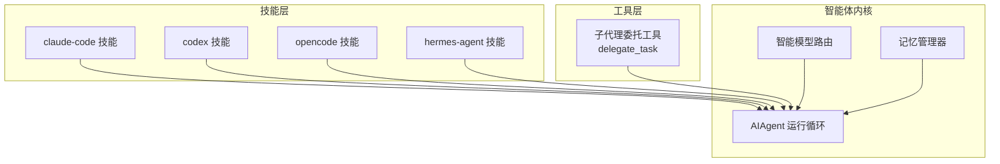
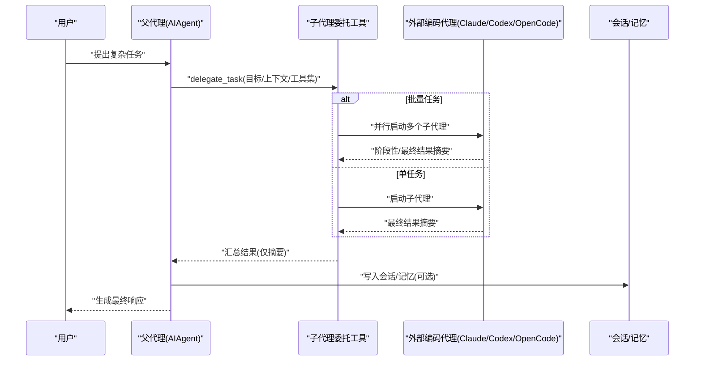
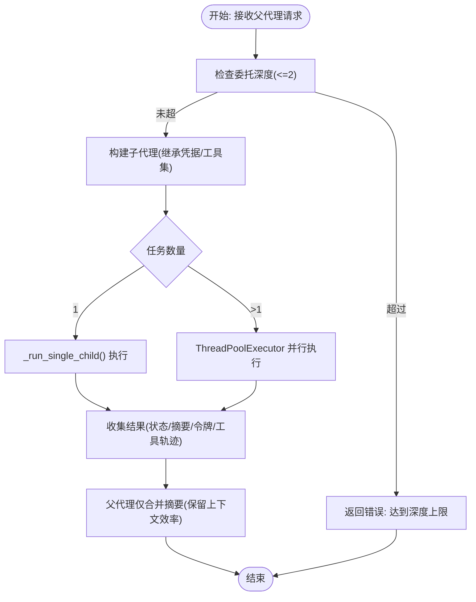
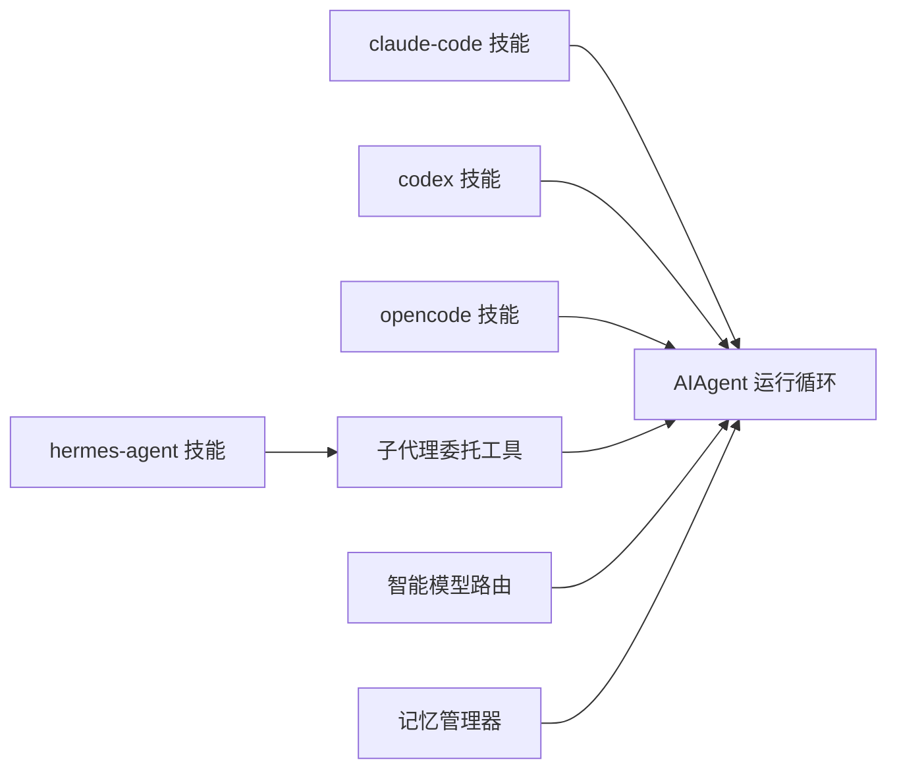

# 自主AI代理

<cite>
**本文引用的文件**
- [README.md](file://README.md)
- [AGENTS.md](file://AGENTS.md)
- [skills/autonomous-ai-agents/DESCRIPTION.md](file://skills/autonomous-ai-agents/DESCRIPTION.md)
- [skills/autonomous-ai-agents/claude-code/SKILL.md](file://skills/autonomous-ai-agents/claude-code/SKILL.md)
- [skills/autonomous-ai-agents/codex/SKILL.md](file://skills/autonomous-ai-agents/codex/SKILL.md)
- [skills/autonomous-ai-agents/hermes-agent/SKILL.md](file://skills/autonomous-ai-agents/hermes-agent/SKILL.md)
- [skills/autonomous-ai-agents/opencode/SKILL.md](file://skills/autonomous-ai-agents/opencode/SKILL.md)
- [tools/delegate_tool.py](file://tools/delegate_tool.py)
- [agent/smart_model_routing.py](file://agent/smart_model_routing.py)
- [agent/memory_manager.py](file://agent/memory_manager.py)
</cite>

## 目录
1. [引言](#引言)
2. [项目结构](#项目结构)
3. [核心组件](#核心组件)
4. [架构总览](#架构总览)
5. [详细组件分析](#详细组件分析)
6. [依赖关系分析](#依赖关系分析)
7. [性能考量](#性能考量)
8. [故障排查指南](#故障排查指南)
9. [结论](#结论)
10. [附录](#附录)

## 引言
本文件系统化阐述 Hermes Agent 的“自主AI代理”能力与技能体系，围绕 Claude Code、Codex、Hermes Agent、OpenCode 四类代表性技能，解释其功能特性、适用场景与技术实现，并给出代理间协作机制（子代理委托）、任务分配策略与结果整合方式。同时提供实践用例、配置要点、性能对比与最佳实践，帮助用户在复杂任务中高效选择与组合合适的代理。

## 项目结构
Hermes Agent 是一个以“工具调用 + 多平台网关 + 可扩展技能”为核心的智能体框架。自主AI代理技能位于 skills/autonomous-ai-agents 下，分别对应三类外部 CLI 编码代理与一个内置的子代理委托工具。核心运行循环与工具发现、模型路由、记忆管理等能力分布在 agent/ 与 tools/ 目录中。

图示来源
- [AGENTS.md](file://AGENTS.md)
- [skills/autonomous-ai-agents/DESCRIPTION.md](file://skills/autonomous-ai-agents/DESCRIPTION.md)
- [tools/delegate_tool.py](file://tools/delegate_tool.py)
- [agent/smart_model_routing.py](file://agent/smart_model_routing.py)
- [agent/memory_manager.py](file://agent/memory_manager.py)

章节来源
- [README.md](file://README.md)
- [AGENTS.md](file://AGENTS.md)

## 核心组件
- 子代理委托工具（delegate_task）：支持单任务与批量任务的子代理派发，具备并发控制、深度限制、进度回传、令牌统计与中断传播等能力。
- 智能模型路由：根据消息复杂度自动选择“廉价模型”或保持主模型，兼顾成本与质量。
- 记忆管理器：统一接入内置与外部记忆后端，负责系统提示拼装、预取检索、回合同步与生命周期钩子。

章节来源
- [tools/delegate_tool.py](file://tools/delegate_tool.py)
- [agent/smart_model_routing.py](file://agent/smart_model_routing.py)
- [agent/memory_manager.py](file://agent/memory_manager.py)

## 架构总览
下图展示典型一次“多代理协作”的端到端流程：父代理接收用户请求，按需选择外部编码代理或子代理执行，最终将摘要结果整合回父代理上下文，供后续决策与输出。

图示来源
- [tools/delegate_tool.py](file://tools/delegate_tool.py)
- [agent/memory_manager.py](file://agent/memory_manager.py)

## 详细组件分析

### Claude Code 技能
- 功能特性
  - 支持打印模式（非交互，适合自动化与一次性任务）与交互模式（tmux 提供的 TUI 会话，适合迭代工作流）。
  - 结构化输出（JSON/流式 JSON），支持会话续写、分叉、裸模式（跳过钩子/插件/MCP 发现）。
  - 权限白名单/黑名单、工具集定制、代理团队协作、MCP 集成、规则与记忆文件（CLAUDE.md）。
- 适用场景
  - 代码重构、PR 审查、批量问题修复、需要多轮对话的探索性开发。
- 使用要点
  - 打印模式优先用于自动化；交互模式需 tmux 管理输入与状态。
  - 合理设置 --max-turns 与 --max-budget-usd 控制成本与时长。
  - 通过 allowedTools 精准授权，避免过度权限风险。

章节来源
- [skills/autonomous-ai-agents/claude-code/SKILL.md](file://skills/autonomous-ai-agents/claude-code/SKILL.md)

### Codex 技能
- 功能特性
  - 通过 codex exec/ --full-auto/--yolo 执行一次性或自动化的代码任务。
  - 支持后台运行与进程监控，结合 git 工作树进行并行修复。
- 适用场景
  - 快速构建、审查 PR、批量修复问题。
- 使用要点
  - 必须在 git 仓库中运行；交互场景需 pty=true。
  - --full-auto 在沙箱内自动批准变更；--yolo 最快但最危险，慎用。

章节来源
- [skills/autonomous-ai-agents/codex/SKILL.md](file://skills/autonomous-ai-agents/codex/SKILL.md)

### OpenCode 技能
- 功能特性
  - 提供 run 与 TUI 两种模式；支持会话续写、模型切换、思考过程展示、文件附件。
  - 适用于长期任务与需要人机交互的迭代场景。
- 适用场景
  - 需要长时间驻留的编码任务、需要逐步反馈与调整的工作流。
- 使用要点
  - TUI 模式必须后台运行且 pty=true；退出使用 Ctrl+C 或 kill。
  - 注意二进制解析差异，必要时显式指定路径。

章节来源
- [skills/autonomous-ai-agents/opencode/SKILL.md](file://skills/autonomous-ai-agents/opencode/SKILL.md)

### Hermes Agent 技能
- 功能特性
  - 全面的 CLI 命令与网关平台支持，覆盖配置、工具、技能、MCP、Cron、语音、多实例（Profiles）等。
  - 内置子代理委托能力，支持并发与深度限制、进度回传、令牌统计与中断传播。
- 适用场景
  - 配置与运维、跨平台消息、多实例隔离、二次开发与贡献。
- 使用要点
  - 使用 hermes -w（工作树模式）避免并行子代理的 git 冲突。
  - 通过 /skills 与 hermes skills 管理技能加载与启用。

章节来源
- [skills/autonomous-ai-agents/hermes-agent/SKILL.md](file://skills/autonomous-ai-agents/hermes-agent/SKILL.md)

### 子代理委托工具（delegate_task）
- 能力概览
  - 单任务与批量任务派发；并发上限与深度限制（最多两层）；阻断高风险工具（如 memory/send_message/execute_code）。
  - 子代理拥有独立终端会话、受限工具集、聚焦系统提示；仅摘要进入父代理上下文。
  - 进度回调与心跳机制保障网关不误判空闲；支持凭据池轮换。
- 关键参数
  - goal/context/toolsets/tasks/max_iterations/acp_command/acp_args
- 并发与深度
  - 默认最多 3 个并发子代理；深度限制为 2（父→子→孙被拒绝）。
- 结果整合
  - 返回结构化结果数组，包含状态、摘要、耗时、令牌用量、工具轨迹等；父代理仅保留摘要，降低上下文膨胀。

图示来源
- [tools/delegate_tool.py](file://tools/delegate_tool.py)

章节来源
- [tools/delegate_tool.py](file://tools/delegate_tool.py)

### 智能模型路由（Smart Model Routing）
- 能力概览
  - 当消息满足“简单条件”（字符数/词数/行数/是否含代码片段/是否包含复杂关键词/是否包含 URL）时，自动切换到配置的“廉价模型”，否则维持主模型。
  - 支持通过环境变量注入 API Key，动态解析运行时提供者。
- 适用场景
  - 日常问答、短文本处理、低复杂度任务的成本优化。
- 使用建议
  - 将“廉价模型”配置为低单价、低延迟的模型；对复杂任务保持主模型。

章节来源
- [agent/smart_model_routing.py](file://agent/smart_model_routing.py)

### 记忆管理器（Memory Manager）
- 能力概览
  - 统一注册与调度内置/外部记忆提供者；在系统提示、预取检索、回合同步、压缩前汇总、委托事件等生命周期节点协同工作。
  - 对工具调用进行路由，失败不影响其他提供者；支持关闭时优雅降级。
- 适用场景
  - 需要跨会话的知识沉淀、个性化提示注入、外部记忆后端集成。
- 使用建议
  - 仅注册一个外部记忆提供者，避免冲突；合理配置预取与同步策略。

章节来源
- [agent/memory_manager.py](file://agent/memory_manager.py)

## 依赖关系分析
- 技能与工具
  - claude-code/codex/opencode 技能通过终端工具调用外部 CLI；hermes-agent 技能提供配置与命令参考。
  - delegate_tool.py 作为通用子代理编排入口，被父代理在运行循环中调用。
- 内核模块
  - AIAgent 运行循环与工具发现、上下文压缩、提示缓存等由 agent/ 与 tools/ 协同支撑。
  - 智能模型路由与记忆管理器作为可选增强模块接入主循环。

图示来源
- [AGENTS.md](file://AGENTS.md)
- [skills/autonomous-ai-agents/DESCRIPTION.md](file://skills/autonomous-ai-agents/DESCRIPTION.md)
- [tools/delegate_tool.py](file://tools/delegate_tool.py)
- [agent/smart_model_routing.py](file://agent/smart_model_routing.py)
- [agent/memory_manager.py](file://agent/memory_manager.py)

章节来源
- [AGENTS.md](file://AGENTS.md)

## 性能考量
- 成本控制
  - Claude Code：使用 --max-budget-usd 与 --max-turns；必要时 --fallback-model；打印模式更可控。
  - Codex：--full-auto 与 --yolo 的权衡；批量修复建议使用工作树并行。
  - OpenCode：run 模式无需 pty，成本更低；TUI 模式适合迭代但需注意资源占用。
  - 智能模型路由：在简单任务上显著降低成本。
- 上下文与吞吐
  - 子代理仅传递摘要，避免父代理上下文膨胀；合理设置压缩阈值与目标比例。
  - 并发子代理默认上限 3，避免资源争用；深度限制防止递归链路无限增长。
- 可靠性
  - 交互模式（tmux/pty）需稳定网络与终端；批处理模式便于可观测与重试。

## 故障排查指南
- Claude Code
  - 交互模式需 tmux；首次工作区信任与权限确认需人工处理；最小化 --max-turns 与预算；必要时裸模式启动。
- Codex
  - 必须在 git 仓库；交互需 pty=true；--yolo 风险极高，谨慎使用。
- OpenCode
  - TUI 模式退出使用 Ctrl+C 或 kill；PATH 不一致可能导致二进制解析差异。
- 子代理委托
  - 深度超限会报错；并发过多会被拒绝；关注心跳与中断传播；凭据池轮换失败时检查配额与密钥。
- 记忆管理
  - 外部提供者冲突仅允许一个；预取/同步异常不影响其他提供者；委托事件通知外部提供者。

章节来源
- [skills/autonomous-ai-agents/claude-code/SKILL.md](file://skills/autonomous-ai-agents/claude-code/SKILL.md)
- [skills/autonomous-ai-agents/codex/SKILL.md](file://skills/autonomous-ai-agents/codex/SKILL.md)
- [skills/autonomous-ai-agents/opencode/SKILL.md](file://skills/autonomous-ai-agents/opencode/SKILL.md)
- [tools/delegate_tool.py](file://tools/delegate_tool.py)
- [agent/memory_manager.py](file://agent/memory_manager.py)

## 结论
Hermes Agent 的“自主AI代理”体系通过外部 CLI 编码代理与内置子代理委托工具，实现了从“一次性自动化”到“长期迭代工作流”的全谱系覆盖。配合智能模型路由与记忆管理，既能保证成本效率，又能维持高质量与可追溯性。实践中建议：
- 简单任务优先 Claude Code 打印模式或 OpenCode run 模式；
- 需要迭代与人机交互时采用交互模式（tmux/pty）；
- 复杂工程采用子代理委托，批量并行、深度受控、结果摘要；
- 结合智能模型路由与成本上限策略，平衡质量与开销。

## 附录

### 实际使用案例与配置示例（路径指引）
- Claude Code
  - 一次性修复：[打印模式示例](file://skills/autonomous-ai-agents/claude-code/SKILL.md)
  - PR 审查（交互+工作树）：[PR 审查示例](file://skills/autonomous-ai-agents/claude-code/SKILL.md)
  - 并行多任务（tmux）：[并行示例](file://skills/autonomous-ai-agents/claude-code/SKILL.md)
- Codex
  - 一次性任务与后台模式：[示例](file://skills/autonomous-ai-agents/codex/SKILL.md)
  - 并行修复与 PR 创建：[示例](file://skills/autonomous-ai-agents/codex/SKILL.md)
- OpenCode
  - run 模式与思考过程：[示例](file://skills/autonomous-ai-agents/opencode/SKILL.md)
  - TUI 模式与会话续写：[示例](file://skills/autonomous-ai-agents/opencode/SKILL.md)
- 子代理委托
  - 单任务与批量任务：[委托接口](file://tools/delegate_tool.py)
  - 并发与深度限制：[并发/深度定义](file://tools/delegate_tool.py)
- 智能模型路由
  - 简单任务切换“廉价模型”：[路由逻辑](file://agent/smart_model_routing.py)
- 记忆管理
  - 注册与工具路由：[管理器](file://agent/memory_manager.py)