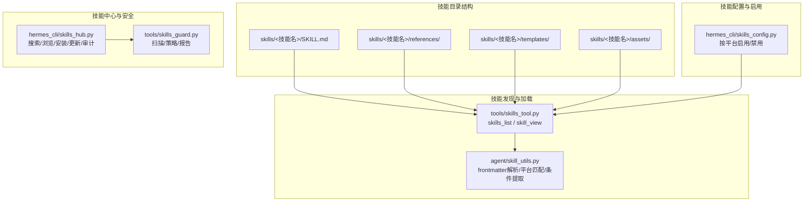
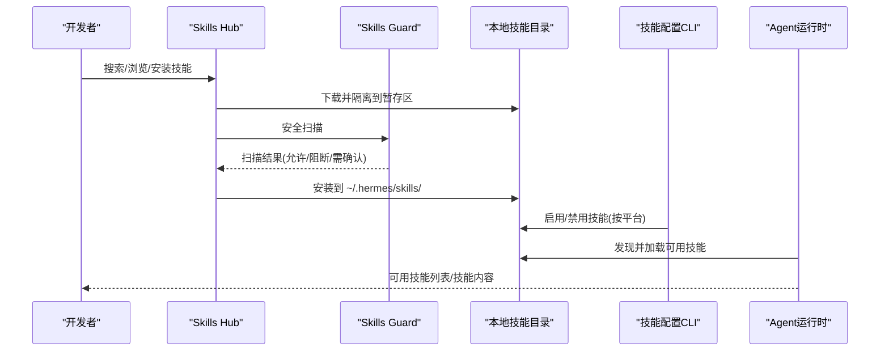
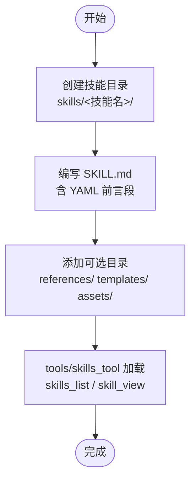
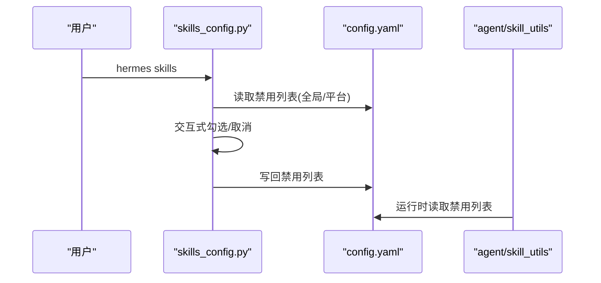
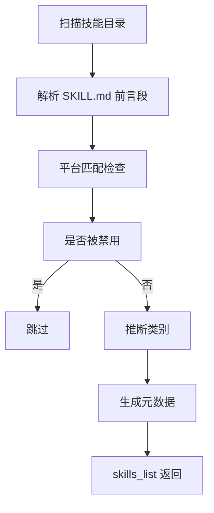
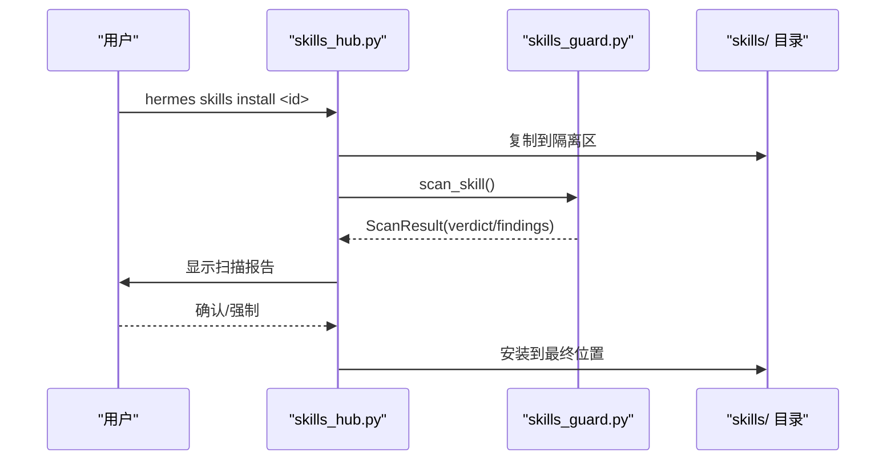
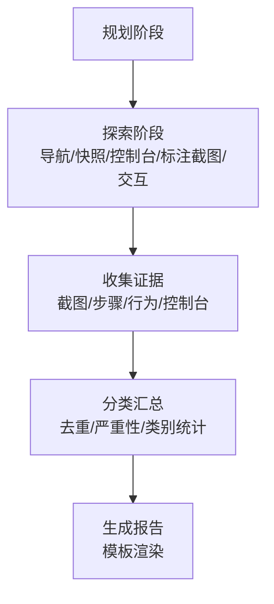
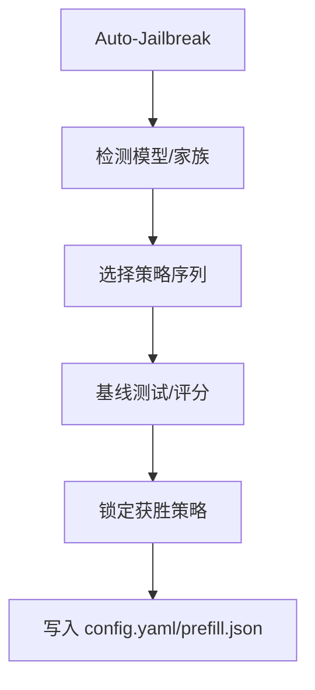
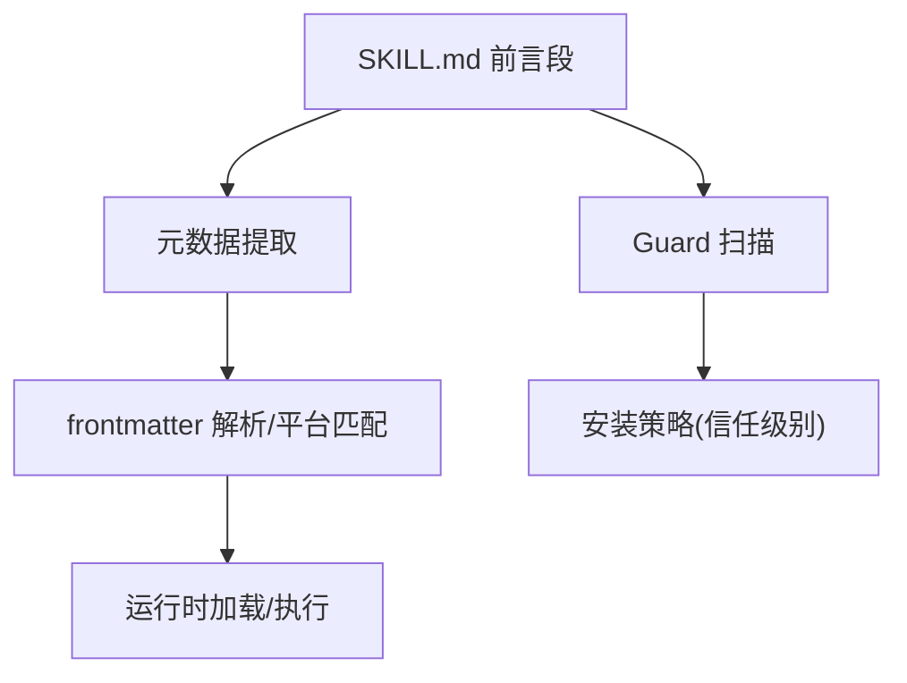
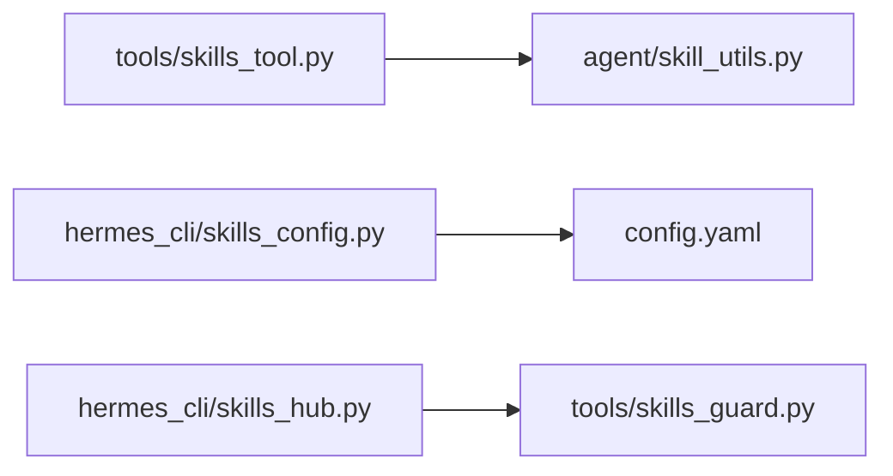

# 技能创建与开发

<cite>
**本文引用的文件**
- [skills/dogfood/SKILL.md](file://skills/dogfood/SKILL.md)
- [skills/red-teaming/godmode/SKILL.md](file://skills/red-teaming/godmode/SKILL.md)
- [skills/dogfood/references/issue-taxonomy.md](file://skills/dogfood/references/issue-taxonomy.md)
- [skills/dogfood/templates/dogfood-report-template.md](file://skills/dogfood/templates/dogfood-report-template.md)
- [skills/domain/DESCRIPTION.md](file://skills/domain/DESCRIPTION.md)
- [tools/skills_tool.py](file://tools/skills_tool.py)
- [agent/skill_utils.py](file://agent/skill_utils.py)
- [hermes_cli/skills_config.py](file://hermes_cli/skills_config.py)
- [hermes_cli/skills_hub.py](file://hermes_cli/skills_hub.py)
- [tools/skills_guard.py](file://tools/skills_guard.py)
- [README.md](file://README.md)
</cite>

## 目录
1. [简介](#简介)
2. [项目结构](#项目结构)
3. [核心组件](#核心组件)
4. [架构总览](#架构总览)
5. [详细组件分析](#详细组件分析)
6. [依赖分析](#依赖分析)
7. [性能考虑](#性能考虑)
8. [故障排查指南](#故障排查指南)
9. [结论](#结论)
10. [附录](#附录)

## 简介
本指南面向希望在 Hermes Agent 上创建与开发“技能”的开发者，提供从零到一的完整流程：技能模板使用、文件结构、配置编写、实现方法、最佳实践、代码规范、测试要求、调试技巧、性能优化与安全考虑。文中结合仓库中的真实技能示例（如 QA 自动化技能与红队模型越狱技能），帮助你快速上手并构建高质量、可维护、可复用的技能。

## 项目结构
Hermes 的技能系统以“目录即技能”为核心，每个技能是一个独立目录，包含主文档 SKILL.md 以及可选的 references、templates、assets 等子目录。技能发现与加载由工具模块负责；技能配置与启用/禁用由 CLI 模块管理；第三方技能安装与安全扫描由 Skills Hub 与 Guard 模块完成。

图示来源
- [tools/skills_tool.py:14-67](file://tools/skills_tool.py#L14-L67)
- [agent/skill_utils.py:52-86](file://agent/skill_utils.py#L52-L86)
- [hermes_cli/skills_config.py:1-178](file://hermes_cli/skills_config.py#L1-L178)
- [hermes_cli/skills_hub.py:1-1239](file://hermes_cli/skills_hub.py#L1-L1239)
- [tools/skills_guard.py:1-978](file://tools/skills_guard.py#L1-L978)

章节来源
- [tools/skills_tool.py:14-67](file://tools/skills_tool.py#L14-L67)
- [agent/skill_utils.py:52-86](file://agent/skill_utils.py#L52-L86)
- [hermes_cli/skills_config.py:1-178](file://hermes_cli/skills_config.py#L1-L178)
- [hermes_cli/skills_hub.py:1-1239](file://hermes_cli/skills_hub.py#L1-L1239)
- [tools/skills_guard.py:1-978](file://tools/skills_guard.py#L1-L978)

## 核心组件
- 技能文档与元数据：SKILL.md 使用 YAML 前言段声明名称、描述、版本、平台限制、前置条件、元数据等，支持 tags、related_skills 等扩展字段。
- 技能发现与视图：tools/skills_tool 提供 skills_list（仅元数据）、skill_view（按需加载全文与关联文件）。
- 元数据工具：agent/skill_utils 负责 frontmatter 解析、平台匹配、禁用列表读取、外部目录扫描、条件与配置变量提取。
- 技能配置：hermes_cli/skills_config 提供按平台启用/禁用技能的交互式界面。
- 技能中心与安全：hermes_cli/skills_hub 提供搜索、浏览、安装、更新、审计；tools/skills_guard 提供威胁模式扫描与信任策略。

章节来源
- [tools/skills_tool.py:14-67](file://tools/skills_tool.py#L14-L67)
- [agent/skill_utils.py:52-86](file://agent/skill_utils.py#L52-L86)
- [hermes_cli/skills_config.py:1-178](file://hermes_cli/skills_config.py#L1-L178)
- [hermes_cli/skills_hub.py:1-1239](file://hermes_cli/skills_hub.py#L1-L1239)
- [tools/skills_guard.py:1-978](file://tools/skills_guard.py#L1-L978)

## 架构总览
技能生命周期：定义（SKILL.md）→ 发现（tools/skills_tool）→ 元数据处理（agent/skill_utils）→ 配置控制（hermes_cli/skills_config）→ 安装/更新/审计（hermes_cli/skills_hub + tools/skills_guard）→ 运行期加载与执行（由技能自身逻辑与工具集协作）。

图示来源
- [hermes_cli/skills_hub.py:310-466](file://hermes_cli/skills_hub.py#L310-L466)
- [tools/skills_guard.py:595-677](file://tools/skills_guard.py#L595-L677)
- [hermes_cli/skills_config.py:125-178](file://hermes_cli/skills_config.py#L125-L178)
- [tools/skills_tool.py:779-800](file://tools/skills_tool.py#L779-L800)

## 详细组件分析

### 组件A：技能模板与文件结构
- 目录组织：技能根目录下必须有 SKILL.md；可选 references、templates、assets 子目录用于存放参考材料、模板与资源。
- SKILL.md 前言段：name、description、version、license、platforms、prerequisites、compatibility、metadata.herme.* 等。
- 关联文件：通过 skill_view 可按需加载 references/*、templates/*、assets/*。
- 示例参考：QA 自动化技能提供了完整的模板与分类体系；域名情报技能提供了简明的领域能力说明。

图示来源
- [tools/skills_tool.py:14-67](file://tools/skills_tool.py#L14-L67)
- [skills/dogfood/SKILL.md:1-162](file://skills/dogfood/SKILL.md#L1-L162)
- [skills/domain/DESCRIPTION.md:1-25](file://skills/domain/DESCRIPTION.md#L1-L25)

章节来源
- [tools/skills_tool.py:14-67](file://tools/skills_tool.py#L14-L67)
- [skills/dogfood/SKILL.md:1-162](file://skills/dogfood/SKILL.md#L1-L162)
- [skills/domain/DESCRIPTION.md:1-25](file://skills/domain/DESCRIPTION.md#L1-L25)

### 组件B：技能配置与启用/禁用
- 全局与平台级禁用：config.yaml 中 skills.disabled 与 skills.platform_disabled 支持按平台覆盖。
- 交互式配置：hermes_cli/skills_config 提供按类或单项切换、平台选择、保存等功能。
- 平台解析：根据环境变量或会话上下文解析当前平台，决定禁用集合。

图示来源
- [hermes_cli/skills_config.py:125-178](file://hermes_cli/skills_config.py#L125-L178)
- [agent/skill_utils.py:121-169](file://agent/skill_utils.py#L121-L169)

章节来源
- [hermes_cli/skills_config.py:1-178](file://hermes_cli/skills_config.py#L1-L178)
- [agent/skill_utils.py:121-169](file://agent/skill_utils.py#L121-L169)

### 组件C：技能发现与元数据处理
- 发现策略：递归扫描 ~/.hermes/skills 与 external_dirs，排除 .git/.github/.hub，按平台过滤。
- 元数据提取：frontmatter 解析、平台匹配、禁用过滤、类别推断、描述截断。
- 条件与配置：提取 requires/fallback 等条件字段，收集技能声明的配置变量清单。

图示来源
- [tools/skills_tool.py:512-586](file://tools/skills_tool.py#L512-L586)
- [agent/skill_utils.py:52-86](file://agent/skill_utils.py#L52-L86)
- [agent/skill_utils.py:241-255](file://agent/skill_utils.py#L241-L255)
- [agent/skill_utils.py:261-317](file://agent/skill_utils.py#L261-L317)

章节来源
- [tools/skills_tool.py:512-586](file://tools/skills_tool.py#L512-L586)
- [agent/skill_utils.py:52-86](file://agent/skill_utils.py#L52-L86)
- [agent/skill_utils.py:241-255](file://agent/skill_utils.py#L241-L255)
- [agent/skill_utils.py:261-317](file://agent/skill_utils.py#L261-L317)

### 组件D：技能中心与安全扫描
- 安装流程：解析标识符 → 获取元数据与包 → 复制到隔离区 → 安全扫描 → 用户确认 → 安装到目标目录 → 清理缓存。
- 扫描规则：基于正则的威胁模式检测（数据外泄、注入、破坏性操作、持久化、网络、混淆、路径穿越、供应链、权限提升等）。
- 信任策略：builtin/trusted/community 的安装决策矩阵，支持强制覆盖。

图示来源
- [hermes_cli/skills_hub.py:310-466](file://hermes_cli/skills_hub.py#L310-L466)
- [tools/skills_guard.py:595-677](file://tools/skills_guard.py#L595-L677)

章节来源
- [hermes_cli/skills_hub.py:310-466](file://hermes_cli/skills_hub.py#L310-L466)
- [tools/skills_guard.py:595-677](file://tools/skills_guard.py#L595-L677)

### 组件E：实现方法与工作流示例

#### 示例1：QA 自动化技能（系统化探索式测试）
- 输入：目标 URL、测试范围、输出目录（可选）。
- 流程：规划阶段 → 探索阶段（导航/快照/控制台/标注截图/交互）→ 收集证据（截图/步骤/行为对比/控制台错误）→ 分类汇总（去重/严重性/类别）→ 生成报告（模板填充）。
- 工具参考：browser_* 系列工具（导航、快照、点击、输入、滚动、后退、按键、视觉分析、控制台）。
- 输出：截图目录与结构化报告。

图示来源
- [skills/dogfood/SKILL.md:29-136](file://skills/dogfood/SKILL.md#L29-L136)
- [skills/dogfood/references/issue-taxonomy.md:1-110](file://skills/dogfood/references/issue-taxonomy.md#L1-L110)
- [skills/dogfood/templates/dogfood-report-template.md:1-87](file://skills/dogfood/templates/dogfood-report-template.md#L1-L87)

章节来源
- [skills/dogfood/SKILL.md:1-162](file://skills/dogfood/SKILL.md#L1-L162)
- [skills/dogfood/references/issue-taxonomy.md:1-110](file://skills/dogfood/references/issue-taxonomy.md#L1-L110)
- [skills/dogfood/templates/dogfood-report-template.md:1-87](file://skills/dogfood/templates/dogfood-report-template.md#L1-L87)

#### 示例2：红队越狱技能（多技术组合）
- 攻击模式：GODMODE 经典系统提示模板、Parseltongue 输入混淆（33 种）、ULTRAPLINIAN 多模型竞速。
- 自动越狱：自动识别模型家族 → 选择策略顺序 → 基线测试 → 评分 → 锁定策略（系统提示 + 预填消息）。
- 安全注意：编码升级顺序、预填消息的临时性、灰度与硬拒区分、避免过度编码。

图示来源
- [skills/red-teaming/godmode/SKILL.md:55-116](file://skills/red-teaming/godmode/SKILL.md#L55-L116)
- [skills/red-teaming/godmode/SKILL.md:323-334](file://skills/red-tearming/godmode/SKILL.md#L323-L334)

章节来源
- [skills/red-teaming/godmode/SKILL.md:1-404](file://skills/red-teaming/godmode/SKILL.md#L1-L404)

### 概念总览
- 技能标准：遵循 agentskills.io 兼容格式，前言段字段丰富，支持标签、相关技能、平台限制、前置条件与元数据。
- 运行期加载：技能内容按需加载，避免一次性解析全部技能带来的开销。
- 安全优先：第三方技能安装前进行静态扫描与信任策略评估，支持强制覆盖与审计。

图示来源
- [tools/skills_tool.py:414-422](file://tools/skills_tool.py#L414-L422)
- [agent/skill_utils.py:52-86](file://agent/skill_utils.py#L52-L86)
- [tools/skills_guard.py:41-47](file://tools/skills_guard.py#L41-L47)

## 依赖分析
- 组件耦合：
  - tools/skills_tool 依赖 agent/skill_utils 进行 frontmatter 与平台匹配。
  - hermes_cli/skills_config 依赖 hermes_cli/config 读取/保存配置。
  - hermes_cli/skills_hub 依赖 tools/skills_guard 进行扫描与策略判断。
- 外部依赖：
  - 技能安装涉及 GitHub API（受速率限制影响），可通过认证令牌提升限额。
  - 第三方脚本可能需要额外命令或环境变量（由技能 frontmatter 的 prerequisites/setup/required_environment_variables 声明）。

图示来源
- [tools/skills_tool.py:134-142](file://tools/skills_tool.py#L134-L142)
- [hermes_cli/skills_config.py:16-18](file://hermes_cli/skills_config.py#L16-L18)
- [hermes_cli/skills_hub.py:314-318](file://hermes_cli/skills_hub.py#L314-L318)

章节来源
- [tools/skills_tool.py:134-142](file://tools/skills_tool.py#L134-L142)
- [hermes_cli/skills_config.py:16-18](file://hermes_cli/skills_config.py#L16-L18)
- [hermes_cli/skills_hub.py:314-318](file://hermes_cli/skills_hub.py#L314-L318)

## 性能考虑
- 渐进披露：skills_list 仅返回元数据，避免大文本解析；按需使用 skill_view 加载全文与关联文件。
- 目录扫描优化：排除 .git/.github/.hub，限制最大文件数与大小，减少 IO 压力。
- 缓存与刷新：安装/卸载第三方技能后清理提示词缓存，确保新技能立即生效。
- 平台匹配：提前过滤不兼容平台，减少无效加载。

章节来源
- [tools/skills_tool.py:711-777](file://tools/skills_tool.py#L711-L777)
- [tools/skills_tool.py:800-800](file://tools/skills_tool.py#L800-L800)
- [tools/skills_guard.py:486-496](file://tools/skills_guard.py#L486-L496)
- [hermes_cli/skills_hub.py:456-466](file://hermes_cli/skills_hub.py#L456-L466)

## 故障排查指南
- 安装失败：
  - 检查 GitHub API 速率限制，设置 GITHUB_TOKEN 或使用 gh auth login。
  - 查看扫描报告，确认危险/警示项是否触发安装策略。
- 安全扫描阻断：
  - 使用 --force 强制安装（谨慎），或修复潜在问题后重新扫描。
  - 对于社区源，任何 findings 将被阻断，除非强制。
- 平台不兼容：
  - 确认 SKILL.md 中 platforms 字段与当前系统匹配。
- 环境变量缺失：
  - 检查 required_environment_variables/setup.collect_secrets 是否已正确配置；在网关表面无法安全输入时，建议在本地 CLI 中完成。

章节来源
- [hermes_cli/skills_hub.py:338-356](file://hermes_cli/skills_hub.py#L338-L356)
- [tools/skills_guard.py:642-677](file://tools/skills_guard.py#L642-L677)
- [tools/skills_tool.py:209-273](file://tools/skills_tool.py#L209-L273)

## 结论
通过标准化的 SKILL.md 前言段、渐进披露的发现与加载机制、严格的安装与安全策略，Hermes 的技能系统实现了“易开发、易分发、易维护、易运行”。结合本文提供的模板、流程与最佳实践，你可以高效地创建高质量技能，并在不同平台上稳定运行。

## 附录

### A. 技能模板使用与最佳实践
- 命名与描述：严格遵守长度限制，描述清晰且可被截断显示。
- 平台限制：明确 platforms 字段，避免在不兼容系统上加载。
- 前置条件：使用 prerequisites/setup/required_environment_variables 声明必要环境变量与命令。
- 元数据：合理使用 tags/related_skills/metadata.herme.*，便于搜索与条件匹配。
- 文件组织：将参考材料放入 references，输出模板放入 templates，资源放入 assets。

章节来源
- [tools/skills_tool.py:94-104](file://tools/skills_tool.py#L94-L104)
- [tools/skills_tool.py:152-161](file://tools/skills_tool.py#L152-L161)
- [tools/skills_tool.py:209-273](file://tools/skills_tool.py#L209-L273)

### B. 配置编写与测试要求
- 配置变量：在 metadata.herme.config 中声明 key/description/default/prompt，运行时从 config.yaml.skills.config.<key> 读取并展开路径。
- 平台与条件：通过 metadata.herme.requires/fallback_for_toolsets/tools 控制工具集与工具的可用性。
- 测试：对第三方脚本进行最小化测试，验证环境变量与命令可用性；对浏览器类技能进行 UI 行为回归测试。

章节来源
- [agent/skill_utils.py:261-317](file://agent/skill_utils.py#L261-L317)
- [agent/skill_utils.py:241-255](file://agent/skill_utils.py#L241-L255)

### C. 安全考虑与合规
- Trust 策略：builtin 允许，trusted 警告可接受，community 任何 findings 即阻断。
- 威胁模式：涵盖 exfiltration、injection、destructive、persistence、network、obfuscation、execution、traversal、mining、supply_chain、privilege_escalation、credential_exposure 等。
- 审计与更新：定期检查上游更新，对已安装技能重新扫描与审计。

章节来源
- [tools/skills_guard.py:41-47](file://tools/skills_guard.py#L41-L47)
- [tools/skills_guard.py:82-484](file://tools/skills_guard.py#L82-L484)
- [hermes_cli/skills_hub.py:576-617](file://hermes_cli/skills_hub.py#L576-L617)

### D. 实际技能开发案例
- QA 自动化技能：系统化探索式测试流程、证据收集与报告生成。
- 红队越狱技能：多技术组合与自动越狱策略、灰度与硬拒区分、编码升级。
- 域情报技能：纯 Python 标准库实现的被动域情报采集，零依赖、零密钥。

章节来源
- [skills/dogfood/SKILL.md:1-162](file://skills/dogfood/SKILL.md#L1-L162)
- [skills/red-teaming/godmode/SKILL.md:1-404](file://skills/red-teaming/godmode/SKILL.md#L1-L404)
- [skills/domain/DESCRIPTION.md:1-25](file://skills/domain/DESCRIPTION.md#L1-L25)