# 技能安全最佳实践

<cite>
**本文档引用的文件**
- [agent/credential_pool.py](file://agent/credential_pool.py)
- [hermes_cli/auth.py](file://hermes_cli/auth.py)
- [tools/credential_files.py](file://tools/credential_files.py)
- [tools/path_security.py](file://tools/path_security.py)
- [agent/redact.py](file://agent/redact.py)
- [tools/skills_guard.py](file://tools/skills_guard.py)
- [acp_adapter/auth.py](file://acp_adapter/auth.py)
- [acp_adapter/permissions.py](file://acp_adapter/permissions.py)
- [gateway/config.py](file://gateway/config.py)
- [gateway/run.py](file://gateway/run.py)
</cite>

## 目录
1. [简介](#简介)
2. [项目结构](#项目结构)
3. [核心组件](#核心组件)
4. [架构概览](#架构概览)
5. [详细组件分析](#详细组件分析)
6. [依赖分析](#依赖分析)
7. [性能考虑](#性能考虑)
8. [故障排除指南](#故障排除指南)
9. [结论](#结论)

## 简介

本指南为Hermes Agent技能开发提供权威的安全最佳实践指导。基于代码库的实际实现，系统阐述了技能开发中的安全考虑和防护措施，包括输入验证、权限控制、数据保护和访问控制等方面。

Hermes Agent采用多层安全架构，从凭证管理到技能扫描，从权限控制到数据脱敏，构建了完整的安全防护体系。本指南将详细分析这些安全机制，并提供实用的安全开发指导。

## 项目结构

Hermes Agent的安全架构主要分布在以下模块中：

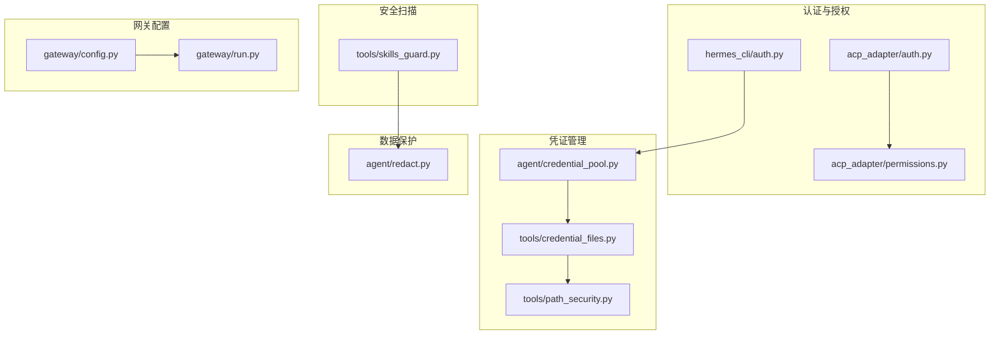

**图表来源**
- [hermes_cli/auth.py:1-100](file://hermes_cli/auth.py#L1-L100)
- [agent/credential_pool.py:1-100](file://agent/credential_pool.py#L1-L100)
- [tools/skills_guard.py:1-100](file://tools/skills_guard.py#L1-L100)

**章节来源**
- [hermes_cli/auth.py:1-200](file://hermes_cli/auth.py#L1-L200)
- [agent/credential_pool.py:1-200](file://agent/credential_pool.py#L1-L200)
- [tools/skills_guard.py:1-200](file://tools/skills_guard.py#L1-L200)

## 核心组件

### 凭证池管理系统

Hermes Agent实现了持久化的多凭证池系统，支持同提供商的故障转移和负载均衡：

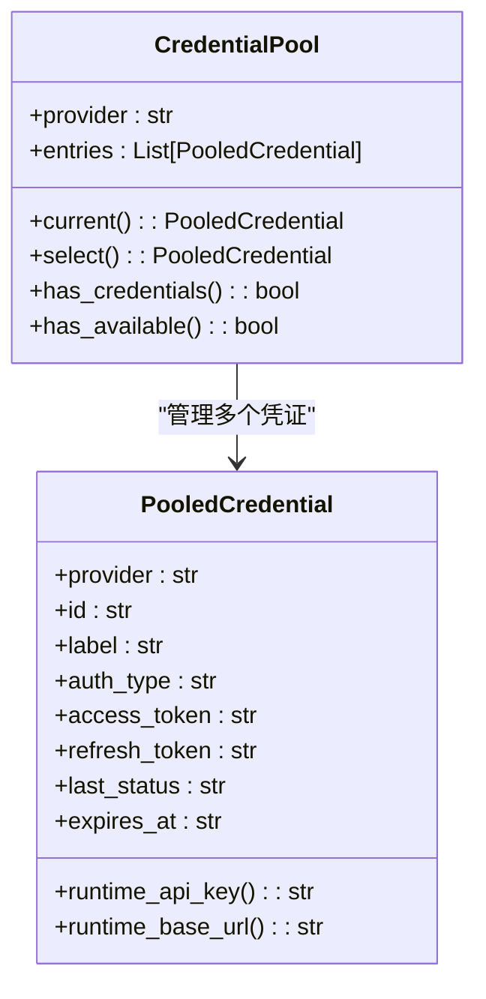

**图表来源**
- [agent/credential_pool.py:358-420](file://agent/credential_pool.py#L358-L420)
- [agent/credential_pool.py:92-173](file://agent/credential_pool.py#L92-L173)

### 技能安全扫描器

技能安全扫描器使用正则表达式进行静态分析，检测已知的恶意模式：

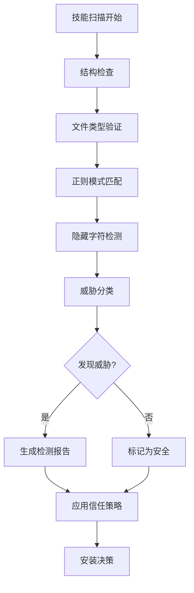

**图表来源**
- [tools/skills_guard.py:595-640](file://tools/skills_guard.py#L595-L640)
- [tools/skills_guard.py:530-593](file://tools/skills_guard.py#L530-L593)

**章节来源**
- [agent/credential_pool.py:358-800](file://agent/credential_pool.py#L358-L800)
- [tools/skills_guard.py:1-400](file://tools/skills_guard.py#L1-L400)

## 架构概览

Hermes Agent的安全架构采用分层设计，每层都有明确的安全职责：

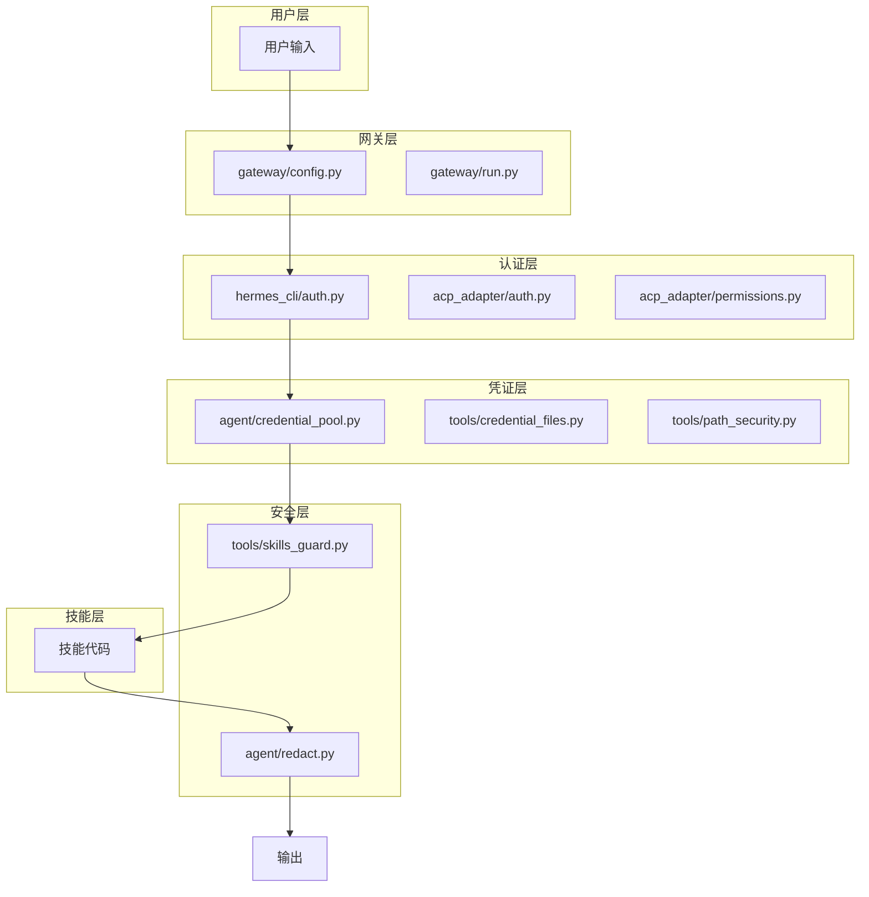

**图表来源**
- [gateway/config.py:220-420](file://gateway/config.py#L220-L420)
- [hermes_cli/auth.py:909-1004](file://hermes_cli/auth.py#L909-L1004)
- [tools/skills_guard.py:595-640](file://tools/skills_guard.py#L595-L640)

## 详细组件分析

### 凭证管理与存储

#### 多提供商认证系统

Hermes Agent支持多种认证提供商，包括OAuth设备码流程和传统API密钥：

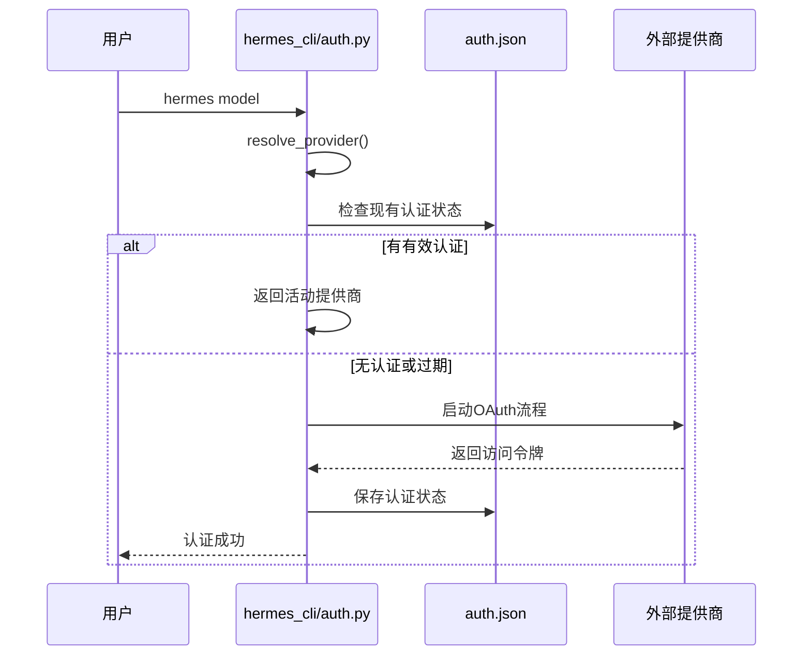

**图表来源**
- [hermes_cli/auth.py:909-1004](file://hermes_cli/auth.py#L909-L1004)
- [hermes_cli/auth.py:1257-1361](file://hermes_cli/auth.py#L1257-L1361)

#### 凭证池策略

凭证池支持多种选择策略，确保高可用性和负载均衡：

| 策略类型 | 描述 | 适用场景 |
|---------|------|----------|
| fill_first | 填充优先 | 首次使用，确保所有凭证都尝试过 |
| round_robin | 轮询 | 平均分配负载 |
| random | 随机 | 避免热点 |
| least_used | 最少使用 | 基于使用频率的智能分配 |

**章节来源**
- [agent/credential_pool.py:55-70](file://agent/credential_pool.py#L55-L70)
- [agent/credential_pool.py:339-353](file://agent/credential_pool.py#L339-L353)

### 技能安全扫描

#### 威胁模式检测

技能扫描器使用超过400个正则表达式模式检测各种威胁：

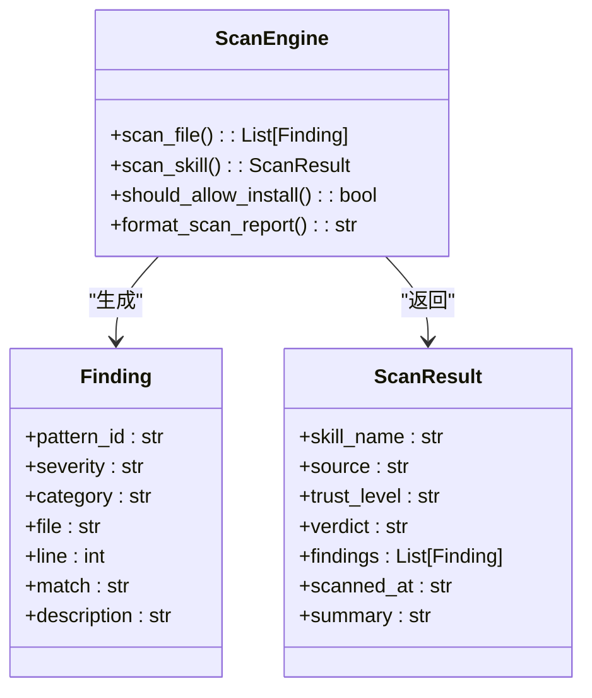

**图表来源**
- [tools/skills_guard.py:56-76](file://tools/skills_guard.py#L56-L76)
- [tools/skills_guard.py:530-593](file://tools/skills_guard.py#L530-L593)

#### 安全扫描类别

| 类别 | 威胁示例 | 严重级别 |
|------|----------|----------|
| 数据泄露 | curl环境变量、SSH目录访问 | critical/high |
| 注入攻击 | 忽略先前指令、角色劫持 | critical/high |
| 破坏性操作 | 递归删除根目录、格式化文件系统 | critical |
| 权限提升 | sudo使用、SUID位设置 | critical |
| 网络威胁 | 反向shell、隧道服务 | critical/high |
| 隐藏字符 | 零宽字符、Unicode注入 | high |

**章节来源**
- [tools/skills_guard.py:82-484](file://tools/skills_guard.py#L82-L484)

### 数据保护与脱敏

#### 敏感信息脱敏

Hermes Agent实现了多层次的数据脱敏机制：

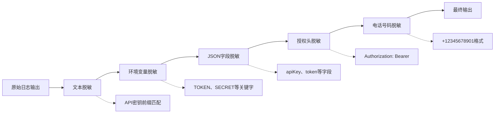

**图表来源**
- [agent/redact.py:113-171](file://agent/redact.py#L113-L171)

#### 脱敏规则

| 规则类型 | 匹配模式 | 示例 | 保留长度 |
|----------|----------|------|----------|
| API密钥 | sk-[A-Za-z0-9_-]{10,} | sk-abcdefghijklmnopqrstuvwxyz1234567890 | 全部掩码 |
| GitHub令牌 | ghp_/github_pat_ | ghp_abcd1234... | 全部掩码 |
| AWS密钥 | AKIA[A-Z0-9]{16} | AKIAABCDEFG123456789 | 全部掩码 |
| 长令牌 | >18字符 | abcdef...xyz | 前6后4 |
| 短令牌 | ≤18字符 | abcd...xyz | 全部掩码 |

**章节来源**
- [agent/redact.py:20-104](file://agent/redact.py#L20-L104)
- [agent/redact.py:106-171](file://agent/redact.py#L106-L171)

### 权限控制系统

#### ACP权限桥接

Hermes Agent通过ACP（Agent Control Protocol）实现权限控制：

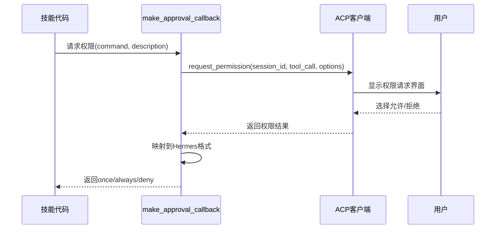

**图表来源**
- [acp_adapter/permissions.py:26-78](file://acp_adapter/permissions.py#L26-L78)

#### 运行时权限检测

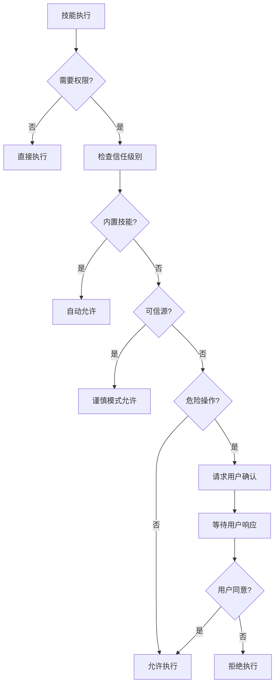

**图表来源**
- [tools/skills_guard.py:41-47](file://tools/skills_guard.py#L41-L47)
- [acp_adapter/permissions.py:43-76](file://acp_adapter/permissions.py#L43-L76)

**章节来源**
- [acp_adapter/permissions.py:1-78](file://acp_adapter/permissions.py#L1-L78)
- [tools/skills_guard.py:41-47](file://tools/skills_guard.py#L41-L47)

### 文件路径安全

#### 路径遍历防护

Hermes Agent实现了严格的路径安全检查：

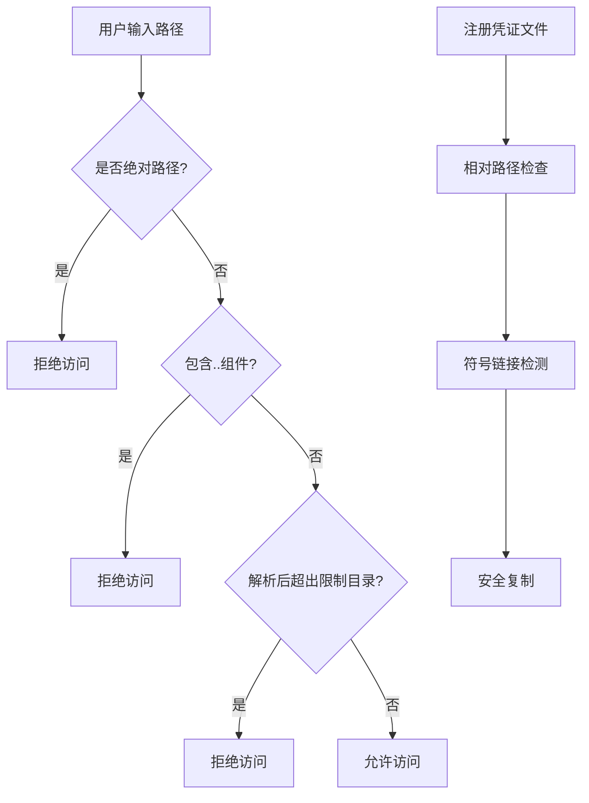

**图表来源**
- [tools/credential_files.py:55-103](file://tools/credential_files.py#L55-L103)
- [tools/path_security.py:15-35](file://tools/path_security.py#L15-L35)

**章节来源**
- [tools/credential_files.py:55-128](file://tools/credential_files.py#L55-L128)
- [tools/path_security.py:15-44](file://tools/path_security.py#L15-L44)

## 依赖分析

### 安全相关依赖关系

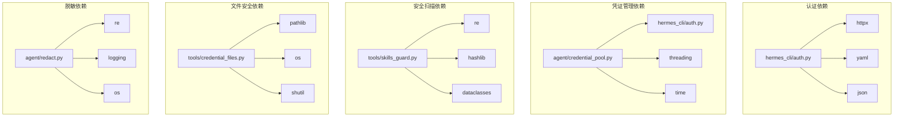

**图表来源**
- [hermes_cli/auth.py:37-42](file://hermes_cli/auth.py#L37-L42)
- [agent/credential_pool.py:1-20](file://agent/credential_pool.py#L1-L20)
- [tools/skills_guard.py:25-31](file://tools/skills_guard.py#L25-L31)

### 安全配置管理

网关配置系统提供了全面的安全控制选项：

| 配置项 | 默认值 | 安全影响 |
|--------|--------|----------|
| session_reset.mode | both | 控制会话重置时机，防止上下文泄露 |
| unauthorized_dm_behavior | pair | 未授权私聊处理策略 |
| group_sessions_per_user | true | 分组会话隔离，防止上下文混淆 |
| always_log_local | true | 本地日志记录，便于审计 |
| stt_enabled | true | 语音转文字可能泄露敏感信息 |

**章节来源**
- [gateway/config.py:100-140](file://gateway/config.py#L100-L140)
- [gateway/config.py:431-439](file://gateway/config.py#L431-L439)

## 性能考虑

### 凭证池性能优化

凭证池系统采用了多项性能优化措施：

1. **线程安全锁机制**：使用细粒度锁减少竞争
2. **内存缓存**：避免频繁的磁盘I/O操作
3. **智能轮询**：根据使用情况动态调整选择策略
4. **异步刷新**：后台自动刷新过期凭证

### 技能扫描性能

技能扫描器在保证安全性的同时优化了性能：

1. **增量扫描**：只扫描变更的文件
2. **并发处理**：多文件并行扫描
3. **缓存机制**：重复扫描结果缓存
4. **结构预检查**：先进行快速结构检查

## 故障排除指南

### 常见安全问题诊断

#### 凭证认证失败

**症状**：技能执行时报认证错误
**排查步骤**：
1. 检查认证状态：`hermes doctor`
2. 验证环境变量设置
3. 查看认证日志文件
4. 重新执行认证流程

#### 技能安装被阻止

**症状**：技能下载后无法安装
**排查步骤**：
1. 查看扫描报告：`hermes skills scan`
2. 检查信任级别配置
3. 使用`--force`参数强制安装（不推荐）
4. 修复检测到的问题

#### 权限请求超时

**症状**：ACP权限请求无响应
**排查步骤**：
1. 检查网络连接
2. 验证ACP客户端状态
3. 增加超时时间
4. 检查防火墙设置

**章节来源**
- [hermes_cli/auth.py:516-540](file://hermes_cli/auth.py#L516-L540)
- [tools/skills_guard.py:679-713](file://tools/skills_guard.py#L679-L713)
- [acp_adapter/permissions.py:59-76](file://acp_adapter/permissions.py#L59-L76)

## 结论

Hermes Agent的技能安全最佳实践体现了多层次、全方位的安全防护理念。通过认证与授权分离、凭证池管理、技能安全扫描、数据脱敏和权限控制等机制，构建了完整的安全生态系统。

### 关键安全建议

1. **最小权限原则**：始终使用最小必要的权限执行技能
2. **定期审计**：定期运行`hermes doctor`检查系统健康状况
3. **及时更新**：保持Hermes Agent和技能的最新版本
4. **监控告警**：建立安全事件监控和告警机制
5. **备份恢复**：定期备份认证状态和配置文件

### 开发者最佳实践

- 在技能中避免硬编码敏感信息
- 使用环境变量管理配置
- 实现适当的输入验证和输出过滤
- 遵循最小权限原则设计工具访问
- 定期进行安全代码审查

通过遵循这些最佳实践，开发者可以构建更加安全可靠的Hermes Agent技能，为用户提供安全可靠的智能代理服务。