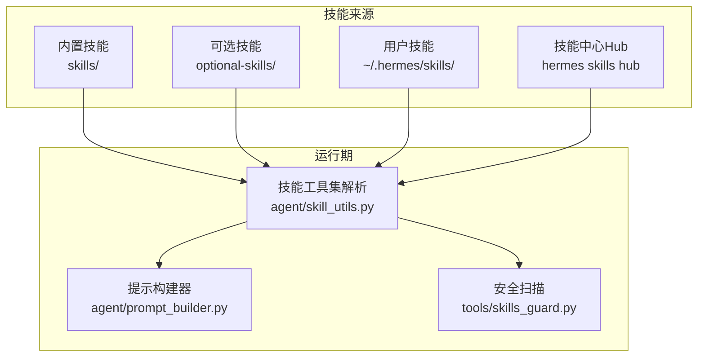
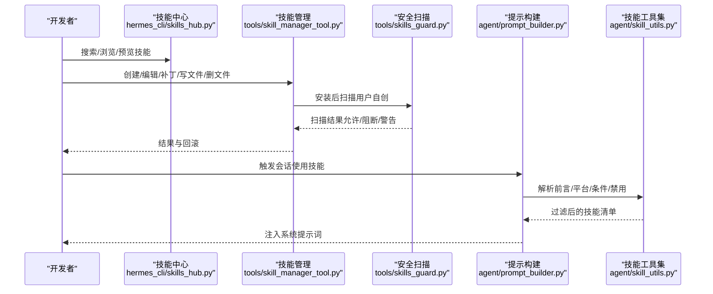
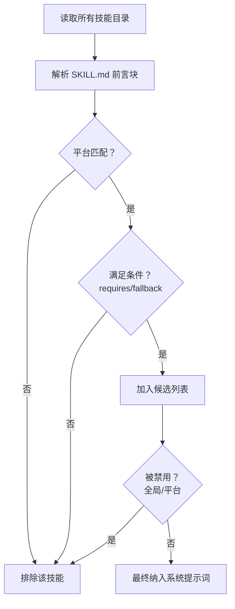
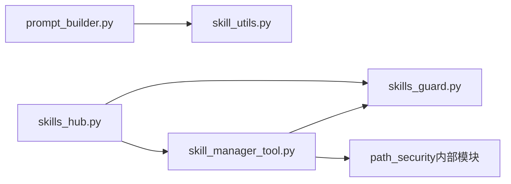

# 技能开发流程

<cite>
**本文引用的文件**
- [README.md](file://README.md)
- [CONTRIBUTING.md](file://CONTRIBUTING.md)
- [skills/README.md](file://skills/README.md)
- [skills/research/arxiv/SKILL.md](file://skills/research/arxiv/SKILL.md)
- [skills/github/github-auth/SKILL.md](file://skills/github/github-auth/SKILL.md)
- [skills/productivity/ocr-and-documents/SKILL.md](file://skills/productivity/ocr-and-documents/SKILL.md)
- [agent/skill_utils.py](file://agent/skill_utils.py)
- [agent/prompt_builder.py](file://agent/prompt_builder.py)
- [tools/skill_manager_tool.py](file://tools/skill_manager_tool.py)
- [tools/skills_guard.py](file://tools/skills_guard.py)
- [hermes_cli/skills_hub.py](file://hermes_cli/skills_hub.py)
- [hermes_cli/skills_config.py](file://hermes_cli/skills_config.py)
- [tests/tools/test_skill_manager_tool.py](file://tests/tools/test_skill_manager_tool.py)
</cite>

## 目录
1. [引言](#引言)
2. [项目结构](#项目结构)
3. [核心组件](#核心组件)
4. [架构总览](#架构总览)
5. [详细组件分析](#详细组件分析)
6. [依赖关系分析](#依赖关系分析)
7. [性能考量](#性能考量)
8. [故障排查指南](#故障排查指南)
9. [结论](#结论)
10. [附录](#附录)

## 引言
本指南面向希望在 Hermes Agent 上开发“技能（Skill）”的开发者，覆盖从需求评估、开发准备、编码实现、测试验证到发布部署的完整生命周期。文档强调标准流程与最佳实践，包括代码组织结构、命名规范、版本管理、调试技巧、性能优化与安全考虑，并提供可直接参考的示例与常见问题解决方案。

## 项目结构
Hermes Agent 的技能体系由“内置技能”“可选技能”“技能中心（Hub）”三部分组成，配合系统化的元数据格式、条件激活机制、安全扫描与配置开关，形成可发现、可维护、可复用的技能生态。

- 技能目录
  - 内置技能：skills/ 下按领域分类的官方技能
  - 可选技能：optional-skills/ 下的非默认启用技能
  - 用户技能：~/.hermes/skills/ 下的用户自定义技能
- 元数据与条件
  - SKILL.md 使用 YAML 前言块声明名称、描述、平台限制、工具集依赖、配置变量等
  - 系统根据当前可用工具集动态筛选显示技能
- 安全与质量
  - 技能安装前进行安全扫描；用户自创技能与 Hub 技能采用一致的扫描策略
  - 提供技能管理工具，支持原子写入、回滚、补丁式更新与文件级增删

图示来源
- [agent/prompt_builder.py:1-200](file://agent/prompt_builder.py#L1-L200)
- [agent/skill_utils.py:1-444](file://agent/skill_utils.py#L1-L444)
- [tools/skills_guard.py:1-200](file://tools/skills_guard.py#L1-L200)

章节来源
- [README.md:1-179](file://README.md#L1-L179)
- [CONTRIBUTING.md:114-197](file://CONTRIBUTING.md#L114-L197)

## 核心组件
- 提示构建与技能注入
  - prompt_builder 负责拼装系统提示词，包含身份、记忆、上下文文件与技能列表
  - 通过 skill_utils 解析 SKILL.md 前言块、平台匹配、条件过滤与禁用列表
- 技能管理工具
  - skill_manager_tool 提供创建、编辑、补丁、删除、写文件、删文件等操作
  - 支持原子写入、路径校验、内容大小限制、安全扫描与缓存清理
- 技能中心与配置
  - skills_hub 提供搜索、浏览、预览、安装能力
  - skills_config 提供按平台启用/禁用技能的配置入口
- 安全扫描
  - skills_guard 对外部来源技能进行威胁模式识别与信任策略判定

章节来源
- [agent/prompt_builder.py:1-200](file://agent/prompt_builder.py#L1-L200)
- [agent/skill_utils.py:1-444](file://agent/skill_utils.py#L1-L444)
- [tools/skill_manager_tool.py:1-762](file://tools/skill_manager_tool.py#L1-L762)
- [hermes_cli/skills_hub.py:1-200](file://hermes_cli/skills_hub.py#L1-L200)
- [hermes_cli/skills_config.py:1-178](file://hermes_cli/skills_config.py#L1-L178)
- [tools/skills_guard.py:1-200](file://tools/skills_guard.py#L1-L200)

## 架构总览
下图展示从“需求评估”到“技能上线”的端到端流程，以及关键模块之间的交互。

图示来源
- [hermes_cli/skills_hub.py:144-182](file://hermes_cli/skills_hub.py#L144-L182)
- [tools/skill_manager_tool.py:588-647](file://tools/skill_manager_tool.py#L588-L647)
- [tools/skills_guard.py:1-200](file://tools/skills_guard.py#L1-L200)
- [agent/prompt_builder.py:1-200](file://agent/prompt_builder.py#L1-L200)
- [agent/skill_utils.py:1-444](file://agent/skill_utils.py#L1-L444)

## 详细组件分析

### 组件一：需求评估与技能定位
- 评估是否应做成“技能”而非“工具”
  - 技能：以“指令+命令行+现有工具”表达的能力，无需在代理中嵌入密钥管理或定制 Python 集成
  - 工具：需要代理侧的认证流、多组件配置或实时事件处理
- 判断是否应打包为内置或可选技能
  - 内置：对大多数用户广泛有用
  - 可选：官方但通用性有限或有重型依赖
  - 社区：上传至 Skills Hub，便于分享与复用

章节来源
- [CONTRIBUTING.md:21-49](file://CONTRIBUTING.md#L21-L49)

### 组件二：开发环境准备
- 开发环境搭建
  - Python 3.11、uv、Node.js（浏览器工具/WhatsApp 桥接可选）
  - 安装与配置：创建虚拟环境、安装开发依赖、准备 ~/.hermes/ 目录与配置
- 运行与测试
  - 使用 hermes doctor 诊断，hermes chat -q 快速验证

章节来源
- [CONTRIBUTING.md:52-111](file://CONTRIBUTING.md#L52-L111)

### 组件三：编码实现（SKILL.md 与目录结构）
- 目录结构
  - ~/.hermes/skills/<类别>/<技能名>/SKILL.md（必需）
  - 可选：references/、templates/、scripts/、assets/ 子目录
- SKILL.md 元数据
  - 必填：name、description
  - 可选：version、author、license、platforms、required_environment_variables、metadata.hermes.*
  - metadata.hermes 支持：
    - tags、related_skills
    - fallback_for_toolsets、requires_toolsets、fallback_for_tools、requires_tools
- 示例参考
  - arXiv 技能：无 API 密钥、纯 curl 的研究工作流
  - GitHub 认证：git/gh 两种路径的自动检测与配置
  - 文档提取：pymupdf 与 marker-pdf 的选择与边界

章节来源
- [CONTRIBUTING.md:302-463](file://CONTRIBUTING.md#L302-L463)
- [skills/research/arxiv/SKILL.md:1-282](file://skills/research/arxiv/SKILL.md#L1-L282)
- [skills/github/github-auth/SKILL.md:1-247](file://skills/github/github-auth/SKILL.md#L1-L247)
- [skills/productivity/ocr-and-documents/SKILL.md:1-172](file://skills/productivity/ocr-and-documents/SKILL.md#L1-L172)

### 组件四：技能管理工具（skill_manage）
- 支持动作
  - create、edit、patch、delete、write_file、remove_file
- 关键约束
  - 名称与分类校验（小写字母、数字、点、下划线、连字符，且首字符为字母或数字）
  - 前言块校验（必须以 --- 开头/结尾，包含 name 与 description）
  - 文件路径校验（仅允许 references/templates/scripts/assets 子目录，禁止路径穿越）
  - 内容大小限制（单个技能最大字符数、单文件最大字节数）
  - 原子写入与回滚（失败时恢复原内容）
  - 安全扫描（用户自创技能安装后扫描，阻断高危项）
- 行为特性
  - patch 默认要求唯一匹配，可通过 replace_all=true 替换全部
  - 更新后清理技能系统提示词缓存，确保新内容生效

```mermaid
flowchart TD
Start(["开始：调用 skill_manage"]) --> CheckAction["检查 action 参数"]
CheckAction --> |create| ValidateName["校验技能名/分类"]
ValidateName --> ValidateFM["校验前言块name/description/---"]
ValidateFM --> SizeLimit["校验内容大小/文件大小"]
SizeLimit --> AtomicWrite["原子写入 SKILL.md"]
AtomicWrite --> Scan["安全扫描用户自创"]
Scan --> |阻断| Rollback["回滚并报错"]
Scan --> |通过| ClearCache["清理技能提示词缓存"]
ClearCache --> Done(["完成"])
CheckAction --> |patch| FindFile["定位目标文件SKILL.md 或 supporting file"]
FindFile --> FuzzyMatch["模糊匹配替换支持 replace_all"]
FuzzyMatch --> SizeLimit2["校验新内容大小/前言完整性"]
SizeLimit2 --> AtomicWrite2["原子写入并扫描"]
AtomicWrite2 --> Scan2
Scan2 --> |阻断| Rollback2["回滚并报错"]
Scan2 --> |通过| ClearCache
```

图示来源
- [tools/skill_manager_tool.py:588-762](file://tools/skill_manager_tool.py#L588-L762)

章节来源
- [tools/skill_manager_tool.py:1-762](file://tools/skill_manager_tool.py#L1-L762)
- [tests/tools/test_skill_manager_tool.py:56-130](file://tests/tools/test_skill_manager_tool.py#L56-L130)

### 组件五：提示构建与技能可见性
- 平台匹配
  - 根据 platforms 字段过滤不兼容平台的技能
- 条件激活
  - fallback_for_toolsets/requires_toolsets/fallback_for_tools/requires_tools 控制技能在不同工具集可用性下的显示
- 禁用列表
  - 支持全局与按平台禁用，提升灵活性
- 缓存与一致性
  - 更新技能后清理技能系统提示词缓存，避免陈旧内容注入

图示来源
- [agent/skill_utils.py:92-168](file://agent/skill_utils.py#L92-L168)
- [agent/skill_utils.py:241-255](file://agent/skill_utils.py#L241-L255)
- [agent/skill_utils.py:121-168](file://agent/skill_utils.py#L121-L168)
- [agent/prompt_builder.py:1-200](file://agent/prompt_builder.py#L1-L200)

章节来源
- [agent/skill_utils.py:1-444](file://agent/skill_utils.py#L1-L444)
- [agent/prompt_builder.py:1-200](file://agent/prompt_builder.py#L1-L200)

### 组件六：技能中心与安装（Hub）
- 搜索与浏览
  - 支持关键字搜索、分页浏览、按来源过滤
- 预览与安装
  - 预览 SKILL.md 内容，确认后再安装
  - 安装后同样触发安全扫描与信任策略判定
- 信任级别
  - builtin（内置）、trusted（受信仓库）、community（社区）

章节来源
- [hermes_cli/skills_hub.py:144-182](file://hermes_cli/skills_hub.py#L144-L182)
- [hermes_cli/skills_hub.py:468-512](file://hermes_cli/skills_hub.py#L468-L512)
- [hermes_cli/skills_hub.py:741-761](file://hermes_cli/skills_hub.py#L741-L761)
- [tools/skills_guard.py:39-47](file://tools/skills_guard.py#L39-L47)

### 组件七：配置与发布
- 启用/禁用技能
  - 支持按平台维度配置，也可全局设置
- 发布建议
  - 在 Skills Hub 分享时，确保 SKILL.md 前言块完整、描述清晰、平台字段正确
  - 使用 metadata.hermes.* 明确工具集依赖与回退策略，提升可用性

章节来源
- [hermes_cli/skills_config.py:1-178](file://hermes_cli/skills_config.py#L1-L178)

## 依赖关系分析
- 模块耦合
  - skill_manager_tool 依赖 skills_guard 进行安全扫描，依赖 path_security 防止路径穿越
  - prompt_builder 依赖 skill_utils 解析与过滤技能
  - skills_hub 依赖统一搜索与源路由，安装后写入用户技能目录
- 外部依赖
  - Node.js（浏览器工具/WhatsApp 桥接可选）
  - uv（快速包管理）
- 循环依赖
  - 通过延迟导入与函数内导入避免循环

图示来源
- [tools/skill_manager_tool.py:1-762](file://tools/skill_manager_tool.py#L1-L762)
- [tools/skills_guard.py:1-200](file://tools/skills_guard.py#L1-L200)
- [agent/prompt_builder.py:1-200](file://agent/prompt_builder.py#L1-L200)
- [agent/skill_utils.py:1-444](file://agent/skill_utils.py#L1-L444)
- [hermes_cli/skills_hub.py:1-200](file://hermes_cli/skills_hub.py#L1-L200)

章节来源
- [tools/skill_manager_tool.py:1-762](file://tools/skill_manager_tool.py#L1-L762)
- [tools/skills_guard.py:1-200](file://tools/skills_guard.py#L1-L200)
- [agent/prompt_builder.py:1-200](file://agent/prompt_builder.py#L1-L200)
- [agent/skill_utils.py:1-444](file://agent/skill_utils.py#L1-L444)
- [hermes_cli/skills_hub.py:1-200](file://hermes_cli/skills_hub.py#L1-L200)

## 性能考量
- 提示词构建缓存
  - 更新技能后清理技能系统提示词缓存，避免重复加载与内存占用
- 文件写入与扫描
  - 原子写入减少中断风险；安全扫描在安装后执行，避免阻塞主流程
- 工具集与条件过滤
  - 仅注入当前可用工具集相关的技能，降低提示词长度与模型负担

章节来源
- [tools/skill_manager_tool.py:639-646](file://tools/skill_manager_tool.py#L639-L646)
- [agent/prompt_builder.py:1-200](file://agent/prompt_builder.py#L1-L200)

## 故障排查指南
- 常见问题与解决
  - 前言块缺失或不闭合：确保 SKILL.md 以 "---" 开始与结束，并包含 name 与 description
  - 路径穿越或非法子目录：仅允许 references/templates/scripts/assets，且不得包含 ".."
  - 内容过大：单个技能内容与单文件大小均有限制，必要时拆分为多个文件
  - 安全扫描阻断：检查是否存在 exfiltration、injection、destructive 等高危模式
  - 平台不兼容：确认 platforms 字段与当前系统匹配
  - 条件不满足：检查 metadata.hermes 的 requires/fallback 字段与当前工具集状态
- 测试与验证
  - 使用 pytest 验证技能管理工具的输入校验逻辑
  - 通过 hermes doctor 与简单对话验证技能加载与运行

章节来源
- [tools/skill_manager_tool.py:138-190](file://tools/skill_manager_tool.py#L138-L190)
- [tools/skill_manager_tool.py:217-243](file://tools/skill_manager_tool.py#L217-L243)
- [tools/skill_manager_tool.py:490-540](file://tools/skill_manager_tool.py#L490-L540)
- [tools/skills_guard.py:82-196](file://tools/skills_guard.py#L82-L196)
- [agent/skill_utils.py:92-116](file://agent/skill_utils.py#L92-L116)
- [agent/skill_utils.py:241-255](file://agent/skill_utils.py#L241-L255)
- [tests/tools/test_skill_manager_tool.py:56-130](file://tests/tools/test_skill_manager_tool.py#L56-L130)

## 结论
Hermes Agent 的技能开发流程以“元数据驱动 + 动态注入 + 安全扫描 + 配置开关”为核心，既保证了技能的可发现性与可维护性，又兼顾了安全性与跨平台兼容性。遵循本文提供的标准流程与最佳实践，开发者可以高效地完成从需求评估到技能发布的全过程，并在后续迭代中持续改进技能质量与用户体验。

## 附录
- 开发者速查
  - 环境：Python 3.11、uv、Node.js（可选）
  - 命令：hermes doctor、hermes chat -q、hermes skills browse/search/inspect/install
  - 目录：~/.hermes/skills/ 为用户技能根目录
- 示例参考
  - arXiv 技能：无 API 密钥的研究工作流
  - GitHub 认证：git/gh 自动检测与配置
  - 文档提取：pymupdf 与 marker-pdf 的选择与边界

章节来源
- [CONTRIBUTING.md:52-111](file://CONTRIBUTING.md#L52-L111)
- [skills/research/arxiv/SKILL.md:1-282](file://skills/research/arxiv/SKILL.md#L1-L282)
- [skills/github/github-auth/SKILL.md:1-247](file://skills/github/github-auth/SKILL.md#L1-L247)
- [skills/productivity/ocr-and-documents/SKILL.md:1-172](file://skills/productivity/ocr-and-documents/SKILL.md#L1-L172)