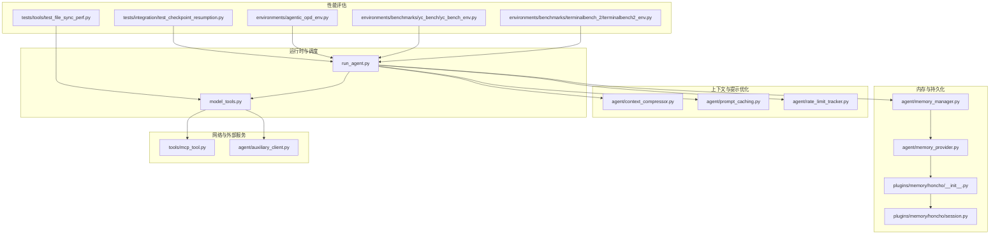
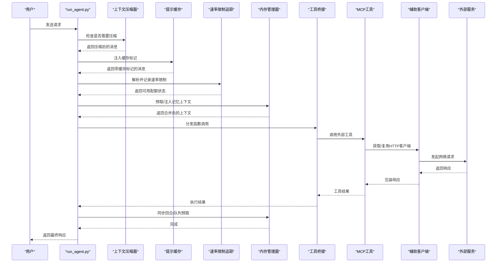
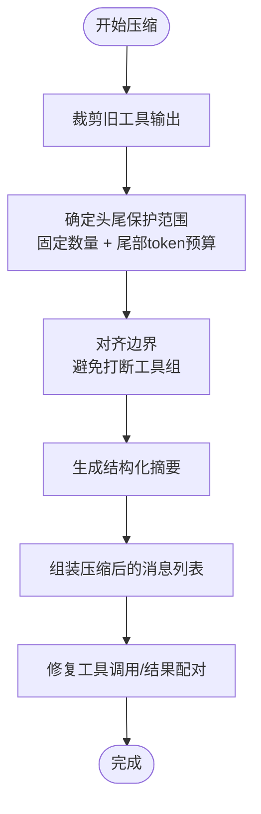
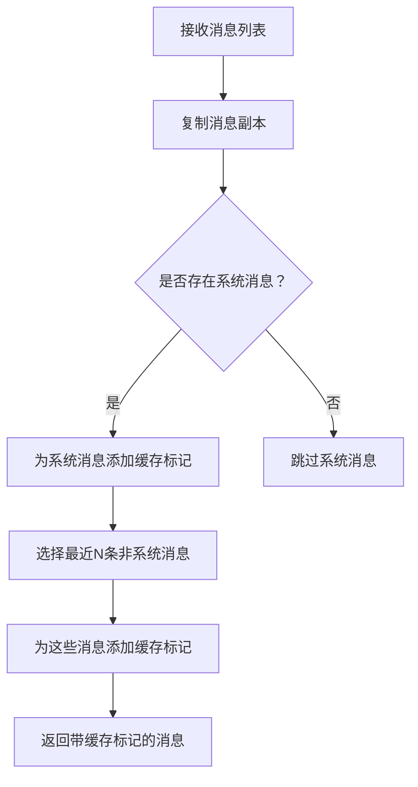
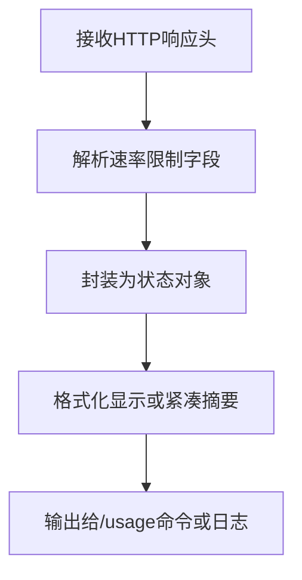
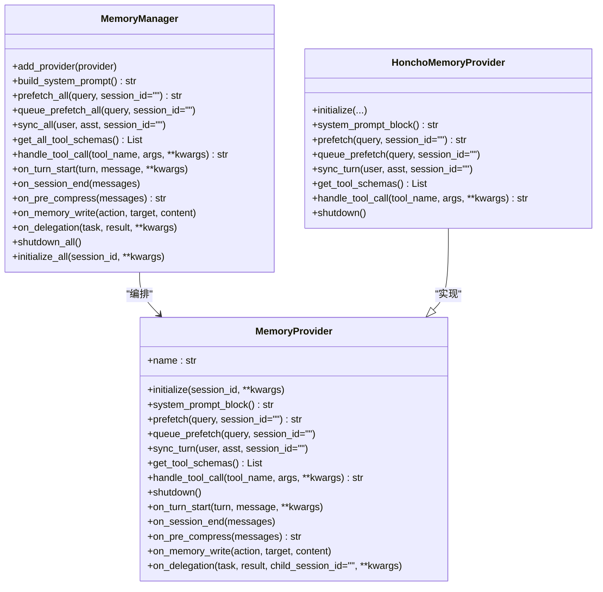
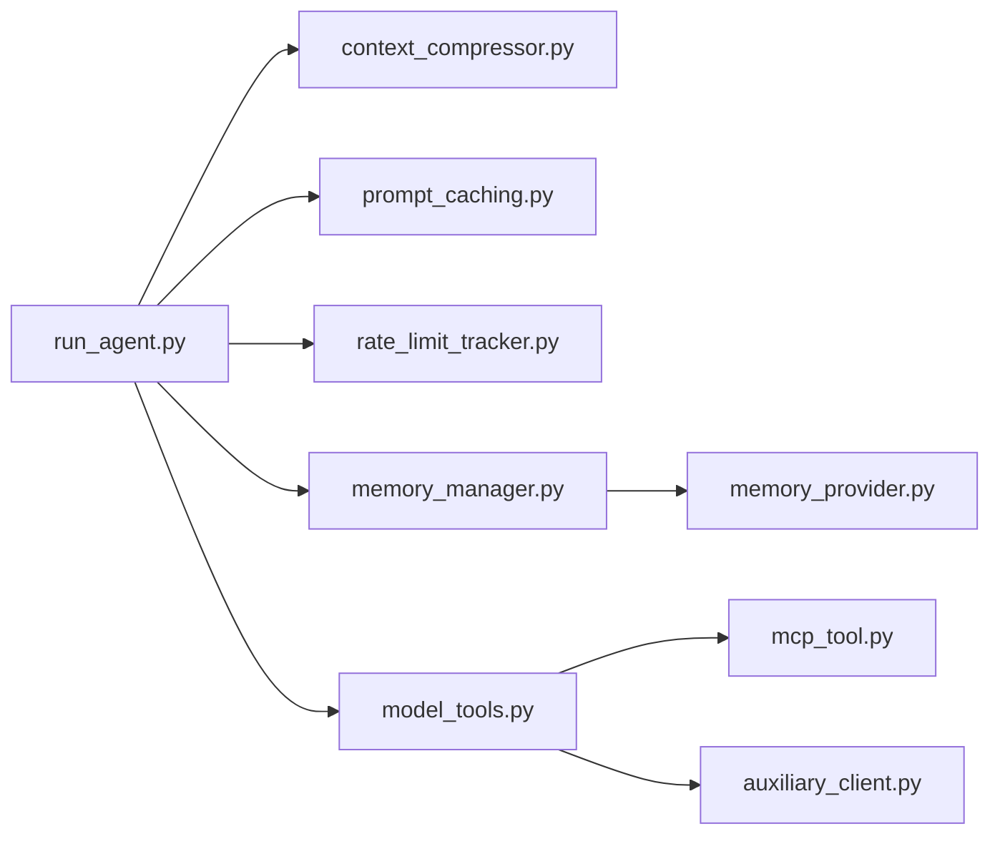

# 技能性能优化

<cite>
**本文引用的文件**
- [run_agent.py](file://run_agent.py)
- [model_tools.py](file://model_tools.py)
- [agent/context_compressor.py](file://agent/context_compressor.py)
- [agent/prompt_caching.py](file://agent/prompt_caching.py)
- [agent/rate_limit_tracker.py](file://agent/rate_limit_tracker.py)
- [agent/memory_provider.py](file://agent/memory_provider.py)
- [agent/memory_manager.py](file://agent/memory_manager.py)
- [plugins/memory/honcho/__init__.py](file://plugins/memory/honcho/__init__.py)
- [plugins/memory/honcho/session.py](file://plugins/memory/honcho/session.py)
- [tools/mcp_tool.py](file://tools/mcp_tool.py)
- [agent/auxiliary_client.py](file://agent/auxiliary_client.py)
- [environments/benchmarks/terminalbench_2/terminalbench2_env.py](file://environments/benchmarks/terminalbench_2/terminalbench2_env.py)
- [environments/benchmarks/yc_bench/yc_bench_env.py](file://environments/benchmarks/yc_bench/yc_bench_env.py)
- [environments/agentic_opd_env.py](file://environments/agentic_opd_env.py)
- [tests/tools/test_file_sync_perf.py](file://tests/tools/test_file_sync_perf.py)
- [tests/integration/test_checkpoint_resumption.py](file://tests/integration/test_checkpoint_resumption.py)
</cite>

## 目录
1. [引言](#引言)
2. [项目结构](#项目结构)
3. [核心组件](#核心组件)
4. [架构总览](#架构总览)
5. [详细组件分析](#详细组件分析)
6. [依赖分析](#依赖分析)
7. [性能考量](#性能考量)
8. [故障排查指南](#故障排查指南)
9. [结论](#结论)
10. [附录](#附录)

## 引言
本指南面向Hermes Agent技能性能优化，系统阐述计算效率提升、内存使用优化与网络通信优化的方法论与实践路径。文档覆盖I/O密集型、CPU密集型与GPU加速型技能的瓶颈识别与针对性优化策略，并提供性能监控与分析工具的使用方法（指标采集、性能分析与瓶颈定位），以及缓存策略、并发处理与资源管理等关键技术点。最后通过真实基准测试与集成测试场景，展示优化前后的效果对比与可复用的评估流程。

## 项目结构
Hermes Agent围绕“运行时编排”“上下文压缩”“提示缓存”“速率限制”“内存插件体系”“工具执行桥接”“网络客户端生命周期管理”等模块构建技能性能优化能力。下图给出与性能优化直接相关的子系统与交互关系：



图表来源
- [run_agent.py](file://run_agent.py)
- [model_tools.py](file://model_tools.py)
- [agent/context_compressor.py](file://agent/context_compressor.py)
- [agent/prompt_caching.py](file://agent/prompt_caching.py)
- [agent/rate_limit_tracker.py](file://agent/rate_limit_tracker.py)
- [agent/memory_provider.py](file://agent/memory_provider.py)
- [agent/memory_manager.py](file://agent/memory_manager.py)
- [plugins/memory/honcho/__init__.py](file://plugins/memory/honcho/__init__.py)
- [plugins/memory/honcho/session.py](file://plugins/memory/honcho/session.py)
- [tools/mcp_tool.py](file://tools/mcp_tool.py)
- [agent/auxiliary_client.py](file://agent/auxiliary_client.py)
- [environments/benchmarks/terminalbench_2/terminalbench2_env.py](file://environments/benchmarks/terminalbench_2/terminalbench2_env.py)
- [environments/benchmarks/yc_bench/yc_bench_env.py](file://environments/benchmarks/yc_bench/yc_bench_env.py)
- [environments/agentic_opd_env.py](file://environments/agentic_opd_env.py)
- [tests/tools/test_file_sync_perf.py](file://tests/tools/test_file_sync_perf.py)
- [tests/integration/test_checkpoint_resumption.py](file://tests/integration/test_checkpoint_resumption.py)

章节来源
- [run_agent.py](file://run_agent.py)
- [model_tools.py](file://model_tools.py)
- [agent/context_compressor.py](file://agent/context_compressor.py)
- [agent/prompt_caching.py](file://agent/prompt_caching.py)
- [agent/rate_limit_tracker.py](file://agent/rate_limit_tracker.py)
- [agent/memory_provider.py](file://agent/memory_provider.py)
- [agent/memory_manager.py](file://agent/memory_manager.py)
- [plugins/memory/honcho/__init__.py](file://plugins/memory/honcho/__init__.py)
- [plugins/memory/honcho/session.py](file://plugins/memory/honcho/session.py)
- [tools/mcp_tool.py](file://tools/mcp_tool.py)
- [agent/auxiliary_client.py](file://agent/auxiliary_client.py)
- [environments/benchmarks/terminalbench_2/terminalbench2_env.py](file://environments/benchmarks/terminalbench_2/terminalbench2_env.py)
- [environments/benchmarks/yc_bench/yc_bench_env.py](file://environments/benchmarks/yc_bench/yc_bench_env.py)
- [environments/agentic_opd_env.py](file://environments/agentic_opd_env.py)
- [tests/tools/test_file_sync_perf.py](file://tests/tools/test_file_sync_perf.py)
- [tests/integration/test_checkpoint_resumption.py](file://tests/integration/test_checkpoint_resumption.py)

## 核心组件
- 上下文压缩器：对长对话进行有损摘要压缩，保护头尾消息，降低输入token成本，避免超限。
- 提示缓存（Anthropic）：在多轮对话中缓存系统提示与最近若干条消息，显著降低token用量。
- 速率限制追踪：解析并格式化提供商的速率限制头信息，用于运行时节流与可视化。
- 内存提供者与管理器：抽象可插拔的记忆后端，支持异步写入、预取与会话结束刷新，避免阻塞主循环。
- 工具执行桥接：统一的同步/异步桥接层，复用事件循环，避免“事件循环已关闭”错误，提升并发稳定性。
- 网络客户端生命周期管理：缓存与清理异步/同步HTTP客户端，减少连接建立开销，防止GC触发异常。
- 基准与评估环境：提供终端任务、生存率与复合评分等指标，支撑性能回归与优化验证。

章节来源
- [agent/context_compressor.py](file://agent/context_compressor.py)
- [agent/prompt_caching.py](file://agent/prompt_caching.py)
- [agent/rate_limit_tracker.py](file://agent/rate_limit_tracker.py)
- [agent/memory_provider.py](file://agent/memory_provider.py)
- [agent/memory_manager.py](file://agent/memory_manager.py)
- [model_tools.py](file://model_tools.py)
- [agent/auxiliary_client.py](file://agent/auxiliary_client.py)
- [environments/benchmarks/terminalbench_2/terminalbench2_env.py](file://environments/benchmarks/terminalbench_2/terminalbench2_env.py)
- [environments/benchmarks/yc_bench/yc_bench_env.py](file://environments/benchmarks/yc_bench/yc_bench_env.py)
- [environments/agentic_opd_env.py](file://environments/agentic_opd_env.py)

## 架构总览
下图展示从用户请求到工具执行与外部服务调用的关键路径，以及性能优化点的落位：



图表来源
- [run_agent.py](file://run_agent.py)
- [agent/context_compressor.py](file://agent/context_compressor.py)
- [agent/prompt_caching.py](file://agent/prompt_caching.py)
- [agent/rate_limit_tracker.py](file://agent/rate_limit_tracker.py)
- [agent/memory_manager.py](file://agent/memory_manager.py)
- [model_tools.py](file://model_tools.py)
- [tools/mcp_tool.py](file://tools/mcp_tool.py)
- [agent/auxiliary_client.py](file://agent/auxiliary_client.py)

## 详细组件分析

### 上下文压缩器（ContextCompressor）
- 目标：在不丢失关键信息的前提下，将长对话压缩为摘要，保护头尾消息，控制尾部token预算，避免模型上下文超限。
- 关键机制：
  - 工具输出裁剪：在LLM摘要前先清理旧工具输出，节省token。
  - 头尾保护：固定数量的首尾消息与基于token预算的尾部保护。
  - 结构化摘要：采用模板化的摘要结构，支持迭代更新，保留跨轮次信息。
  - 边界对齐：避免打断工具调用-结果组，确保消息完整性。
- 性能收益：显著降低输入token数，减少API费用与延迟；在大模型上通过动态摘要预算提升摘要质量。



图表来源
- [agent/context_compressor.py](file://agent/context_compressor.py)

章节来源
- [agent/context_compressor.py](file://agent/context_compressor.py)

### 提示缓存（Anthropic）
- 目标：在多轮对话中缓存系统提示与最近若干条非系统消息，减少重复输入token。
- 关键机制：按策略在消息上注入缓存控制标记，支持可选TTL；返回深度复制后的消息副本，避免污染原始数据。
- 性能收益：在多轮对话中可降低约75%的输入token成本。



图表来源
- [agent/prompt_caching.py](file://agent/prompt_caching.py)

章节来源
- [agent/prompt_caching.py](file://agent/prompt_caching.py)

### 速率限制追踪（RateLimitTracker）
- 目标：解析提供商的速率限制头信息，格式化显示与紧凑摘要，帮助用户在高负载时合理节流。
- 关键机制：解析分钟/小时级请求与token配额、剩余量与重置时间，提供人类可读的进度条与剩余时间估计。
- 性能收益：通过可视化配额使用情况，指导调用节奏，避免突发流量导致的429/配额耗尽。



图表来源
- [agent/rate_limit_tracker.py](file://agent/rate_limit_tracker.py)

章节来源
- [agent/rate_limit_tracker.py](file://agent/rate_limit_tracker.py)

### 内存提供者与管理器（MemoryProvider/MemoryManager）
- 目标：提供可插拔的记忆后端，支持异步写入、预取与会话结束刷新，避免阻塞主循环。
- 关键机制：
  - MemoryProvider抽象：定义生命周期钩子（初始化、预取、回合同步、工具Schema、会话结束等）。
  - MemoryManager编排：聚合多个提供者，按顺序构建系统提示、合并预取上下文、路由工具调用、统一生命周期管理。
  - Honcho插件：支持方言式问答、语义检索、结论持久化；通过后台线程进行预取与同步，限制注入频率与上下文长度，避免过度token消耗。
- 性能收益：异步I/O与后台线程避免主线程阻塞；通过上下文截断与注入频率控制，平衡成本与效果。



图表来源
- [agent/memory_provider.py](file://agent/memory_provider.py)
- [agent/memory_manager.py](file://agent/memory_manager.py)
- [plugins/memory/honcho/__init__.py](file://plugins/memory/honcho/__init__.py)

章节来源
- [agent/memory_provider.py](file://agent/memory_provider.py)
- [agent/memory_manager.py](file://agent/memory_manager.py)
- [plugins/memory/honcho/__init__.py](file://plugins/memory/honcho/__init__.py)
- [plugins/memory/honcho/session.py](file://plugins/memory/honcho/session.py)

### 工具执行桥接（model_tools.py）
- 目标：统一同步/异步工具调用，复用事件循环，避免“事件循环已关闭”错误，提升并发稳定性。
- 关键机制：
  - 主线程持久事件循环：避免每次调用创建/销毁循环带来的客户端绑定问题。
  - 工作线程本地循环：并行工具执行时为每个工作线程维护独立循环，避免竞争。
  - 参数类型强制转换：将字符串参数安全转换为期望类型，减少模型幻觉导致的错误。
- 性能收益：降低客户端生命周期开销，提升并发吞吐与稳定性。

```mermaid
sequenceDiagram
participant Caller as "调用方"
participant MT as "model_tools.py"
participant Loop as "事件循环"
participant Registry as "工具注册表"
participant Ext as "外部工具"
Caller->>MT : handle_function_call(...)
MT->>MT : coerce_tool_args()
alt 当前线程有运行中的循环
MT->>Loop : 在新线程中运行协程
Loop-->>MT : 返回结果
else 工作线程
MT->>Loop : 使用线程本地循环
Loop-->>MT : 返回结果
else 主线程
MT->>Loop : 使用持久事件循环
Loop-->>MT : 返回结果
end
MT->>Registry : dispatch(tool_name, args)
Registry->>Ext : 执行工具
Ext-->>Registry : 返回结果
Registry-->>MT : 工具结果
MT-->>Caller : JSON结果
```

图表来源
- [model_tools.py](file://model_tools.py)

章节来源
- [model_tools.py](file://model_tools.py)

### 网络客户端生命周期管理（agent/auxiliary_client.py）
- 目标：缓存并清理HTTP客户端，避免“事件循环已关闭”异常，减少连接建立开销。
- 关键机制：缓存键包含提供方、异步模式、URL、密钥与运行时键；检测并清理已关闭循环的异步客户端；在Agent回合结束清理陈旧客户端。
- 性能收益：降低连接抖动与GC异常风险，提升网络调用稳定性。

章节来源
- [agent/auxiliary_client.py](file://agent/auxiliary_client.py)

### MCP工具与流式客户端（tools/mcp_tool.py）
- 目标：支持MCP协议的流式HTTP客户端，适配不同版本的MCP服务器。
- 关键机制：根据MCP版本选择合适的流式接口；在异步上下文中正确管理读写流与会话生命周期。
- 性能收益：稳定、低开销的外部工具接入，减少握手与重建成本。

章节来源
- [tools/mcp_tool.py](file://tools/mcp_tool.py)

## 依赖分析
- 组件耦合与内聚：
  - run_agent.py作为编排中心，依赖上下文压缩、提示缓存、速率限制、内存管理与工具桥接。
  - MemoryManager对各MemoryProvider解耦，通过抽象接口实现多后端并存。
  - model_tools.py对工具注册表与外部服务解耦，通过桥接层屏蔽异步细节。
- 外部依赖与集成点：
  - MCP工具链、第三方HTTP客户端库、外部记忆后端（如Honcho）。
- 循环依赖与风险：
  - 通过抽象接口与单向依赖（编排→执行）避免循环；注意工具Schema与可用性检查的回环风险，已在代码中通过条件分支规避。



图表来源
- [run_agent.py](file://run_agent.py)
- [agent/context_compressor.py](file://agent/context_compressor.py)
- [agent/prompt_caching.py](file://agent/prompt_caching.py)
- [agent/rate_limit_tracker.py](file://agent/rate_limit_tracker.py)
- [agent/memory_manager.py](file://agent/memory_manager.py)
- [agent/memory_provider.py](file://agent/memory_provider.py)
- [model_tools.py](file://model_tools.py)
- [tools/mcp_tool.py](file://tools/mcp_tool.py)
- [agent/auxiliary_client.py](file://agent/auxiliary_client.py)

## 性能考量
- 计算效率提升
  - 参数类型强制转换：减少因类型不匹配导致的重试与错误处理开销。
  - 并发工具批处理：在满足路径隔离前提下，批量并发执行工具调用，降低总时延。
  - 事件循环复用：主线程与工作线程分别持有持久循环，避免频繁创建/销毁带来的额外成本。
- 内存使用优化
  - 工具输出裁剪：在摘要前清理旧工具输出，显著降低中间数据占用。
  - 内存提供者异步写入：后台线程写入，避免阻塞主循环；会话结束统一刷新，减少碎片化写入。
  - 客户端缓存与清理：避免重复连接与GC异常，降低内存抖动。
- 网络通信优化
  - 提示缓存：减少重复输入token，降低往返次数与API费用。
  - 速率限制感知：根据配额与重置时间调整调用节奏，避免429与退避。
  - 流式MCP客户端：减少握手与重建成本，提升外部工具接入效率。

## 故障排查指南
- 事件循环相关错误
  - 现象：“事件循环已关闭”或异步客户端在GC时崩溃。
  - 排查：确认是否使用持久事件循环；检查工具桥接层是否在工作线程中复用线程本地循环。
  - 参考：工具桥接与客户端清理逻辑。
- 工具调用失败
  - 现象：工具Schema描述与可用性不一致，导致模型误调用。
  - 排查：核对工具可用性检查与动态Schema生成；确保仅暴露可用工具。
  - 参考：工具定义与可用性检查。
- 内存提供者异常
  - 现象：后台线程未及时退出或写入阻塞。
  - 排查：确认shutdown_all顺序与线程join超时；检查flush_all与异步队列清空。
  - 参考：内存管理器与Honcho会话管理。
- 基准测试与恢复
  - 现象：性能波动或中断后无法恢复。
  - 排查：使用基准环境统计指标（通过率、平均时延、P95）；验证检查点恢复与中断重试。
  - 参考：终端基准、YC-Bench与检查点恢复测试。

章节来源
- [model_tools.py](file://model_tools.py)
- [agent/auxiliary_client.py](file://agent/auxiliary_client.py)
- [agent/memory_manager.py](file://agent/memory_manager.py)
- [plugins/memory/honcho/session.py](file://plugins/memory/honcho/session.py)
- [environments/benchmarks/terminalbench_2/terminalbench2_env.py](file://environments/benchmarks/terminalbench_2/terminalbench2_env.py)
- [environments/benchmarks/yc_bench/yc_bench_env.py](file://environments/benchmarks/yc_bench/yc_bench_env.py)
- [tests/integration/test_checkpoint_resumption.py](file://tests/integration/test_checkpoint_resumption.py)

## 结论
通过上下文压缩、提示缓存、速率限制感知、内存异步化、工具执行桥接与客户端生命周期管理等综合手段，Hermes Agent在保持功能完整性的同时实现了显著的性能优化。结合基准测试与集成测试，可形成持续的性能评估与回归保障闭环，确保优化成果可量化、可复现、可持续。

## 附录
- 实战建议
  - I/O密集型技能：优先启用内存提供者的异步写入与预取；配合提示缓存与速率限制追踪，控制成本与延迟。
  - CPU密集型技能：利用工具批处理与事件循环复用，减少创建/销毁开销；必要时引入分片与并行化。
  - GPU加速型技能：关注批大小与内存占用，结合上下文压缩与工具输出裁剪，避免不必要的显存压力。
- 评估指标
  - 基准环境指标：通过终端基准与生存率/复合评分等指标衡量整体性能与鲁棒性。
  - 运行时指标：结合速率限制显示与工具执行时延统计，持续监控瓶颈变化。

章节来源
- [environments/benchmarks/terminalbench_2/terminalbench2_env.py](file://environments/benchmarks/terminalbench_2/terminalbench2_env.py)
- [environments/benchmarks/yc_bench/yc_bench_env.py](file://environments/benchmarks/yc_bench/yc_bench_env.py)
- [environments/agentic_opd_env.py](file://environments/agentic_opd_env.py)
- [tests/tools/test_file_sync_perf.py](file://tests/tools/test_file_sync_perf.py)