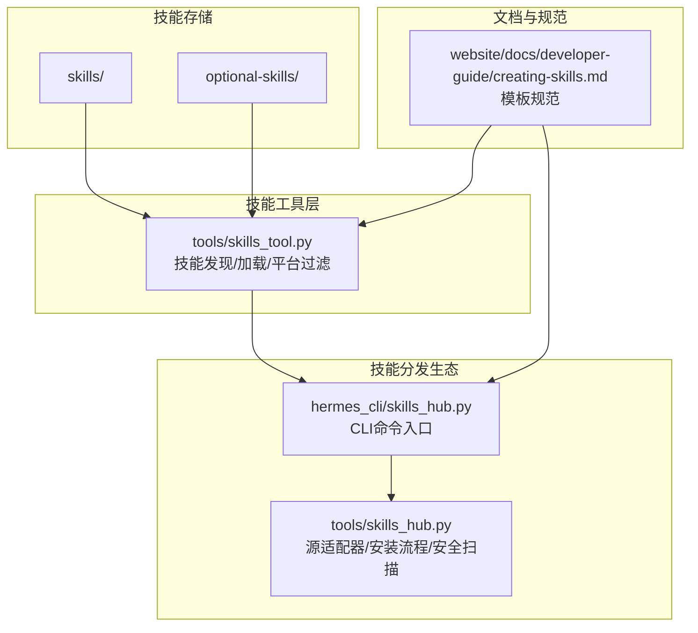
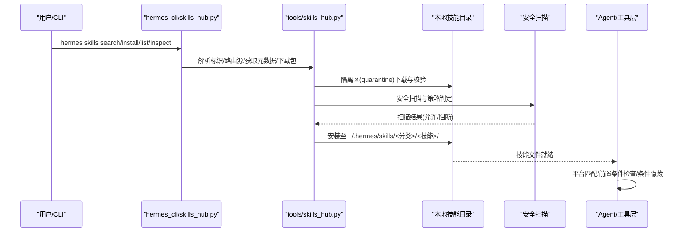
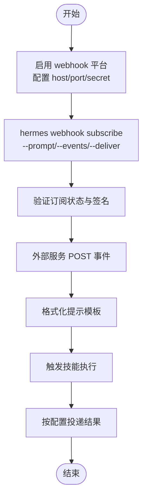
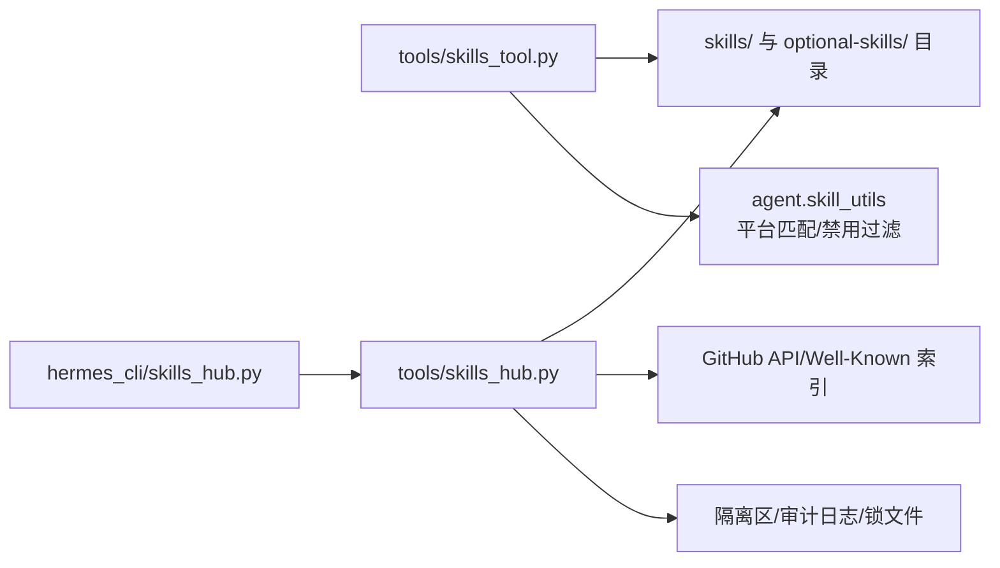

# 技能模板系统

<cite>
**本文档引用的文件**
- [README.md](file://README.md)
- [skills/dogfood/SKILL.md](file://skills/dogfood/SKILL.md)
- [skills/devops/webhook-subscriptions/SKILL.md](file://skills/devops/webhook-subscriptions/SKILL.md)
- [skills/red-teaming/godmode/SKILL.md](file://skills/red-teaming/godmode/SKILL.md)
- [optional-skills/creative/meme-generation/SKILL.md](file://optional-skills/creative/meme-generation/SKILL.md)
- [optional-skills/mlops/accelerate/SKILL.md](file://optional-skills/mlops/accelerate/SKILL.md)
- [skills/leisure/find-nearby/SKILL.md](file://skills/leisure/find-nearby/SKILL.md)
- [skills/github/github-auth/SKILL.md](file://skills/github/github-auth/SKILL.md)
- [hermes_cli/skills_hub.py](file://hermes_cli/skills_hub.py)
- [tools/skills_hub.py](file://tools/skills_hub.py)
- [tools/skills_tool.py](file://tools/skills_tool.py)
- [website/docs/developer-guide/creating-skills.md](file://website/docs/developer-guide/creating-skills.md)
</cite>

## 目录
1. [简介](#简介)
2. [项目结构](#项目结构)
3. [核心组件](#核心组件)
4. [架构总览](#架构总览)
5. [详细组件分析](#详细组件分析)
6. [依赖关系分析](#依赖关系分析)
7. [性能考虑](#性能考虑)
8. [故障排除指南](#故障排除指南)
9. [结论](#结论)
10. [附录](#附录)

## 简介
本文件系统性阐述 Hermes Agent 的技能模板（Skill）体系：从 SKILL.md 文件格式、元数据与依赖声明，到工具定义与运行时条件，再到不同类型的技能模板（工具型、服务型、集成型）及其适用场景。文档还提供模板使用指南、自定义方法（参数配置、条件判断、动态内容生成），并以多个真实模板案例帮助开发者快速理解与应用。

## 项目结构
技能模板系统围绕以下关键目录与模块组织：
- 技能模板目录：`skills/` 与 `optional-skills/`，每个技能以独立子目录存放，主文档为 `SKILL.md`，可包含 `references/`、`templates/`、`scripts/` 等辅助资源。
- 技能发现与加载：`tools/skills_tool.py` 提供技能列表、视图加载、平台过滤、前置条件检查等能力。
- 技能分发与安装：`hermes_cli/skills_hub.py` 与 `tools/skills_hub.py` 提供搜索、浏览、安装、卸载、更新、发布、安全扫描等全生命周期管理。
- 文档与规范：`website/docs/developer-guide/creating-skills.md` 提供模板编写规范与最佳实践。

图表来源
- [tools/skills_tool.py:1-120](file://tools/skills_tool.py#L1-L120)
- [hermes_cli/skills_hub.py:1-120](file://hermes_cli/skills_hub.py#L1-L120)
- [tools/skills_hub.py:1-120](file://tools/skills_hub.py#L1-L120)
- [website/docs/developer-guide/creating-skills.md:96-128](file://website/docs/developer-guide/creating-skills.md#L96-L128)

章节来源
- [README.md:87-108](file://README.md#L87-L108)
- [tools/skills_tool.py:1-120](file://tools/skills_tool.py#L1-L120)
- [hermes_cli/skills_hub.py:1-120](file://hermes_cli/skills_hub.py#L1-L120)
- [tools/skills_hub.py:1-120](file://tools/skills_hub.py#L1-L120)
- [website/docs/developer-guide/creating-skills.md:96-128](file://website/docs/developer-guide/creating-skills.md#L96-L128)

## 核心组件
- SKILL.md 模板：采用 YAML 前言块（frontmatter）定义元数据，正文为技能说明与操作流程。支持版本、作者、许可证、平台限制、前置条件、兼容性、自定义元数据（含 Hermes 特定字段）等。
- 技能工具（skills_tool）：负责技能目录扫描、元数据解析、平台匹配、前置条件收集与验证、分类统计、内容视图加载。
- 技能分发（skills_hub）：提供多源适配器（GitHub、Well-Known Endpoint 等）、安装隔离与安全扫描、锁文件记录、缓存索引、发布与更新机制。
- CLI 与网关集成：通过 hermes CLI 的 `/skills` 子命令与聊天界面的 `/skills` 指令，统一调用技能发现与分发生态。

章节来源
- [tools/skills_tool.py:28-67](file://tools/skills_tool.py#L28-L67)
- [tools/skills_tool.py:414-422](file://tools/skills_tool.py#L414-L422)
- [hermes_cli/skills_hub.py:29-80](file://hermes_cli/skills_hub.py#L29-L80)
- [tools/skills_hub.py:63-86](file://tools/skills_hub.py#L63-L86)

## 架构总览
技能模板系统的运行链路如下：

图表来源
- [hermes_cli/skills_hub.py:310-466](file://hermes_cli/skills_hub.py#L310-L466)
- [tools/skills_hub.py:350-376](file://tools/skills_hub.py#L350-L376)
- [tools/skills_tool.py:512-586](file://tools/skills_tool.py#L512-L586)

章节来源
- [hermes_cli/skills_hub.py:310-466](file://hermes_cli/skills_hub.py#L310-L466)
- [tools/skills_hub.py:350-376](file://tools/skills_hub.py#L350-L376)
- [tools/skills_tool.py:512-586](file://tools/skills_tool.py#L512-L586)

## 详细组件分析

### SKILL.md 文件格式与元数据
- 必填字段：name、description；建议包含 version、license。
- 平台限制：platforms 字段用于限制在特定操作系统（macos、linux、windows）加载。
- 兼容性与元数据：compatibility 字段与 metadata.herems 自定义键值对（如 tags、related_skills）。
- 前置条件：prerequisites.env_vars/commands 与 required_environment_variables（新式）配合 collect_secrets（旧式兼容）。
- 条件激活：metadata.hermes.requires_toolsets/tools、fallback_for_toolsets/tools 控制技能在不同工具可用性下的可见性。

章节来源
- [tools/skills_tool.py:28-67](file://tools/skills_tool.py#L28-L67)
- [tools/skills_tool.py:164-206](file://tools/skills_tool.py#L164-L206)
- [tools/skills_tool.py:209-272](file://tools/skills_tool.py#L209-L272)
- [website/docs/developer-guide/creating-skills.md:96-128](file://website/docs/developer-guide/creating-skills.md#L96-L128)

### 技能发现与加载（skills_tool）
- 目录扫描：递归查找 SKILL.md，解析前言块，提取 name/description/category，并进行平台过滤与禁用列表过滤。
- 分类统计：读取 CATEGORY/DESCRIPTION.md 获取分类描述，汇总技能数量。
- 内容视图：按需加载完整技能内容或指定子文件（references/templates/assets）。
- 前置条件处理：收集 required_environment_variables，支持交互式密钥采集回调，结合 .env 文件与环境变量进行验证。

章节来源
- [tools/skills_tool.py:512-586](file://tools/skills_tool.py#L512-L586)
- [tools/skills_tool.py:632-709](file://tools/skills_tool.py#L632-L709)
- [tools/skills_tool.py:779-800](file://tools/skills_tool.py#L779-L800)
- [tools/skills_tool.py:275-344](file://tools/skills_tool.py#L275-L344)

### 技能分发与安装（skills_hub）
- 多源适配器：GitHubSource、WellKnownSkillSource 等，支持 taps 自定义源、索引缓存、树 API 优化。
- 安全与合规：隔离区下载、安全扫描、安装策略、审计日志、锁文件记录已安装技能。
- CLI 命令：search/browse/inspect/install/uninstall/update/check/publish/tap 等，支持短名解析与确认提示。
- 更新与发布：检查上游更新、强制重装、发布到 GitHub/ClawHub（部分目标）。

章节来源
- [hermes_cli/skills_hub.py:144-182](file://hermes_cli/skills_hub.py#L144-L182)
- [hermes_cli/skills_hub.py:310-466](file://hermes_cli/skills_hub.py#L310-L466)
- [hermes_cli/skills_hub.py:518-574](file://hermes_cli/skills_hub.py#L518-L574)
- [hermes_cli/skills_hub.py:619-650](file://hermes_cli/skills_hub.py#L619-L650)
- [hermes_cli/skills_hub.py:687-728](file://hermes_cli/skills_hub.py#L687-L728)
- [hermes_cli/skills_hub.py:730-797](file://hermes_cli/skills_hub.py#L730-L797)
- [tools/skills_hub.py:284-376](file://tools/skills_hub.py#L284-L376)
- [tools/skills_hub.py:418-454](file://tools/skills_hub.py#L418-L454)
- [tools/skills_hub.py:519-574](file://tools/skills_hub.py#L519-L574)

### 技能类型与适用场景

#### 工具型技能（Tool-focused）
- 特点：直接绑定具体工具或工具集，强调“做什么”和“如何做”，通常有明确的输入输出与步骤。
- 示例：浏览器工具链（导航、截图、控制台）、GitHub 认证与工作流、Webhook 订阅管理。
- 关键点：metadata.hermes.requires_tools/工具集、fallback_for_* 作为降级或替代方案。

章节来源
- [skills/devops/webhook-subscriptions/SKILL.md:1-181](file://skills/devops/webhook-subscriptions/SKILL.md#L1-L181)
- [skills/github/github-auth/SKILL.md:1-247](file://skills/github/github-auth/SKILL.md#L1-L247)
- [website/docs/developer-guide/creating-skills.md:108-128](file://website/docs/developer-guide/creating-skills.md#L108-L128)

#### 服务型技能（Service-focused）
- 特点：面向外部服务或平台，强调“连接”和“自动化”，常涉及认证、事件驱动与交付。
- 示例：Webhook 平台启用与订阅、GitHub API 调用、CI/CD 通知。
- 关键点：平台配置（端口、密钥）、事件过滤、提示模板与交付渠道。

章节来源
- [skills/devops/webhook-subscriptions/SKILL.md:1-181](file://skills/devops/webhook-subscriptions/SKILL.md#L1-L181)

#### 集成型技能（Integration-focused）
- 特点：整合第三方库或框架，强调“即插即用”的能力扩展，常包含依赖声明与安装指引。
- 示例：HuggingFace Accelerate 分布式训练、Meme 生成脚本。
- 关键点：dependencies 字段、脚本与模板、缓存与验证。

章节来源
- [optional-skills/mlops/accelerate/SKILL.md:1-336](file://optional-skills/mlops/accelerate/SKILL.md#L1-L336)
- [optional-skills/creative/meme-generation/SKILL.md:1-130](file://optional-skills/creative/meme-generation/SKILL.md#L1-L130)

#### 探索型技能（Exploration-focused）
- 特点：引导用户进行系统化探索与测试，强调证据收集与报告生成。
- 示例：Web 应用 QA 测试（Dogfood）、附近地点发现。
- 关键点：阶段化工作流、证据截图与模板化报告。

章节来源
- [skills/dogfood/SKILL.md:1-162](file://skills/dogfood/SKILL.md#L1-L162)
- [skills/leisure/find-nearby/SKILL.md:1-70](file://skills/leisure/find-nearby/SKILL.md#L1-L70)

#### 安全/红队型技能（Security/Red-teaming）
- 特点：涉及模型安全绕过与对抗技术，强调策略组合与效果评估。
- 示例：G0DM0D3 红队技巧、多模型竞速。
- 关键点：系统提示注入、预填充消息、编码升级、拒绝检测与评分。

章节来源
- [skills/red-teaming/godmode/SKILL.md:1-404](file://skills/red-teaming/godmode/SKILL.md#L1-L404)

### 模板使用指南与自定义方法

#### 参数配置与动态内容生成
- 使用提示模板中的占位符（如 `{payload.fields}`）实现动态内容注入。
- 在 SKILL.md 中定义输入参数与默认值，结合工具调用生成可复用的执行脚本或命令行。

章节来源
- [skills/devops/webhook-subscriptions/SKILL.md:95-105](file://skills/devops/webhook-subscriptions/SKILL.md#L95-L105)

#### 条件判断与技能隐藏
- 通过 metadata.hermes.requires_toolsets/tools 与 fallback_for_* 控制技能在不同工具可用性下的可见性。
- 平台限制：platforms 字段仅在目标平台显示技能。

章节来源
- [website/docs/developer-guide/creating-skills.md:96-128](file://website/docs/developer-guide/creating-skills.md#L96-L128)
- [tools/skills_tool.py:134-142](file://tools/skills_tool.py#L134-L142)

#### 前置条件与环境变量
- required_environment_variables 与 collect_secrets 组合，支持交互式密钥采集与 .env 文件持久化。
- 建议在 SKILL.md 中明确列出所需 API 密钥、命令行工具与权限要求。

章节来源
- [tools/skills_tool.py:164-206](file://tools/skills_tool.py#L164-L206)
- [tools/skills_tool.py:275-344](file://tools/skills_tool.py#L275-L344)

#### 实战案例

##### Webhook 订阅管理（服务型）
- 功能：创建/管理 webhook 订阅，基于事件触发自动执行技能。
- 关键点：平台启用、配置项（host/port/secret）、命令行管理、提示模板与交付渠道。

图表来源
- [skills/devops/webhook-subscriptions/SKILL.md:14-94](file://skills/devops/webhook-subscriptions/SKILL.md#L14-L94)
- [skills/devops/webhook-subscriptions/SKILL.md:164-170](file://skills/devops/webhook-subscriptions/SKILL.md#L164-L170)

章节来源
- [skills/devops/webhook-subscriptions/SKILL.md:1-181](file://skills/devops/webhook-subscriptions/SKILL.md#L1-L181)

##### HuggingFace Accelerate（集成型）
- 功能：简化分布式训练接入，统一 API 支持 DDP/DeepSpeed/FSDP/Megatron。
- 关键点：依赖声明、最小代码改动、混合精度、ZeRO 集成、梯度累积。

章节来源
- [optional-skills/mlops/accelerate/SKILL.md:1-336](file://optional-skills/mlops/accelerate/SKILL.md#L1-L336)

##### Meme 生成（工具型）
- 功能：从模板生成真实图片，支持经典模板与自定义图像叠加。
- 关键点：模板选择与字段数量匹配、文本可读性、缓存与验证。

章节来源
- [optional-skills/creative/meme-generation/SKILL.md:1-130](file://optional-skills/creative/meme-generation/SKILL.md#L1-L130)

##### Dogfood QA（探索型）
- 功能：系统化 Web 应用测试，收集证据并生成结构化报告。
- 关键点：五阶段工作流、证据截图、问题分类与报告模板。

章节来源
- [skills/dogfood/SKILL.md:1-162](file://skills/dogfood/SKILL.md#L1-L162)

##### GitHub 认证（工具型）
- 功能：支持 git 与 gh CLI 的多种认证路径，覆盖 HTTPS 令牌、SSH 密钥与凭证助手。
- 关键点：检测流程、自动选择最优路径、身份配置与验证。

章节来源
- [skills/github/github-auth/SKILL.md:1-247](file://skills/github/github-auth/SKILL.md#L1-L247)

## 依赖关系分析

图表来源
- [tools/skills_tool.py:512-586](file://tools/skills_tool.py#L512-L586)
- [hermes_cli/skills_hub.py:310-466](file://hermes_cli/skills_hub.py#L310-L466)
- [tools/skills_hub.py:284-376](file://tools/skills_hub.py#L284-L376)

章节来源
- [tools/skills_tool.py:512-586](file://tools/skills_tool.py#L512-L586)
- [hermes_cli/skills_hub.py:310-466](file://hermes_cli/skills_hub.py#L310-L466)
- [tools/skills_hub.py:284-376](file://tools/skills_hub.py#L284-L376)

## 性能考虑
- 索引缓存：GitHubSource 使用树 API 与索引缓存减少重复请求，提升安装与搜索性能。
- 并行搜索：Skills Hub 支持多源并行搜索与超时控制，避免长时间阻塞。
- 进程化披露：skills_list 仅返回最小元数据，按需加载完整内容，降低提示词开销。
- 安装隔离：隔离区下载与安全扫描后才写入最终位置，避免污染与回滚成本。

章节来源
- [tools/skills_hub.py:418-454](file://tools/skills_hub.py#L418-L454)
- [hermes_cli/skills_hub.py:184-218](file://hermes_cli/skills_hub.py#L184-L218)
- [tools/skills_tool.py:711-777](file://tools/skills_tool.py#L711-L777)

## 故障排除指南
- 安装被阻断：检查安全扫描结果与阻断原因，必要时使用 --force 强制安装（不推荐）。
- 速率限制：未认证 GitHub API 速率较低，建议设置 GITHUB_TOKEN 或使用 gh CLI 登录。
- 平台不兼容：确认 platforms 字段与当前系统匹配；或在配置中禁用该技能。
- 前置条件缺失：根据 required_environment_variables 与 collect_secrets 提示补齐密钥与工具。
- 更新检查：使用 do_check/do_update 检查与批量更新 hub 安装的技能。

章节来源
- [hermes_cli/skills_hub.py:337-356](file://hermes_cli/skills_hub.py#L337-L356)
- [hermes_cli/skills_hub.py:576-597](file://hermes_cli/skills_hub.py#L576-L597)
- [tools/skills_tool.py:275-344](file://tools/skills_tool.py#L275-L344)

## 结论
Hermes Agent 的技能模板系统以 SKILL.md 为核心，结合工具层的发现与加载、分发层的多源适配与安全管控，形成了从“模板编写—安装—运行—维护”的完整闭环。通过平台限制、前置条件、工具集依赖与条件隐藏等机制，系统实现了高可定制性与强安全性。开发者可参考本文档的模板规范与实战案例，快速构建符合自身需求的技能模板。

## 附录

### SKILL.md 规范要点
- 前言块字段：name、description、version、license、platforms、prerequisites、compatibility、metadata.hermes.*
- 正文结构：概述、前提条件、输入参数、工作流、工具参考、提示与最佳实践。
- 辅助资源：references/templates/scripts/assets 等按需组织。

章节来源
- [tools/skills_tool.py:28-67](file://tools/skills_tool.py#L28-L67)
- [website/docs/developer-guide/creating-skills.md:96-128](file://website/docs/developer-guide/creating-skills.md#L96-L128)