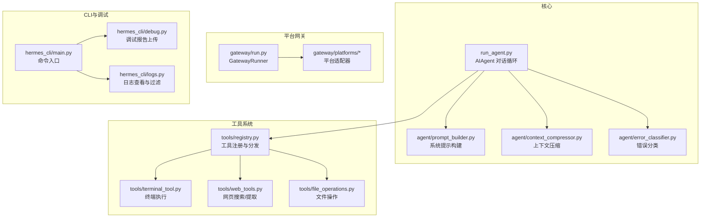
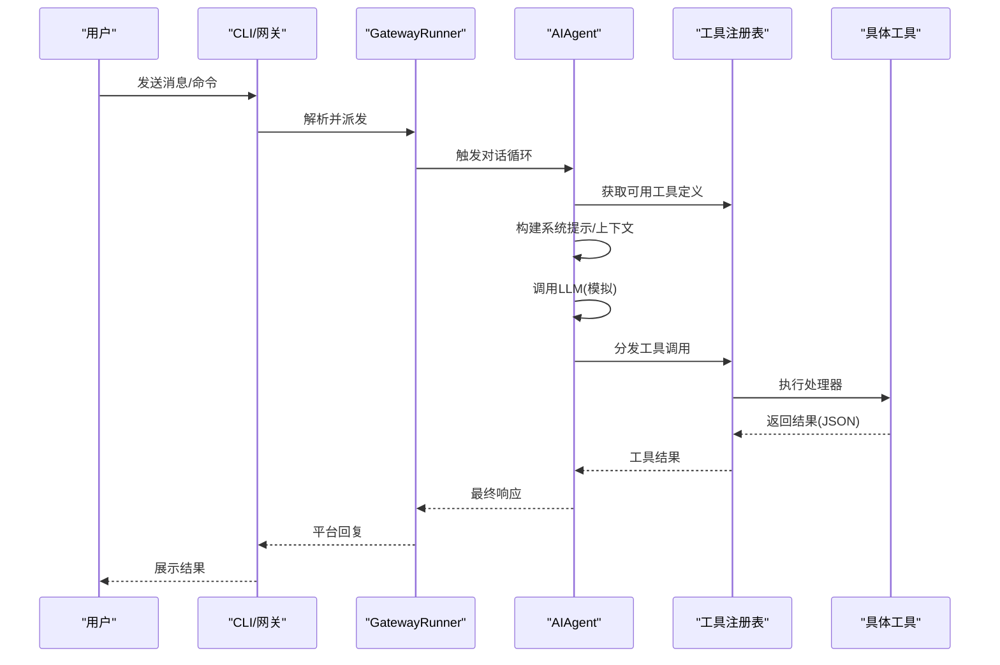
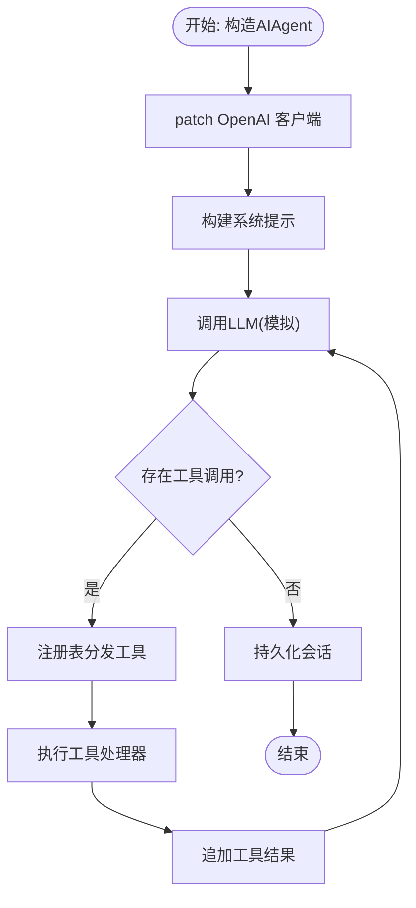
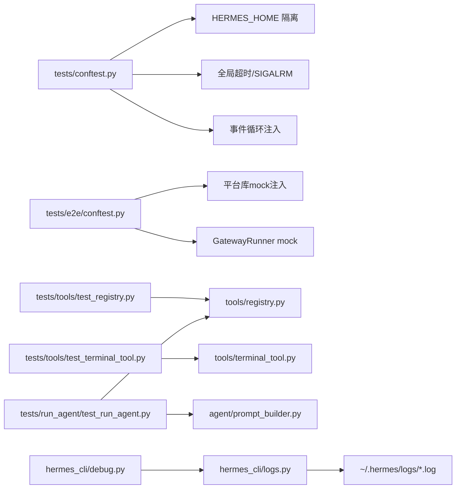

# 技能测试与调试

<cite>
**本文引用的文件**
- [README.md](file://README.md)
- [CONTRIBUTING.md](file://CONTRIBUTING.md)
- [tests/conftest.py](file://tests/conftest.py)
- [tests/e2e/conftest.py](file://tests/e2e/conftest.py)
- [tests/run_agent/test_run_agent.py](file://tests/run_agent/test_run_agent.py)
- [tests/tools/test_registry.py](file://tests/tools/test_registry.py)
- [tests/tools/test_terminal_tool.py](file://tests/tools/test_terminal_tool.py)
- [tests/skills/test_google_oauth_setup.py](file://tests/skills/test_google_oauth_setup.py)
- [tests/skills/test_telephony_skill.py](file://tests/skills/test_telephony_skill.py)
- [tests/skills/test_youtube_quiz.py](file://tests/skills/test_youtube_quiz.py)
- [hermes_cli/debug.py](file://hermes_cli/debug.py)
- [hermes_cli/logs.py](file://hermes_cli/logs.py)
</cite>

## 目录
1. [简介](#简介)
2. [项目结构](#项目结构)
3. [核心组件](#核心组件)
4. [架构总览](#架构总览)
5. [详细组件分析](#详细组件分析)
6. [依赖关系分析](#依赖关系分析)
7. [性能考量](#性能考量)
8. [故障排查指南](#故障排查指南)
9. [结论](#结论)
10. [附录](#附录)

## 简介
本指南面向Hermes Agent技能测试与调试，系统化阐述测试策略（单元测试、集成测试、端到端测试）与调试流程（日志分析、错误追踪、性能监控），并提供测试用例编写与测试数据准备方法，覆盖工具调用失败、权限问题、环境兼容性等常见问题的诊断与修复路径。文档同时给出可复现的实际测试案例与调试场景，帮助开发者快速定位与解决问题。

## 项目结构
Hermes Agent采用模块化分层设计：核心对话循环位于run_agent.py，工具系统通过集中注册表进行管理，平台网关负责消息路由，CLI提供调试与日志查看能力。测试体系覆盖agent运行逻辑、工具注册与调度、技能脚本行为以及网关端到端流程，并通过共享夹具确保隔离与一致性。

图示来源
- [CONTRIBUTING.md:200-227](file://CONTRIBUTING.md#L200-L227)

章节来源
- [CONTRIBUTING.md:114-182](file://CONTRIBUTING.md#L114-L182)
- [README.md:14-83](file://README.md#L14-L83)

## 核心组件
- 测试夹具与隔离
  - tests/conftest.py：统一重定向HERMES_HOME至临时目录，避免污染用户配置；清理插件单例；删除会话相关环境变量；设置全局超时与事件循环；屏蔽真实网络调用键值。
  - tests/e2e/conftest.py：为Telegram/Discord/Slack等平台适配器安装模拟模块，构造会话源、会话条目与消息事件，创建GatewayRunner并注入mock以验证完整异步消息流。
- 工具注册与调度
  - tests/tools/test_registry.py：验证工具注册、定义导出、可用性检查、异常处理与元数据（如emoji）。
- 终端工具与sudo处理
  - tests/tools/test_terminal_tool.py：覆盖sudo检测、密码缓存、交互式提示禁用等边界条件。
- 技能测试
  - tests/skills/test_google_oauth_setup.py：Google Workspace OAuth授权码交换、状态校验、部分scope接受与错误回退。
  - tests/skills/test_telephony_skill.py：Twilio/VAPI配置写入、状态checkpoint、收件箱增量拉取与诊断树输出。
  - tests/skills/test_youtube_quiz.py：YouTube字幕抓取依赖缺失、API错误、空字幕与兼容性处理。
- 调试与日志
  - hermes_cli/debug.py：收集系统dump与日志尾部，上传到paste服务或本地打印；支持过期时间与本地模式。
  - hermes_cli/logs.py：按级别、组件、会话、相对时间范围过滤日志，支持tail/follow模式。

章节来源
- [tests/conftest.py:19-122](file://tests/conftest.py#L19-L122)
- [tests/e2e/conftest.py:1-267](file://tests/e2e/conftest.py#L1-L267)
- [tests/tools/test_registry.py:1-312](file://tests/tools/test_registry.py#L1-L312)
- [tests/tools/test_terminal_tool.py:1-91](file://tests/tools/test_terminal_tool.py#L1-L91)
- [tests/skills/test_google_oauth_setup.py:1-241](file://tests/skills/test_google_oauth_setup.py#L1-L241)
- [tests/skills/test_telephony_skill.py:1-230](file://tests/skills/test_telephony_skill.py#L1-L230)
- [tests/skills/test_youtube_quiz.py:1-129](file://tests/skills/test_youtube_quiz.py#L1-L129)
- [hermes_cli/debug.py:1-337](file://hermes_cli/debug.py#L1-L337)
- [hermes_cli/logs.py:1-391](file://hermes_cli/logs.py#L1-L391)

## 架构总览
下图展示从用户输入到工具执行再到响应返回的关键路径，以及测试夹具如何在不发起真实网络请求的前提下验证各环节行为。

图示来源
- [CONTRIBUTING.md:200-227](file://CONTRIBUTING.md#L200-L227)
- [tests/e2e/conftest.py:156-203](file://tests/e2e/conftest.py#L156-L203)
- [tests/run_agent/test_run_agent.py:46-84](file://tests/run_agent/test_run_agent.py#L46-L84)

## 详细组件分析

### 单元测试：AIAgent运行逻辑与工具使用
- 测试目标
  - 验证纯函数行为（思考块剥离、推理内容提取、会话内容清洗）
  - 检查会话状态与结构（中断标志、待办项恢复、系统提示构建、工具使用强制注入）
  - 确保错误日志句柄不重复累积，避免资源泄漏
- 关键断言
  - 思维块正则匹配与去噪
  - 推理字段优先级与去重
  - 会话内容换行清理
  - 仅工具调用历史保留到上一个助手消息
  - API Key掩码策略
  - 提示缓存启用条件（Claude/OpenRouter/Anthropic原生）
  - 工具名称集合正确填充
  - 会话ID格式校验
- 实施要点
  - 使用pytest fixture注入mock的OpenAI客户端与工具定义
  - 通过patch禁用真实网络调用，确保测试稳定与可重复

图示来源
- [tests/run_agent/test_run_agent.py:46-84](file://tests/run_agent/test_run_agent.py#L46-L84)
- [tests/run_agent/test_run_agent.py:188-239](file://tests/run_agent/test_run_agent.py#L188-L239)
- [tests/run_agent/test_run_agent.py:317-367](file://tests/run_agent/test_run_agent.py#L317-L367)
- [tests/run_agent/test_run_agent.py:645-707](file://tests/run_agent/test_run_agent.py#L645-L707)

章节来源
- [tests/run_agent/test_run_agent.py:1-800](file://tests/run_agent/test_run_agent.py#L1-L800)

### 单元测试：工具注册与调度
- 测试目标
  - 注册与分发：工具名映射、参数透传、未知工具返回错误
  - 可用性：check_fn控制工具集可用性，批量检查与去重
  - 异常处理：check_fn与处理器异常被捕获并转换为错误JSON
  - 元数据：emoji注册与查询默认值
- 实施要点
  - 使用ToolRegistry实例化并注册dummy handler/schema
  - 断言get_definitions返回OpenAI函数格式
  - 断言handler异常被包装为错误JSON

章节来源
- [tests/tools/test_registry.py:1-312](file://tests/tools/test_registry.py#L1-L312)

### 单元测试：终端工具与sudo处理
- 测试目标
  - sudo检测：仅当命令中出现sudo且非参数名时触发改写
  - 密码注入：-S -p ''组合与stdin注入
  - 缓存密码：环境变量未设置时使用缓存密码
  - 交互式提示：显式空密码不应触发交互式提示
- 实施要点
  - 通过monkeypatch设置/清除SUDO_PASSWORD与HERMES_INTERACTIVE
  - 断言transform后的命令与stdin内容

章节来源
- [tests/tools/test_terminal_tool.py:1-91](file://tests/tools/test_terminal_tool.py#L1-L91)

### 集成测试：技能OAuth与Telephony
- Google Workspace OAuth
  - 场景：浏览器授权URL生成、PKCE材料持久化、授权码交换、状态校验、部分scope接受、失败回退
  - 断言：保存的state/code_verifier、fetch_token调用参数、token文件写入、错误信息输出
- Telephony技能
  - 场景：Twilio凭据写入.env与状态文件、购买号码并同步状态、收件箱增量拉取与checkpoint更新、VAPI导入号码、诊断树输出
  - 断言：环境变量与状态文件内容、返回值字段、last_inbound_message_sid更新

章节来源
- [tests/skills/test_google_oauth_setup.py:135-241](file://tests/skills/test_google_oauth_setup.py#L135-L241)
- [tests/skills/test_telephony_skill.py:29-230](file://tests/skills/test_telephony_skill.py#L29-L230)

### 集成测试：YouTube字幕抓取
- 场景：缺少依赖时退出并提示pip安装；API错误返回transcript_unavailable；空字幕返回empty_transcript；兼容无to_raw_data的列表片段
- 断言：错误码与消息、转录文本包含关系、异常捕获

章节来源
- [tests/skills/test_youtube_quiz.py:41-129](file://tests/skills/test_youtube_quiz.py#L41-L129)

### 端到端测试：网关消息流
- 测试目标
  - 通过适配器handle_message触发后台任务，经GatewayRunner._handle_message派发，最终由adapter.send捕获
  - 不依赖真实平台连接，仅验证消息路由与会话生命周期
- 实施要点
  - 安装平台mock模块（telegram/discord/slack）
  - 构造MessageEvent与SessionEntry，注入mock的session_store与pairing_store
  - 使用AsyncMock验证send调用

章节来源
- [tests/e2e/conftest.py:1-267](file://tests/e2e/conftest.py#L1-L267)

## 依赖关系分析
- 测试隔离与稳定性
  - tests/conftest.py确保每个测试在独立HERMES_HOME中运行，避免读写用户目录；删除会话相关环境变量防止污染；设置SIGALRM超时与事件循环，避免阻塞。
  - tests/e2e/conftest.py通过sys.modules注入平台库mock，保证导入成功且不发起真实网络请求。
- 工具系统依赖
  - AIAgent依赖工具注册表获取定义并进行分发；工具处理器异常会被捕获并返回错误JSON，避免中断对话循环。
- 日志与调试
  - hermes_cli/logs.py提供多维度过滤与实时跟随；hermes_cli/debug.py汇总系统信息与日志尾部，支持上传或本地输出。

图示来源
- [tests/conftest.py:19-122](file://tests/conftest.py#L19-L122)
- [tests/e2e/conftest.py:26-121](file://tests/e2e/conftest.py#L26-L121)
- [tests/tools/test_registry.py:1-312](file://tests/tools/test_registry.py#L1-L312)
- [tests/tools/test_terminal_tool.py:1-91](file://tests/tools/test_terminal_tool.py#L1-L91)
- [tests/run_agent/test_run_agent.py:46-84](file://tests/run_agent/test_run_agent.py#L46-L84)
- [hermes_cli/logs.py:138-181](file://hermes_cli/logs.py#L138-L181)
- [hermes_cli/debug.py:206-241](file://hermes_cli/debug.py#L206-L241)

章节来源
- [tests/conftest.py:19-122](file://tests/conftest.py#L19-L122)
- [tests/e2e/conftest.py:1-267](file://tests/e2e/conftest.py#L1-L267)
- [hermes_cli/logs.py:1-391](file://hermes_cli/logs.py#L1-L391)
- [hermes_cli/debug.py:1-337](file://hermes_cli/debug.py#L1-L337)

## 性能考量
- 测试执行效率
  - 使用pytest自动事件循环注入与SIGALRM超时，避免长时间挂起导致测试套件停滞。
  - 工具注册表对check_fn进行一次性缓存，减少重复检查开销。
- 日志读取优化
  - hermes_cli/logs.py针对大文件采用分块从末尾读取策略，避免全量扫描；小文件直接读取，兼顾简单与性能。
- 上报与裁剪
  - hermes_cli/debug.py对日志文件大小进行上限裁剪，避免上传超时或过大体积影响传输。

章节来源
- [tests/conftest.py:77-122](file://tests/conftest.py#L77-L122)
- [tests/tools/test_registry.py:84-110](file://tests/tools/test_registry.py#L84-L110)
- [hermes_cli/logs.py:278-332](file://hermes_cli/logs.py#L278-L332)
- [hermes_cli/debug.py:26-28](file://hermes_cli/debug.py#L26-L28)

## 故障排查指南

### 日志分析与过滤
- 常用命令
  - hermes logs：查看agent.log最近50行
  - hermes logs -f：实时跟随agent.log
  - hermes logs errors -n 100：查看errors.log最近100行
  - hermes logs --level WARNING：仅显示WARNING及以上
  - hermes logs --session abc123：按会话ID子串过滤
  - hermes logs --component tools：按组件过滤
  - hermes logs --since 1h：显示过去1小时内的日志
- 过滤规则
  - 时间戳解析、日志级别提取、组件前缀匹配、会话ID包含匹配
- 输出特性
  - 支持实时跟随模式，Ctrl+C停止；列出可用日志文件与大小、年龄

章节来源
- [hermes_cli/logs.py:138-391](file://hermes_cli/logs.py#L138-L391)

### 调试报告与上传
- 功能概述
  - 收集系统dump与关键日志尾部，尝试paste.rs上传，失败回退到dpaste.com
  - 支持指定日志行数、过期天数与本地输出模式
- 上传流程
  - 生成摘要报告与完整agent/gateway日志（带dump头）
  - 逐个上传并打印链接；失败项单独记录

章节来源
- [hermes_cli/debug.py:206-337](file://hermes_cli/debug.py#L206-L337)

### 常见问题与诊断
- 工具调用失败
  - 现象：工具返回错误JSON，包含异常类型
  - 诊断：检查工具处理器异常捕获与错误包装；确认check_fn是否返回False导致工具不可用
  - 处理：修复处理器逻辑或调整check_fn；必要时在测试中模拟异常以验证错误路径
- 权限问题（sudo）
  - 现象：sudo命令未注入密码或交互式提示触发
  - 诊断：确认SUDO_PASSWORD与HERMES_INTERACTIVE环境变量设置；检查缓存密码是否生效
  - 处理：设置SUDO_PASSWORD或在测试中注入缓存密码；显式空密码不应触发交互式提示
- 环境兼容性
  - 现象：不同平台导入差异导致模块缺失
  - 诊断：e2e测试通过sys.modules注入平台mock，确保导入成功
  - 处理：在新平台添加对应mock模块；保持平台检查与条件导入

章节来源
- [tests/tools/test_registry.py:170-182](file://tests/tools/test_registry.py#L170-L182)
- [tests/tools/test_terminal_tool.py:47-91](file://tests/tools/test_terminal_tool.py#L47-L91)
- [tests/e2e/conftest.py:26-121](file://tests/e2e/conftest.py#L26-L121)

## 结论
通过完善的测试夹具与多层次测试策略（单元、集成、端到端），Hermes Agent能够稳定验证AIAgent运行逻辑、工具注册与调度、技能脚本行为及网关消息流。配合hermes_cli的调试与日志能力，开发者可以高效完成技能测试与问题诊断，确保在多平台与复杂外部依赖下的可靠性与可维护性。

## 附录

### 测试用例编写指南
- 单元测试
  - 使用pytest fixture隔离环境与依赖，必要时通过patch替换外部依赖
  - 针对纯函数与边界条件编写断言，覆盖正常与异常分支
- 集成测试
  - 使用真实模块但屏蔽网络访问，验证工具注册与调度链路
  - 对于技能脚本，模拟第三方API响应或异常，验证错误处理与回退逻辑
- 端到端测试
  - 通过平台mock注入与GatewayRunner mock，验证消息路由与会话生命周期
  - 使用AsyncMock捕获adapter.send调用，断言消息内容与时机

章节来源
- [tests/conftest.py:19-122](file://tests/conftest.py#L19-L122)
- [tests/tools/test_registry.py:1-312](file://tests/tools/test_registry.py#L1-L312)
- [tests/skills/test_google_oauth_setup.py:1-241](file://tests/skills/test_google_oauth_setup.py#L1-L241)
- [tests/e2e/conftest.py:156-267](file://tests/e2e/conftest.py#L156-L267)