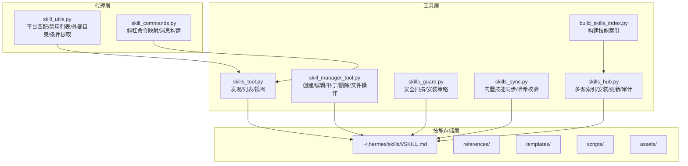
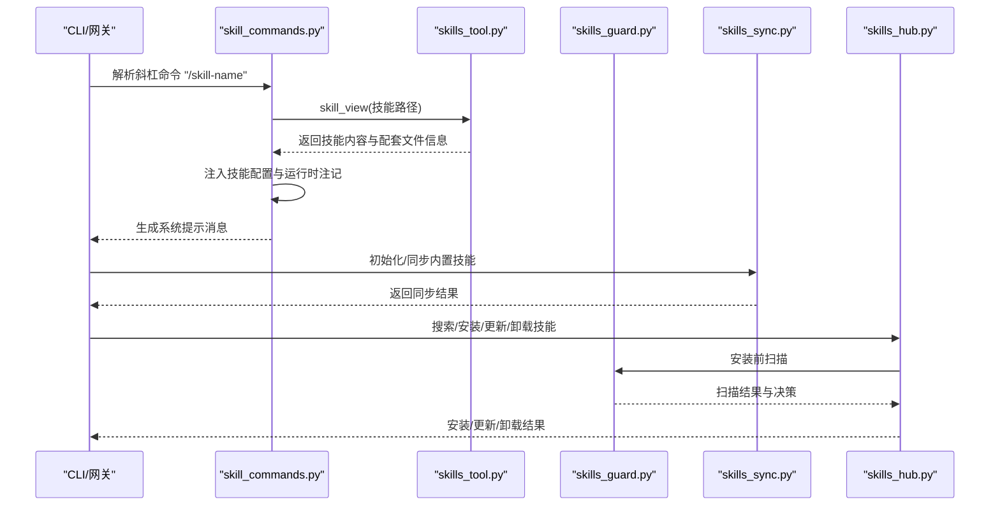
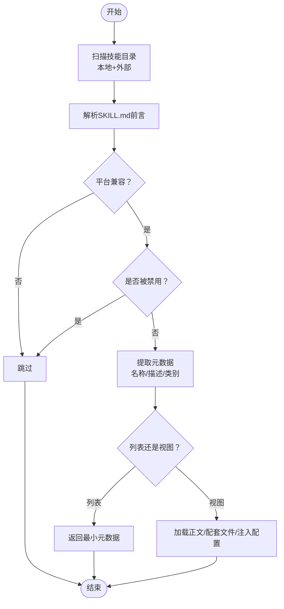
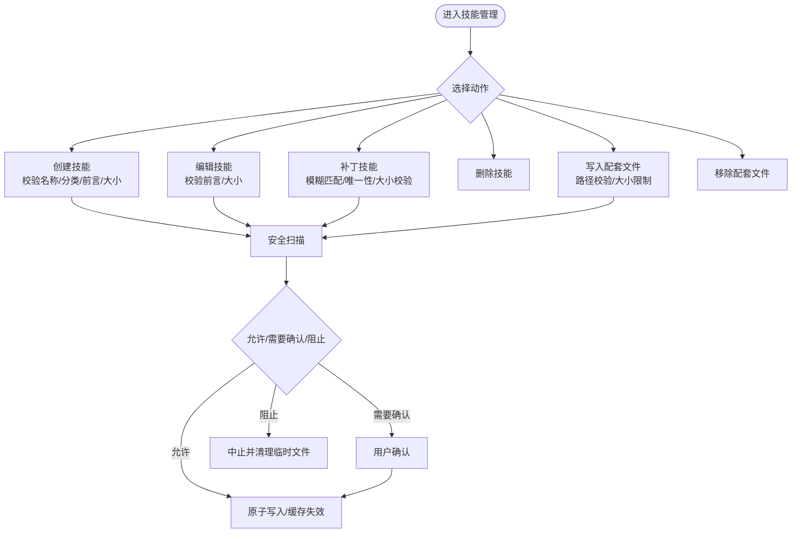
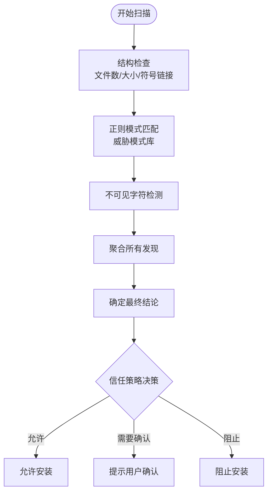
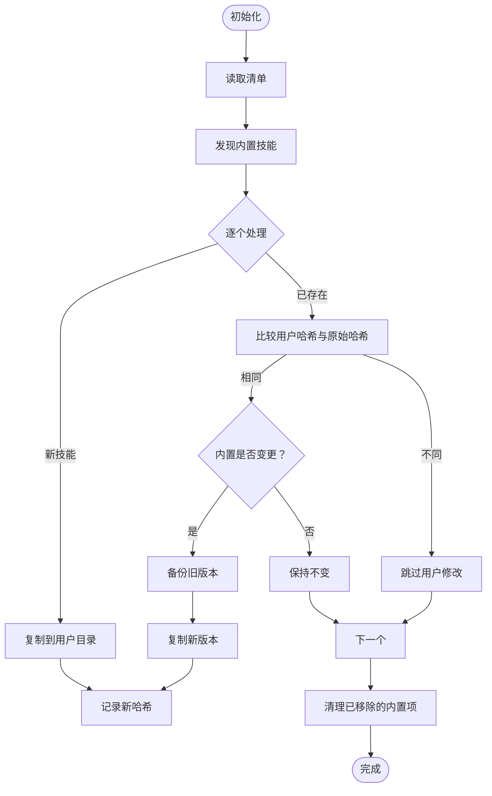
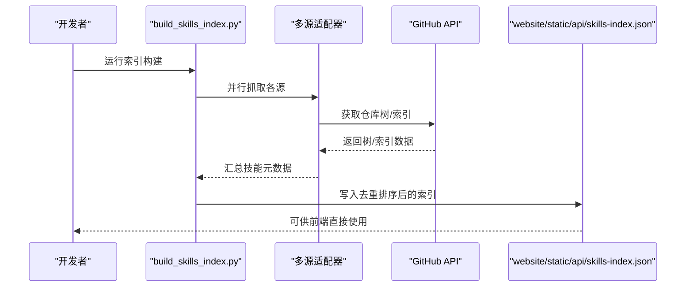
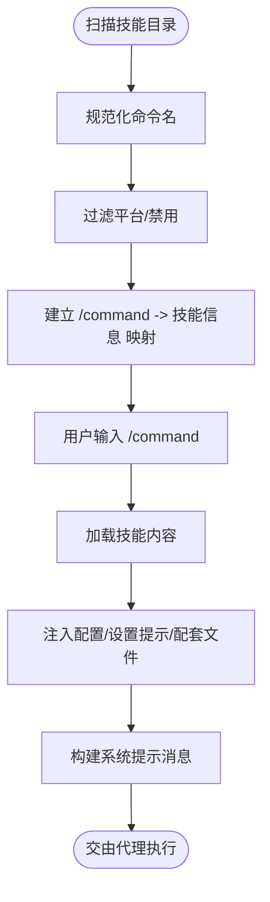
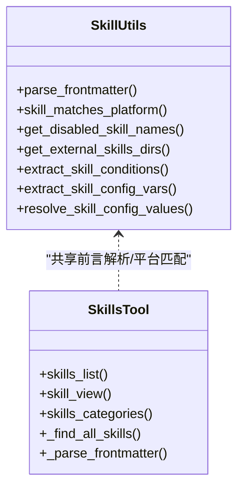
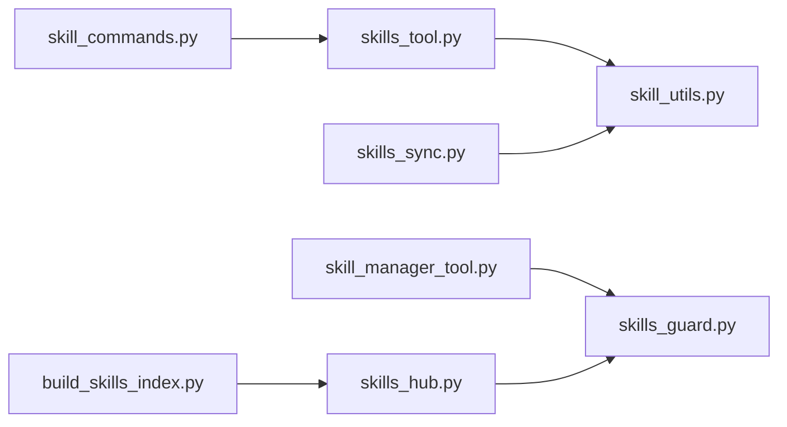

# 技能概念与架构

<cite>
**本文引用的文件**
- [skills_tool.py](file://tools/skills_tool.py)
- [skill_manager_tool.py](file://tools/skill_manager_tool.py)
- [skills_guard.py](file://tools/skills_guard.py)
- [skills_sync.py](file://tools/skills_sync.py)
- [skills_hub.py](file://tools/skills_hub.py)
- [build_skills_index.py](file://scripts/build_skills_index.py)
- [skill_utils.py](file://agent/skill_utils.py)
- [skill_commands.py](file://agent/skill_commands.py)
- [claude_marketplace_anthropics_skills.json](file://skills/index-cache/claude_marketplace_anthropics_skills.json)
</cite>

## 目录
1. [引言](#引言)
2. [项目结构](#项目结构)
3. [核心组件](#核心组件)
4. [架构总览](#架构总览)
5. [详细组件分析](#详细组件分析)
6. [依赖关系分析](#依赖关系分析)
7. [性能考虑](#性能考虑)
8. [故障排除指南](#故障排除指南)
9. [结论](#结论)
10. [附录](#附录)

## 引言
本文件面向Hermes Agent的技能（Skill）系统，系统性阐述技能的概念、与工具（Tool）的区别、生命周期与执行机制；详解技能的架构设计、加载机制、注册流程与执行环境；梳理技能的分类体系、依赖关系与版本管理策略；给出技能配置文件格式、元数据定义与接口规范，帮助开发者建立完整的技能架构认知，为后续技能开发奠定理论基础。

## 项目结构
技能系统围绕“技能目录”展开，统一入口位于用户Home下的技能目录（默认：~/.hermes/skills），同时支持通过配置注入外部技能目录。技能以“SKILL.md”为核心元数据文件，辅以references/templates/scripts/assets等子目录组织配套材料。系统提供以下能力：
- 技能发现与列表：按类别与平台过滤，最小化元数据传输
- 技能内容加载：按需加载完整内容与配套文件
- 技能管理：创建、编辑、补丁、删除、写入/移除配套文件
- 安全扫描：安装前/后扫描，信任级别驱动的安装策略
- 同步与更新：内置技能清单与哈希校验，避免覆盖用户修改
- 技能中心：多源索引与搜索，支持安装、检查更新、卸载
- 命令映射：将技能名映射为可调用的斜杠命令

**图表来源**
- [skills_tool.py:1-1359](file://tools/skills_tool.py#L1-L1359)
- [skill_manager_tool.py:1-762](file://tools/skill_manager_tool.py#L1-L762)
- [skills_guard.py:1-978](file://tools/skills_guard.py#L1-L978)
- [skills_sync.py:1-317](file://tools/skills_sync.py#L1-L317)
- [skills_hub.py:1-3054](file://tools/skills_hub.py#L1-L3054)
- [build_skills_index.py:1-326](file://scripts/build_skills_index.py#L1-L326)
- [skill_utils.py:1-444](file://agent/skill_utils.py#L1-L444)
- [skill_commands.py:1-369](file://agent/skill_commands.py#L1-L369)

**章节来源**
- [skills_tool.py:1-1359](file://tools/skills_tool.py#L1-L1359)
- [skill_manager_tool.py:1-762](file://tools/skill_manager_tool.py#L1-L762)
- [skills_guard.py:1-978](file://tools/skills_guard.py#L1-L978)
- [skills_sync.py:1-317](file://tools/skills_sync.py#L1-L317)
- [skills_hub.py:1-3054](file://tools/skills_hub.py#L1-L3054)
- [build_skills_index.py:1-326](file://scripts/build_skills_index.py#L1-L326)
- [skill_utils.py:1-444](file://agent/skill_utils.py#L1-L444)
- [skill_commands.py:1-369](file://agent/skill_commands.py#L1-L369)

## 核心组件
- 技能发现与视图
  - 发现：遍历本地与外部技能目录，解析SKILL.md前言元数据，按平台与禁用列表过滤
  - 列表：返回最小元数据（名称、描述、类别），用于高效展示
  - 视图：按需加载完整内容与配套文件
- 技能管理
  - 创建/编辑/补丁/删除/写入/移除配套文件，支持原子写入与安全扫描
- 安全扫描
  - 结构检查、正则威胁模式检测、不可见字符检测、信任级别策略
- 同步与更新
  - 内置技能清单与哈希校验，尊重用户修改，避免覆盖
- 技能中心
  - 多源索引（官方、well-known、skills.sh、GitHub、Claude Marketplace、LobeHub）、搜索、安装、更新、审计
- 命令映射
  - 将技能名映射为斜杠命令，构建系统提示消息，注入配置与运行时注记

**章节来源**
- [skills_tool.py:512-800](file://tools/skills_tool.py#L512-L800)
- [skill_manager_tool.py:292-762](file://tools/skill_manager_tool.py#L292-L762)
- [skills_guard.py:595-713](file://tools/skills_guard.py#L595-L713)
- [skills_sync.py:176-317](file://tools/skills_sync.py#L176-L317)
- [skills_hub.py:144-308](file://tools/skills_hub.py#L144-L308)
- [skill_commands.py:200-369](file://agent/skill_commands.py#L200-L369)

## 架构总览
技能系统采用“目录即仓库”的轻量架构，核心由工具层与代理层协作完成：
- 工具层负责I/O、解析、扫描、同步与多源集成
- 代理层负责平台适配、配置注入、命令映射与消息构建
- 配置与环境变量贯穿于加载、扫描与执行阶段

**图表来源**
- [skill_commands.py:291-369](file://agent/skill_commands.py#L291-L369)
- [skills_tool.py:779-800](file://tools/skills_tool.py#L779-L800)
- [skills_guard.py:595-713](file://tools/skills_guard.py#L595-L713)
- [skills_sync.py:176-317](file://tools/skills_sync.py#L176-L317)
- [skills_hub.py:310-466](file://tools/skills_hub.py#L310-L466)

**章节来源**
- [skill_commands.py:1-369](file://agent/skill_commands.py#L1-L369)
- [skills_tool.py:1-1359](file://tools/skills_tool.py#L1-L1359)
- [skills_guard.py:1-978](file://tools/skills_guard.py#L1-L978)
- [skills_sync.py:1-317](file://tools/skills_sync.py#L1-L317)
- [skills_hub.py:1-3054](file://tools/skills_hub.py#L1-L3054)

## 详细组件分析

### 技能发现与视图（skills_tool）
- 目录扫描：支持本地与外部技能目录，排除.git/.github/.hub等隐藏目录
- 平台过滤：根据SKILL.md前言中的platforms字段与系统平台映射进行过滤
- 禁用列表：读取配置文件中的全局/平台禁用列表
- 分类与描述：从DESCRIPTION.md或首段文本提取分类描述
- 最小元数据：skills_list仅返回名称、描述与类别，降低token消耗
- 完整视图：skill_view按需加载正文、配置注入、配套文件列表

**图表来源**
- [skills_tool.py:512-800](file://tools/skills_tool.py#L512-L800)

**章节来源**
- [skills_tool.py:512-800](file://tools/skills_tool.py#L512-L800)

### 技能管理（skill_manager_tool）
- 动作集合：create/edit/patch/delete/write_file/remove_file
- 安全扫描：安装后对新写入的技能目录进行扫描，必要时回滚
- 原子写入：使用临时文件+替换确保写入过程不被中断
- 文件限制：单文件大小与技能总大小上限，防止异常膨胀
- 路径安全：禁止路径穿越，限定在允许的子目录内

**图表来源**
- [skill_manager_tool.py:292-762](file://tools/skill_manager_tool.py#L292-L762)
- [skills_guard.py:642-713](file://tools/skills_guard.py#L642-L713)

**章节来源**
- [skill_manager_tool.py:1-762](file://tools/skill_manager_tool.py#L1-L762)
- [skills_guard.py:1-978](file://tools/skills_guard.py#L1-L978)

### 安全扫描（skills_guard）
- 扫描范围：结构检查（文件数/大小/符号链接）、正则威胁模式、不可见字符
- 威胁模式：数据外泄、提示词注入、破坏性操作、持久化、网络隧道、混淆、进程执行、路径穿越、挖矿、供应链风险、权限提升、上下文外泄、硬编码凭证等
- 信任策略：builtin/trusted/community/agent-created四种信任级别，结合扫描结论决定安装许可
- 报告格式：可读的扫描报告，包含严重程度、类别、位置与匹配片段

**图表来源**
- [skills_guard.py:595-713](file://tools/skills_guard.py#L595-L713)

**章节来源**
- [skills_guard.py:1-978](file://tools/skills_guard.py#L1-L978)

### 内置技能同步（skills_sync）
- 清单格式：v2记录“技能名:原始哈希”，v1自动迁移
- 同步逻辑：
  - 新技能：复制到用户目录，记录原始哈希
  - 已存在：若用户副本与原始一致则可更新，否则跳过（尊重用户修改）
  - 用户删除：保留清单条目，不再重装
  - 移除的内置：从清单清理
- 原子写入：使用临时文件+替换，避免写入中断导致损坏

**图表来源**
- [skills_sync.py:176-317](file://tools/skills_sync.py#L176-L317)

**章节来源**
- [skills_sync.py:1-317](file://tools/skills_sync.py#L1-L317)

### 技能中心与索引（skills_hub / build_skills_index）
- 多源适配：官方、well-known、skills.sh、GitHub、Claude Marketplace、LobeHub
- 搜索与浏览：并行抓取各源，去重排序，支持分页与信任等级优先
- 安装流程：解析标识符→拉取包→隔离区→扫描→策略决策→确认→安装→缓存失效
- 索引构建：脚本批量爬取各源，解析GitHub树以定位SKILL.md，输出静态JSON供前端使用

**图表来源**
- [build_skills_index.py:245-326](file://scripts/build_skills_index.py#L245-L326)
- [skills_hub.py:144-308](file://tools/skills_hub.py#L144-L308)

**章节来源**
- [skills_hub.py:1-3054](file://tools/skills_hub.py#L1-L3054)
- [build_skills_index.py:1-326](file://scripts/build_skills_index.py#L1-L326)

### 命令映射与执行（skill_commands）
- 命令扫描：遍历技能目录，规范化名称为斜杠命令键，忽略不兼容平台与禁用技能
- 消息构建：加载技能内容，注入配置值、设置提示、配套文件列表与运行时注记
- 会话预加载：支持在CLI启动时预加载多个技能，形成系统提示

**图表来源**
- [skill_commands.py:200-369](file://agent/skill_commands.py#L200-L369)

**章节来源**
- [skill_commands.py:1-369](file://agent/skill_commands.py#L1-L369)

### 技能配置与元数据（skill_utils / skills_tool）
- 平台匹配：根据SKILL.md前言的platforms字段与系统平台映射判断兼容性
- 禁用列表：从配置文件读取全局/平台禁用技能集合
- 外部目录：支持通过配置注入额外技能目录，优先级低于本地
- 条件与配置：提取metadata.hermes中的条件声明与配置变量，用于运行时注入
- 前言解析：通用的YAML前言解析器，支持回退解析

**图表来源**
- [skill_utils.py:52-444](file://agent/skill_utils.py#L52-L444)
- [skills_tool.py:414-800](file://tools/skills_tool.py#L414-L800)

**章节来源**
- [skill_utils.py:1-444](file://agent/skill_utils.py#L1-L444)
- [skills_tool.py:1-1359](file://tools/skills_tool.py#L1-L1359)

## 依赖关系分析
- 组件耦合
  - skills_tool与skill_utils：前者依赖后者提供的前言解析、平台匹配、禁用列表与外部目录
  - skill_manager_tool与skills_guard：管理动作完成后触发安全扫描，必要时回滚
  - skills_hub与skills_guard：安装前扫描，信任策略驱动决策
  - skill_commands与skills_tool：命令映射依赖技能发现与视图
  - skills_sync与skills_tool：同步内置技能时复用前言解析与平台匹配
- 外部依赖
  - GitHub API：多源适配器依赖，用于索引与内容抓取
  - 前端索引：build_skills_index.py输出静态JSON，供网站前端使用
- 循环依赖规避
  - skill_utils避免导入工具注册与提供者解析，保持轻量化

**图表来源**
- [skills_tool.py:1-1359](file://tools/skills_tool.py#L1-L1359)
- [skill_utils.py:1-444](file://agent/skill_utils.py#L1-L444)
- [skill_manager_tool.py:1-762](file://tools/skill_manager_tool.py#L1-L762)
- [skills_guard.py:1-978](file://tools/skills_guard.py#L1-L978)
- [skills_hub.py:1-3054](file://tools/skills_hub.py#L1-L3054)
- [skill_commands.py:1-369](file://agent/skill_commands.py#L1-L369)
- [skills_sync.py:1-317](file://tools/skills_sync.py#L1-L317)
- [build_skills_index.py:1-326](file://scripts/build_skills_index.py#L1-L326)

**章节来源**
- [skills_tool.py:1-1359](file://tools/skills_tool.py#L1-L1359)
- [skill_utils.py:1-444](file://agent/skill_utils.py#L1-L444)
- [skill_manager_tool.py:1-762](file://tools/skill_manager_tool.py#L1-L762)
- [skills_guard.py:1-978](file://tools/skills_guard.py#L1-L978)
- [skills_hub.py:1-3054](file://tools/skills_hub.py#L1-L3054)
- [skill_commands.py:1-369](file://agent/skill_commands.py#L1-L369)
- [skills_sync.py:1-317](file://tools/skills_sync.py#L1-L317)
- [build_skills_index.py:1-326](file://scripts/build_skills_index.py#L1-L326)

## 性能考虑
- 渐进披露：skills_list仅返回最小元数据，减少token与IO开销
- 并行抓取：skills_hub对多源并行搜索，设置超时与限流，避免阻塞
- 原子写入：技能管理与清单写入均采用临时文件+替换，降低失败率与锁竞争
- 缓存与索引：build_skills_index输出静态JSON，前端直连，减少API调用
- 结构限制：安全扫描对文件数量、大小与扩展名进行限制，防止异常膨胀

[本节为通用指导，无需特定文件引用]

## 故障排除指南
- 安装被阻止
  - 检查扫描报告，关注高危/危险结论与具体匹配行
  - 使用--force强制安装（仅在明确风险可控时）
- GitHub API速率限制
  - 设置GITHUB_TOKEN或登录gh CLI，提高配额
- 技能未显示
  - 检查平台兼容性（SKILL.md前言platforms字段）
  - 检查配置中的禁用列表（全局/平台）
  - 确认技能目录权限与编码（UTF-8）
- 安全扫描误报
  - 通过--force安装或调整技能内容，消除敏感模式匹配
- 更新问题
  - 使用do_check/do_update检查与更新已安装技能
  - 若用户自定义修改，系统将跳过覆盖以保护用户工作

**章节来源**
- [skills_guard.py:642-713](file://tools/skills_guard.py#L642-L713)
- [skills_hub.py:333-466](file://tools/skills_hub.py#L333-L466)
- [skills_tool.py:134-142](file://tools/skills_tool.py#L134-L142)

## 结论
Hermes Agent的技能系统以“目录即仓库”为核心理念，通过工具层与代理层的清晰分工，实现了技能的发现、管理、安全与执行闭环。系统在易用性（渐进披露、命令映射）、安全性（多源扫描、信任策略）、可维护性（清单同步、原子写入、索引缓存）与可扩展性（多源适配、外部目录、条件与配置注入）方面形成了完整的架构。开发者可据此快速上手技能开发，并在保证安全与稳定的前提下持续迭代。

[本节为总结性内容，无需特定文件引用]

## 附录

### 技能基本概念与工具区别
- 技能（Skill）：可重复使用的程序化知识，包含明确的触发条件、步骤与验证方法，强调“如何做某事”
- 工具（Tool）：执行具体任务的函数或服务，强调“做什么”与“如何调用”

[本节为概念性内容，无需特定文件引用]

### 技能生命周期与执行机制
- 生命周期：创建/编辑/补丁/删除 → 安装/更新/卸载 → 使用/预加载 → 缓存失效
- 执行机制：斜杠命令触发 → 加载技能内容 → 注入配置/设置提示 → 构建系统提示 → 交由代理执行

**章节来源**
- [skill_commands.py:291-369](file://agent/skill_commands.py#L291-L369)
- [skill_manager_tool.py:588-762](file://tools/skill_manager_tool.py#L588-L762)

### 技能架构设计要点
- 单一技能目录（~/.hermes/skills）作为“单一真相来源”
- 支持外部目录注入，优先级低于本地
- 前言元数据标准化（agentskills.io兼容）
- 渐进披露：最小元数据优先，按需加载完整内容

**章节来源**
- [skills_tool.py:14-88](file://tools/skills_tool.py#L14-L88)
- [skill_utils.py:174-235](file://agent/skill_utils.py#L174-L235)

### 技能加载机制
- 发现：递归扫描SKILL.md，解析前言，平台与禁用过滤
- 列表：返回名称/描述/类别
- 视图：加载正文与配套文件，注入配置与设置提示

**章节来源**
- [skills_tool.py:512-800](file://tools/skills_tool.py#L512-L800)

### 技能注册流程
- 命令扫描：规范化名称为斜杠命令键，建立映射
- 消息构建：加载技能内容，注入配置与配套文件提示

**章节来源**
- [skill_commands.py:200-369](file://agent/skill_commands.py#L200-L369)

### 技能执行环境
- 平台适配：根据SKILL.md前言platforms字段与系统平台映射判断
- 环境变量：支持required_environment_variables与setup.collect_secrets
- 外部目录：通过配置注入，优先级低于本地

**章节来源**
- [skill_utils.py:92-116](file://agent/skill_utils.py#L92-L116)
- [skills_tool.py:209-273](file://tools/skills_tool.py#L209-L273)

### 技能分类体系
- 类别：通过技能目录层级体现（如mlops/axolotl）
- 描述：支持DESCRIPTION.md文件，含前言描述或首段文本
- 列表：skills_categories返回类别与技能计数

**章节来源**
- [skills_tool.py:632-710](file://tools/skills_tool.py#L632-L710)

### 技能依赖关系
- 条件声明：metadata.hermes中fallback_for_tools/requires_tools等
- 配置变量：metadata.hermes.config声明逻辑键、默认值与提示
- 运行时注入：在消息构建时将配置值注入到提示中

**章节来源**
- [skill_utils.py:241-317](file://agent/skill_utils.py#L241-L317)
- [skill_commands.py:82-119](file://agent/skill_commands.py#L82-L119)

### 技能版本管理
- 内置技能：通过清单哈希记录原始版本，尊重用户修改，避免覆盖
- 第三方技能：通过安装/更新流程与安全扫描保障一致性与安全性

**章节来源**
- [skills_sync.py:176-317](file://tools/skills_sync.py#L176-L317)
- [skills_hub.py:576-617](file://tools/skills_hub.py#L576-L617)

### 技能配置文件格式
- 必填字段：name（≤64字符）、description（≤1024字符）
- 可选字段：version、license（agentskills.io）、platforms（macos/linux/windows）、prerequisites（兼容遗留）、metadata.hermes.tags/related_skills、required_environment_variables、setup.collect_secrets、setup.help、metadata.hermes.config（键/描述/默认/提示）

**章节来源**
- [skills_tool.py:28-68](file://tools/skills_tool.py#L28-L68)

### 技能元数据定义
- 前言解析：支持嵌套结构与列表，回退解析
- 平台映射：macos/linux/windows映射到sys.platform前缀
- 禁用列表：支持全局与平台维度
- 外部目录：配置skills.external_dirs，展开~与环境变量

**章节来源**
- [skills_tool.py:414-422](file://tools/skills_tool.py#L414-L422)
- [skill_utils.py:21-25](file://agent/skill_utils.py#L21-L25)
- [skill_utils.py:121-169](file://agent/skill_utils.py#L121-L169)
- [skill_utils.py:174-235](file://agent/skill_utils.py#L174-L235)

### 技能接口规范
- 技能管理工具schema：action（create/patch/edit/delete/write_file/remove_file）、name、content、old_string/new_string、replace_all、category、file_path、file_content
- 命令调用：/skill-name（斜杠命令），支持用户指令附加与运行时注记

**章节来源**
- [skill_manager_tool.py:653-762](file://tools/skill_manager_tool.py#L653-L762)
- [skill_commands.py:291-369](file://agent/skill_commands.py#L291-L369)

### 示例索引参考
- Claude Marketplace示例索引：包含技能集合与来源信息，便于理解多源索引结构

**章节来源**
- [claude_marketplace_anthropics_skills.json:1-1](file://skills/index-cache/claude_marketplace_anthropics_skills.json#L1-L1)