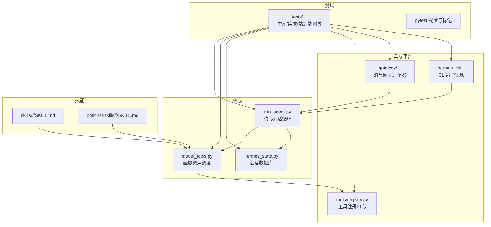
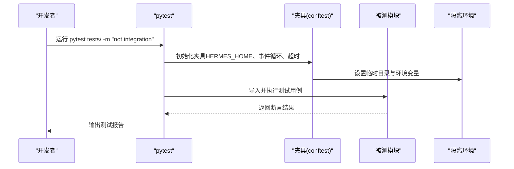
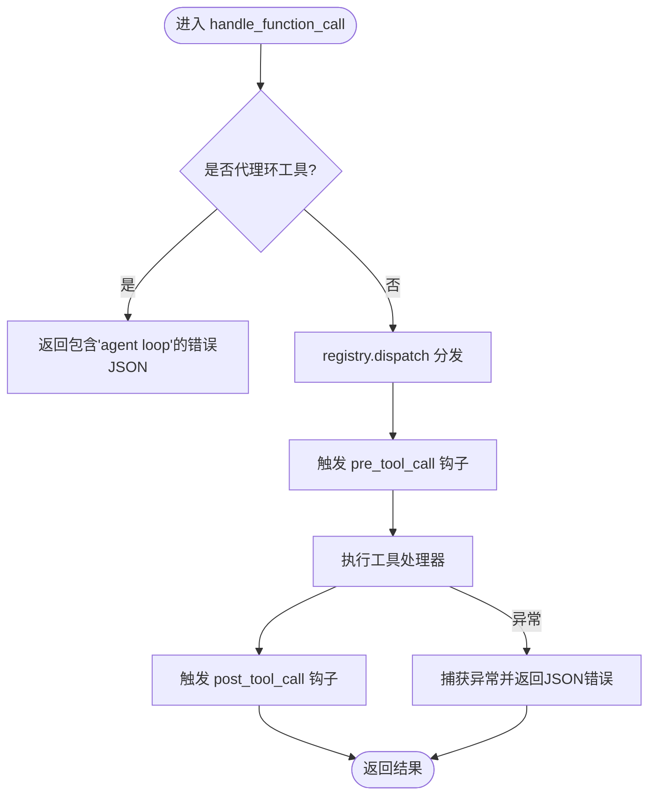
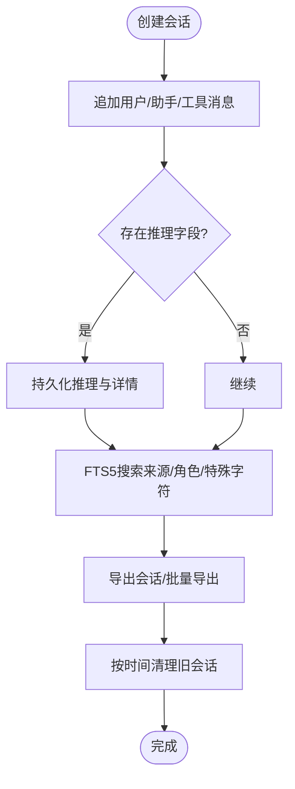
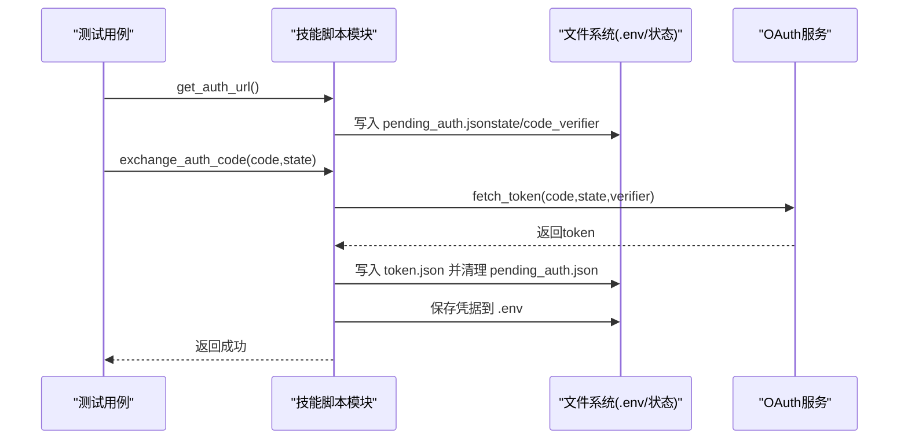
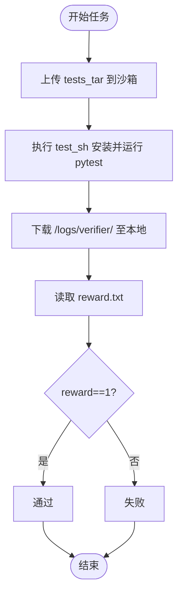
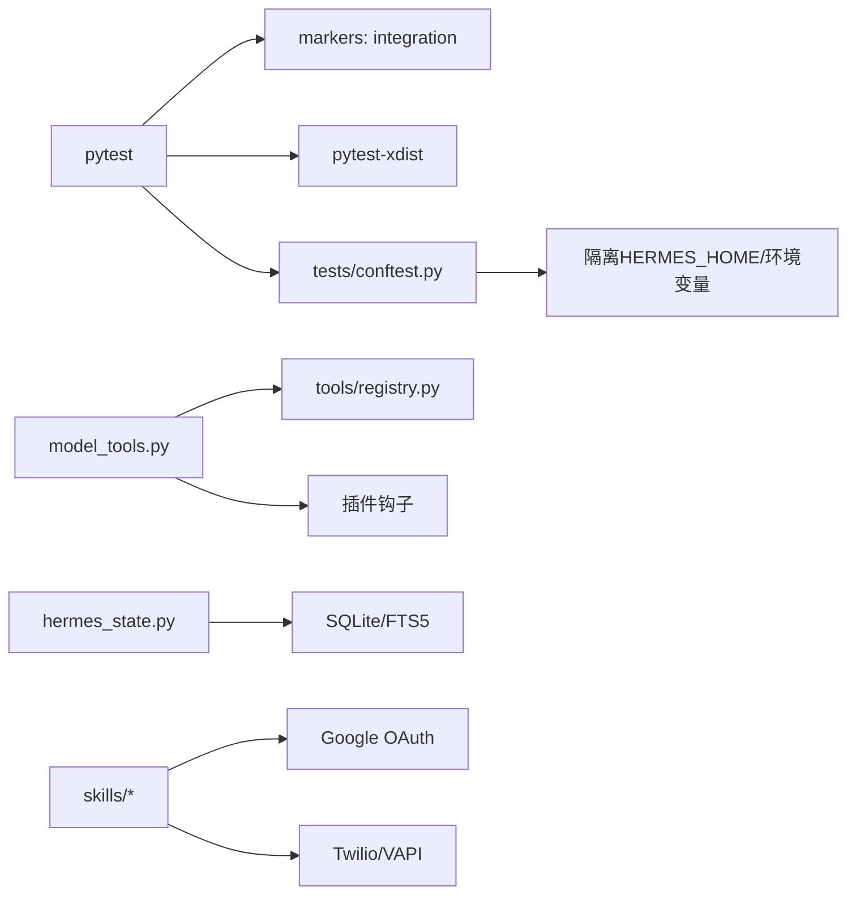

# 技能测试与验证

<cite>
**本文引用的文件**
- [README.md](file://README.md)
- [CONTRIBUTING.md](file://CONTRIBUTING.md)
- [pyproject.toml](file://pyproject.toml)
- [tests/conftest.py](file://tests/conftest.py)
- [tests/test_hermes_state.py](file://tests/test_hermes_state.py)
- [tests/test_model_tools.py](file://tests/test_model_tools.py)
- [tests/skills/test_google_oauth_setup.py](file://tests/skills/test_google_oauth_setup.py)
- [tests/skills/test_telephony_skill.py](file://tests/skills/test_telephony_skill.py)
- [environments/benchmarks/terminalbench_2/terminalbench2_env.py](file://environments/benchmarks/terminalbench_2/terminalbench2_env.py)
- [skills/software-development/test-driven-development/SKILL.md](file://skills/software-development/test-driven-development/SKILL.md)
</cite>

## 目录
1. [引言](#引言)
2. [项目结构](#项目结构)
3. [核心组件](#核心组件)
4. [架构总览](#架构总览)
5. [详细组件分析](#详细组件分析)
6. [依赖关系分析](#依赖关系分析)
7. [性能考量](#性能考量)
8. [故障排查指南](#故障排查指南)
9. [结论](#结论)
10. [附录](#附录)

## 引言
本文件面向Hermes Agent技能开发者与测试工程师，系统化阐述“技能测试与验证”的完整流程与保障体系。内容覆盖单元测试、集成测试、性能测试与用户体验测试；解释测试框架、测试用例设计与自动化测试实现；明确技能验证标准、质量评估指标与回归测试策略；并提供测试工具使用、测试数据准备与测试结果分析方法，帮助开发者构建高质量、可复用、可回归的技能。

## 项目结构
Hermes Agent采用模块化分层与自注册机制：核心代理在agent/目录下，工具在tools/目录下，CLI命令在hermes_cli/目录下，网关在gateway/目录下，技能位于skills/与optional-skills/目录中，测试集中在tests/目录。测试框架基于pytest，通过共享夹具（fixtures）隔离环境变量与用户配置，确保测试稳定与可重复。

图表来源
- [pyproject.toml:123-129](file://pyproject.toml#L123-L129)
- [tests/conftest.py:13-43](file://tests/conftest.py#L13-L43)

章节来源
- [README.md:114-182](file://README.md#L114-L182)
- [CONTRIBUTING.md:114-182](file://CONTRIBUTING.md#L114-L182)

## 核心组件
- 测试框架与运行
  - 基于pytest，使用markers区分集成测试；默认禁用需要外部服务的测试，支持并行执行。
  - 共享夹具自动隔离HERMES_HOME、清理平台会话环境变量、设置事件循环、统一超时控制。
- 工具与模型调度
  - model_tools负责函数调用分发、插件钩子前后置回调、遗留工具集映射兼容。
- 会话状态与持久化
  - hermes_state提供会话生命周期管理、消息存储、FTS5全文检索、导出与清理等能力。
- 技能与测试样例
  - skills与optional-skills中的SKILL.md定义技能行为与验证步骤；测试用例覆盖OAuth设置、电话技能等真实场景。

章节来源
- [pyproject.toml:123-129](file://pyproject.toml#L123-L129)
- [tests/conftest.py:19-122](file://tests/conftest.py#L19-L122)
- [tests/test_model_tools.py:1-140](file://tests/test_model_tools.py#L1-140)
- [tests/test_hermes_state.py:1-800](file://tests/test_hermes_state.py#L1-L800)

## 架构总览
测试架构围绕“隔离环境 + 自动化执行 + 结果验证”展开。测试通过夹具隔离用户配置与平台上下文，避免真实网络调用；对关键模块（工具注册、函数调用、会话数据库、技能脚本）进行单元与集成测试；对终端基准（TB2）提供性能测试参考路径。

图表来源
- [tests/conftest.py:19-122](file://tests/conftest.py#L19-L122)
- [pyproject.toml:123-129](file://pyproject.toml#L123-L129)

## 详细组件分析

### 单元测试：工具与模型调度
- 覆盖点
  - 函数调用处理：对代理环工具返回错误、未知工具返回错误、异常捕获返回JSON错误。
  - 插件钩子：pre_tool_call与post_tool_call接收会话ID、任务ID、工具调用ID。
  - 工具集映射：遗留工具集名称与工具名映射校验。
- 最佳实践
  - 使用patch模拟注册表与插件钩子，确保测试独立可控。
  - 对异常路径进行断言，保证错误信息可读且不崩溃。

图表来源
- [tests/test_model_tools.py:22-76](file://tests/test_model_tools.py#L22-L76)

章节来源
- [tests/test_model_tools.py:1-140](file://tests/test_model_tools.py#L1-L140)

### 单元测试：会话状态与全文检索
- 覆盖点
  - 会话生命周期：创建、结束、更新系统提示、令牌计数、父子会话。
  - 消息存储：追加消息、工具调用计数、推理字段序列化与恢复。
  - FTS5搜索：查询净化、角色/来源过滤、特殊字符安全、分页与导出。
  - 清理与导出：删除会话、批量导出、按来源筛选。
- 最佳实践
  - 使用临时数据库文件，测试结束后关闭连接。
  - 对FTS5查询进行危险字符与边界条件测试，确保不抛出操作异常。

图表来源
- [tests/test_hermes_state.py:23-800](file://tests/test_hermes_state.py#L23-L800)

章节来源
- [tests/test_hermes_state.py:1-800](file://tests/test_hermes_state.py#L1-L800)

### 集成测试：技能脚本与外部服务
- Google Workspace OAuth设置
  - 场景：浏览器授权URL生成、PKCE参数保存、授权码交换、状态校验、部分作用域接受。
  - 断言：保存pending auth、exchange后清理、状态不匹配拒绝、失败保留pending。
- 电话技能（Twilio/VAPI）
  - 场景：保存凭据至.env与状态文件、购买号码写入环境与状态、收件箱增量拉取与已读标记、诊断输出包含决策树与状态。
- 最佳实践
  - 使用importlib动态加载技能脚本模块，避免硬编码路径。
  - 通过monkeypatch注入依赖模块与文件路径，确保测试可移植。

图表来源
- [tests/skills/test_google_oauth_setup.py:135-241](file://tests/skills/test_google_oauth_setup.py#L135-L241)

章节来源
- [tests/skills/test_google_oauth_setup.py:1-241](file://tests/skills/test_google_oauth_setup.py#L1-L241)
- [tests/skills/test_telephony_skill.py:1-230](file://tests/skills/test_telephony_skill.py#L1-L230)

### 性能测试：终端基准（TB2）
- 路径
  - 在沙箱上传测试套件，执行test.sh安装pytest并运行tests/，下载/logs/verifier/reward.txt作为奖励值。
- 最佳实践
  - 保持test.sh最小化安装与执行逻辑，确保可重复性与可观察性。
  - 将奖励值标准化为0/1，便于统计与回归对比。

图表来源
- [environments/benchmarks/terminalbench_2/terminalbench2_env.py:632-667](file://environments/benchmarks/terminalbench_2/terminalbench2_env.py#L632-L667)

章节来源
- [environments/benchmarks/terminalbench_2/terminalbench2_env.py:632-667](file://environments/benchmarks/terminalbench_2/terminalbench2_env.py#L632-L667)

### 用户体验测试：测试驱动开发（TDD）技能
- 流程
  - 红灯：编写失败测试并运行，确认失败原因符合预期。
  - 绿灯：编写最小代码使测试通过，再运行全量测试检查回归。
  - 反思：重构以消除重复、提升可读性。
- 最佳实践
  - 每个测试聚焦单一行为，命名清晰描述行为而非实现。
  - 不要跳过红灯或绿灯步骤；必要时允许“作弊式绿灯”以便后续重构。

章节来源
- [skills/software-development/test-driven-development/SKILL.md:76-150](file://skills/software-development/test-driven-development/SKILL.md#L76-L150)
- [skills/software-development/test-driven-development/SKILL.md:282-343](file://skills/software-development/test-driven-development/SKILL.md#L282-L343)

## 依赖关系分析
- 测试依赖
  - pytest与pytest-asyncio用于同步/异步测试；pytest-xdist支持并行执行；markers用于区分集成测试。
  - conftest提供全局夹具，统一隔离用户配置与平台上下文。
- 模块依赖
  - model_tools依赖tools/registry进行工具分发；hermes_state依赖SQLite与FTS5；技能脚本依赖外部服务（如Google OAuth、Twilio）。
- 外部服务
  - 集成测试通过夹具屏蔽真实调用，或使用mock/假对象替代；默认禁用需要真实密钥的测试。

图表来源
- [pyproject.toml:123-129](file://pyproject.toml#L123-L129)
- [tests/conftest.py:19-122](file://tests/conftest.py#L19-L122)

章节来源
- [pyproject.toml:123-129](file://pyproject.toml#L123-L129)
- [tests/conftest.py:19-122](file://tests/conftest.py#L19-L122)

## 性能考量
- 测试并行与超时
  - 使用pytest-xdist并行执行；对同步测试提供默认事件循环；单测超时30秒，防止挂起阻塞。
- 基准测试
  - 终端基准（TB2）通过沙箱执行测试套件并产出奖励值，建议建立基线与回归阈值。
- 资源隔离
  - 测试前清理缓存与临时文件，避免跨用例污染；对外部服务调用进行mock或禁用。

章节来源
- [tests/conftest.py:74-122](file://tests/conftest.py#L74-L122)
- [environments/benchmarks/terminalbench_2/terminalbench2_env.py:632-667](file://environments/benchmarks/terminalbench_2/terminalbench2_env.py#L632-L667)

## 故障排查指南
- 常见问题
  - 真实API密钥导致测试失败：默认禁用集成测试；如需调试，请在本地启用并正确配置环境变量。
  - 跨平台差异：Windows/macOS/Linux在进程管理、路径分隔符、终端菜单等方面不同，注意平台检测与降级。
  - FTS5查询异常：对特殊字符、引号不平衡、布尔运算符相邻等情况进行净化与断言。
- 排查步骤
  - 使用pytest带-v输出详细日志；对异步用例添加@pytest.mark.asyncio；对长时间运行用例检查超时设置。
  - 对技能脚本测试，确认临时文件路径与环境变量设置正确，必要时打印中间状态。

章节来源
- [tests/conftest.py:19-122](file://tests/conftest.py#L19-L122)
- [tests/test_hermes_state.py:337-480](file://tests/test_hermes_state.py#L337-L480)

## 结论
通过“隔离环境 + 自动化执行 + 多层次验证”的测试体系，Hermes Agent能够为技能提供从单元到集成再到性能的全面保障。建议开发者在新增或修改技能时，遵循TDD流程、完善单元与集成测试，并结合基准测试进行回归验证，持续提升技能质量与稳定性。

## 附录

### 测试工具与命令
- 运行全部测试（排除集成测试）
  - pytest tests/ -m "not integration" -n auto
- 运行特定模块测试
  - pytest tests/test_model_tools.py -v
  - pytest tests/test_hermes_state.py::TestSessionLifecycle -v
- 运行技能相关测试
  - pytest tests/skills/test_google_oauth_setup.py -v
  - pytest tests/skills/test_telephony_skill.py -v

章节来源
- [pyproject.toml:123-129](file://pyproject.toml#L123-L129)

### 测试数据准备
- 临时目录与环境
  - 使用夹具提供的tmp_path与HERMES_HOME，确保测试不污染用户主目录。
- 技能脚本依赖
  - 使用importlib动态加载脚本模块，注入客户端密钥文件与状态文件路径。
- 外部服务
  - 通过假对象或mock替换第三方HTTP请求，避免真实调用。

章节来源
- [tests/conftest.py:19-43](file://tests/conftest.py#L19-L43)
- [tests/skills/test_google_oauth_setup.py:102-132](file://tests/skills/test_google_oauth_setup.py#L102-L132)
- [tests/skills/test_telephony_skill.py:20-27](file://tests/skills/test_telephony_skill.py#L20-L27)

### 测试报告与质量评估
- 报告生成
  - pytest默认输出简洁报告；可配合CI收集测试日志与覆盖率。
- 质量指标
  - 单元测试通过率、集成测试通过率、基准测试奖励均值、回归用例失败率。
- 回归策略
  - 新增/修改技能必须补充或更新对应测试；对关键路径增加边界与异常场景测试。

章节来源
- [pyproject.toml:123-129](file://pyproject.toml#L123-L129)
- [environments/benchmarks/terminalbench_2/terminalbench2_env.py:632-667](file://environments/benchmarks/terminalbench_2/terminalbench2_env.py#L632-L667)