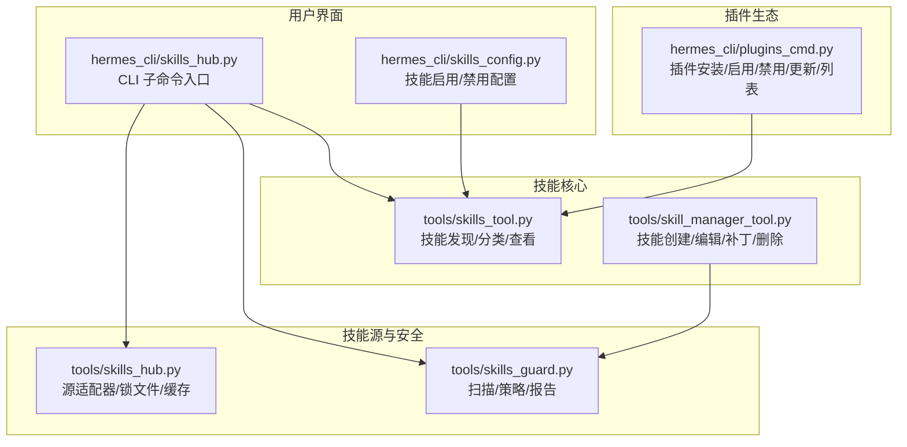
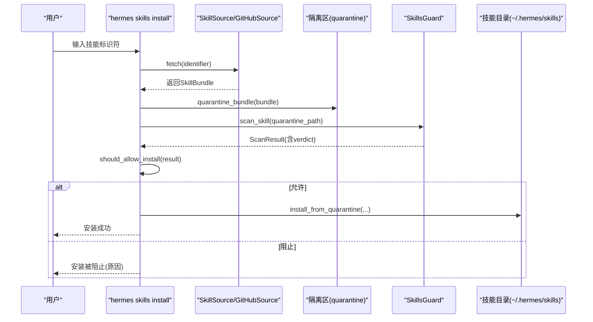
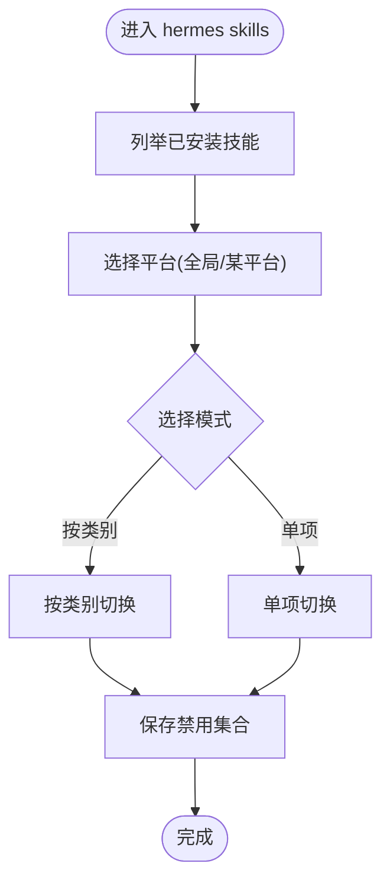
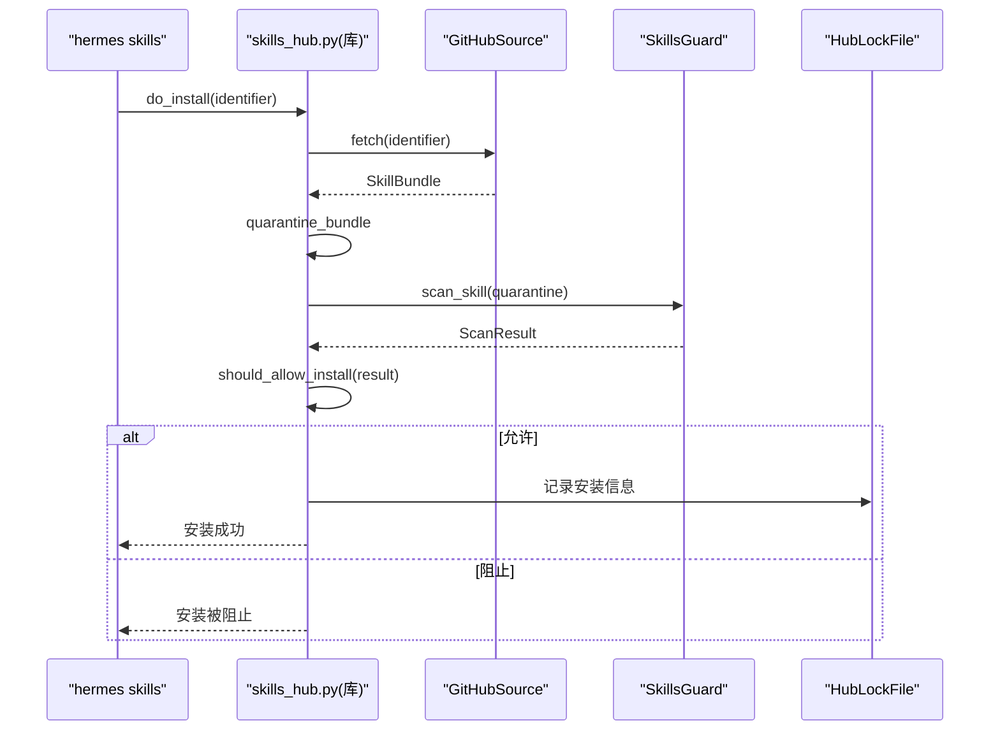
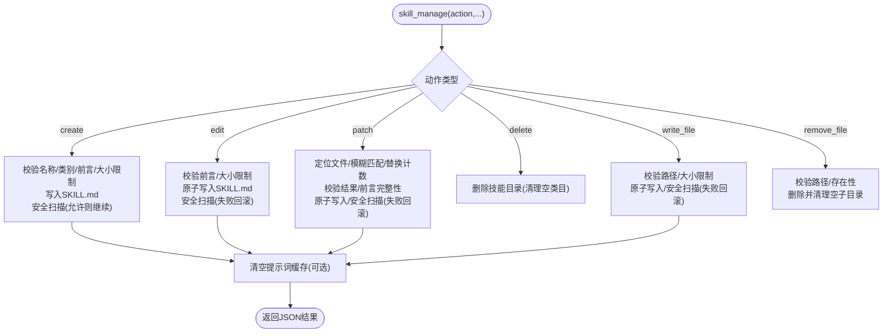
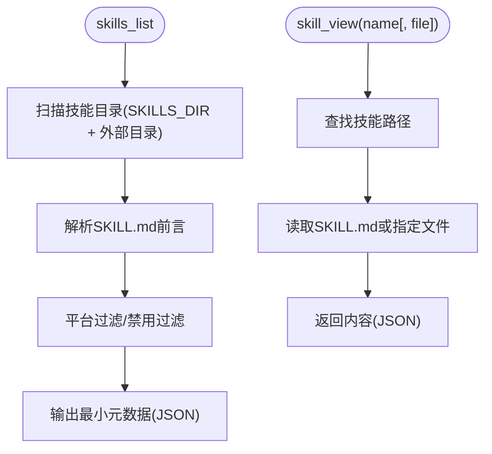
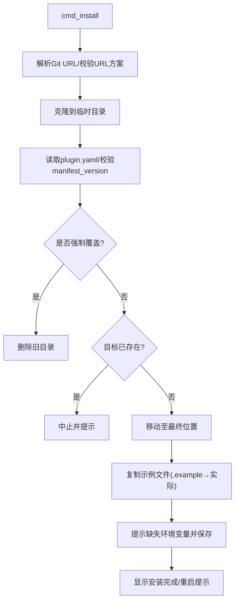
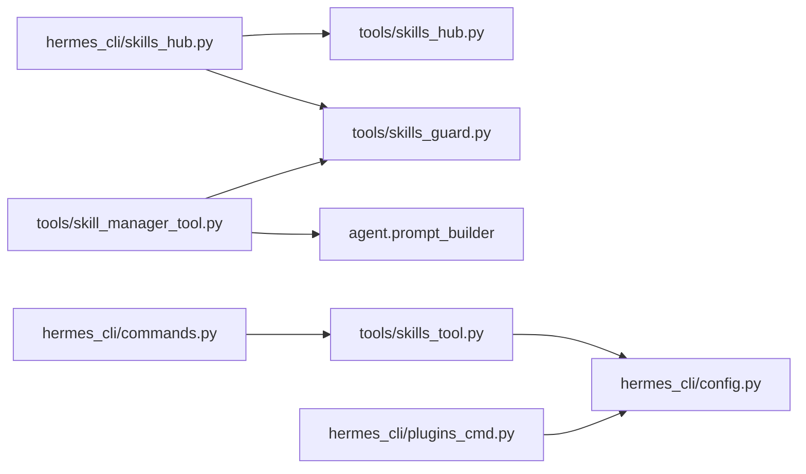

# 技能管理与维护

<cite>
**本文档引用的文件**
- [skills_config.py](file://hermes_cli/skills_config.py)
- [skills_hub.py](file://hermes_cli/skills_hub.py)
- [skills_tool.py](file://tools/skills_tool.py)
- [skills_guard.py](file://tools/skills_guard.py)
- [skills_hub.py](file://tools/skills_hub.py)
- [skill_manager_tool.py](file://tools/skill_manager_tool.py)
- [plugins_cmd.py](file://hermes_cli/plugins_cmd.py)
- [commands.py](file://hermes_cli/commands.py)
- [uninstall.py](file://hermes_cli/uninstall.py)
</cite>

## 目录
1. [简介](#简介)
2. [项目结构](#项目结构)
3. [核心组件](#核心组件)
4. [架构总览](#架构总览)
5. [详细组件分析](#详细组件分析)
6. [依赖关系分析](#依赖关系分析)
7. [性能考虑](#性能考虑)
8. [故障排除指南](#故障排除指南)
9. [结论](#结论)
10. [附录](#附录)

## 简介
本文件面向技能使用者与系统管理员，系统性阐述 Hermes Agent 的技能管理与维护能力，覆盖安装、卸载、启用/禁用、更新、配置管理、依赖与冲突处理、版本控制、备份与恢复、迁移、性能监控、使用统计与健康检查等主题，并提供可操作的工具与方法。

## 项目结构
Hermes Agent 的技能体系由“用户技能目录”“官方/社区技能源”“安全扫描器”“命令行与交互式工具”共同组成。关键路径与职责如下：
- 用户技能目录：位于 `~/.hermes/skills/`，统一承载本地、官方与社区安装的技能。
- 技能源适配器：支持 GitHub、Well-Known Endpoint 等多源技能索引与下载。
- 安全扫描：对第三方技能进行静态威胁检测与信任策略判定。
- 命令行与交互：提供 `hermes skills` 子命令、技能列表/浏览/搜索/安装/卸载/审计、以及技能内容查看与编辑工具。

**图表来源**
- [skills_hub.py:1-120](file://hermes_cli/skills_hub.py#L1-L120)
- [skills_config.py:1-178](file://hermes_cli/skills_config.py#L1-L178)
- [skills_tool.py:1-120](file://tools/skills_tool.py#L1-L120)
- [skills_guard.py:1-120](file://tools/skills_guard.py#L1-L120)
- [skill_manager_tool.py:1-120](file://tools/skill_manager_tool.py#L1-L120)
- [plugins_cmd.py:1-120](file://hermes_cli/plugins_cmd.py#L1-L120)

**章节来源**
- [skills_hub.py:1-120](file://hermes_cli/skills_hub.py#L1-L120)
- [skills_config.py:1-178](file://hermes_cli/skills_config.py#L1-L178)
- [skills_tool.py:1-120](file://tools/skills_tool.py#L1-L120)
- [skills_guard.py:1-120](file://tools/skills_guard.py#L1-L120)
- [skill_manager_tool.py:1-120](file://tools/skill_manager_tool.py#L1-L120)
- [plugins_cmd.py:1-120](file://hermes_cli/plugins_cmd.py#L1-L120)

## 核心组件
- 技能配置与启用/禁用
  - 通过 `hermes skills` 配置全局或按平台（如 Telegram、CLI）的技能禁用列表；支持按类别或单项切换。
- 技能源与安装
  - 支持从 GitHub、Well-Known Endpoint 等源搜索、预览、安装技能；内置隔离区（quarantine）、安全扫描与安装策略。
- 技能内容管理
  - 提供技能创建、编辑、补丁、删除、写入/移除支持文件的能力；自动触发提示词缓存失效以即时生效。
- 插件生态
  - 插件安装/更新/卸载/启用/禁用/列表；支持从 Git 克隆安装，支持环境变量注入与示例文件复制。
- 健康与审计
  - 对已安装技能执行重新扫描与状态检查；提供更新检查与批量更新。

**章节来源**
- [skills_config.py:125-178](file://hermes_cli/skills_config.py#L125-L178)
- [skills_hub.py:310-466](file://hermes_cli/skills_hub.py#L310-L466)
- [skills_tool.py:512-777](file://tools/skills_tool.py#L512-L777)
- [skill_manager_tool.py:588-647](file://tools/skill_manager_tool.py#L588-L647)
- [plugins_cmd.py:284-595](file://hermes_cli/plugins_cmd.py#L284-L595)
- [skills_guard.py:642-713](file://tools/skills_guard.py#L642-L713)

## 架构总览
技能管理采用“命令行入口 + 源适配器 + 扫描策略 + 内容管理 + 配置持久化”的分层设计。安装流程的关键步骤包括：解析标识符、选择源、拉取包、隔离区存放、安全扫描、策略判定、确认安装、写入用户技能目录、清理缓存。

**图表来源**
- [skills_hub.py:310-466](file://hermes_cli/skills_hub.py#L310-L466)
- [skills_guard.py:595-713](file://tools/skills_guard.py#L595-L713)

**章节来源**
- [skills_hub.py:310-466](file://hermes_cli/skills_hub.py#L310-L466)
- [skills_guard.py:595-713](file://tools/skills_guard.py#L595-L713)

## 详细组件分析

### 组件A：技能配置与启用/禁用（skills_config）
- 功能要点
  - 读取/保存技能禁用列表，支持全局与按平台覆盖。
  - 列出所有已安装技能，按类别聚合；支持交互式按类别或单项切换。
  - 通过 UI 选择平台（全局/各平台），并以清单方式展示与修改。
- 关键实现
  - 获取禁用集合与保存禁用集合。
  - 列举技能、提取类别、构建 UI 清单。
  - 交互式勾选后计算新禁用集合并持久化。

**图表来源**
- [skills_config.py:125-178](file://hermes_cli/skills_config.py#L125-L178)

**章节来源**
- [skills_config.py:27-178](file://hermes_cli/skills_config.py#L27-L178)

### 组件B：技能源与安装（skills_hub + skills_hub）
- 功能要点
  - 多源适配：GitHub、Well-Known Endpoint 等。
  - 搜索/浏览/预览：支持关键字搜索、分页浏览、信任级别排序。
  - 安装：隔离区 → 扫描 → 策略判定 → 用户确认 → 安装到用户技能目录。
  - 更新/审计/卸载：检查更新、重新扫描、卸载并清理缓存。
- 关键实现
  - 源路由与信任级别判定。
  - 抓取技能包、元数据解析、去重与分页。
  - 安装流程中的安全扫描与策略决策。
  - 锁文件记录已安装技能的来源与路径。

**图表来源**
- [skills_hub.py:310-466](file://hermes_cli/skills_hub.py#L310-L466)
- [skills_hub.py:1-120](file://tools/skills_hub.py#L1-L120)
- [skills_guard.py:642-713](file://tools/skills_guard.py#L642-L713)

**章节来源**
- [skills_hub.py:144-617](file://hermes_cli/skills_hub.py#L144-L617)
- [skills_hub.py:1-120](file://tools/skills_hub.py#L1-L120)
- [skills_guard.py:642-713](file://tools/skills_guard.py#L642-L713)

### 组件C：技能内容管理（skill_manager_tool）
- 功能要点
  - 创建新技能（含 SKILL.md 与目录结构）。
  - 编辑现有技能（全量替换 SKILL.md）。
  - 补丁式修改（支持模糊匹配、唯一性校验、可全量替换）。
  - 删除技能（含空目录清理）。
  - 写入/移除支持文件（references/templates/scripts/assets）。
  - 自动安全扫描与回滚、提示词缓存失效。
- 关键实现
  - 路径合法性校验、防路径穿越、原子写入。
  - 模糊匹配引擎用于补丁定位。
  - 安全扫描失败时回滚并报错。

**图表来源**
- [skill_manager_tool.py:588-647](file://tools/skill_manager_tool.py#L588-L647)

**章节来源**
- [skill_manager_tool.py:292-647](file://tools/skill_manager_tool.py#L292-L647)

### 组件D：技能查看与发现（skills_tool）
- 功能要点
  - 技能分类与描述加载（支持 DESCRIPTION.md）。
  - 技能列表（最小元数据，避免大文本传输）。
  - 技能内容查看（主 SKILL.md 与支持文件）。
  - 平台过滤、禁用过滤、外部目录扩展。
- 关键实现
  - 递归扫描技能目录，解析 YAML 前言，提取类别与描述。
  - 平台匹配与前置条件收集，支持“需要设置/密钥”提示。

**图表来源**
- [skills_tool.py:512-777](file://tools/skills_tool.py#L512-L777)
- [skills_tool.py:779-800](file://tools/skills_tool.py#L779-L800)

**章节来源**
- [skills_tool.py:512-800](file://tools/skills_tool.py#L512-L800)

### 组件E：插件管理（plugins_cmd）
- 功能要点
  - 插件安装（Git URL 或 owner/repo 简写）、更新、卸载、列表。
  - 插件启用/禁用（仅禁用不删除）、交互式切换。
  - 环境变量注入（requires_env）、示例文件复制、安装后说明。
- 关键实现
  - Git URL 解析与克隆、临时目录校验、最终移动。
  - manifest 版本兼容性检查、强制覆盖安装。
  - 禁用集合持久化与重启提示。

**图表来源**
- [plugins_cmd.py:284-397](file://hermes_cli/plugins_cmd.py#L284-L397)

**章节来源**
- [plugins_cmd.py:284-595](file://hermes_cli/plugins_cmd.py#L284-L595)

### 组件F：命令注册与平台集成（commands）
- 功能要点
  - 统一的命令注册表，支持别名、子命令、平台可用性门控。
  - 与网关平台（Telegram/Discord/Slack）的菜单与映射生成。
  - 技能命令优先级与命名限制处理。
- 关键实现
  - 命令定义与派生查询（别名、子命令、可用性）。
  - 平台命令收集与裁剪（避免超限）。

**章节来源**
- [commands.py:56-162](file://hermes_cli/commands.py#L56-L162)
- [commands.py:442-555](file://hermes_cli/commands.py#L442-L555)

## 依赖关系分析
- 组件耦合
  - hermes_cli/skills_hub.py 依赖 tools/skills_hub.py 进行源适配与锁文件管理。
  - skills_tool.py 依赖 agent.skill_utils 与 hermes_cli.config 实现平台过滤与禁用集合。
  - skill_manager_tool.py 依赖 tools.skills_guard 与 agent.prompt_builder。
  - plugins_cmd.py 依赖 hermes_cli.config 与 hermes_constants。
- 外部依赖
  - GitHub API（认证与速率限制）、HTTPX、PyJWT（GitHub App）。
  - prompt_toolkit（可选，用于 CLI 自动补全与建议）。

**图表来源**
- [skills_hub.py:1-120](file://hermes_cli/skills_hub.py#L1-L120)
- [skills_hub.py:1-120](file://tools/skills_hub.py#L1-L120)
- [skills_tool.py:1-120](file://tools/skills_tool.py#L1-L120)
- [skill_manager_tool.py:1-120](file://tools/skill_manager_tool.py#L1-L120)
- [plugins_cmd.py:1-120](file://hermes_cli/plugins_cmd.py#L1-L120)
- [commands.py:1-120](file://hermes_cli/commands.py#L1-L120)

**章节来源**
- [skills_hub.py:1-120](file://hermes_cli/skills_hub.py#L1-L120)
- [skills_hub.py:1-120](file://tools/skills_hub.py#L1-L120)
- [skills_tool.py:1-120](file://tools/skills_tool.py#L1-L120)
- [skill_manager_tool.py:1-120](file://tools/skill_manager_tool.py#L1-L120)
- [plugins_cmd.py:1-120](file://hermes_cli/plugins_cmd.py#L1-L120)
- [commands.py:1-120](file://hermes_cli/commands.py#L1-L120)

## 性能考虑
- 技能发现
  - 使用递归扫描与前言解析，建议在大量技能场景下配合分类与平台过滤减少 IO。
- 源适配
  - GitHub Trees API 优先，避免 Contents API 的多次往返；树缓存降低重复请求。
- 安装流程
  - 隔离区与原子写入减少中断风险；提示词缓存按需清空，避免不必要的重建。
- 插件安装
  - 临时目录克隆与最终移动，减少权限与路径问题；示例文件复制仅在缺失时进行。

[本节为通用指导，无需特定文件引用]

## 故障排除指南
- GitHub API 速率限制
  - 现象：无法从源获取技能。
  - 处理：设置 GITHUB_TOKEN 或使用 gh CLI 登录以提升配额。
- 安装被阻止
  - 现象：扫描结果为危险或社区源高危。
  - 处理：查看扫描报告，必要时使用 --force 强制安装（仅在充分理解风险时）。
- 路径遍历与非法字符
  - 现象：写入/补丁失败或被拒绝。
  - 处理：确保文件路径在允许子目录内且不含路径穿越序列。
- 插件安装失败
  - 现象：git 未安装、克隆超时、manifest 版本不兼容。
  - 处理：安装 git、检查网络、升级安装器以支持更高 manifest_version。
- 卸载与残留
  - 现象：卸载后仍有配置或数据残留。
  - 处理：使用卸载脚本提供的选项清理配置与数据；手动清理 PATH 与服务文件。

**章节来源**
- [skills_hub.py:333-356](file://hermes_cli/skills_hub.py#L333-L356)
- [skills_guard.py:642-713](file://tools/skills_guard.py#L642-L713)
- [skill_manager_tool.py:217-243](file://tools/skill_manager_tool.py#L217-L243)
- [plugins_cmd.py:311-330](file://hermes_cli/plugins_cmd.py#L311-L330)
- [uninstall.py:175-328](file://hermes_cli/uninstall.py#L175-L328)

## 结论
Hermes Agent 的技能管理体系以“安全优先、可追溯、可审计、可迁移”为核心设计原则，结合多源技能仓库、严格的安全扫描与安装策略、完善的配置与生命周期管理，为用户与管理员提供了从安装到维护的完整工具链。通过命令行与交互式 UI 的协同，既能满足快速上手，也能满足高级用户的精细化运维需求。

[本节为总结性内容，无需特定文件引用]

## 附录
- 常用命令速查
  - hermes skills search/browse/inspect/install/list/check/update/audit/uninstall
  - hermes skills config（启用/禁用）
  - hermes plugins install/update/remove/enable/disable/list
- 最佳实践
  - 定期运行审计与更新检查。
  - 在安装第三方技能前阅读上游元数据与扫描报告。
  - 使用分类组织技能，便于维护与检索。
  - 对关键技能进行备份后再进行补丁或编辑。

[本节为概览性内容，无需特定文件引用]