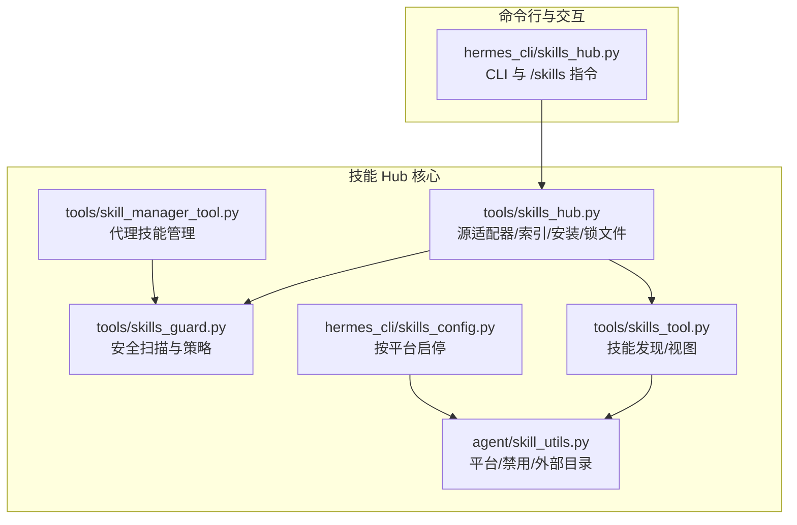
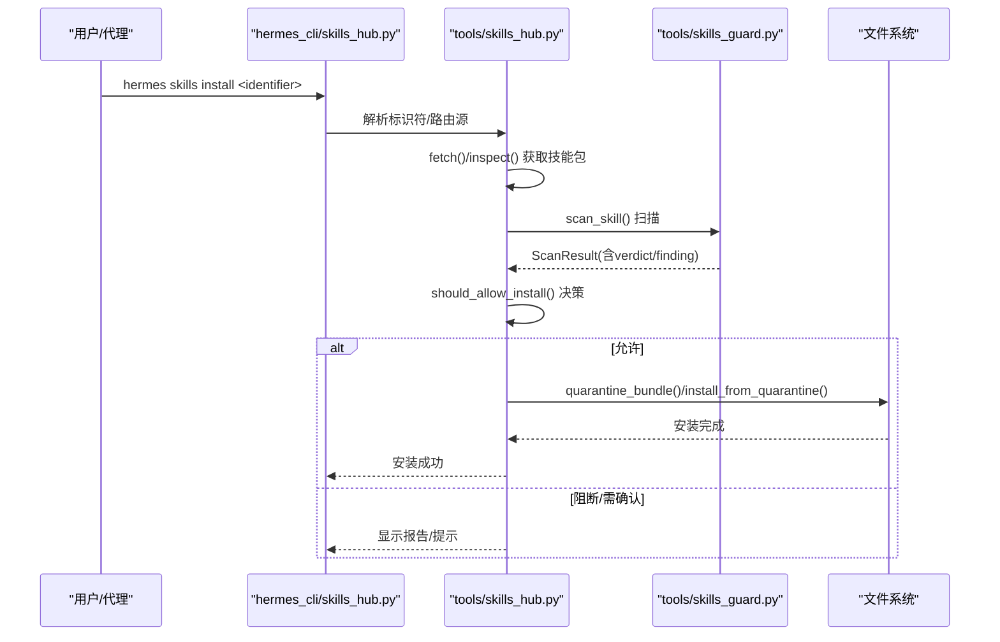
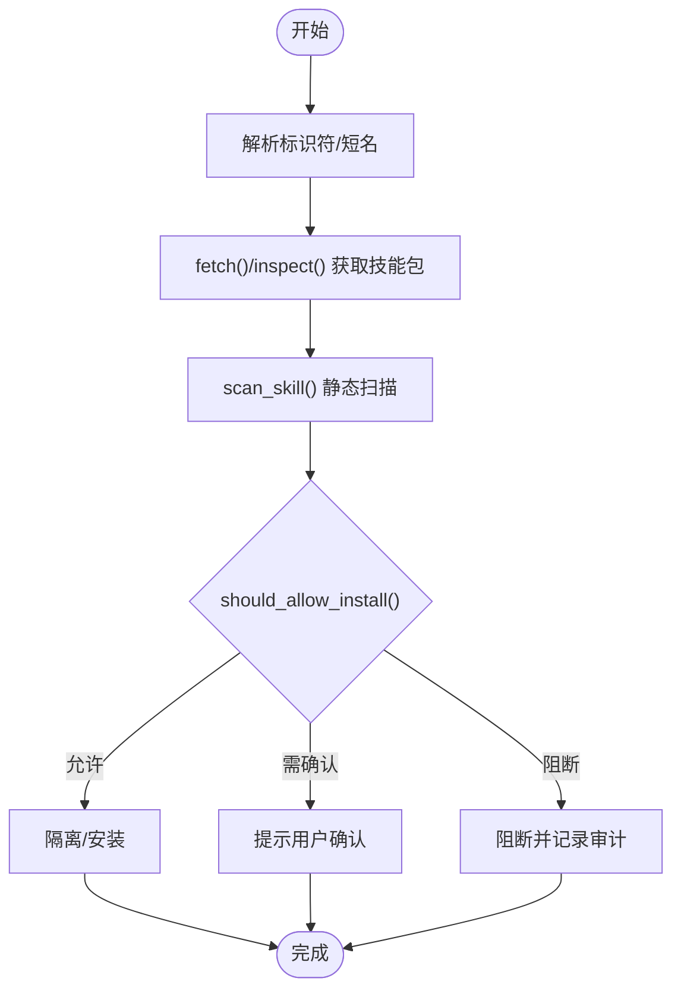
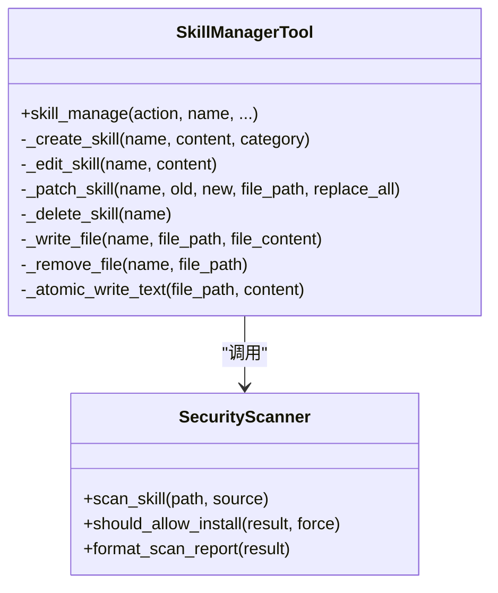
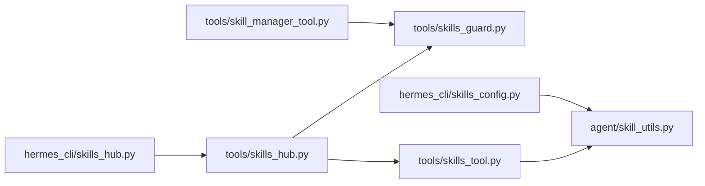

# 技能系统

<cite>
**本文档引用的文件**
- [hermes_cli/skills_hub.py](file://hermes_cli/skills_hub.py)
- [tools/skills_hub.py](file://tools/skills_hub.py)
- [tools/skills_guard.py](file://tools/skills_guard.py)
- [tools/skill_manager_tool.py](file://tools/skill_manager_tool.py)
- [tools/skills_tool.py](file://tools/skills_tool.py)
- [agent/skill_utils.py](file://agent/skill_utils.py)
- [hermes_cli/skills_config.py](file://hermes_cli/skills_config.py)
- [optional-skills/DESCRIPTION.md](file://optional-skills/DESCRIPTION.md)
- [skills/domain/DESCRIPTION.md](file://skills/domain/DESCRIPTION.md)
</cite>

## 目录
1. [简介](#简介)
2. [项目结构](#项目结构)
3. [核心组件](#核心组件)
4. [架构总览](#架构总览)
5. [详细组件分析](#详细组件分析)
6. [依赖关系分析](#依赖关系分析)
7. [性能考虑](#性能考虑)
8. [故障排查指南](#故障排查指南)
9. [结论](#结论)
10. [附录](#附录)

## 简介
本文件系统性阐述 Hermes Agent 的技能（Skill）体系：从概念定义、生命周期与学习机制，到技能创建、管理、分发与改进；覆盖技能 Hub 的功能、搜索与共享机制；提供技能开发的完整指南（模板、API 使用与最佳实践）；解释技能与工具的关系、执行环境与性能优化；并给出调试、测试与发布流程及专业开发工具与参考资料。

## 项目结构
技能系统由以下关键模块构成：
- 命令行与交互入口：hermes_cli/skills_hub.py 提供 CLI 与聊天中的 /skills 指令支持
- 技能 Hub 核心：tools/skills_hub.py 提供源适配器、索引缓存、安装流程与锁文件管理
- 安全扫描：tools/skills_guard.py 提供威胁模式检测与安装策略
- 技能管理工具：tools/skill_manager_tool.py 支持代理创建/编辑/删除技能
- 技能发现与视图：tools/skills_tool.py 提供技能列表与内容查看
- 技能元数据与配置：agent/skill_utils.py 提供平台匹配、禁用列表、外部目录等
- 技能配置：hermes_cli/skills_config.py 提供按平台启用/禁用技能
- 示例与官方技能：optional-skills/DESCRIPTION.md 与 skills/*/DESCRIPTION.md 展示技能规范

图表来源
- [hermes_cli/skills_hub.py:1-1239](file://hermes_cli/skills_hub.py#L1-L1239)
- [tools/skills_hub.py:1-3054](file://tools/skills_hub.py#L1-L3054)
- [tools/skills_guard.py:1-978](file://tools/skills_guard.py#L1-L978)
- [tools/skill_manager_tool.py:1-762](file://tools/skill_manager_tool.py#L1-L762)
- [tools/skills_tool.py:1-1359](file://tools/skills_tool.py#L1-L1359)
- [agent/skill_utils.py:1-444](file://agent/skill_utils.py#L1-L444)
- [hermes_cli/skills_config.py:1-178](file://hermes_cli/skills_config.py#L1-L178)

章节来源
- [hermes_cli/skills_hub.py:1-1239](file://hermes_cli/skills_hub.py#L1-L1239)
- [tools/skills_hub.py:1-3054](file://tools/skills_hub.py#L1-L3054)
- [tools/skills_guard.py:1-978](file://tools/skills_guard.py#L1-L978)
- [tools/skill_manager_tool.py:1-762](file://tools/skill_manager_tool.py#L1-L762)
- [tools/skills_tool.py:1-1359](file://tools/skills_tool.py#L1-L1359)
- [agent/skill_utils.py:1-444](file://agent/skill_utils.py#L1-L444)
- [hermes_cli/skills_config.py:1-178](file://hermes_cli/skills_config.py#L1-L178)

## 核心组件
- 技能 Hub 适配器与状态
  - GitHubAuth：统一认证（PAT/GitHub CLI/App），支持速率限制处理
  - SkillSource 抽象与实现：GitHubSource、WellKnownSkillSource 等
  - HubLockFile：记录已安装技能的来源、信任级别与路径
  - 索引缓存与抓取：加速搜索与浏览
- 安全扫描与安装策略
  - 威胁模式库：覆盖 exfiltration、injection、destructive、persistence、network、obfuscation 等类别
  - 安装策略：基于信任级别与扫描结果决定允许/阻断/需确认
- 技能管理工具
  - 代理可创建/编辑/补丁/删除用户技能，写入文件/移除文件，内置安全扫描
- 技能发现与视图
  - 列表：最小化元数据（名称/描述/分类）
  - 视图：按需加载完整内容与关联文件
- 平台与配置
  - 平台匹配、禁用列表、外部技能目录、配置变量声明与解析

章节来源
- [tools/skills_hub.py:1-3054](file://tools/skills_hub.py#L1-L3054)
- [tools/skills_guard.py:1-978](file://tools/skills_guard.py#L1-L978)
- [tools/skill_manager_tool.py:1-762](file://tools/skill_manager_tool.py#L1-L762)
- [tools/skills_tool.py:1-1359](file://tools/skills_tool.py#L1-L1359)
- [agent/skill_utils.py:1-444](file://agent/skill_utils.py#L1-L444)
- [hermes_cli/skills_config.py:1-178](file://hermes_cli/skills_config.py#L1-L178)

## 架构总览
技能系统采用“集中式 Hub + 分布式源”的架构：
- Hub 负责安装流程、安全扫描、状态管理与缓存
- 多源适配器统一抽象，支持 GitHub、Well-Known Endpoint 等
- 代理可通过工具接口直接创建/编辑技能，亦可经 Hub 安装第三方技能
- 技能内容以 SKILL.md 为核心，辅以 references/templates/scripts/assets 子目录

图表来源
- [hermes_cli/skills_hub.py:310-466](file://hermes_cli/skills_hub.py#L310-L466)
- [tools/skills_hub.py:350-376](file://tools/skills_hub.py#L350-L376)
- [tools/skills_guard.py:595-677](file://tools/skills_guard.py#L595-L677)

## 详细组件分析

### 技能 Hub 与安装流程
- 标识符解析：短名自动解析为完整标识符，避免歧义
- 源路由：GitHub、Well-Known Endpoint 等多源并行搜索与去重
- 安全扫描：下载后进入隔离区，执行静态扫描与策略判断
- 安装决策：根据信任级别与扫描结果决定是否允许安装
- 缓存与审计：索引缓存、审计日志、锁文件记录安装来源与路径

图表来源
- [hermes_cli/skills_hub.py:310-466](file://hermes_cli/skills_hub.py#L310-L466)
- [tools/skills_guard.py:642-677](file://tools/skills_guard.py#L642-L677)

章节来源
- [hermes_cli/skills_hub.py:144-466](file://hermes_cli/skills_hub.py#L144-L466)
- [tools/skills_hub.py:284-701](file://tools/skills_hub.py#L284-L701)
- [tools/skills_guard.py:595-713](file://tools/skills_guard.py#L595-L713)

### 技能搜索与浏览
- 搜索：支持多源联合搜索，按信任度去重，返回精简元数据
- 浏览：分页展示，优先显示官方技能，支持源过滤与超时控制
- 预览：inspect 可预览 SKILL.md 内容与上游元数据

章节来源
- [hermes_cli/skills_hub.py:144-308](file://hermes_cli/skills_hub.py#L144-L308)

### 技能管理（代理侧）
- 功能：创建、编辑、补丁、删除、写文件、删文件
- 安全：写入后进行安全扫描，必要时回滚
- 原子写入：临时文件 + 原子替换，避免中断导致损坏
- 前端验证：名称/分类/前言/大小限制等

图表来源
- [tools/skill_manager_tool.py:588-762](file://tools/skill_manager_tool.py#L588-L762)
- [tools/skills_guard.py:595-713](file://tools/skills_guard.py#L595-L713)

章节来源
- [tools/skill_manager_tool.py:1-762](file://tools/skill_manager_tool.py#L1-L762)
- [tools/skills_guard.py:1-978](file://tools/skills_guard.py#L1-L978)

### 技能发现与视图
- 发现：遍历本地与外部技能目录，排除 .git/.github/.hub，按平台兼容性过滤
- 列表：仅返回名称/描述/分类，降低 token 开销
- 视图：按需加载完整内容、标签、关联文件

章节来源
- [tools/skills_tool.py:512-800](file://tools/skills_tool.py#L512-L800)
- [agent/skill_utils.py:227-444](file://agent/skill_utils.py#L227-L444)

### 技能配置与平台控制
- 禁用列表：全局或按平台（如 telegram/cli）禁用特定技能
- 外部目录：通过配置扩展技能查找路径
- 平台匹配：根据 frontmatter 的 platforms 字段在不同 OS 上启用/禁用

章节来源
- [hermes_cli/skills_config.py:1-178](file://hermes_cli/skills_config.py#L1-L178)
- [agent/skill_utils.py:121-169](file://agent/skill_utils.py#L121-L169)

### 官方技能与示例
- optional-skills/DESCRIPTION.md：官方可选技能说明与安装方式
- skills/*/DESCRIPTION.md：示例技能的 frontmatter 与能力描述

章节来源
- [optional-skills/DESCRIPTION.md:1-25](file://optional-skills/DESCRIPTION.md#L1-L25)
- [skills/domain/DESCRIPTION.md:1-25](file://skills/domain/DESCRIPTION.md#L1-L25)

## 依赖关系分析
- 组件耦合
  - hermes_cli/skills_hub.py 依赖 tools/skills_hub.py 与 tools/skills_guard.py
  - tools/skills_tool.py 依赖 agent/skill_utils.py 进行平台与禁用逻辑
  - tools/skill_manager_tool.py 依赖 tools/skills_guard.py 进行安全扫描
- 外部依赖
  - GitHub API 认证与速率限制
  - httpx、yaml、re、pathlib 等标准库
- 循环依赖规避
  - CLI 与 Hub 通过延迟导入避免循环

图表来源
- [hermes_cli/skills_hub.py:1-1239](file://hermes_cli/skills_hub.py#L1-L1239)
- [tools/skills_hub.py:1-3054](file://tools/skills_hub.py#L1-L3054)
- [tools/skills_guard.py:1-978](file://tools/skills_guard.py#L1-L978)
- [tools/skills_tool.py:1-1359](file://tools/skills_tool.py#L1-L1359)
- [agent/skill_utils.py:1-444](file://agent/skill_utils.py#L1-L444)
- [hermes_cli/skills_config.py:1-178](file://hermes_cli/skills_config.py#L1-L178)
- [tools/skill_manager_tool.py:1-762](file://tools/skill_manager_tool.py#L1-L762)

## 性能考虑
- 索引缓存：GitHub 源使用缓存减少重复请求，提升浏览与搜索性能
- 并行搜索：多源并行查询，设置总体超时上限，避免长时间等待
- 渐进披露：列表仅返回最小元数据，视图按需加载，降低 token 与带宽消耗
- 结构检查：扫描前先做结构检查（文件数、大小、二进制文件、符号链接），快速剔除异常包
- 原子写入：减少磁盘损坏风险，避免部分写入导致的后续扫描失败

章节来源
- [tools/skills_hub.py:456-507](file://tools/skills_hub.py#L456-L507)
- [tools/skills_guard.py:734-800](file://tools/skills_guard.py#L734-L800)
- [tools/skill_manager_tool.py:256-286](file://tools/skill_manager_tool.py#L256-L286)

## 故障排查指南
- GitHub 速率限制
  - 现象：无法获取技能、提示 403 且剩余配额为 0
  - 处理：配置 GITHUB_TOKEN 或安装 gh CLI，或使用 GitHub App
- 安装被阻断
  - 现象：扫描结果为 dangerous 或社区源出现 caution
  - 处理：查看扫描报告，必要时使用 --force 强制安装（不推荐）
- 安全扫描告警
  - 现象：代理创建/编辑技能被阻断
  - 处理：修正内容中的敏感模式，重新扫描
- 平台不兼容
  - 现象：技能未出现在列表中
  - 处理：检查 frontmatter 中的 platforms 字段与当前 OS 是否匹配
- 外部目录无效
  - 现象：技能未被发现
  - 处理：检查配置中 skills.external_dirs 的路径是否存在且可访问

章节来源
- [tools/skills_hub.py:508-518](file://tools/skills_hub.py#L508-L518)
- [tools/skills_guard.py:642-677](file://tools/skills_guard.py#L642-L677)
- [agent/skill_utils.py:92-116](file://agent/skill_utils.py#L92-L116)
- [hermes_cli/skills_config.py:27-47](file://hermes_cli/skills_config.py#L27-L47)

## 结论
Hermes Agent 的技能系统通过 Hub + 多源适配器实现了标准化的技能分发与安装流程，并以严格的安全扫描与安装策略保障安全性。代理既可直接管理用户技能，也可通过 Hub 安装第三方技能。配合平台匹配、禁用列表与外部目录，系统具备良好的可扩展性与可控性。建议在开发与发布技能时遵循 SKILL.md 规范、前置安全扫描与最小化 token 消耗的设计原则。

## 附录

### 技能开发指南（模板与最佳实践）
- 文件结构
  - 必须包含 SKILL.md（YAML frontmatter + 主体内容）
  - 可选子目录：references/、templates/、scripts/、assets/
- frontmatter 字段
  - name、description、version、license、platforms、metadata.hermes.tags 等
  - 建议声明 platforms 以避免在不兼容平台加载
- 最佳实践
  - 将复杂流程拆分为步骤明确的指令，包含触发条件、注意事项与校验步骤
  - 使用 references/templates 提供辅助材料，保持 SKILL.md 精炼
  - 避免硬编码凭据，使用配置变量与环境注入
  - 在代理侧使用 skill_manage 工具进行增量更新与补丁修复

章节来源
- [tools/skills_tool.py:28-67](file://tools/skills_tool.py#L28-L67)
- [skills/domain/DESCRIPTION.md:1-25](file://skills/domain/DESCRIPTION.md#L1-L25)

### 技能与工具的关系
- 技能是代理的“程序化记忆”，封装可复用的任务方法
- 工具是执行层面的能力集合，技能可调用工具完成具体动作
- 技能可声明所需工具集与配置变量，系统在运行期解析并注入

章节来源
- [agent/skill_utils.py:241-256](file://agent/skill_utils.py#L241-L256)
- [agent/skill_utils.py:261-317](file://agent/skill_utils.py#L261-L317)

### 执行环境与性能优化
- 平台匹配：根据 frontmatter.platforms 与 sys.platform 前缀映射决定是否加载
- 外部目录：通过配置扩展技能查找范围，避免重复扫描
- 渐进披露：列表仅返回名称/描述，视图按需加载，减少 token 与网络开销
- 原子写入：写文件时使用原子替换，避免部分写入导致的后续问题

章节来源
- [agent/skill_utils.py:92-116](file://agent/skill_utils.py#L92-L116)
- [agent/skill_utils.py:174-235](file://agent/skill_utils.py#L174-L235)
- [tools/skill_manager_tool.py:256-286](file://tools/skill_manager_tool.py#L256-L286)

### 调试、测试与发布流程
- 调试
  - 使用 hermes skills audit 对已安装技能重新扫描
  - 使用 hermes skills inspect 预览技能信息与上游元数据
- 测试
  - 在本地 CLI 中创建/编辑技能，利用安全扫描反馈迭代
  - 使用 hermes skills snapshot 导出/导入技能配置，便于迁移与备份
- 发布
  - 通过 hermes skills publish 将本地技能提交至 GitHub（创建 PR）
  - 官方可选技能通过 Hub 安装到 ~/.hermes/skills/

章节来源
- [hermes_cli/skills_hub.py:619-797](file://hermes_cli/skills_hub.py#L619-L797)
- [hermes_cli/skills_hub.py:896-981](file://hermes_cli/skills_hub.py#L896-L981)
- [optional-skills/DESCRIPTION.md:1-25](file://optional-skills/DESCRIPTION.md#L1-L25)