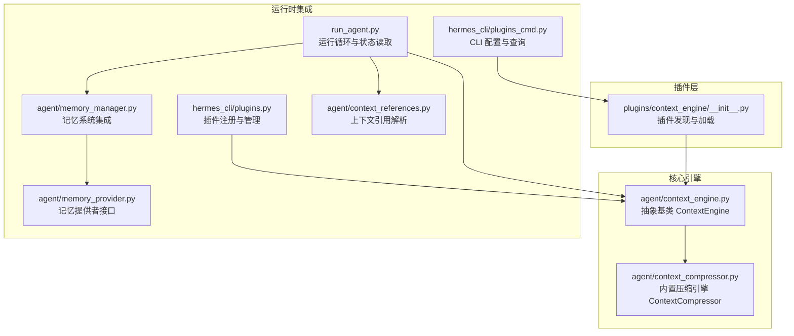
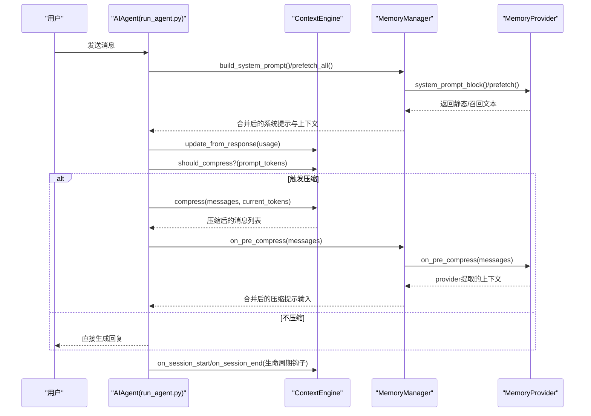
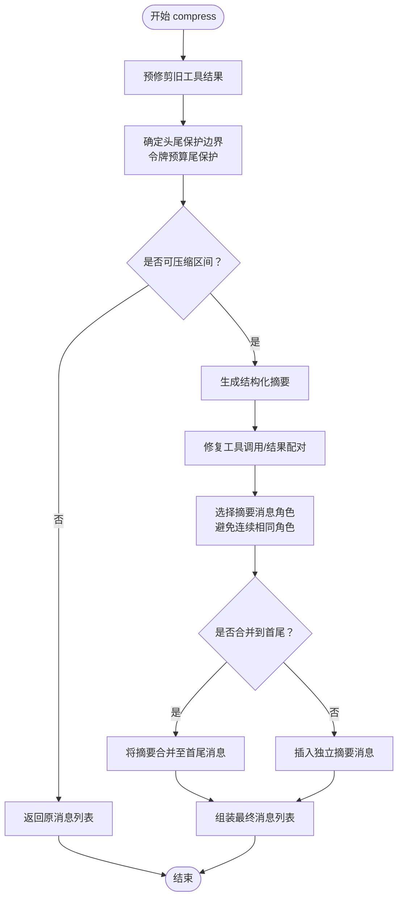
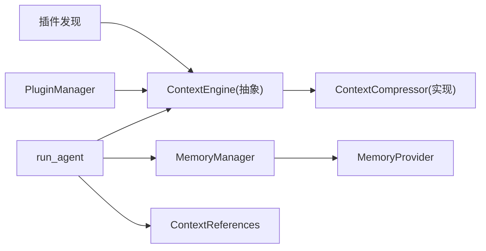

# 上下文引擎插件

<cite>
**本文档引用的文件**
- [plugins/context_engine/__init__.py](file://plugins/context_engine/__init__.py)
- [agent/context_engine.py](file://agent/context_engine.py)
- [agent/context_compressor.py](file://agent/context_compressor.py)
- [agent/memory_manager.py](file://agent/memory_manager.py)
- [agent/memory_provider.py](file://agent/memory_provider.py)
- [agent/context_references.py](file://agent/context_references.py)
- [hermes_cli/plugins.py](file://hermes_cli/plugins.py)
- [hermes_cli/plugins_cmd.py](file://hermes_cli/plugins_cmd.py)
- [tests/agent/test_context_engine.py](file://tests/agent/test_context_engine.py)
- [tests/agent/test_context_compressor.py](file://tests/agent/test_context_compressor.py)
- [run_agent.py](file://run_agent.py)
</cite>

## 目录
1. [简介](#简介)
2. [项目结构](#项目结构)
3. [核心组件](#核心组件)
4. [架构总览](#架构总览)
5. [详细组件分析](#详细组件分析)
6. [依赖分析](#依赖分析)
7. [性能考虑](#性能考虑)
8. [故障排除指南](#故障排除指南)
9. [结论](#结论)
10. [附录](#附录)

## 简介
本文件面向开发者，系统化阐述Hermes Agent中“上下文引擎插件”的设计与实现，包括其在长对话场景下的关键作用、接口定义、数据处理流程、算法实现、压缩与检索机制、与核心代理系统的交互方式、开发规范、API参考、集成指南、性能优化与内存管理、并发处理策略，以及测试与调试方法。上下文引擎负责在接近模型上下文窗口上限时进行压缩、检索与管理，确保对话连贯性与稳定性。

## 项目结构
上下文引擎插件位于独立目录，与通用插件系统解耦，内置默认实现（ContextCompressor），并通过统一的插件发现与加载机制接入运行时。

图示来源
- [plugins/context_engine/__init__.py:1-220](file://plugins/context_engine/__init__.py#L1-L220)
- [agent/context_engine.py:1-185](file://agent/context_engine.py#L1-L185)
- [agent/context_compressor.py:1-821](file://agent/context_compressor.py#L1-L821)
- [hermes_cli/plugins.py:210-246](file://hermes_cli/plugins.py#L210-L246)
- [hermes_cli/plugins_cmd.py:610-786](file://hermes_cli/plugins_cmd.py#L610-L786)
- [run_agent.py:1-200](file://run_agent.py#L1-L200)
- [agent/memory_manager.py:1-363](file://agent/memory_manager.py#L1-L363)
- [agent/memory_provider.py:1-232](file://agent/memory_provider.py#L1-L232)
- [agent/context_references.py:1-521](file://agent/context_references.py#L1-L521)

章节来源
- [plugins/context_engine/__init__.py:1-220](file://plugins/context_engine/__init__.py#L1-L220)
- [agent/context_engine.py:1-185](file://agent/context_engine.py#L1-L185)
- [agent/context_compressor.py:1-821](file://agent/context_compressor.py#L1-L821)
- [hermes_cli/plugins.py:210-246](file://hermes_cli/plugins.py#L210-L246)
- [hermes_cli/plugins_cmd.py:610-786](file://hermes_cli/plugins_cmd.py#L610-L786)
- [run_agent.py:1-200](file://run_agent.py#L1-L200)
- [agent/memory_manager.py:1-363](file://agent/memory_manager.py#L1-L363)
- [agent/memory_provider.py:1-232](file://agent/memory_provider.py#L1-L232)
- [agent/context_references.py:1-521](file://agent/context_references.py#L1-L521)

## 核心组件
- 抽象基类 ContextEngine：定义上下文引擎的生命周期、状态字段、压缩触发条件、压缩入口、可选工具与状态展示等接口契约。
- 内置实现 ContextCompressor：基于有损摘要的自动压缩器，保护头尾消息，对中间内容进行结构化摘要，支持迭代更新与工具调用完整性修复。
- 插件发现与加载：扫描 plugins/context_engine/<name>/ 目录，读取 plugin.yaml 元数据，执行轻量可用性检查，按需导入模块并实例化引擎。
- 插件注册与管理：通过 PluginManager 的 register_context_engine 限制同时仅一个上下文引擎生效；CLI 提供查询与切换能力。
- 运行时集成：run_agent 在每轮对话前后读取引擎状态、决定是否压缩、调用压缩入口，并与记忆系统协作注入上下文。

章节来源
- [agent/context_engine.py:32-185](file://agent/context_engine.py#L32-L185)
- [agent/context_compressor.py:60-821](file://agent/context_compressor.py#L60-L821)
- [plugins/context_engine/__init__.py:33-97](file://plugins/context_engine/__init__.py#L33-L97)
- [hermes_cli/plugins.py:217-245](file://hermes_cli/plugins.py#L217-L245)
- [hermes_cli/plugins_cmd.py:610-786](file://hermes_cli/plugins_cmd.py#L610-L786)
- [run_agent.py:1-200](file://run_agent.py#L1-L200)

## 架构总览
上下文引擎作为“可插拔”的策略组件，贯穿会话生命周期：初始化后在每次响应后更新令牌使用，在每轮结束后评估是否需要压缩；压缩时遵循保护策略，生成摘要并修复工具调用配对，最终输出新的消息序列。

图示来源
- [run_agent.py:1-200](file://run_agent.py#L1-L200)
- [agent/context_engine.py:103-126](file://agent/context_engine.py#L103-L126)
- [agent/context_compressor.py:666-821](file://agent/context_compressor.py#L666-L821)
- [agent/memory_manager.py:146-302](file://agent/memory_manager.py#L146-L302)
- [agent/memory_provider.py:163-173](file://agent/memory_provider.py#L163-L173)

## 详细组件分析

### 抽象基类 ContextEngine
- 身份与状态
  - name：短标识符，如 "compressor" 或第三方引擎名
  - 状态字段：last_prompt_tokens、last_completion_tokens、last_total_tokens、threshold_tokens、context_length、compression_count
  - 预检参数：threshold_percent（阈值百分比）、protect_first_n（保护前N条）、protect_last_n（保护尾部N条）
- 核心接口
  - update_from_response(usage)：从API响应更新令牌使用
  - should_compress(prompt_tokens)：判断本轮是否应触发压缩
  - compress(messages, current_tokens)：主压缩入口，返回压缩后的消息列表
- 可选接口
  - should_compress_preflight(messages)：预检（默认返回False）
  - on_session_start/on_session_end/on_session_reset：会话生命周期钩子
  - get_tool_schemas/handle_tool_call：向代理暴露工具
  - get_status：状态展示
  - update_model(model, context_length, ...)：模型切换时更新阈值与预算

章节来源
- [agent/context_engine.py:32-185](file://agent/context_engine.py#L32-L185)

### 内置引擎 ContextCompressor
- 初始化与模型更新
  - 依据模型上下文长度与阈值百分比计算阈值与摘要预算
  - 支持最小阈值保护（避免小模型过早压缩）
- 压缩流程
  - 预修剪旧工具结果（低成本，避免LLM调用）
  - 保护头尾消息（头：系统提示+首次问答；尾：基于令牌预算的最近内容）
  - 结构化摘要（模板化结构，包含目标、进度、决策、已解决/待解决问题、文件、剩余工作、关键上下文、工具模式等）
  - 工具调用完整性修复（补全或移除孤儿调用/结果）
  - 摘要角色选择与合并策略（避免连续相同角色消息）
- 关键算法要点
  - 令牌预算尾保护：以“目标摘要比例 × 阈值”确定尾部令牌预算，软上限1.5倍，硬最少3条消息
  - 摘要预算：按被压缩内容粗略估算，上限5%模型上下文且不超过上限
  - 失败冷却：摘要生成失败进入冷却期，期间跳过摘要
  - 迭代更新：已有摘要存在时，增量更新而非重新生成
- 边界与健壮性
  - 对 None/非字符串内容进行安全处理
  - 对工具调用/结果成对进行一致性修复
  - 对超大消息采用软上限策略避免强制拆分

图示来源
- [agent/context_compressor.py:666-821](file://agent/context_compressor.py#L666-L821)
- [agent/context_compressor.py:186-242](file://agent/context_compressor.py#L186-L242)
- [agent/context_compressor.py:604-661](file://agent/context_compressor.py#L604-L661)
- [agent/context_compressor.py:318-484](file://agent/context_compressor.py#L318-L484)
- [agent/context_compressor.py:506-565](file://agent/context_compressor.py#L506-L565)

章节来源
- [agent/context_compressor.py:60-821](file://agent/context_compressor.py#L60-L821)

### 插件发现与加载（plugins/context_engine）
- discover_context_engines：扫描目录，读取 plugin.yaml 获取描述，执行轻量可用性检查
- load_context_engine：按名称加载指定引擎模块，支持 register(ctx) 与直接类实例化两种模式
- _load_engine_from_dir：动态导入，处理相对导入与子模块注册，捕获异常并记录日志

章节来源
- [plugins/context_engine/__init__.py:33-97](file://plugins/context_engine/__init__.py#L33-L97)

### 插件注册与CLI配置（hermes_cli）
- register_context_engine：限制仅一个上下文引擎生效，校验类型并记录日志
- CLI 查询与配置：列出可用引擎、当前激活引擎、保存新引擎设置

章节来源
- [hermes_cli/plugins.py:217-245](file://hermes_cli/plugins.py#L217-L245)
- [hermes_cli/plugins_cmd.py:610-786](file://hermes_cli/plugins_cmd.py#L610-L786)

### 运行时集成与状态读取（run_agent）
- run_agent 在每轮对话中读取引擎状态字段用于显示/日志
- 生命周期钩子：on_session_start/on_session_end 由引擎实现，run_agent 调用
- 与记忆系统协作：在压缩前通过 MemoryManager 的 on_pre_compress 注入外部提供者的洞察

章节来源
- [run_agent.py:1-200](file://run_agent.py#L1-L200)
- [agent/context_engine.py:103-126](file://agent/context_engine.py#L103-L126)
- [agent/memory_manager.py:285-302](file://agent/memory_manager.py#L285-L302)

### 记忆系统与上下文引用（可选）
- MemoryManager/MemoryProvider：提供系统提示块、预取/同步、工具schema路由、委托观察等
- ContextReferences：解析消息中的上下文引用（文件/文件夹/git/url等），进行令牌估算与注入控制

章节来源
- [agent/memory_manager.py:1-363](file://agent/memory_manager.py#L1-L363)
- [agent/memory_provider.py:1-232](file://agent/memory_provider.py#L1-L232)
- [agent/context_references.py:1-521](file://agent/context_references.py#L1-L521)

## 依赖分析
- 组件内聚与耦合
  - ContextEngine 与 ContextCompressor：强内聚，后者实现前者契约
  - 插件发现与加载：与运行时解耦，通过统一接口接入
  - 运行时：run_agent 仅依赖 ContextEngine 接口，不关心具体实现
- 外部依赖
  - OpenAI 客户端（辅助摘要模型调用）
  - 环境变量与配置（模型元数据、上下文长度、阈值等）
  - 可选：Git、ripgrep、网络抓取工具（上下文引用扩展）

图示来源
- [agent/context_engine.py:32-185](file://agent/context_engine.py#L32-L185)
- [agent/context_compressor.py:60-821](file://agent/context_compressor.py#L60-L821)
- [plugins/context_engine/__init__.py:33-97](file://plugins/context_engine/__init__.py#L33-L97)
- [hermes_cli/plugins.py:217-245](file://hermes_cli/plugins.py#L217-L245)
- [run_agent.py:1-200](file://run_agent.py#L1-L200)
- [agent/memory_manager.py:1-363](file://agent/memory_manager.py#L1-L363)
- [agent/context_references.py:1-521](file://agent/context_references.py#L1-L521)

## 性能考虑
- 压缩前预修剪工具结果，降低后续摘要成本
- 令牌预算尾保护替代固定消息数，避免大工具输出阻塞压缩
- 摘要预算按内容规模缩放，大模型获得更丰富摘要
- 摘要生成失败冷却，减少无效重试
- 角色选择与合并策略避免重复消息导致的令牌浪费
- 工具调用/结果配对修复减少API错误重试

章节来源
- [agent/context_compressor.py:186-242](file://agent/context_compressor.py#L186-L242)
- [agent/context_compressor.py:604-661](file://agent/context_compressor.py#L604-L661)
- [agent/context_compressor.py:318-484](file://agent/context_compressor.py#L318-L484)
- [agent/context_compressor.py:506-565](file://agent/context_compressor.py#L506-L565)

## 故障排除指南
- 引擎未生效
  - 检查插件发现与加载日志，确认引擎目录与 __init__.py 正确
  - 确认 register_context_engine 仅注册一次
- 压缩未触发
  - 检查 last_prompt_tokens 与 threshold_tokens 是否正确更新
  - 确认 should_compress 的阈值百分比与保护区间设置合理
- 摘要失败
  - 查看摘要失败冷却时间
  - 检查摘要模型可用性与请求参数
- 工具调用不一致
  - 检查工具调用/结果配对修复逻辑是否正常
- CLI 配置问题
  - 使用 hermes 插件命令查看/切换上下文引擎

章节来源
- [plugins/context_engine/__init__.py:33-97](file://plugins/context_engine/__init__.py#L33-L97)
- [hermes_cli/plugins.py:217-245](file://hermes_cli/plugins.py#L217-L245)
- [hermes_cli/plugins_cmd.py:610-786](file://hermes_cli/plugins_cmd.py#L610-L786)
- [tests/agent/test_context_engine.py:197-251](file://tests/agent/test_context_engine.py#L197-L251)
- [tests/agent/test_context_compressor.py:226-244](file://tests/agent/test_context_compressor.py#L226-L244)

## 结论
上下文引擎插件通过抽象基类与内置压缩实现，提供了可替换、可扩展的长上下文管理方案。其与运行时、记忆系统、CLI 配置紧密协作，既保证了稳定性，又为第三方引擎提供了清晰的接入路径。开发者可在不改变核心流程的前提下，实现自定义压缩策略、检索增强与工具扩展。

## 附录

### 开发规范与最佳实践
- 实现 ContextEngine 抽象类的所有必需方法，谨慎覆盖可选方法
- 合理设置 threshold_percent、protect_first_n、protect_last_n，平衡压缩效果与上下文保留
- 在 compress 中保持消息格式兼容（OpenAI格式），确保工具调用/结果配对完整
- 提供稳定的 get_status 输出，便于运行时监控
- 在 handle_tool_call 中返回标准JSON字符串，避免抛出未捕获异常

章节来源
- [agent/context_engine.py:65-148](file://agent/context_engine.py#L65-L148)

### API参考（ContextEngine）
- 必需方法
  - update_from_response(usage)：更新令牌使用
  - should_compress(prompt_tokens=None)：是否触发压缩
  - compress(messages, current_tokens=None)：压缩入口
- 可选方法
  - should_compress_preflight(messages)：预检
  - on_session_start/session_end/session_reset：生命周期钩子
  - get_tool_schemas()/handle_tool_call()：工具暴露与处理
  - get_status()：状态展示
  - update_model(model, context_length, ...)：模型切换

章节来源
- [agent/context_engine.py:65-185](file://agent/context_engine.py#L65-L185)

### 集成指南
- 选择引擎
  - 默认：compressor（内置）
  - 第三方：放置于 plugins/context_engine/<name>/ 并在配置中设置 context.engine
- 运行时接入
  - run_agent 会读取引擎状态字段并调用生命周期钩子
  - 压缩前可通过 MemoryManager 的 on_pre_compress 注入外部洞察
- CLI 配置
  - hermes 插件命令可查询与切换上下文引擎

章节来源
- [plugins/context_engine/__init__.py:33-97](file://plugins/context_engine/__init__.py#L33-L97)
- [hermes_cli/plugins_cmd.py:610-786](file://hermes_cli/plugins_cmd.py#L610-L786)
- [run_agent.py:1-200](file://run_agent.py#L1-L200)
- [agent/memory_manager.py:285-302](file://agent/memory_manager.py#L285-L302)

### 测试方法与调试
- 单元测试
  - ContextEngine 抽象契约与默认行为验证
  - ContextCompressor 压缩阈值、摘要生成、工具配对修复、角色选择与合并策略
- 调试建议
  - 打开详细日志，关注压缩触发条件与摘要生成过程
  - 使用测试用例中的断言点定位问题（如摘要失败冷却、工具配对修复）

章节来源
- [tests/agent/test_context_engine.py:1-251](file://tests/agent/test_context_engine.py#L1-L251)
- [tests/agent/test_context_compressor.py:1-784](file://tests/agent/test_context_compressor.py#L1-L784)