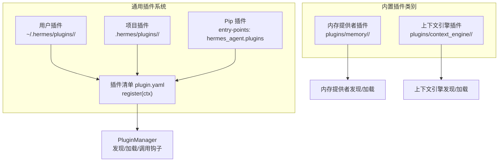
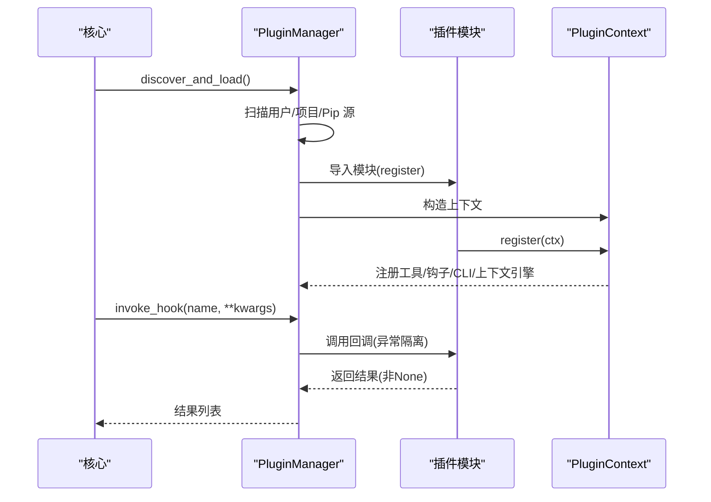
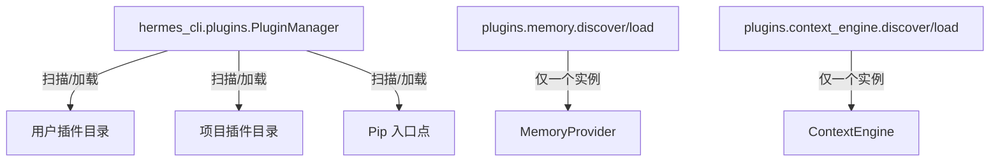

# 插件开发指南

<cite>
**本文档引用的文件**
- [plugins/__init__.py](file://plugins/__init__.py)
- [hermes_cli/plugins.py](file://hermes_cli/plugins.py)
- [hermes_cli/plugins_cmd.py](file://hermes_cli/plugins_cmd.py)
- [plugins/memory/__init__.py](file://plugins/memory/__init__.py)
- [plugins/context_engine/__init__.py](file://plugins/context_engine/__init__.py)
- [plugins/memory/honcho/plugin.yaml](file://plugins/memory/honcho/plugin.yaml)
- [plugins/memory/honcho/__init__.py](file://plugins/memory/honcho/__init__.py)
- [tests/plugins/test_retaindb_plugin.py](file://tests/plugins/test_retaindb_plugin.py)
- [pyproject.toml](file://pyproject.toml)
- [requirements.txt](file://requirements.txt)
- [acp_registry/agent.json](file://acp_registry/agent.json)
- [hermes_cli/main.py](file://hermes_cli/main.py)
</cite>

## 目录
1. [简介](#简介)
2. [项目结构](#项目结构)
3. [核心组件](#核心组件)
4. [架构总览](#架构总览)
5. [详细组件分析](#详细组件分析)
6. [依赖关系分析](#依赖关系分析)
7. [性能考量](#性能考量)
8. [故障排查指南](#故障排查指南)
9. [结论](#结论)
10. [附录](#附录)

## 简介
本指南面向希望在 Hermes Agent 中开发与发布的插件开发者，覆盖从项目初始化、目录结构、配置文件、元数据定义，到接口实现规范、生命周期钩子、工具注册、CLI 命令扩展、内存与上下文引擎插件系统、打包与分发、版本管理、测试框架与用例编写、调试与日志、性能监控、安全与权限管理等全流程。

## 项目结构
Hermes 的插件体系由“通用插件系统”和“内置插件类别（内存提供者、上下文引擎）”组成。通用插件通过目录或 pip 入口点加载；内存与上下文引擎作为独立的单选插件类别，按配置启用。

图示来源
- [hermes_cli/plugins.py:287-317](file://hermes_cli/plugins.py#L287-L317)
- [plugins/memory/__init__.py:32-75](file://plugins/memory/__init__.py#L32-L75)
- [plugins/context_engine/__init__.py:33-76](file://plugins/context_engine/__init__.py#L33-L76)

章节来源
- [hermes_cli/plugins.py:5-26](file://hermes_cli/plugins.py#L5-L26)
- [plugins/__init__.py:1-2](file://plugins/__init__.py#L1-L2)

## 核心组件
- 插件管理器：负责扫描、加载、注册工具、钩子、CLI 子命令以及上下文引擎替换。
- 插件上下文：向插件暴露注册 API（工具、消息注入、CLI、上下文引擎、钩子）。
- 内置插件类别：内存提供者与上下文引擎采用独立发现机制，仅允许启用一个实例。
- 插件清单：plugin.yaml 定义元数据、环境变量需求、提供的工具与钩子列表。

章节来源
- [hermes_cli/plugins.py:124-265](file://hermes_cli/plugins.py#L124-L265)
- [hermes_cli/plugins.py:271-447](file://hermes_cli/plugins.py#L271-L447)
- [plugins/memory/__init__.py:78-96](file://plugins/memory/__init__.py#L78-L96)
- [plugins/context_engine/__init__.py:79-97](file://plugins/context_engine/__init__.py#L79-L97)

## 架构总览
通用插件生命周期与调用序列如下：

图示来源
- [hermes_cli/plugins.py:287-317](file://hermes_cli/plugins.py#L287-L317)
- [hermes_cli/plugins.py:400-447](file://hermes_cli/plugins.py#L400-L447)
- [hermes_cli/plugins.py:500-534](file://hermes_cli/plugins.py#L500-L534)

## 详细组件分析

### 通用插件系统
- 发现与加载
  - 用户插件：~/.hermes/plugins/<name>/，要求存在 plugin.yaml 与 __init__.py，并提供 register(ctx)。
  - 项目插件：需设置环境变量以启用 ./hermes/plugins/<name>/。
  - Pip 插件：通过 importlib.metadata 的 hermes_agent.plugins 入口点组发现。
- 生命周期钩子
  - 支持 pre_tool_call/post_tool_call/pre_llm_call/post_llm_call/pre_api_request/post_api_request/on_session_start/on_session_end/on_session_finalize/on_session_reset。
  - 钩子回调在独立 try/except 中执行，避免单个插件导致核心循环崩溃。
- 工具注册
  - 通过 PluginContext.register_tool 将工具注册到全局工具注册表，并追踪插件提供的工具集合。
- CLI 命令注册
  - 通过 PluginContext.register_cli_command 注册子命令，支持 setup_fn 与可选 handler_fn。
- 上下文引擎替换
  - 通过 PluginContext.register_context_engine 注册自定义上下文引擎，仅允许一个实例生效。
- 消息注入
  - 通过 PluginContext.inject_message 向会话注入消息，支持中断当前回合或排队为下一条输入。

章节来源
- [hermes_cli/plugins.py:55-66](file://hermes_cli/plugins.py#L55-L66)
- [hermes_cli/plugins.py:124-265](file://hermes_cli/plugins.py#L124-L265)
- [hermes_cli/plugins.py:287-317](file://hermes_cli/plugins.py#L287-L317)
- [hermes_cli/plugins.py:500-534](file://hermes_cli/plugins.py#L500-L534)

### 插件清单与元数据
- 必备字段
  - name：插件名称
  - 可选字段：version、description、author、requires_env、provides_tools、provides_hooks、manifest_version
- 环境变量声明
  - requires_env 支持简单列表与富格式（name/description/url/secret），安装时会提示并保存到用户 .env。
- 示例
  - 内存提供者 Honcho 的 plugin.yaml 包含 name/version/description/pip_dependencies/hooks。

章节来源
- [hermes_cli/plugins_cmd.py:115-128](file://hermes_cli/plugins_cmd.py#L115-L128)
- [hermes_cli/plugins_cmd.py:151-224](file://hermes_cli/plugins_cmd.py#L151-L224)
- [plugins/memory/honcho/plugin.yaml:1-8](file://plugins/memory/honcho/plugin.yaml#L1-L8)

### 内置插件类别：内存提供者
- 发现机制
  - 扫描 plugins/memory/<name>/，读取 plugin.yaml 获取描述，调用 is_available 进行可用性检查。
- 加载方式
  - 支持两种模式：register(ctx) 或直接实例化类（继承 MemoryProvider）。
- CLI 集成
  - 仅对当前激活的内存提供者加载其 cli.py 中的 register_cli 与命令处理器。
- 配置与持久化
  - 通过 config.yaml 的 memory.provider 选择提供者；支持写入配置与读取当前值。

章节来源
- [plugins/memory/__init__.py:32-75](file://plugins/memory/__init__.py#L32-L75)
- [plugins/memory/__init__.py:78-96](file://plugins/memory/__init__.py#L78-L96)
- [plugins/memory/__init__.py:234-317](file://plugins/memory/__init__.py#L234-L317)

### 内置插件类别：上下文引擎
- 发现机制
  - 扫描 plugins/context_engine/<name>/，读取 plugin.yaml 获取描述，调用 is_available 或实例可用性。
- 加载方式
  - 支持 register(ctx) 或直接实例化类（继承 ContextEngine）。
- 配置与持久化
  - 通过 config.yaml 的 context.engine 选择引擎；支持读取/保存当前值。

章节来源
- [plugins/context_engine/__init__.py:33-76](file://plugins/context_engine/__init__.py#L33-L76)
- [plugins/context_engine/__init__.py:79-97](file://plugins/context_engine/__init__.py#L79-L97)

### 插件实现规范与最佳实践
- 目录结构
  - plugin.yaml 与 __init__.py 必须存在；__init__.py 提供 register(ctx)。
- register(ctx) 实现
  - 在其中调用 ctx.register_tool/ctx.register_hook/ctx.register_cli_command/ctx.register_context_engine。
- 工具规范
  - schema 符合工具注册表期望；handler 接收参数字典并返回 JSON 字符串结果。
- 钩子使用
  - 仅注册已知钩子；pre_llm_call 可返回注入上下文（字符串或包含 context 键的字典）。
- CLI 子命令
  - setup_fn 负责添加参数与子解析器；handler_fn 可选，用于默认分发。
- 上下文引擎
  - 仅允许一个上下文引擎被注册；确保类型正确并遵循 ContextEngine 接口。

章节来源
- [hermes_cli/plugins.py:124-265](file://hermes_cli/plugins.py#L124-L265)
- [hermes_cli/plugins.py:500-534](file://hermes_cli/plugins.py#L500-L534)

### 插件打包、分发与版本管理
- 打包
  - 使用 setuptools 构建；入口点组为 hermes_agent.plugins。
- 分发
  - 用户插件：hermes plugins install owner/repo，支持 Git URL 与简写；安装后复制 .example 文件并提示环境变量。
  - Pip 插件：通过 pip 安装，注册表项自动被发现。
- 版本管理
  - manifest_version 字段用于兼容性控制；安装器会校验支持的最大版本。
- 更新与移除
  - hermes plugins update/remove/list/enable/disable 提供完整生命周期管理。

章节来源
- [pyproject.toml:117-121](file://pyproject.toml#L117-L121)
- [hermes_cli/plugins_cmd.py:284-396](file://hermes_cli/plugins_cmd.py#L284-L396)
- [hermes_cli/plugins_cmd.py:399-468](file://hermes_cli/plugins_cmd.py#L399-L468)
- [hermes_cli/plugins_cmd.py:537-595](file://hermes_cli/plugins_cmd.py#L537-L595)

### 测试框架与用例编写
- 单元测试
  - 使用 pytest；示例：RetainDB 插件测试覆盖客户端、写队列、覆盖层格式化、生命周期与线程管理。
- 集成测试
  - 通过模拟环境变量与临时目录隔离 HERMES_HOME，确保插件行为可验证。
- 测试建议
  - 覆盖工具调用路径、错误处理、线程并发、SQLite 队列持久化与重放、钩子回调异常隔离。

章节来源
- [tests/plugins/test_retaindb_plugin.py:1-777](file://tests/plugins/test_retaindb_plugin.py#L1-L777)
- [pyproject.toml:123-129](file://pyproject.toml#L123-L129)

### 调试工具、日志记录与性能监控
- 日志
  - CLI 启动时初始化集中式文件日志；插件加载与钩子调用均记录警告与调试信息。
- 调试
  - hermes doctor 检查配置与依赖；hermes status 展示组件状态；交互式 TUI 命令需要终端。
- 性能
  - 插件钩子回调在独立 try/except 中执行，避免单点故障；内存/上下文引擎插件内部使用线程与队列进行异步处理与持久化。

章节来源
- [hermes_cli/main.py:146-153](file://hermes_cli/main.py#L146-L153)
- [hermes_cli/plugins.py:522-534](file://hermes_cli/plugins.py#L522-L534)
- [plugins/memory/honcho/__init__.py:573-657](file://plugins/memory/honcho/__init__.py#L573-L657)

### 安全考虑、权限管理与沙箱限制
- 权限与环境变量
  - requires_env 支持 secret 标记；安装时提示输入并保存至用户 .env；避免明文硬编码。
- 路径安全
  - 插件安装名进行路径穿越检测；非法名称将被拒绝。
- 网络与外部服务
  - 内置插件类别（内存/上下文引擎）通过各自 SDK 访问外部服务，插件自身不直接承担网络实现细节。
- ACP 集成
  - agent.json 定义了 ACP 服务器的分发方式，便于编辑器集成。

章节来源
- [hermes_cli/plugins_cmd.py:36-70](file://hermes_cli/plugins_cmd.py#L36-L70)
- [hermes_cli/plugins_cmd.py:151-224](file://hermes_cli/plugins_cmd.py#L151-L224)
- [acp_registry/agent.json:1-13](file://acp_registry/agent.json#L1-L13)

## 依赖关系分析

图示来源
- [hermes_cli/plugins.py:287-317](file://hermes_cli/plugins.py#L287-L317)
- [plugins/memory/__init__.py:32-75](file://plugins/memory/__init__.py#L32-L75)
- [plugins/context_engine/__init__.py:33-76](file://plugins/context_engine/__init__.py#L33-L76)

章节来源
- [hermes_cli/plugins.py:271-447](file://hermes_cli/plugins.py#L271-L447)
- [plugins/memory/__init__.py:78-96](file://plugins/memory/__init__.py#L78-L96)
- [plugins/context_engine/__init__.py:79-97](file://plugins/context_engine/__init__.py#L79-L97)

## 性能考量
- 钩子回调隔离：每个回调独立 try/except，避免单个插件拖慢主循环。
- 异步与线程：内存/上下文引擎插件内部使用线程与队列进行后台处理与持久化，减少主线程阻塞。
- 上下文注入策略：pre_llm_call 可注入上下文，但保持系统提示缓存前缀稳定，提升缓存命中率。
- 线程复用与守护：插件内部线程采用守护线程与连接复用策略，降低资源占用。

章节来源
- [hermes_cli/plugins.py:500-534](file://hermes_cli/plugins.py#L500-L534)
- [plugins/memory/honcho/__init__.py:573-657](file://plugins/memory/honcho/__init__.py#L573-L657)

## 故障排查指南
- 插件未加载
  - 检查 plugin.yaml 是否存在且可解析；确认 __init__.py 提供 register(ctx)。
  - 查看日志中关于“无 register() 函数”“加载失败”的警告。
- 钩子无效
  - 确认钩子名称是否在 VALID_HOOKS 列表内；未知钩子会被记录但不会报错。
- 环境变量缺失
  - 安装时会提示缺少的环境变量；可在用户 .env 中补全。
- 内存/上下文引擎冲突
  - 仅允许一个内存提供者或上下文引擎被启用；检查 config.yaml 对应字段。
- CLI 无法交互
  - 某些命令需要终端；确保在交互式终端中运行。

章节来源
- [hermes_cli/plugins.py:400-447](file://hermes_cli/plugins.py#L400-L447)
- [hermes_cli/plugins.py:500-534](file://hermes_cli/plugins.py#L500-L534)
- [hermes_cli/plugins_cmd.py:151-224](file://hermes_cli/plugins_cmd.py#L151-L224)

## 结论
Hermes 的插件体系提供了灵活而强大的扩展能力：通用插件通过统一的生命周期与注册接口接入工具、钩子与 CLI；内置的内存与上下文引擎采用单选机制保证一致性与可控性。配合完善的安装、更新、禁用/启用与清单校验流程，开发者可以快速构建、测试、分发与维护高质量插件。

## 附录

### 插件清单字段参考
- name：插件名称（必填）
- version：版本号（可选）
- description：描述（可选）
- author：作者（可选）
- requires_env：环境变量需求（可选）
- provides_tools：声明提供的工具名列表（可选）
- provides_hooks：声明提供的钩子名列表（可选）
- manifest_version：清单版本（可选）

章节来源
- [hermes_cli/plugins_cmd.py:115-128](file://hermes_cli/plugins_cmd.py#L115-L128)
- [plugins/memory/honcho/plugin.yaml:1-8](file://plugins/memory/honcho/plugin.yaml#L1-L8)

### 插件开发步骤清单
- 初始化目录与清单
  - 创建 ~/.hermes/plugins/<your-plugin>/，编写 plugin.yaml 与 __init__.py。
- 实现 register(ctx)
  - 在 __init__.py 中提供 register(ctx)，调用 ctx.register_tool/ctx.register_hook/ctx.register_cli_command/ctx.register_context_engine。
- 编写工具与钩子
  - 确保工具 schema 正确，钩子回调健壮并返回非 None 值。
- 安装与验证
  - 使用 hermes plugins install owner/repo 安装；查看日志与 hermes status。
- 测试与调试
  - 使用 pytest 编写单元与集成测试；利用 hermes doctor 与日志定位问题。
- 打包与分发
  - 通过 pip 发布；或指导用户使用 hermes plugins install 安装。

章节来源
- [hermes_cli/plugins_cmd.py:284-396](file://hermes_cli/plugins_cmd.py#L284-L396)
- [pyproject.toml:117-121](file://pyproject.toml#L117-L121)