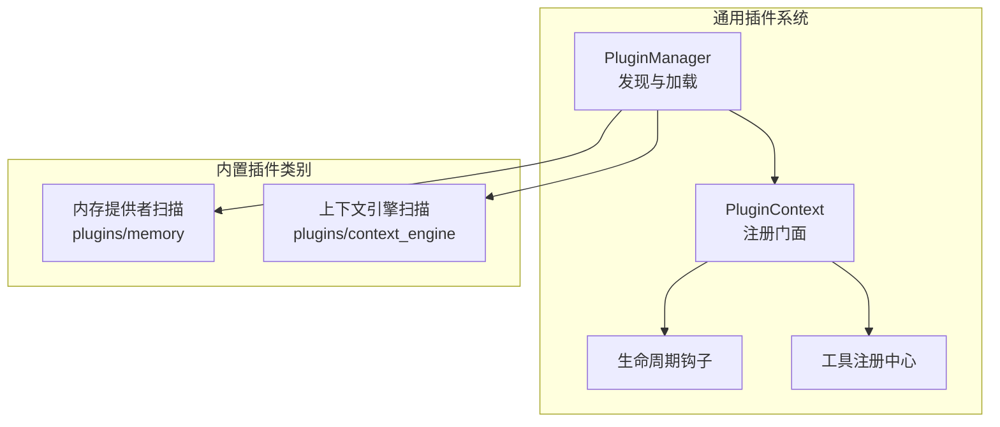
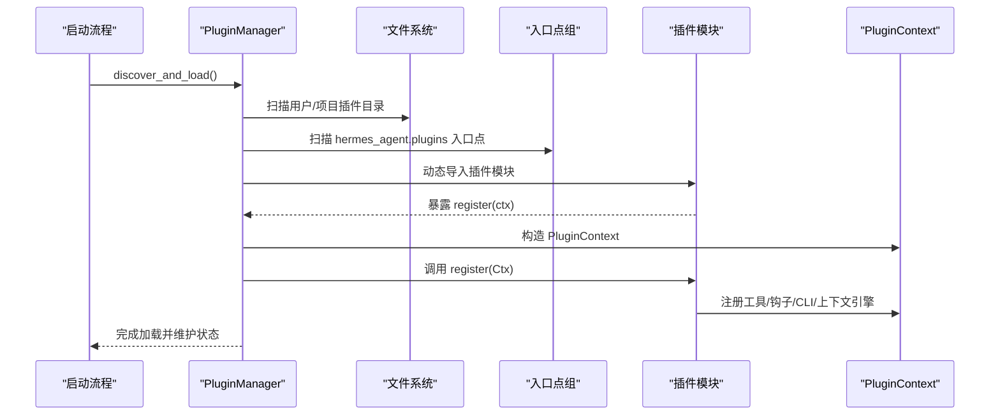
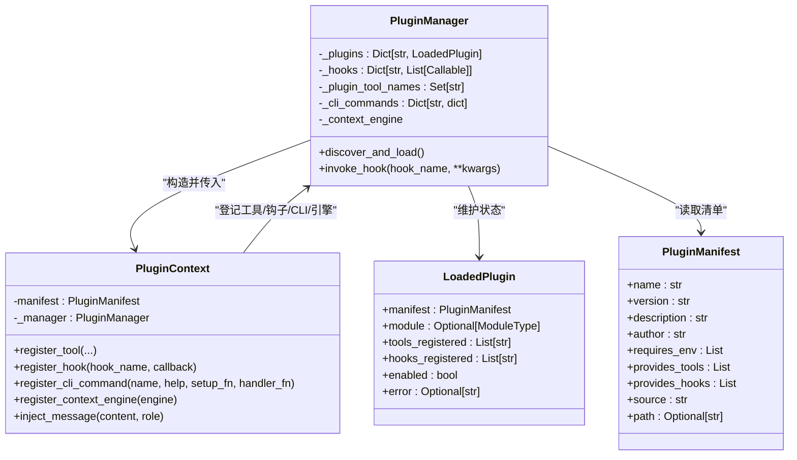
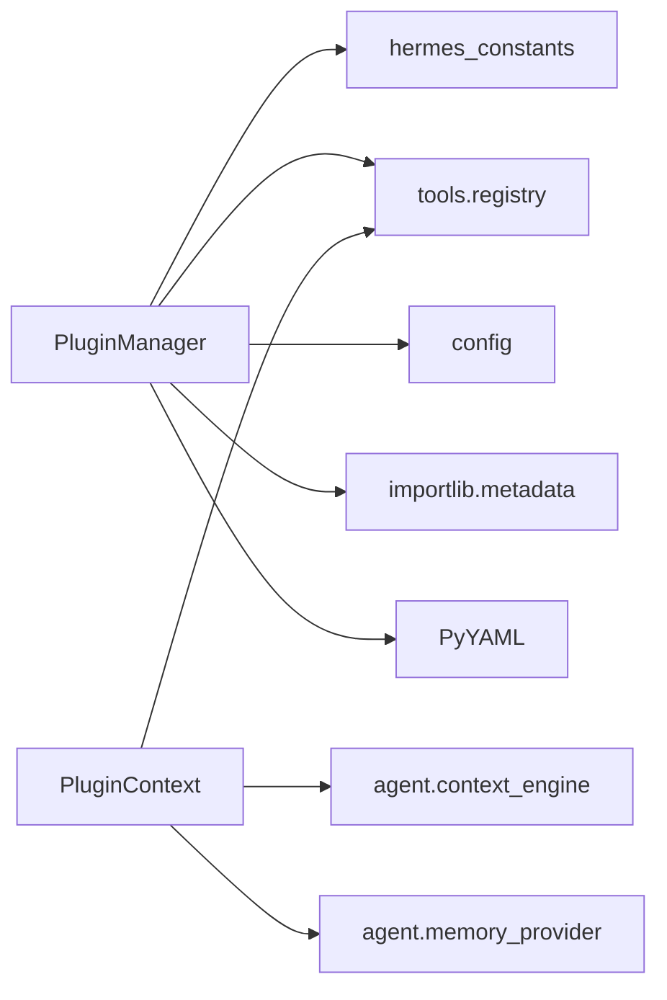

# 插件架构设计

<cite>
**本文档引用的文件**
- [plugins/__init__.py](file://plugins/__init__.py)
- [hermes_cli/plugins.py](file://hermes_cli/plugins.py)
- [hermes_cli/plugins_cmd.py](file://hermes_cli/plugins_cmd.py)
- [plugins/memory/__init__.py](file://plugins/memory/__init__.py)
- [plugins/context_engine/__init__.py](file://plugins/context_engine/__init__.py)
- [plugins/memory/honcho/plugin.yaml](file://plugins/memory/honcho/plugin.yaml)
- [plugins/memory/honcho/__init__.py](file://plugins/memory/honcho/__init__.py)
- [plugins/memory/holographic/plugin.yaml](file://plugins/memory/holographic/plugin.yaml)
- [tools/registry.py](file://tools/registry.py)
- [hermes_constants.py](file://hermes_constants.py)
- [tests/hermes_cli/test_plugins.py](file://tests/hermes_cli/test_plugins.py)
- [website/docs/guides/build-a-hermes-plugin.md](file://website/docs/guides/build-a-hermes-plugin.md)
</cite>

## 目录
1. [简介](#简介)
2. [项目结构](#项目结构)
3. [核心组件](#核心组件)
4. [架构总览](#架构总览)
5. [详细组件分析](#详细组件分析)
6. [依赖关系分析](#依赖关系分析)
7. [性能考量](#性能考量)
8. [故障排查指南](#故障排查指南)
9. [结论](#结论)
10. [附录](#附录)

## 简介
本文件系统化阐述 Hermes Agent 的插件架构设计，覆盖插件系统的设计理念、架构模式与扩展机制；详述插件生命周期管理、注册流程与加载机制；记录插件接口规范、API 设计原则与兼容性要求；解释插件间依赖关系与通信方式；并提供插件配置系统、元数据管理与版本控制的实现细节，以及安全模型、权限控制与沙箱机制。面向插件开发者，提供架构理解与技术决策依据。

## 项目结构
Hermes 插件体系由“通用插件系统”和“内置插件类别（内存提供者与上下文引擎）”构成：
- 通用插件系统：通过目录扫描、入口点发现与动态导入，加载用户/项目/第三方插件，并在启动时调用其 register(ctx) 完成工具、钩子、CLI 命令等注册。
- 内置插件类别：内存提供者与上下文引擎作为独立子系统，扫描固定路径下的子目录，按约定实现接口后被选择性激活。
- 工具注册中心：所有工具（含插件提供的工具）统一注册到全局工具注册表，供模型工具层使用。

图表来源
- [hermes_cli/plugins.py:271-447](file://hermes_cli/plugins.py#L271-L447)
- [plugins/memory/__init__.py:32-75](file://plugins/memory/__init__.py#L32-L75)
- [plugins/context_engine/__init__.py:33-76](file://plugins/context_engine/__init__.py#L33-L76)

章节来源
- [hermes_cli/plugins.py:1-120](file://hermes_cli/plugins.py#L1-L120)
- [plugins/__init__.py:1-2](file://plugins/__init__.py#L1-L2)

## 核心组件
- PluginManager：插件发现、加载与生命周期调度的核心类，负责扫描三类来源、动态导入模块、调用 register 并维护已加载插件状态。
- PluginContext：插件注册门面，提供 register_tool/register_hook/register_cli_command/register_context_engine 等能力。
- PluginManifest/LoadedPlugin：插件清单与运行时状态的数据结构。
- 工具注册中心（ToolRegistry）：集中管理工具定义、可用性检查与分发。
- 内置插件扫描器：内存提供者与上下文引擎各自提供 discover/load 函数，扫描子目录并按约定实例化。

章节来源
- [hermes_cli/plugins.py:93-118](file://hermes_cli/plugins.py#L93-L118)
- [hermes_cli/plugins.py:124-265](file://hermes_cli/plugins.py#L124-L265)
- [hermes_cli/plugins.py:271-447](file://hermes_cli/plugins.py#L271-L447)
- [tools/registry.py:48-94](file://tools/registry.py#L48-L94)
- [plugins/memory/__init__.py:32-75](file://plugins/memory/__init__.py#L32-L75)
- [plugins/context_engine/__init__.py:33-76](file://plugins/context_engine/__init__.py#L33-L76)

## 架构总览
Hermes 插件系统采用“声明式注册 + 动态发现”的模式：
- 发现阶段：从用户目录、项目目录与 Python 入口点组发现插件清单。
- 加载阶段：按清单动态导入模块，调用 register(ctx)，完成工具、钩子、CLI 命令与上下文引擎注册。
- 运行阶段：通过 PluginManager 维护钩子回调列表，在合适时机调用；工具调用经由 ToolRegistry 分发。

图表来源
- [hermes_cli/plugins.py:287-317](file://hermes_cli/plugins.py#L287-L317)
- [hermes_cli/plugins.py:400-447](file://hermes_cli/plugins.py#L400-L447)

## 详细组件分析

### 通用插件系统（PluginManager 与 PluginContext）
- 插件来源与发现
  - 用户插件：~/.hermes/plugins/<name>/，需包含 plugin.yaml 与 __init__.py。
  - 项目插件：./.hermes/plugins/<name>/，需开启环境变量开关。
  - 第三方插件：通过 importlib.metadata 查找 hermes_agent.plugins 入口点组。
- 加载与注册
  - 对于目录型插件，使用 importlib.util.spec_from_file_location 动态导入，并确保命名空间包存在。
  - 调用 register(ctx)；若无该函数则标记为禁用并记录错误。
  - PluginContext 提供 register_tool/register_hook/register_cli_command/register_context_engine 等方法。
- 生命周期钩子
  - 支持 pre_tool_call/post_tool_call/pre_llm_call/post_llm_call/pre_api_request/post_api_request/on_session_start/on_session_end/on_session_finalize/on_session_reset。
  - PluginManager.invoke_hook 逐个调用回调，异常被捕获并记录，避免单个插件影响主循环。
- 工具与 CLI 集成
  - 插件注册的工具写入全局工具注册表，参与模型工具生成。
  - 插件注册的 CLI 子命令可直接接入 hermes CLI 子解析器。

图表来源
- [hermes_cli/plugins.py:93-118](file://hermes_cli/plugins.py#L93-L118)
- [hermes_cli/plugins.py:124-265](file://hermes_cli/plugins.py#L124-L265)
- [hermes_cli/plugins.py:271-447](file://hermes_cli/plugins.py#L271-L447)

章节来源
- [hermes_cli/plugins.py:55-66](file://hermes_cli/plugins.py#L55-L66)
- [hermes_cli/plugins.py:287-317](file://hermes_cli/plugins.py#L287-L317)
- [hermes_cli/plugins.py:400-447](file://hermes_cli/plugins.py#L400-L447)
- [hermes_cli/plugins.py:500-534](file://hermes_cli/plugins.py#L500-L534)

### 插件清单与元数据管理
- 清单字段
  - name、version、description、author、requires_env、provides_tools、provides_hooks、source、path。
- 版本控制与兼容性
  - 插件安装器支持 manifest_version 字段，当前支持版本为 1；高于支持版本的插件会被拒绝安装并提示升级 CLI。
- 环境变量注入
  - 安装时读取 requires_env 列表，交互式或静默地提示用户输入缺失的环境变量，并写入 ~/.env。

章节来源
- [hermes_cli/plugins.py:93-105](file://hermes_cli/plugins.py#L93-L105)
- [hermes_cli/plugins_cmd.py:23-26](file://hermes_cli/plugins_cmd.py#L23-L26)
- [hermes_cli/plugins_cmd.py:115-127](file://hermes_cli/plugins_cmd.py#L115-L127)
- [hermes_cli/plugins_cmd.py:151-224](file://hermes_cli/plugins_cmd.py#L151-L224)

### 工具注册与兼容性
- 工具注册
  - 插件通过 PluginContext.register_tool 将工具注册到全局工具注册表，同时记录“插件提供”的工具集合。
  - 工具注册表支持按 toolset 分组、可用性检查、异步处理桥接与结果大小限制。
- 兼容性
  - 若同名工具来自不同 toolset，会发出冲突警告；后注册者覆盖前者。
  - 工具 schema 自动补全 name 字段，保证 OpenAI 格式输出一致。

章节来源
- [hermes_cli/plugins.py:133-160](file://hermes_cli/plugins.py#L133-L160)
- [tools/registry.py:59-94](file://tools/registry.py#L59-L94)
- [tools/registry.py:116-143](file://tools/registry.py#L116-L143)

### 生命周期钩子与消息注入
- 钩子类型
  - 包括工具调用前后、LLM 调用前后、API 请求前后、会话开始/结束/最终化/重置等。
- 调用机制
  - PluginManager.invoke_hook 逐个执行回调，捕获异常并记录，返回非空结果列表。
- 消息注入
  - 插件可通过 PluginContext.inject_message 向活动对话注入消息，支持中断当前轮次或排队为下一次输入。

章节来源
- [hermes_cli/plugins.py:55-66](file://hermes_cli/plugins.py#L55-L66)
- [hermes_cli/plugins.py:500-534](file://hermes_cli/plugins.py#L500-L534)
- [hermes_cli/plugins.py:164-188](file://hermes_cli/plugins.py#L164-L188)

### CLI 子命令注册与交互
- 插件通过 PluginContext.register_cli_command 注册子命令，包括 setup_fn 与 handler_fn。
- hermes CLI 在启动时收集这些命令并注入到子解析器中。
- 插件安装器提供交互式启用/禁用界面，支持内存提供者与上下文引擎的选择。

章节来源
- [hermes_cli/plugins.py:192-213](file://hermes_cli/plugins.py#L192-L213)
- [hermes_cli/plugins_cmd.py:741-796](file://hermes_cli/plugins_cmd.py#L741-L796)

### 上下文引擎插件（内置类别）
- 发现与加载
  - 扫描 plugins/context_engine/<name>/ 目录，要求包含 __init__.py 且实现 ContextEngine 抽象基类。
  - 仅允许一个上下文引擎被注册；重复注册会被拒绝并记录警告。
- 配置与选择
  - 通过 config.yaml 中的 context.engine 字段选择当前引擎，默认为 "compressor"。
  - 提供 discover_context_engines/load_context_engine 辅助函数。

章节来源
- [plugins/context_engine/__init__.py:1-220](file://plugins/context_engine/__init__.py#L1-L220)
- [hermes_cli/plugins_cmd.py:611-733](file://hermes_cli/plugins_cmd.py#L611-L733)

### 内存提供者插件（内置类别）
- 发现与加载
  - 扫描 plugins/memory/<name>/ 目录，支持两种注册方式：register(ctx) 或直接导出 MemoryProvider 子类实例。
  - 仅允许一个内存提供者被激活；通过 config.yaml 中的 memory.provider 字段选择。
- CLI 集成
  - 仅对当前激活的内存提供者扫描其 cli.py 并注册命令。
- 示例：Honcho 插件
  - 提供 profile/search/context/conclude 四个工具 schema，并实现 MemoryProvider 接口。
  - 支持懒初始化、预取线程、转储线程、会话同步与结论写入等高级特性。

章节来源
- [plugins/memory/__init__.py:1-318](file://plugins/memory/__init__.py#L1-L318)
- [plugins/memory/honcho/plugin.yaml:1-8](file://plugins/memory/honcho/plugin.yaml#L1-L8)
- [plugins/memory/honcho/__init__.py:719-723](file://plugins/memory/honcho/__init__.py#L719-L723)
- [plugins/memory/holographic/plugin.yaml:1-6](file://plugins/memory/holographic/plugin.yaml#L1-L6)

### 插件安装与管理（CLI）
- 安装
  - 支持 owner/repo 简写与多种 Git URL；克隆到 ~/.hermes/plugins/<name>/。
  - 读取 plugin.yaml，校验 manifest_version，复制 .example 文件，提示缺失环境变量。
- 更新/移除/启用/禁用/列表
  - 支持 git pull 更新；移除目录；交互式启用/禁用；列出已安装插件及其状态。
- 安全性
  - 路径名校验防止目录穿越；对 http/file 协议给出安全警告；支持强制覆盖安装。

章节来源
- [hermes_cli/plugins_cmd.py:284-396](file://hermes_cli/plugins_cmd.py#L284-L396)
- [hermes_cli/plugins_cmd.py:399-451](file://hermes_cli/plugins_cmd.py#L399-L451)
- [hermes_cli/plugins_cmd.py:453-468](file://hermes_cli/plugins_cmd.py#L453-L468)
- [hermes_cli/plugins_cmd.py:470-534](file://hermes_cli/plugins_cmd.py#L470-L534)
- [hermes_cli/plugins_cmd.py:537-595](file://hermes_cli/plugins_cmd.py#L537-L595)

## 依赖关系分析
- 插件系统内部依赖
  - PluginManager 依赖 hermes_constants 获取用户目录、工具注册表进行工具注册、config 读取禁用列表。
  - PluginContext 依赖 tools.registry 进行工具注册，依赖 agent.context_engine 与 agent.memory_provider 进行引擎/提供者注册。
- 外部依赖
  - importlib.metadata 用于入口点扫描；PyYAML 用于解析 plugin.yaml。
- 循环依赖规避
  - 引擎/提供者注册采用延迟导入，避免模块级循环依赖。

图表来源
- [hermes_cli/plugins.py:41-47](file://hermes_cli/plugins.py#L41-L47)
- [hermes_cli/plugins.py:124-265](file://hermes_cli/plugins.py#L124-L265)
- [hermes_cli/plugins.py:233-245](file://hermes_cli/plugins.py#L233-L245)
- [hermes_cli/plugins.py:478-494](file://hermes_cli/plugins.py#L478-L494)

章节来源
- [hermes_cli/plugins.py:41-47](file://hermes_cli/plugins.py#L41-L47)
- [hermes_cli/plugins.py:233-245](file://hermes_cli/plugins.py#L233-L245)

## 性能考量
- 插件加载
  - 使用 importlib.util.spec_from_file_location 动态导入，避免不必要的包扫描；仅在需要时才执行模块代码。
- 钩子调用
  - 每个回调独立 try/except，避免单个插件异常阻塞主循环；回调结果收集为列表，便于后续处理。
- 工具注册
  - 工具注册表按需检查可用性，减少无效工具的 schema 输出；异步工具通过桥接统一调度。
- 内置插件
  - 内置内存提供者与上下文引擎扫描不导入完整模块，仅读取 plugin.yaml 与轻量可用性检查，降低开销。

[本节为通用指导，无需特定文件引用]

## 故障排查指南
- 插件未加载
  - 检查是否存在 plugin.yaml 与 __init__.py；确认 register(ctx) 是否存在；查看日志中的错误信息（如“无 register() 函数”）。
- 插件被禁用
  - 检查 config.yaml 中 plugins.disabled 列表；使用 hermes plugins enable/disable 切换。
- 钩子异常
  - PluginManager.invoke_hook 会捕获回调异常并记录；检查对应插件回调是否抛出未处理异常。
- 工具不可用
  - 检查工具的 check_fn 返回值；确认 requires_env 变量是否正确设置；核对工具 schema 与名称。
- 安装失败
  - 检查 Git 可用性、网络超时、路径穿越防护与 manifest_version 兼容性；必要时使用 --force 重新安装。

章节来源
- [tests/hermes_cli/test_plugins.py:166-198](file://tests/hermes_cli/test_plugins.py#L166-L198)
- [hermes_cli/plugins.py:414-444](file://hermes_cli/plugins.py#L414-L444)
- [hermes_cli/plugins.py:527-533](file://hermes_cli/plugins.py#L527-L533)
- [hermes_cli/plugins_cmd.py:284-396](file://hermes_cli/plugins_cmd.py#L284-L396)

## 结论
Hermes 插件系统以“声明式注册 + 动态发现 + 生命周期钩子”为核心，结合工具注册中心与内置插件类别扫描，构建了高扩展、强隔离与易维护的插件生态。通过严格的清单与版本控制、环境变量注入与安全校验，以及完善的 CLI 管理工具，既保障了开发体验，也确保了运行时的稳定性与安全性。对于插件开发者而言，遵循 register(ctx) 规范、合理使用钩子与工具注册、关注可用性检查与错误处理，即可快速构建高质量插件。

[本节为总结，无需特定文件引用]

## 附录

### 插件接口规范与 API 设计原则
- 必备文件
  - plugin.yaml：声明 name、version、description、author、requires_env、provides_tools、provides_hooks 等。
  - __init__.py：暴露 register(ctx) 函数。
- register(ctx) 设计
  - 仅在启动时调用一次；通过 ctx.register_tool/ctx.register_hook/ctx.register_cli_command/ctx.register_context_engine 完成注册。
  - 若 register(ctx) 抛出异常，插件被禁用但不影响主流程。
- 工具注册原则
  - schema 与 handler 明确分离；check_fn 控制可用性；异步工具自动桥接；工具名唯一，toolset 可冲突但会告警。
- 生命周期钩子
  - 名称必须在 VALID_HOOKS 列表内；未知钩子会被记录警告但保留；回调异常被捕获并记录。
- 兼容性要求
  - manifest_version 不得高于当前支持版本；高于支持版本的插件安装将被拒绝并提示升级 CLI。

章节来源
- [website/docs/guides/build-a-hermes-plugin.md:240-246](file://website/docs/guides/build-a-hermes-plugin.md#L240-L246)
- [hermes_cli/plugins.py:55-66](file://hermes_cli/plugins.py#L55-L66)
- [hermes_cli/plugins.py:414-444](file://hermes_cli/plugins.py#L414-L444)
- [hermes_cli/plugins_cmd.py:342-361](file://hermes_cli/plugins_cmd.py#L342-L361)

### 插件安全模型与沙箱机制
- 路径与目录穿越防护
  - 插件安装与管理严格校验插件名与目标路径，拒绝包含路径遍历字符或解析到插件目录之外的行为。
- 环境变量与凭据
  - requires_env 支持富配置（描述、URL、是否机密），安装时交互式提示输入；敏感变量不会透传到插件进程。
- 文件写入沙箱
  - HERMES_WRITE_SAFE_ROOT 限制写入范围；静态拒绝列表禁止写入系统关键文件；凭据文件路径解析前进行目录约束校验。
- 子进程隔离
  - 代码执行工具通过环境变量与 PYTHONPATH 隔离，重定向 HOME 到 {HERMES_HOME}/home 以实现配置隔离；注入 TZ 与 RPC 套接字以保持一致性。

章节来源
- [hermes_cli/plugins_cmd.py:36-70](file://hermes_cli/plugins_cmd.py#L36-L70)
- [hermes_cli/plugins_cmd.py:151-224](file://hermes_cli/plugins_cmd.py#L151-L224)
- [tests/tools/test_file_write_safety.py:1-42](file://tests/tools/test_file_write_safety.py#L1-L42)
- [tools/credential_files.py:66-101](file://tools/credential_files.py#L66-L101)
- [tools/code_execution_tool.py:1001-1029](file://tools/code_execution_tool.py#L1001-L1029)