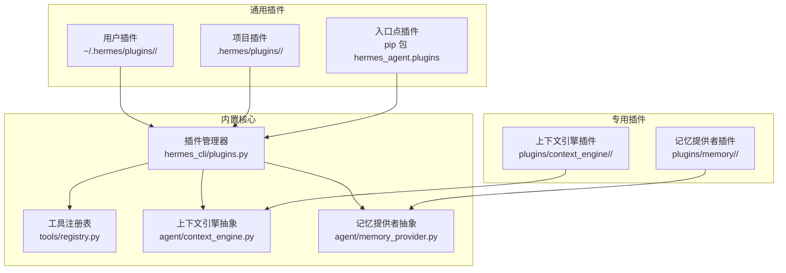
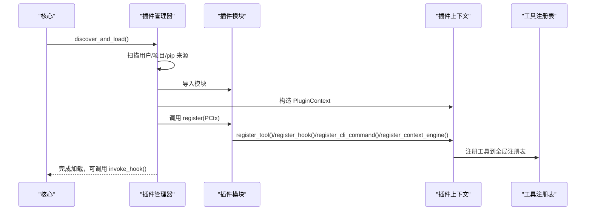
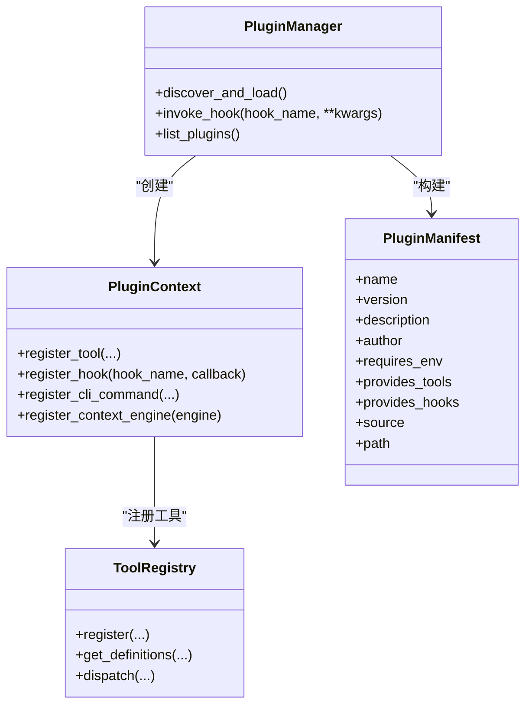
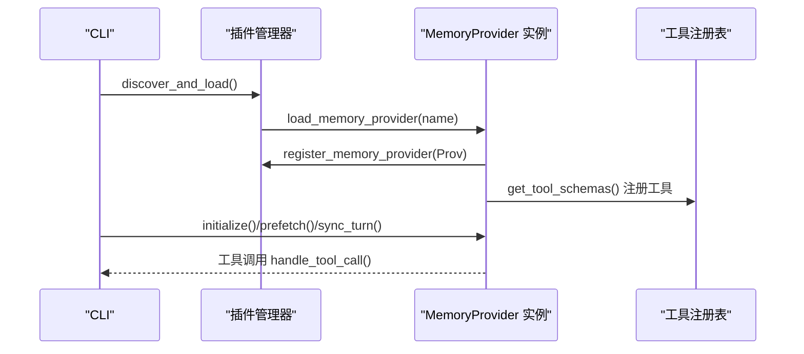
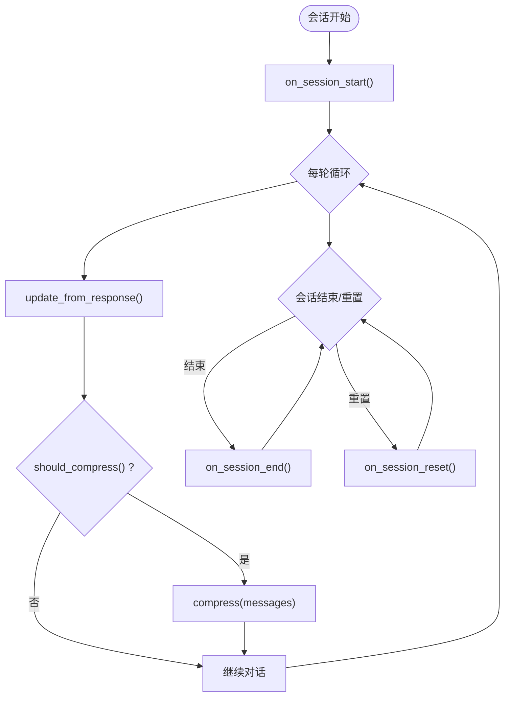
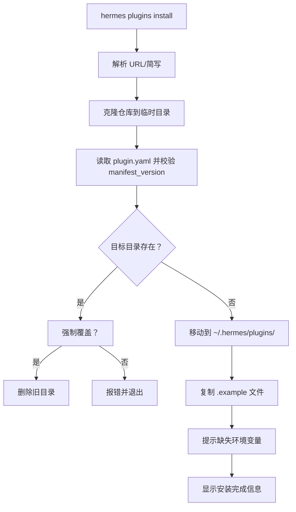
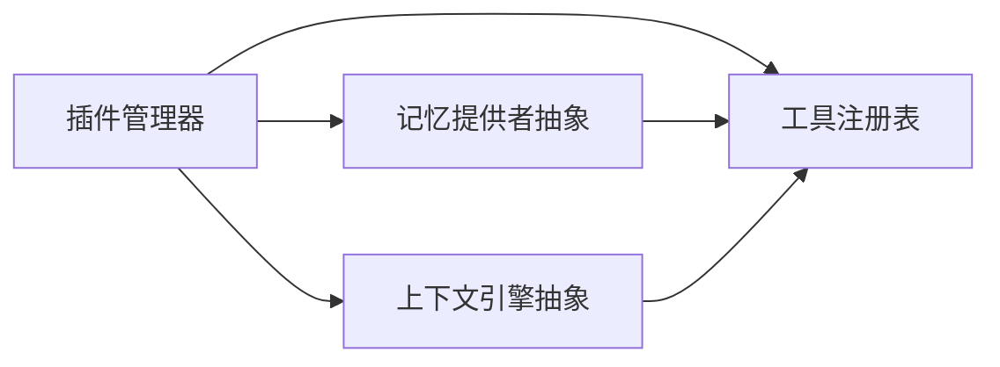

# 插件系统

<cite>
**本文引用的文件**
- [plugins/__init__.py](file://plugins/__init__.py)
- [plugins/context_engine/__init__.py](file://plugins/context_engine/__init__.py)
- [plugins/memory/__init__.py](file://plugins/memory/__init__.py)
- [hermes_cli/plugins.py](file://hermes_cli/plugins.py)
- [hermes_cli/plugins_cmd.py](file://hermes_cli/plugins_cmd.py)
- [agent/context_engine.py](file://agent/context_engine.py)
- [agent/memory_provider.py](file://agent/memory_provider.py)
- [tools/registry.py](file://tools/registry.py)
- [plugins/memory/honcho/plugin.yaml](file://plugins/memory/honcho/plugin.yaml)
- [plugins/memory/honcho/__init__.py](file://plugins/memory/honcho/__init__.py)
- [plugins/memory/holographic/plugin.yaml](file://plugins/memory/holographic/plugin.yaml)
- [plugins/memory/holographic/__init__.py](file://plugins/memory/holographic/__init__.py)
</cite>

## 目录
1. [简介](#简介)
2. [项目结构](#项目结构)
3. [核心组件](#核心组件)
4. [架构总览](#架构总览)
5. [详细组件分析](#详细组件分析)
6. [依赖分析](#依赖分析)
7. [性能考虑](#性能考虑)
8. [故障排查指南](#故障排查指南)
9. [结论](#结论)
10. [附录](#附录)

## 简介
本文件系统性阐述 Hermes Agent 的插件体系：涵盖插件架构设计理念、扩展机制与开发规范；详解记忆插件与上下文引擎插件的开发方法；提供完整的插件 API 参考（接口定义、事件处理与生命周期管理）；记录插件注册、加载、配置与卸载流程；并给出最佳实践、性能与安全建议，以及调试、测试与发布指南。

## 项目结构
Hermes 插件系统由三类插件构成：
- 通用插件：用户目录或项目目录中的目录型插件，或通过 pip 入口点安装的包型插件。
- 记忆提供者插件：在 plugins/memory 下按名称子目录组织，仅允许启用一个外部提供者。
- 上下文引擎插件：在 plugins/context_engine 下按名称子目录组织，仅允许启用一个引擎。

图表来源
- [hermes_cli/plugins.py:271-447](file://hermes_cli/plugins.py#L271-L447)
- [plugins/memory/__init__.py:32-96](file://plugins/memory/__init__.py#L32-L96)
- [plugins/context_engine/__init__.py:33-97](file://plugins/context_engine/__init__.py#L33-L97)
- [agent/context_engine.py:32-185](file://agent/context_engine.py#L32-L185)
- [agent/memory_provider.py:42-232](file://agent/memory_provider.py#L42-L232)
- [tools/registry.py:48-291](file://tools/registry.py#L48-L291)

章节来源
- [plugins/__init__.py:1-2](file://plugins/__init__.py#L1-L2)
- [plugins/context_engine/__init__.py:1-220](file://plugins/context_engine/__init__.py#L1-L220)
- [plugins/memory/__init__.py:1-318](file://plugins/memory/__init__.py#L1-L318)
- [hermes_cli/plugins.py:1-649](file://hermes_cli/plugins.py#L1-L649)
- [agent/context_engine.py:1-185](file://agent/context_engine.py#L1-L185)
- [agent/memory_provider.py:1-232](file://agent/memory_provider.py#L1-L232)
- [tools/registry.py:1-336](file://tools/registry.py#L1-L336)

## 核心组件
- 插件管理器（PluginManager）
  - 负责扫描、加载与调用插件；维护已发现插件清单、钩子回调集合、CLI 命令注册与上下文引擎实例。
  - 支持三种来源：用户目录、项目目录（需显式开启）、pip 入口点。
- 插件上下文（PluginContext）
  - 提供 register_tool、register_hook、register_cli_command、register_context_engine 等能力，屏蔽底层细节。
- 工具注册表（ToolRegistry）
  - 统一收集与分发工具，支持可用性检查、异步桥接、结果大小限制等。
- 抽象基类
  - ContextEngine：上下文引擎生命周期与压缩策略接口。
  - MemoryProvider：记忆提供者生命周期与工具接口。

章节来源
- [hermes_cli/plugins.py:124-265](file://hermes_cli/plugins.py#L124-L265)
- [hermes_cli/plugins.py:271-447](file://hermes_cli/plugins.py#L271-L447)
- [tools/registry.py:48-291](file://tools/registry.py#L48-L291)
- [agent/context_engine.py:32-185](file://agent/context_engine.py#L32-L185)
- [agent/memory_provider.py:42-232](file://agent/memory_provider.py#L42-L232)

## 架构总览
插件系统采用“声明式注册 + 运行时调度”的模式：
- 发现阶段：扫描三类来源，读取 plugin.yaml 清单，构造 PluginManifest。
- 加载阶段：导入模块并调用 register(ctx)，插件通过 ctx 注册工具、钩子、CLI 命令与上下文引擎。
- 运行阶段：插件管理器在生命周期钩子处统一调用回调；工具通过工具注册表分发执行。

图表来源
- [hermes_cli/plugins.py:287-447](file://hermes_cli/plugins.py#L287-L447)
- [hermes_cli/plugins.py:124-265](file://hermes_cli/plugins.py#L124-L265)
- [tools/registry.py:59-94](file://tools/registry.py#L59-L94)

章节来源
- [hermes_cli/plugins.py:287-447](file://hermes_cli/plugins.py#L287-L447)

## 详细组件分析

### 通用插件系统（通用插件、钩子、工具与 CLI）
- 插件清单字段
  - name、version、description、author、requires_env、provides_tools、provides_hooks。
- 生命周期钩子（VALID_HOOKS）
  - pre_tool_call、post_tool_call、pre_llm_call、post_llm_call、pre_api_request、post_api_request、on_session_start、on_session_end、on_session_finalize、on_session_reset。
- 工具注册
  - 通过 PluginContext.register_tool 注册，最终写入工具注册表；支持异步工具自动桥接。
- CLI 命令注册
  - 通过 PluginContext.register_cli_command 注册，插件管理器统一注入到参数解析树。

图表来源
- [hermes_cli/plugins.py:93-118](file://hermes_cli/plugins.py#L93-L118)
- [hermes_cli/plugins.py:124-265](file://hermes_cli/plugins.py#L124-L265)
- [hermes_cli/plugins.py:271-447](file://hermes_cli/plugins.py#L271-L447)
- [tools/registry.py:48-94](file://tools/registry.py#L48-L94)

章节来源
- [hermes_cli/plugins.py:55-66](file://hermes_cli/plugins.py#L55-L66)
- [hermes_cli/plugins.py:124-265](file://hermes_cli/plugins.py#L124-L265)
- [hermes_cli/plugins.py:271-447](file://hermes_cli/plugins.py#L271-L447)
- [tools/registry.py:48-291](file://tools/registry.py#L48-L291)

### 记忆提供者插件（MemoryProvider）
- 设计要点
  - 仅允许启用一个外部记忆提供者（内置始终激活），避免工具 schema 混乱与后端冲突。
  - 生命周期：initialize → system_prompt_block/prefetch/queue_prefetch/sync_turn → get_tool_schemas/handle_tool_call → on_turn_start/on_session_end/on_pre_compress/on_memory_write/on_delegation → shutdown。
- 配置与发现
  - 通过 plugins/memory/<name>/ 目录下的 __init__.py 实现 MemoryProvider 子类，并在 register(ctx) 中调用 ctx.register_memory_provider。
  - discover_memory_providers 读取 plugin.yaml 并进行轻量可用性检查；load_memory_provider 动态导入并实例化。
- CLI 集成
  - discover_plugin_cli_commands 仅对当前激活的记忆提供者加载其 cli.py 中的命令。

图表来源
- [plugins/memory/__init__.py:32-96](file://plugins/memory/__init__.py#L32-L96)
- [plugins/memory/__init__.py:199-218](file://plugins/memory/__init__.py#L199-L218)
- [plugins/memory/__init__.py:234-317](file://plugins/memory/__init__.py#L234-L317)
- [hermes_cli/plugins.py:124-160](file://hermes_cli/plugins.py#L124-L160)
- [agent/memory_provider.py:42-232](file://agent/memory_provider.py#L42-L232)

章节来源
- [plugins/memory/__init__.py:1-318](file://plugins/memory/__init__.py#L1-L318)
- [agent/memory_provider.py:1-232](file://agent/memory_provider.py#L1-L232)

### 上下文引擎插件（ContextEngine）
- 设计要点
  - 仅允许启用一个上下文引擎；默认使用内置 ContextCompressor。
  - 生命周期：on_session_start → update_from_response → should_compress/compress → on_session_end/reset。
- 发现与加载
  - 通过 plugins/context_engine/<name>/ 目录下的 __init__.py 实现 ContextEngine 子类，并在 register(ctx) 中调用 ctx.register_context_engine。
  - discover_context_engines 读取 plugin.yaml 并进行轻量可用性检查；load_context_engine 动态导入并实例化。

图表来源
- [agent/context_engine.py:103-126](file://agent/context_engine.py#L103-L126)
- [plugins/context_engine/__init__.py:33-97](file://plugins/context_engine/__init__.py#L33-L97)

章节来源
- [plugins/context_engine/__init__.py:1-220](file://plugins/context_engine/__init__.py#L1-L220)
- [agent/context_engine.py:1-185](file://agent/context_engine.py#L1-L185)

### 插件 CLI 与安装管理
- hermes plugins 子命令
  - install/update/remove/list/enable/disable/toggle
  - 支持从 Git URL 或 owner/repo 简写安装；支持 .example 文件复制与环境变量提示。
- 安全与路径校验
  - 严格校验插件名与目标路径，防止路径穿越；对 http:// 与 file:// 提示安全风险。
- 交互式配置
  - 对记忆提供者与上下文引擎提供交互式选择与持久化。

图表来源
- [hermes_cli/plugins_cmd.py:284-397](file://hermes_cli/plugins_cmd.py#L284-L397)
- [hermes_cli/plugins_cmd.py:399-451](file://hermes_cli/plugins_cmd.py#L399-L451)
- [hermes_cli/plugins_cmd.py:453-468](file://hermes_cli/plugins_cmd.py#L453-L468)
- [hermes_cli/plugins_cmd.py:537-595](file://hermes_cli/plugins_cmd.py#L537-L595)

章节来源
- [hermes_cli/plugins_cmd.py:1-1129](file://hermes_cli/plugins_cmd.py#L1-L1129)

### 示例插件：Honcho 与 Holographic
- Honcho
  - 作为 MemoryProvider 实现，提供 profile/search/context/conclude 四个工具；支持懒初始化、成本控制与会话镜像。
  - 通过 register(ctx) 注册实例。
- Holographic
  - 本地 SQLite 结构化记忆，支持实体检索、信任评分与组合推理；支持自动抽取与反馈训练。
  - 通过 register(ctx) 注册实例。

章节来源
- [plugins/memory/honcho/__init__.py:119-723](file://plugins/memory/honcho/__init__.py#L119-L723)
- [plugins/memory/holographic/__init__.py:114-408](file://plugins/memory/holographic/__init__.py#L114-L408)
- [plugins/memory/honcho/plugin.yaml:1-8](file://plugins/memory/honcho/plugin.yaml#L1-L8)
- [plugins/memory/holographic/plugin.yaml:1-6](file://plugins/memory/holographic/plugin.yaml#L1-L6)

## 依赖分析
- 插件管理器依赖
  - 工具注册表：用于工具注册与分发。
  - 抽象基类：上下文引擎与记忆提供者的接口约束。
  - 配置系统：读取禁用列表与内存/上下文引擎配置。
- 插件内部依赖
  - 记忆插件通常依赖工具注册表返回工具 schema；部分插件还依赖自身 SDK 或本地存储。
- 循环依赖防护
  - 插件管理器延迟导入抽象类以避免模块级循环；插件上下文在运行期注入引用。

图表来源
- [hermes_cli/plugins.py:271-447](file://hermes_cli/plugins.py#L271-L447)
- [agent/context_engine.py:32-185](file://agent/context_engine.py#L32-L185)
- [agent/memory_provider.py:42-232](file://agent/memory_provider.py#L42-L232)
- [tools/registry.py:48-94](file://tools/registry.py#L48-L94)

章节来源
- [hermes_cli/plugins.py:271-447](file://hermes_cli/plugins.py#L271-L447)
- [agent/context_engine.py:32-185](file://agent/context_engine.py#L32-L185)
- [agent/memory_provider.py:42-232](file://agent/memory_provider.py#L42-L232)
- [tools/registry.py:48-94](file://tools/registry.py#L48-L94)

## 性能考虑
- 工具执行
  - 异步工具通过统一桥接执行，避免阻塞主循环；工具注册表提供最大结果长度限制，防止过大数据影响吞吐。
- 记忆提供者
  - 背景线程预取与同步，避免阻塞主对话；支持成本感知的调用节流与首次注入频率控制。
- 上下文引擎
  - 提供预检压缩接口（should_compress_preflight）以减少不必要的昂贵计算；阈值百分比与保护窗口参数可调。
- 插件发现
  - 轻量扫描与缓存：仅读取 plugin.yaml 与进行最小可用性检查，避免深度初始化。

[本节为通用指导，无需特定文件来源]

## 故障排查指南
- 插件未加载
  - 检查 plugin.yaml 是否存在且格式正确；确认 register() 函数是否存在；查看日志中错误信息。
- 工具不可用
  - 检查工具注册表中的可用性检查函数是否通过；核对 requires_env 是否满足。
- 记忆提供者不生效
  - 确认 memory.provider 配置项；确保 is_available 返回真；检查 CLI 中 discover_plugin_cli_commands 是否正确加载。
- 上下文引擎异常
  - 检查 register_context_engine 是否被重复注册；确认 ContextEngine 实例继承正确；查看生命周期钩子日志。
- 安装问题
  - 使用 hermes plugins install/update/remove/list 系列命令；注意路径穿越与 URL 安全提示。

章节来源
- [hermes_cli/plugins.py:400-447](file://hermes_cli/plugins.py#L400-L447)
- [hermes_cli/plugins_cmd.py:284-397](file://hermes_cli/plugins_cmd.py#L284-L397)
- [hermes_cli/plugins_cmd.py:399-468](file://hermes_cli/plugins_cmd.py#L399-L468)

## 结论
Hermes 插件系统以清晰的抽象与严格的生命周期管理为核心，既保证了扩展性，又兼顾了安全性与性能。通用插件、记忆提供者与上下文引擎三类插件各司其职，配合统一的工具注册与钩子调度，形成可维护、可测试、可演进的插件生态。

[本节为总结，无需特定文件来源]

## 附录

### 插件 API 参考（摘要）
- 插件清单字段
  - name、version、description、author、requires_env、provides_tools、provides_hooks。
- 插件上下文（PluginContext）
  - register_tool(name, toolset, schema, handler, check_fn, requires_env, is_async, description, emoji)
  - register_hook(hook_name, callback)
  - register_cli_command(name, help, setup_fn, handler_fn, description)
  - register_context_engine(engine)
- 工具注册表（ToolRegistry）
  - register(name, toolset, schema, handler, check_fn, requires_env, is_async, description, emoji, max_result_size_chars)
  - get_definitions(tool_names, quiet)
  - dispatch(name, args, **kwargs)
- 上下文引擎（ContextEngine）
  - 必须实现：name、update_from_response、should_compress、compress
  - 可选：should_compress_preflight、on_session_start、on_session_end、on_session_reset、get_tool_schemas、handle_tool_call、get_status、update_model
- 记忆提供者（MemoryProvider）
  - 必须实现：name、is_available、initialize、get_tool_schemas、handle_tool_call
  - 可选：system_prompt_block、prefetch、queue_prefetch、sync_turn、shutdown、on_turn_start、on_session_end、on_pre_compress、on_memory_write、on_delegation、get_config_schema、save_config

章节来源
- [hermes_cli/plugins.py:93-118](file://hermes_cli/plugins.py#L93-L118)
- [hermes_cli/plugins.py:124-265](file://hermes_cli/plugins.py#L124-L265)
- [tools/registry.py:48-291](file://tools/registry.py#L48-L291)
- [agent/context_engine.py:32-185](file://agent/context_engine.py#L32-L185)
- [agent/memory_provider.py:42-232](file://agent/memory_provider.py#L42-L232)

### 开发规范与最佳实践
- 清晰的清单与文档
  - 提供完整的 plugin.yaml；描述插件用途、版本、作者与依赖。
- 最小可用性检查
  - 在 is_available 中仅做轻量检查（配置与依赖存在性），避免网络调用。
- 钩子与工具
  - 钩子回调需健壮容错；工具返回统一 JSON 字符串；必要时提供 check_fn 控制可用性。
- 性能与资源
  - 使用后台线程与节流策略；合理设置结果大小上限；在 shutdown 中释放资源。
- 安全
  - 严格校验输入与路径；敏感信息写入 .env；避免在钩子中执行高风险操作。
- 测试
  - 单元测试覆盖 register、工具调用、生命周期钩子；集成测试验证与核心流程联动。

[本节为通用指导，无需特定文件来源]

### 调试、测试与发布
- 调试
  - 启用详细日志；使用 hermes plugins list 查看已发现与启用状态；在插件中记录关键路径日志。
- 测试
  - 使用 pytest；针对插件注册、工具分发、生命周期钩子编写用例；对异步工具进行桥接测试。
- 发布
  - 通过 pip 入口点发布（hermes_agent.plugins）；提供清晰的 plugin.yaml 与安装指引；遵循 manifest_version 兼容性。

[本节为通用指导，无需特定文件来源]