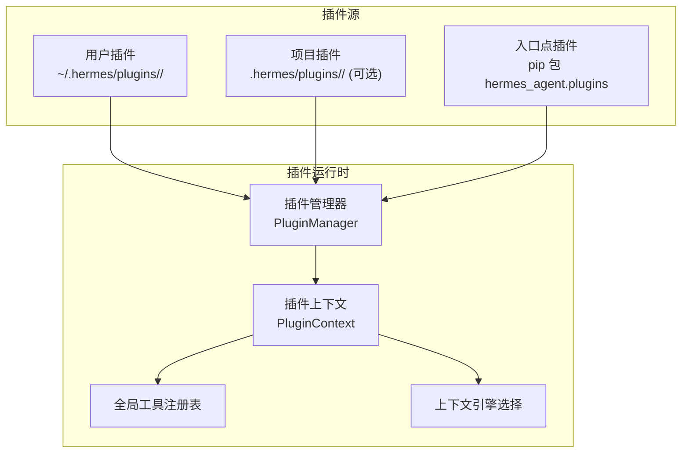
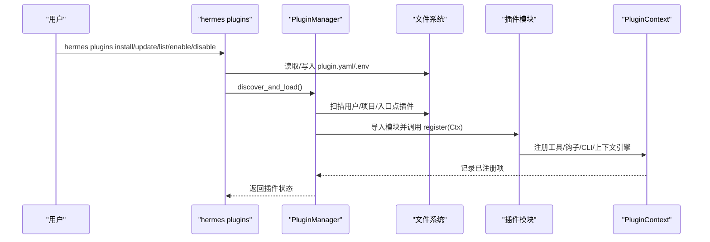
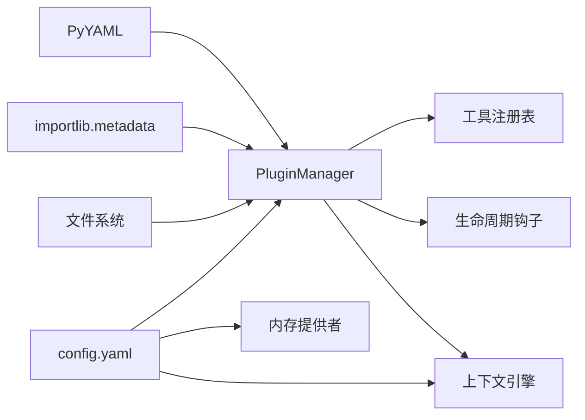

# 插件配置管理

<cite>
**本文档引用的文件**
- [hermes_cli/plugins.py](file://hermes_cli/plugins.py)
- [hermes_cli/plugins_cmd.py](file://hermes_cli/plugins_cmd.py)
- [hermes_cli/config.py](file://hermes_cli/config.py)
- [plugins/memory/byterover/plugin.yaml](file://plugins/memory/byterover/plugin.yaml)
- [plugins/memory/holographic/plugin.yaml](file://plugins/memory/holographic/plugin.yaml)
- [plugins/memory/mem0/plugin.yaml](file://plugins/memory/mem0/plugin.yaml)
- [plugins/memory/openviking/plugin.yaml](file://plugins/memory/openviking/plugin.yaml)
- [plugins/memory/retaindb/plugin.yaml](file://plugins/memory/retaindb/plugin.yaml)
- [plugins/memory/supermemory/plugin.yaml](file://plugins/memory/supermemory/plugin.yaml)
- [plugins/context_engine/__init__.py](file://plugins/context_engine/__init__.py)
- [gateway/platforms/webhook.py](file://gateway/platforms/webhook.py)
- [tests/gateway/test_webhook_dynamic_routes.py](file://tests/gateway/test_webhook_dynamic_routes.py)
- [agent/redact.py](file://agent/redact.py)
- [tools/credential_files.py](file://tools/credential_files.py)
- [tests/tools/test_credential_files.py](file://tests/tools/test_credential_files.py)
</cite>

## 目录
1. [简介](#简介)
2. [项目结构](#项目结构)
3. [核心组件](#核心组件)
4. [架构总览](#架构总览)
5. [详细组件分析](#详细组件分析)
6. [依赖关系分析](#依赖关系分析)
7. [性能考虑](#性能考虑)
8. [故障排除指南](#故障排除指南)
9. [结论](#结论)
10. [附录](#附录)

## 简介
本文件系统性阐述 Hermes Agent 的插件配置管理体系，涵盖插件清单（manifest）格式与解析、插件安装与启用/禁用流程、配置文件结构与验证、热重载与动态更新、继承与优先级、安全性与敏感信息保护、以及最佳实践与模板示例。目标是帮助插件开发者与使用者建立一致、可维护且安全的配置管理方式。

## 项目结构
Hermes 的插件体系由三类来源构成：用户本地插件目录、项目内插件目录（可选）、通过 Python 入口点分发的插件。每个目录型插件需包含清单文件（plugin.yaml 或 plugin.yml）与入口模块（__init__.py），并在其中提供注册函数以声明工具、钩子与上下文引擎等能力。

图表来源
- [hermes_cli/plugins.py:293-324](file://hermes_cli/plugins.py#L293-L324)
- [hermes_cli/plugins.py:400-447](file://hermes_cli/plugins.py#L400-L447)

章节来源
- [hermes_cli/plugins.py:1-649](file://hermes_cli/plugins.py#L1-L649)

## 核心组件
- 插件清单（plugin.yaml/plugin.yml）：定义插件元数据、环境变量需求、提供的工具与钩子、外部依赖等。
- 插件管理器（PluginManager）：扫描、加载与初始化插件，维护已加载插件状态、钩子回调与工具注册。
- 插件上下文（PluginContext）：向插件暴露注册接口（工具、钩子、CLI 命令、消息注入、上下文引擎注册）。
- 配置系统（config.yaml/.env）：集中存储模型、工具集、显示、隐私、平台适配器、内存与上下文引擎等设置；支持版本迁移与结构校验。
- 安装与管理命令（hermes plugins）：支持安装、更新、移除、启用/禁用、列表与交互式切换，并处理 .example 文件复制与环境变量提示。

章节来源
- [hermes_cli/plugins.py:93-118](file://hermes_cli/plugins.py#L93-L118)
- [hermes_cli/plugins.py:124-265](file://hermes_cli/plugins.py#L124-L265)
- [hermes_cli/plugins.py:271-447](file://hermes_cli/plugins.py#L271-L447)
- [hermes_cli/plugins_cmd.py:115-128](file://hermes_cli/plugins_cmd.py#L115-L128)
- [hermes_cli/plugins_cmd.py:284-397](file://hermes_cli/plugins_cmd.py#L284-L397)
- [hermes_cli/config.py:311-706](file://hermes_cli/config.py#L311-L706)

## 架构总览
插件生命周期从发现开始：管理器扫描三类来源，读取清单并导入模块，调用插件的 register 函数完成注册。插件可通过上下文注册工具、钩子与 CLI 子命令，并可替换内置上下文引擎。配置系统在启动时加载 config.yaml 与 .env，执行结构校验与版本迁移，确保运行期一致性。

图表来源
- [hermes_cli/plugins_cmd.py:284-397](file://hermes_cli/plugins_cmd.py#L284-L397)
- [hermes_cli/plugins.py:287-324](file://hermes_cli/plugins.py#L287-L324)
- [hermes_cli/plugins.py:400-447](file://hermes_cli/plugins.py#L400-L447)

## 详细组件分析

### 插件清单（plugin.yaml）格式与解析
- 支持两种清单文件名：plugin.yaml 与 plugin.yml。
- 解析逻辑使用安全 YAML 加载，未安装 YAML 库时会跳过该插件。
- 清单字段包括：名称、版本、描述、作者、环境变量需求（requires_env）、提供的工具与钩子、外部依赖声明等。
- 示例清单展示不同插件的典型字段（如外部依赖、环境变量需求、钩子声明）。

章节来源
- [hermes_cli/plugins.py:329-365](file://hermes_cli/plugins.py#L329-L365)
- [hermes_cli/plugins_cmd.py:115-128](file://hermes_cli/plugins_cmd.py#L115-L128)
- [plugins/memory/byterover/plugin.yaml:1-10](file://plugins/memory/byterover/plugin.yaml#L1-L10)
- [plugins/memory/holographic/plugin.yaml:1-6](file://plugins/memory/holographic/plugin.yaml#L1-L6)
- [plugins/memory/mem0/plugin.yaml:1-6](file://plugins/memory/mem0/plugin.yaml#L1-L6)
- [plugins/memory/openviking/plugin.yaml:1-10](file://plugins/memory/openviking/plugin.yaml#L1-L10)
- [plugins/memory/retaindb/plugin.yaml:1-8](file://plugins/memory/retaindb/plugin.yaml#L1-L8)
- [plugins/memory/supermemory/plugin.yaml:1-6](file://plugins/memory/supermemory/plugin.yaml#L1-L6)

### 插件安装与管理命令
- 安装：支持 Git URL 与简写形式，克隆到临时目录读取清单后移动至最终位置；自动复制 .example 文件为真实配置；根据清单提示缺失的环境变量并写入 .env。
- 更新：对 Git 插件执行拉取，必要时复制新增的 .example 文件。
- 启用/禁用：通过修改 config.yaml 中的 plugins.disabled 列表实现，重启网关或新会话生效。
- 列表与交互式切换：展示已安装插件状态与来源，支持交互式勾选与配置。

章节来源
- [hermes_cli/plugins_cmd.py:284-397](file://hermes_cli/plugins_cmd.py#L284-L397)
- [hermes_cli/plugins_cmd.py:399-451](file://hermes_cli/plugins_cmd.py#L399-L451)
- [hermes_cli/plugins_cmd.py:453-468](file://hermes_cli/plugins_cmd.py#L453-L468)
- [hermes_cli/plugins_cmd.py:470-535](file://hermes_cli/plugins_cmd.py#L470-L535)
- [hermes_cli/plugins_cmd.py:537-595](file://hermes_cli/plugins_cmd.py#L537-L595)
- [hermes_cli/plugins_cmd.py:741-800](file://hermes_cli/plugins_cmd.py#L741-L800)

### 插件注册与生命周期钩子
- 工具注册：通过 PluginContext.register_tool 将插件工具注册到全局注册表，并跟踪插件提供的工具集合。
- 钩子注册：支持 pre_tool_call、post_tool_call、pre_llm_call、post_llm_call、pre_api_request、post_api_request、on_session_start、on_session_end、on_session_finalize、on_session_reset 等。
- 上下文引擎注册：仅允许一个插件注册上下文引擎，避免冲突。
- 生命周期钩子调用：PluginManager.invoke_hook 逐个调用回调，异常被隔离，返回非空结果用于注入上下文。

章节来源
- [hermes_cli/plugins.py:133-161](file://hermes_cli/plugins.py#L133-L161)
- [hermes_cli/plugins.py:249-265](file://hermes_cli/plugins.py#L249-L265)
- [hermes_cli/plugins.py:217-246](file://hermes_cli/plugins.py#L217-L246)
- [hermes_cli/plugins.py:500-535](file://hermes_cli/plugins.py#L500-L535)

### 配置文件结构与验证
- 默认配置树：包含模型、提供商、代理、终端、浏览器、压缩、智能路由、辅助模型、显示、隐私、TTS/STT、语音、人类延迟、上下文引擎、内存、委托、预填充消息、技能、Honcho、时区、平台适配器、审批、命令白名单、个性化、安全、定时任务、日志、网络等键。
- 结构校验：提供 validate_config_structure 对 config.yaml 进行结构检查，识别常见缩进与键位错误。
- 版本迁移：维护 _config_version 与 ENV_VARS_BY_VERSION，按版本迁移环境变量与新增字段。
- 环境变量：通过 OPTIONAL_ENV_VARS 统一声明各功能所需的密钥与参数，便于检查缺失项。

章节来源
- [hermes_cli/config.py:311-706](file://hermes_cli/config.py#L311-L706)
- [hermes_cli/config.py:1592-1599](file://hermes_cli/config.py#L1592-L1599)
- [hermes_cli/config.py:1484-1509](file://hermes_cli/config.py#L1484-L1509)
- [hermes_cli/config.py:1549-1559](file://hermes_cli/config.py#L1549-L1559)

### 动态更新与热重载机制
- Webhook 平台适配器：支持动态订阅文件（JSON）的热重载，基于文件修改时间门控，静态路由优先于动态路由合并。
- 插件禁用列表：通过 config.yaml 的 plugins.disabled 实现“禁用即热重载”效果，重启网关或新会话生效。
- 上下文引擎与内存提供者：通过 config.yaml 的 context.engine 与 memory.provider 字段切换，重启后生效。

章节来源
- [gateway/platforms/webhook.py:257-287](file://gateway/platforms/webhook.py#L257-L287)
- [tests/gateway/test_webhook_dynamic_routes.py:38-87](file://tests/gateway/test_webhook_dynamic_routes.py#L38-L87)
- [hermes_cli/plugins_cmd.py:470-535](file://hermes_cli/plugins_cmd.py#L470-L535)
- [hermes_cli/plugins_cmd.py:640-658](file://hermes_cli/plugins_cmd.py#L640-L658)
- [hermes_cli/plugins_cmd.py:650-658](file://hermes_cli/plugins_cmd.py#L650-L658)

### 继承、覆盖与优先级规则
- 插件禁用优先级：config.yaml 中的 plugins.disabled 列表优先于用户勾选状态，禁用插件不会被加载。
- 上下文引擎与内存提供者：config.yaml 的 context.engine 与 memory.provider 指定具体插件名称，若未指定则使用内置实现。
- 静态路由优先：Webhook 适配器中，静态路由优先于动态路由合并，避免意外覆盖。

章节来源
- [hermes_cli/plugins.py:308-316](file://hermes_cli/plugins.py#L308-L316)
- [hermes_cli/plugins_cmd.py:640-658](file://hermes_cli/plugins_cmd.py#L640-L658)
- [gateway/platforms/webhook.py:263-269](file://gateway/platforms/webhook.py#L263-L269)

### 安全性、敏感信息保护与访问控制
- 敏感信息脱敏：redact.py 提供多种敏感模式匹配与掩码策略，可在配置中开启隐私脱敏。
- 路径与文件安全：credential_files 与测试用例确保配置中的凭证文件路径不越界、不被符号链接逃逸，严格校验 HERMES_HOME 容限。
- 权限与隔离：确保 ~/.hermes 目录与文件的安全权限（所有者读写），在受管环境中遵循组共享策略。
- 访问控制：平台适配器（如 API Server/Webhook）支持鉴权密钥与绑定地址控制，防止未授权访问。

章节来源
- [agent/redact.py:113-120](file://agent/redact.py#L113-L120)
- [tools/credential_files.py:137-165](file://tools/credential_files.py#L137-L165)
- [tests/tools/test_credential_files.py:297-329](file://tests/tools/test_credential_files.py#L297-L329)
- [hermes_cli/config.py:215-254](file://hermes_cli/config.py#L215-L254)
- [hermes_cli/config.py:1320-1360](file://hermes_cli/config.py#L1320-L1360)

### 配置模板与示例
- 插件清单模板：参考各内存插件的 plugin.yaml，包含 name/version/description、requires_env、pip_dependencies、hooks 等字段。
- 配置模板：参考 DEFAULT_CONFIG，按需在 config.yaml 中添加对应键值；使用 hermes config wizard 可引导生成基础配置。
- 示例清单字段说明：
  - name/version/description：插件标识与元信息。
  - requires_env：必需环境变量清单，支持简单字符串或带描述/链接/是否机密的字典。
  - pip_dependencies：pip 包依赖，便于安装。
  - hooks：声明生命周期钩子，用于在特定阶段执行逻辑。

章节来源
- [plugins/memory/byterover/plugin.yaml:1-10](file://plugins/memory/byterover/plugin.yaml#L1-L10)
- [plugins/memory/holographic/plugin.yaml:1-6](file://plugins/memory/holographic/plugin.yaml#L1-L6)
- [plugins/memory/mem0/plugin.yaml:1-6](file://plugins/memory/mem0/plugin.yaml#L1-L6)
- [plugins/memory/openviking/plugin.yaml:1-10](file://plugins/memory/openviking/plugin.yaml#L1-L10)
- [plugins/memory/retaindb/plugin.yaml:1-8](file://plugins/memory/retaindb/plugin.yaml#L1-L8)
- [plugins/memory/supermemory/plugin.yaml:1-6](file://plugins/memory/supermemory/plugin.yaml#L1-L6)
- [hermes_cli/config.py:311-706](file://hermes_cli/config.py#L311-L706)

## 依赖关系分析
- 插件管理器依赖 YAML 解析（可选）、入口点元数据、文件系统扫描与模块导入。
- 插件通过 PluginContext 注册工具与钩子，影响全局工具注册表与生命周期调度。
- 配置系统为插件与平台适配器提供统一的键空间与默认值，结构校验与版本迁移保障兼容性。
- 上下文引擎与内存提供者通过插件注册或配置切换实现，二者互斥且有明确优先级。

图表来源
- [hermes_cli/plugins.py:44-47](file://hermes_cli/plugins.py#L44-L47)
- [hermes_cli/plugins.py:371-394](file://hermes_cli/plugins.py#L371-L394)
- [hermes_cli/plugins.py:448-494](file://hermes_cli/plugins.py#L448-L494)
- [hermes_cli/config.py:311-706](file://hermes_cli/config.py#L311-L706)

章节来源
- [hermes_cli/plugins.py:271-447](file://hermes_cli/plugins.py#L271-L447)
- [hermes_cli/config.py:1592-1599](file://hermes_cli/config.py#L1592-L1599)

## 性能考虑
- 插件扫描与加载：仅在首次发现时进行，后续复用已加载状态，避免重复 IO 与导入开销。
- 钩子调用：每个回调独立 try/except，防止单个插件异常拖慢主循环。
- 动态路由热重载：基于文件 mtime 的轻量检查，避免频繁磁盘扫描。
- 配置校验：结构校验递归遍历默认配置树，建议在配置变更后一次性保存，减少多次校验。

## 故障排除指南
- 插件未加载：
  - 检查是否存在 plugin.yaml 或 __init__.py。
  - 确认清单字段正确，YAML 语法无误。
  - 查看禁用列表（config.yaml plugins.disabled）。
- 环境变量缺失：
  - 使用 hermes plugins install/update 自动提示缺失变量并写入 .env。
  - 通过 hermes config check 获取缺失项清单。
- 配置结构错误：
  - 使用 validate_config_structure 或直接查看错误提示定位键位与缩进问题。
- 动态路由不生效：
  - 确认动态订阅文件为合法 JSON，且静态路由未覆盖同名条目。
  - 检查文件修改时间是否更新，确保 mtime 门控触发重载。

章节来源
- [hermes_cli/plugins.py:329-365](file://hermes_cli/plugins.py#L329-L365)
- [hermes_cli/plugins_cmd.py:151-225](file://hermes_cli/plugins_cmd.py#L151-L225)
- [hermes_cli/config.py:1592-1599](file://hermes_cli/config.py#L1592-L1599)
- [gateway/platforms/webhook.py:257-287](file://gateway/platforms/webhook.py#L257-L287)

## 结论
Hermes 的插件配置管理以清单驱动与集中配置为核心，结合严格的结构校验、版本迁移与安全策略，实现了可扩展、可观测且安全的插件生态。通过禁用列表与配置切换实现“热重载”，配合动态路由与生命周期钩子，满足复杂场景下的灵活性与稳定性需求。

## 附录
- 最佳实践建议
  - 在 plugin.yaml 中明确 requires_env 与 hooks，便于安装与运维。
  - 使用 hermes config wizard 生成初始配置，再按需微调。
  - 将敏感信息放入 .env，避免硬编码到 config.yaml。
  - 对动态路由与插件禁用采用最小化变更策略，保留静态路由作为兜底。
  - 定期运行 hermes config check 与结构校验，保持配置一致性。
- 回滚与恢复
  - 使用 checkpoints 机制在破坏性操作前自动快照，必要时回滚。
  - 对关键配置变更采用双份备份与版本控制。