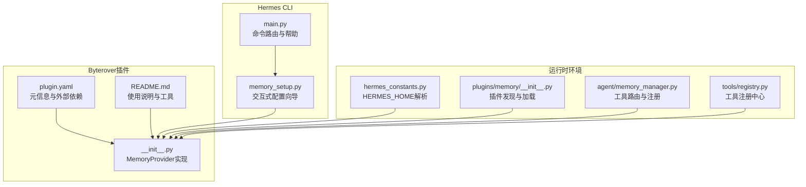
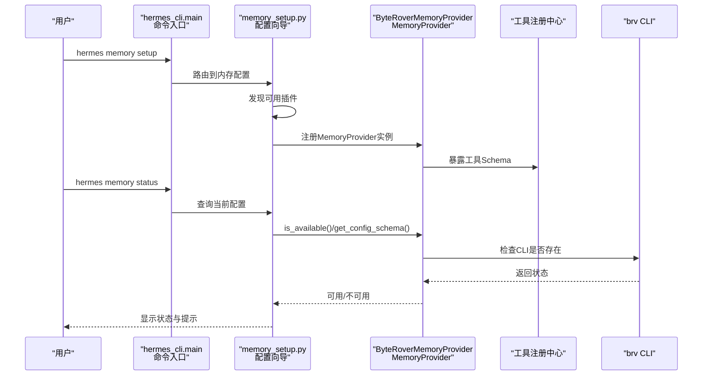
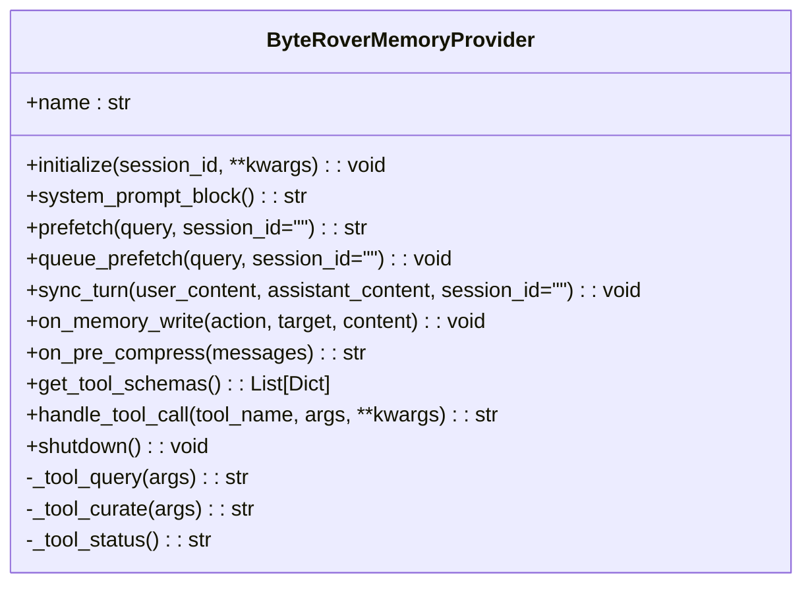
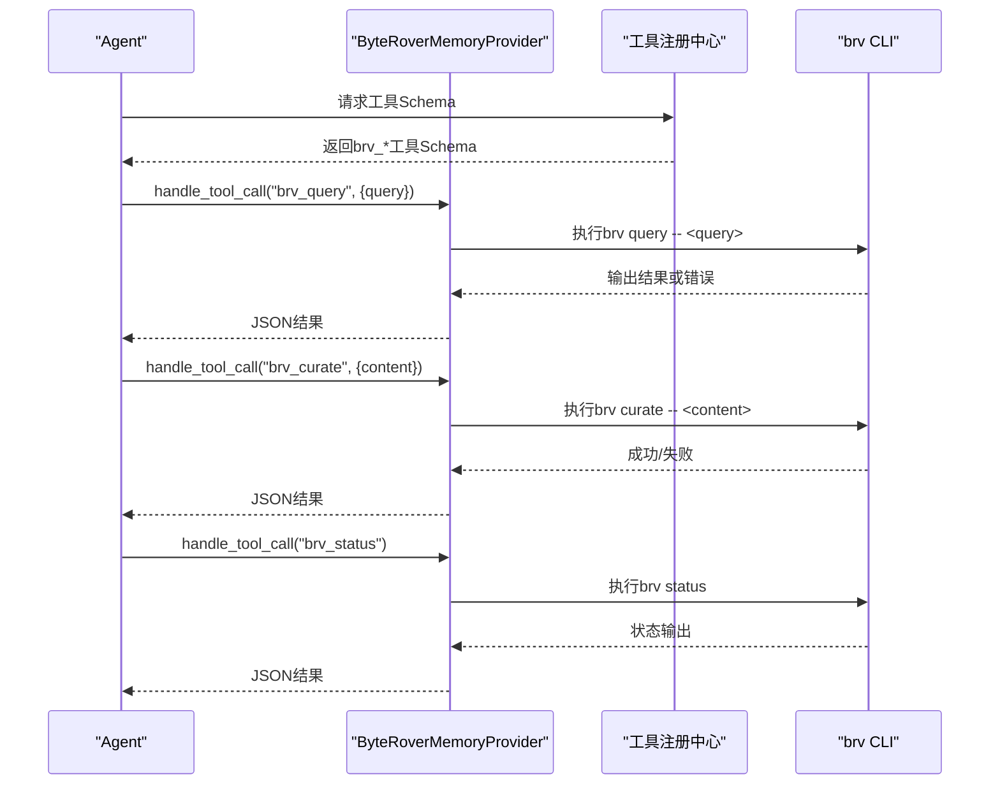
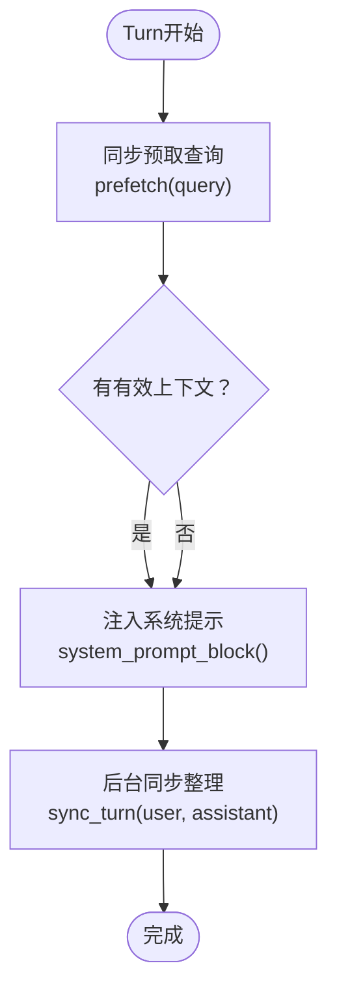
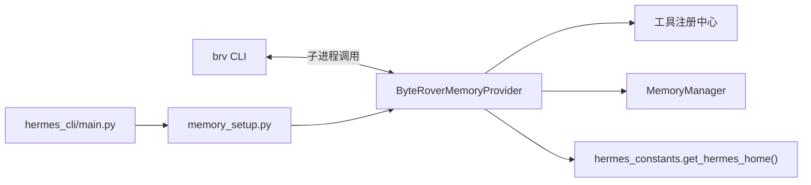

# Byterover记忆插件

<cite>
**本文引用的文件**
- [plugin.yaml](file://plugins/memory/byterover/plugin.yaml)
- [README.md](file://plugins/memory/byterover/README.md)
- [__init__.py](file://plugins/memory/byterover/__init__.py)
- [memory_setup.py](file://hermes_cli/memory_setup.py)
- [main.py](file://hermes_cli/main.py)
- [hermes_constants.py](file://hermes_constants.py)
- [plugins/memory/__init__.py](file://plugins/memory/__init__.py)
- [memory_manager.py](file://agent/memory_manager.py)
- [registry.py](file://tools/registry.py)
</cite>

## 目录
1. [简介](#简介)
2. [项目结构](#项目结构)
3. [核心组件](#核心组件)
4. [架构总览](#架构总览)
5. [详细组件分析](#详细组件分析)
6. [依赖关系分析](#依赖关系分析)
7. [性能与适用性](#性能与适用性)
8. [安装与配置指南](#安装与配置指南)
9. [使用示例与最佳实践](#使用示例与最佳实践)
10. [与其他记忆插件的对比](#与其他记忆插件的对比)
11. [故障排查](#故障排查)
12. [结论](#结论)

## 简介
Byterover记忆插件通过外部的brv命令行工具（ByteRover CLI）提供持久化知识树的记忆能力。它采用分层检索机制：先进行模糊文本搜索，再由LLM驱动的搜索进一步精炼，支持本地优先、可选云端同步。插件以MemoryProvider接口实现，暴露三个工具：查询知识树、整理记忆、检查状态，并在会话中自动同步对话内容到知识树，同时支持预压缩时的上下文提取。

## 项目结构
Byterover插件位于plugins/memory/byterover目录，包含：
- plugin.yaml：插件元信息与外部依赖声明
- README.md：使用说明、配置与工具列表
- __init__.py：MemoryProvider实现、工具Schema、CLI集成入口

**图表来源**
- [plugin.yaml:1-10](file://plugins/memory/byterover/plugin.yaml#L1-L10)
- [README.md:1-42](file://plugins/memory/byterover/README.md#L1-L42)
- [__init__.py:1-384](file://plugins/memory/byterover/__init__.py#L1-L384)
- [memory_setup.py:1-452](file://hermes_cli/memory_setup.py#L1-L452)
- [main.py:5265-5296](file://hermes_cli/main.py#L5265-L5296)
- [hermes_constants.py:11-17](file://hermes_constants.py#L11-L17)
- [plugins/memory/__init__.py:79-317](file://plugins/memory/__init__.py#L79-L317)
- [memory_manager.py:104-141](file://agent/memory_manager.py#L104-L141)
- [registry.py:48-200](file://tools/registry.py#L48-L200)

**章节来源**
- [plugin.yaml:1-10](file://plugins/memory/byterover/plugin.yaml#L1-L10)
- [README.md:1-42](file://plugins/memory/byterover/README.md#L1-L42)
- [__init__.py:1-384](file://plugins/memory/byterover/__init__.py#L1-L384)

## 核心组件
- MemoryProvider实现：ByteRoverMemoryProvider，负责初始化、系统提示注入、预取查询、后台同步、工具调用处理与关闭。
- 工具Schema：brv_query、brv_curate、brv_status，分别对应查询、整理与状态检查。
- CLI集成：通过register(ctx)注册为内存提供者；CLI向导支持交互式选择与配置。
- 运行时路径：$HERMES_HOME/byterover，按配置文件作用域隔离。

关键要点
- 预取查询在turn开始时同步执行，确保模型调用前获得上下文。
- 后台线程异步整理对话内容，避免阻塞主流程。
- 工具调用统一走handle_tool_call路由，返回JSON结果。

**章节来源**
- [__init__.py:171-384](file://plugins/memory/byterover/__init__.py#L171-L384)
- [__init__.py:126-164](file://plugins/memory/byterover/__init__.py#L126-L164)
- [__init__.py:314-324](file://plugins/memory/byterover/__init__.py#L314-L324)

## 架构总览
Byterover插件通过brv CLI与外部知识树交互，内部以MemoryProvider接口对接Hermes Agent的工具系统与内存管理。

**图表来源**
- [main.py:5265-5296](file://hermes_cli/main.py#L5265-L5296)
- [memory_setup.py:143-176](file://hermes_cli/memory_setup.py#L143-L176)
- [memory_setup.py:183-217](file://hermes_cli/memory_setup.py#L183-L217)
- [memory_setup.py:382-436](file://hermes_cli/memory_setup.py#L382-L436)
- [__init__.py:171-384](file://plugins/memory/byterover/__init__.py#L171-L384)

## 详细组件分析

### MemoryProvider实现（ByteRoverMemoryProvider）
职责与行为
- 初始化：确定工作目录（$HERMES_HOME/byterover），准备会话标识与计数器。
- 系统提示：当brv可用时，注入提示，引导使用brv_query/brv_curate/brv_status。
- 预取查询：在turn开始时同步执行brv query，过滤噪声后返回上下文。
- 后台同步：将用户与助手对话内容合并，异步调用brv curate，避免阻塞。
- 内存写入镜像：内置记忆写入（如用户档案、代理记忆）通过brv curate同步到知识树。
- 预压缩刷新：在上下文压缩前，将最近消息摘要写入知识树，保留重要上下文。
- 工具调用：统一处理brv_query、brv_curate、brv_status，返回JSON结果。
- 关闭：等待后台同步线程结束，保证数据落盘。

**图表来源**
- [__init__.py:171-384](file://plugins/memory/byterover/__init__.py#L171-L384)

**章节来源**
- [__init__.py:171-384](file://plugins/memory/byterover/__init__.py#L171-L384)

### 工具Schema与调用流程
- brv_query：对知识树进行查询，返回结构化结果或“未找到”提示。
- brv_curate：将内容整理到知识树，支持LLM分类与组织。
- brv_status：返回CLI版本、树统计与同步状态。

**图表来源**
- [__init__.py:126-164](file://plugins/memory/byterover/__init__.py#L126-L164)
- [__init__.py:314-374](file://plugins/memory/byterover/__init__.py#L314-L374)

**章节来源**
- [__init__.py:126-164](file://plugins/memory/byterover/__init__.py#L126-L164)
- [__init__.py:314-374](file://plugins/memory/byterover/__init__.py#L314-L374)

### 预取与后台同步流程
- 预取：在turn开始时同步执行brv query，过滤过短结果，返回上下文块。
- 后台同步：将对话内容合并后异步curate，避免阻塞；若上次同步仍在进行则等待。
- 预压缩刷新：在压缩前将最近消息摘要写入知识树，保留关键上下文。

**图表来源**
- [__init__.py:215-262](file://plugins/memory/byterover/__init__.py#L215-L262)
- [__init__.py:237-262](file://plugins/memory/byterover/__init__.py#L237-L262)

**章节来源**
- [__init__.py:215-262](file://plugins/memory/byterover/__init__.py#L215-L262)

## 依赖关系分析
- 外部依赖：brv CLI（通过plugin.yaml声明安装与检测命令）。
- 内部依赖：MemoryProvider接口、工具注册中心、内存管理器、CLI配置向导。
- 运行时路径：$HERMES_HOME/byterover，按配置文件作用域隔离。

**图表来源**
- [__init__.py:78-114](file://plugins/memory/byterover/__init__.py#L78-L114)
- [__init__.py:116-119](file://plugins/memory/byterover/__init__.py#L116-L119)
- [memory_setup.py:143-176](file://hermes_cli/memory_setup.py#L143-L176)
- [main.py:5265-5296](file://hermes_cli/main.py#L5265-L5296)
- [hermes_constants.py:11-17](file://hermes_constants.py#L11-L17)

**章节来源**
- [plugin.yaml:4-7](file://plugins/memory/byterover/plugin.yaml#L4-L7)
- [__init__.py:78-114](file://plugins/memory/byterover/__init__.py#L78-L114)
- [hermes_constants.py:11-17](file://hermes_constants.py#L11-L17)

## 性能与适用性
- 查询延迟：查询超时约10秒，适合快速上下文检索。
- 整理延迟：整理超时约120秒，允许LLM处理与分类。
- 噪声过滤：最小查询长度与最小输出长度阈值，减少无效上下文。
- 异步处理：后台线程避免阻塞主流程，提升吞吐。
- 适用场景：需要跨会话持久化知识、偏好与决策沉淀；对检索速度敏感但可接受一定延迟的场景。
- 限制条件：需安装brv CLI；云端功能依赖API密钥；工作目录位于$HERMES_HOME/byterover。

**章节来源**
- [__init__.py:34-40](file://plugins/memory/byterover/__init__.py#L34-L40)
- [__init__.py:215-262](file://plugins/memory/byterover/__init__.py#L215-L262)

## 安装与配置指南

### 安装brv CLI
- 通过脚本安装：参见plugin.yaml中的安装与检测命令。
- 或通过npm安装：参见README中的安装说明。

**章节来源**
- [plugin.yaml:4-7](file://plugins/memory/byterover/plugin.yaml#L4-L7)
- [README.md:7-12](file://plugins/memory/byterover/README.md#L7-L12)

### 通过CLI配置插件
- 交互式配置：hermes memory setup，选择byterover，按提示输入BRV_API_KEY（可选）。
- 手动配置：hermes config set memory.provider byterover；可选地在~/.hermes/.env中添加BRV_API_KEY。

**章节来源**
- [README.md:14-25](file://plugins/memory/byterover/README.md#L14-L25)
- [memory_setup.py:219-350](file://hermes_cli/memory_setup.py#L219-L350)

### 插件元信息与配置项
- 元信息：名称、版本、描述、外部依赖声明。
- 配置项：BRV_API_KEY（可选，用于云端同步）。

**章节来源**
- [plugin.yaml:1-10](file://plugins/memory/byterover/plugin.yaml#L1-L10)
- [__init__.py:12-15](file://plugins/memory/byterover/__init__.py#L12-L15)

## 使用示例与最佳实践

### 示例：查询知识树
- 工具名：brv_query
- 参数：query（必填）
- 结果：JSON对象，包含result字段；若无相关内容返回“未找到”提示。

**章节来源**
- [__init__.py:126-141](file://plugins/memory/byterover/__init__.py#L126-L141)
- [__init__.py:332-353](file://plugins/memory/byterover/__init__.py#L332-L353)

### 示例：整理记忆
- 工具名：brv_curate
- 参数：content（必填）
- 结果：JSON对象，包含操作成功提示。

**章节来源**
- [__init__.py:143-158](file://plugins/memory/byterover/__init__.py#L143-L158)
- [__init__.py:355-368](file://plugins/memory/byterover/__init__.py#L355-L368)

### 示例：检查状态
- 工具名：brv_status
- 结果：JSON对象，包含status字段。

**章节来源**
- [__init__.py:160-164](file://plugins/memory/byterover/__init__.py#L160-L164)
- [__init__.py:370-374](file://plugins/memory/byterover/__init__.py#L370-L374)

### 最佳实践
- 在会话开始时使用brv_query获取上下文，减少重复检索。
- 将重要的用户偏好、决策与模式通过brv_curate沉淀，便于后续检索。
- 定期使用brv_status检查树规模与同步状态，确保云端同步正常。
- 对于长对话，利用预压缩刷新保留关键上下文，避免信息丢失。

**章节来源**
- [__init__.py:282-312](file://plugins/memory/byterover/__init__.py#L282-L312)

## 与其他记忆插件的对比
- Honcho：强调用户建模与对话式推理，提供profile/search/context/conclude等工具，适合需要复杂用户画像的场景。
- Supermemory：提供容器化记忆、实体上下文与多模式检索，适合结构化知识管理。
- Byterover：以brv CLI为核心，强调层级知识树与分层检索（模糊→LLM），本地优先且可选云端同步，适合需要跨会话沉淀经验与模式的场景。

**章节来源**
- [plugins/memory/honcho/__init__.py:1-200](file://plugins/memory/honcho/__init__.py#L1-L200)
- [plugins/memory/supermemory/__init__.py:1-200](file://plugins/memory/supermemory/__init__.py#L1-L200)

## 故障排查
常见问题与解决
- brv CLI未安装：检查plugin.yaml中的安装与检测命令；确认PATH或候选路径存在brv。
- 权限问题：确保$HERMES_HOME/byterover目录可读写。
- 超时：查询默认10秒，整理默认120秒；网络慢或知识树过大可能导致超时。
- 云端同步：若启用BRV_API_KEY，请确认密钥有效且网络可达。

定位与诊断
- CLI状态：hermes memory status查看当前配置与可用性。
- 日志：插件内部使用logging记录调试信息，可在日志中查看错误详情。

**章节来源**
- [README.md:33-42](file://plugins/memory/byterover/README.md#L33-L42)
- [memory_setup.py:382-436](file://hermes_cli/memory_setup.py#L382-L436)
- [__init__.py:78-114](file://plugins/memory/byterover/__init__.py#L78-L114)

## 结论
Byterover记忆插件通过brv CLI实现了本地优先的层级知识树与分层检索，具备异步整理、预取上下文与预压缩刷新等特性，适合需要长期沉淀经验与模式的智能体应用。配合CLI配置向导与工具Schema，用户可以快速启用并高效使用该插件。