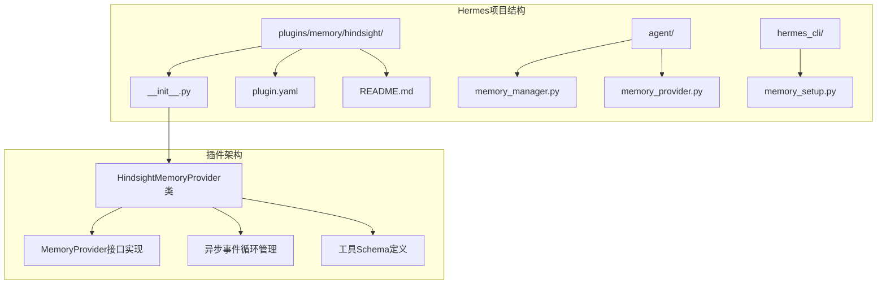
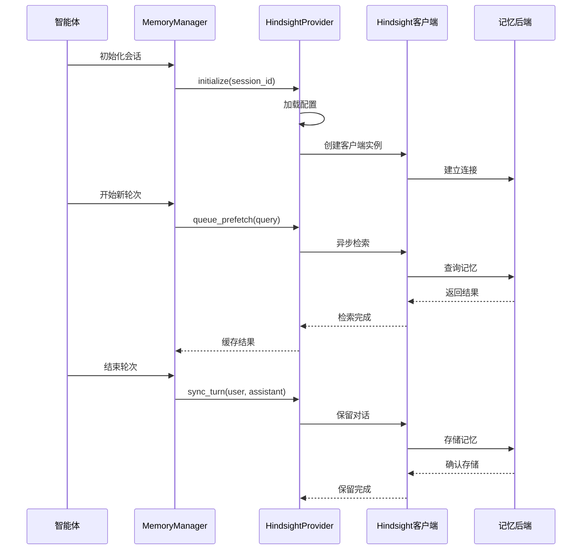
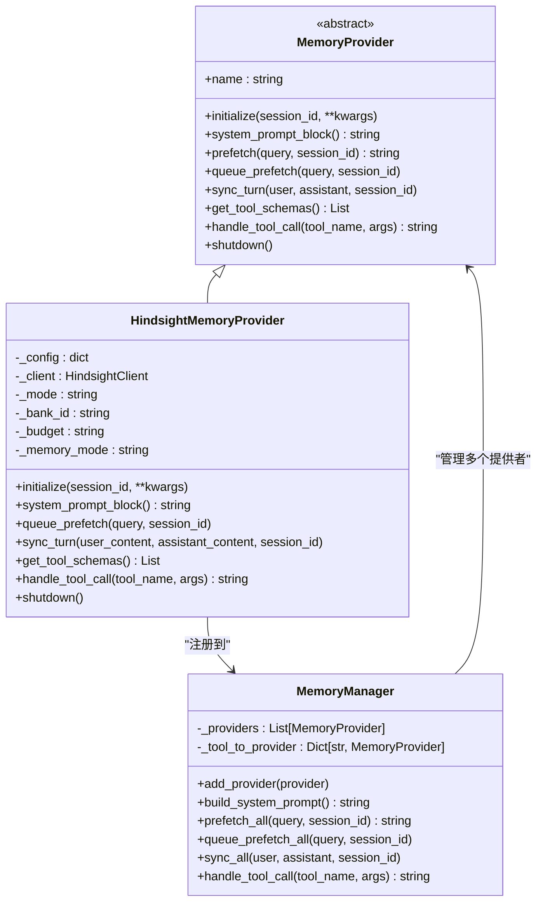
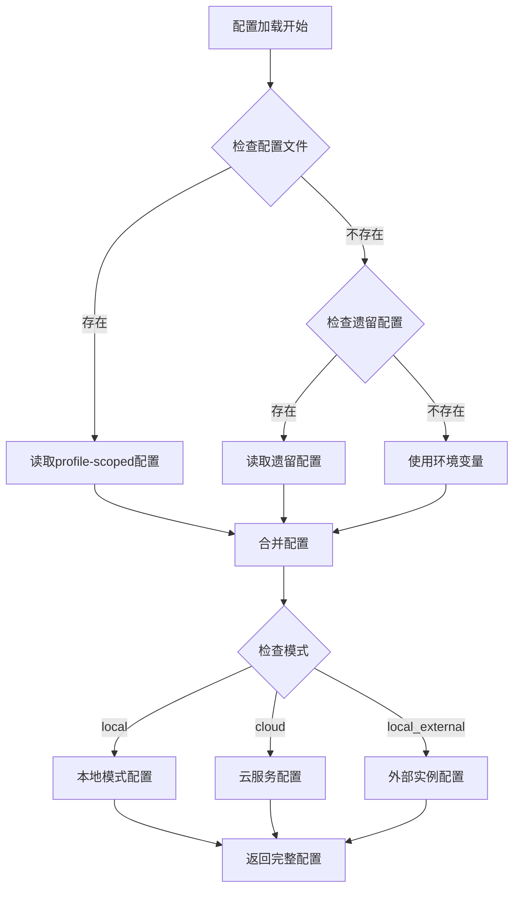
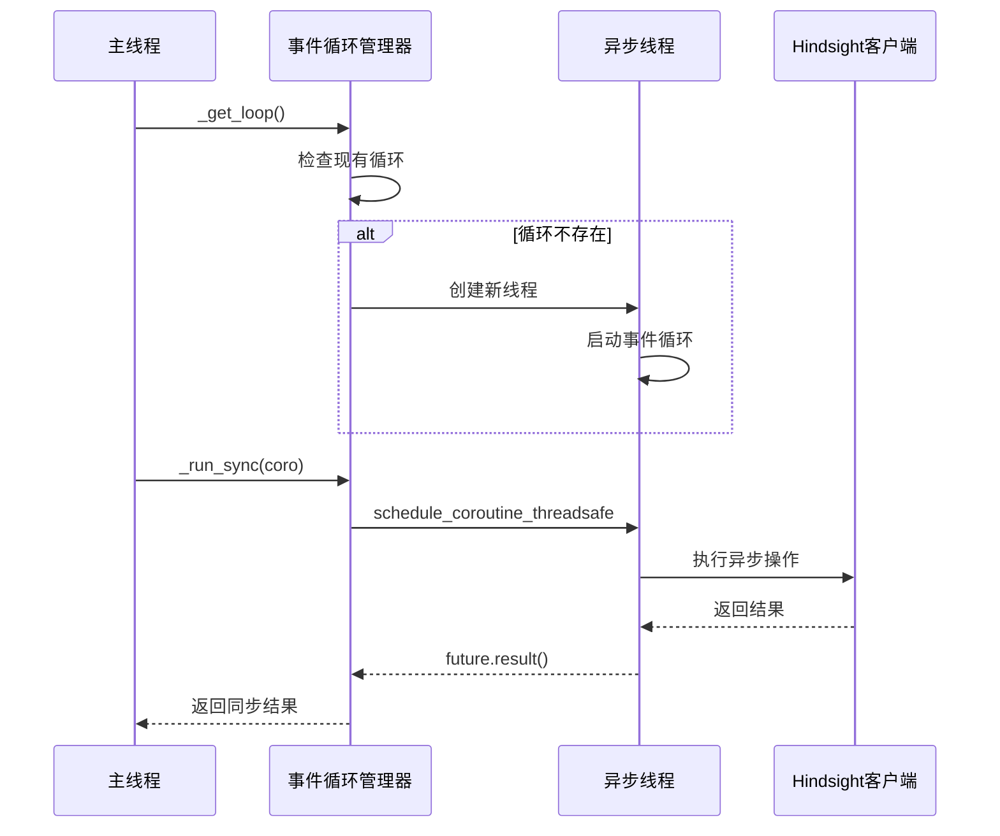
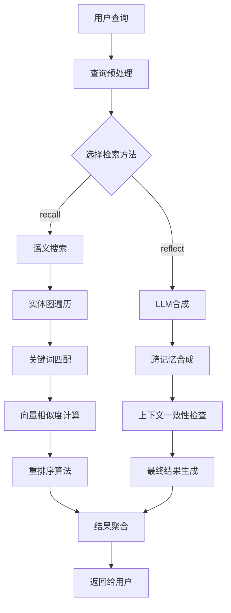
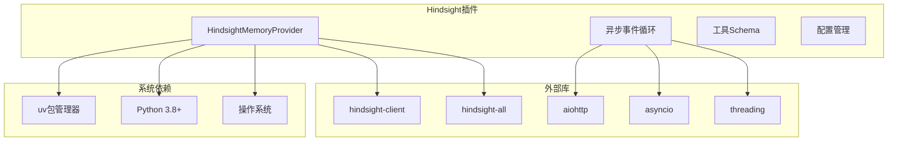
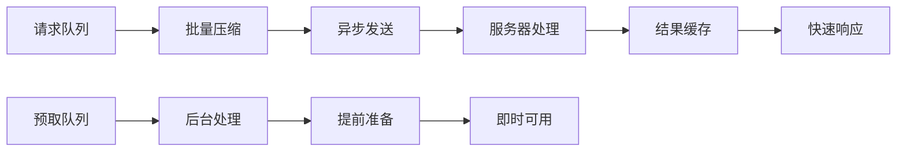

# Hindsight记忆插件

<cite>
**本文档引用的文件**
- [plugins/memory/hindsight/__init__.py](file://plugins/memory/hindsight/__init__.py)
- [plugins/memory/hindsight/plugin.yaml](file://plugins/memory/hindsight/plugin.yaml)
- [plugins/memory/hindsight/README.md](file://plugins/memory/hindsight/README.md)
- [agent/memory_manager.py](file://agent/memory_manager.py)
- [agent/memory_provider.py](file://agent/memory_provider.py)
- [hermes_cli/memory_setup.py](file://hermes_cli/memory_setup.py)
</cite>

## 目录
1. [简介](#简介)
2. [项目结构](#项目结构)
3. [核心组件](#核心组件)
4. [架构概览](#架构概览)
5. [详细组件分析](#详细组件分析)
6. [依赖关系分析](#依赖关系分析)
7. [性能考虑](#性能考虑)
8. [故障排除指南](#故障排除指南)
9. [结论](#结论)
10. [附录](#附录)

## 简介

Hindsight记忆插件是一个强大的长期记忆解决方案，专为Hermes智能体设计。该插件提供了多策略检索、知识图谱构建、实体解析和时间感知记忆管理功能。

### 主要特性

- **多模式支持**：云服务、本地嵌入式和本地外部实例
- **多策略检索**：语义搜索、关键词匹配、实体图遍历和重排序
- **知识图谱**：自动提取结构化事实和实体关系
- **时间感知**：支持跨会话持久化和历史上下文保持
- **实体解析**：自动识别和链接相关实体
- **灵活集成**：支持混合、上下文和工具三种集成模式

## 项目结构

Hindsight插件位于Hermes项目的插件系统中，采用标准的插件架构设计：



**图表来源**
- [plugins/memory/hindsight/__init__.py:1-884](file://plugins/memory/hindsight/__init__.py#L1-L884)
- [agent/memory_manager.py:1-363](file://agent/memory_manager.py#L1-L363)
- [agent/memory_provider.py:1-232](file://agent/memory_provider.py#L1-L232)

**章节来源**
- [plugins/memory/hindsight/__init__.py:1-884](file://plugins/memory/hindsight/__init__.py#L1-L884)
- [plugins/memory/hindsight/plugin.yaml:1-9](file://plugins/memory/hindsight/plugin.yaml#L1-L9)

## 核心组件

### HindsightMemoryProvider类

这是插件的核心实现，继承自MemoryProvider抽象基类，提供了完整的记忆管理功能。

#### 主要属性和配置

| 属性名称 | 类型 | 默认值 | 描述 |
|---------|------|--------|------|
| `_mode` | string | "cloud" | 连接模式（cloud/local_embedded/local_external） |
| `_bank_id` | string | "hermes" | 内存银行标识符 |
| `_budget` | string | "mid" | 检索预算（low/mid/high） |
| `_memory_mode` | string | "hybrid" | 集成模式（context/tools/hybrid） |
| `_prefetch_method` | string | "recall" | 自动检索方法（recall/reflect） |
| `_auto_retain` | boolean | True | 自动保留对话轮次 |
| `_auto_recall` | boolean | True | 自动检索记忆 |

#### 关键方法

1. **初始化方法** (`initialize`)
   - 加载配置文件
   - 建立客户端连接
   - 启动后台线程
   - 配置内存模式

2. **检索方法** (`queue_prefetch`/`prefetch`)
   - 支持异步背景检索
   - 缓存检索结果
   - 提供预取机制

3. **保留方法** (`sync_turn`)
   - 批量保存对话轮次
   - 支持异步处理
   - 实体提取和索引

**章节来源**
- [plugins/memory/hindsight/__init__.py:185-556](file://plugins/memory/hindsight/__init__.py#L185-L556)

## 架构概览

Hindsight插件采用分层架构设计，与Hermes核心系统深度集成：



**图表来源**
- [agent/memory_manager.py:167-209](file://agent/memory_manager.py#L167-L209)
- [plugins/memory/hindsight/__init__.py:654-773](file://plugins/memory/hindsight/__init__.py#L654-L773)

### 组件交互流程



**图表来源**
- [agent/memory_provider.py:42-232](file://agent/memory_provider.py#L42-L232)
- [agent/memory_manager.py:72-363](file://agent/memory_manager.py#L72-L363)
- [plugins/memory/hindsight/__init__.py:185-884](file://plugins/memory/hindsight/__init__.py#L185-L884)

## 详细组件分析

### 配置管理系统

Hindsight插件支持多种配置方式，具有灵活的优先级机制：



**图表来源**
- [plugins/memory/hindsight/__init__.py:142-179](file://plugins/memory/hindsight/__init__.py#L142-L179)

#### 配置优先级

1. **Profile-scoped配置** (`$HERMES_HOME/hindsight/config.json`)
2. **遗留配置** (`~/.hindsight/config.json`)
3. **环境变量** (最高优先级)

**章节来源**
- [plugins/memory/hindsight/__init__.py:142-179](file://plugins/memory/hindsight/__init__.py#L142-L179)

### 异步事件循环管理

为了优化性能和避免资源泄漏，插件实现了专用的异步事件循环：



**图表来源**
- [plugins/memory/hindsight/__init__.py:63-84](file://plugins/memory/hindsight/__init__.py#L63-L84)

#### 关键特性

- **单例事件循环**：每个进程只创建一个事件循环
- **后台线程管理**：避免创建临时循环导致的资源泄漏
- **超时控制**：默认120秒超时防止挂起
- **线程安全**：使用锁保护共享状态

**章节来源**
- [plugins/memory/hindsight/__init__.py:63-84](file://plugins/memory/hindsight/__init__.py#L63-L84)

### 工具Schema定义

插件提供了三个核心工具，支持不同的记忆操作：

| 工具名称 | 功能描述 | 参数 | 使用场景 |
|---------|----------|------|----------|
| `hindsight_retain` | 存储信息到长期记忆 | content, context, tags | 主动记忆保留 |
| `hindsight_recall` | 搜索长期记忆 | query, tags, types | 检索相关信息 |
| `hindsight_reflect` | 从长期记忆中合成答案 | query | 复杂问题推理 |

**章节来源**
- [plugins/memory/hindsight/__init__.py:91-136](file://plugins/memory/hindsight/__init__.py#L91-L136)

### 检索算法实现

Hindsight插件实现了多策略检索算法，结合了多种搜索技术：



**图表来源**
- [plugins/memory/hindsight/__init__.py:683-714](file://plugins/memory/hindsight/__init__.py#L683-L714)

#### 检索策略

1. **语义搜索**：基于向量嵌入的相似度匹配
2. **实体图遍历**：利用知识图谱进行关联搜索
3. **关键词匹配**：精确的关键词匹配
4. **重排序算法**：综合多种信号优化结果排序

**章节来源**
- [plugins/memory/hindsight/__init__.py:683-714](file://plugins/memory/hindsight/__init__.py#L683-L714)

## 依赖关系分析

### 外部依赖

Hindsight插件的主要依赖关系如下：



**图表来源**
- [plugins/memory/hindsight/plugin.yaml:4-5](file://plugins/memory/hindsight/plugin.yaml#L4-L5)
- [plugins/memory/hindsight/__init__.py:27-32](file://plugins/memory/hindsight/__init__.py#L27-L32)

### 版本兼容性

| 组件 | 最低版本 | 当前版本 | 兼容性 |
|------|----------|----------|--------|
| hindsight-client | 0.4.22 | 自动检测 | ✅ |
| Python | 3.8 | 运行时检测 | ✅ |
| uv包管理器 | 可选 | 1.0+ | ✅ |

**章节来源**
- [plugins/memory/hindsight/plugin.yaml:4-5](file://plugins/memory/hindsight/plugin.yaml#L4-L5)
- [plugins/memory/hindsight/__init__.py:38-39](file://plugins/memory/hindsight/__init__.py#L38-L39)

## 性能考虑

### 内存管理

Hindsight插件采用了多项内存优化策略：

1. **批量处理**：对话轮次按N批处理，减少网络请求
2. **缓存机制**：预取结果缓存，避免重复检索
3. **异步处理**：非阻塞的后台处理，提高响应速度
4. **连接池**：复用客户端连接，减少建立成本

### 网络优化



**图表来源**
- [plugins/memory/hindsight/__init__.py:715-773](file://plugins/memory/hindsight/__init__.py#L715-L773)

### 性能调优建议

1. **合理设置保留频率**：根据对话复杂度调整`retain_every_n_turns`
2. **优化检索预算**：平衡检索质量和性能
3. **配置合适的标签过滤**：提高检索精度
4. **监控内存使用**：定期清理不需要的记忆

## 故障排除指南

### 常见问题及解决方案

#### 客户端版本问题

**症状**：启动时报错提示客户端版本过低
**解决方案**：
1. 检查当前版本：`pip show hindsight-client`
2. 自动升级：插件会在初始化时尝试升级
3. 手动升级：`uv pip install "hindsight-client>=0.4.22"`

#### 网络连接问题

**症状**：无法连接到Hindsight服务
**解决方案**：
1. 检查API密钥是否正确
2. 验证网络连接状态
3. 确认API端点URL正确
4. 检查防火墙设置

#### 本地模式启动失败

**症状**：本地嵌入式模式无法启动
**解决方案**：
1. 检查LLM API密钥配置
2. 验证本地端点可达性
3. 查看日志文件：`~/.hermes/logs/hindsight-embed.log`
4. 确认端口未被占用

**章节来源**
- [plugins/memory/hindsight/__init__.py:472-496](file://plugins/memory/hindsight/__init__.py#L472-L496)

### 日志和调试

插件提供了详细的日志记录功能：

| 日志级别 | 用途 | 文件位置 |
|----------|------|----------|
| DEBUG | 详细操作跟踪 | 控制台输出 |
| INFO | 关键操作确认 | 控制台输出 |
| WARNING | 警告信息 | 控制台输出 |
| ERROR | 错误详情 | 控制台输出 |

**章节来源**
- [plugins/memory/hindsight/__init__.py:34-35](file://plugins/memory/hindsight/__init__.py#L34-L35)

## 结论

Hindsight记忆插件为Hermes智能体提供了强大而灵活的长期记忆能力。通过其多策略检索、知识图谱构建和时间感知特性，显著提升了智能体的上下文保持能力和决策质量。

### 主要优势

1. **多模式支持**：适应不同部署需求
2. **高性能设计**：异步处理和缓存机制
3. **灵活配置**：丰富的参数调节选项
4. **易于集成**：标准化的插件接口
5. **可靠维护**：完善的错误处理和日志记录

### 发展前景

随着大语言模型技术的不断发展，Hindsight插件将继续演进，提供更强大的记忆管理和推理能力，为构建真正智能的AI助手奠定坚实基础。

## 附录

### 安装和配置步骤

1. **基本安装**
   ```bash
   hermes memory setup
   # 选择"hindsight"选项
   ```

2. **手动配置**
   ```bash
   hermes config set memory.provider hindsight
   echo "HINDSIGHT_API_KEY=your-key" >> ~/.hermes/.env
   ```

3. **验证安装**
   ```bash
   hermes memory status
   ```

### 配置文件示例

完整的配置文件路径：`~/.hermes/hindsight/config.json`

### 环境变量参考

| 变量名 | 描述 | 默认值 |
|--------|------|--------|
| `HINDSIGHT_API_KEY` | Hindsight云服务API密钥 | 无 |
| `HINDSIGHT_LLM_API_KEY` | 本地模式LLM API密钥 | 无 |
| `HINDSIGHT_API_URL` | API端点URL | `https://api.hindsight.vectorize.io` |
| `HINDSIGHT_BANK_ID` | 内存银行ID | `hermes` |
| `HINDSIGHT_BUDGET` | 检索预算 | `mid` |
| `HINDSIGHT_MODE` | 连接模式 | `cloud` |