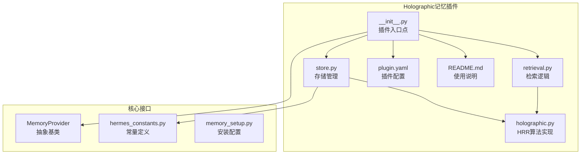
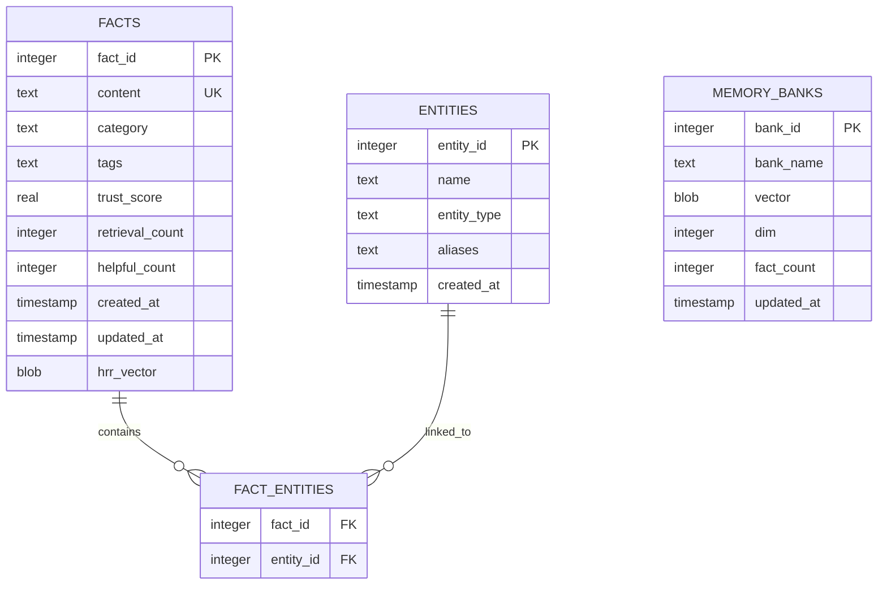
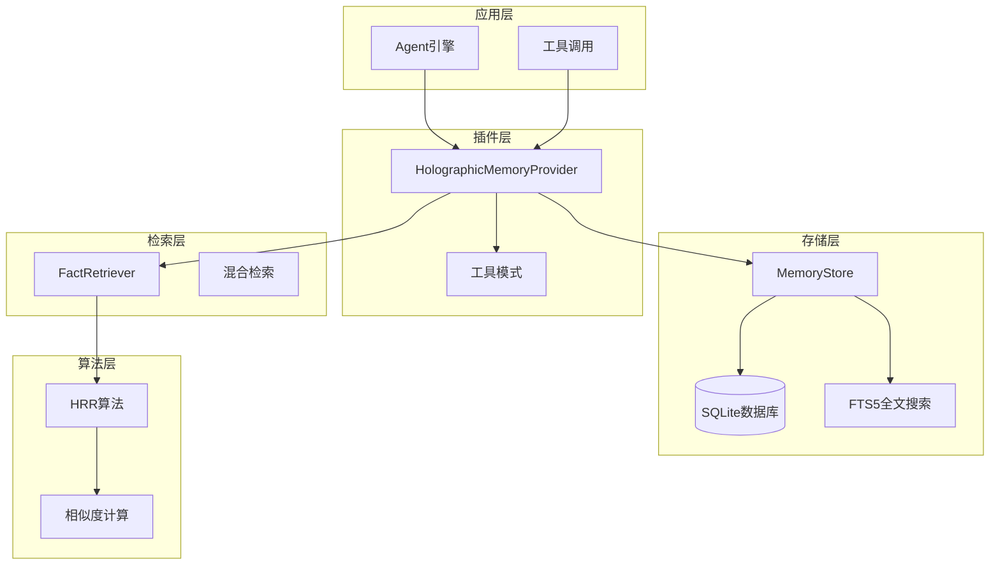
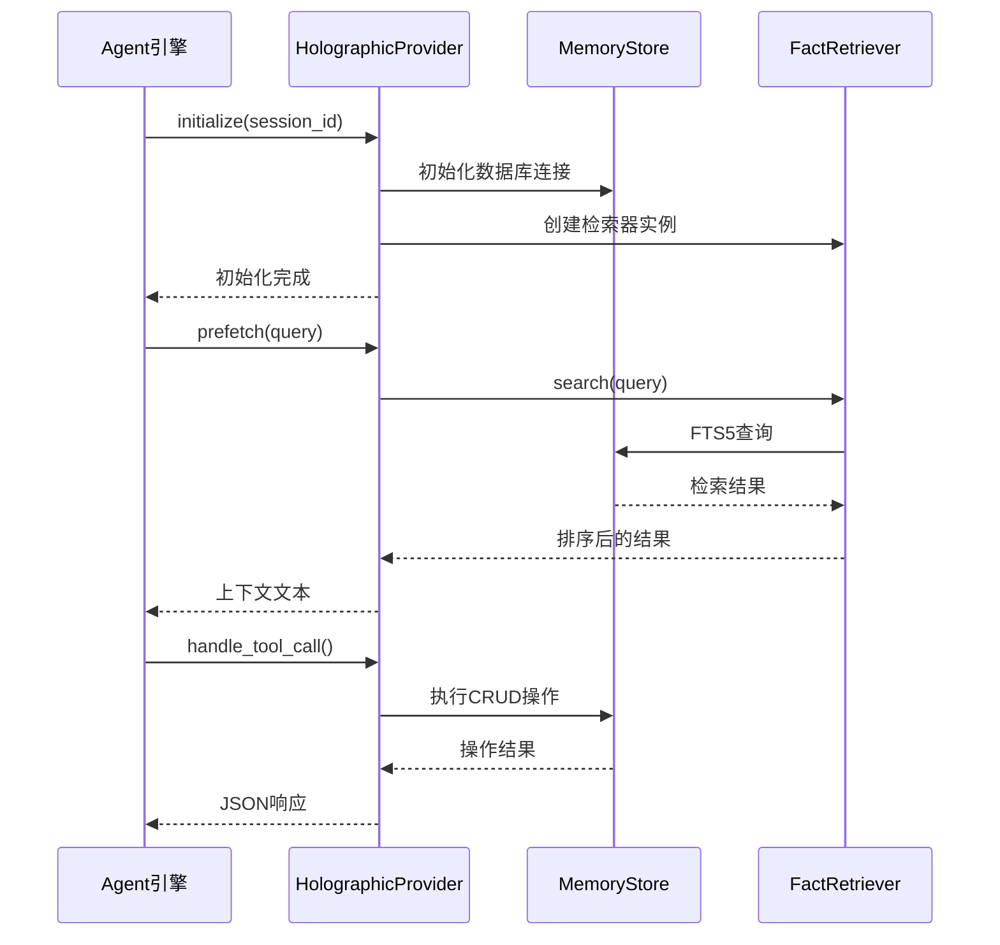
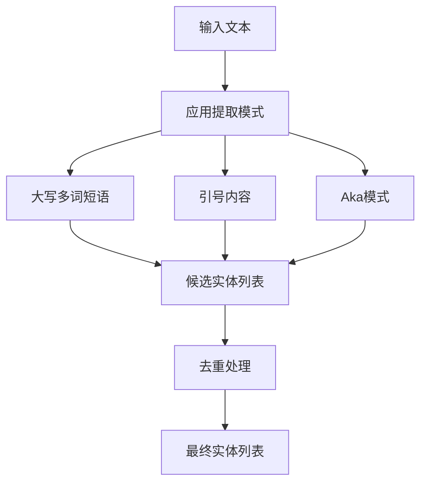
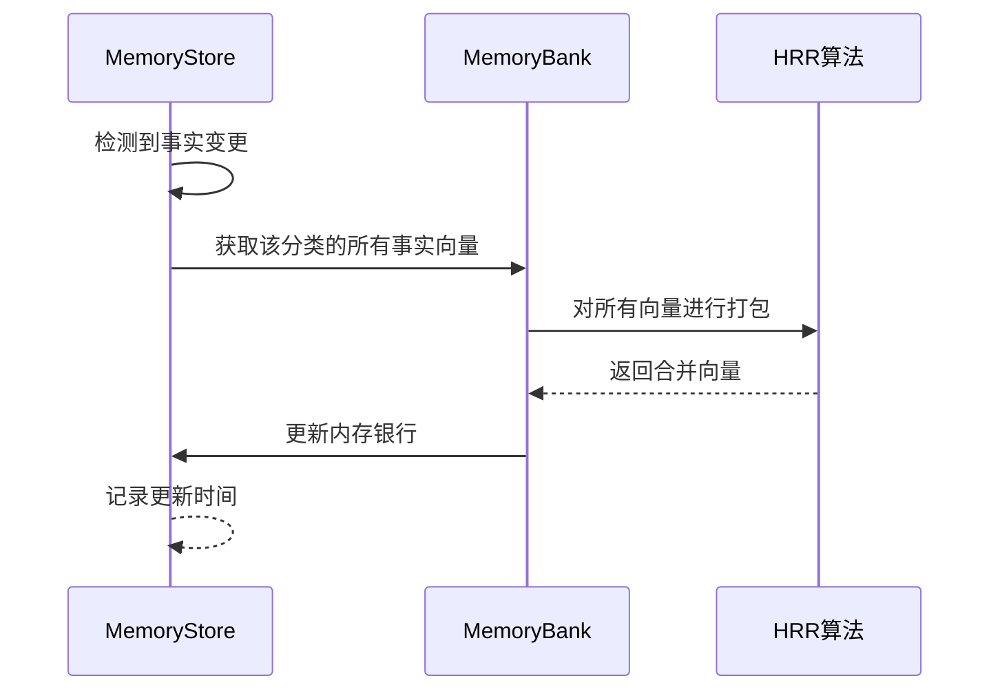
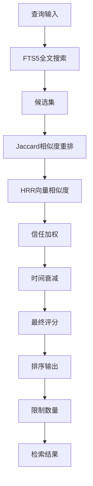
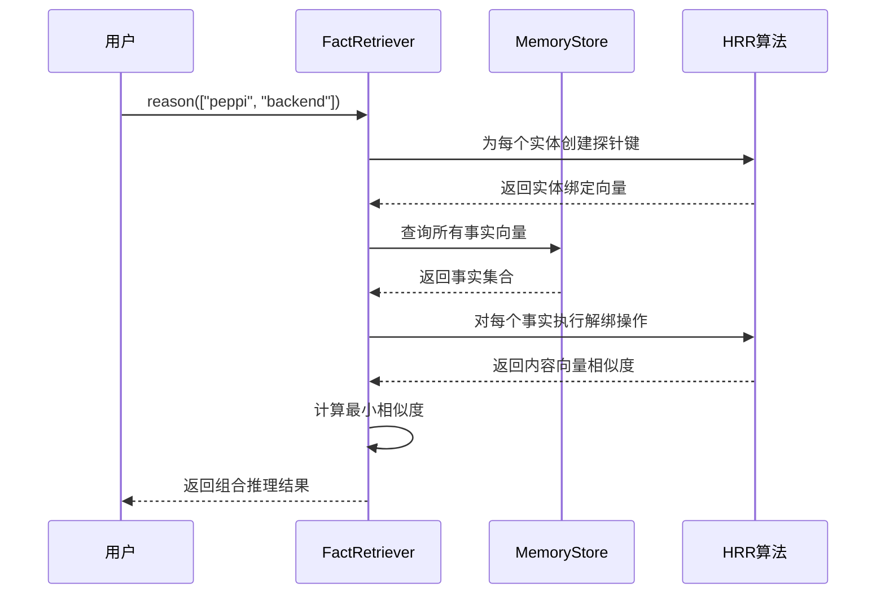
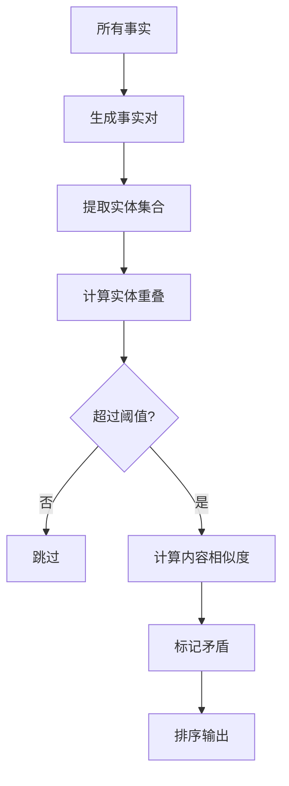
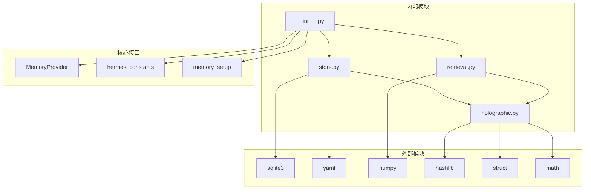

# Holographic记忆插件

<cite>
**本文档引用的文件**
- [holographic.py](file://plugins/memory/holographic/holographic.py)
- [store.py](file://plugins/memory/holographic/store.py)
- [retrieval.py](file://plugins/memory/holographic/retrieval.py)
- [__init__.py](file://plugins/memory/holographic/__init__.py)
- [plugin.yaml](file://plugins/memory/holographic/plugin.yaml)
- [README.md](file://plugins/memory/holographic/README.md)
- [memory_provider.py](file://agent/memory_provider.py)
- [hermes_constants.py](file://hermes_constants.py)
- [memory_setup.py](file://hermes_cli/memory_setup.py)
</cite>

## 目录
1. [简介](#简介)
2. [项目结构](#项目结构)
3. [核心组件](#核心组件)
4. [架构概览](#架构概览)
5. [详细组件分析](#详细组件分析)
6. [依赖关系分析](#依赖关系分析)
7. [性能考虑](#性能考虑)
8. [故障排除指南](#故障排除指南)
9. [结论](#结论)

## 简介

Holographic记忆插件是一个基于全息记忆理论的本地SQLite事实存储系统，结合了分布式存储、内容寻址和去中心化检索功能。该插件实现了Holographic Reduced Representations (HRR)向量符号架构，提供了结构化的事实存储、实体解析、信任评分和组合式检索能力。

该插件的核心创新在于：
- 使用相位向量编码实现稳定的分布式表示
- 基于角色绑定的组合式检索机制
- 实体解析和关系推理能力
- 信任评分驱动的记忆质量控制
- SQLite本地存储和FTS5全文搜索

## 项目结构

Holographic记忆插件位于`plugins/memory/holographic/`目录下，包含以下核心文件：



**图表来源**
- [__init__.py:1-408](file://plugins/memory/holographic/__init__.py#L1-L408)
- [holographic.py:1-204](file://plugins/memory/holographic/holographic.py#L1-L204)
- [store.py:1-575](file://plugins/memory/holographic/store.py#L1-L575)
- [retrieval.py:1-594](file://plugins/memory/holographic/retrieval.py#L1-L594)

**章节来源**
- [__init__.py:1-408](file://plugins/memory/holographic/__init__.py#L1-L408)
- [plugin.yaml:1-6](file://plugins/memory/holographic/plugin.yaml#L1-L6)

## 核心组件

### HRR算法模块 (holographic.py)

HRR（全息记忆还原）算法是该插件的核心数学基础，实现了向量符号架构：

#### 核心算法特性
- **相位向量编码**：使用SHA-256生成确定性相位向量
- **代数运算**：绑定（bind）、解绑（unbind）、打包（bundle）
- **稳定性保证**：避免传统复数HRR的幅度崩溃问题
- **跨平台兼容**：使用纯Python实现确保可移植性

#### 主要函数
- `encode_atom()`: 原子向量编码
- `bind()`: 向量绑定操作
- `unbind()`: 向量解绑操作  
- `bundle()`: 多向量打包
- `similarity()`: 相位余弦相似度计算

### 存储管理模块 (store.py)

MemoryStore类提供了SQLite数据库驱动的事实存储系统：

#### 数据模型


**图表来源**
- [store.py:16-76](file://plugins/memory/holographic/store.py#L16-L76)

#### 核心功能
- **事实存储**：去重、分类、标签管理
- **实体解析**：正则表达式提取实体名称
- **信任评分**：用户反馈驱动的信任调整
- **HRR向量**：分布式内存银行构建

### 检索模块 (retrieval.py)

FactRetriever类实现了多策略混合检索系统：

#### 检索策略
1. **FTS5全文搜索**：基于SQLite FTS5的关键词匹配
2. **Jaccard相似度重排**：基于词元重叠的语义增强
3. **HRR向量相似度**：基于相位向量的组合式检索
4. **信任加权**：基于用户反馈的质量排序

#### 检索类型
- `search()`: 关键词搜索
- `probe()`: 实体探测
- `related()`: 结构关联发现
- `reason()`: 组合推理
- `contradict()`: 矛盾检测

**章节来源**
- [holographic.py:1-204](file://plugins/memory/holographic/holographic.py#L1-L204)
- [store.py:1-575](file://plugins/memory/holographic/store.py#L1-L575)
- [retrieval.py:1-594](file://plugins/memory/holographic/retrieval.py#L1-L594)

## 架构概览

Holographic记忆插件采用分层架构设计，实现了从底层存储到高层检索的完整数据处理链路：



**图表来源**
- [__init__.py:114-255](file://plugins/memory/holographic/__init__.py#L114-L255)
- [store.py:98-123](file://plugins/memory/holographic/store.py#L98-L123)
- [retrieval.py:22-47](file://plugins/memory/holographic/retrieval.py#L22-L47)

### 插件生命周期



**图表来源**
- [__init__.py:157-255](file://plugins/memory/holographic/__init__.py#L157-L255)
- [retrieval.py:48-112](file://plugins/memory/holographic/retrieval.py#L48-L112)
- [store.py:142-185](file://plugins/memory/holographic/store.py#L142-L185)

**章节来源**
- [__init__.py:114-255](file://plugins/memory/holographic/__init__.py#L114-L255)
- [memory_provider.py:42-232](file://agent/memory_provider.py#L42-L232)

## 详细组件分析

### HRR算法实现

HRR（全息记忆还原）算法是该插件的核心数学基础，实现了向量符号架构：

#### 相位向量编码

```mermaid
flowchart TD
Start[输入单词] --> Hash[SHA-256哈希]
Hash --> Blocks[计算需要的块数]
Blocks --> Generate[生成uint16值序列]
Generate --> Scale[缩放到[0, 2π)范围]
Scale --> Truncate[截断到指定维度]
Truncate --> Return[返回相位向量]
```

**图表来源**
- [holographic.py:43-67](file://plugins/memory/holographic/holographic.py#L43-L67)

#### 代数运算实现

| 运算类型 | 数学实现 | Python实现 |
|---------|---------|-----------|
| 绑定 (bind) | 相位向量相加 | `(a + b) % 2π` |
| 解绑 (unbind) | 相位向量相减 | `(memory - key) % 2π` |
| 打包 (bundle) | 复数指数平均 | `np.angle(sum(exp(1j*a)))` |

#### 相似度计算

HRR使用相位余弦相似度，范围为[-1, 1]：
- 1.0：完全相同
- 0.0：随机无关
- -1.0：完全相反

**章节来源**
- [holographic.py:43-204](file://plugins/memory/holographic/holographic.py#L43-L204)

### 存储管理系统

MemoryStore类提供了完整的事实存储和管理功能：

#### 实体提取算法



**图表来源**
- [store.py:394-427](file://plugins/memory/holographic/store.py#L394-L427)

#### 信任评分机制

| 操作类型 | 变化值 | 条件 |
|---------|--------|------|
| 有帮助反馈 | +0.05 | helpful=True |
| 无帮助反馈 | -0.10 | helpful=False |
| 最小值 | 0.0 | 信任不低于下限 |
| 最大值 | 1.0 | 信任不高于上限 |

#### 内存银行重建

当事实数量或内容发生变化时，系统会自动重建分类内存银行：



**图表来源**
- [store.py:494-530](file://plugins/memory/holographic/store.py#L494-L530)

**章节来源**
- [store.py:98-575](file://plugins/memory/holographic/store.py#L98-L575)

### 检索系统

FactRetriever实现了多策略混合检索系统：

#### 混合检索管道



**图表来源**
- [retrieval.py:48-112](file://plugins/memory/holographic/retrieval.py#L48-L112)

#### 组合式推理

`reason()`方法实现了真正的组合式推理，能够同时查找与多个实体都相关的事实：



**图表来源**
- [retrieval.py:260-336](file://plugins/memory/holographic/retrieval.py#L260-L336)

#### 矛盾检测

`contradict()`方法能够自动检测潜在的矛盾事实：



**图表来源**
- [retrieval.py:338-442](file://plugins/memory/holographic/retrieval.py#L338-L442)

**章节来源**
- [retrieval.py:22-594](file://plugins/memory/holographic/retrieval.py#L22-L594)

## 依赖关系分析

### 外部依赖

| 依赖项 | 版本要求 | 用途 | 必需性 |
|--------|----------|------|--------|
| SQLite | 内置 | 本地存储 | 必需 |
| NumPy | ≥1.20 | HRR算法 | 可选 |
| YAML | 内置 | 配置文件 | 必需 |
| Python | ≥3.8 | 运行环境 | 必需 |

### 内部依赖关系



**图表来源**
- [__init__.py:25-28](file://plugins/memory/holographic/__init__.py#L25-L28)
- [store.py:6-14](file://plugins/memory/holographic/store.py#L6-L14)
- [holographic.py:22-31](file://plugins/memory/holographic/holographic.py#L22-L31)

### 循环依赖检查

经过分析，该插件没有检测到循环依赖：
- `holographic.py`仅依赖标准库
- `store.py`依赖`holographic.py`和SQLite
- `retrieval.py`依赖`store.py`和`holographic.py`
- `__init__.py`依赖`store.py`、`retrieval.py`和核心接口

**章节来源**
- [__init__.py:25-28](file://plugins/memory/holographic/__init__.py#L25-L28)
- [store.py:6-14](file://plugins/memory/holographic/store.py#L6-L14)
- [holographic.py:22-31](file://plugins/memory/holographic/holographic.py#L22-L31)

## 性能考虑

### 存储性能优化

#### SQLite配置优化
- **WAL模式**：启用写前日志模式提高并发性能
- **索引策略**：为信任评分、类别和实体名称建立索引
- **FTS5集成**：使用虚拟表进行全文搜索优化

#### 内存银行优化
- **增量更新**：只在事实变更时重建相关分类银行
- **SNR估计**：监控信号噪声比防止检索精度下降
- **向量压缩**：使用相位向量避免幅度崩溃

### 检索性能优化

#### 缓存策略
- **预取缓存**：在对话轮次间缓存检索结果
- **向量缓存**：缓存HRR向量减少重复计算
- **实体解析缓存**：缓存实体解析结果

#### 并行处理
- **异步更新**：使用线程锁保护并发访问
- **批量操作**：支持批量事实插入和更新
- **延迟计算**：在需要时才计算HRR向量

### 扩展性考虑

#### 水平扩展
- **多实例支持**：通过会话ID隔离不同实例
- **分布式存储**：可替换为其他数据库后端
- **缓存层**：可添加Redis等缓存系统

#### 垂直扩展
- **向量维度**：根据存储容量调整HRR维度
- **索引优化**：添加更多复合索引
- **分区策略**：按时间或类别分区存储

## 故障排除指南

### 常见问题及解决方案

#### HRR算法相关问题

**问题**：运行时缺少NumPy
**症状**：`RuntimeError: numpy is required for holographic operations`
**解决方案**：
```bash
pip install numpy
```

**问题**：HRR向量计算异常
**症状**：`numpy import error`或`module not found`
**解决方案**：
- 确认NumPy版本兼容性
- 检查Python路径配置
- 重新安装NumPy

#### 存储相关问题

**问题**：数据库连接失败
**症状**：`sqlite3.OperationalError: unable to open database file`
**解决方案**：
- 检查数据库文件权限
- 验证数据库路径存在
- 确认磁盘空间充足

**问题**：实体解析不准确
**症状**：提取的实体名称不符合预期
**解决方案**：
- 调整正则表达式模式
- 手动添加实体别名
- 检查输入文本格式

#### 检索相关问题

**问题**：检索结果质量差
**症状**：FTS5搜索结果不相关
**解决方案**：
- 调整权重参数（fts_weight、jaccard_weight、hrr_weight）
- 增加训练数据改善信任评分
- 优化查询语法

**问题**：性能下降
**症状**：检索响应时间过长
**解决方案**：
- 分析SQL查询计划
- 添加适当的索引
- 考虑增加HRR维度

### 监控指标

#### 核心指标
- **存储指标**：事实数量、实体数量、数据库大小
- **检索指标**：查询响应时间、命中率、召回率
- **性能指标**：HRR计算时间、数据库查询时间、内存使用

#### 健康检查
- **数据库连接**：定期检查连接状态
- **索引完整性**：验证索引有效性
- **向量完整性**：检查HRR向量计算结果

**章节来源**
- [holographic.py:179-204](file://plugins/memory/holographic/holographic.py#L179-L204)
- [store.py:128-136](file://plugins/memory/holographic/store.py#L128-L136)
- [retrieval.py:569-594](file://plugins/memory/holographic/retrieval.py#L569-L594)

## 结论

Holographic记忆插件通过将全息记忆理论与现代软件工程实践相结合，提供了一个强大而灵活的本地记忆系统。其核心优势包括：

### 技术优势
- **理论基础扎实**：基于HRR的数学原理确保了检索的准确性
- **实现简洁高效**：使用纯Python实现，易于维护和部署
- **功能完整丰富**：涵盖了从存储到检索的完整记忆管理功能

### 应用价值
- **本地化部署**：无需网络连接，适合隐私敏感场景
- **可扩展性强**：支持多种优化策略和扩展方案
- **易于集成**：遵循标准的MemoryProvider接口

### 发展前景
随着AI应用对长期记忆需求的增长，Holographic记忆插件为构建更智能、更人性化的AI助手提供了坚实的技术基础。通过持续的优化和扩展，该插件有望成为AI记忆系统的重要组成部分。