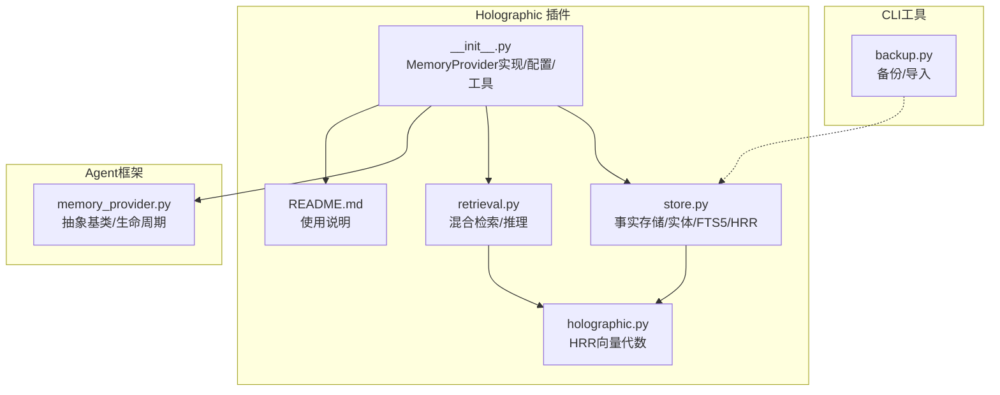
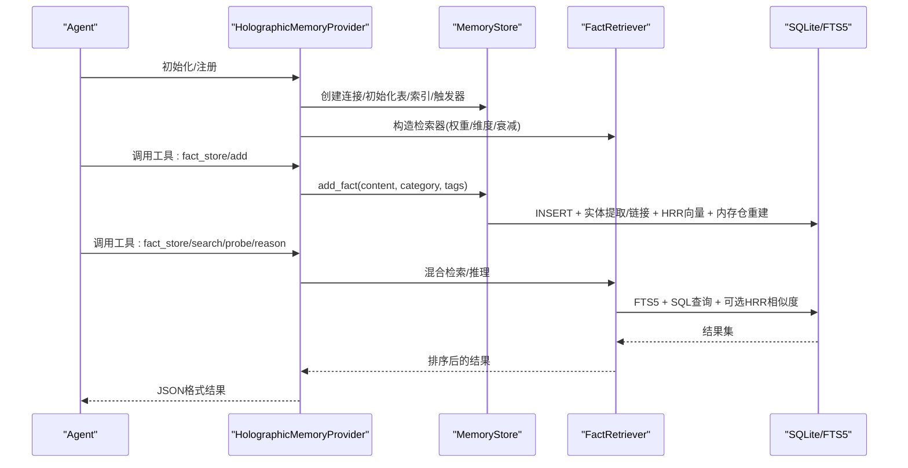
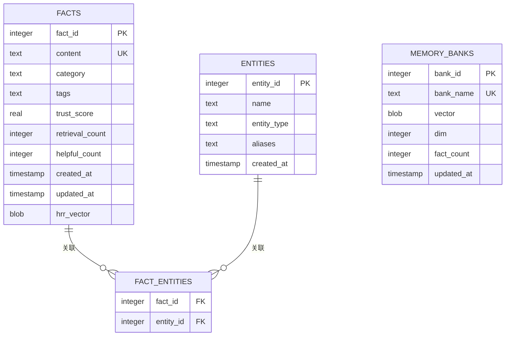
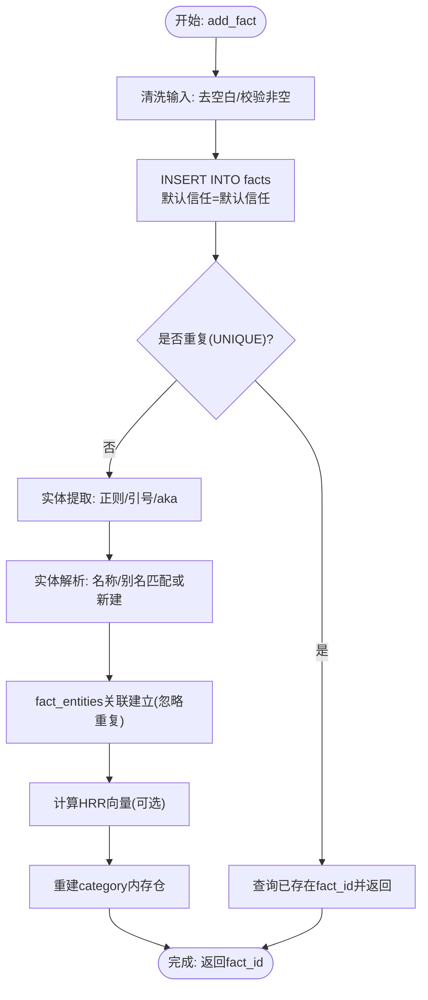
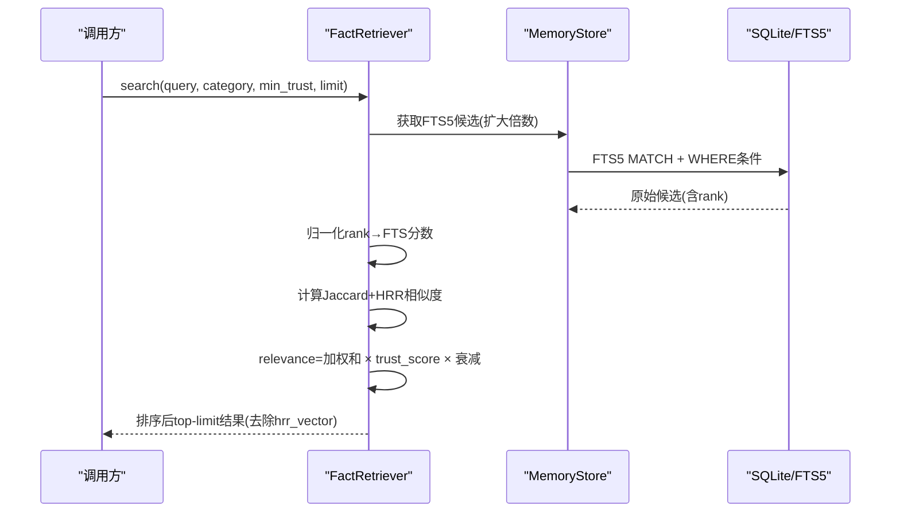
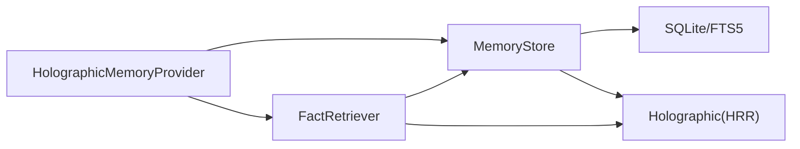

# 存储管理与数据库设计

<cite>
**本文档引用的文件**
- [store.py](file://plugins/memory/holographic/store.py)
- [holographic.py](file://plugins/memory/holographic/holographic.py)
- [retrieval.py](file://plugins/memory/holographic/retrieval.py)
- [__init__.py](file://plugins/memory/holographic/__init__.py)
- [README.md](file://plugins/memory/holographic/README.md)
- [memory_provider.py](file://agent/memory_provider.py)
- [backup.py](file://hermes_cli/backup.py)
</cite>

## 目录
1. [简介](#简介)
2. [项目结构](#项目结构)
3. [核心组件](#核心组件)
4. [架构总览](#架构总览)
5. [详细组件分析](#详细组件分析)
6. [依赖关系分析](#依赖关系分析)
7. [性能考量](#性能考量)
8. [故障排查指南](#故障排查指南)
9. [结论](#结论)
10. [附录](#附录)

## 简介
本文件面向Holographic存储管理系统的技术文档，聚焦于SQLite数据库设计与实现、store.py中的存储逻辑（事实存储、元数据管理、版本控制与事务处理）、数据库配置参数（db_path路径、自动提取、信任评分机制），并提供数据库schema图、查询示例、备份恢复策略、性能监控指标与容量规划建议。该系统通过SQLite本地持久化、FTS5全文检索、实体解析与链接、以及可选的HRR向量编码与组合推理，构建了具备“结构化事实+语义检索+信任评分”的复合记忆体系。

## 项目结构
Holographic插件位于 plugins/memory/holographic/，核心文件包括：
- store.py：SQLite事实存储与实体管理、FTS5触发器、HRR向量计算与内存仓重建
- holographic.py：HRR相位编码与向量代数（绑定/解绑/叠加/相似度）
- retrieval.py：混合检索（FTS5候选+Jaccard重排+信任加权+可选时间衰减/HRR相似度）
- __init__.py：MemoryProvider接口实现、工具Schema、配置项、会话结束自动抽取
- README.md：使用说明与配置项说明
- memory_provider.py：抽象基类定义与生命周期钩子
- backup.py：CLI备份/导入工具（用于数据库文件级备份）

**图表来源**
- [store.py:16-76](file://plugins/memory/holographic/store.py#L16-L76)
- [holographic.py:1-204](file://plugins/memory/holographic/holographic.py#L1-L204)
- [retrieval.py:1-594](file://plugins/memory/holographic/retrieval.py#L1-L594)
- [__init__.py:1-408](file://plugins/memory/holographic/__init__.py#L1-L408)
- [memory_provider.py:1-232](file://agent/memory_provider.py#L1-L232)
- [backup.py:79-188](file://hermes_cli/backup.py#L79-L188)

**章节来源**
- [README.md:1-37](file://plugins/memory/holographic/README.md#L1-L37)
- [__init__.py:1-408](file://plugins/memory/holographic/__init__.py#L1-L408)

## 核心组件
- MemoryStore：SQLite事实存储核心，负责建表/索引/触发器初始化、事实增删改查、实体提取与链接、HRR向量计算与内存仓重建、信任评分反馈与更新。
- FactRetriever：混合检索与推理引擎，结合FTS5、Jaccard相似度、信任权重与可选时间衰减；在有HRR可用时支持probe/related/reason/contradict等组合推理。
- Holographic（holographic.py）：HRR相位向量编码与代数运算，提供确定性原子向量、绑定/解绑/叠加、相似度计算与序列化。
- HolographicMemoryProvider（__init__.py）：实现MemoryProvider接口，暴露fact_store/fact_feedback工具，加载配置、初始化MemoryStore与FactRetriever，并在会话结束时按需自动抽取事实。

**章节来源**
- [store.py:98-575](file://plugins/memory/holographic/store.py#L98-L575)
- [retrieval.py:22-594](file://plugins/memory/holographic/retrieval.py#L22-L594)
- [holographic.py:1-204](file://plugins/memory/holographic/holographic.py#L1-L204)
- [__init__.py:114-408](file://plugins/memory/holographic/__init__.py#L114-L408)

## 架构总览
系统采用“本地SQLite + FTS5 + 可选HRR向量”的混合架构。MemoryStore负责事实与实体的持久化与一致性；FactRetriever提供多策略检索与组合推理；Holographic提供向量空间的结构化表示；MemoryProvider作为Agent侧的统一入口，注入工具Schema并处理生命周期钩子。

**图表来源**
- [__init__.py:258-344](file://plugins/memory/holographic/__init__.py#L258-L344)
- [store.py:142-185](file://plugins/memory/holographic/store.py#L142-L185)
- [retrieval.py:48-112](file://plugins/memory/holographic/retrieval.py#L48-L112)

## 详细组件分析

### 数据库设计与Schema
- 表结构
  - facts：事实表，包含唯一content、分类category、标签tags、信任评分trust_score、检索计数retrieval_count、有用计数helpful_count、时间戳created_at/updated_at、HRR向量hrr_vector。
  - entities：实体表，包含名称name、类型entity_type、别名aliases、时间戳created_at。
  - fact_entities：事实-实体关联表，多对多关系，主键为(fact_id, entity_id)。
  - memory_banks：类别内存仓，保存每个category的聚合向量，便于快速probe/reason。
- 索引策略
  - idx_facts_trust：按信任降序，加速信任过滤与排序。
  - idx_facts_category：按分类过滤。
  - idx_entities_name：按实体名精确/模糊匹配。
- 触发器与FTS5
  - facts_fts：基于facts内容与tags的FTS5虚拟表，自动维护插入/删除/更新。
  - 三个触发器：INSERT/DELETE/AU更新FTS5内容，保证全文检索与事实同步。
- 迁移兼容
  - 启动时检测hrr_vector列是否存在，不存在则ALTER TABLE添加，确保向后兼容。

**图表来源**
- [store.py:16-76](file://plugins/memory/holographic/store.py#L16-L76)

**章节来源**
- [store.py:16-76](file://plugins/memory/holographic/store.py#L16-L76)

### 存储逻辑与事务处理（store.py）
- 初始化
  - 设置WAL模式以提升并发写入性能。
  - 执行建表/索引/触发器脚本。
  - 检测并迁移hrr_vector列。
- 事实存储（add_fact）
  - 去重：按content唯一约束，重复返回已有fact_id。
  - 实体提取：从content中抽取命名实体，解析别名与引号短语。
  - 实体解析：先精确匹配name，再按别名LIKE匹配，不存在则创建。
  - 关联建立：将fact_id与entity_id插入fact_entities（忽略重复）。
  - HRR向量：若numpy可用，对content与entities进行编码并存储字节向量。
  - 内存仓重建：按category重建memory_banks聚合向量。
- 查询与检索（search_facts）
  - FTS5 MATCH检索，结合trust_score与category过滤。
  - 返回前批量增加retrieval_count。
- 更新与删除（update_fact/remove_fact）
  - 支持部分字段更新，trust分数钳制在[0,1]。
  - 内容变更时重新提取实体、重建关联、可选重算HRR并向量、重建对应category的内存仓。
  - 删除事实同时清理fact_entities关联。
- 列表浏览（list_facts）
  - 按trust_score降序列出，支持category与最小信任阈值过滤。
- 信任反馈（record_feedback）
  - 帮助性反馈trust+0.05且helpful_count+1；不帮助-0.10。
  - 返回旧/新trust与helpful_count。

**图表来源**
- [store.py:142-185](file://plugins/memory/holographic/store.py#L142-L185)
- [store.py:394-427](file://plugins/memory/holographic/store.py#L394-L427)
- [store.py:429-458](file://plugins/memory/holographic/store.py#L429-L458)
- [store.py:470-531](file://plugins/memory/holographic/store.py#L470-L531)

**章节来源**
- [store.py:98-575](file://plugins/memory/holographic/store.py#L98-L575)

### 检索与推理（retrieval.py）
- 混合检索（search）
  - FTS5候选（limit*3）→ Jaccard重排→信任加权→可选时间衰减→按综合得分排序。
  - FTS5 rank归一化到[0,1]，三者加权求和得到relevance，再乘以trust_score。
- 组合推理
  - probe：给定实体，解绑实体角色向量，提取相关内容，优先按类别内存仓，否则逐条比较。
  - related：发现与实体共享结构连接的事实，比较残差与角色向量相似度。
  - reason：多实体交集式推理，要求每个实体都在结构上出现（最小相似度）。
  - contradict：基于实体重叠与内容向量相似度，识别潜在矛盾配对。
- 时间衰减
  - 可配置半衰期，按天数指数衰减，避免过时信息主导。

**图表来源**
- [retrieval.py:48-112](file://plugins/memory/holographic/retrieval.py#L48-L112)
- [retrieval.py:481-542](file://plugins/memory/holographic/retrieval.py#L481-L542)

**章节来源**
- [retrieval.py:22-594](file://plugins/memory/holographic/retrieval.py#L22-L594)

### 配置参数与工具接口
- 配置项（plugins.hermes-memory-store）
  - db_path：SQLite数据库路径，默认$HERMES_HOME/memory_store.db。
  - auto_extract：会话结束时自动抽取用户偏好/决策类内容。
  - default_trust：新事实默认信任评分。
  - hrr_dim：HRR向量维度（默认1024）。
  - min_trust_threshold：检索最小信任阈值（Provider层）。
  - temporal_decay_half_life：时间衰减半衰期（天）。
  - hrr_weight：HRR相似度在检索中的权重（无numpy时自动调整）。
- 工具Schema
  - fact_store：add/search/probe/related/reason/contradict/update/remove/list。
  - fact_feedback：helpful/unhelpful，训练信任评分。

**章节来源**
- [__init__.py:147-179](file://plugins/memory/holographic/__init__.py#L147-L179)
- [README.md:20-37](file://plugins/memory/holographic/README.md#L20-L37)

### 版本控制与事务处理
- 事务模型
  - 使用线程锁（RLock）保护关键路径，确保并发安全。
  - 所有写操作（INSERT/UPDATE/DELETE/ALTER）均在单个事务内提交，保证原子性。
- 版本迁移
  - 启动时检测并添加缺失列（如hrr_vector），避免破坏现有数据。
- 并发与锁
  - WAL模式提升写入吞吐；锁粒度覆盖核心写路径，避免死锁。

**章节来源**
- [store.py:114-122](file://plugins/memory/holographic/store.py#L114-L122)
- [store.py:128-136](file://plugins/memory/holographic/store.py#L128-L136)

## 依赖关系分析
- 组件耦合
  - MemoryStore依赖SQLite与FTS5，内部封装所有持久化细节。
  - FactRetriever依赖MemoryStore连接与表结构，必要时调用HRR模块。
  - HolographicMemoryProvider依赖MemoryStore与FactRetriever，暴露工具Schema并处理生命周期钩子。
- 外部依赖
  - sqlite3：内置，无需额外安装。
  - numpy：可选，用于HRR向量代数；不可用时自动降低HRR权重至0。

**图表来源**
- [__init__.py:25-28](file://plugins/memory/holographic/__init__.py#L25-L28)
- [store.py:11-14](file://plugins/memory/holographic/store.py#L11-L14)
- [retrieval.py:16-19](file://plugins/memory/holographic/retrieval.py#L16-L19)

**章节来源**
- [memory_provider.py:42-232](file://agent/memory_provider.py#L42-L232)

## 性能考量
- 查询优化
  - FTS5全文检索：对content/tags进行全文匹配，配合rank归一化与信任加权。
  - 索引：对trust_score、category、entity.name建立索引，减少扫描成本。
  - 重排：Jaccard相似度与HRR相似度在内存中计算，适合中小规模事实集。
- 向量容量与SNR
  - SNR估计：当n_items > dim/4时SNR下降，可能导致检索精度下降，日志警告。
  - 建议：增大hrr_dim或减少存储项，保持SNR≥2.0。
- 并发与锁
  - WAL模式与RLock结合，避免写入阻塞；大事务拆分，减少锁持有时间。
- I/O与磁盘
  - 建议使用SSD；定期VACUUM/ANALYZE（可通过外部脚本）；监控文件大小增长趋势。

[本节为通用性能指导，不直接分析具体文件]

## 故障排查指南
- “fact_id不存在”
  - 触发KeyError：record_feedback传入了无效fact_id。
  - 排查：确认fact_id存在且未被删除。
- “FTS5查询失败”
  - FTS5 MATCH可能因语法问题抛异常，回退为空结果。
  - 排查：检查查询词合法性，避免特殊字符未转义。
- “HRR不可用”
  - 缺少numpy时，HRR权重自动降至0，检索退化为关键词+信任+时间衰减。
  - 排查：安装numpy以启用完整功能。
- “数据库文件损坏/锁定”
  - WAL模式下写入冲突或外部进程占用。
  - 排查：关闭其他进程、等待锁释放、必要时重启服务。
- “信任评分异常”
  - 更新时trust分数被钳制在[0,1]，超出范围会被截断。
  - 排查：检查trust_delta输入值。

**章节来源**
- [store.py:349-388](file://plugins/memory/holographic/store.py#L349-L388)
- [retrieval.py:520-524](file://plugins/memory/holographic/retrieval.py#L520-L524)
- [holographic.py:179-203](file://plugins/memory/holographic/holographic.py#L179-L203)

## 结论
Holographic存储系统通过SQLite本地持久化与FTS5全文检索，结合实体解析、信任评分与可选HRR向量，实现了“结构化事实+语义检索+组合推理”的复合记忆能力。其设计强调易部署（仅SQLite依赖）、可扩展（WAL/索引/触发器）、可演进（列迁移/权重自适应）。对于大规模场景，建议关注HRR维度与存储项数量的平衡、合理配置时间衰减与信任阈值，并结合备份策略保障数据安全。

[本节为总结性内容，不直接分析具体文件]

## 附录

### 数据库schema图表
见“数据库设计与Schema”小节的ER图。

### 查询示例（路径引用）
- 全文检索（带信任过滤与分类过滤）
  - [SQL片段路径:211-222](file://plugins/memory/holographic/store.py#L211-L222)
- 更新事实（部分字段与信任增量）
  - [SQL片段路径:275-278](file://plugins/memory/holographic/store.py#L275-L278)
- 删除事实并清理关联
  - [SQL片段路径:311-315](file://plugins/memory/holographic/store.py#L311-L315)
- 列表浏览（按信任降序）
  - [SQL片段路径:337-345](file://plugins/memory/holographic/store.py#L337-L345)

### 备份与恢复策略
- 备份范围
  - 备份$HERMES_HOME目录，其中包含memory_store.db与配置文件。
  - CLI工具会跳过特定临时文件与目录（如pid文件、缓存目录）。
- 备份流程
  - hermes backup：生成压缩包，显示统计信息与警告。
  - hermes import：从压缩包恢复，支持强制覆盖与交互确认。
- 最佳实践
  - 定期备份（如每日/每周），保留多个历史版本。
  - 在低负载时段执行备份，避免WAL文件锁定。
  - 测试导入流程，验证恢复完整性。

**章节来源**
- [backup.py:79-188](file://hermes_cli/backup.py#L79-L188)
- [backup.py:194-202](file://hermes_cli/backup.py#L194-L202)