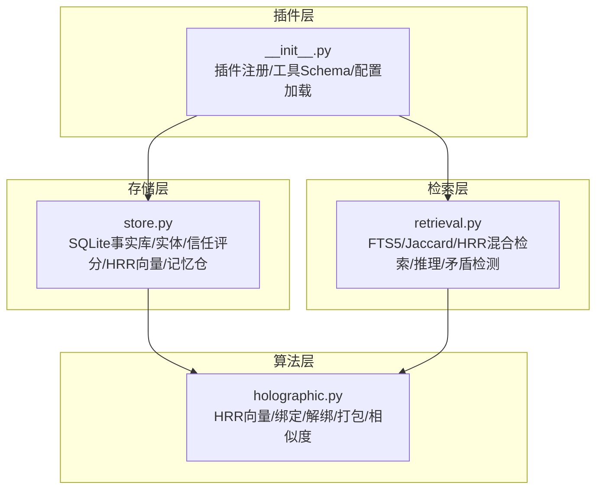
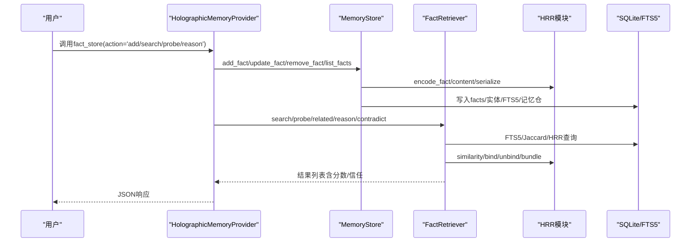
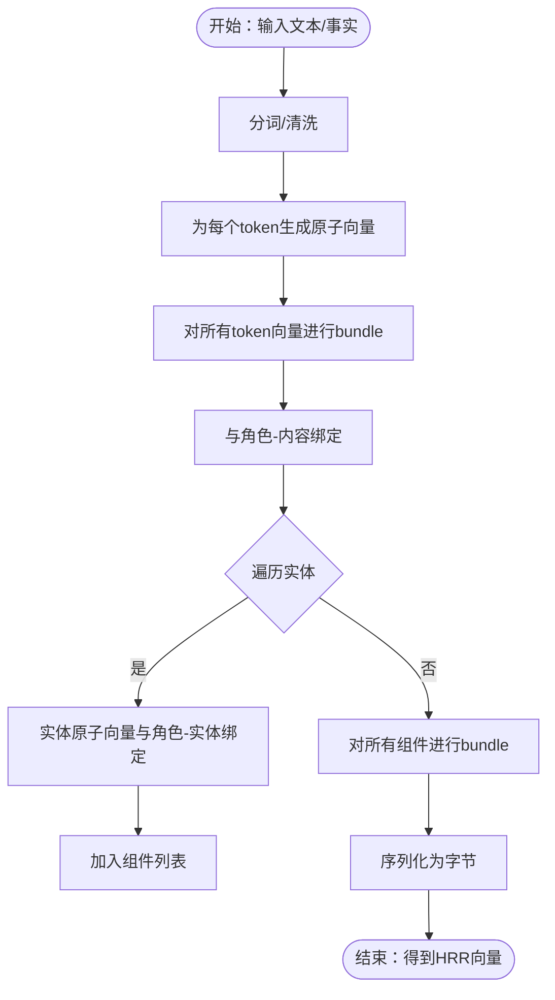
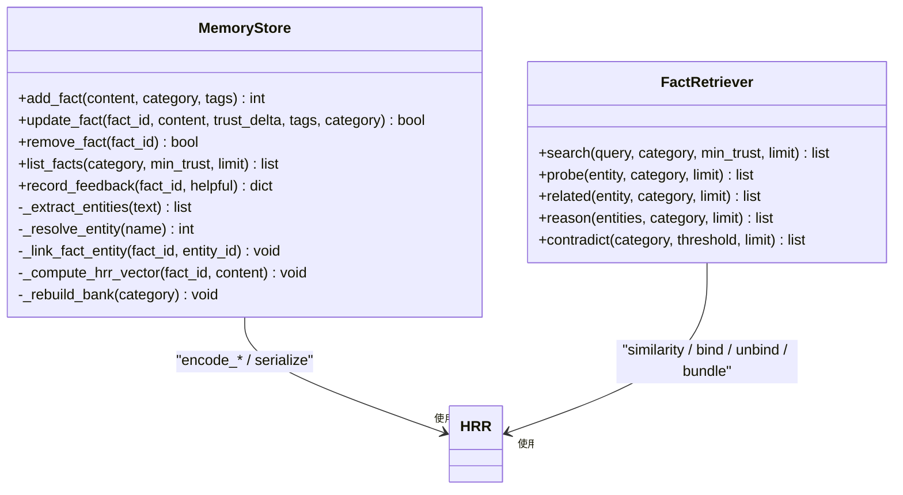
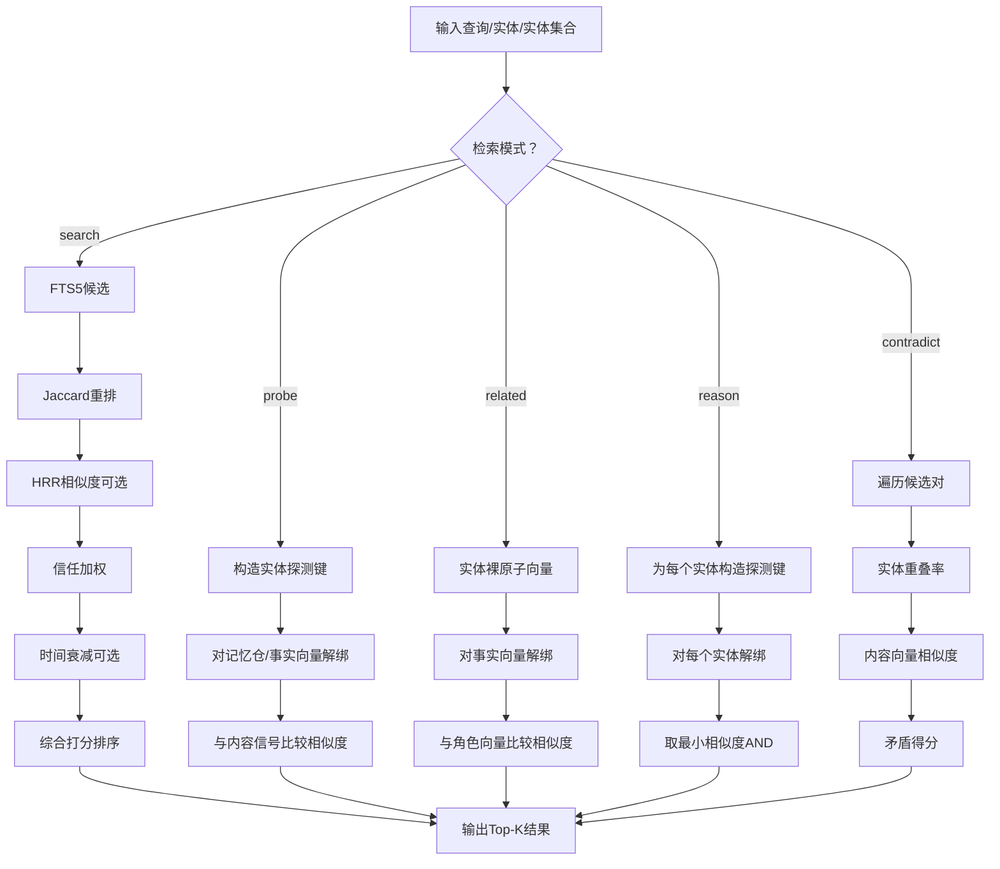
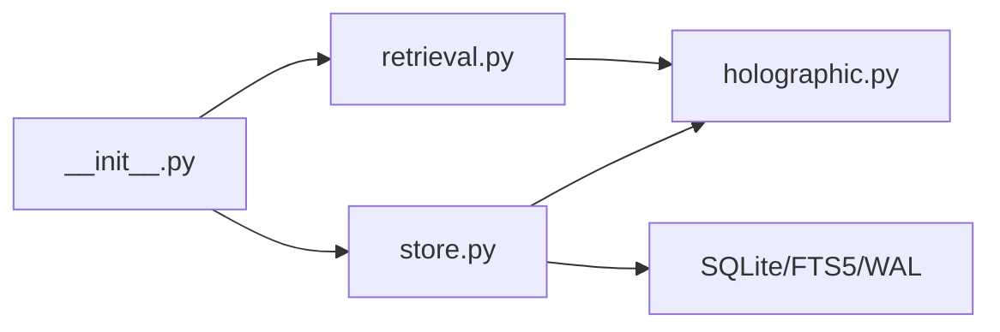

# 核心算法与理论基础

<cite>
**本文引用的文件**
- [plugins/memory/holographic/holographic.py](file://plugins/memory/holographic/holographic.py)
- [plugins/memory/holographic/store.py](file://plugins/memory/holographic/store.py)
- [plugins/memory/holographic/retrieval.py](file://plugins/memory/holographic/retrieval.py)
- [plugins/memory/holographic/__init__.py](file://plugins/memory/holographic/__init__.py)
- [plugins/memory/holographic/README.md](file://plugins/memory/holographic/README.md)
- [plugins/memory/holographic/plugin.yaml](file://plugins/memory/holographic/plugin.yaml)
</cite>

## 目录
1. [引言](#引言)
2. [项目结构](#项目结构)
3. [核心组件](#核心组件)
4. [架构总览](#架构总览)
5. [详细组件分析](#详细组件分析)
6. [依赖关系分析](#依赖关系分析)
7. [性能考量](#性能考量)
8. [故障排查指南](#故障排查指南)
9. [结论](#结论)
10. [附录](#附录)

## 引言
本文件面向Holographic记忆插件的核心算法与理论基础，系统阐述全息记忆的理论来源（HRR：Holographic Reduced Representation）、分布式存储与去中心化检索机制，并深入解析holographic.py中的核心算法实现，包括向量合成、解码过程、相似度计算与记忆重建。同时，记录关键参数配置（尤其是hrr_dim维度）对性能与检索质量的影响，给出工作流程图与数学公式说明，并提供性能基准测试建议与优化策略。

## 项目结构
Holographic记忆插件位于plugins/memory/holographic目录，采用“插件注册 + 存储 + 检索 + 工具接口”的分层设计：
- 插件入口与工具定义：__init__.py
- HRR向量运算与序列化：holographic.py
- 结构化事实存储与实体解析：store.py
- 多策略检索与组合推理：retrieval.py
- 文档与元数据：README.md、plugin.yaml

图表来源
- [plugins/memory/holographic/__init__.py:114-180](file://plugins/memory/holographic/__init__.py#L114-L180)
- [plugins/memory/holographic/holographic.py:43-177](file://plugins/memory/holographic/holographic.py#L43-L177)
- [plugins/memory/holographic/store.py:98-122](file://plugins/memory/holographic/store.py#L98-L122)
- [plugins/memory/holographic/retrieval.py:22-47](file://plugins/memory/holographic/retrieval.py#L22-L47)

章节来源
- [plugins/memory/holographic/README.md:1-37](file://plugins/memory/holographic/README.md#L1-L37)
- [plugins/memory/holographic/plugin.yaml:1-6](file://plugins/memory/holographic/plugin.yaml#L1-L6)

## 核心组件
- HRR向量模块（holographic.py）
  - 原子编码：基于SHA-256计数块生成确定性相位向量
  - 向量运算：bind（绑定）、unbind（解绑）、bundle（打包）、similarity（相似度）
  - 序列化：phases_to_bytes/bytes_to_phases
  - SNR估计：snr_estimate用于容量预警
- 存储模块（store.py）
  - SQLite事实表、实体表、关联表、FTS5虚拟表与触发器
  - 实体提取与解析、信任评分、HRR向量计算与记忆仓（按类别聚合）
- 检索模块（retrieval.py）
  - 混合检索：FTS5候选 + Jaccard重排 + HRR相似度 + 信任加权 + 时间衰减
  - 组合查询：probe（实体探测）、related（结构邻接）、reason（多实体交集）、contradict（矛盾检测）
- 插件入口（__init__.py）
  - MemoryProvider实现，注册工具Schema，初始化Store与Retriever，支持自动抽取与反馈训练

章节来源
- [plugins/memory/holographic/holographic.py:43-204](file://plugins/memory/holographic/holographic.py#L43-L204)
- [plugins/memory/holographic/store.py:98-575](file://plugins/memory/holographic/store.py#L98-L575)
- [plugins/memory/holographic/retrieval.py:22-594](file://plugins/memory/holographic/retrieval.py#L22-L594)
- [plugins/memory/holographic/__init__.py:114-255](file://plugins/memory/holographic/__init__.py#L114-L255)

## 架构总览
HRR在该系统中承担“分布式符号向量”的角色，将“内容-实体”结构以向量形式嵌入到固定维度空间；存储层负责持久化与实体解析；检索层通过多策略融合实现关键词、语义与组合推理的统一检索。

图表来源
- [plugins/memory/holographic/__init__.py:258-355](file://plugins/memory/holographic/__init__.py#L258-L355)
- [plugins/memory/holographic/store.py:142-185](file://plugins/memory/holographic/store.py#L142-L185)
- [plugins/memory/holographic/retrieval.py:48-112](file://plugins/memory/holographic/retrieval.py#L48-L112)
- [plugins/memory/holographic/holographic.py:135-177](file://plugins/memory/holographic/holographic.py#L135-L177)

## 详细组件分析

### 理论基础：HRR与分布式存储
- HRR（Holographic Reduced Representation）是一种向量符号架构，将概念映射为相位向量，通过bind（相位加法）、unbind（相位减法）、bundle（复指数平均）等代数操作表达结构化知识。
- 分布式存储：每个事实被编码为固定维度的相位向量并持久化；实体作为角色绑定的原子参与结构化检索。
- 去中心化检索：不依赖全局嵌入模型，通过本地HRR向量与SQLite FTS5实现关键词与语义检索；组合推理（reason）直接在向量空间进行，无需外部服务。

章节来源
- [plugins/memory/holographic/holographic.py:1-20](file://plugins/memory/holographic/holographic.py#L1-L20)

### HRR向量模块（holographic.py）
- 原子编码（encode_atom）
  - 使用SHA-256计数块生成确定性相位向量，避免随机性导致的跨进程不一致
  - 返回长度为dim的相位数组（弧度）
- 向量运算
  - bind：两向量相位相加，得到复合向量
  - unbind：从记忆向量中减去键向量，恢复绑定值
  - bundle：多个向量的复指数平均，得到近似相似的合并向量
  - similarity：cosine相似度（基于相位差的余弦均值），范围[-1,1]
- 文本与事实编码
  - encode_text：词袋向量（token原子向量的bundle）
  - encode_fact：内容向量与“角色-内容”绑定，以及每个实体与“角色-实体”绑定，再bundle合并
- 序列化与反序列化
  - phases_to_bytes/bytes_to_phases：将相位向量序列化为字节，便于存入SQLite BLOB
- SNR估计
  - snr_estimate：估算信号噪声比sqrt(dim/n)，当n较大时SNR下降，提示容量接近

图表来源
- [plugins/memory/holographic/holographic.py:111-160](file://plugins/memory/holographic/holographic.py#L111-L160)

章节来源
- [plugins/memory/holographic/holographic.py:43-177](file://plugins/memory/holographic/holographic.py#L43-L177)
- [plugins/memory/holographic/holographic.py:179-204](file://plugins/memory/holographic/holographic.py#L179-L204)

### 存储模块（store.py）
- 数据模型
  - facts：事实内容、类别、标签、信任度、检索次数、帮助计数、时间戳、HRR向量
  - entities：实体名、类型、别名
  - fact_entities：事实-实体多对多关联
  - facts_fts：FTS5虚拟表，支持全文检索
  - memory_banks：按类别聚合的记忆仓（向量为该类所有事实向量的bundle）
- 关键流程
  - add_fact：插入事实，提取实体并建立链接，计算HRR向量，更新记忆仓
  - update_fact：部分更新，必要时重新提取实体与HRR向量，重建相关类别记忆仓
  - record_feedback：根据用户反馈调整信任度，异步提升可信度
  - _compute_hrr_vector/_rebuild_bank：将事实内容与实体映射为HRR向量，并按类别构建记忆仓
- 并发与一致性
  - 使用线程锁（RLock）保护数据库访问
  - WAL模式提升并发写入性能

图表来源
- [plugins/memory/holographic/store.py:98-575](file://plugins/memory/holographic/store.py#L98-L575)
- [plugins/memory/holographic/retrieval.py:22-594](file://plugins/memory/holographic/retrieval.py#L22-L594)
- [plugins/memory/holographic/holographic.py:43-177](file://plugins/memory/holographic/holographic.py#L43-L177)

章节来源
- [plugins/memory/holographic/store.py:98-575](file://plugins/memory/holographic/store.py#L98-L575)

### 检索模块（retrieval.py）
- 混合检索（search）
  - 步骤：FTS5候选（扩大候选集）→ Jaccard重排→ HRR相似度（可选）→ 信任加权→ 时间衰减→ 排序返回
  - 权重分配：默认FTS_weight=0.4、Jaccard_weight=0.3、HRR_weight=0.3；若无NumPy则自动调整权重
- 组合查询
  - probe：对实体进行解绑，提取与内容相关的信号，按相似度排序
  - related：查找与实体共享结构连接的事实（邻接）
  - reason：对多个实体分别解绑后取最小相似度（AND语义），找到同时与多个实体结构相关的内容
  - contradict：基于实体重叠与内容向量相似度检测潜在矛盾
- 时间衰减
  - 半衰期控制：decay = 0.5^(age_days / half_life)，用于降低旧事实影响

图表来源
- [plugins/memory/holographic/retrieval.py:48-112](file://plugins/memory/holographic/retrieval.py#L48-L112)
- [plugins/memory/holographic/retrieval.py:114-190](file://plugins/memory/holographic/retrieval.py#L114-L190)
- [plugins/memory/holographic/retrieval.py:192-258](file://plugins/memory/holographic/retrieval.py#L192-L258)
- [plugins/memory/holographic/retrieval.py:260-336](file://plugins/memory/holographic/retrieval.py#L260-L336)
- [plugins/memory/holographic/retrieval.py:338-442](file://plugins/memory/holographic/retrieval.py#L338-L442)

章节来源
- [plugins/memory/holographic/retrieval.py:22-594](file://plugins/memory/holographic/retrieval.py#L22-L594)

### 插件入口与工具接口（__init__.py）
- MemoryProvider实现
  - 初始化：加载配置，创建MemoryStore与FactRetriever，支持hrr_dim、hrr_weight、temporal_decay等参数
  - 工具Schema：fact_store（add/search/probe/related/reason/contradict/update/remove/list）与fact_feedback
  - 生命周期钩子：on_session_end自动抽取用户偏好/决策；on_memory_write镜像内置记忆写入
- 配置项
  - db_path、auto_extract、default_trust、hrr_dim、hrr_weight、temporal_decay_half_life

章节来源
- [plugins/memory/holographic/__init__.py:96-180](file://plugins/memory/holographic/__init__.py#L96-L180)
- [plugins/memory/holographic/__init__.py:226-355](file://plugins/memory/holographic/__init__.py#L226-L355)
- [plugins/memory/holographic/README.md:20-37](file://plugins/memory/holographic/README.md#L20-L37)

## 依赖关系分析
- 模块耦合
  - store.py与holographic.py强耦合：存储层依赖HRR向量生成与序列化
  - retrieval.py与holographic.py强耦合：检索层依赖相似度与向量运算
  - __init__.py与store/retrieval弱耦合：通过接口调用
- 外部依赖
  - SQLite（内置）、FTS5（内置）、WAL（内置）
  - NumPy（可选，启用HRR功能）

图表来源
- [plugins/memory/holographic/__init__.py:25-28](file://plugins/memory/holographic/__init__.py#L25-L28)
- [plugins/memory/holographic/store.py:11-14](file://plugins/memory/holographic/store.py#L11-L14)
- [plugins/memory/holographic/retrieval.py:16-19](file://plugins/memory/holographic/retrieval.py#L16-L19)

章节来源
- [plugins/memory/holographic/__init__.py:114-180](file://plugins/memory/holographic/__init__.py#L114-L180)
- [plugins/memory/holographic/store.py:98-122](file://plugins/memory/holographic/store.py#L98-L122)
- [plugins/memory/holographic/retrieval.py:22-47](file://plugins/memory/holographic/retrieval.py#L22-L47)

## 性能考量
- HRR维度（hrr_dim）
  - 维度越高，存储容量越大，抗噪声能力越强；但向量体积增大，序列化/反序列化与相似度计算成本上升
  - SNR阈值：当n_items > dim/4时SNR<2，建议增加维度或减少存储项
- 存储与索引
  - SQLite WAL模式提升并发写入；FTS5触发器保证全文索引同步
  - 记忆仓（memory_banks）按类别聚合，加速类别内检索
- 检索权重与回退
  - 当无NumPy时，自动降低HRR权重，提高FTS5与Jaccard权重，确保可用性
  - 时间衰减半衰期影响旧事实权重，避免过时信息主导
- 矛盾检测的复杂度
  - 默认限制最多检查最近更新的500条事实，避免O(n^2)爆炸

章节来源
- [plugins/memory/holographic/holographic.py:179-204](file://plugins/memory/holographic/holographic.py#L179-L204)
- [plugins/memory/holographic/store.py:494-530](file://plugins/memory/holographic/store.py#L494-L530)
- [plugins/memory/holographic/retrieval.py:25-47](file://plugins/memory/holographic/retrieval.py#L25-L47)
- [plugins/memory/holographic/retrieval.py:381-384](file://plugins/memory/holographic/retrieval.py#L381-L384)

## 故障排查指南
- 缺少NumPy
  - 现象：HRR相关功能不可用，检索权重自动调整
  - 处理：安装NumPy以启用HRR功能
- HRR存储接近容量
  - 现象：日志警告SNR偏低
  - 处理：增大hrr_dim或清理历史事实
- FTS5查询异常
  - 现象：FTS5 MATCH失败导致空结果
  - 处理：检查查询语法，或降级为关键词匹配
- 自动抽取未生效
  - 现象：会话结束未自动抽取
  - 处理：确认auto_extract已开启且消息满足正则模式

章节来源
- [plugins/memory/holographic/holographic.py:38-41](file://plugins/memory/holographic/holographic.py#L38-L41)
- [plugins/memory/holographic/holographic.py:194-201](file://plugins/memory/holographic/holographic.py#L194-L201)
- [plugins/memory/holographic/retrieval.py:520-527](file://plugins/memory/holographic/retrieval.py#L520-L527)
- [plugins/memory/holographic/__init__.py:236-241](file://plugins/memory/holographic/__init__.py#L236-L241)

## 结论
Holographic记忆插件通过HRR向量与SQLite的结合，实现了低依赖、可组合、可扩展的记忆系统。其核心优势在于：
- 结构化检索：利用角色绑定与向量解绑实现“关于某实体/同时关于多个实体”的精确检索
- 组合推理：在向量空间进行AND语义的多实体交集，超越传统嵌入数据库的能力
- 可靠性与可维护性：确定性原子编码、WAL事务、FTS5全文索引与信任评分反馈机制

建议在生产环境中：
- 根据事实规模选择合适的hrr_dim，并定期监控SNR
- 合理设置时间衰减半衰期，平衡新旧信息
- 在具备NumPy时启用HRR权重，获得更佳的语义检索效果

## 附录
- 关键参数配置
  - db_path：SQLite数据库路径
  - auto_extract：会话结束自动抽取用户偏好/决策
  - default_trust：新事实默认信任度
  - hrr_dim：HRR向量维度
  - hrr_weight：HRR相似度在检索中的权重
  - temporal_decay_half_life：时间衰减半衰期（天）
- 工具清单
  - fact_store：add/search/probe/related/reason/contradict/update/remove/list
  - fact_feedback：helpful/unhelpful

章节来源
- [plugins/memory/holographic/README.md:20-37](file://plugins/memory/holographic/README.md#L20-L37)
- [plugins/memory/holographic/__init__.py:147-155](file://plugins/memory/holographic/__init__.py#L147-L155)