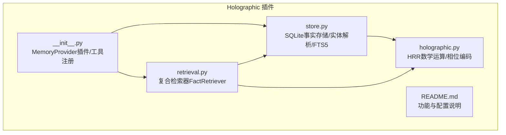
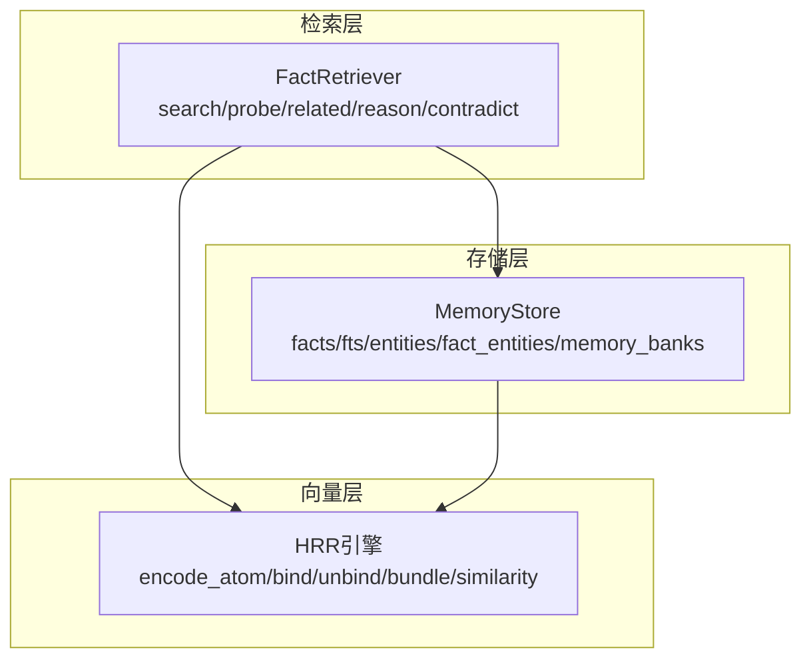
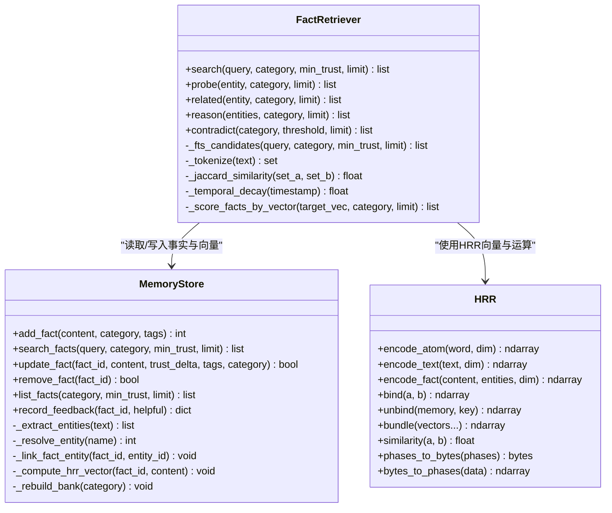
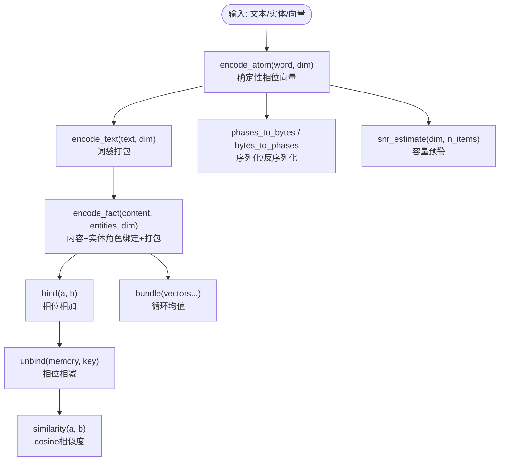
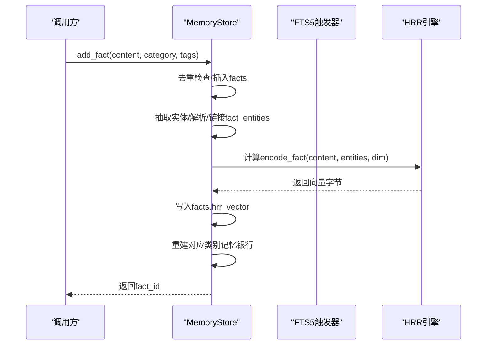
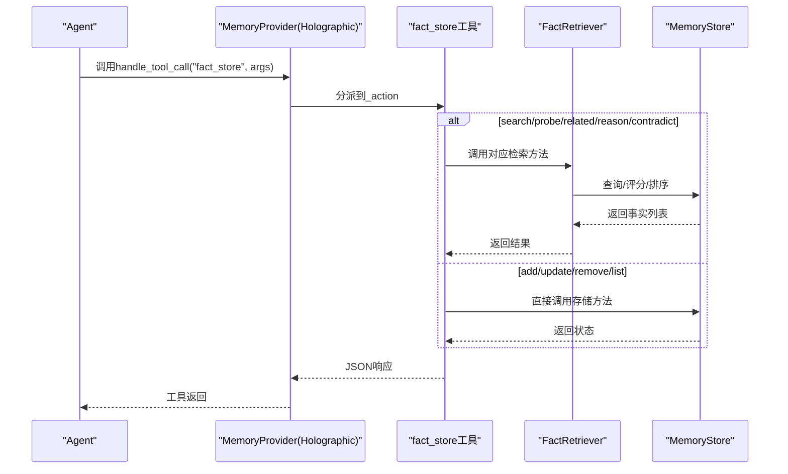
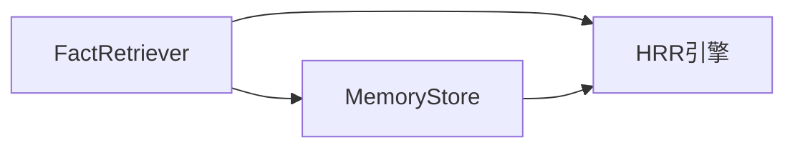

# 检索系统与查询优化

<cite>
**本文引用的文件**
- [retrieval.py](file://plugins/memory/holographic/retrieval.py)
- [holographic.py](file://plugins/memory/holographic/holographic.py)
- [store.py](file://plugins/memory/holographic/store.py)
- [README.md](file://plugins/memory/holographic/README.md)
- [__init__.py](file://plugins/memory/holographic/__init__.py)
- [memory-providers.md](file://website/docs/user-guide/features/memory-providers.md)
</cite>

## 目录
1. [简介](#简介)
2. [项目结构](#项目结构)
3. [核心组件](#核心组件)
4. [架构总览](#架构总览)
5. [详细组件分析](#详细组件分析)
6. [依赖关系分析](#依赖关系分析)
7. [性能考量](#性能考量)
8. [故障排查指南](#故障排查指南)
9. [结论](#结论)
10. [附录：检索工具使用与最佳实践](#附录检索工具使用与最佳实践)

## 简介
本文件面向Holographic检索系统，聚焦“基于HRR（全息简缩表示）的复合检索算法”，涵盖以下要点：
- 复合检索流程：FTS5候选生成 → Jaccard重排 → HRR语义相似度融合 → 信任加权 → 时间衰减（可选）
- 语义搜索与相关性排序：通过HRR相位向量编码文本与实体，结合cosine相似度进行语义匹配
- 结果过滤与聚合：按类别、最小信任度、时间衰减等参数控制输出
- 检索工具fact_store的九种操作：add、search、probe、related、reason、contradict、update、remove、list
- 查询优化技巧、性能调优参数与缓存策略
- 实际使用案例与最佳实践

## 项目结构
Holographic检索系统位于插件目录下，核心文件如下：
- retrieval.py：复合检索器FactRetriever，实现多策略检索与评分
- holographic.py：HRR数学运算与向量编码（绑定、解绑、打包、相似度、相位编码）
- store.py：SQLite事实存储、实体解析、信任评分、FTS5触发器与向量重建
- __init__.py：注册为MemoryProvider插件，暴露fact_store与fact_feedback工具
- README.md：功能概述、配置项与工具清单
- website/docs/user-guide/features/memory-providers.md：官方文档中对Holographic的介绍与工具说明

图表来源
- [store.py:16-76](file://plugins/memory/holographic/store.py#L16-L76)
- [holographic.py:1-204](file://plugins/memory/holographic/holographic.py#L1-L204)
- [retrieval.py:1-112](file://plugins/memory/holographic/retrieval.py#L1-L112)
- [__init__.py:1-408](file://plugins/memory/holographic/__init__.py#L1-L408)

章节来源
- [README.md:1-37](file://plugins/memory/holographic/README.md#L1-L37)
- [memory-providers.md:309-327](file://website/docs/user-guide/features/memory-providers.md#L309-L327)

## 核心组件
- MemoryStore（store.py）
  - 负责SQLite事实表、实体表、FTS5虚拟表、记忆银行表的初始化与维护
  - 提供add_fact、search_facts、update_fact、remove_fact、list_facts、record_feedback等接口
  - 自动抽取实体并建立fact_entities关联；在内容变更时重建HRR向量与记忆银行
- FactRetriever（retrieval.py）
  - 复合检索器，整合FTS5、Jaccard、HRR三路信号，经信任加权与时间衰减得到最终得分
  - 支持probe（实体解构）、related（共享连接发现）、reason（多实体交集）、contradict（矛盾检测）
- HRR引擎（holographic.py）
  - 提供相位向量的确定性编码、绑定/解绑、打包、相似度计算与序列化
  - 在无NumPy时提供降级行为（如probe回退到关键词搜索）

章节来源
- [store.py:98-575](file://plugins/memory/holographic/store.py#L98-L575)
- [retrieval.py:22-594](file://plugins/memory/holographic/retrieval.py#L22-L594)
- [holographic.py:43-204](file://plugins/memory/holographic/holographic.py#L43-L204)

## 架构总览
Holographic检索系统采用“存储层 + 向量引擎 + 检索器”的分层设计：
- 存储层：SQLite + FTS5 + 触发器自动同步；支持实体解析与信任评分
- 向量层：HRR相位向量编码，支持结构化绑定（内容角色、实体角色），便于代数提取
- 检索层：多策略融合打分，支持类别过滤、信任阈值、时间衰减与结果裁剪

图表来源
- [retrieval.py:22-112](file://plugins/memory/holographic/retrieval.py#L22-L112)
- [holographic.py:43-177](file://plugins/memory/holographic/holographic.py#L43-L177)
- [store.py:16-76](file://plugins/memory/holographic/store.py#L16-L76)

## 详细组件分析

### 组件A：FactRetriever（复合检索器）
- 主要职责
  - 将FTS5候选、Jaccard重排、HRR语义相似度三路信号融合，乘以信任分数，并可选应用时间衰减
  - 提供probe、related、reason、contradict等代数检索能力
- 关键流程
  - search：FTS5候选 → Jaccard重排 → HRR相似度融合 → 信任加权 → 可选时间衰减 → 排序裁剪
  - probe：对实体构造角色绑定键，优先从记忆银行解构，否则对单条事实向量解绑并对比内容信号
  - related：查找与实体共享结构连接的事实（实体角色或内容角色任一匹配）
  - reason：多实体交集（AND）的代数推理，要求每个实体都在事实中以结构化方式出现
  - contradict：基于实体重叠与内容向量相似度的矛盾检测，返回成对事实及矛盾得分
- 参数与权重
  - temporal_decay_half_life：时间半衰期（天），0禁用
  - fts_weight、jaccard_weight、hrr_weight：三路信号权重（若无NumPy，HRR权重会自动下调）
  - hrr_dim：HRR向量维度，默认1024
- 降级策略
  - 若无NumPy，probe/related/reason/contradict回退到关键词搜索或空结果

图表来源
- [retrieval.py:22-594](file://plugins/memory/holographic/retrieval.py#L22-L594)
- [store.py:98-575](file://plugins/memory/holographic/store.py#L98-L575)
- [holographic.py:43-177](file://plugins/memory/holographic/holographic.py#L43-L177)

章节来源
- [retrieval.py:48-112](file://plugins/memory/holographic/retrieval.py#L48-L112)
- [retrieval.py:114-190](file://plugins/memory/holographic/retrieval.py#L114-L190)
- [retrieval.py:192-258](file://plugins/memory/holographic/retrieval.py#L192-L258)
- [retrieval.py:260-336](file://plugins/memory/holographic/retrieval.py#L260-L336)
- [retrieval.py:338-442](file://plugins/memory/holographic/retrieval.py#L338-L442)

### 组件B：HRR引擎（相位向量与代数运算）
- 编码
  - encode_atom：基于SHA-256计数块生成确定性相位向量
  - encode_text：词袋模型，对每个token原子向量进行打包
  - encode_fact：内容绑定内容角色、实体绑定实体角色后整体打包
- 代数运算
  - bind：相位相加（循环卷积）
  - unbind：相位相减（循环相关）
  - bundle：复指数平均的循环均值（超叠加）
- 相似度与序列化
  - similarity：cosine相似度（基于相位差的均值）
  - phases_to_bytes / bytes_to_phases：向量序列化与反序列化
- 容量预警
  - snr_estimate：当SNR过低时发出警告，提示维度与存储数量的平衡

图表来源
- [holographic.py:43-177](file://plugins/memory/holographic/holographic.py#L43-L177)

章节来源
- [holographic.py:101-133](file://plugins/memory/holographic/holographic.py#L101-L133)
- [holographic.py:135-161](file://plugins/memory/holographic/holographic.py#L135-L161)
- [holographic.py:163-177](file://plugins/memory/holographic/holographic.py#L163-L177)
- [holographic.py:179-203](file://plugins/memory/holographic/holographic.py#L179-L203)

### 组件C：MemoryStore（事实存储与实体解析）
- 表结构与触发器
  - facts：事实表，含唯一content、类别、标签、信任分、检索/帮助计数、创建/更新时间、HRR向量
  - entities：实体表，含别名字段
  - fact_entities：事实-实体关联
  - facts_fts：FTS5虚拟表，自动维护全文索引
  - memory_banks：按类别聚合的记忆银行（向量为该类所有事实向量的打包）
- 关键方法
  - add_fact：去重插入、实体抽取与链接、HRR向量计算、记忆银行重建
  - search_facts：FTS5全文检索，返回按rank与信任分排序的结果，并增加检索计数
  - update_fact：部分更新，支持信任增量、内容变更后的实体重抽与向量重算
  - remove_fact：删除事实与关联
  - list_facts：按信任分降序浏览
  - record_feedback：用户反馈训练信任分
- 实体解析规则
  - 多词大写短语、引号术语、AKA模式等正则抽取候选，去重保留首次顺序

图表来源
- [store.py:142-185](file://plugins/memory/holographic/store.py#L142-L185)
- [store.py:470-492](file://plugins/memory/holographic/store.py#L470-L492)
- [store.py:494-530](file://plugins/memory/holographic/store.py#L494-L530)

章节来源
- [store.py:16-76](file://plugins/memory/holographic/store.py#L16-L76)
- [store.py:187-236](file://plugins/memory/holographic/store.py#L187-L236)
- [store.py:394-427](file://plugins/memory/holographic/store.py#L394-L427)

### 组件D：检索API与工具集成（fact_store）
- 工具schema与动作
  - 动作：add、search、probe、related、reason、contradict、update、remove、list
  - 对应MemoryStore与FactRetriever的方法映射
- 工具处理流程
  - 解析参数 → 调用对应方法 → 返回JSON结果（含计数/事实列表/错误信息）

图表来源
- [__init__.py:258-344](file://plugins/memory/holographic/__init__.py#L258-L344)
- [retrieval.py:48-112](file://plugins/memory/holographic/retrieval.py#L48-L112)
- [store.py:142-185](file://plugins/memory/holographic/store.py#L142-L185)

章节来源
- [__init__.py:37-155](file://plugins/memory/holographic/__init__.py#L37-L155)
- [__init__.py:258-344](file://plugins/memory/holographic/__init__.py#L258-L344)

## 依赖关系分析
- 组件耦合
  - FactRetriever强依赖MemoryStore（读取事实、实体、FTS5、记忆银行）与HRR引擎（向量运算）
  - MemoryStore弱依赖HRR引擎（仅在有NumPy时启用向量计算与银行重建）
- 外部依赖
  - SQLite（始终可用）
  - NumPy（可选，用于HRR代数运算）
- 循环依赖
  - 无直接循环；模块间为单向调用

图表来源
- [retrieval.py:13-19](file://plugins/memory/holographic/retrieval.py#L13-L19)
- [store.py:11-14](file://plugins/memory/holographic/store.py#L11-L14)

章节来源
- [retrieval.py:13-19](file://plugins/memory/holographic/retrieval.py#L13-L19)
- [store.py:11-14](file://plugins/memory/holographic/store.py#L11-L14)

## 性能考量
- 向量维度与容量
  - hrr_dim默认1024；维度越高，容量上限越大，但向量体积与计算开销上升
  - 当n_items接近dim/4时SNR下降，建议增大维度或减少存储数量
- FTS5与索引
  - 使用FTS5虚拟表与触发器自动维护全文索引，适合大规模文本检索
  - 建议合理设置最小信任度与限制，避免返回过多候选导致后续重排成本上升
- HRR路径降级
  - 无NumPy时，HRR相关操作（probe/related/reason/contradict）回退到关键词搜索，确保可用性
- 时间衰减
  - temporal_decay_half_life>0时，旧事实得分按指数衰减，建议根据领域时效性调整半衰期
- 矛盾检测的复杂度
  - 对于超过阈值的事实数量，采用最近更新的事实子集以控制O(n^2)比较成本

章节来源
- [holographic.py:179-203](file://plugins/memory/holographic/holographic.py#L179-L203)
- [retrieval.py:28-46](file://plugins/memory/holographic/retrieval.py#L28-L46)
- [retrieval.py:378-384](file://plugins/memory/holographic/retrieval.py#L378-L384)
- [retrieval.py:569-594](file://plugins/memory/holographic/retrieval.py#L569-L594)

## 故障排查指南
- “numpy is required for holographic operations”
  - 症状：执行HRR相关检索时报错
  - 处理：安装NumPy或降低hrr_weight至0以禁用HRR路径
- FTS5查询异常
  - 症状：search返回空或异常
  - 处理：检查查询语法，避免非法MATCH表达式；确认FTS5触发器已创建
- 时间戳格式问题
  - 症状：时间衰减未生效或返回1.0
  - 处理：确保updated_at或created_at字段为ISO格式字符串且带时区
- 矛盾检测为空
  - 症状：contradict返回空列表
  - 处理：确认存在至少两条事实且具备HRR向量；检查实体抽取是否正确

章节来源
- [holographic.py:38-40](file://plugins/memory/holographic/holographic.py#L38-L40)
- [retrieval.py:520-525](file://plugins/memory/holographic/retrieval.py#L520-L525)
- [retrieval.py:578-590](file://plugins/memory/holographic/retrieval.py#L578-L590)
- [retrieval.py:353-354](file://plugins/memory/holographic/retrieval.py#L353-L354)

## 结论
Holographic检索系统通过“FTS5 + Jaccard + HRR”的复合策略，在本地SQLite上实现了高精度、可解释的结构化检索。其优势在于：
- HRR代数运算支持实体解构、多实体推理与矛盾检测
- 信任评分与时间衰减使结果更贴近用户需求
- 无外部依赖，易于部署与迁移
建议在生产环境中结合维度规划、容量预警与查询优化参数，持续提升检索质量与性能。

## 附录：检索工具使用与最佳实践

### 工具：fact_store（九种操作）
- add
  - 用途：新增事实，自动抽取实体并建立链接，计算HRR向量，重建记忆银行
  - 参数：content、category（可选）、tags（可选）
- search
  - 用途：全文关键词检索，返回按FTS5 rank与信任分排序的结果
  - 参数：query、category（可选）、min_trust（默认0.3）、limit（默认10）
- probe
  - 用途：对实体进行结构化解构，找出与该实体相关的内容
  - 参数：entity、category（可选）、limit（默认10）
- related
  - 用途：发现与实体共享结构连接的其他事实
  - 参数：entity、category（可选）、limit（默认10）
- reason
  - 用途：多实体交集推理（AND），要求每个实体都在事实中以结构化方式出现
  - 参数：entities（列表）、category（可选）、limit（默认10）
- contradict
  - 用途：检测潜在矛盾事实（实体重叠 + 内容向量差异）
  - 参数：category（可选）、threshold（默认0.3）、limit（默认10）
- update
  - 用途：部分更新事实（content、trust_delta、tags、category）
  - 参数：fact_id、content（可选）、trust_delta（可选）、tags（可选）、category（可选）
- remove
  - 用途：删除事实及其关联
  - 参数：fact_id
- list
  - 用途：按信任分降序浏览事实
  - 参数：category（可选）、min_trust（默认0.0）、limit（默认10）

最佳实践
- 配置建议
  - 默认信任分：0.5；最小信任阈值：0.3
  - HRR维度：1024；若存储规模较大可考虑1536或更高
  - 时间衰减半衰期：根据领域时效性设定（如知识类可设较短，参考类可较长）
- 查询优化
  - 使用category限定范围，减少扫描
  - 将高频查询的实体加入记忆银行，提升probe/related/reason效率
  - 对长尾查询启用HRR（确保NumPy可用），提高语义召回
- 结果过滤
  - 通过min_trust与limit控制召回质量与数量
  - 使用contradict定期清洗矛盾事实，保持知识一致性
- 缓存策略
  - 利用prefetch在对话前注入少量高置信度检索结果
  - 对热点实体的probe/related结果可做短期内存缓存（注意与更新同步）

章节来源
- [README.md:31-37](file://plugins/memory/holographic/README.md#L31-L37)
- [memory-providers.md:320-321](file://website/docs/user-guide/features/memory-providers.md#L320-L321)
- [__init__.py:258-344](file://plugins/memory/holographic/__init__.py#L258-L344)