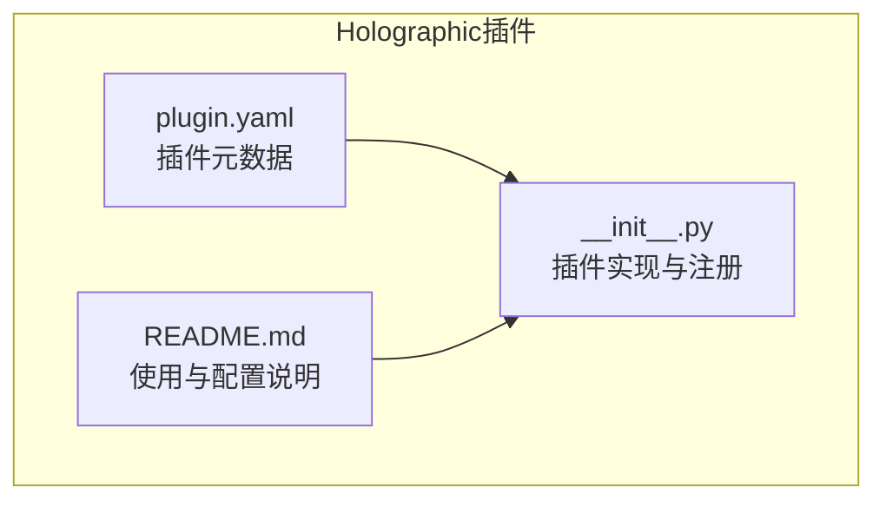
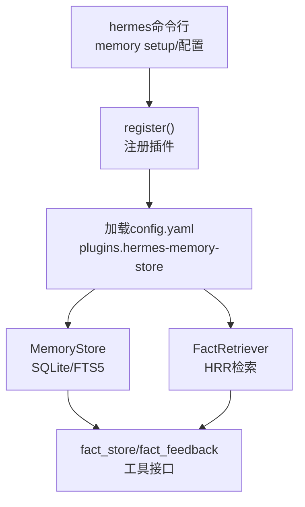
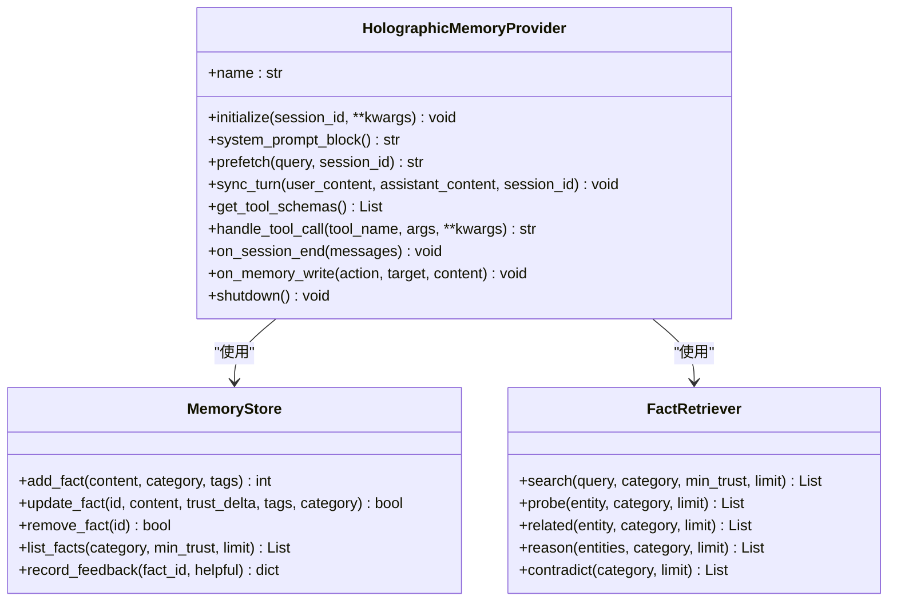
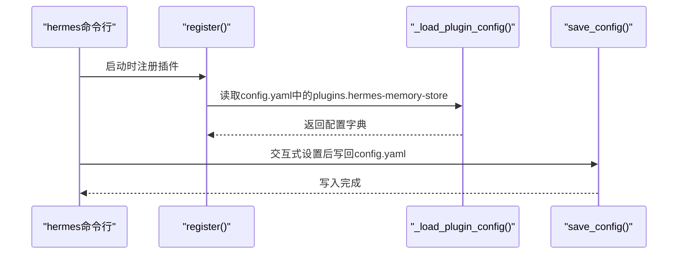
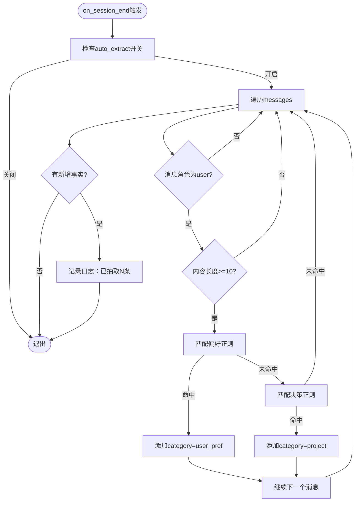
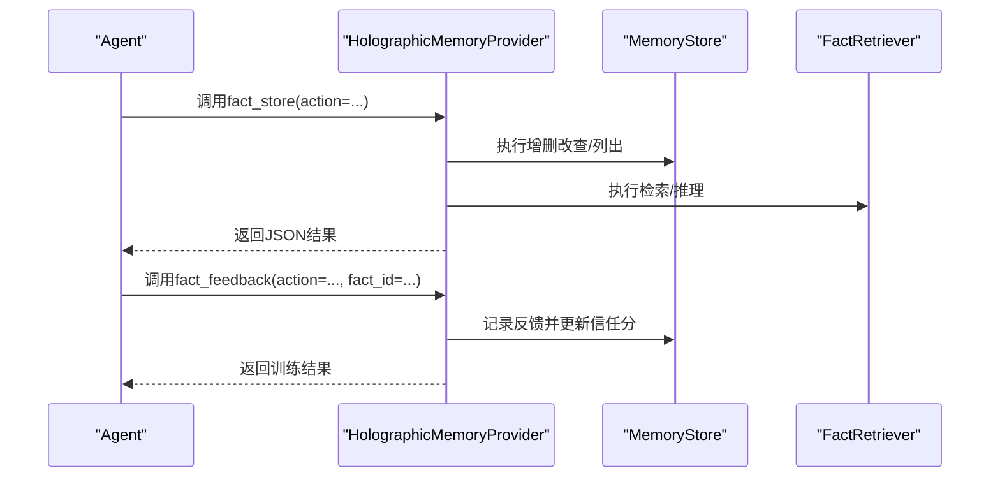
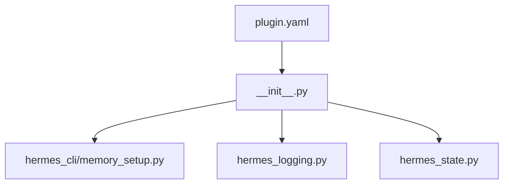

# 配置与部署指南

<cite>
**本文引用的文件**
- [plugins/memory/holographic/plugin.yaml](file://plugins/memory/holographic/plugin.yaml)
- [plugins/memory/holographic/README.md](file://plugins/memory/holographic/README.md)
- [plugins/memory/holographic/__init__.py](file://plugins/memory/holographic/__init__.py)
- [hermes_cli/memory_setup.py](file://hermes_cli/memory_setup.py)
- [hermes_logging.py](file://hermes_logging.py)
- [tests/test_hermes_logging.py](file://tests/test_hermes_logging.py)
- [hermes_state.py](file://hermes_state.py)
- [website/docs/user-guide/features/memory-providers.md](file://website/docs/user-guide/features/memory-providers.md)
- [website/docs/developer-guide/memory-provider-plugin.md](file://website/docs/developer-guide/memory-provider-plugin.md)
</cite>

## 目录
1. [简介](#简介)
2. [项目结构](#项目结构)
3. [核心组件](#核心组件)
4. [架构总览](#架构总览)
5. [详细组件分析](#详细组件分析)
6. [依赖分析](#依赖分析)
7. [性能考虑](#性能考虑)
8. [故障排除指南](#故障排除指南)
9. [结论](#结论)
10. [附录](#附录)

## 简介
本指南面向需要在Hermes Agent中启用并管理Holographic记忆插件的用户与运维人员，覆盖以下内容：
- plugin.yaml配置文件的关键字段说明（db_path、auto_extract、default_trust、hrr_dim等）
- 完整安装与部署步骤（hermes命令行交互式配置与手动配置）
- 集群部署、网络配置与高可用建议
- 监控指标与日志配置
- 故障排除方法与最佳实践

## 项目结构
Holographic插件位于内存插件子系统中，核心文件包括：
- 插件元数据：plugin.yaml
- 插件实现：__init__.py（注册、配置加载、工具接口、检索器与存储）
- 使用文档：README.md（含配置项表格与使用示例）

**图表来源**
- [plugins/memory/holographic/plugin.yaml:1-6](file://plugins/memory/holographic/plugin.yaml#L1-L6)
- [plugins/memory/holographic/README.md:1-37](file://plugins/memory/holographic/README.md#L1-L37)
- [plugins/memory/holographic/__init__.py:1-408](file://plugins/memory/holographic/__init__.py#L1-L408)

**章节来源**
- [plugins/memory/holographic/plugin.yaml:1-6](file://plugins/memory/holographic/plugin.yaml#L1-L6)
- [plugins/memory/holographic/README.md:1-37](file://plugins/memory/holographic/README.md#L1-L37)
- [plugins/memory/holographic/__init__.py:1-408](file://plugins/memory/holographic/__init__.py#L1-L408)

## 核心组件
- 插件注册与入口：register函数负责加载配置并注册HolographicMemoryProvider到插件系统
- 配置加载：从$HERMES_HOME/config.yaml读取plugins.hermes-memory-store段落
- 存储层：基于SQLite的MemoryStore，支持FTS5全文检索与信任评分
- 检索层：FactRetriever基于HRR（全息降维表示）进行组合式检索
- 工具接口：fact_store与fact_feedback两类工具，前者提供增删改查与推理能力，后者用于训练信任评分

关键配置项（来自插件文档与实现）：
- db_path：SQLite数据库路径，默认为$HERMES_HOME/memory_store.db
- auto_extract：会话结束时是否自动抽取事实
- default_trust：新事实默认信任分
- hrr_dim：HRR向量维度（默认1024）

**章节来源**
- [plugins/memory/holographic/README.md:20-30](file://plugins/memory/holographic/README.md#L20-L30)
- [plugins/memory/holographic/__init__.py:147-155](file://plugins/memory/holographic/__init__.py#L147-L155)
- [plugins/memory/holographic/__init__.py:161-179](file://plugins/memory/holographic/__init__.py#L161-L179)

## 架构总览
Holographic插件通过MemoryProvider接口接入Hermes Agent，运行期由CLI或配置驱动初始化，使用SQLite持久化并提供检索与推理工具。

**图表来源**
- [plugins/memory/holographic/__init__.py:403-407](file://plugins/memory/holographic/__init__.py#L403-L407)
- [plugins/memory/holographic/__init__.py:157-179](file://plugins/memory/holographic/__init__.py#L157-L179)
- [plugins/memory/holographic/__init__.py:226-227](file://plugins/memory/holographic/__init__.py#L226-L227)

## 详细组件分析

### 组件A：HolographicMemoryProvider类
职责与行为：
- 初始化：解析配置、实例化存储与检索器
- 生命周期：prefetch检索上下文、on_session_end自动抽取、on_memory_write镜像内置记忆写入
- 工具调用：fact_store执行增删改查与推理；fact_feedback训练信任度
- 关闭：释放资源

**图表来源**
- [plugins/memory/holographic/__init__.py:114-121](file://plugins/memory/holographic/__init__.py#L114-L121)
- [plugins/memory/holographic/__init__.py:258-354](file://plugins/memory/holographic/__init__.py#L258-L354)
- [plugins/memory/holographic/__init__.py:358-396](file://plugins/memory/holographic/__init__.py#L358-L396)

**章节来源**
- [plugins/memory/holographic/__init__.py:114-255](file://plugins/memory/holographic/__init__.py#L114-L255)

### 组件B：配置加载与保存流程
- 加载：从$HERMES_HOME/config.yaml读取plugins.hermes-memory-store段
- 保存：通过save_config写回config.yaml
- schema：get_config_schema返回交互式配置项（键、描述、默认值、可选值）

**图表来源**
- [plugins/memory/holographic/__init__.py:96-107](file://plugins/memory/holographic/__init__.py#L96-L107)
- [plugins/memory/holographic/__init__.py:130-145](file://plugins/memory/holographic/__init__.py#L130-L145)
- [plugins/memory/holographic/__init__.py:147-155](file://plugins/memory/holographic/__init__.py#L147-L155)

**章节来源**
- [plugins/memory/holographic/__init__.py:96-155](file://plugins/memory/holographic/__init__.py#L96-L155)

### 组件C：自动抽取流程（on_session_end）
当auto_extract启用时，在会话结束时扫描用户消息，匹配偏好与决策模式，自动抽取为事实。

**图表来源**
- [plugins/memory/holographic/__init__.py:236-241](file://plugins/memory/holographic/__init__.py#L236-L241)
- [plugins/memory/holographic/__init__.py:358-396](file://plugins/memory/holographic/__init__.py#L358-L396)

**章节来源**
- [plugins/memory/holographic/__init__.py:358-396](file://plugins/memory/holographic/__init__.py#L358-L396)

### 组件D：工具接口与信任评分训练
- fact_store：支持add/search/probe/related/reason/contradict/update/remove/list等动作
- fact_feedback：对fact_id进行helpful/unhelpful评分，训练信任分

**图表来源**
- [plugins/memory/holographic/__init__.py:226-227](file://plugins/memory/holographic/__init__.py#L226-L227)
- [plugins/memory/holographic/__init__.py:258-354](file://plugins/memory/holographic/__init__.py#L258-L354)

**章节来源**
- [plugins/memory/holographic/__init__.py:226-354](file://plugins/memory/holographic/__init__.py#L226-L354)

## 依赖分析
- 插件元数据：plugin.yaml声明插件名称、版本与钩子（如on_session_end）
- 插件实现：依赖MemoryProvider抽象、SQLite（FTS5）、可选NumPy（HRR）
- CLI集成：hermes_cli.memory_setup提供交互式安装与配置写入
- 日志系统：集中式日志配置，按组件路由至不同日志文件

**图表来源**
- [plugins/memory/holographic/plugin.yaml:1-6](file://plugins/memory/holographic/plugin.yaml#L1-L6)
- [plugins/memory/holographic/__init__.py:1-408](file://plugins/memory/holographic/__init__.py#L1-L408)
- [hermes_cli/memory_setup.py:1-200](file://hermes_cli/memory_setup.py#L1-L200)
- [hermes_logging.py:1-200](file://hermes_logging.py#L1-L200)
- [hermes_state.py:148-240](file://hermes_state.py#L148-L240)

**章节来源**
- [plugins/memory/holographic/plugin.yaml:1-6](file://plugins/memory/holographic/plugin.yaml#L1-L6)
- [plugins/memory/holographic/__init__.py:1-408](file://plugins/memory/holographic/__init__.py#L1-L408)
- [hermes_cli/memory_setup.py:1-200](file://hermes_cli/memory_setup.py#L1-L200)
- [hermes_logging.py:1-200](file://hermes_logging.py#L1-L200)
- [hermes_state.py:148-240](file://hermes_state.py#L148-L240)

## 性能考虑
- SQLite WAL模式与外键约束：提升并发写入与一致性
- 写事务重试与抖动退避：缓解锁竞争，避免“长队列”阻塞
- WAL主动checkpoint：后台将已提交页回写主库，控制WAL膨胀
- HRR维度：hrr_dim越大表达能力越强但计算开销越高，需结合硬件权衡

**章节来源**
- [hermes_state.py:148-240](file://hermes_state.py#L148-L240)

## 故障排除指南
- 日志定位
  - 使用集中式日志系统，区分agent.log、errors.log、gateway.log
  - 支持按组件过滤与会话标签关联，便于快速定位问题
- 常见问题排查
  - 数据库被锁定：检查是否存在长时间事务或高并发写入；适当降低写入频率或拆分写入
  - 自动抽取无效：确认auto_extract开关与消息内容长度阈值
  - HRR相关报错：确认是否安装NumPy；必要时调整hrr_dim以适配资源
- 诊断工具
  - hermes doctor：检查缺失依赖与环境问题
  - hermes logs：查看各组件日志，结合会话ID过滤

**章节来源**
- [hermes_logging.py:1-200](file://hermes_logging.py#L1-L200)
- [tests/test_hermes_logging.py:72-231](file://tests/test_hermes_logging.py#L72-L231)
- [plugins/memory/holographic/__init__.py:358-396](file://plugins/memory/holographic/__init__.py#L358-L396)

## 结论
Holographic插件提供了本地化的结构化记忆能力，具备信任评分与HRR组合检索，适合无需外部服务的场景。通过CLI交互式配置与手动配置两种方式均可完成部署，并可结合集中式日志与SQLite优化策略保障稳定性与性能。

## 附录

### A. 安装与部署步骤
- 交互式安装
  - 运行hermes memory setup，选择holographic并按提示完成配置
- 手动配置
  - 设置memory.provider为holographic
  - 在config.yaml的plugins.hermes-memory-store段填写db_path、auto_extract、default_trust、hrr_dim等

**章节来源**
- [plugins/memory/holographic/README.md:9-18](file://plugins/memory/holographic/README.md#L9-L18)
- [website/docs/user-guide/features/memory-providers.md:322-327](file://website/docs/user-guide/features/memory-providers.md#L322-L327)
- [hermes_cli/memory_setup.py:183-231](file://hermes_cli/memory_setup.py#L183-L231)

### B. 配置项详解
- db_path：SQLite数据库路径（默认$HERMES_HOME/memory_store.db）
- auto_extract：会话结束时自动抽取事实（布尔）
- default_trust：新事实默认信任分（数值）
- hrr_dim：HRR向量维度（整数，默认1024）

**章节来源**
- [plugins/memory/holographic/README.md:24-29](file://plugins/memory/holographic/README.md#L24-L29)
- [plugins/memory/holographic/__init__.py:147-155](file://plugins/memory/holographic/__init__.py#L147-L155)

### C. 监控与日志
- 日志文件
  - agent.log：所有组件活动（INFO+）
  - errors.log：错误与警告（WARNING+）
  - gateway.log：网关组件事件（仅在gateway模式下创建）
- 日志级别与轮转
  - 可通过config.yaml或显式参数覆盖默认级别与轮转大小
  - 支持按组件过滤与会话标签注入

**章节来源**
- [hermes_logging.py:1-200](file://hermes_logging.py#L1-L200)
- [tests/test_hermes_logging.py:72-231](file://tests/test_hermes_logging.py#L72-L231)

### D. 高可用与集群建议
- 本地单机：SQLite WAL模式与checkpoint机制可满足多数场景
- 分布式/高可用：当前Holographic插件为本地SQLite存储，不直接提供分布式集群能力。若需高可用，建议：
  - 将$HERMES_HOME挂载到共享存储（如NFS/云盘），确保多节点访问同一数据库
  - 对写入路径进行限流与重试策略，避免并发写冲突
  - 结合外部备份与快照策略保证数据安全

**章节来源**
- [plugins/memory/holographic/README.md:5-7](file://plugins/memory/holographic/README.md#L5-L7)
- [hermes_state.py:148-240](file://hermes_state.py#L148-L240)