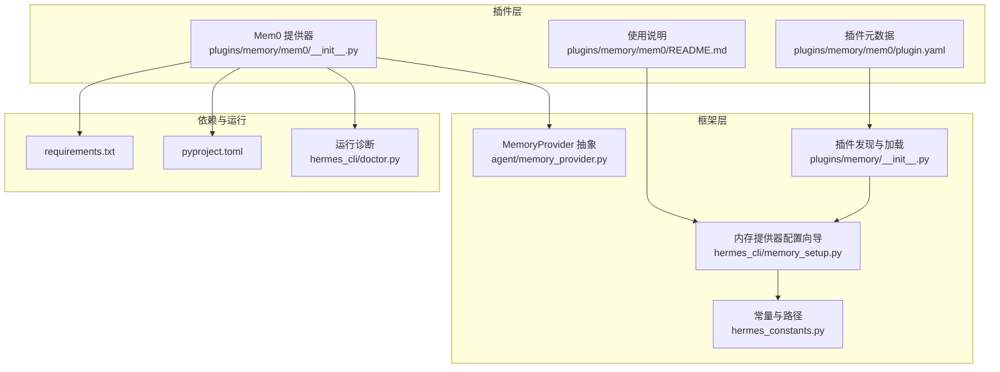
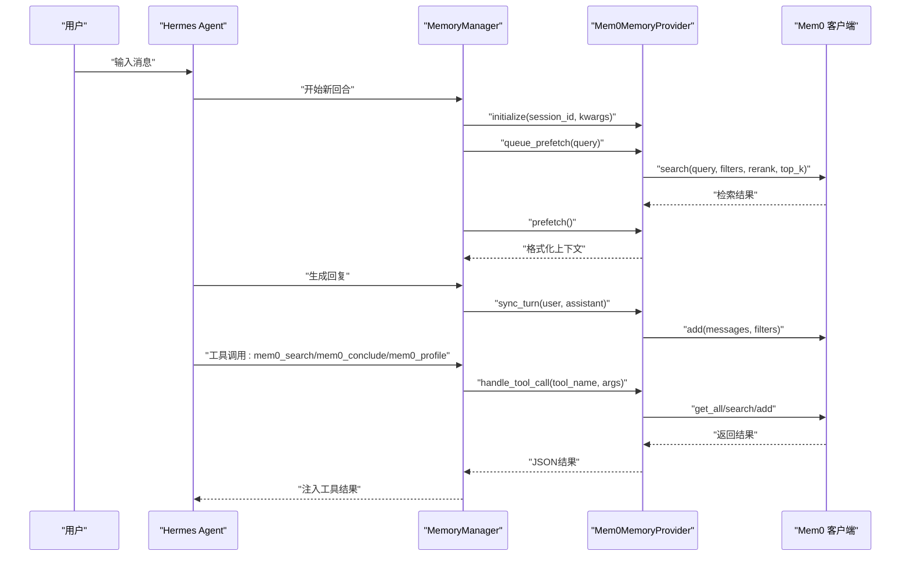
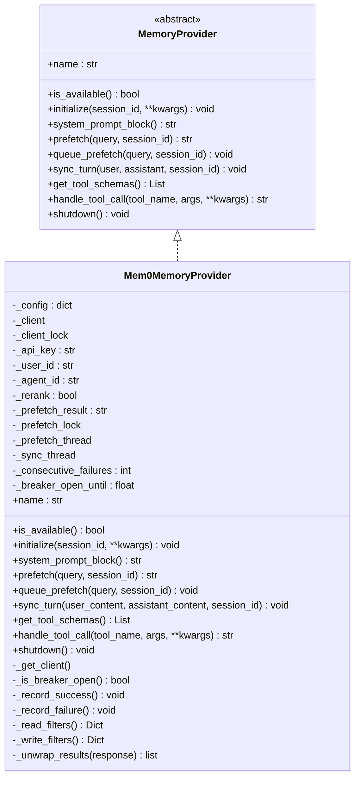
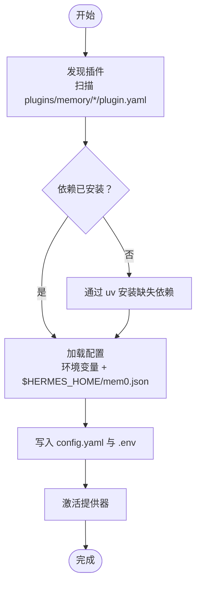
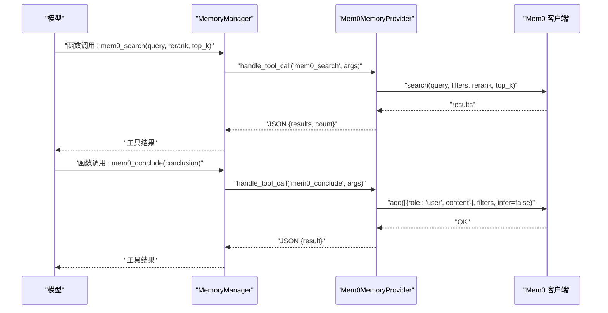
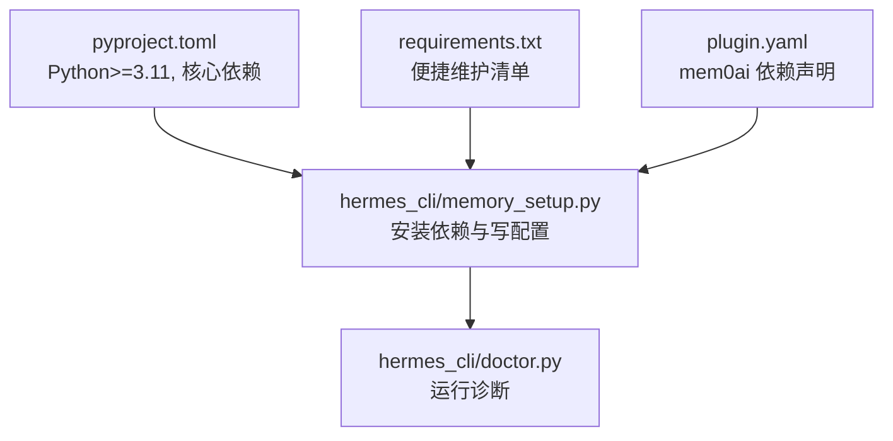

# Mem0记忆插件

<cite>
**本文引用的文件**
- [plugins/memory/mem0/__init__.py](file://plugins/memory/mem0/__init__.py)
- [plugins/memory/mem0/README.md](file://plugins/memory/mem0/README.md)
- [plugins/memory/mem0/plugin.yaml](file://plugins/memory/mem0/plugin.yaml)
- [agent/memory_provider.py](file://agent/memory_provider.py)
- [plugins/memory/__init__.py](file://plugins/memory/__init__.py)
- [hermes_cli/memory_setup.py](file://hermes_cli/memory_setup.py)
- [hermes_constants.py](file://hermes_constants.py)
- [requirements.txt](file://requirements.txt)
- [pyproject.toml](file://pyproject.toml)
- [hermes_cli/doctor.py](file://hermes_cli/doctor.py)
</cite>

## 目录
1. [简介](#简介)
2. [项目结构](#项目结构)
3. [核心组件](#核心组件)
4. [架构总览](#架构总览)
5. [详细组件分析](#详细组件分析)
6. [依赖分析](#依赖分析)
7. [性能考虑](#性能考虑)
8. [故障排查指南](#故障排查指南)
9. [结论](#结论)
10. [附录](#附录)

## 简介
Mem0记忆插件是一个基于外部平台的“记忆提供器”（MemoryProvider），为Hermes智能体提供企业级的记忆管理与AI增强能力。其核心特性包括：
- 服务端事实抽取：在对话回合结束后，自动从用户与助手的对话中抽取关键事实，写入Mem0平台。
- 语义检索与重排序：支持按语义相似度检索记忆，并可选启用重排序以提升召回精度。
- 自动去重：平台侧自动去重，避免重复记忆被反复检索。
- 背景预取与异步同步：通过后台线程进行预取与同步，降低对主推理流程的影响。
- 配置与安全：支持环境变量与本地JSON配置文件双重覆盖；具备电路断路器机制，避免服务异常时的雪崩。

该插件遵循Hermes的MemoryProvider抽象接口，作为“内置记忆”之外的一个可选外部提供器，与内置记忆叠加使用，且同一时间仅激活一个外部提供器。

## 项目结构
Mem0插件位于仓库的插件目录下，采用标准的插件布局：
- 插件入口与实现：plugins/memory/mem0/__init__.py
- 插件元数据：plugins/memory/mem0/plugin.yaml
- 插件使用说明：plugins/memory/mem0/README.md
- 插件发现与加载：plugins/memory/__init__.py
- CLI配置向导：hermes_cli/memory_setup.py
- 常量与路径：hermes_constants.py
- 依赖声明：requirements.txt、pyproject.toml
- 运行诊断：hermes_cli/doctor.py

**图表来源**
- [plugins/memory/mem0/__init__.py:1-374](file://plugins/memory/mem0/__init__.py#L1-L374)
- [plugins/memory/mem0/plugin.yaml:1-6](file://plugins/memory/mem0/plugin.yaml#L1-L6)
- [plugins/memory/mem0/README.md:1-39](file://plugins/memory/mem0/README.md#L1-L39)
- [agent/memory_provider.py:1-232](file://agent/memory_provider.py#L1-L232)
- [plugins/memory/__init__.py:1-317](file://plugins/memory/__init__.py#L1-L317)
- [hermes_cli/memory_setup.py:1-452](file://hermes_cli/memory_setup.py#L1-L452)
- [hermes_constants.py:1-200](file://hermes_constants.py#L1-L200)
- [requirements.txt:1-37](file://requirements.txt#L1-L37)
- [pyproject.toml:1-129](file://pyproject.toml#L1-L129)
- [hermes_cli/doctor.py:913-928](file://hermes_cli/doctor.py#L913-L928)

**章节来源**
- [plugins/memory/mem0/__init__.py:1-374](file://plugins/memory/mem0/__init__.py#L1-L374)
- [plugins/memory/mem0/README.md:1-39](file://plugins/memory/mem0/README.md#L1-L39)
- [plugins/memory/mem0/plugin.yaml:1-6](file://plugins/memory/mem0/plugin.yaml#L1-L6)
- [agent/memory_provider.py:1-232](file://agent/memory_provider.py#L1-L232)
- [plugins/memory/__init__.py:1-317](file://plugins/memory/__init__.py#L1-L317)
- [hermes_cli/memory_setup.py:1-452](file://hermes_cli/memory_setup.py#L1-L452)
- [hermes_constants.py:1-200](file://hermes_constants.py#L1-L200)
- [requirements.txt:1-37](file://requirements.txt#L1-L37)
- [pyproject.toml:1-129](file://pyproject.toml#L1-L129)
- [hermes_cli/doctor.py:913-928](file://hermes_cli/doctor.py#L913-L928)

## 核心组件
- MemoryProvider抽象接口：定义了提供器生命周期钩子、工具模式、配置Schema等规范，确保所有外部提供器行为一致。
- Mem0MemoryProvider实现：实现了MemoryProvider接口，负责：
  - 配置加载与可用性检查（环境变量与本地JSON覆盖）。
  - 工具模式（mem0_profile、mem0_search、mem0_conclude）。
  - 背景预取与回合同步（非阻塞线程池）。
  - 电路断路器（连续失败后冷却）。
  - 用户/代理维度的过滤器（读写隔离）。
- 插件发现与加载：扫描plugins/memory/下的子目录，发现并加载当前激活的提供器。
- CLI配置向导：交互式引导用户完成依赖安装、配置填写与激活。
- 运行诊断：检查API密钥、依赖是否安装、配置是否完整。

**章节来源**
- [agent/memory_provider.py:42-232](file://agent/memory_provider.py#L42-L232)
- [plugins/memory/mem0/__init__.py:119-374](file://plugins/memory/mem0/__init__.py#L119-L374)
- [plugins/memory/__init__.py:32-117](file://plugins/memory/__init__.py#L32-L117)
- [hermes_cli/memory_setup.py:183-351](file://hermes_cli/memory_setup.py#L183-L351)
- [hermes_cli/doctor.py:913-928](file://hermes_cli/doctor.py#L913-L928)

## 架构总览
Mem0插件通过以下链路与Hermes系统集成：
- 配置阶段：CLI向导读取插件元数据，安装依赖，写入配置与环境变量。
- 初始化阶段：MemoryManager根据配置加载插件，调用initialize()建立连接与资源。
- 推理阶段：每轮对话前调用prefetch()/queue_prefetch()进行背景检索；回合结束后调用sync_turn()异步写入事实。
- 工具调用：模型通过函数调用触发mem0_*工具，由插件handle_tool_call()处理并返回结果。
- 关闭阶段：shutdown()清理后台线程与客户端连接。

**图表来源**
- [plugins/memory/mem0/__init__.py:203-374](file://plugins/memory/mem0/__init__.py#L203-L374)
- [agent/memory_provider.py:16-31](file://agent/memory_provider.py#L16-L31)

**章节来源**
- [plugins/memory/mem0/__init__.py:203-374](file://plugins/memory/mem0/__init__.py#L203-L374)
- [agent/memory_provider.py:16-31](file://agent/memory_provider.py#L16-L31)

## 详细组件分析

### 组件A：Mem0MemoryProvider类
- 角色与职责
  - 实现MemoryProvider接口，作为外部记忆提供器。
  - 负责配置加载、可用性检查、工具模式、背景预取与回合同步。
- 关键属性与方法
  - 配置加载：_load_config()从环境变量与$HERMES_HOME/mem0.json合并配置。
  - 工具模式：PROFILE_SCHEMA、SEARCH_SCHEMA、CONCLUDE_SCHEMA。
  - 生命周期：initialize()、system_prompt_block()、shutdown()。
  - 背景处理：queue_prefetch()、prefetch()、sync_turn()。
  - 工具调用：handle_tool_call()分发mem0_*工具。
  - 安全与稳定性：电路断路器（_is_breaker_open/_record_failure/_record_success）。
- 数据流
  - 读取：filters(user_id)用于跨会话检索；filters(user_id, agent_id)用于写入归因。
  - 写入：add(messages, filters, infer=False)存储用户明确陈述的事实。
  - 检索：search(query, filters, rerank, top_k)返回带分数的结果列表。
- 并发与线程
  - 预取线程：每次预取启动独立线程，结果缓存于实例字段，下次prefetch()取回。
  - 同步线程：回合结束后启动独立线程执行add()，等待上一次同步结束。
  - 线程锁：保护客户端单例与预取结果更新。
- 错误处理
  - 导入失败时提示安装mem0ai。
  - 工具调用异常统一转为tool_error()返回。
  - 失败计数超过阈值触发断路器，暂停后续请求直至冷却。

**图表来源**
- [agent/memory_provider.py:42-232](file://agent/memory_provider.py#L42-L232)
- [plugins/memory/mem0/__init__.py:119-374](file://plugins/memory/mem0/__init__.py#L119-L374)

**章节来源**
- [plugins/memory/mem0/__init__.py:119-374](file://plugins/memory/mem0/__init__.py#L119-L374)
- [agent/memory_provider.py:42-232](file://agent/memory_provider.py#L42-L232)

### 组件B：配置与安装流程
- 配置来源与优先级
  - 环境变量默认值（MEM0_API_KEY、MEM0_USER_ID、MEM0_AGENT_ID）。
  - $HERMES_HOME/mem0.json覆盖（仅覆盖非空值，避免静默失败）。
- CLI配置向导
  - 发现插件：扫描plugins/memory/，读取plugin.yaml中的pip依赖。
  - 安装依赖：通过uv安装缺失的Python包（如mem0ai）。
  - 写入配置：将激活的提供器写入config.yaml；敏感信息写入.env。
- 运行诊断
  - doctor命令检查API密钥是否存在、依赖是否安装、配置是否完整。

**图表来源**
- [hermes_cli/memory_setup.py:58-125](file://hermes_cli/memory_setup.py#L58-L125)
- [plugins/memory/__init__.py:32-117](file://plugins/memory/__init__.py#L32-L117)
- [plugins/memory/mem0/__init__.py:40-66](file://plugins/memory/mem0/__init__.py#L40-L66)
- [hermes_cli/doctor.py:913-928](file://hermes_cli/doctor.py#L913-L928)

**章节来源**
- [hermes_cli/memory_setup.py:58-125](file://hermes_cli/memory_setup.py#L58-L125)
- [plugins/memory/__init__.py:32-117](file://plugins/memory/__init__.py#L32-L117)
- [plugins/memory/mem0/__init__.py:40-66](file://plugins/memory/mem0/__init__.py#L40-L66)
- [hermes_cli/doctor.py:913-928](file://hermes_cli/doctor.py#L913-L928)

### 组件C：工具模式与API接口
- mem0_profile
  - 功能：获取当前用户的所有记忆概览（快速、不重排序）。
  - 参数：无。
  - 返回：记忆列表与数量。
- mem0_search
  - 功能：按语义检索记忆，支持可选重排序与top_k限制。
  - 参数：query（必填）、rerank（布尔，默认false）、top_k（整数，默认10，最大50）。
  - 返回：记忆项列表（含memory与score）。
- mem0_conclude
  - 功能：存储用户明确陈述的事实（verbatim，不进行LLM抽取）。
  - 参数：conclusion（必填）。
  - 返回：存储成功提示。

**图表来源**
- [plugins/memory/mem0/__init__.py:323-361](file://plugins/memory/mem0/__init__.py#L323-L361)

**章节来源**
- [plugins/memory/mem0/__init__.py:73-112](file://plugins/memory/mem0/__init__.py#L73-L112)
- [plugins/memory/mem0/__init__.py:323-361](file://plugins/memory/mem0/__init__.py#L323-L361)

## 依赖分析
- Python运行时要求
  - Python版本：>=3.11（pyproject.toml）。
  - 核心依赖：openai、anthropic、httpx、pydantic等（pyproject.toml）。
- 插件依赖
  - mem0ai：Mem0客户端库（plugin.yaml声明）。
  - requirements.txt中未直接列出mem0ai，但plugin.yaml明确要求。
- 插件发现与加载
  - 通过plugins/memory/__init__.py扫描插件目录，读取plugin.yaml元数据，动态导入对应提供器。
- CLI与诊断
  - hermes_cli/memory_setup.py负责安装依赖与写入配置。
  - hermes_cli/doctor.py检查API密钥与依赖状态。

**图表来源**
- [pyproject.toml:10-37](file://pyproject.toml#L10-L37)
- [requirements.txt:1-37](file://requirements.txt#L1-L37)
- [plugins/memory/mem0/plugin.yaml:4-6](file://plugins/memory/mem0/plugin.yaml#L4-L6)
- [hermes_cli/memory_setup.py:58-125](file://hermes_cli/memory_setup.py#L58-L125)
- [hermes_cli/doctor.py:913-928](file://hermes_cli/doctor.py#L913-L928)

**章节来源**
- [pyproject.toml:10-37](file://pyproject.toml#L10-L37)
- [requirements.txt:1-37](file://requirements.txt#L1-L37)
- [plugins/memory/mem0/plugin.yaml:4-6](file://plugins/memory/mem0/plugin.yaml#L4-L6)
- [hermes_cli/memory_setup.py:58-125](file://hermes_cli/memory_setup.py#L58-L125)
- [hermes_cli/doctor.py:913-928](file://hermes_cli/doctor.py#L913-L928)

## 性能考虑
- 背景处理
  - 预取与同步均通过独立线程执行，避免阻塞主推理线程。
  - 预取线程在启动新任务前会等待上一次任务结束，防止竞争与抖动。
- 检索参数
  - 默认top_k=10，最大50；在重要查询中启用rerank可提高召回质量但增加延迟。
- 断路器
  - 连续失败达到阈值后进入冷却期，避免对下游造成压力。
- 并发与锁
  - 客户端单例与预取结果更新使用锁保护，确保线程安全。
- 建议
  - 在高并发场景下，适当降低top_k或关闭rerank以减少延迟。
  - 对频繁调用的工具（如mem0_search）可结合本地缓存策略（需在上层实现）。

[本节为通用性能建议，无需特定文件引用]

## 故障排查指南
- 常见问题与定位
  - API密钥未配置：doctor命令会提示缺少MEM0_API_KEY。
  - 依赖未安装：doctor命令会提示需要安装mem0ai。
  - 配置文件覆盖：确认$HERMES_HOME/mem0.json存在且字段非空。
- 日志与调试
  - 插件内部捕获异常并记录调试日志；工具调用失败返回tool_error()。
  - 断路器触发时会输出警告日志，提示暂停API调用。
- 处理步骤
  - 使用hermes memory status查看当前配置与可用性。
  - 使用hermes memory setup重新配置或修复依赖。
  - 检查HERMES_HOME路径与权限，确保可读写mem0.json与.env。

**章节来源**
- [hermes_cli/doctor.py:913-928](file://hermes_cli/doctor.py#L913-L928)
- [plugins/memory/mem0/__init__.py:197-201](file://plugins/memory/mem0/__init__.py#L197-L201)
- [plugins/memory/mem0/__init__.py:300-304](file://plugins/memory/mem0/__init__.py#L300-L304)

## 结论
Mem0记忆插件通过标准化的MemoryProvider接口无缝集成到Hermes系统中，为企业用户提供：
- 服务端事实抽取与自动去重，降低重复记忆成本。
- 语义检索与可选重排序，兼顾召回质量与性能。
- 背景预取与异步同步，保障推理流畅性。
- 完善的配置与诊断能力，便于在企业环境中部署与运维。

建议在生产环境中结合断路器与缓存策略，配合严格的凭据管理与审计，确保系统的稳定性与安全性。

[本节为总结性内容，无需特定文件引用]

## 附录

### A. 配置选项说明
- 环境变量
  - MEM0_API_KEY：Mem0平台API密钥（必需）。
  - MEM0_USER_ID：用户标识符（默认：hermes-user）。
  - MEM0_AGENT_ID：代理标识符（默认：hermes）。
- 本地配置文件
  - 路径：$HERMES_HOME/mem0.json
  - 作用：覆盖环境变量中的非空字段，避免静默失败。
- CLI配置向导
  - hermes memory setup：交互式选择提供器、安装依赖、填写配置。
  - hermes memory status：查看当前配置与可用性。

**章节来源**
- [plugins/memory/mem0/__init__.py:8-14](file://plugins/memory/mem0/__init__.py#L8-L14)
- [plugins/memory/mem0/__init__.py:40-66](file://plugins/memory/mem0/__init__.py#L40-L66)
- [hermes_cli/memory_setup.py:219-351](file://hermes_cli/memory_setup.py#L219-L351)

### B. 安装与依赖管理
- Python版本：>=3.11。
- 必需依赖：mem0ai（通过plugin.yaml声明）。
- 可选依赖：见pyproject.toml与requirements.txt中的核心与工具依赖。
- 依赖安装：hermes_cli/memory_setup.py会自动检测并安装缺失的pip依赖。

**章节来源**
- [pyproject.toml:10-37](file://pyproject.toml#L10-L37)
- [requirements.txt:1-37](file://requirements.txt#L1-L37)
- [plugins/memory/mem0/plugin.yaml:4-6](file://plugins/memory/mem0/plugin.yaml#L4-L6)
- [hermes_cli/memory_setup.py:58-125](file://hermes_cli/memory_setup.py#L58-L125)

### C. 使用示例与最佳实践
- 使用示例
  - 通过CLI配置：hermes memory setup，选择mem0，填写API密钥。
  - 手动配置：设置MEM0_API_KEY，运行hermes config set memory.provider mem0。
- 最佳实践
  - 在网关会话中优先使用平台提供的user_id，确保跨会话记忆正确归属。
  - 对重要查询启用rerank以提升召回质量。
  - 结合本地缓存与断路器策略，平衡性能与可靠性。
  - 定期使用hermes memory status检查配置与依赖状态。

**章节来源**
- [plugins/memory/mem0/README.md:10-21](file://plugins/memory/mem0/README.md#L10-L21)
- [plugins/memory/mem0/__init__.py:206-210](file://plugins/memory/mem0/__init__.py#L206-L210)
- [hermes_cli/memory_setup.py:219-351](file://hermes_cli/memory_setup.py#L219-L351)

### D. 企业部署考虑
- 认证与访问控制
  - 使用环境变量与.env管理敏感信息，避免硬编码。
  - 在多租户场景下，确保user_id与agent_id隔离不同用户与工作区。
- 存储与扩展
  - 利用Mem0平台的存储与检索能力，避免自建向量库的复杂度。
  - 通过filters(user_id, agent_id)实现细粒度的读写隔离。
- 监控与可观测性
  - 关注断路器触发与工具调用失败日志，及时发现下游异常。
  - 结合上层指标（延迟、吞吐、错误率）评估性能与稳定性。

**章节来源**
- [plugins/memory/mem0/__init__.py:212-218](file://plugins/memory/mem0/__init__.py#L212-L218)
- [plugins/memory/mem0/__init__.py:197-201](file://plugins/memory/mem0/__init__.py#L197-L201)
- [hermes_cli/doctor.py:913-928](file://hermes_cli/doctor.py#L913-L928)