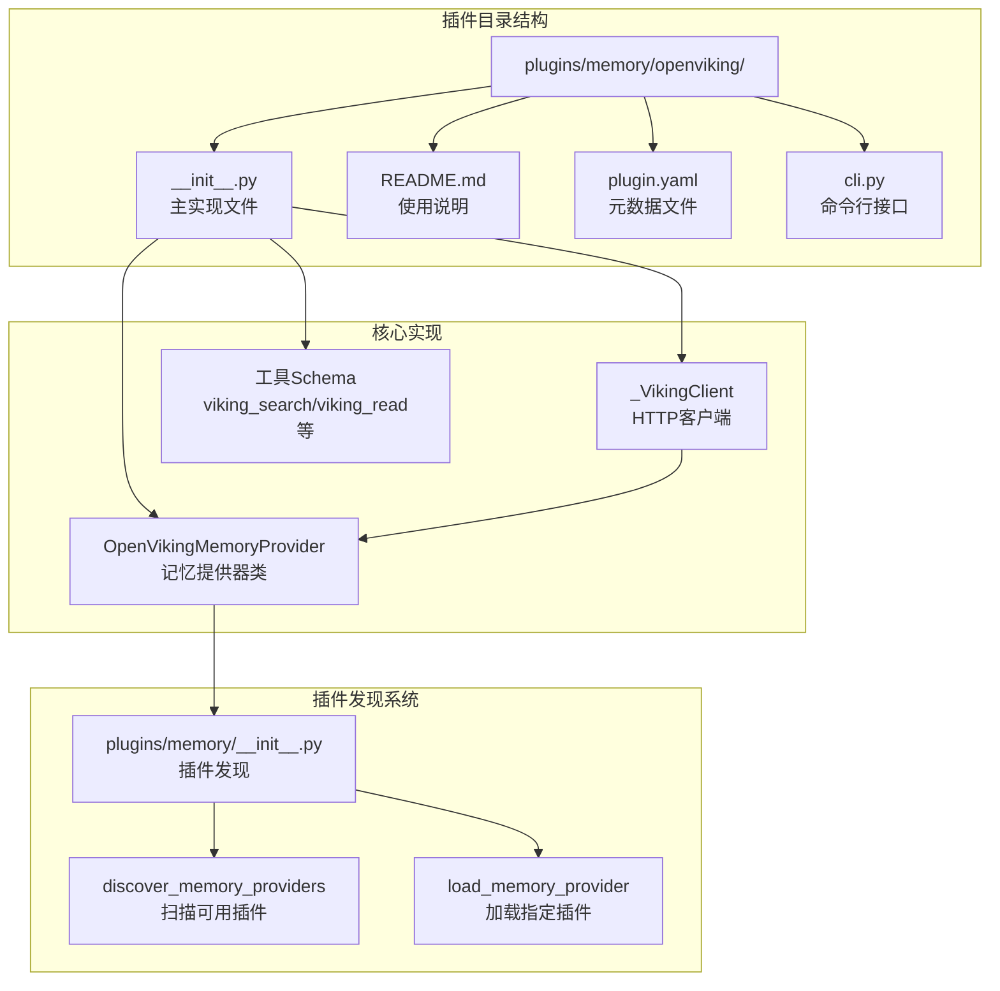
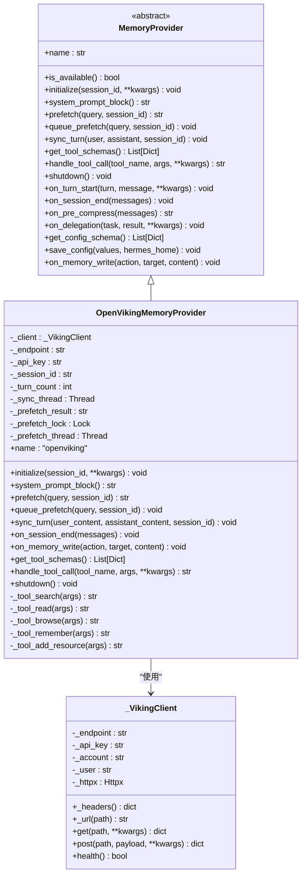
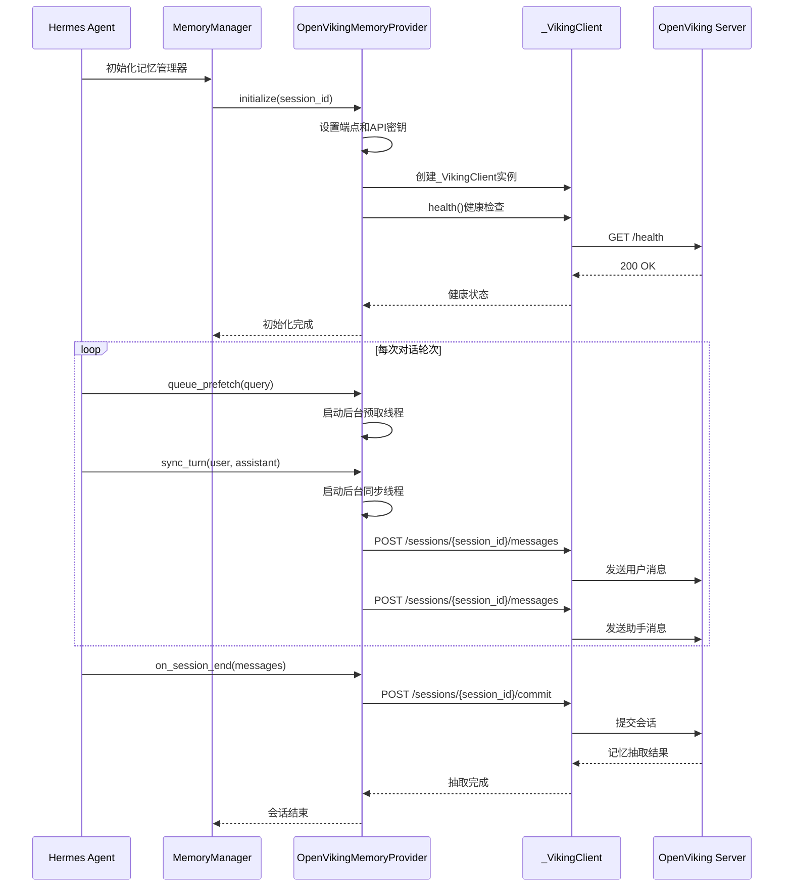
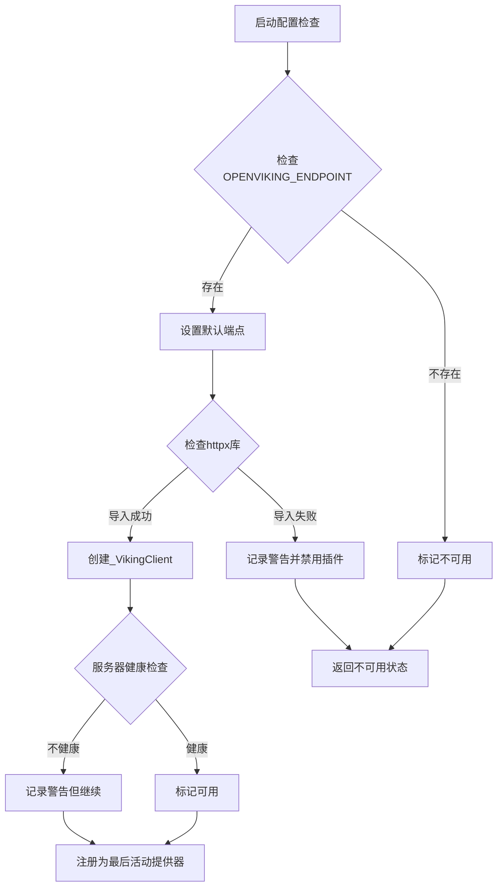
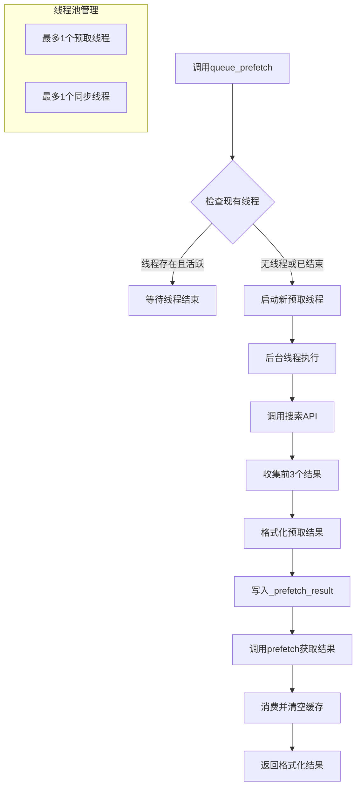
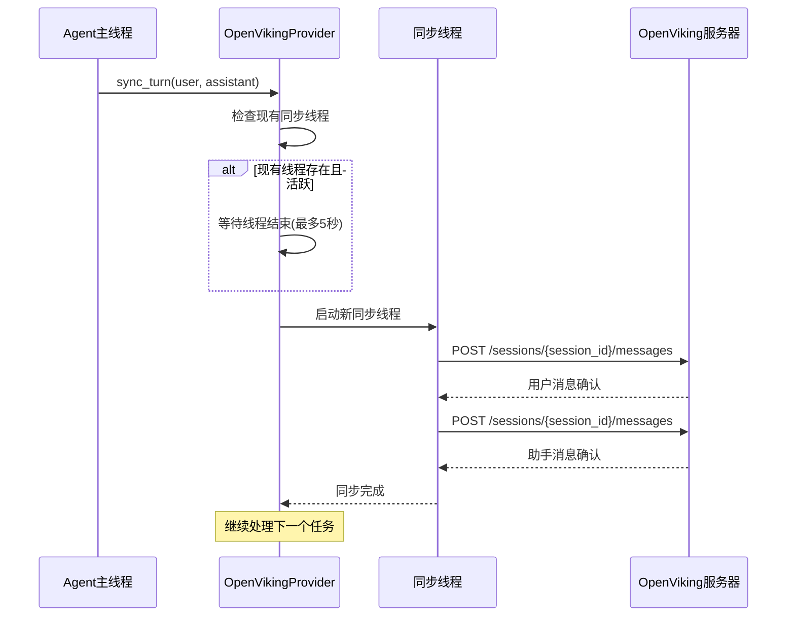

# OpenViking记忆插件

<cite>
**本文档引用的文件**
- [plugins/memory/openviking/__init__.py](file://plugins/memory/openviking/__init__.py)
- [plugins/memory/openviking/README.md](file://plugins/memory/openviking/README.md)
- [plugins/memory/__init__.py](file://plugins/memory/__init__.py)
- [agent/memory_provider.py](file://agent/memory_provider.py)
- [requirements.txt](file://requirements.txt)
- [website/docs/user-guide/features/memory-providers.md](file://website/docs/user-guide/features/memory-providers.md)
- [website/docs/developer-guide/memory-provider-plugin.md](file://website/docs/developer-guide/memory-provider-plugin.md)
- [run_agent.py](file://run_agent.py)
</cite>

## 目录
1. [简介](#简介)
2. [项目结构](#项目结构)
3. [核心组件](#核心组件)
4. [架构总览](#架构总览)
5. [详细组件分析](#详细组件分析)
6. [依赖分析](#依赖分析)
7. [性能考虑](#性能考虑)
8. [故障排除指南](#故障排除指南)
9. [结论](#结论)
10. [附录](#附录)

## 简介
OpenViking记忆插件是Hermes Agent的一个外部记忆提供器插件，基于字节跳动（原Volcengine）的OpenViking上下文数据库，为智能体提供跨会话的持久化知识管理能力。该插件实现了完整的双向MemoryProvider接口，支持自动记忆抽取、分层上下文检索、语义搜索、文件系统风格浏览以及资源入库等功能。

插件采用开源记忆管理理念，强调：
- **自动记忆抽取**：在会话结束时自动从对话中提取6类记忆（偏好、实体、事件、案例、模式）
- **分层上下文检索**：提供L0（约100tokens）、L1（约2k tokens）、L2（完整内容）三层检索能力
- **语义搜索与层次化目录检索**：支持基于viking:// URI的文件系统式浏览
- **资源入库**：支持URL、文档、代码等资源的自动解析、索引和摘要生成

## 项目结构
OpenViking插件位于`plugins/memory/openviking/`目录下，采用标准的Hermes插件结构：



**图表来源**
- [plugins/memory/openviking/__init__.py:1-633](file://plugins/memory/openviking/__init__.py#L1-L633)
- [plugins/memory/__init__.py:1-318](file://plugins/memory/__init__.py#L1-L318)

**章节来源**
- [plugins/memory/openviking/__init__.py:1-633](file://plugins/memory/openviking/__init__.py#L1-L633)
- [plugins/memory/openviking/README.md:1-41](file://plugins/memory/openviking/README.md#L1-L41)

## 核心组件
OpenViking插件由以下核心组件构成：

### OpenVikingMemoryProvider类
这是插件的主要实现类，继承自MemoryProvider抽象基类，实现了完整的记忆提供器接口：

- **生命周期管理**：initialize()、shutdown()方法处理插件初始化和清理
- **会话管理**：维护会话ID、转数统计、后台线程管理
- **工具集成**：提供5个核心工具的Schema定义和调用处理
- **异步操作**：使用多线程实现非阻塞的记忆同步和预取

### _VikingClient类
轻量级的HTTP客户端，封装了对OpenViking REST API的访问：

- **认证支持**：支持API密钥认证和租户账户/用户标识
- **健康检查**：提供服务器可达性检测
- **统一接口**：封装GET/POST请求，处理超时和错误

### 工具Schema定义
插件定义了5个核心工具的Schema，用于模型函数调用：

- **viking_search**：语义搜索工具，支持fast/deep/auto三种模式
- **viking_read**：内容读取工具，支持abstract/overview/full三级详情
- **viking_browse**：文件系统浏览工具，支持tree/list/stat操作
- **viking_remember**：显式记忆存储工具
- **viking_add_resource**：资源入库工具

**章节来源**
- [plugins/memory/openviking/__init__.py:252-632](file://plugins/memory/openviking/__init__.py#L252-L632)
- [agent/memory_provider.py:42-232](file://agent/memory_provider.py#L42-L232)

## 架构总览
OpenViking插件采用分层架构设计，确保与Hermes Agent核心系统的松耦合集成：

```mermaid
graph TB
subgraph "Hermes Agent核心"
A[MemoryManager<br/>记忆管理器] --> B[MemoryProvider接口<br/>抽象基类]
B --> C[OpenVikingMemoryProvider<br/>具体实现]
end
subgraph "插件发现系统"
D[plugins.memory.__init__<br/>插件发现] --> E[discover_memory_providers<br/>扫描可用插件]
D --> F[load_memory_provider<br/>加载插件实例]
end
subgraph "OpenViking服务端"
G[OpenViking Server<br/>REST API] --> H[/api/v1/search/find<br/>搜索接口]
G --> I[/api/v1/content/*<br/>内容接口]
G --> J[/api/v1/fs/*<br/>文件系统接口]
G --> K[/api/v1/sessions/*<br/>会话接口]
G --> L[/api/v1/resources<br/>资源接口]
end
subgraph "工具调用链"
M[模型] --> N[viking_search工具]
N --> O[_tool_search方法]
O --> P[_VikingClient.post]
P --> H
end
C --> D
C --> G
C --> M
```

**图表来源**
- [plugins/memory/openviking/__init__.py:252-632](file://plugins/memory/openviking/__init__.py#L252-L632)
- [plugins/memory/__init__.py:32-196](file://plugins/memory/__init__.py#L32-L196)

该架构的关键特性：
- **插件化设计**：通过标准接口与Agent核心解耦
- **异步处理**：所有网络操作都使用后台线程，避免阻塞主流程
- **容错机制**：完善的异常处理和降级策略
- **生命周期管理**：完整的初始化、运行、清理流程

**章节来源**
- [plugins/memory/openviking/__init__.py:291-491](file://plugins/memory/openviking/__init__.py#L291-L491)
- [plugins/memory/__init__.py:78-196](file://plugins/memory/__init__.py#L78-L196)

## 详细组件分析

### OpenVikingMemoryProvider类详解

#### 类图设计


**图表来源**
- [agent/memory_provider.py:42-232](file://agent/memory_provider.py#L42-L232)
- [plugins/memory/openviking/__init__.py:252-129](file://plugins/memory/openviking/__init__.py#L252-L129)

#### 生命周期管理流程


**图表来源**
- [plugins/memory/openviking/__init__.py:291-437](file://plugins/memory/openviking/__init__.py#L291-L437)
- [run_agent.py:1163-1185](file://run_agent.py#L1163-L1185)

#### 工具调用处理流程
```mermaid
flowchart TD
A[模型调用工具] --> B{工具名称识别}
B --> |viking_search| C[_tool_search方法]
B --> |viking_read| D[_tool_read方法]
B --> |viking_browse| E[_tool_browse方法]
B --> |viking_remember| F[_tool_remember方法]
B --> |viking_add_resource| G[_tool_add_resource方法]
C --> H[构造查询参数]
H --> I[调用_client.post("/api/v1/search/find")]
I --> J[格式化搜索结果]
J --> K[返回JSON结果]
D --> L[映射详情级别]
L --> M[调用对应内容接口]
M --> N[截断过长内容]
N --> K
E --> O[映射浏览动作]
O --> P[调用对应FS接口]
P --> Q[格式化列表/树结果]
Q --> K
F --> R[添加记忆消息到会话]
R --> S[等待会话提交时抽取]
S --> K
G --> T[调用资源接口]
T --> U[返回处理状态]
U --> K
```

**图表来源**
- [plugins/memory/openviking/__init__.py:463-624](file://plugins/memory/openviking/__init__.py#L463-L624)

**章节来源**
- [plugins/memory/openviking/__init__.py:252-632](file://plugins/memory/openviking/__init__.py#L252-L632)

### 配置参数说明

#### 环境变量配置
| 环境变量名 | 默认值 | 描述 | 必需性 |
|------------|--------|------|--------|
| OPENVIKING_ENDPOINT | http://127.0.0.1:1933 | OpenViking服务器URL | 是 |
| OPENVIKING_API_KEY | 空 | API密钥（认证服务器需要） | 否 |
| OPENVIKING_ACCOUNT | root | 租户账户标识 | 否 |
| OPENVIKING_USER | default | 租户用户标识 | 否 |

#### 内部配置参数
| 参数名 | 描述 | 类型 | 默认值 |
|--------|------|------|--------|
| endpoint | OpenViking服务器URL | 字符串 | OPENVIKING_ENDPOINT环境变量 |
| api_key | OpenViking API密钥 | 字符串 | OPENVIKING_API_KEY环境变量 |

#### 配置验证流程


**图表来源**
- [plugins/memory/openviking/__init__.py:270-309](file://plugins/memory/openviking/__init__.py#L270-L309)

**章节来源**
- [plugins/memory/openviking/__init__.py:274-289](file://plugins/memory/openviking/__init__.py#L274-L289)
- [plugins/memory/openviking/README.md:23-31](file://plugins/memory/openviking/README.md#L23-L31)

### 缓存机制分析

#### 预取缓存机制
OpenViking插件实现了两级缓存机制来优化性能：

1. **内存缓存**：使用`_prefetch_result`存储后台线程预取的结果
2. **线程安全**：通过`_prefetch_lock`确保并发访问的安全性
3. **异步预取**：在每次对话前启动后台线程进行预取，避免阻塞主流程

#### 缓存流程图


**图表来源**
- [plugins/memory/openviking/__init__.py:336-378](file://plugins/memory/openviking/__init__.py#L336-L378)
- [plugins/memory/openviking/__init__.py:380-413](file://plugins/memory/openviking/__init__.py#L380-L413)

**章节来源**
- [plugins/memory/openviking/__init__.py:336-413](file://plugins/memory/openviking/__init__.py#L336-L413)

### 同步选项设计

#### 异步同步机制
插件采用异步同步策略，确保不会阻塞主对话流程：

1. **非阻塞写入**：每次对话轮次后立即启动后台线程进行同步
2. **线程队列**：确保同一时间只有一个同步线程在运行
3. **超时控制**：为同步操作设置合理的超时时间
4. **错误恢复**：捕获并记录同步过程中的异常

#### 同步流程


**图表来源**
- [plugins/memory/openviking/__init__.py:380-413](file://plugins/memory/openviking/__init__.py#L380-L413)

**章节来源**
- [plugins/memory/openviking/__init__.py:380-458](file://plugins/memory/openviking/__init__.py#L380-L458)

## 依赖分析

### 外部依赖
OpenViking插件的依赖关系相对简单，主要依赖于Hermes Agent的核心框架：

```mermaid
graph TB
subgraph "OpenViking插件"
A[OpenVikingMemoryProvider] --> B[agent.memory_provider.MemoryProvider]
A --> C[tools.registry.tool_error]
end
subgraph "HTTP客户端"
D[_VikingClient] --> E[httpx库]
end
subgraph "系统依赖"
F[Python标准库] --> G[threading]
F --> H=logging
F --> I=os
F --> J=json
end
subgraph "Hermes核心"
B --> K[MemoryProvider抽象基类]
C --> L[工具错误处理]
end
```

**图表来源**
- [plugins/memory/openviking/__init__.py:33-34](file://plugins/memory/openviking/__init__.py#L33-L34)
- [requirements.txt:9](file://requirements.txt#L9)

### 依赖注入和模块加载
插件通过标准的Python包机制进行模块加载，遵循Hermes Agent的插件发现系统：

1. **自动发现**：通过扫描`plugins/memory/`目录自动发现可用插件
2. **动态加载**：使用`importlib`动态加载插件模块
3. **实例化**：调用插件的`register()`函数获取MemoryProvider实例
4. **配置验证**：通过`is_available()`方法进行轻量级可用性检查

**章节来源**
- [plugins/memory/__init__.py:99-196](file://plugins/memory/__init__.py#L99-L196)
- [requirements.txt:1-37](file://requirements.txt#L1-L37)

## 性能考虑

### 网络延迟优化
- **异步处理**：所有网络请求都在后台线程中执行
- **连接复用**：_VikingClient实例在会话期间复用
- **超时控制**：统一的30秒超时设置，避免长时间阻塞
- **健康检查**：启动时进行服务器健康检查，减少无效请求

### 内存使用优化
- **结果截断**：内容读取时对过长内容进行截断，避免内存溢出
- **线程限制**：限制同时运行的后台线程数量
- **缓存管理**：及时清理预取缓存，避免内存泄漏

### 并发安全
- **锁机制**：使用threading.Lock保护共享资源
- **线程安全**：确保多线程环境下的数据一致性
- **优雅降级**：在网络异常时提供降级行为

## 故障排除指南

### 常见问题诊断

#### 服务器连接问题
1. **检查端点配置**：确认OPENVIKING_ENDPOINT环境变量正确设置
2. **验证服务器状态**：使用`curl`或浏览器访问服务器健康检查端点
3. **网络连通性**：确保本地防火墙允许到服务器的连接

#### 认证失败问题
1. **API密钥验证**：确认OPENVIKING_API_KEY设置正确
2. **租户信息**：检查OPENVIKING_ACCOUNT和OPENVIKING_USER配置
3. **权限检查**：验证API密钥的权限范围

#### 工具调用错误
1. **参数验证**：检查工具调用的必需参数是否完整
2. **URI格式**：确保viking:// URI格式正确
3. **权限问题**：确认用户对目标资源具有访问权限

### 日志分析
插件提供了详细的日志输出，可用于问题诊断：

- **调试级别**：记录详细的内部状态和错误信息
- **警告级别**：记录可恢复的错误和异常情况
- **信息级别**：记录重要的操作和状态变化

**章节来源**
- [plugins/memory/openviking/__init__.py:414-491](file://plugins/memory/openviking/__init__.py#L414-L491)

## 结论
OpenViking记忆插件代表了Hermes Agent在开源记忆管理领域的创新实践。通过实现完整的MemoryProvider接口，该插件不仅提供了强大的记忆管理功能，还展示了开源软件在复杂系统集成方面的最佳实践。

### 主要优势
1. **设计理念先进**：采用自动记忆抽取和分层检索的理念
2. **架构设计优秀**：清晰的分层架构和良好的解耦设计
3. **性能优化到位**：异步处理和缓存机制确保高效运行
4. **用户体验友好**：简洁的配置和丰富的工具集

### 技术特色
- **双向集成**：既支持从外部系统读取记忆，也支持将内置记忆镜像到外部系统
- **会话感知**：完整的会话生命周期管理，支持记忆抽取和总结
- **工具丰富**：提供5个核心工具，覆盖记忆管理的各个方面
- **扩展性强**：基于标准接口设计，易于扩展和定制

### 生态贡献
OpenViking插件为Hermes Agent生态系统贡献了：
1. **开源记忆管理方案**：提供了一个完整的开源记忆管理实现
2. **最佳实践示范**：展示了如何构建高质量的插件系统
3. **技术创新推动**：引入了自动记忆抽取等前沿概念
4. **社区价值创造**：为开发者和用户提供了一个可靠的解决方案

## 附录

### 安装部署流程

#### 环境要求
- Python 3.7+
- httpx库（作为依赖自动安装）
- OpenViking服务器实例

#### 安装步骤
1. **启用插件**：在配置文件中设置`memory.provider: openviking`
2. **配置环境变量**：设置OPENVIKING_ENDPOINT指向服务器地址
3. **启动服务器**：确保OpenViking服务器正常运行
4. **验证连接**：通过工具调用验证插件工作正常

#### 配置示例
```yaml
# ~/.hermes/config.yaml
memory:
  provider: openviking
  
# ~/.hermes/.env
OPENVIKING_ENDPOINT=http://localhost:1933
OPENVIKING_API_KEY=your-api-key
```

### 使用示例

#### 基本搜索
```bash
# 在对话中使用viking_search工具
{"name": "viking_search", "arguments": {"query": "机器学习算法", "mode": "auto"}}
```

#### 内容读取
```bash
# 获取详细内容
{"name": "viking_read", "arguments": {"uri": "viking://docs/ml/algorithms/", "level": "overview"}}
```

#### 资源入库
```bash
# 添加GitHub仓库
{"name": "viking_add_resource", "arguments": {"url": "https://github.com/example/repo", "reason": "相关研究资料"}}
```

### 集成测试建议

#### 单元测试要点
1. **工具Schema验证**：确保所有工具Schema定义完整
2. **异步操作测试**：验证后台线程的正确性和安全性
3. **错误处理测试**：模拟网络异常和服务器错误
4. **内存泄漏检测**：监控长时间运行的内存使用情况

#### 端到端测试场景
1. **完整对话流程**：从初始化到会话结束的完整测试
2. **工具调用组合**：测试多个工具的组合使用
3. **并发访问测试**：模拟多用户并发场景
4. **性能基准测试**：测量关键操作的响应时间

### 社区参与指南

#### 贡献流程
1. **问题报告**：通过GitHub Issues报告bug和建议
2. **功能请求**：提出新功能需求和改进建议
3. **代码贡献**：提交Pull Request，遵循代码规范
4. **文档改进**：帮助完善文档和示例

#### 开发环境搭建
1. **克隆仓库**：获取源码和示例
2. **安装依赖**：根据requirements.txt安装依赖
3. **运行测试**：执行单元测试和集成测试
4. **代码审查**：遵循代码审查流程

#### 社区资源
- GitHub Issues：问题跟踪和讨论
- Pull Requests：代码贡献和审查
- Discussions：社区讨论和技术交流
- 文档：官方文档和API参考

**章节来源**
- [website/docs/user-guide/features/memory-providers.md:1-208](file://website/docs/user-guide/features/memory-providers.md#L1-L208)
- [website/docs/developer-guide/memory-provider-plugin.md:1-52](file://website/docs/developer-guide/memory-provider-plugin.md#L1-L52)