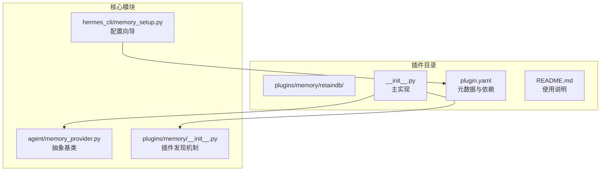
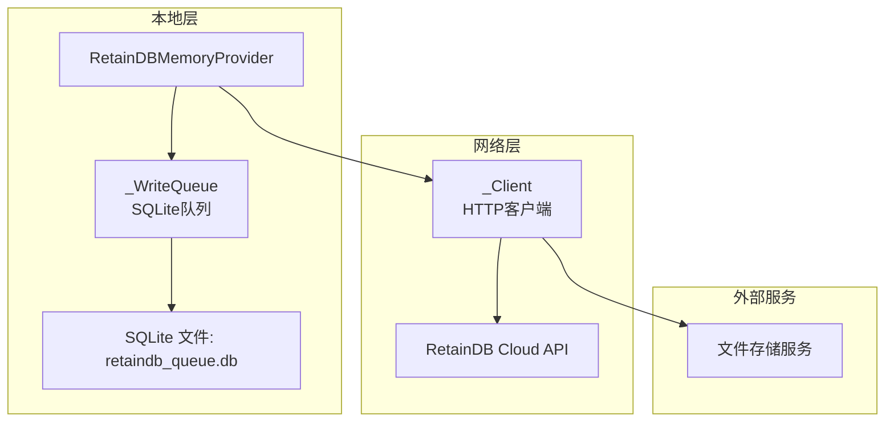
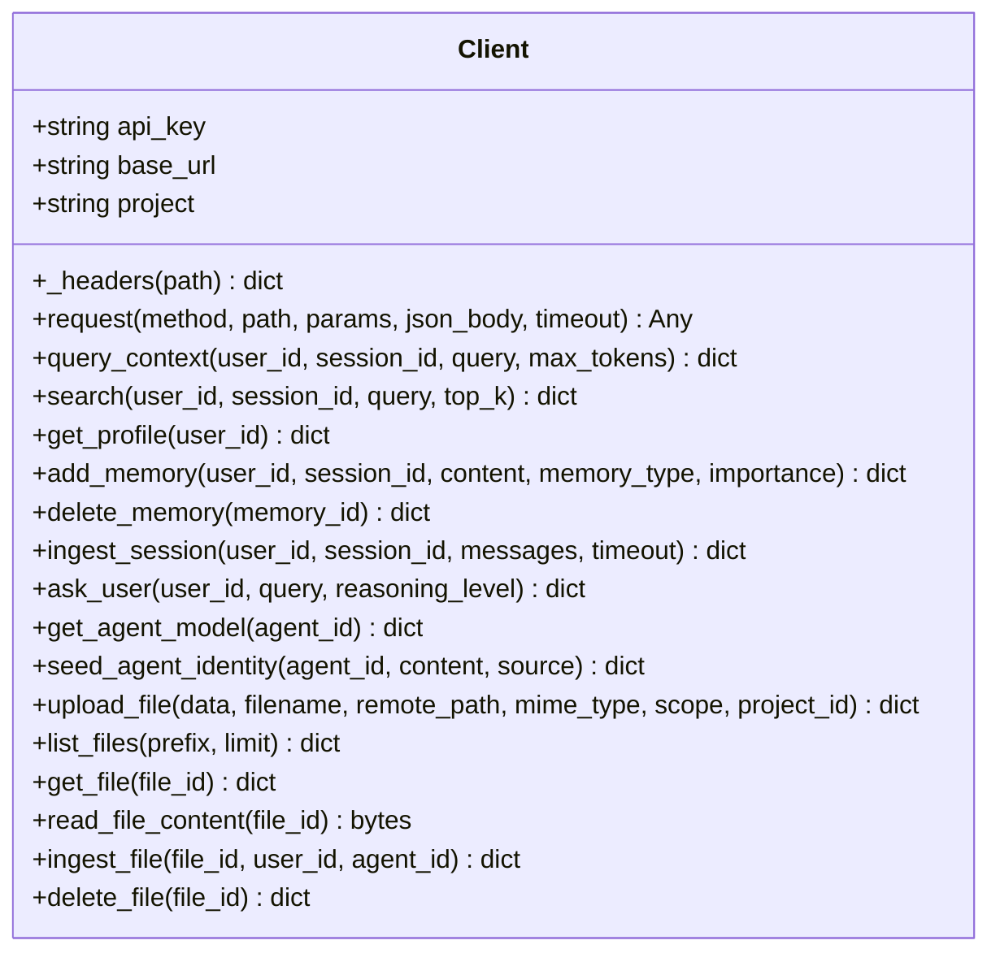
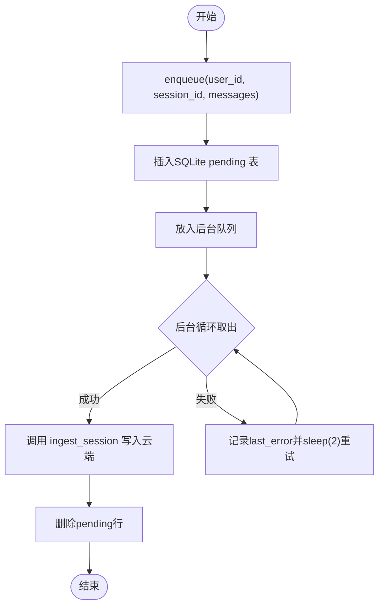
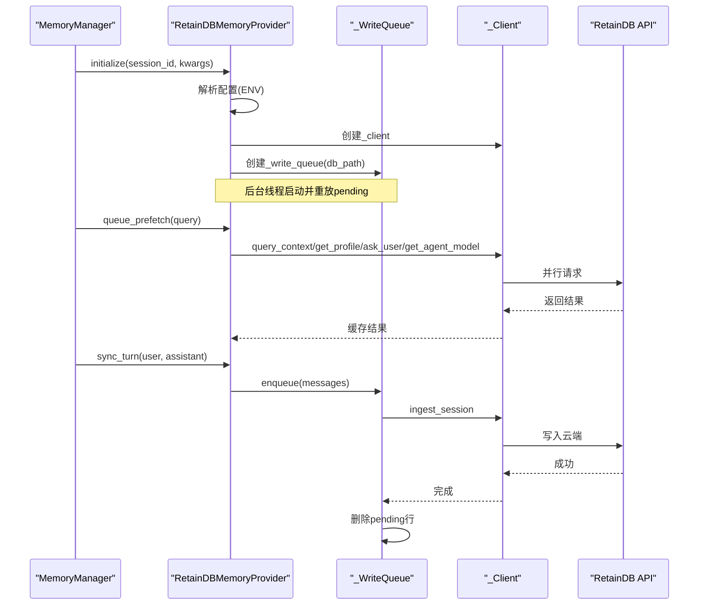
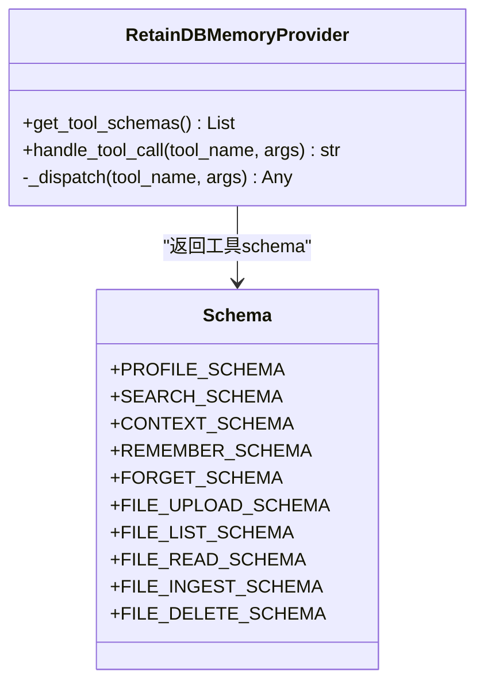
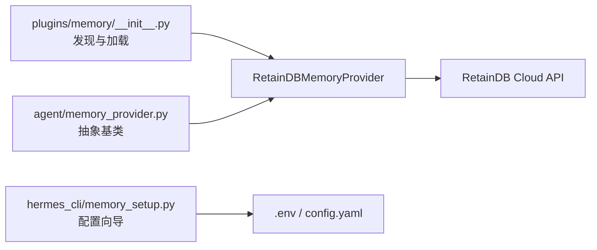

# RetainDB记忆插件

<cite>
**本文档引用的文件**
- [plugins/memory/retaindb/__init__.py](file://plugins/memory/retaindb/__init__.py)
- [plugins/memory/retaindb/plugin.yaml](file://plugins/memory/retaindb/plugin.yaml)
- [plugins/memory/retaindb/README.md](file://plugins/memory/retaindb/README.md)
- [tests/plugins/test_retaindb_plugin.py](file://tests/plugins/test_retaindb_plugin.py)
- [agent/memory_provider.py](file://agent/memory_provider.py)
- [plugins/memory/__init__.py](file://plugins/memory/__init__.py)
- [hermes_cli/memory_setup.py](file://hermes_cli/memory_setup.py)
</cite>

## 目录
1. [简介](#简介)
2. [项目结构](#项目结构)
3. [核心组件](#核心组件)
4. [架构总览](#架构总览)
5. [详细组件分析](#详细组件分析)
6. [依赖关系分析](#依赖关系分析)
7. [性能考虑](#性能考虑)
8. [故障排除指南](#故障排除指南)
9. [结论](#结论)
10. [附录](#附录)

## 简介
RetainDB记忆插件为Hermes代理提供跨会话的持久化记忆能力，通过云端RetainDB API实现语义搜索、用户画像检索、对话上下文合成与共享文件存储等能力。插件采用“写后异步队列”确保崩溃安全与高吞吐，支持背景预取（prefetch）以提升响应速度，并提供丰富的工具接口供模型调用。

## 项目结构
RetainDB插件位于plugins/memory/retaindb目录，包含以下关键文件：
- __init__.py：插件主实现，包含HTTP客户端、SQLite写队列、工具schema、主类等
- plugin.yaml：插件元数据与依赖声明
- README.md：使用说明与配置清单

**图表来源**
- [plugins/memory/retaindb/__init__.py:452-767](file://plugins/memory/retaindb/__init__.py#L452-L767)
- [plugins/memory/retaindb/plugin.yaml:1-8](file://plugins/memory/retaindb/plugin.yaml#L1-L8)
- [plugins/memory/__init__.py:32-75](file://plugins/memory/__init__.py#L32-L75)
- [agent/memory_provider.py:42-232](file://agent/memory_provider.py#L42-L232)
- [hermes_cli/memory_setup.py:183-351](file://hermes_cli/memory_setup.py#L183-L351)

**章节来源**
- [plugins/memory/retaindb/__init__.py:1-100](file://plugins/memory/retaindb/__init__.py#L1-L100)
- [plugins/memory/retaindb/plugin.yaml:1-8](file://plugins/memory/retaindb/plugin.yaml#L1-L8)
- [plugins/memory/retaindb/README.md:1-41](file://plugins/memory/retaindb/README.md#L1-L41)

## 核心组件
- HTTP客户端（_Client）：封装RetainDB API请求，自动处理认证头、路径参数与错误响应
- 写队列（_WriteQueue）：基于SQLite的崩溃安全异步写入队列，支持重启重放
- 主类（RetainDBMemoryProvider）：实现MemoryProvider接口，提供工具schema、背景预取、会话同步等
- 工具schema：profile、search、context、remember、forget以及文件上传/读取/索引/删除等

**章节来源**
- [plugins/memory/retaindb/__init__.py:179-324](file://plugins/memory/retaindb/__init__.py#L179-L324)
- [plugins/memory/retaindb/__init__.py:330-408](file://plugins/memory/retaindb/__init__.py#L330-L408)
- [plugins/memory/retaindb/__init__.py:452-767](file://plugins/memory/retaindb/__init__.py#L452-L767)

## 架构总览
RetainDB插件遵循MemoryProvider抽象，通过HTTP客户端与云端API交互，同时利用本地SQLite队列保证消息持久化与容错。系统启动时根据环境变量解析配置，初始化客户端与写队列；每轮对话结束后将消息异步写入云端；背景线程预取用户画像、上下文与代理自模型，减少实时延迟。

**图表来源**
- [plugins/memory/retaindb/__init__.py:489-511](file://plugins/memory/retaindb/__init__.py#L489-L511)
- [plugins/memory/retaindb/__init__.py:330-408](file://plugins/memory/retaindb/__init__.py#L330-L408)
- [plugins/memory/retaindb/__init__.py:179-324](file://plugins/memory/retaindb/__init__.py#L179-L324)

## 详细组件分析

### HTTP客户端（_Client）
职责：
- 统一处理认证头（Authorization与X-API-Key）
- 封装记忆、上下文、文件相关API请求
- 提供回退路径（如记忆写入/删除的备用端点）

关键方法：
- 请求封装与错误处理
- 记忆查询、搜索、添加、删除
- 上下文查询与用户画像获取
- 文件上传、列举、读取、索引与删除

**图表来源**
- [plugins/memory/retaindb/__init__.py:179-324](file://plugins/memory/retaindb/__init__.py#L179-L324)

**章节来源**
- [plugins/memory/retaindb/__init__.py:196-216](file://plugins/memory/retaindb/__init__.py#L196-L216)
- [plugins/memory/retaindb/__init__.py:219-281](file://plugins/memory/retaindb/__init__.py#L219-L281)
- [plugins/memory/retaindb/__init__.py:284-324](file://plugins/memory/retaindb/__init__.py#L284-L324)

### 写队列（_WriteQueue）
职责：
- 基于SQLite的持久化队列，崩溃后可重放
- 异步后台线程消费队列，调用HTTP客户端进行批量写入
- 失败重试与错误记录，保障数据不丢失

内部结构：
- 表结构：pending（id, user_id, session_id, messages_json, created_at, last_error）
- 线程本地连接缓存，避免并发冲突
- 启动时重放未完成行

**图表来源**
- [plugins/memory/retaindb/__init__.py:330-408](file://plugins/memory/retaindb/__init__.py#L330-L408)

**章节来源**
- [plugins/memory/retaindb/__init__.py:356-367](file://plugins/memory/retaindb/__init__.py#L356-L367)
- [plugins/memory/retaindb/__init__.py:380-404](file://plugins/memory/retaindb/__init__.py#L380-L404)

### 主类（RetainDBMemoryProvider）
职责：
- 实现MemoryProvider接口，提供生命周期管理、工具schema、背景预取、会话同步
- 解析配置（API密钥、基础URL、项目），初始化客户端与写队列
- 提供系统提示块与工具调用分发

关键特性：
- 背景预取：上下文、用户合成、代理自模型，多线程并行
- 镜像写入：内置记忆写入自动镜像到RetainDB
- 项目解析：优先RETAINDB_PROJECT，其次hermes-<profile>，最后"default"

**图表来源**
- [plugins/memory/retaindb/__init__.py:489-531](file://plugins/memory/retaindb/__init__.py#L489-L531)
- [plugins/memory/retaindb/__init__.py:542-596](file://plugins/memory/retaindb/__init__.py#L542-L596)
- [plugins/memory/retaindb/__init__.py:627-640](file://plugins/memory/retaindb/__init__.py#L627-L640)
- [plugins/memory/retaindb/__init__.py:330-408](file://plugins/memory/retaindb/__init__.py#L330-L408)
- [plugins/memory/retaindb/__init__.py:179-324](file://plugins/memory/retaindb/__init__.py#L179-L324)

**章节来源**
- [plugins/memory/retaindb/__init__.py:473-486](file://plugins/memory/retaindb/__init__.py#L473-L486)
- [plugins/memory/retaindb/__init__.py:489-531](file://plugins/memory/retaindb/__init__.py#L489-L531)
- [plugins/memory/retaindb/__init__.py:542-624](file://plugins/memory/retaindb/__init__.py#L542-L624)

### 工具与Schema
RetainDB提供以下工具schema，供模型函数式调用：
- 用户画像：retaindb_profile
- 语义搜索：retaindb_search（支持top_k上限）
- 任务上下文：retaindb_context（合成overlay）
- 记忆存储：retaindb_remember（含类型与重要性）
- 记忆删除：retaindb_forget
- 文件工具：上传、列举、读取、索引、删除

**图表来源**
- [plugins/memory/retaindb/__init__.py:49-173](file://plugins/memory/retaindb/__init__.py#L49-L173)
- [plugins/memory/retaindb/__init__.py:643-744](file://plugins/memory/retaindb/__init__.py#L643-L744)

**章节来源**
- [plugins/memory/retaindb/__init__.py:49-173](file://plugins/memory/retaindb/__init__.py#L49-L173)
- [plugins/memory/retaindb/__init__.py:651-744](file://plugins/memory/retaindb/__init__.py#L651-L744)

## 依赖关系分析
- 插件发现：plugins/memory/__init__.py扫描plugins/memory/<name>/目录，加载可用的MemoryProvider实现
- 配置向导：hermes_cli/memory_setup.py提供交互式设置，安装pip依赖并写入.env与config.yaml
- 抽象基类：agent/memory_provider.py定义MemoryProvider接口，统一生命周期与钩子

**图表来源**
- [plugins/memory/__init__.py:32-75](file://plugins/memory/__init__.py#L32-L75)
- [hermes_cli/memory_setup.py:183-351](file://hermes_cli/memory_setup.py#L183-L351)
- [agent/memory_provider.py:42-232](file://agent/memory_provider.py#L42-L232)
- [plugins/memory/retaindb/__init__.py:452-767](file://plugins/memory/retaindb/__init__.py#L452-L767)

**章节来源**
- [plugins/memory/__init__.py:32-196](file://plugins/memory/__init__.py#L32-L196)
- [hermes_cli/memory_setup.py:183-351](file://hermes_cli/memory_setup.py#L183-L351)
- [agent/memory_provider.py:42-232](file://agent/memory_provider.py#L42-L232)

## 性能考虑
- 异步写入：通过SQLite队列与后台线程解耦写入延迟，避免阻塞主流程
- 背景预取：在每轮结束后预取上下文、用户合成与代理自模型，减少下一轮等待
- 连接复用：写队列使用线程本地连接缓存，降低SQLite连接开销
- 错误重试：失败时短暂sleep后重试，避免频繁抖动
- 结果上限：搜索top_k限制在20以内，控制响应大小与成本

**章节来源**
- [plugins/memory/retaindb/__init__.py:347-354](file://plugins/memory/retaindb/__init__.py#L347-L354)
- [plugins/memory/retaindb/__init__.py:542-596](file://plugins/memory/retaindb/__init__.py#L542-L596)
- [plugins/memory/retaindb/__init__.py:669-670](file://plugins/memory/retaindb/__init__.py#L669-L670)

## 故障排除指南
常见问题与排查步骤：
- 插件不可用：确认RETAINDB_API_KEY已设置且.env存在
- 初始化失败：检查RETAINDB_BASE_URL与RETAINDB_PROJECT配置
- 写入失败：查看SQLite pending表last_error字段，确认网络与API状态
- 工具调用异常：检查工具参数（如query、memory_id、file_id）是否正确
- 预取线程堆积：确认queue_prefetch与prefetch调用配对，避免频繁触发

**章节来源**
- [plugins/memory/retaindb/__init__.py:477-486](file://plugins/memory/retaindb/__init__.py#L477-L486)
- [plugins/memory/retaindb/__init__.py:386-391](file://plugins/memory/retaindb/__init__.py#L386-L391)
- [tests/plugins/test_retaindb_plugin.py:560-567](file://tests/plugins/test_retaindb_plugin.py#L560-L567)

## 结论
RetainDB记忆插件通过云端API与本地SQLite队列的组合，提供了稳定、可扩展的记忆能力。其背景预取与异步写入机制有效平衡了延迟与可靠性，适合在企业环境中作为长期记忆后端使用。配合CLI配置向导与插件发现机制，部署与运维成本较低。

## 附录

### 配置选项说明
- RETAINDB_API_KEY：必填，用于认证
- RETAINDB_BASE_URL：可选，默认https://api.retaindb.com
- RETAINDB_PROJECT：可选，项目标识；默认使用"default"，也可按hermes-<profile>解析

**章节来源**
- [plugins/memory/retaindb/README.md:22-31](file://plugins/memory/retaindb/README.md#L22-L31)
- [plugins/memory/retaindb/__init__.py:480-485](file://plugins/memory/retaindb/__init__.py#L480-L485)

### 安装与部署流程
- 使用CLI交互设置：hermes memory setup，选择retaindb并按提示输入密钥
- 或手动设置：设置memory.provider为retaindb，并在.env中写入RETAINDB_API_KEY
- 插件依赖：requests库（由plugin.yaml声明）

**章节来源**
- [plugins/memory/retaindb/README.md:10-21](file://plugins/memory/retaindb/README.md#L10-L21)
- [plugins/memory/retaindb/plugin.yaml:4-7](file://plugins/memory/retaindb/plugin.yaml#L4-L7)
- [hermes_cli/memory_setup.py:183-351](file://hermes_cli/memory_setup.py#L183-L351)

### 数据建模与工具参考
- 记忆类型：factual、preference、goal、instruction、event、opinion
- 工具清单：profile、search、context、remember、forget、文件上传/列举/读取/索引/删除
- 搜索限制：top_k最大20

**章节来源**
- [plugins/memory/retaindb/__init__.py:87-96](file://plugins/memory/retaindb/__init__.py#L87-L96)
- [plugins/memory/retaindb/__init__.py:665-670](file://plugins/memory/retaindb/__init__.py#L665-L670)
- [plugins/memory/retaindb/README.md:32-41](file://plugins/memory/retaindb/README.md#L32-L41)

### SQL查询与索引策略
- 本地SQLite表：pending（id, user_id, session_id, messages_json, created_at, last_error）
- 查询策略：按id升序查询前200条待处理行，支持崩溃后重放
- 索引建议：可在user_id与created_at上建立索引以优化查询与清理

**章节来源**
- [plugins/memory/retaindb/__init__.py:356-367](file://plugins/memory/retaindb/__init__.py#L356-L367)
- [plugins/memory/retaindb/__init__.py:365-367](file://plugins/memory/retaindb/__init__.py#L365-L367)

### 备份与恢复
- 备份：定期导出SQLite pending表，或在停机窗口关闭插件后复制retaindb_queue.db
- 恢复：重启后写队列自动重放pending行；若API不可用，错误将记录在last_error中，待网络恢复后重试

**章节来源**
- [plugins/memory/retaindb/__init__.py:344-346](file://plugins/memory/retaindb/__init__.py#L344-L346)
- [plugins/memory/retaindb/__init__.py:386-391](file://plugins/memory/retaindb/__init__.py#L386-L391)

### 传统企业环境集成优势
- 云端托管：无需自建数据库，降低运维复杂度
- 语义搜索：结合向量与BM25的混合检索，提升召回质量
- 背景预取：显著降低实时查询延迟
- 崩溃安全：SQLite队列确保消息不丢失
- 可观测性：错误记录与重试机制便于排障

**章节来源**
- [plugins/memory/retaindb/README.md:3-4](file://plugins/memory/retaindb/README.md#L3-L4)
- [plugins/memory/retaindb/__init__.py:542-596](file://plugins/memory/retaindb/__init__.py#L542-L596)