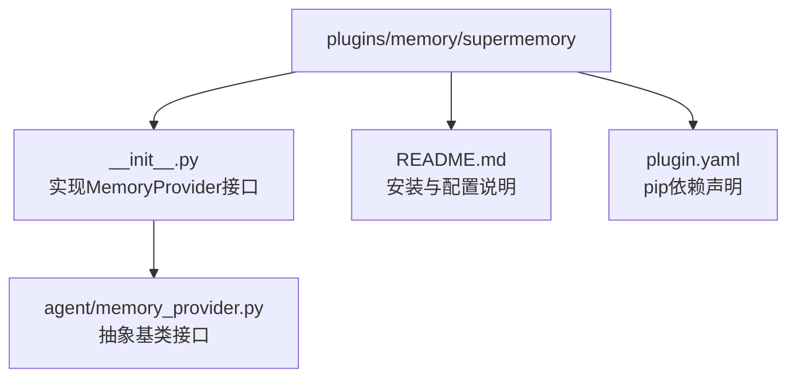
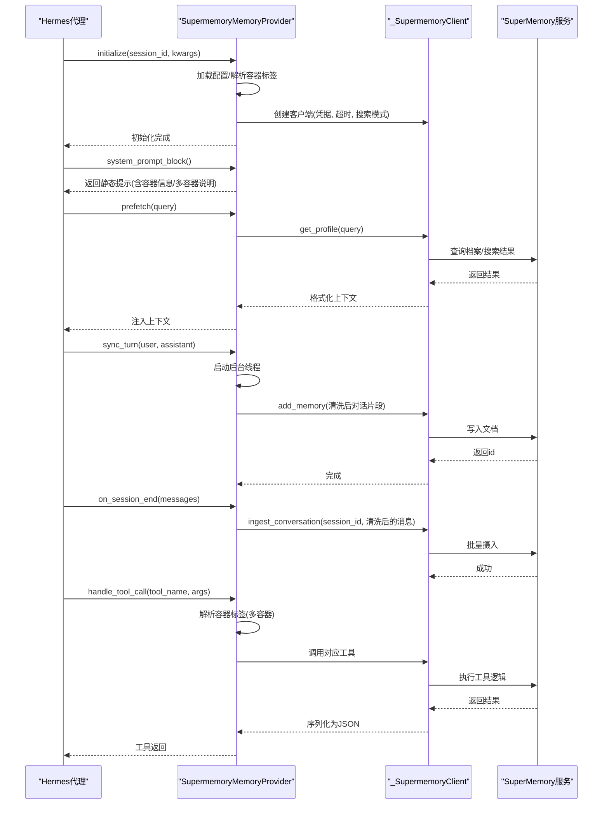
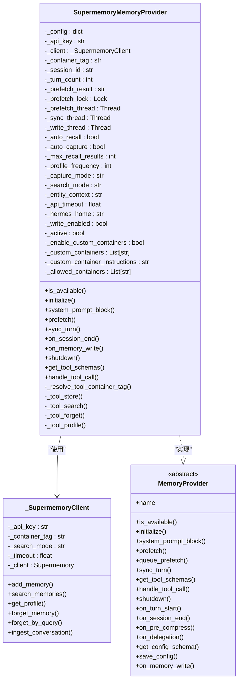
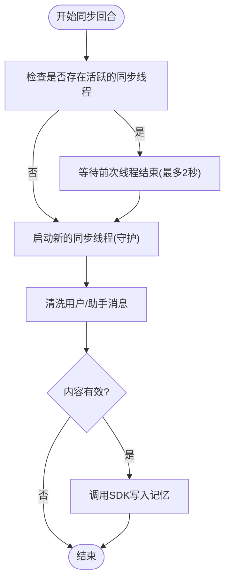
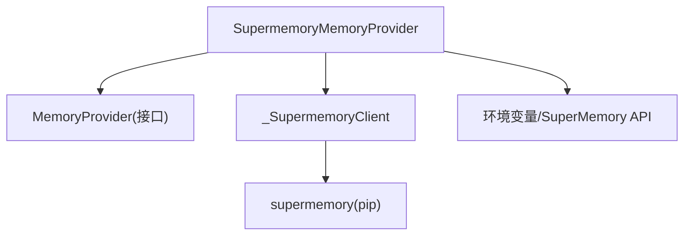

# SuperMemory记忆插件

<cite>
**本文档引用的文件**
- [plugins/memory/supermemory/__init__.py](file://plugins/memory/supermemory/__init__.py)
- [plugins/memory/supermemory/README.md](file://plugins/memory/supermemory/README.md)
- [plugins/memory/supermemory/plugin.yaml](file://plugins/memory/supermemory/plugin.yaml)
- [agent/memory_provider.py](file://agent/memory_provider.py)
</cite>

## 目录
1. [简介](#简介)
2. [项目结构](#项目结构)
3. [核心组件](#核心组件)
4. [架构总览](#架构总览)
5. [详细组件分析](#详细组件分析)
6. [依赖分析](#依赖分析)
7. [性能考量](#性能考量)
8. [故障排除指南](#故障排除指南)
9. [结论](#结论)
10. [附录](#附录)

## 简介
SuperMemory记忆插件为Hermes代理提供语义化长期记忆能力，支持：
- 基于档案的检索与上下文注入（自动预取）
- 会话级对话内容归档（会话结束时批量摄入）
- 显式记忆工具：存储、搜索、遗忘、档案查询
- 多容器模式与按身份作用域的容器标签
- 高性能异步写入与后台线程管理

该插件通过实现统一的MemoryProvider接口，无缝集成到Hermes的记忆体系中，并以轻量的线程模型和严格的输入清洗策略，确保在高并发场景下保持稳定与低延迟。

## 项目结构
SuperMemory插件位于plugins/memory/supermemory目录，核心文件如下：
- __init__.py：插件实现、配置加载、工具Schema、线程管理与生命周期钩子
- README.md：安装、配置、环境变量、工具说明与多容器模式
- plugin.yaml：声明pip依赖（supermemory）

图表来源
- [plugins/memory/supermemory/__init__.py:1-792](file://plugins/memory/supermemory/__init__.py#L1-L792)
- [plugins/memory/supermemory/README.md:1-100](file://plugins/memory/supermemory/README.md#L1-L100)
- [plugins/memory/supermemory/plugin.yaml:1-6](file://plugins/memory/supermemory/plugin.yaml#L1-L6)
- [agent/memory_provider.py:1-232](file://agent/memory_provider.py#L1-L232)

章节来源
- [plugins/memory/supermemory/__init__.py:1-792](file://plugins/memory/supermemory/__init__.py#L1-L792)
- [plugins/memory/supermemory/README.md:1-100](file://plugins/memory/supermemory/README.md#L1-L100)
- [plugins/memory/supermemory/plugin.yaml:1-6](file://plugins/memory/supermemory/plugin.yaml#L1-L6)
- [agent/memory_provider.py:1-232](file://agent/memory_provider.py#L1-L232)

## 核心组件
- SupermemoryMemoryProvider：实现MemoryProvider接口，负责初始化、系统提示注入、自动预取、异步写入、会话摄入、工具Schema与工具调用分发。
- _SupermemoryClient：对上游SDK的薄封装，提供文档添加、记忆搜索、档案查询、按ID/查询遗忘、会话摄入等操作。
- 工具Schema：supermemory_store、supermemory_search、supermemory_forget、supermemory_profile。
- 配置系统：默认配置、环境变量覆盖、$HERMES_HOME/supermemory.json持久化、容器标签解析与多容器白名单校验。

章节来源
- [plugins/memory/supermemory/__init__.py:420-792](file://plugins/memory/supermemory/__init__.py#L420-L792)
- [plugins/memory/supermemory/README.md:23-94](file://plugins/memory/supermemory/README.md#L23-L94)

## 架构总览
SuperMemory插件在Hermes中的运行时交互如下：

图表来源
- [plugins/memory/supermemory/__init__.py:420-792](file://plugins/memory/supermemory/__init__.py#L420-L792)
- [plugins/memory/supermemory/__init__.py:263-368](file://plugins/memory/supermemory/__init__.py#L263-L368)

## 详细组件分析

### SupermemoryMemoryProvider 类
职责与关键点：
- 生命周期管理：is_available检查、initialize解析配置与容器标签、shutdown清理线程。
- 自动行为：prefetch按轮次频率注入档案与相关记忆；sync_turn异步写入对话片段；on_session_end批量摄入会话。
- 工具暴露：get_tool_schemas根据多容器开关动态注入container_tag参数；handle_tool_call分发至具体工具。
- 多容器支持：允许显式指定容器标签，但自动写入仍使用主容器，避免跨容器污染。

图表来源
- [plugins/memory/supermemory/__init__.py:420-792](file://plugins/memory/supermemory/__init__.py#L420-L792)
- [agent/memory_provider.py:42-232](file://agent/memory_provider.py#L42-L232)

章节来源
- [plugins/memory/supermemory/__init__.py:420-792](file://plugins/memory/supermemory/__init__.py#L420-L792)
- [agent/memory_provider.py:42-232](file://agent/memory_provider.py#L42-L232)

### 配置与参数
- 配置文件：$HERMES_HOME/supermemory.json
- 默认值与范围：容器标签、自动召回/捕获、最大召回条数、档案频率、捕获模式、搜索模式、实体上下文长度上限、API超时
- 环境变量：SUPERMEMORY_API_KEY（必填）、SUPERMEMORY_CONTAINER_TAG（优先于配置）
- 多容器模式：启用后可为工具调用指定container_tag，自动写入仍使用主容器

章节来源
- [plugins/memory/supermemory/README.md:23-45](file://plugins/memory/supermemory/README.md#L23-L45)
- [plugins/memory/supermemory/__init__.py:56-141](file://plugins/memory/supermemory/__init__.py#L56-L141)

### 并发与线程模型
- 预取线程：prefetch在后台线程执行档案查询，使用锁保护结果，避免竞态。
- 同步线程：每回合完成后启动后台线程异步写入，若前次线程仍在运行则先等待其结束，避免堆积。
- 写入线程：显式记忆写入使用非守护线程，保证退出前完成写入。
- 关闭流程：在shutdown中等待所有活跃线程结束，确保资源释放。

图表来源
- [plugins/memory/supermemory/__init__.py:563-594](file://plugins/memory/supermemory/__init__.py#L563-L594)

章节来源
- [plugins/memory/supermemory/__init__.py:563-594](file://plugins/memory/supermemory/__init__.py#L563-L594)
- [plugins/memory/supermemory/__init__.py:639-644](file://plugins/memory/supermemory/__init__.py#L639-L644)

### 缓存与上下文格式化
- 预取上下文：从档案与搜索结果去重合并，限制最大条数，按相似度与更新时间格式化，包裹在特定标记内供系统提示注入。
- 输入清洗：去除内部标记与容器标签，过滤极短或无意义消息，避免噪声进入记忆库。
- 实体上下文：通过entity_context指导提取策略，限制最大长度。

章节来源
- [plugins/memory/supermemory/__init__.py:189-251](file://plugins/memory/supermemory/__init__.py#L189-L251)
- [plugins/memory/supermemory/__init__.py:253-261](file://plugins/memory/supermemory/__init__.py#L253-L261)
- [plugins/memory/supermemory/__init__.py:79-84](file://plugins/memory/supermemory/__init__.py#L79-L84)

### 工具调用与多容器
- 工具Schema：store/search/forget/profile，支持可选container_tag（多容器开启时）。
- 容器解析：校验传入标签是否在允许列表，否则抛出错误；未提供或禁用多容器时使用主容器。
- 自动写入：显式记忆写入镜像到后端，使用实体上下文与类型标注。

章节来源
- [plugins/memory/supermemory/__init__.py:666-788](file://plugins/memory/supermemory/__init__.py#L666-L788)
- [plugins/memory/supermemory/__init__.py:646-664](file://plugins/memory/supermemory/__init__.py#L646-L664)

## 依赖分析
- 运行时依赖：supermemory（pip依赖声明）
- 接口契约：实现MemoryProvider抽象基类，遵循生命周期钩子约定
- 外部服务：SuperMemory API（文档写入、搜索、档案、会话摄入）

图表来源
- [plugins/memory/supermemory/plugin.yaml:4-6](file://plugins/memory/supermemory/plugin.yaml#L4-L6)
- [agent/memory_provider.py:42-232](file://agent/memory_provider.py#L42-L232)
- [plugins/memory/supermemory/__init__.py:263-368](file://plugins/memory/supermemory/__init__.py#L263-L368)

章节来源
- [plugins/memory/supermemory/plugin.yaml:4-6](file://plugins/memory/supermemory/plugin.yaml#L4-L6)
- [agent/memory_provider.py:42-232](file://agent/memory_provider.py#L42-L232)
- [plugins/memory/supermemory/__init__.py:263-368](file://plugins/memory/supermemory/__init__.py#L263-L368)

## 性能考量
- 异步写入与线程复用：通过独立线程处理写入，避免阻塞主线程；对重复写入进行线程等待，减少资源争用。
- 输入清洗与阈值控制：过滤极短与常见应答，降低无效写入；限定实体上下文长度，减少后端处理开销。
- 预取与频率控制：按轮次频率注入档案，避免频繁查询；限制召回条数，控制上下文大小。
- 超时与容错：SDK与摄入请求设置超时；异常日志记录，不影响主流程。
- 多容器隔离：工具侧可切换容器，自动写入固定主容器，避免跨容器写入带来的额外网络与一致性成本。

章节来源
- [plugins/memory/supermemory/__init__.py:563-594](file://plugins/memory/supermemory/__init__.py#L563-L594)
- [plugins/memory/supermemory/__init__.py:546-562](file://plugins/memory/supermemory/__init__.py#L546-L562)
- [plugins/memory/supermemory/__init__.py:253-261](file://plugins/memory/supermemory/__init__.py#L253-L261)
- [plugins/memory/supermemory/__init__.py:115-130](file://plugins/memory/supermemory/__init__.py#L115-L130)

## 故障排除指南
- 插件不可用
  - 检查是否安装supermemory依赖与设置SUPERMEMORY_API_KEY
  - 使用hermes memory setup进行配置
- 记忆写入失败
  - 查看日志中“Supermemory sync_turn failed”或“Supermemory on_memory_write failed”的调试信息
  - 确认消息长度与内容清洗后有效
- 预取失败
  - 查看“Supermemory prefetch failed”，确认网络与API密钥
- 会话摄入失败
  - 查看“Supermemory session ingest failed”，检查会话消息清洗与长度
- 多容器标签错误
  - 工具调用报错提示标签不在白名单，检查配置中的custom_containers与主容器标签

章节来源
- [plugins/memory/supermemory/__init__.py:563-594](file://plugins/memory/supermemory/__init__.py#L563-L594)
- [plugins/memory/supermemory/__init__.py:595-616](file://plugins/memory/supermemory/__init__.py#L595-L616)
- [plugins/memory/supermemory/__init__.py:546-562](file://plugins/memory/supermemory/__init__.py#L546-L562)
- [plugins/memory/supermemory/__init__.py:646-664](file://plugins/memory/supermemory/__init__.py#L646-L664)

## 结论
SuperMemory记忆插件通过简洁的接口实现与稳健的并发模型，在Hermes中提供了高性能、可扩展的语义长期记忆能力。其异步写入、输入清洗、频率控制与多容器隔离等设计，使其在高并发与大规模应用中具备良好的稳定性与可维护性。配合合理的配置与监控，可在生产环境中实现可靠的长期记忆服务。

## 附录

### 安装与配置要点
- 安装依赖：pip install supermemory
- 设置API密钥：SUPERMEMORY_API_KEY
- 可选容器标签：SUPERMEMORY_CONTAINER_TAG
- 配置文件：$HERMES_HOME/supermemory.json

章节来源
- [plugins/memory/supermemory/README.md:5-21](file://plugins/memory/supermemory/README.md#L5-L21)
- [plugins/memory/supermemory/README.md:23-45](file://plugins/memory/supermemory/README.md#L23-L45)

### 高并发使用建议
- 合理设置max_recall_results与profile_frequency，平衡上下文大小与查询频率
- 在多容器场景下，仅在工具调用时切换容器，自动写入保持主容器
- 监控线程状态与日志，必要时调整api_timeout与捕获阈值

章节来源
- [plugins/memory/supermemory/README.md:27-37](file://plugins/memory/supermemory/README.md#L27-L37)
- [plugins/memory/supermemory/__init__.py:546-562](file://plugins/memory/supermemory/__init__.py#L546-L562)