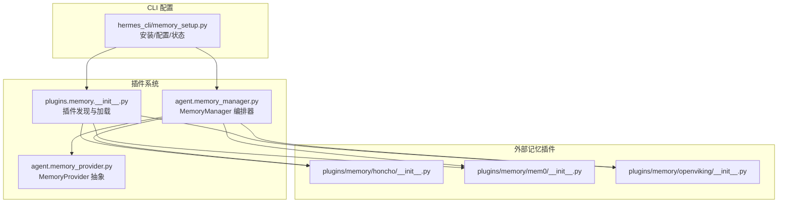
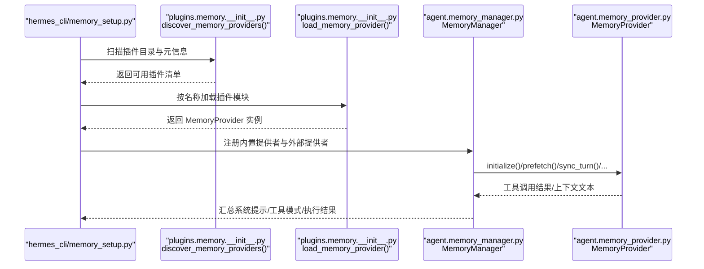
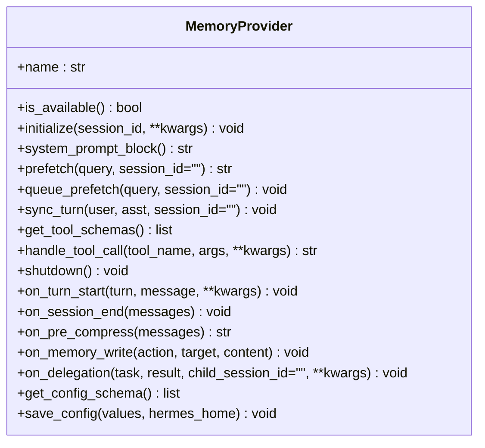
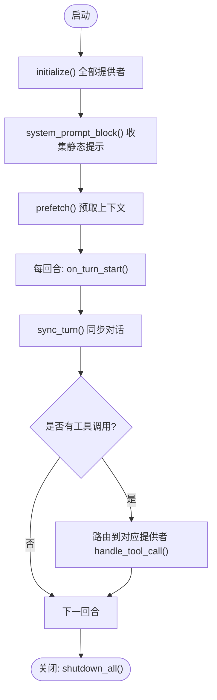
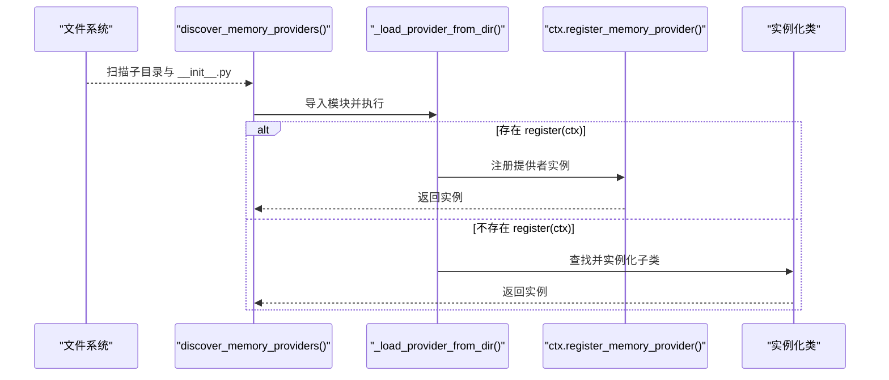
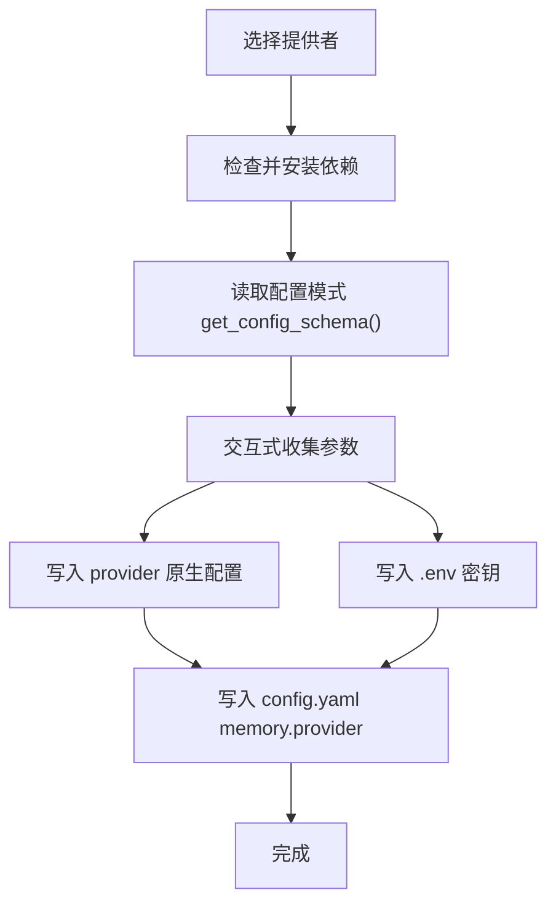
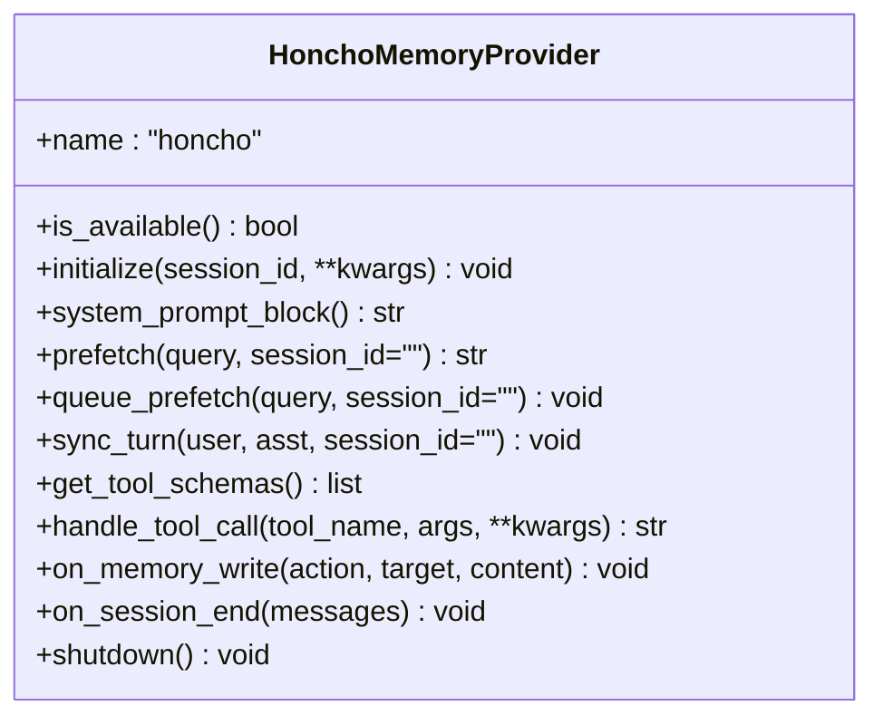
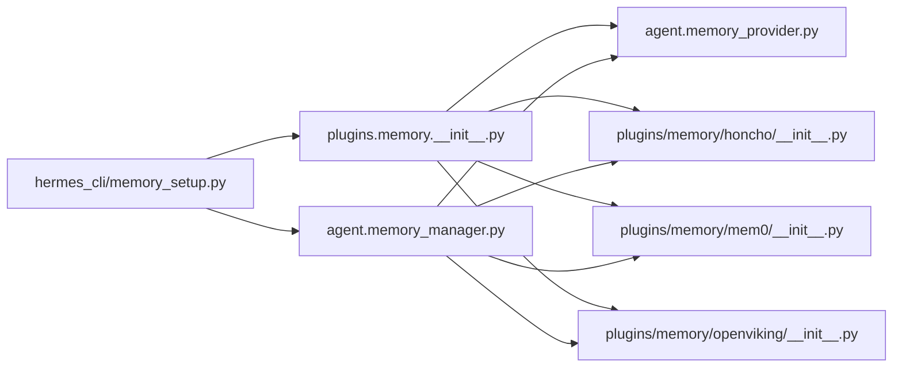

# 自定义记忆插件开发

<cite>
**本文档引用的文件**
- [plugins/memory/__init__.py](file://plugins/memory/__init__.py)
- [agent/memory_provider.py](file://agent/memory_provider.py)
- [agent/memory_manager.py](file://agent/memory_manager.py)
- [hermes_cli/memory_setup.py](file://hermes_cli/memory_setup.py)
- [plugins/memory/honcho/__init__.py](file://plugins/memory/honcho/__init__.py)
- [plugins/memory/mem0/__init__.py](file://plugins/memory/mem0/__init__.py)
- [plugins/memory/openviking/__init__.py](file://plugins/memory/openviking/__init__.py)
- [plugins/memory/honcho/client.py](file://plugins/memory/honcho/client.py)
- [plugins/memory/honcho/cli.py](file://plugins/memory/honcho/cli.py)
- [plugins/memory/honcho/session.py](file://plugins/memory/honcho/session.py)
</cite>

## 目录
1. [简介](#简介)
2. [项目结构](#项目结构)
3. [核心组件](#核心组件)
4. [架构总览](#架构总览)
5. [详细组件分析](#详细组件分析)
6. [依赖关系分析](#依赖关系分析)
7. [性能考量](#性能考量)
8. [故障排除指南](#故障排除指南)
9. [结论](#结论)
10. [附录](#附录)

## 简介
本指南面向希望为 Hermes Agent 开发自定义记忆插件的开发者，系统阐述记忆插件的标准接口规范、生命周期管理与事件处理机制，提供从项目结构、依赖管理到构建配置的完整开发流程；记录插件注册机制、配置解析与运行时集成方法；总结最佳实践、代码规范与测试策略；并给出插件打包、分发与版本管理建议，以及安全考虑、权限控制与数据保护要点。文档以仓库中已有的记忆插件（如 Honcho、Mem0、OpenViking）为参考实现，帮助你快速上手并遵循一致的设计模式。

## 项目结构
Hermes 的记忆插件采用“内置 + 外部插件”的双层架构：内置记忆始终激活，外部记忆插件通过配置选择启用一个。插件发现与加载由插件系统完成，运行时由 MemoryManager 统一编排。

**图表来源**
- [plugins/memory/__init__.py:32-75](file://plugins/memory/__init__.py#L32-L75)
- [agent/memory_provider.py:42-232](file://agent/memory_provider.py#L42-L232)
- [agent/memory_manager.py:72-363](file://agent/memory_manager.py#L72-L363)
- [hermes_cli/memory_setup.py:143-176](file://hermes_cli/memory_setup.py#L143-L176)

**章节来源**
- [plugins/memory/__init__.py:1-318](file://plugins/memory/__init__.py#L1-L318)
- [agent/memory_manager.py:1-363](file://agent/memory_manager.py#L1-L363)
- [agent/memory_provider.py:1-232](file://agent/memory_provider.py#L1-L232)
- [hermes_cli/memory_setup.py:1-452](file://hermes_cli/memory_setup.py#L1-L452)

## 核心组件
- MemoryProvider 抽象类：定义插件必须实现的核心生命周期与可选钩子，包括初始化、系统提示块、预取、同步、工具模式等。
- MemoryManager：统一注册与编排多个 MemoryProvider，确保内置提供者优先且最多仅有一个外部提供者生效。
- 插件发现与加载：扫描 plugins/memory/<name>/ 目录，读取元信息与可用性检查，支持 register(ctx) 模式与类实例化两种注册方式。
- CLI 配置：提供交互式设置向导，自动安装依赖、写入配置与环境变量，并显示当前状态。

**章节来源**
- [agent/memory_provider.py:42-232](file://agent/memory_provider.py#L42-L232)
- [agent/memory_manager.py:72-363](file://agent/memory_manager.py#L72-L363)
- [plugins/memory/__init__.py:32-196](file://plugins/memory/__init__.py#L32-L196)
- [hermes_cli/memory_setup.py:143-351](file://hermes_cli/memory_setup.py#L143-L351)

## 架构总览
下图展示从 CLI 到插件加载、再到运行时编排的整体流程：

**图表来源**
- [hermes_cli/memory_setup.py:143-351](file://hermes_cli/memory_setup.py#L143-L351)
- [plugins/memory/__init__.py:32-196](file://plugins/memory/__init__.py#L32-L196)
- [agent/memory_manager.py:86-363](file://agent/memory_manager.py#L86-L363)
- [agent/memory_provider.py:60-232](file://agent/memory_provider.py#L60-L232)

## 详细组件分析

### MemoryProvider 接口规范
- 必需方法
  - is_available()：轻量检查是否可用（不进行网络请求）
  - initialize(session_id, **kwargs)：建立连接、创建资源、预热
  - get_tool_schemas()：返回模型可见的工具模式
  - sync_turn(user_content, assistant_content, session_id)：异步持久化
  - prefetch/query_prefetch：背景预取与注入
- 可选钩子
  - system_prompt_block()：静态系统提示
  - on_turn_start/on_session_end/on_pre_compress/on_memory_write/on_delegation/shutdown()

- 配置能力
  - get_config_schema()：声明需要的配置字段（含密钥、默认值、枚举、环境变量映射）
  - save_config(values, hermes_home)：写入插件原生配置位置

**图表来源**
- [agent/memory_provider.py:42-232](file://agent/memory_provider.py#L42-L232)

**章节来源**
- [agent/memory_provider.py:42-232](file://agent/memory_provider.py#L42-L232)

### MemoryManager 生命周期与事件编排
- 注册规则：内置提供者优先，最多允许一个外部提供者；重复注册会警告拒绝
- 调用序列：initialize → system_prompt_block → prefetch → sync_turn → 工具调用 → 生命周期钩子 → shutdown
- 容错设计：单个提供者的失败不会阻断其他提供者；工具名冲突会告警并跳过重复

**图表来源**
- [agent/memory_manager.py:86-363](file://agent/memory_manager.py#L86-L363)

**章节来源**
- [agent/memory_manager.py:72-363](file://agent/memory_manager.py#L72-L363)

### 插件发现与加载机制
- 发现逻辑：扫描 plugins/memory/<name>/，读取 plugin.yaml 获取描述，执行 is_available() 做轻量可用性检查
- 加载策略：优先尝试 register(ctx) 捕获 MemoryProvider；否则查找继承 MemoryProvider 的类并实例化
- CLI 命令：仅对当前激活的外部插件加载其 cli.py 中的命令注册

**图表来源**
- [plugins/memory/__init__.py:32-196](file://plugins/memory/__init__.py#L32-L196)

**章节来源**
- [plugins/memory/__init__.py:32-196](file://plugins/memory/__init__.py#L32-L196)

### CLI 配置与运行时集成
- 依赖安装：根据 plugin.yaml 的 pip_dependencies 与 external_dependencies 自动检测并安装
- 交互式设置：按 provider.get_config_schema() 逐项收集输入，区分密钥与非密钥，写入 config.yaml 与 .env
- 状态查询：显示当前激活的提供者、插件安装状态与缺失的密钥

**图表来源**
- [hermes_cli/memory_setup.py:183-351](file://hermes_cli/memory_setup.py#L183-L351)

**章节来源**
- [hermes_cli/memory_setup.py:183-351](file://hermes_cli/memory_setup.py#L183-L351)

### 实现参考：Honcho 插件
- 工具模式：profile/search/context/conclude 四个工具
- 初始化策略：支持“工具模式”延迟会话初始化；支持“上下文模式”预热
- 成本控制：轮询频率、注入频率、令牌预算截断
- 写入与镜像：后台线程异步写入；内置用户档案变更镜像到结论

**图表来源**
- [plugins/memory/honcho/__init__.py:119-723](file://plugins/memory/honcho/__init__.py#L119-L723)

**章节来源**
- [plugins/memory/honcho/__init__.py:119-723](file://plugins/memory/honcho/__init__.py#L119-L723)
- [plugins/memory/honcho/client.py:152-200](file://plugins/memory/honcho/client.py#L152-L200)
- [plugins/memory/honcho/cli.py:327-503](file://plugins/memory/honcho/cli.py#L327-L503)
- [plugins/memory/honcho/session.py:68-200](file://plugins/memory/honcho/session.py#L68-L200)

### 实现参考：Mem0 插件
- 工具模式：profile/search/conclude 三个工具
- 客户端与熔断：基于 mem0ai SDK，实现连续失败熔断与冷却
- 预取与同步：后台线程异步搜索与写入

**章节来源**
- [plugins/memory/mem0/__init__.py:119-374](file://plugins/memory/mem0/__init__.py#L119-L374)

### 实现参考：OpenViking 插件
- 工具模式：search/read/browse/remember/add_resource
- 会话提交：on_session_end 触发服务器端记忆提取
- atexit 安全网：进程退出时尽力提交未完成会话

**章节来源**
- [plugins/memory/openviking/__init__.py:252-633](file://plugins/memory/openviking/__init__.py#L252-L633)

## 依赖关系分析
- 插件发现依赖 Python 动态导入与相对路径模块注册
- 提供者实现依赖各自 SDK 或 HTTP 客户端
- 运行时依赖 MemoryManager 的统一编排与 MemoryProvider 的抽象契约
- CLI 依赖 hermes_cli.config 与 hermes_constants

**图表来源**
- [plugins/memory/__init__.py:32-196](file://plugins/memory/__init__.py#L32-L196)
- [agent/memory_manager.py:72-363](file://agent/memory_manager.py#L72-L363)
- [hermes_cli/memory_setup.py:143-351](file://hermes_cli/memory_setup.py#L143-L351)

**章节来源**
- [plugins/memory/__init__.py:32-196](file://plugins/memory/__init__.py#L32-L196)
- [agent/memory_manager.py:72-363](file://agent/memory_manager.py#L72-L363)
- [hermes_cli/memory_setup.py:143-351](file://hermes_cli/memory_setup.py#L143-L351)

## 性能考量
- 异步与后台线程：预取与写入使用守护线程，避免阻塞主流程
- 资源复用：客户端/会话缓存、线程池与队列，减少重复初始化
- 成本控制：轮询频率、注入频率、令牌预算截断、熔断冷却
- 上下文封禁：对注入的上下文使用围栏标签，防止模型误判为用户输入

**章节来源**
- [plugins/memory/honcho/__init__.py:477-523](file://plugins/memory/honcho/__init__.py#L477-L523)
- [plugins/memory/mem0/__init__.py:247-295](file://plugins/memory/mem0/__init__.py#L247-L295)
- [agent/memory_manager.py:46-69](file://agent/memory_manager.py#L46-L69)

## 故障排除指南
- 插件不可用
  - 检查 is_available() 是否返回 False（通常因缺少凭据或依赖）
  - 使用 hermes memory status 查看缺失的环境变量
- 初始化失败
  - 确认依赖安装（pip_dependencies），必要时使用 hermes memory setup 自动安装
  - 检查 provider.save_config() 是否正确写入原生配置文件
- 运行时错误
  - MemoryManager 对单个提供者异常进行日志记录但不中断其他提供者
  - 工具调用失败会返回标准错误格式，便于前端展示
- 安全与权限
  - 密钥写入 .env 并标记为 secret 字段
  - Honcho 支持本地无认证场景，注意 base_url 与 api_key 的组合

**章节来源**
- [hermes_cli/memory_setup.py:382-437](file://hermes_cli/memory_setup.py#L382-L437)
- [plugins/memory/mem0/__init__.py:180-202](file://plugins/memory/mem0/__init__.py#L180-L202)
- [plugins/memory/honcho/__init__.py:270-275](file://plugins/memory/honcho/__init__.py#L270-L275)

## 结论
Hermes 的记忆插件体系以 MemoryProvider 抽象为核心，结合 MemoryManager 的统一编排与 CLI 的自动化配置，实现了“内置优先、外部择一”的稳定扩展模型。通过参考 Honcho、Mem0、OpenViking 等实现，你可以快速开发符合规范的自定义插件，并在性能、安全与可维护性之间取得平衡。

## 附录

### 开发流程清单
- 创建目录 plugins/memory/<your_provider>/
- 实现 MemoryProvider 子类，至少覆盖：is_available/initialize/get_tool_schemas/sync_turn/prefetch
- 在 __init__.py 中导出 register(ctx) 或直接实例化类
- 在 plugin.yaml 中提供描述与 pip_dependencies（如需要）
- 在 hermes_cli/memory_setup.py 中扩展 discover/_install_dependencies/_get_available_providers
- 编写单元测试与集成测试，覆盖 is_available/save_config/工具调用
- 使用 hermes memory setup/status 验证安装与配置

### 最佳实践
- 配置优先级：环境变量 > 原生配置文件 > 默认值
- 错误隔离：避免在 is_available 中做重 IO；在工具调用中捕获并返回标准错误
- 线程安全：共享资源加锁；后台线程使用守护线程并在 shutdown 中等待
- 日志规范：区分 debug/warning/error 级别，避免泄露敏感信息
- 文档与元数据：完善 plugin.yaml 的 description、pip_dependencies、external_dependencies

### 测试策略
- 单元测试：Mock SDK/HTTP 客户端，验证配置解析、工具模式与错误分支
- 集成测试：真实环境（或容器）中验证初始化、预取、同步与工具调用
- 回归测试：在 MemoryManager 场景下验证多提供者共存与冲突处理