# 记忆插件开发

<cite>
**本文档引用的文件**
- [plugins/memory/__init__.py](file://plugins/memory/__init__.py)
- [agent/memory_manager.py](file://agent/memory_manager.py)
- [agent/memory_provider.py](file://agent/memory_provider.py)
- [plugins/memory/byterover/__init__.py](file://plugins/memory/byterover/__init__.py)
- [plugins/memory/hindsight/__init__.py](file://plugins/memory/hindsight/__init__.py)
- [plugins/memory/holographic/__init__.py](file://plugins/memory/holographic/__init__.py)
- [plugins/memory/mem0/__init__.py](file://plugins/memory/mem0/__init__.py)
- [plugins/memory/openviking/__init__.py](file://plugins/memory/openviking/__init__.py)
- [plugins/memory/supermemory/__init__.py](file://plugins/memory/supermemory/__init__.py)
- [plugins/memory/retaindb/__init__.py](file://plugins/memory/retaindb/__init__.py)
- [plugins/memory/honcho/__init__.py](file://plugins/memory/honcho/__init__.py)
</cite>

## 目录
1. [简介](#简介)
2. [项目结构](#项目结构)
3. [核心组件](#核心组件)
4. [架构概览](#架构概览)
5. [详细组件分析](#详细组件分析)
6. [依赖关系分析](#依赖关系分析)
7. [性能考虑](#性能考虑)
8. [故障排除指南](#故障排除指南)
9. [结论](#结论)
10. [附录](#附录)

## 简介

本指南面向记忆插件开发者，系统性阐述Hermes Agent记忆插件体系的设计理念、实现原理和最佳实践。该体系支持多种记忆插件（byterover、hindsight、holographic、mem0、openviking、supermemory、retaindb、honcho），为智能体提供跨会话持久化记忆能力。

记忆插件基于统一的MemoryProvider抽象接口，通过MemoryManager进行编排管理，确保与内置内存系统的无缝集成。每种插件都实现了特定的记忆存储策略、检索机制和工具接口，满足不同应用场景的需求。

## 项目结构

记忆插件系统采用模块化设计，核心架构由以下层次组成：

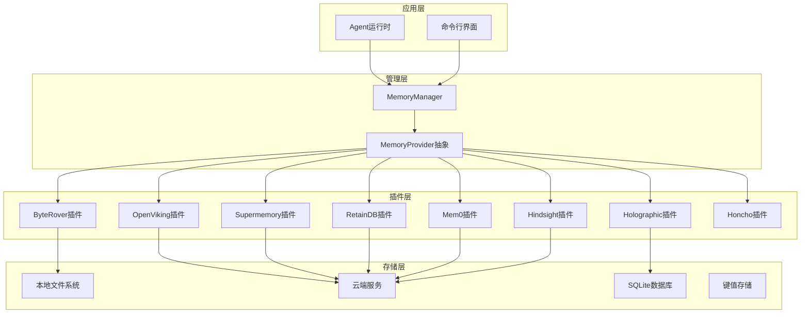

**图表来源**
- [plugins/memory/__init__.py:1-318](file://plugins/memory/__init__.py#L1-L318)
- [agent/memory_manager.py:1-363](file://agent/memory_manager.py#L1-L363)
- [agent/memory_provider.py:1-232](file://agent/memory_provider.py#L1-L232)

**章节来源**
- [plugins/memory/__init__.py:1-318](file://plugins/memory/__init__.py#L1-L318)
- [agent/memory_manager.py:1-363](file://agent/memory_manager.py#L1-L363)
- [agent/memory_provider.py:1-232](file://agent/memory_provider.py#L1-L232)

## 核心组件

### MemoryProvider抽象接口

MemoryProvider是所有记忆插件的基础抽象，定义了统一的生命周期管理和功能接口：

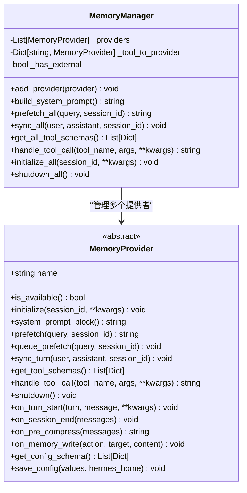

**图表来源**
- [agent/memory_provider.py:42-232](file://agent/memory_provider.py#L42-L232)
- [agent/memory_manager.py:72-363](file://agent/memory_manager.py#L72-L363)

### 插件发现机制

系统通过动态发现机制加载可用的记忆插件：

```mermaid
flowchart TD
Start([启动]) --> Scan[扫描plugins/memory目录]
Scan --> CheckDir{检查子目录}
CheckDir --> |存在| LoadInit[加载__init__.py]
CheckDir --> |不存在| End([结束])
LoadInit --> ReadMeta[读取plugin.yaml元数据]
ReadMeta --> CheckAvail[调用is_available()]
CheckAvail --> |可用| Register[注册到插件列表]
CheckAvail --> |不可用| Skip[跳过]
Register --> Next[下一个插件]
Skip --> Next
Next --> Scan
```

**图表来源**
- [plugins/memory/__init__.py:32-75](file://plugins/memory/__init__.py#L32-L75)

**章节来源**
- [agent/memory_provider.py:1-232](file://agent/memory_provider.py#L1-L232)
- [agent/memory_manager.py:1-363](file://agent/memory_manager.py#L1-L363)
- [plugins/memory/__init__.py:1-318](file://plugins/memory/__init__.py#L1-L318)

## 架构概览

记忆插件系统采用分层架构设计，确保高内聚、低耦合和可扩展性：

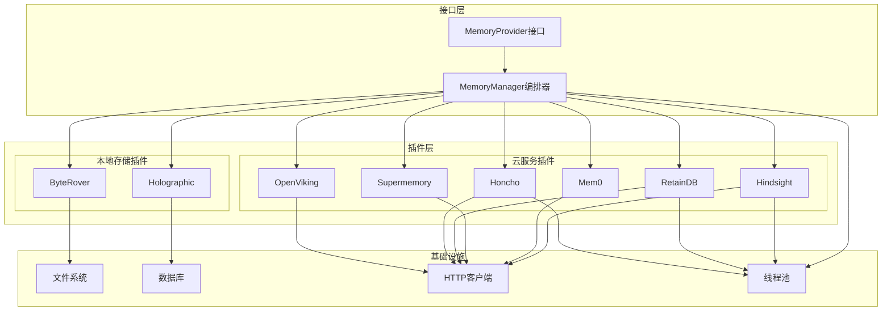

**图表来源**
- [agent/memory_manager.py:72-130](file://agent/memory_manager.py#L72-L130)
- [plugins/memory/hindsight/__init__.py:185-232](file://plugins/memory/hindsight/__init__.py#L185-L232)
- [plugins/memory/retaindb/__init__.py:452-476](file://plugins/memory/retaindb/__init__.py#L452-L476)

系统特性：
- **单一外部提供者限制**：确保工具schema不膨胀，避免冲突
- **异步处理**：所有网络操作和磁盘I/O都采用异步方式
- **错误隔离**：单个插件失败不影响其他插件
- **配置管理**：支持环境变量、配置文件和交互式设置

**章节来源**
- [agent/memory_manager.py:72-130](file://agent/memory_manager.py#L72-L130)

## 详细组件分析

### ByteRover插件

ByteRover提供了基于层级上下文树的知识管理能力，支持模糊文本搜索和LLM驱动的检索。

#### 核心特性
- **层级知识树**：组织知识为层次化结构
- **双模式检索**：模糊搜索 + LLM语义搜索
- **本地优先**：支持本地存储和可选云同步
- **实时同步**：对话转储到知识树中

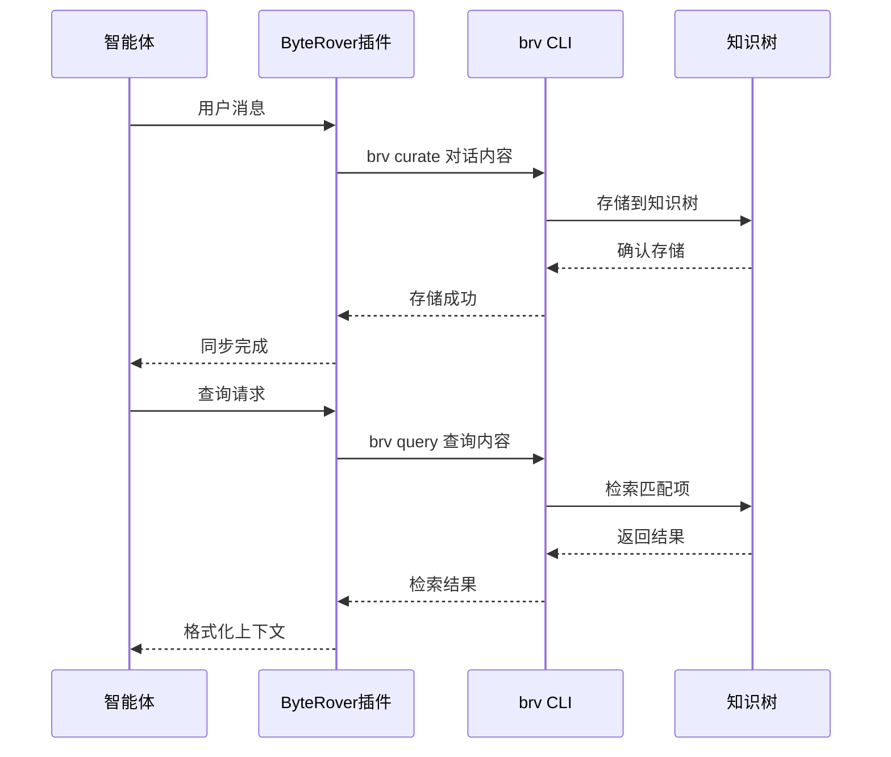

**图表来源**
- [plugins/memory/byterover/__init__.py:215-281](file://plugins/memory/byterover/__init__.py#L215-L281)

#### 配置选项
- **BRV_API_KEY**：ByteRover API密钥（云功能）
- **工作目录**：$HERMES_HOME/byterover/

#### 工具接口
- `brv_query`：搜索知识树
- `brv_curate`：存储信息到知识树
- `brv_status`：检查状态

**章节来源**
- [plugins/memory/byterover/__init__.py:1-384](file://plugins/memory/byterover/__init__.py#L1-L384)

### Hindsight插件

Hindsight提供了多策略检索的知识图谱记忆系统，支持云和本地两种模式。

#### 核心特性
- **知识图谱**：实体解析和关系抽取
- **多策略检索**：语义搜索、关键词匹配、实体图遍历
- **混合模式**：上下文注入和工具调用两种集成方式
- **银行概念**：支持多个记忆银行

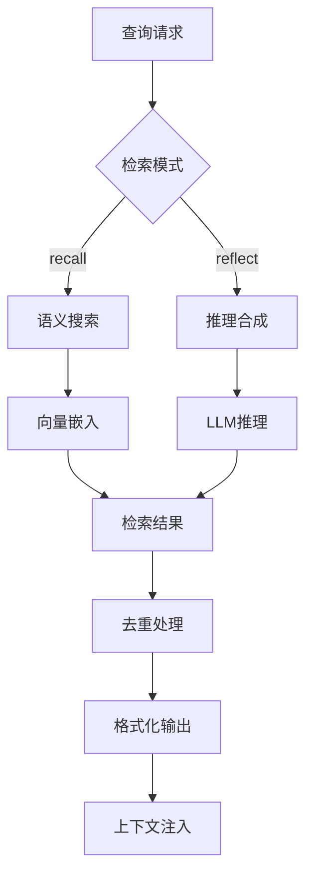

**图表来源**
- [plugins/memory/hindsight/__init__.py:654-714](file://plugins/memory/hindsight/__init__.py#L654-L714)

#### 配置选项
- **HINDSIGHT_MODE**：cloud/local_embedded/local_external
- **HINDSIGHT_API_KEY**：API密钥
- **HINDSIGHT_BANK_ID**：记忆银行标识符
- **HINDSIGHT_BUDGET**：检索预算（low/mid/high）

#### 工具接口
- `hindsight_retain`：存储信息
- `hindsight_recall`：检索记忆
- `hindsight_reflect`：推理合成

**章节来源**
- [plugins/memory/hindsight/__init__.py:1-800](file://plugins/memory/hindsight/__init__.py#L1-L800)

### Holographic插件

Holographic提供了结构化事实存储和HRR（四元数）检索的全功能记忆系统。

#### 核心特性
- **结构化存储**：事实数据库，支持实体解析
- **信任评分**：动态调整记忆可信度
- **组合检索**：基于多个实体的复合查询
- **自动提取**：会话结束时自动提取事实

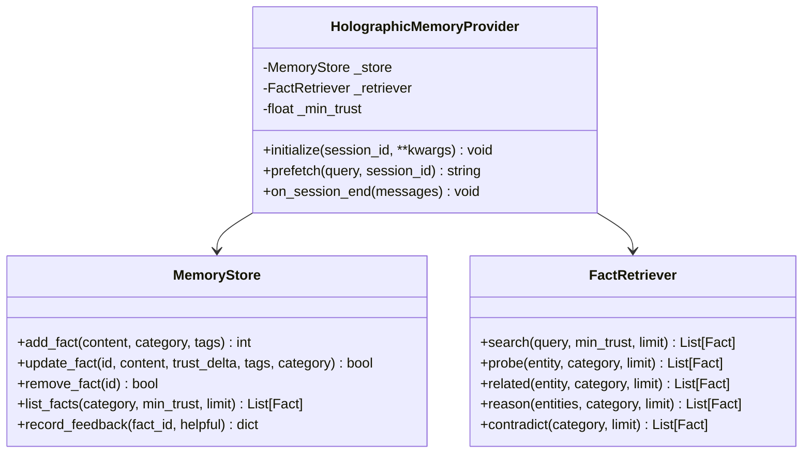

**图表来源**
- [plugins/memory/holographic/__init__.py:114-254](file://plugins/memory/holographic/__init__.py#L114-L254)

#### 配置选项
- **db_path**：SQLite数据库路径
- **auto_extract**：会话结束时自动提取
- **default_trust**：默认信任分数
- **hrr_dim**：HRR向量维度

#### 工具接口
- `fact_store`：事实存储和检索
- `fact_feedback`：事实反馈评分

**章节来源**
- [plugins/memory/holographic/__init__.py:1-408](file://plugins/memory/holographic/__init__.py#L1-L408)

### Mem0插件

Mem0提供了基于服务器端提取的语义搜索记忆系统，支持自动去重和重排序。

#### 核心特性
- **服务器端提取**：LLM自动抽取事实
- **语义搜索**：基于向量相似度的检索
- **重排序机制**：提高重要查询的准确性
- **电路断路器**：防止服务不可用时的级联故障

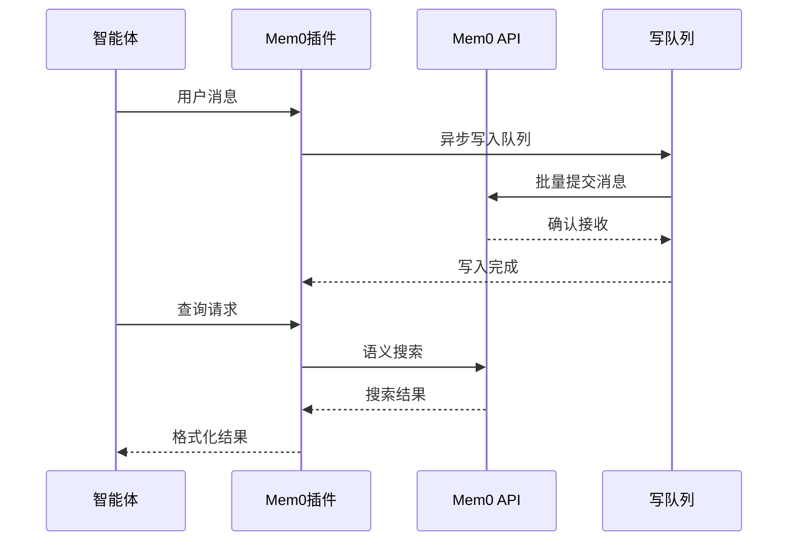

**图表来源**
- [plugins/memory/mem0/__init__.py:272-295](file://plugins/memory/mem0/__init__.py#L272-L295)

#### 配置选项
- **MEM0_API_KEY**：Mem0平台API密钥（必需）
- **MEM0_USER_ID**：用户标识符
- **MEM0_AGENT_ID**：代理标识符
- **rerank**：启用重排序

#### 工具接口
- `mem0_profile`：获取用户档案
- `mem0_search`：语义搜索
- `mem0_conclude`：存储事实

**章节来源**
- [plugins/memory/mem0/__init__.py:1-374](file://plugins/memory/mem0/__init__.py#L1-L374)

### OpenViking插件

OpenViking提供了双向记忆系统，支持会话管理和资源索引。

#### 核心特性
- **会话管理**：完整的对话会话跟踪
- **资源索引**：URL、文档、代码文件的自动处理
- **URI导航**：基于viking://协议的文件系统式浏览
- **自动记忆提取**：会话结束时自动提取6类记忆

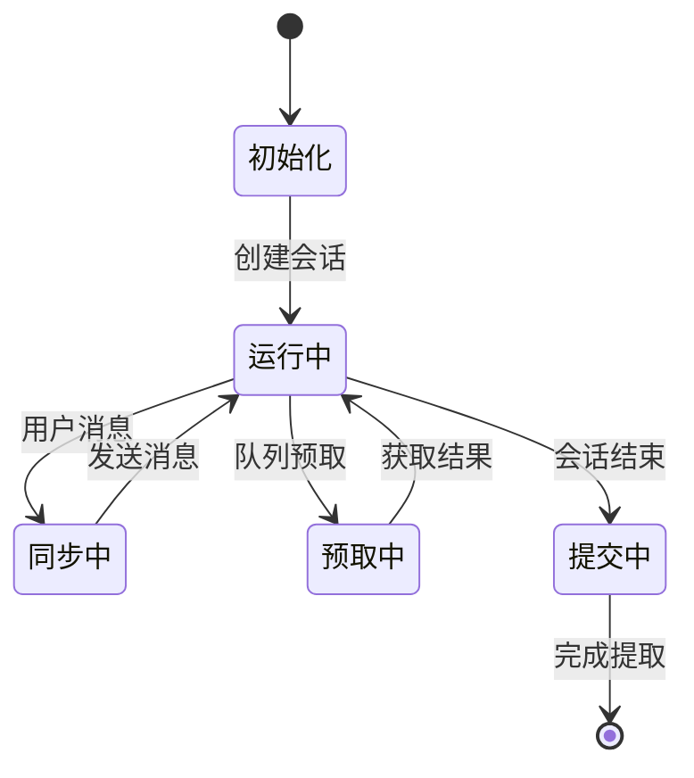

**图表来源**
- [plugins/memory/openviking/__init__.py:414-437](file://plugins/memory/openviking/__init__.py#L414-L437)

#### 配置选项
- **OPENVIKING_ENDPOINT**：服务器URL（必需）
- **OPENVIKING_API_KEY**：API密钥
- **OPENVIKING_ACCOUNT**：租户账户
- **OPENVIKING_USER**：租户用户

#### 工具接口
- `viking_search`：语义搜索
- `viking_read`：内容读取
- `viking_browse`：文件浏览
- `viking_remember`：记忆存储
- `viking_add_resource`：资源添加

**章节来源**
- [plugins/memory/openviking/__init__.py:1-633](file://plugins/memory/openviking/__init__.py#L1-L633)

### Supermemory插件

Supermemory提供了高级语义记忆系统，支持多容器管理和清理机制。

#### 核心特性
- **多容器支持**：支持多个记忆容器
- **清理机制**：自动清理上下文标记
- **实体上下文**：定制化的实体提取上下文
- **会话注入**：完整对话的批量处理

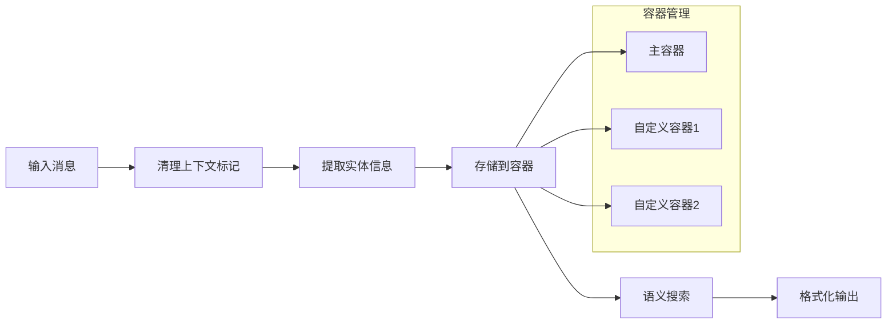

**图表来源**
- [plugins/memory/supermemory/__init__.py:208-251](file://plugins/memory/supermemory/__init__.py#L208-L251)

#### 配置选项
- **SUPERMEMORY_API_KEY**：API密钥（必需）
- **SUPERMEMORY_CONTAINER_TAG**：容器标签
- **auto_recall**：自动检索
- **auto_capture**：自动捕获
- **search_mode**：搜索模式（hybrid/memories/documents）

#### 工具接口
- `supermemory_store`：存储记忆
- `supermemory_search`：搜索记忆
- `supermemory_forget`：忘记记忆
- `supermemory_profile`：获取档案

**章节来源**
- [plugins/memory/supermemory/__init__.py:1-792](file://plugins/memory/supermemory/__init__.py#L1-L792)

### RetainDB插件

RetainDB提供了企业级记忆系统，包含共享文件存储和对话队列功能。

#### 核心特性
- **写队列**：SQLite持久化写队列
- **文件存储**：共享文件上传和管理
- **对话队列**：异步对话批处理
- **用户建模**：对话式用户理解

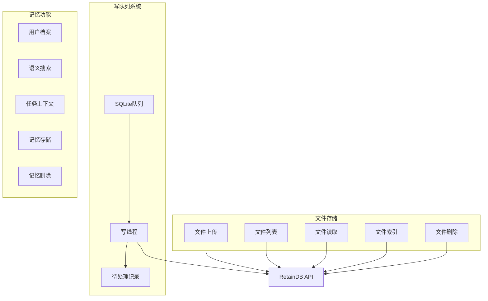

**图表来源**
- [plugins/memory/retaindb/__init__.py:330-408](file://plugins/memory/retaindb/__init__.py#L330-L408)

#### 配置选项
- **RETAINDB_API_KEY**：API密钥（必需）
- **RETAINDB_BASE_URL**：API端点
- **RETAINDB_PROJECT**：项目标识符

#### 工具接口
- `retaindb_profile`：获取用户档案
- `retaindb_search`：语义搜索
- `retaindb_context`：任务上下文
- `retaindb_remember`：记忆存储
- `retaindb_forget`：记忆删除
- 文件管理工具集

**章节来源**
- [plugins/memory/retaindb/__init__.py:1-767](file://plugins/memory/retaindb/__init__.py#L1-L767)

### Honcho插件

Honcho提供了AI原生的跨会话用户建模系统，支持对话式推理和同伴卡片。

#### 核心特性
- **同伴卡片**：用户和AI的综合画像
- **对话推理**：自然语言问题回答
- **成本感知**：可配置的调用频率和推理级别
- **懒初始化**：按需创建会话

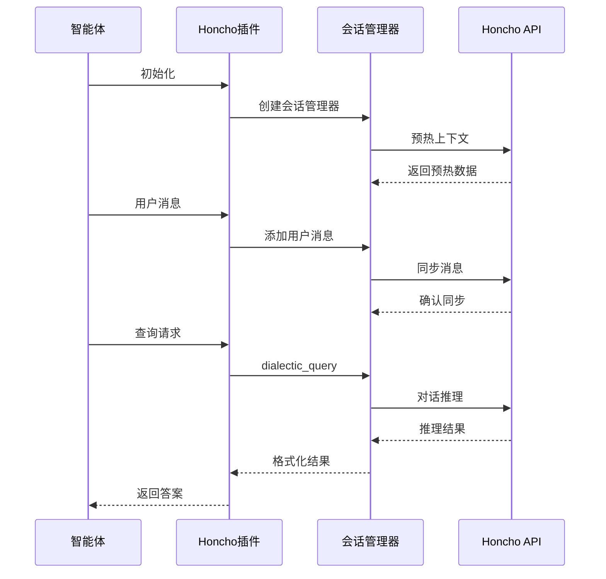

**图表来源**
- [plugins/memory/honcho/__init__.py:573-602](file://plugins/memory/honcho/__init__.py#L573-L602)

#### 配置选项
- **HONCHO_API_KEY**：API密钥
- **HONCHO_BASE_URL**：基础URL
- **recall_mode**：检索模式（context/tools/hybrid）
- **context_tokens**：上下文令牌预算

#### 工具接口
- `honcho_profile`：获取同伴卡片
- `honcho_search`：语义搜索
- `honcho_context`：对话推理
- `honcho_conclude`：保存结论

**章节来源**
- [plugins/memory/honcho/__init__.py:1-723](file://plugins/memory/honcho/__init__.py#L1-L723)

## 依赖关系分析

### 组件耦合度

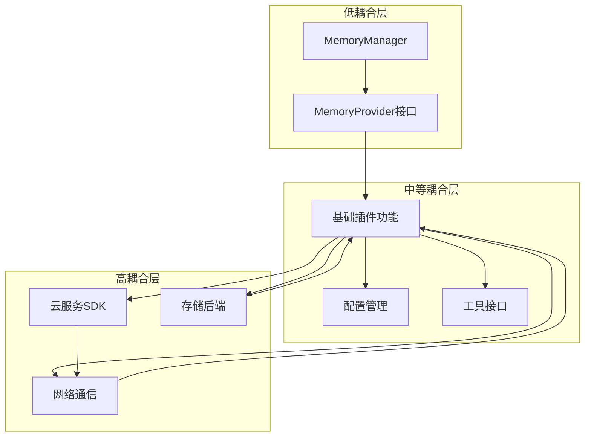

**图表来源**
- [agent/memory_provider.py:42-141](file://agent/memory_provider.py#L42-L141)
- [agent/memory_manager.py:72-130](file://agent/memory_manager.py#L72-L130)

### 插件间依赖

| 插件 | 外部依赖 | 配置要求 | 性能特征 |
|------|----------|----------|----------|
| ByteRover | brv CLI | BRV_API_KEY | 本地优先，快速检索 |
| Hindsight | hindsight-client | API密钥/URL | 云服务，多策略检索 |
| Holographic | SQLite | 无 | 本地存储，结构化查询 |
| Mem0 | mem0包 | API密钥 | 云服务，自动提取 |
| OpenViking | httpx | ENDPOINT | 本地/云，会话管理 |
| Supermemory | supermemory包 | API密钥 | 云服务，多容器 |
| RetainDB | requests/sqlite | API密钥 | 云服务，写队列 |
| Honcho | honcho-ai | API密钥 | 云服务，成本感知 |

**章节来源**
- [plugins/memory/byterover/__init__.py:184-186](file://plugins/memory/byterover/__init__.py#L184-L186)
- [plugins/memory/hindsight/__init__.py:233-243](file://plugins/memory/hindsight/__init__.py#L233-L243)
- [plugins/memory/mem0/__init__.py:142-144](file://plugins/memory/mem0/__init__.py#L142-L144)
- [plugins/memory/openviking/__init__.py:270-272](file://plugins/memory/openviking/__init__.py#L270-L272)
- [plugins/memory/supermemory/__init__.py:454-462](file://plugins/memory/supermemory/__init__.py#L454-L462)
- [plugins/memory/retaindb/__init__.py:477-478](file://plugins/memory/retaindb/__init__.py#L477-L478)
- [plugins/memory/honcho/__init__.py:159-167](file://plugins/memory/honcho/__init__.py#L159-L167)

## 性能考虑

### 并发处理策略

所有记忆插件都采用了异步并发模型来优化性能：

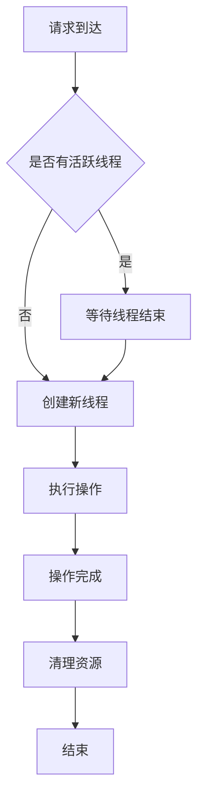

### 缓存机制

各插件实现了多层次缓存策略：

- **预取缓存**：MemoryManager在每轮对话开始前预取上下文
- **会话缓存**：保持会话状态和配置信息
- **结果缓存**：对频繁查询的结果进行缓存

### 资源管理

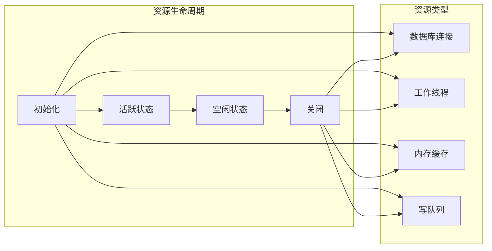

## 故障排除指南

### 常见问题诊断

#### 插件加载失败
**症状**：插件未出现在可用列表中
**排查步骤**：
1. 检查插件目录结构是否正确
2. 验证`__init__.py`文件是否存在
3. 确认插件实现了`register`函数
4. 查看日志中的导入错误信息

#### 配置验证失败
**症状**：插件可用但无法正常工作
**排查步骤**：
1. 使用`hermes memory setup`重新配置
2. 检查环境变量是否正确设置
3. 验证配置文件格式
4. 测试网络连通性

#### 性能问题
**症状**：响应时间过长或内存占用过高
**排查步骤**：
1. 检查并发线程数量
2. 监控网络延迟
3. 分析缓存命中率
4. 评估存储I/O性能

### 错误处理机制

各插件都实现了完善的错误处理和恢复机制：

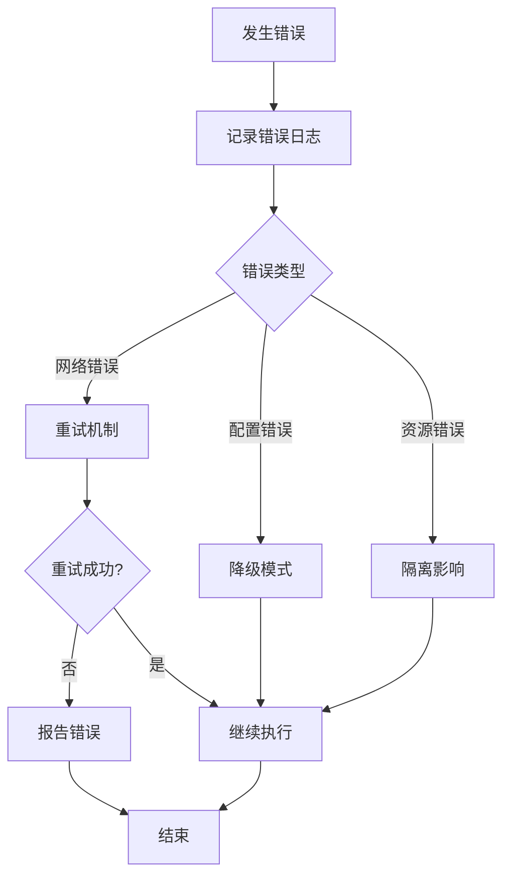

**章节来源**
- [plugins/memory/mem0/__init__.py:180-201](file://plugins/memory/mem0/__init__.py#L180-L201)
- [plugins/memory/retaindb/__init__.py:330-408](file://plugins/memory/retaindb/__init__.py#L330-L408)

## 结论

Hermes Agent的记忆插件系统通过标准化的抽象接口和灵活的架构设计，为不同类型的记忆需求提供了完整的解决方案。每个插件都有其独特的优势和适用场景：

- **ByteRover**：适合需要层级知识管理和本地优先的应用
- **Hindsight**：适合需要复杂检索和知识图谱的应用
- **Holographic**：适合需要结构化事实存储的应用
- **Mem0**：适合需要自动提取和语义搜索的应用
- **OpenViking**：适合需要会话管理和资源索引的应用
- **Supermemory**：适合需要多容器和企业级功能的应用
- **RetainDB**：适合需要共享文件存储的企业应用
- **Honcho**：适合需要AI原生用户建模的应用

开发者应根据具体需求选择合适的插件，并遵循最佳实践进行配置和优化。

## 附录

### 安装和配置步骤

#### 基础安装
1. 确保Python环境满足要求
2. 安装所需的依赖包
3. 配置环境变量
4. 设置API密钥

#### 插件激活
1. 在配置文件中指定要使用的插件
2. 运行`hermes memory setup`进行交互式配置
3. 验证插件可用性
4. 启动智能体测试功能

### 开发最佳实践

#### 新插件开发模板
```python
class NewMemoryProvider(MemoryProvider):
    def __init__(self):
        self._config = None
        self._client = None
        
    @property
    def name(self) -> str:
        return "new_plugin"
        
    def is_available(self) -> bool:
        # 检查依赖和配置
        return True
        
    def initialize(self, session_id: str, **kwargs) -> None:
        # 初始化客户端和服务
        pass
        
    def get_tool_schemas(self) -> List[Dict[str, Any]]:
        # 定义工具接口
        return []
        
    def handle_tool_call(self, tool_name: str, args: Dict[str, Any], **kwargs) -> str:
        # 实现工具逻辑
        return json.dumps({"result": "success"})
```

#### 性能优化建议
1. **异步处理**：所有网络操作使用异步方式
2. **连接池**：复用数据库和HTTP连接
3. **缓存策略**：合理设置缓存大小和过期时间
4. **错误重试**：实现指数退避的重试机制
5. **资源监控**：定期检查内存和CPU使用情况

#### 调试技巧
1. **日志级别**：设置适当的日志级别进行调试
2. **单元测试**：编写完整的单元测试覆盖
3. **性能分析**：使用性能分析工具识别瓶颈
4. **监控指标**：收集关键性能指标进行监控