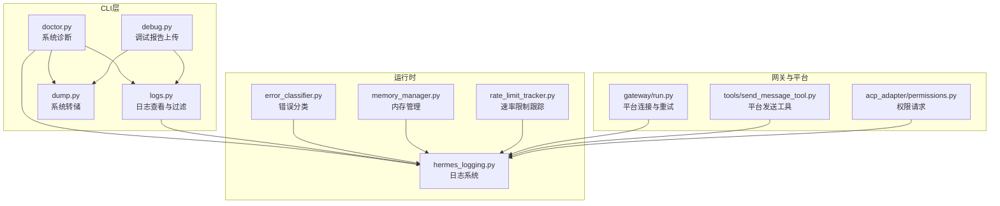
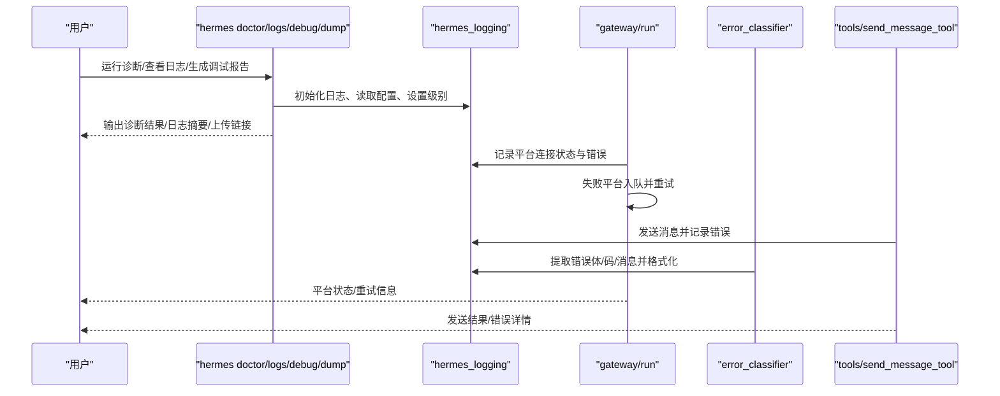
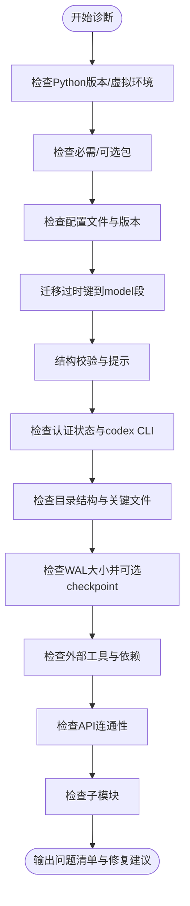
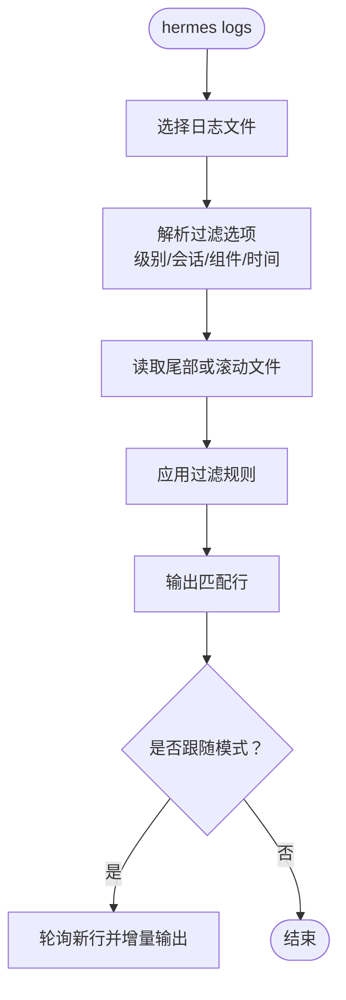
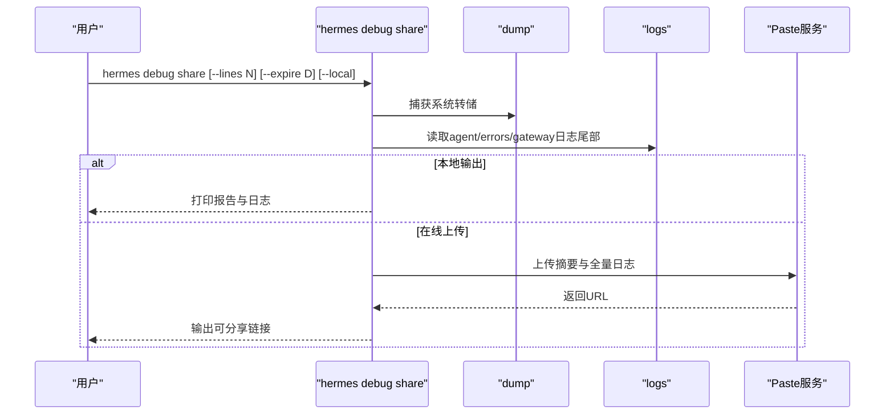
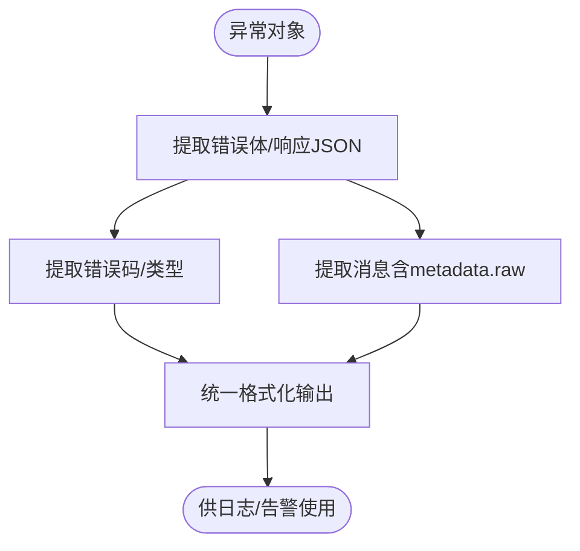
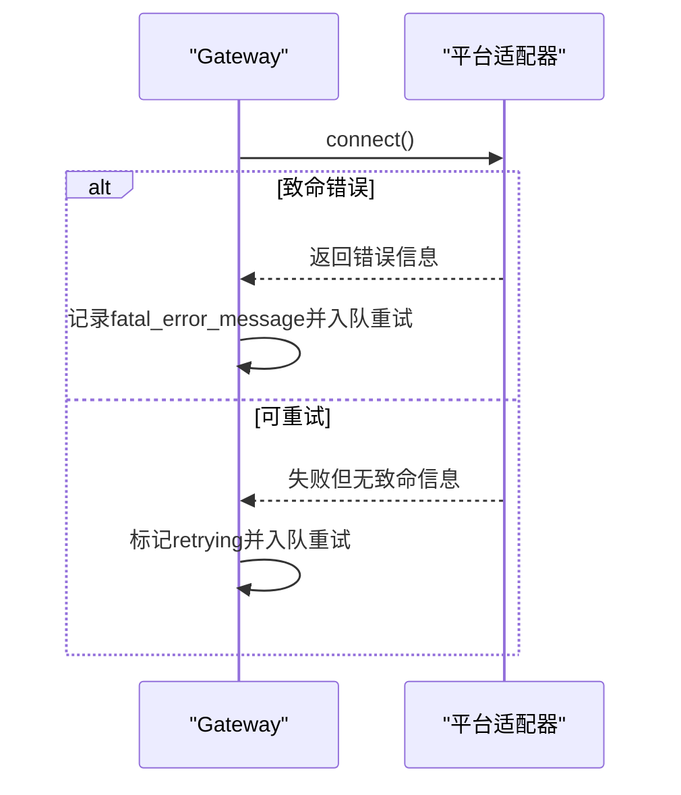
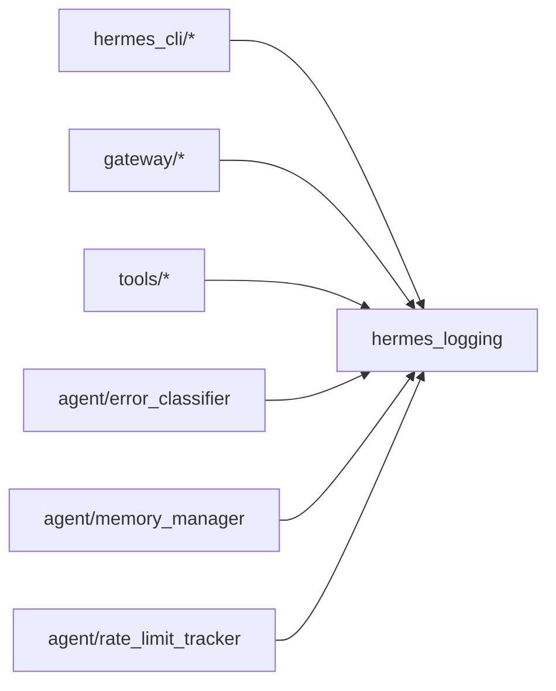
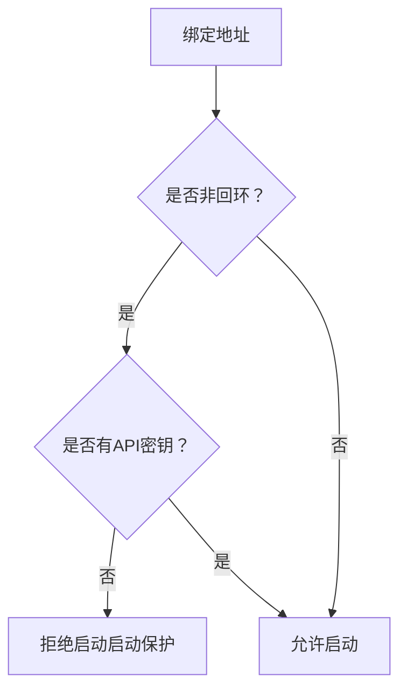

# 故障排除与常见问题

<cite>
**本文引用的文件**
- [README.md](file://README.md)
- [doctor.py](file://hermes_cli/doctor.py)
- [logs.py](file://hermes_cli/logs.py)
- [debug.py](file://hermes_cli/debug.py)
- [dump.py](file://hermes_cli/dump.py)
- [hermes_logging.py](file://hermes_logging.py)
- [error_classifier.py](file://agent/error_classifier.py)
- [run.py](file://gateway/run.py)
- [permissions.py](file://acp_adapter/permissions.py)
- [send_message_tool.py](file://tools/send_message_tool.py)
- [memory_manager.py](file://agent/memory_manager.py)
- [rate_limit_tracker.py](file://agent/rate_limit_tracker.py)
- [test_api_server_bind_guard.py](file://tests/gateway/test_api_server_bind_guard.py)
- [test_api_server.py](file://tests/gateway/test_api_server.py)
- [test_weak_credential_guard.py](file://tests/gateway/test_weak_credential_guard.py)
- [memory.md](file://website/docs/user-guide/features/memory.md)
- [llms-txt.md](file://skills/mlops/training/unsloth/references/llms-txt.md)
- [systematic-debugging/SKILL.md](file://skills/software-development/systematic-debugging/SKILL.md)
</cite>

## 目录
1. [简介](#简介)
2. [项目结构](#项目结构)
3. [核心组件](#核心组件)
4. [架构总览](#架构总览)
5. [详细组件分析](#详细组件分析)
6. [依赖关系分析](#依赖关系分析)
7. [性能考虑](#性能考虑)
8. [故障排除指南](#故障排除指南)
9. [结论](#结论)
10. [附录](#附录)

## 简介
本指南面向用户与管理员，提供Hermes Agent的系统化故障排除与常见问题解决方案。内容覆盖系统健康检查、日志分析与错误定位、平台与网络连接问题、权限与安全防护、性能与资源瓶颈、以及调试工具与高级诊断技术。所有建议均基于仓库中的实际实现与测试用例，确保可操作性与可验证性。

## 项目结构
Hermes Agent围绕“命令行工具 + 网关 + 日志系统 + 错误分类器 + 内存与速率限制”等模块组织，形成从诊断到运行时可观测性的闭环。关键目录与文件如下：
- hermes_cli：诊断、日志、调试、系统转储等CLI能力
- gateway：消息网关与平台适配器（Telegram、Discord、Slack等）
- agent：智能体核心逻辑、错误分类、内存管理、速率限制跟踪
- tools：平台发送工具、代理与超时控制
- tests：针对网关绑定保护、认证、弱凭据等的安全测试

**图表来源**
- [doctor.py:162-800](file://hermes_cli/doctor.py#L162-L800)
- [logs.py:138-391](file://hermes_cli/logs.py#L138-L391)
- [debug.py:206-337](file://hermes_cli/debug.py#L206-L337)
- [dump.py:212-345](file://hermes_cli/dump.py#L212-L345)
- [hermes_logging.py:161-395](file://hermes_logging.py#L161-L395)
- [error_classifier.py:266-809](file://agent/error_classifier.py#L266-L809)
- [memory_manager.py:72-200](file://agent/memory_manager.py#L72-L200)
- [rate_limit_tracker.py:214-246](file://agent/rate_limit_tracker.py#L214-L246)
- [run.py:1617-1643](file://gateway/run.py#L1617-L1643)
- [send_message_tool.py:609-635](file://tools/send_message_tool.py#L609-L635)
- [permissions.py:44-77](file://acp_adapter/permissions.py#L44-L77)

**章节来源**
- [README.md:1-179](file://README.md#L1-L179)

## 核心组件
- 系统诊断（doctor）：自动检查Python版本、包依赖、配置文件、认证状态、目录结构、外部工具、API连通性、子模块等，并支持自动修复与汇总问题清单。
- 日志系统（logs）：提供tail/follow、级别过滤、会话过滤、组件过滤、相对时间范围等能力；支持agent、errors、gateway三类日志。
- 调试报告（debug）：收集系统转储与日志尾部，上传至paste服务或本地输出，便于社区支持。
- 系统转储（dump）：输出版本、操作系统、Python、OpenAI SDK、模型与提供商、终端后端、API密钥状态、功能概要、配置覆盖项等。
- 错误分类（error_classifier）：从SDK异常中提取结构化错误体、错误码与消息，辅助快速定位上游API问题。
- 网关运行（gateway/run）：平台连接失败时区分致命错误与可重试错误，维护失败平台队列并进行指数退避重试。
- 平台发送（tools/send_message_tool）：对Slack等平台发送消息，包含超时与错误包装，便于定位平台侧问题。
- 权限适配（acp_adapter/permissions）：在工具调用前弹出权限确认，超时或失败时回退拒绝，避免未授权执行。
- 内存管理（agent/memory_manager）：内置与外部记忆提供者协同工作，失败不阻断，支持上下文围栏与系统提示构建。
- 速率限制（agent/rate_limit_tracker）：解析速率限制头，格式化紧凑状态，预警高使用率场景。

**章节来源**
- [doctor.py:162-800](file://hermes_cli/doctor.py#L162-L800)
- [logs.py:138-391](file://hermes_cli/logs.py#L138-L391)
- [debug.py:206-337](file://hermes_cli/debug.py#L206-L337)
- [dump.py:212-345](file://hermes_cli/dump.py#L212-L345)
- [error_classifier.py:266-809](file://agent/error_classifier.py#L266-L809)
- [run.py:1617-1643](file://gateway/run.py#L1617-L1643)
- [send_message_tool.py:609-635](file://tools/send_message_tool.py#L609-L635)
- [permissions.py:44-77](file://acp_adapter/permissions.py#L44-L77)
- [memory_manager.py:72-200](file://agent/memory_manager.py#L72-L200)
- [rate_limit_tracker.py:214-246](file://agent/rate_limit_tracker.py#L214-L246)

## 架构总览
下图展示从CLI到运行时的关键交互路径，以及日志与错误分类如何贯穿系统：

**图表来源**
- [doctor.py:162-800](file://hermes_cli/doctor.py#L162-L800)
- [logs.py:138-391](file://hermes_cli/logs.py#L138-L391)
- [debug.py:206-337](file://hermes_cli/debug.py#L206-L337)
- [hermes_logging.py:161-395](file://hermes_logging.py#L161-L395)
- [run.py:1617-1643](file://gateway/run.py#L1617-L1643)
- [error_classifier.py:757-809](file://agent/error_classifier.py#L757-L809)
- [send_message_tool.py:609-635](file://tools/send_message_tool.py#L609-L635)

## 详细组件分析

### 诊断与自愈（Hermes Doctor）
- 自动检查点
  - Python版本与虚拟环境
  - 必需/可选包安装状态
  - 配置文件存在性与版本迁移
  - 配置结构校验与过时键迁移
  - 认证状态（Nous Portal、OpenAI Codex）
  - 目录结构与关键文件（SOUL.md、memories、state.db）
  - WAL文件大小与主动checkpoint
  - 外部工具（git、ripgrep、Docker、SSH、Daytona、Node.js/agent-browser、npm audit）
  - API连通性（OpenRouter、Anthropic、多家第三方提供商）
  - 子模块（tinker-atropos）
- 可自动修复项
  - 创建缺失的.env/config.yaml
  - 迁移旧版配置键到model段
  - 对state.db执行WAL checkpoint
  - 建议安装缺失的包与工具
- 人工干预项
  - 未自动修复的问题清单与建议命令

**图表来源**
- [doctor.py:162-800](file://hermes_cli/doctor.py#L162-L800)

**章节来源**
- [doctor.py:162-800](file://hermes_cli/doctor.py#L162-L800)

### 日志系统与过滤（hermes logs）
- 支持的日志文件：agent.log、errors.log、gateway.log
- 关键能力
  - 尾读与实时跟随（-f）
  - 级别过滤（DEBUG/INFO/WARNING/ERROR/CRITICAL）
  - 会话过滤（按会话ID子串）
  - 组件过滤（gateway、agent、tools、cli、cron）
  - 相对时间范围（如1h、30m、2d）
  - 大文件高效读取与滚动文件支持
- 使用建议
  - 先用errors.log快速定位错误
  - 结合会话ID与组件过滤缩小范围
  - 使用since限定时间窗口，减少噪声

**图表来源**
- [logs.py:138-391](file://hermes_cli/logs.py#L138-L391)
- [hermes_logging.py:146-154](file://hermes_logging.py#L146-L154)

**章节来源**
- [logs.py:138-391](file://hermes_cli/logs.py#L138-L391)
- [hermes_logging.py:146-154](file://hermes_logging.py#L146-L154)

### 调试报告与共享（hermes debug share）
- 功能
  - 收集系统转储（dump）与最近日志尾部
  - 上传到paste.rs或dpaste.com，返回可分享链接
  - 支持本地输出（--local）以便离线分享
- 最佳实践
  - 包含最近200行agent.log与errors.log
  - 如有全量需求，可单独上传agent.log或gateway.log

**图表来源**
- [debug.py:206-337](file://hermes_cli/debug.py#L206-L337)
- [dump.py:212-345](file://hermes_cli/dump.py#L212-L345)
- [logs.py:138-391](file://hermes_cli/logs.py#L138-L391)

**章节来源**
- [debug.py:206-337](file://hermes_cli/debug.py#L206-L337)
- [dump.py:212-345](file://hermes_cli/dump.py#L212-L345)

### 错误分类与定位（error_classifier）
- 能力
  - 从SDK异常中提取结构化错误体（body/response.json）
  - 解析错误码与消息，支持metadata.raw嵌套错误
  - 统一消息来源，避免重复与遗漏
- 应用场景
  - 定位上游API错误类型与原因
  - 辅助速率限制与配额告警的归因

**图表来源**
- [error_classifier.py:266-294](file://agent/error_classifier.py#L266-L294)
- [error_classifier.py:757-809](file://agent/error_classifier.py#L757-L809)

**章节来源**
- [error_classifier.py:266-294](file://agent/error_classifier.py#L266-L294)
- [error_classifier.py:757-809](file://agent/error_classifier.py#L757-L809)

### 网关平台连接与重试（gateway/run）
- 行为
  - 平台连接失败时区分致命错误与可重试错误
  - 可重试错误入队，带初始退避（约30秒），持续重试
  - 更新运行时状态（retrying/failure），便于监控与告警
- 适用场景
  - 网络抖动、上游限流、临时不可达

**图表来源**
- [run.py:1617-1643](file://gateway/run.py#L1617-L1643)

**章节来源**
- [run.py:1617-1643](file://gateway/run.py#L1617-L1643)

### 平台发送与错误包装（tools/send_message_tool）
- 行为
  - Slack发送：携带超时、错误包装与API返回码解析
  - WhatsApp桥接：通过本地HTTP API发送，含端口配置
- 适用场景
  - 定位平台侧发送失败、网络超时、鉴权错误

**章节来源**
- [send_message_tool.py:609-635](file://tools/send_message_tool.py#L609-L635)

### 权限请求与回退（acp_adapter/permissions）
- 行为
  - 工具调用前弹出“允许一次/总是/拒绝”
  - 超时或失败回退为“拒绝”，保障安全
- 适用场景
  - 防止未授权或高风险工具被调用

**章节来源**
- [permissions.py:44-77](file://acp_adapter/permissions.py#L44-L77)

### 内存管理与容量预警（agent/memory_manager）
- 行为
  - 内置与最多一个外部记忆提供者协同
  - 失败不阻断其他提供者
  - 上下文围栏与系统提示构建
- 适用场景
  - 记忆写满报错、容量管理与清理

**章节来源**
- [memory_manager.py:72-200](file://agent/memory_manager.py#L72-L200)
- [memory.md:107-143](file://website/docs/user-guide/features/memory.md#L107-L143)

### 速率限制跟踪与告警（agent/rate_limit_tracker）
- 行为
  - 解析速率限制头，计算剩余与重置时间
  - 格式化紧凑状态，高使用率时发出警告
- 适用场景
  - API配额接近上限、需要降频或切换模型

**章节来源**
- [rate_limit_tracker.py:214-246](file://agent/rate_limit_tracker.py#L214-L246)

## 依赖关系分析
- CLI层依赖日志系统以输出一致的结构化信息
- 网关与平台工具在运行时产生大量日志，便于后续定位
- 错误分类器为日志与告警提供统一的错误语义
- 内存与速率限制模块为系统稳定性提供边界控制

**图表来源**
- [hermes_logging.py:161-395](file://hermes_logging.py#L161-L395)
- [error_classifier.py:757-809](file://agent/error_classifier.py#L757-L809)
- [memory_manager.py:72-200](file://agent/memory_manager.py#L72-L200)
- [rate_limit_tracker.py:214-246](file://agent/rate_limit_tracker.py#L214-L246)

## 性能考虑
- GPU/CUDA显存与Standby模式
  - 文档显示启用Standby模式可显著降低峰值显存占用，避免OOM
  - 建议在长序列训练或推理中启用Standby，并根据设备能力调整vllm_gpu_util
- 绘图与渲染性能
  - 减少每帧绘制调用次数、合并顶点、直接像素操作、避免console.log与DOM操作
- 内存与上下文
  - 记忆容量有限，应定期清理与合并条目，避免频繁触发容量错误

**章节来源**
- [llms-txt.md:1838-2004](file://skills/mlops/training/unsloth/references/llms-txt.md#L1838-L2004)
- [memory.md:107-143](file://website/docs/user-guide/features/memory.md#L107-L143)

## 故障排除指南

### 1. 系统健康检查与自检
- 命令
  - hermes doctor：自动检查Python、包、配置、认证、目录、外部工具、API连通性、子模块
  - hermes doctor --fix：尝试自动修复可修复项（如创建缺失文件、迁移配置键、WAL checkpoint）
- 常见问题
  - 缺失API密钥：检查.env与各提供商环境变量
  - 配置版本过旧：运行doctor --fix或hermes setup
  - 目录不存在：doctor会提示创建，或手动初始化
  - Docker/SSH/Daytona未安装或未运行：按提示安装或启动服务

**章节来源**
- [doctor.py:162-800](file://hermes_cli/doctor.py#L162-L800)

### 2. 日志分析与错误定位
- 命令
  - hermes logs：默认显示agent.log最后50行；支持-follow实时查看
  - hermes logs errors：仅查看errors.log
  - hermes logs gateway：仅查看网关日志
  - hermes logs --level WARNING：仅显示警告及以上
  - hermes logs --session <ID>：按会话过滤
  - hermes logs --component tools/gateway/agent/cli/cron：按组件过滤
  - hermes logs --since 1h：仅显示最近1小时
- 实战步骤
  - 先看errors.log快速定位错误
  - 结合会话ID与组件过滤缩小范围
  - 使用--since限定时间窗口，配合-follow观察动态

**章节来源**
- [logs.py:138-391](file://hermes_cli/logs.py#L138-L391)
- [hermes_logging.py:146-154](file://hermes_logging.py#L146-L154)

### 3. 平台与网络连接问题
- 平台发送失败
  - Slack：检查令牌、超时、API返回码；参考发送工具的错误包装
  - WhatsApp：检查本地桥接端口与可达性
- 网关绑定与鉴权
  - 绑定到非回环地址且缺少API密钥会被拒绝（启动保护）
  - 弱凭据（如占位符）在非回环地址上也会被拒绝
  - 测试用例覆盖了上述行为，可作为参考
- 网络抖动与重试
  - 网关平台连接失败会被入队并重试，关注运行时状态

**图表来源**
- [test_api_server_bind_guard.py:99-132](file://tests/gateway/test_api_server_bind_guard.py#L99-L132)
- [test_weak_credential_guard.py:123-141](file://tests/gateway/test_weak_credential_guard.py#L123-L141)
- [run.py:1617-1643](file://gateway/run.py#L1617-L1643)

**章节来源**
- [send_message_tool.py:609-635](file://tools/send_message_tool.py#L609-L635)
- [test_api_server_bind_guard.py:99-132](file://tests/gateway/test_api_server_bind_guard.py#L99-L132)
- [test_weak_credential_guard.py:123-141](file://tests/gateway/test_weak_credential_guard.py#L123-L141)
- [run.py:1617-1643](file://gateway/run.py#L1617-L1643)

### 4. 权限与安全相关问题
- 工具调用权限
  - 使用权限适配器在调用前弹出确认，超时或失败回退拒绝
- 平台鉴权
  - API服务器鉴权头校验失败返回401
  - 设备码流程中出现过期或拒绝时给出明确提示

**章节来源**
- [permissions.py:44-77](file://acp_adapter/permissions.py#L44-L77)
- [test_api_server.py:177-211](file://tests/gateway/test_api_server.py#L177-L211)
- [hermes_cli/copilot_auth.py:223-261](file://hermes_cli/copilot_auth.py#L223-L261)

### 5. 性能问题、内存泄漏与资源耗尽
- 显存与训练
  - 启用Standby模式可显著降低峰值显存；根据设备能力调整参数
- 渲染与绘图
  - 减少每帧绘制调用、合并形状、直接像素操作、避免console.log与DOM操作
- 记忆容量
  - 当接近容量上限时会报错，应先清理或合并条目

**章节来源**
- [llms-txt.md:1838-2004](file://skills/mlops/training/unsloth/references/llms-txt.md#L1838-L2004)
- [memory.md:107-143](file://website/docs/user-guide/features/memory.md#L107-L143)

### 6. 调试工具与高级诊断
- hermes debug share
  - 自动生成系统转储与日志尾部，上传到paste服务或本地输出
- hermes dump
  - 输出版本、OS、Python、OpenAI SDK、模型与提供商、终端后端、API密钥状态、功能概要、配置覆盖项
- 系统化调试方法
  - 仔细阅读错误消息与堆栈
  - 重现问题并记录步骤
  - 检查最近变更（Git）
  - 在多组件边界添加诊断日志，先定位再深入调查

**章节来源**
- [debug.py:206-337](file://hermes_cli/debug.py#L206-L337)
- [dump.py:212-345](file://hermes_cli/dump.py#L212-L345)
- [systematic-debugging/SKILL.md:63-190](file://skills/software-development/systematic-debugging/SKILL.md#L63-L190)

## 结论
通过doctor、logs、debug、dump与error_classifier等工具链，Hermes Agent提供了从系统健康检查到运行时可观测性的完整支撑。结合网关重试、权限确认、速率限制与内存管理，用户与管理员可以高效定位并解决大多数问题。建议在日常运维中定期使用doctor进行自检，遇到问题时优先使用logs与debug进行定位，并遵循系统化调试方法逐步缩小范围。

## 附录
- 常用命令速查
  - hermes doctor：系统诊断与修复
  - hermes logs/-f/--level/--session/--component/--since：日志查看与过滤
  - hermes debug share：生成并上传调试报告
  - hermes dump：导出系统转储
- 参考文档
  - README中的快速安装与入门命令
  - 网关与平台集成文档

**章节来源**
- [README.md:51-83](file://README.md#L51-L83)
- [README.md:30-63](file://README.md#L30-L63)