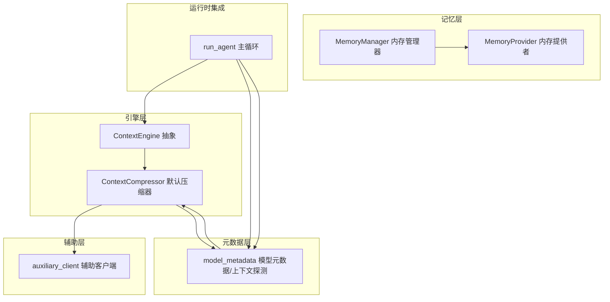
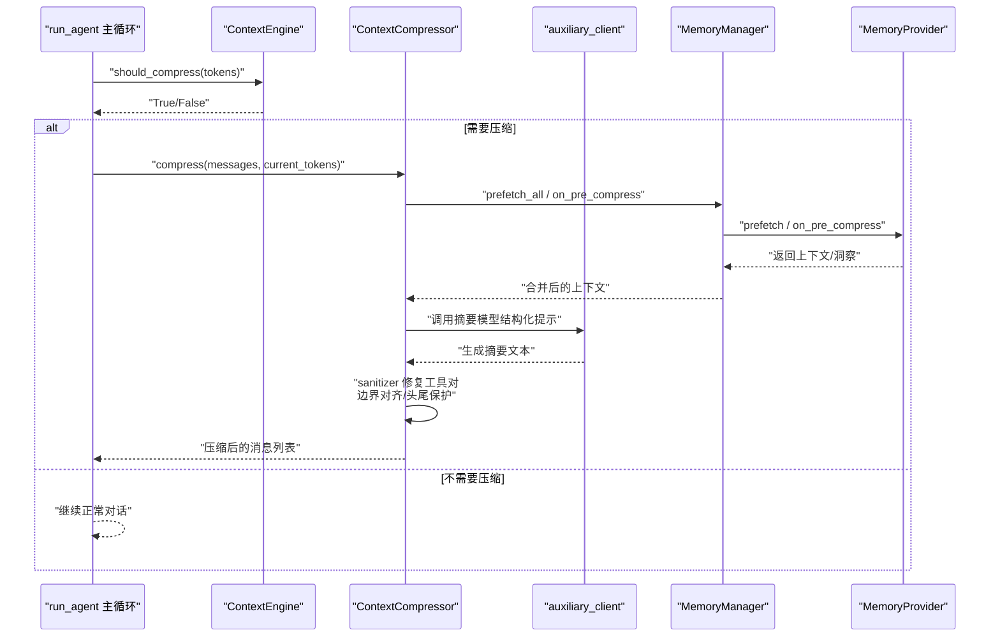
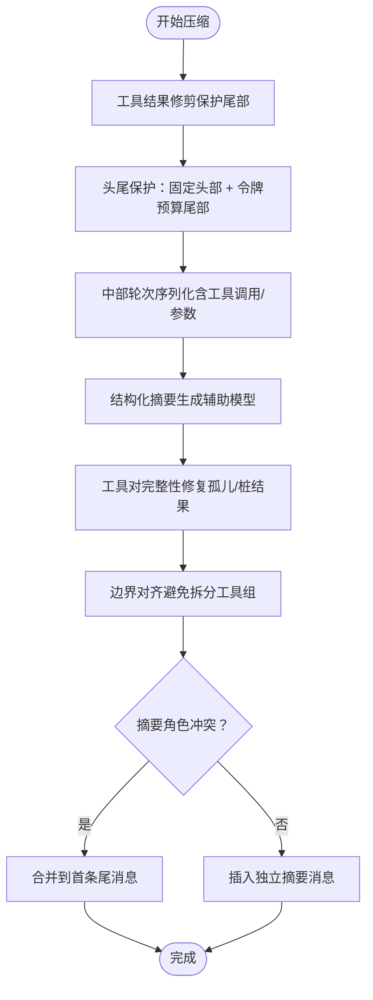
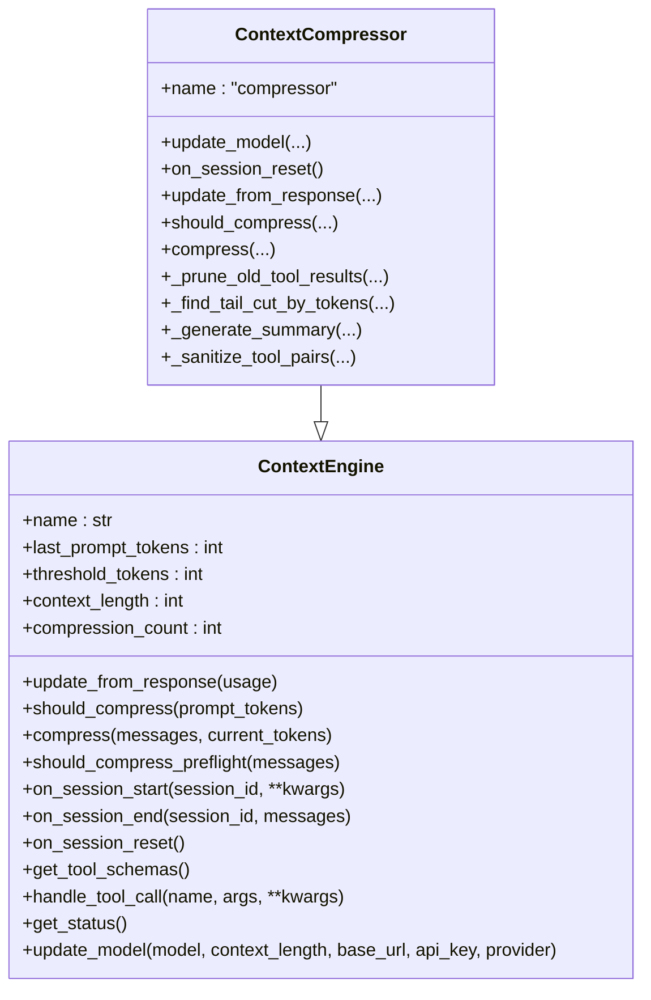
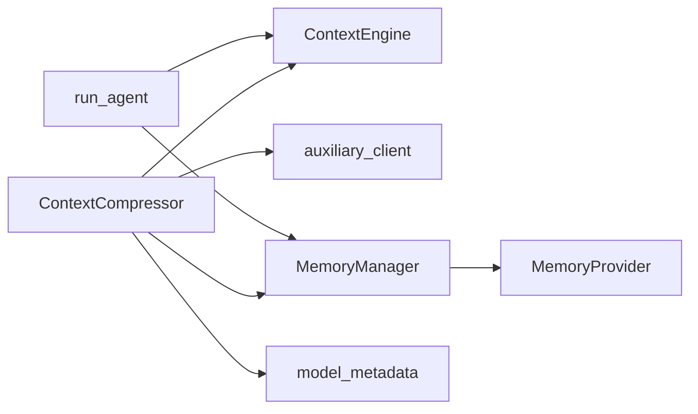

# 上下文管理系统

<cite>
**本文档引用的文件**
- [agent/context_compressor.py](file://agent/context_compressor.py)
- [agent/context_engine.py](file://agent/context_engine.py)
- [agent/manual_compression_feedback.py](file://agent/manual_compression_feedback.py)
- [agent/context_references.py](file://agent/context_references.py)
- [agent/memory_manager.py](file://agent/memory_manager.py)
- [agent/memory_provider.py](file://agent/memory_provider.py)
- [agent/auxiliary_client.py](file://agent/auxiliary_client.py)
- [agent/model_metadata.py](file://agent/model_metadata.py)
- [run_agent.py](file://run_agent.py)
- [website/docs/developer-guide/context-compression-and-caching.md](file://website/docs/developer-guide/context-compression-and-caching.md)
- [tests/run_agent/test_long_context_tier_429.py](file://tests/run_agent/test_long_context_tier_429.py)
</cite>

## 目录
1. [简介](#简介)
2. [项目结构](#项目结构)
3. [核心组件](#核心组件)
4. [架构总览](#架构总览)
5. [详细组件分析](#详细组件分析)
6. [依赖关系分析](#依赖关系分析)
7. [性能考量](#性能考量)
8. [故障排查指南](#故障排查指南)
9. [结论](#结论)
10. [附录：配置与调优](#附录配置与调优)

## 简介
本文件系统化阐述 Hermes Agent 的上下文管理系统，覆盖上下文压缩算法、压缩策略、缓存与检索优化、手动压缩反馈与用户交互、长对话处理与历史压缩、存储空间优化、完整性保障与信息防丢失、以及与模型令牌限制的关系。文档面向开发者与高级用户，既提供代码级细节，也给出可操作的配置建议与调优参数。

## 项目结构
上下文管理由“引擎-压缩器-辅助客户端-元数据-记忆系统”协同实现：
- 引擎层：抽象接口定义与生命周期管理（ContextEngine）
- 压缩层：默认压缩器（ContextCompressor）执行损失性摘要与消息边界保护
- 辅助层：辅助客户端（auxiliary_client）为压缩摘要提供廉价/快速的摘要模型
- 元数据层：模型上下文长度探测、缓存与回退策略（model_metadata）
- 记忆层：内存管理器与提供者（MemoryManager/MemoryProvider）支持跨会话持久化与预取
- 参考注入：上下文引用解析与安全注入（context_references）

图表来源
- [agent/context_engine.py:32-185](file://agent/context_engine.py#L32-L185)
- [agent/context_compressor.py:60-171](file://agent/context_compressor.py#L60-L171)
- [agent/auxiliary_client.py:1150-1200](file://agent/auxiliary_client.py#L1150-L1200)
- [agent/model_metadata.py:427-600](file://agent/model_metadata.py#L427-L600)
- [agent/memory_manager.py:72-363](file://agent/memory_manager.py#L72-L363)
- [agent/memory_provider.py:42-232](file://agent/memory_provider.py#L42-L232)
- [run_agent.py:9848-9866](file://run_agent.py#L9848-L9866)

章节来源
- [agent/context_engine.py:1-185](file://agent/context_engine.py#L1-L185)
- [agent/context_compressor.py:1-171](file://agent/context_compressor.py#L1-L171)
- [agent/auxiliary_client.py:1-1200](file://agent/auxiliary_client.py#L1-L1200)
- [agent/model_metadata.py:1-600](file://agent/model_metadata.py#L1-L600)
- [agent/memory_manager.py:1-363](file://agent/memory_manager.py#L1-L363)
- [agent/memory_provider.py:1-232](file://agent/memory_provider.py#L1-L232)
- [run_agent.py:9848-9866](file://run_agent.py#L9848-L9866)

## 核心组件
- ContextEngine：定义上下文引擎的统一接口与生命周期钩子，包括阈值判断、压缩入口、状态跟踪、模型切换更新等。
- ContextCompressor：默认压缩器，基于结构化摘要模板进行损失性压缩，采用“头尾保护 + 中部摘要”的三段式策略，并对工具调用/结果对进行完整性修复。
- auxiliary_client：自动探测可用的辅助模型（OpenRouter、Nous、自定义端点、Codex、原生Anthropic等），用于压缩摘要生成，具备支付/配额耗尽的自动回退链路。
- model_metadata：模型上下文长度探测、缓存与回退策略，支持本地服务器探测、错误文本解析、持久化缓存等。
- MemoryManager/MemoryProvider：跨会话记忆的注册、预取、同步与工具暴露，支持在压缩前提取洞察并注入摘要提示词。
- manual_compression_feedback：为手动压缩命令提供一致的用户反馈摘要。
- context_references：上下文引用解析与安全注入，限制注入比例并提供警告/阻断机制。

章节来源
- [agent/context_engine.py:32-185](file://agent/context_engine.py#L32-L185)
- [agent/context_compressor.py:60-171](file://agent/context_compressor.py#L60-L171)
- [agent/auxiliary_client.py:1150-1200](file://agent/auxiliary_client.py#L1150-L1200)
- [agent/model_metadata.py:427-600](file://agent/model_metadata.py#L427-L600)
- [agent/memory_manager.py:72-363](file://agent/memory_manager.py#L72-L363)
- [agent/memory_provider.py:42-232](file://agent/memory_provider.py#L42-L232)
- [agent/manual_compression_feedback.py:8-50](file://agent/manual_compression_feedback.py#L8-L50)
- [agent/context_references.py:105-203](file://agent/context_references.py#L105-L203)

## 架构总览
上下文压缩在主循环中按需触发，结合模型令牌限制与运行时使用统计，动态决定是否压缩、如何压缩。压缩器通过辅助客户端调用摘要模型，生成结构化摘要并插入到尾部或合并到首条尾消息中，同时修复工具调用/结果对以避免API拒绝。

图表来源
- [run_agent.py:9848-9866](file://run_agent.py#L9848-L9866)
- [agent/context_engine.py:72-89](file://agent/context_engine.py#L72-L89)
- [agent/context_compressor.py:666-800](file://agent/context_compressor.py#L666-L800)
- [agent/auxiliary_client.py:1150-1200](file://agent/auxiliary_client.py#L1150-L1200)
- [agent/memory_manager.py:167-302](file://agent/memory_manager.py#L167-L302)
- [agent/memory_provider.py:163-173](file://agent/memory_provider.py#L163-L173)

## 详细组件分析

### 上下文压缩算法与策略
- 三段式压缩流程
  - 贪婪工具结果修剪：在保护尾部的前提下，对旧工具结果进行低成本修剪，减少冗余输出占用。
  - 头尾保护：保留系统提示与首次对话（protect_first_n），尾部采用“令牌预算”而非固定消息数，确保最新上下文不被截断。
  - 结构化摘要：对中部对话轮次生成结构化摘要（目标约等于压缩内容的一定比例），并支持迭代更新以保留历史信息。
- 工具对完整性修复
  - 检测并移除孤儿工具结果（无匹配调用ID）
  - 为仍存在的调用补上“桩结果”，避免API因缺失结果而拒绝
  - 对压缩边界进行对齐，避免将工具调用/结果组拆分
- 摘要注入策略
  - 若摘要角色与前后消息角色冲突，则选择另一角色；若冲突不可避免，则将摘要合并到首条尾消息中，避免连续相同角色导致的API限制问题

图表来源
- [agent/context_compressor.py:186-241](file://agent/context_compressor.py#L186-L241)
- [agent/context_compressor.py:604-660](file://agent/context_compressor.py#L604-L660)
- [agent/context_compressor.py:318-483](file://agent/context_compressor.py#L318-L483)
- [agent/context_compressor.py:506-564](file://agent/context_compressor.py#L506-L564)
- [agent/context_compressor.py:768-800](file://agent/context_compressor.py#L768-L800)

章节来源
- [agent/context_compressor.py:186-241](file://agent/context_compressor.py#L186-L241)
- [agent/context_compressor.py:318-483](file://agent/context_compressor.py#L318-L483)
- [agent/context_compressor.py:506-564](file://agent/context_compressor.py#L506-L564)
- [agent/context_compressor.py:604-660](file://agent/context_compressor.py#L604-L660)
- [agent/context_compressor.py:666-800](file://agent/context_compressor.py#L666-L800)

### 上下文引擎工作原理与生命周期
- 接口职责
  - 决策：should_compress 判断是否触发压缩
  - 执行：compress 返回压缩后的消息列表
  - 状态：维护 last_prompt_tokens/threshold_tokens/context_length/compression_count
  - 生命周期：on_session_start/on_session_end/on_session_reset
  - 工具扩展：get_tool_schemas/handle_tool_call（如 LCM）
- 默认实现
  - ContextCompressor 继承 ContextEngine，重写上述方法，实现三段式压缩与摘要生成

图表来源
- [agent/context_engine.py:32-185](file://agent/context_engine.py#L32-L185)
- [agent/context_compressor.py:60-171](file://agent/context_compressor.py#L60-L171)

章节来源
- [agent/context_engine.py:32-185](file://agent/context_engine.py#L32-L185)
- [agent/context_compressor.py:60-171](file://agent/context_compressor.py#L60-L171)

### 缓存机制与检索优化
- 模型上下文长度缓存
  - 持久化缓存文件：HERMES_HOME/context_length_cache.yaml
  - 读取顺序：配置指定上下文长度 → 模型元数据API → 本地服务器探测 → 错误文本解析 → 固定回退
  - TTL与失效：全局模型元数据缓存1小时；端点模型元数据缓存5分钟
- 记忆系统
  - MemoryManager 统一注册内置与外部提供者，支持预取、同步、工具路由
  - on_pre_compress 在压缩前抽取洞察，注入摘要提示词，提升摘要质量
  - build_memory_context_block 使用围栏标签隔离召回上下文，避免被模型视为用户输入

章节来源
- [agent/model_metadata.py:554-600](file://agent/model_metadata.py#L554-L600)
- [agent/model_metadata.py:427-551](file://agent/model_metadata.py#L427-L551)
- [agent/memory_manager.py:72-363](file://agent/memory_manager.py#L72-L363)
- [agent/memory_provider.py:163-173](file://agent/memory_provider.py#L163-L173)

### 手动压缩反馈与用户交互
- 手动压缩反馈
  - summarize_manual_compression 提供一致的用户反馈：消息数量变化、粗略令牌估算、注意提示（当消息减少但令牌估算上升时）
- 用户交互模式
  - CLI/Gateway 提供 /compress 命令入口，支持焦点主题压缩（/compress <topic>），压缩器据此调整摘要权重
  - 压缩后状态可通过 get_status 输出（令牌使用率、阈值、上下文长度、压缩次数）

章节来源
- [agent/manual_compression_feedback.py:8-50](file://agent/manual_compression_feedback.py#L8-L50)
- [agent/context_compressor.py:666-800](file://agent/context_compressor.py#L666-L800)
- [agent/context_engine.py:151-165](file://agent/context_engine.py#L151-L165)

### 长对话处理、历史压缩与存储优化
- 长对话处理
  - 令牌预算尾部保护：根据阈值比例动态分配尾部令牌预算，避免固定消息数导致的截断偏差
  - 迭代摘要更新：在多次压缩中复用先前摘要，保留历史进展与已解决问题
- 历史压缩
  - 工具结果修剪优先于摘要，降低冗余输出对令牌预算的压力
  - 工具对完整性修复确保压缩后 API 合法性
- 存储空间优化
  - 通过摘要将多轮对话压缩为结构化要点，显著减少持久化存储体积
  - 记忆提供者可配合摘要抽取关键洞察，进一步减少重复信息

章节来源
- [agent/context_compressor.py:144-171](file://agent/context_compressor.py#L144-L171)
- [agent/context_compressor.py:247-256](file://agent/context_compressor.py#L247-L256)
- [agent/context_compressor.py:506-564](file://agent/context_compressor.py#L506-L564)
- [agent/memory_manager.py:285-302](file://agent/memory_manager.py#L285-L302)

### 上下文完整性保证与信息防丢失
- 工具调用/结果对修复
  - 移除孤儿结果、为仍存在的调用补桩结果，避免API拒绝
- 角色与消息边界
  - 自动检测并避免连续相同角色，必要时合并摘要到尾消息
- 安全注入与令牌上限
  - @上下文引用注入设置硬/软上限（50%/25%），超限时拒绝并警告
  - 敏感路径与凭证文件阻断，防止泄露

章节来源
- [agent/context_compressor.py:506-564](file://agent/context_compressor.py#L506-L564)
- [agent/context_compressor.py:768-800](file://agent/context_compressor.py#L768-L800)
- [agent/context_references.py:167-186](file://agent/context_references.py#L167-L186)
- [agent/context_references.py:342-361](file://agent/context_references.py#L342-L361)

### 与模型令牌限制的关系
- 令牌阈值与模型上下文
  - threshold_tokens = context_length × threshold_percent，超过即触发压缩
  - 当订阅/配额降级导致实际上下文窗口小于声明值时，系统不会持久化该降级（非模型能力），避免错误缓存
- 令牌估算与回退
  - estimate_messages_tokens_rough 提供快速估算，用于预检与日志
  - 错误文本解析与可用输出令牌检测，帮助区分“输入过长”与“输出过大”

章节来源
- [agent/context_engine.py:59-61](file://agent/context_engine.py#L59-L61)
- [agent/context_compressor.py:98-101](file://agent/context_compressor.py#L98-L101)
- [agent/model_metadata.py:610-678](file://agent/model_metadata.py#L610-L678)
- [tests/run_agent/test_long_context_tier_429.py:116-147](file://tests/run_agent/test_long_context_tier_429.py#L116-L147)

## 依赖关系分析
- 压缩器依赖
  - ContextEngine：统一接口与状态管理
  - auxiliary_client：摘要模型调用与回退链
  - model_metadata：上下文长度探测与缓存
  - MemoryManager/MemoryProvider：压缩前预取与洞察注入
- 运行时集成
  - run_agent 在每次请求后检查令牌压力，按阈值触发压缩器

图表来源
- [agent/context_compressor.py:24-30](file://agent/context_compressor.py#L24-L30)
- [agent/context_engine.py:28-31](file://agent/context_engine.py#L28-L31)
- [agent/auxiliary_client.py:1-56](file://agent/auxiliary_client.py#L1-L56)
- [agent/model_metadata.py:1-20](file://agent/model_metadata.py#L1-L20)
- [agent/memory_manager.py:36-39](file://agent/memory_manager.py#L36-L39)
- [run_agent.py:9848-9866](file://run_agent.py#L9848-L9866)

章节来源
- [agent/context_compressor.py:24-30](file://agent/context_compressor.py#L24-L30)
- [agent/context_engine.py:28-31](file://agent/context_engine.py#L28-L31)
- [agent/auxiliary_client.py:1-56](file://agent/auxiliary_client.py#L1-L56)
- [agent/model_metadata.py:1-20](file://agent/model_metadata.py#L1-L20)
- [agent/memory_manager.py:36-39](file://agent/memory_manager.py#L36-L39)
- [run_agent.py:9848-9866](file://run_agent.py#L9848-L9866)

## 性能考量
- 压缩前预处理
  - 工具结果修剪为O(n)扫描，成本低且收益明显
  - 令牌预算尾部保护避免昂贵的逐轮估算
- 摘要生成
  - 辅助客户端自动选择可用模型，具备支付/连接错误回退，减少失败重试成本
  - 摘要预算与压缩内容成比例，大对话获得更丰富的摘要
- 记忆系统
  - 预取与异步同步降低I/O阻塞
  - 围栏隔离避免上下文污染，减少无效令牌消耗

## 故障排查指南
- 压缩失败冷却
  - 摘要生成失败后进入冷却期，期间跳过摘要，直接丢弃中间轮次并插入静态占位标记，避免重复失败
- 支付/配额耗尽
  - auxiliary_client 自动尝试下一个可用提供者，记录失败原因并输出警告
- 令牌估算异常
  - 使用错误文本解析提取实际上下文限制，区分“输入过长”与“输出过大”，分别调整 context_length 或 max_tokens
- 记忆提供者异常
  - MemoryManager 对各提供者失败进行降级处理，不影响其他提供者

章节来源
- [agent/context_compressor.py:468-483](file://agent/context_compressor.py#L468-L483)
- [agent/auxiliary_client.py:1103-1147](file://agent/auxiliary_client.py#L1103-L1147)
- [agent/model_metadata.py:610-678](file://agent/model_metadata.py#L610-L678)
- [agent/memory_manager.py:174-183](file://agent/memory_manager.py#L174-L183)

## 结论
Hermes Agent 的上下文管理系统通过“引擎-压缩器-辅助客户端-元数据-记忆系统”的协同，实现了高效、可控、可扩展的长对话压缩与检索增强。其核心优势在于：
- 三段式压缩策略兼顾效率与完整性
- 结构化摘要与迭代更新提升信息保留质量
- 自动化的辅助模型选择与回退链路提升鲁棒性
- 严格的令牌预算与安全注入控制降低风险
- 记忆系统的预取与洞察注入进一步优化检索效果

## 附录：配置与调优
- 压缩配置（config.yaml compression.*）
  - enabled：启用/禁用压缩（默认开启）
  - threshold：触发阈值（默认 0.50 = 50%）
  - target_ratio：尾部保护占比（默认 0.20）
  - protect_last_n：最小尾部消息数（默认 20）
  - summary_model：摘要模型覆盖（默认使用辅助客户端）
- 引擎选择
  - context.engine：当前仅支持内置压缩器（compressor），第三方引擎可通过插件系统接入
- 摘要模型选择
  - auxiliary.compression.* 提供 per-task 覆盖，支持 OpenRouter、Nous、自定义端点、Codex、原生Anthropic
- 模型上下文长度探测
  - 支持从 models.dev、端点 /models、本地服务器探测、错误文本解析与持久化缓存
- 长对话与订阅降级
  - 当订阅降级导致上下文窗口小于声明值时，系统不会持久化该降级，避免错误缓存

章节来源
- [website/docs/developer-guide/context-compression-and-caching.md:77-97](file://website/docs/developer-guide/context-compression-and-caching.md#L77-L97)
- [agent/auxiliary_client.py:26-32](file://agent/auxiliary_client.py#L26-L32)
- [agent/model_metadata.py:427-551](file://agent/model_metadata.py#L427-L551)
- [tests/run_agent/test_long_context_tier_429.py:116-147](file://tests/run_agent/test_long_context_tier_429.py#L116-L147)