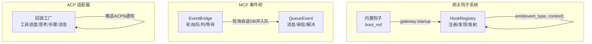
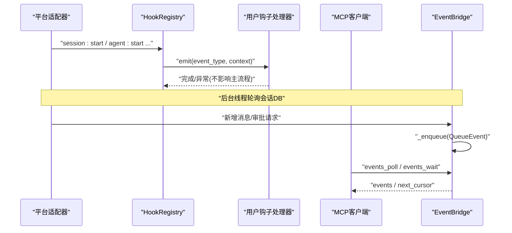
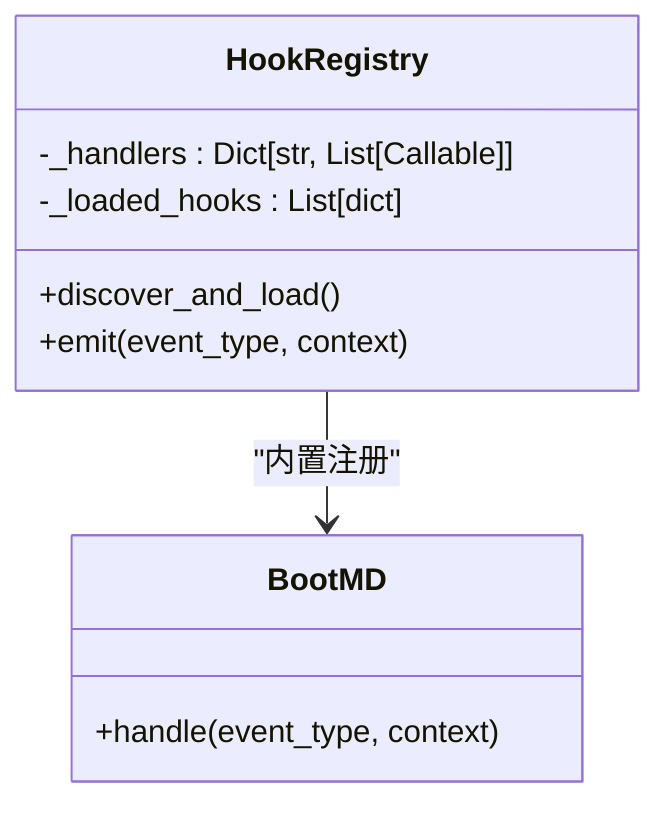
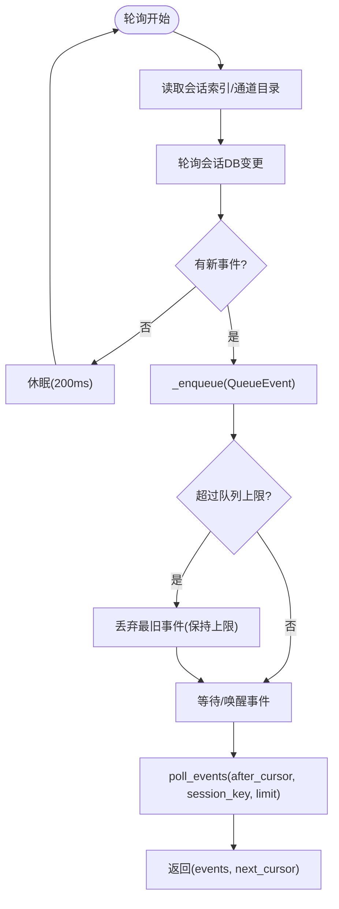
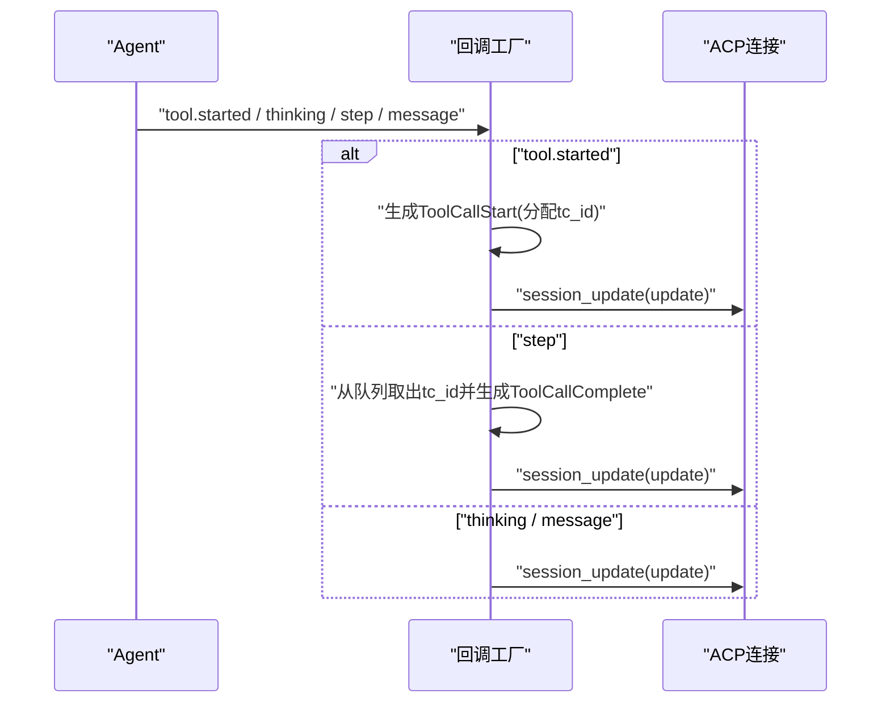
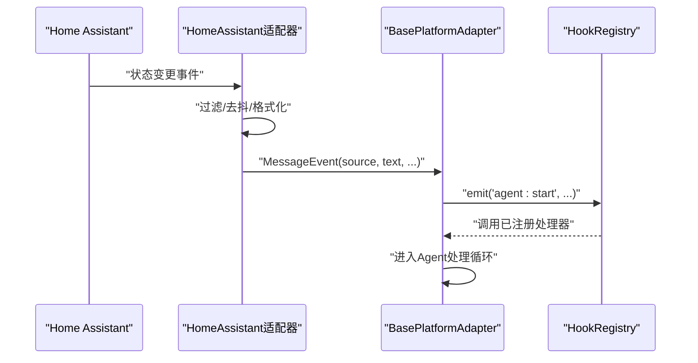
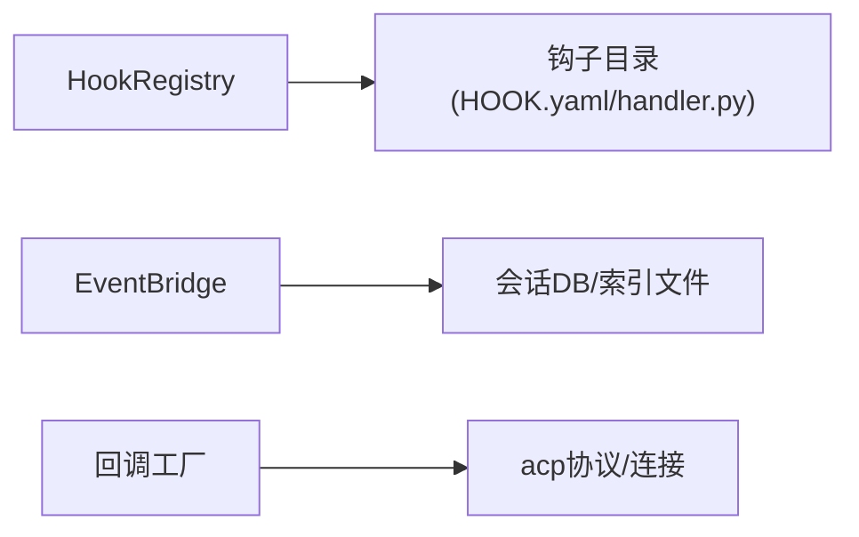

# 事件系统

<cite>
**本文引用的文件**
- [acp_adapter/events.py](file://acp_adapter/events.py)
- [gateway/hooks.py](file://gateway/hooks.py)
- [gateway/builtin_hooks/boot_md.py](file://gateway/builtin_hooks/boot_md.py)
- [mcp_serve.py](file://mcp_serve.py)
- [tests/acp/test_events.py](file://tests/acp/test_events.py)
- [tests/test_mcp_serve.py](file://tests/test_mcp_serve.py)
- [gateway/platforms/base.py](file://gateway/platforms/base.py)
- [gateway/platforms/homeassistant.py](file://gateway/platforms/homeassistant.py)
- [tests/gateway/test_command_bypass_active_session.py](file://tests/gateway/test_command_bypass_active_session.py)
- [tests/gateway/test_homeassistant.py](file://tests/gateway/test_homeassistant.py)
- [website/docs/user-guide/features/hooks.md](file://website/docs/user-guide/features/hooks.md)
</cite>

## 目录
1. [引言](#引言)
2. [项目结构](#项目结构)
3. [核心组件](#核心组件)
4. [架构总览](#架构总览)
5. [详细组件分析](#详细组件分析)
6. [依赖分析](#依赖分析)
7. [性能考量](#性能考量)
8. [故障排查指南](#故障排查指南)
9. [结论](#结论)
10. [附录](#附录)

## 引言
本文件系统性阐述 Hermes Agent 的事件系统：事件架构、事件类型与事件处理器；发布/订阅模式、事件传播机制与处理流程；系统事件、用户事件与工具事件的分类与处理；事件优先级、事件队列与事件调度；事件监听器开发指南与最佳实践；以及事件调试、监控与性能分析方法，并解释事件系统如何实现与各组件的解耦。

## 项目结构
事件系统由三条主线构成：
- 网关钩子（Hook）系统：面向平台适配器与运行时生命周期的事件发布/订阅，支持通配符匹配与动态加载。
- MCP 事件桥（EventBridge）：轮询会话数据库，维护内存事件队列，提供轮询与等待接口，用于 MCP 客户端消费事件。
- ACP 适配器回调工厂：将内部 AI Agent 事件转换为 ACP 通知，桥接编辑器与外部客户端。

图表来源
- [gateway/hooks.py:34-171](file://gateway/hooks.py#L34-L171)
- [gateway/builtin_hooks/boot_md.py:69-88](file://gateway/builtin_hooks/boot_md.py#L69-L88)
- [mcp_serve.py:176-200](file://mcp_serve.py#L176-L200)
- [acp_adapter/events.py:47-176](file://acp_adapter/events.py#L47-L176)

章节来源
- [gateway/hooks.py:1-171](file://gateway/hooks.py#L1-L171)
- [mcp_serve.py:1-200](file://mcp_serve.py#L1-L200)
- [acp_adapter/events.py:1-176](file://acp_adapter/events.py#L1-L176)

## 核心组件
- HookRegistry：负责钩子目录扫描、动态加载、事件到处理器的映射、通配符匹配与异步/同步处理器执行。
- 内置钩子 boot_md：在网关启动时按需执行用户引导脚本，避免阻塞启动。
- EventBridge：后台线程轮询会话数据库，维护内存事件队列，提供游标过滤、会话过滤、限流与等待唤醒。
- 回调工厂：将 Agent 事件转换为 ACP 通知，包括工具开始/完成、思考片段、消息片段等。

章节来源
- [gateway/hooks.py:34-171](file://gateway/hooks.py#L34-L171)
- [gateway/builtin_hooks/boot_md.py:69-88](file://gateway/builtin_hooks/boot_md.py#L69-L88)
- [mcp_serve.py:176-200](file://mcp_serve.py#L176-L200)
- [acp_adapter/events.py:47-176](file://acp_adapter/events.py#L47-L176)

## 架构总览
事件系统采用“发布/订阅 + 轮询桥接”的混合架构：
- 发布侧：平台适配器、Agent 运行时、内置钩子等产生事件；HookRegistry 统一收集与分发。
- 订阅侧：用户编写的钩子模块按事件类型订阅；ACPN 通知通过回调工厂推送到外部编辑器。
- 桥接侧：EventBridge 将会话数据库变更转化为统一的事件模型，供 MCP 客户端拉取或等待。

图表来源
- [gateway/hooks.py:138-171](file://gateway/hooks.py#L138-L171)
- [mcp_serve.py:185-200](file://mcp_serve.py#L185-L200)
- [mcp_serve.py:225-247](file://mcp_serve.py#L225-L247)

## 详细组件分析

### 网关钩子系统（HookRegistry）
- 事件类型与触发点
  - 系统事件：gateway:startup
  - 会话事件：session:start、session:end、session:reset
  - Agent 事件：agent:start、agent:step、agent:end
  - 命令事件：command:*（通配符）
- 发现与加载
  - 扫描 ~/.hermes/hooks/*/ 目录，要求存在 HOOK.yaml 与 handler.py，并导出 handle(event_type, context)。
  - 内置钩子 boot_md 总是注册，无需用户配置。
- 发射与匹配
  - 支持精确匹配与通配符匹配（如 command:* 匹配所有命令事件）。
  - 同步/异步处理器兼容，异常被捕获并记录，不中断主流程。
- 生命周期钩子参考
  - on_session_start/on_session_end 的使用示例与触发时机可参考用户指南文档。

图表来源
- [gateway/hooks.py:34-171](file://gateway/hooks.py#L34-L171)
- [gateway/builtin_hooks/boot_md.py:69-88](file://gateway/builtin_hooks/boot_md.py#L69-L88)

章节来源
- [gateway/hooks.py:1-171](file://gateway/hooks.py#L1-L171)
- [gateway/builtin_hooks/boot_md.py:1-88](file://gateway/builtin_hooks/boot_md.py#L1-L88)
- [website/docs/user-guide/features/hooks.md:554-576](file://website/docs/user-guide/features/hooks.md#L554-L576)

### MCP 事件桥（EventBridge）
- 数据模型
  - QueueEvent：包含游标、类型（消息/审批请求/已解决）、会话键与数据载荷。
- 队列与调度
  - 后台线程以固定周期轮询会话数据库，将新事件入队。
  - 使用线程锁保护队列，支持等待事件（带超时）与唤醒。
  - 队列容量上限，防止无限增长。
- 查询与过滤
  - 支持按游标增量查询、按会话键过滤、限制返回数量。
- 与平台适配器的交互
  - 平台适配器在收到外部消息后，可能生成 MessageEvent 并进入队列。
  - 某些平台事件（如 Home Assistant）经过滤与去抖后转为 MessageEvent 再入队。

图表来源
- [mcp_serve.py:176-200](file://mcp_serve.py#L176-L200)
- [mcp_serve.py:225-247](file://mcp_serve.py#L225-L247)
- [mcp_serve.py:249-261](file://mcp_serve.py#L249-L261)

章节来源
- [mcp_serve.py:176-200](file://mcp_serve.py#L176-L200)
- [mcp_serve.py:225-247](file://mcp_serve.py#L225-L247)
- [mcp_serve.py:249-261](file://mcp_serve.py#L249-L261)
- [tests/test_mcp_serve.py:314-415](file://tests/test_mcp_serve.py#L314-L415)

### ACP 适配器回调工厂
- 目标
  - 将 Agent 的工具进度、思考过程、消息输出等事件转换为 ACP 通知，推送至外部编辑器。
- 关键回调
  - 工具进度回调：仅对“工具开始”事件发出 ToolCallStart，维护每个工具名的 FIFO 队列以确保完成顺序正确。
  - 思考回调：发送 AgentThoughtChunk。
  - 步骤回调：根据前一轮工具调用结果标记对应 ToolCallComplete，并从队列移除。
  - 消息回调：发送 AgentMessageChunk。
- 线程安全
  - 在工作线程中通过 asyncio.run_coroutine_threadsafe 将协程提交到主事件循环，保证跨线程安全。

图表来源
- [acp_adapter/events.py:47-91](file://acp_adapter/events.py#L47-L91)
- [acp_adapter/events.py:117-156](file://acp_adapter/events.py#L117-L156)
- [acp_adapter/events.py:162-176](file://acp_adapter/events.py#L162-L176)

章节来源
- [acp_adapter/events.py:1-176](file://acp_adapter/events.py#L1-L176)
- [tests/acp/test_events.py:1-281](file://tests/acp/test_events.py#L1-L281)

### 事件类型与分类
- 系统事件
  - gateway:startup：网关启动时触发，内置 boot_md 钩子默认注册。
- 用户事件
  - session:start / session:end / session:reset：会话生命周期事件。
  - command:*：任意斜杠命令执行事件（支持通配符）。
- 工具事件
  - agent:start / agent:step / agent:end：Agent 处理流程事件。
- 平台事件
  - 平台适配器接收外部消息后，可能生成 MessageEvent 并进入队列；某些平台事件（如 Home Assistant）经过滤与去抖后转为 MessageEvent。

章节来源
- [gateway/hooks.py:9-20](file://gateway/hooks.py#L9-L20)
- [gateway/platforms/base.py:655-717](file://gateway/platforms/base.py#L655-L717)
- [gateway/platforms/homeassistant.py:280-318](file://gateway/platforms/homeassistant.py#L280-L318)

### 事件传播机制与处理流程
- 发布/订阅
  - HookRegistry 维护 event_type 到处理器列表的映射；emit 时先精确匹配，再扩展通配符匹配。
  - 处理器可同步或异步，异常被吞掉但记录日志，不阻断主流程。
- 平台适配器中的事件处理
  - 某些命令（如 /stop、/new）需要绕过活动会话队列直接处理，测试覆盖了该行为。
- Home Assistant 事件桥接
  - 通过过滤域/实体/watch_all 与冷却时间（cooldown）控制事件频率，最终构造 MessageEvent 并交由适配器处理。

图表来源
- [gateway/platforms/homeassistant.py:280-318](file://gateway/platforms/homeassistant.py#L280-L318)
- [gateway/platforms/base.py:655-717](file://gateway/platforms/base.py#L655-L717)
- [gateway/hooks.py:138-171](file://gateway/hooks.py#L138-L171)

章节来源
- [tests/gateway/test_command_bypass_active_session.py:84-112](file://tests/gateway/test_command_bypass_active_session.py#L84-L112)
- [tests/gateway/test_homeassistant.py:311-400](file://tests/gateway/test_homeassistant.py#L311-L400)
- [gateway/platforms/homeassistant.py:280-318](file://gateway/platforms/homeassistant.py#L280-L318)

### 事件优先级、事件队列与事件调度
- 优先级
  - 当前未见显式优先级字段；平台适配器对特定命令（如 /stop、/new）有“绕过队列”的策略，体现其高优先级。
- 事件队列
  - EventBridge 使用内存列表作为队列，受队列上限保护；提供游标与会话键过滤。
- 调度
  - 后台线程定时轮询；等待接口支持超时与唤醒；MCP 客户端通过轮询或等待获取事件。

章节来源
- [mcp_serve.py:172-174](file://mcp_serve.py#L172-L174)
- [mcp_serve.py:193-200](file://mcp_serve.py#L193-L200)
- [mcp_serve.py:225-247](file://mcp_serve.py#L225-L247)
- [tests/test_mcp_serve.py:389-415](file://tests/test_mcp_serve.py#L389-L415)
- [tests/gateway/test_command_bypass_active_session.py:84-112](file://tests/gateway/test_command_bypass_active_session.py#L84-L112)

### 事件监听器开发指南与最佳实践
- 开发步骤
  - 在 ~/.hermes/hooks/<your_hook>/ 下创建 HOOK.yaml 与 handler.py。
  - HOOK.yaml 至少包含 name 与 events；events 为事件类型列表。
  - handler.py 导出 handle(event_type, context) 函数，支持同步或异步。
- 匹配规则
  - 精确匹配优先；若 event_type 含冒号，则同时匹配 base:*。
- 错误处理
  - 处理器异常会被捕获并记录，不会影响主流程。
- 最佳实践
  - 保持处理器幂等与轻量；避免长时间阻塞；必要时使用后台线程或异步任务。
  - 对高频事件设置冷却或合并策略（参考 Home Assistant 适配器的去抖逻辑）。

章节来源
- [gateway/hooks.py:69-137](file://gateway/hooks.py#L69-L137)
- [gateway/hooks.py:138-171](file://gateway/hooks.py#L138-L171)
- [gateway/builtin_hooks/boot_md.py:69-88](file://gateway/builtin_hooks/boot_md.py#L69-L88)

## 依赖分析
- 组件耦合
  - HookRegistry 与钩子模块松耦合：通过动态导入与约定接口解耦。
  - EventBridge 与会话存储松耦合：通过会话索引与通道目录文件读取，避免引入完整配置。
  - ACP 适配器回调工厂与主事件循环松耦合：通过 run_coroutine_threadsafe 跨线程提交。
- 外部依赖
  - HookRegistry 依赖 YAML 元数据与动态模块加载。
  - EventBridge 依赖会话数据库与文件系统缓存。
  - ACP 适配器依赖 acp 协议与外部编辑器连接。

图表来源
- [gateway/hooks.py:69-137](file://gateway/hooks.py#L69-L137)
- [mcp_serve.py:62-116](file://mcp_serve.py#L62-L116)
- [acp_adapter/events.py:10-22](file://acp_adapter/events.py#L10-L22)

章节来源
- [gateway/hooks.py:69-137](file://gateway/hooks.py#L69-L137)
- [mcp_serve.py:62-116](file://mcp_serve.py#L62-L116)
- [acp_adapter/events.py:10-22](file://acp_adapter/events.py#L10-L22)

## 性能考量
- 队列上限与内存占用：EventBridge 对队列长度有限制，避免内存膨胀。
- 轮询间隔：固定 200ms 轮询，平衡实时性与 CPU 占用。
- 等待唤醒：wait_for_event 提供超时等待，减少忙轮询。
- 线程安全：ACPN 通知通过 run_coroutine_threadsafe 提交，避免锁竞争。
- 去抖与过滤：平台适配器对高频事件进行去抖与过滤，降低事件风暴。

章节来源
- [mcp_serve.py:172-174](file://mcp_serve.py#L172-L174)
- [mcp_serve.py:249-261](file://mcp_serve.py#L249-L261)
- [acp_adapter/events.py:34-41](file://acp_adapter/events.py#L34-L41)
- [gateway/platforms/homeassistant.py:286-291](file://gateway/platforms/homeassistant.py#L286-L291)

## 故障排查指南
- 钩子未生效
  - 检查 HOOK.yaml 是否存在且包含 name 与 events；检查 handler.py 是否导出 handle。
  - 查看加载日志输出，确认是否抛出异常或被跳过。
- 事件未到达
  - 确认事件类型是否匹配（含通配符）；检查上下文是否为空。
  - 对于 MCP 事件，确认 after_cursor 与 session_key 过滤条件。
- 高频事件导致性能问题
  - 在平台适配器侧增加冷却时间或合并策略；在 Hook 中做去抖与限速。
- ACP 通知未送达
  - 检查回调工厂是否成功提交协程；确认外部编辑器连接状态。

章节来源
- [gateway/hooks.py:69-137](file://gateway/hooks.py#L69-L137)
- [gateway/hooks.py:138-171](file://gateway/hooks.py#L138-L171)
- [tests/test_mcp_serve.py:357-388](file://tests/test_mcp_serve.py#L357-L388)
- [acp_adapter/events.py:34-41](file://acp_adapter/events.py#L34-L41)

## 结论
Hermes Agent 的事件系统通过 HookRegistry 实现灵活的发布/订阅，通过 EventBridge 将会话数据库变更转化为统一事件模型供 MCP 客户端消费，并通过 ACP 回调工厂将 Agent 内部事件桥接到外部编辑器。系统在错误隔离、线程安全与资源控制方面具备良好设计，适合扩展与演进。

## 附录
- 事件类型清单（来自钩子系统注释）
  - gateway:startup
  - session:start
  - session:end
  - session:reset
  - agent:start
  - agent:step
  - agent:end
  - command:*（通配符）

章节来源
- [gateway/hooks.py:9-20](file://gateway/hooks.py#L9-L20)