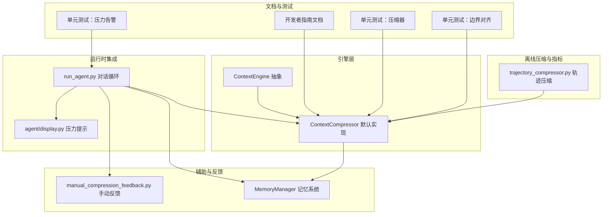
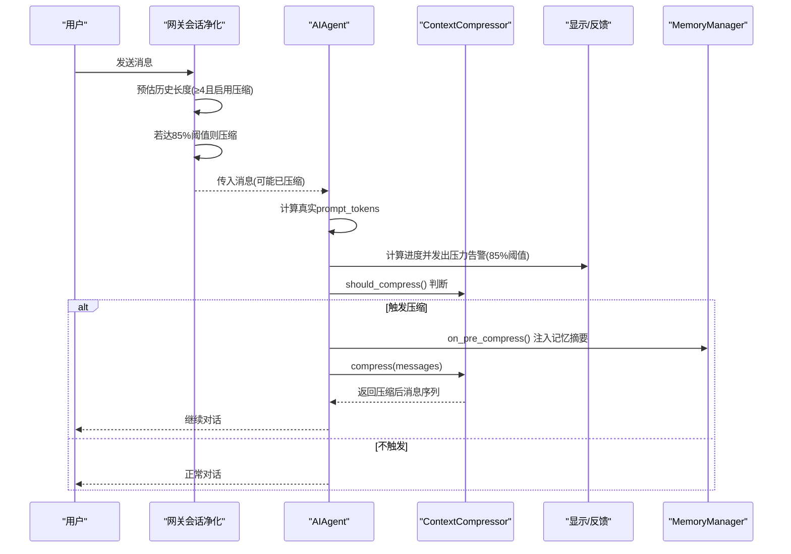
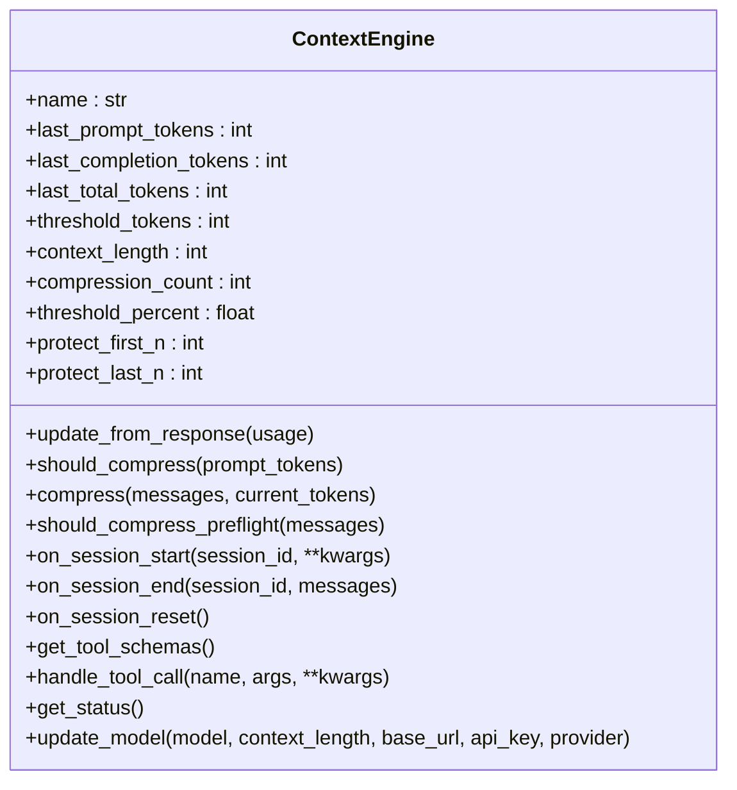
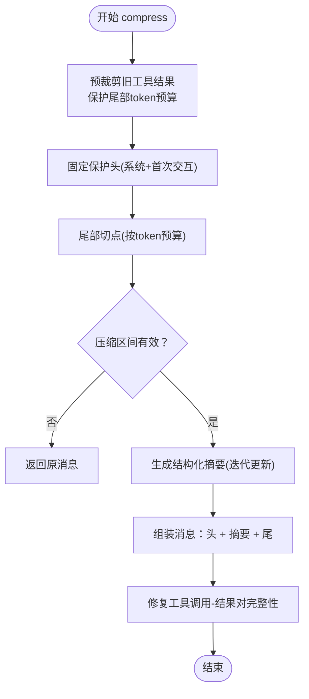
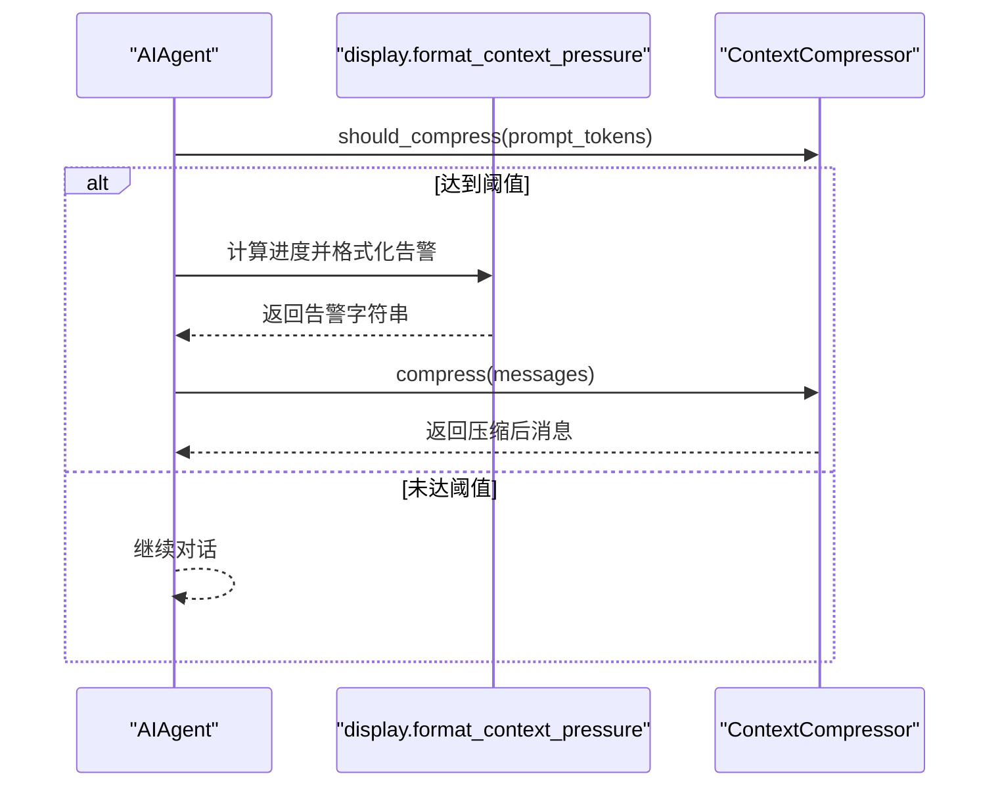
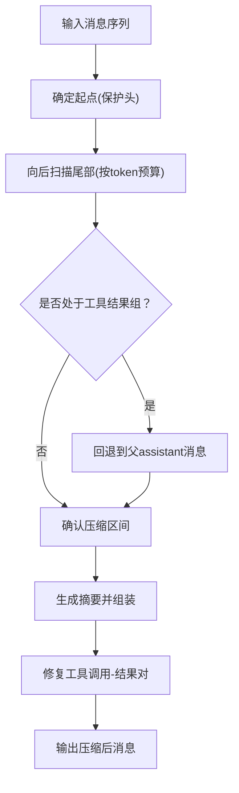
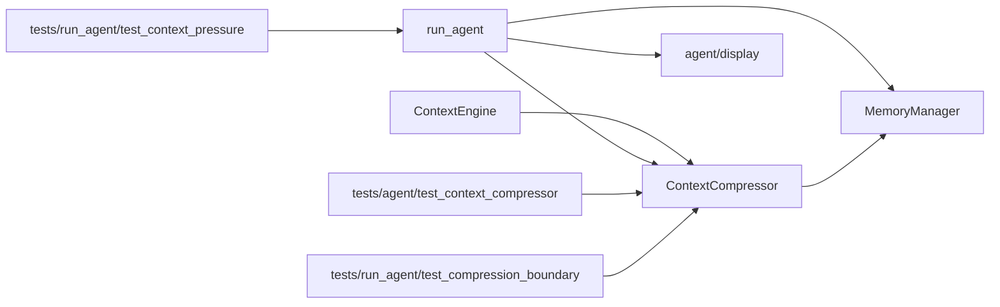

# 上下文压缩

<cite>
**本文引用的文件列表**
- [agent/context_engine.py](file://agent/context_engine.py)
- [agent/context_compressor.py](file://agent/context_compressor.py)
- [agent/manual_compression_feedback.py](file://agent/manual_compression_feedback.py)
- [agent/memory_manager.py](file://agent/memory_manager.py)
- [run_agent.py](file://run_agent.py)
- [agent/display.py](file://agent/display.py)
- [website/docs/developer-guide/context-compression-and-caching.md](file://website/docs/developer-guide/context-compression-and-caching.md)
- [tests/agent/test_context_compressor.py](file://tests/agent/test_context_compressor.py)
- [tests/run_agent/test_compression_boundary.py](file://tests/run_agent/test_compression_boundary.py)
- [tests/run_agent/test_context_pressure.py](file://tests/run_agent/test_context_pressure.py)
- [trajectory_compressor.py](file://trajectory_compressor.py)
</cite>

## 目录
1. [简介](#简介)
2. [项目结构](#项目结构)
3. [核心组件](#核心组件)
4. [架构总览](#架构总览)
5. [详细组件分析](#详细组件分析)
6. [依赖关系分析](#依赖关系分析)
7. [性能考量](#性能考量)
8. [故障排查指南](#故障排查指南)
9. [结论](#结论)
10. [附录](#附录)

## 简介
本文件面向Hermes Agent的上下文压缩系统，系统性阐述压缩算法、策略与引擎架构，覆盖自动触发条件、手动反馈、质量评估、边界检测、信息保留、效率优化、历史管理与回滚、性能监控等主题，并给出与对话循环、记忆系统、工具调用的集成关系及调优建议。文档同时提供可直接定位到源码的路径指引，便于读者在仓库中快速查阅实现细节。

## 项目结构
围绕上下文压缩的关键模块与文件如下：
- 引擎抽象与默认实现：agent/context_engine.py、agent/context_compressor.py
- 用户反馈与显示：agent/manual_compression_feedback.py、agent/display.py
- 运行时集成：run_agent.py（对话循环、压力告警、压缩触发）
- 记忆系统集成：agent/memory_manager.py（压缩前注入记忆上下文）
- 文档与测试：website/docs/developer-guide/context-compression-and-caching.md、tests/agent/test_context_compressor.py、tests/run_agent/test_compression_boundary.py、tests/run_agent/test_context_pressure.py
- 轨迹压缩与指标：trajectory_compressor.py（离线训练数据压缩与指标）

图表来源
- [agent/context_engine.py:1-185](file://agent/context_engine.py#L1-L185)
- [agent/context_compressor.py:1-821](file://agent/context_compressor.py#L1-L821)
- [run_agent.py:1-200](file://run_agent.py#L1-L200)
- [agent/display.py:1000-1043](file://agent/display.py#L1000-L1043)
- [agent/manual_compression_feedback.py:1-50](file://agent/manual_compression_feedback.py#L1-L50)
- [agent/memory_manager.py:1-363](file://agent/memory_manager.py#L1-L363)
- [website/docs/developer-guide/context-compression-and-caching.md:1-353](file://website/docs/developer-guide/context-compression-and-caching.md#L1-L353)
- [tests/agent/test_context_compressor.py:1-784](file://tests/agent/test_context_compressor.py#L1-L784)
- [tests/run_agent/test_compression_boundary.py:1-148](file://tests/run_agent/test_compression_boundary.py#L1-L148)
- [tests/run_agent/test_context_pressure.py:1-277](file://tests/run_agent/test_context_pressure.py#L1-L277)
- [trajectory_compressor.py:1-200](file://trajectory_compressor.py#L1-L200)

章节来源
- [agent/context_engine.py:1-185](file://agent/context_engine.py#L1-L185)
- [agent/context_compressor.py:1-821](file://agent/context_compressor.py#L1-L821)
- [run_agent.py:1-200](file://run_agent.py#L1-L200)
- [agent/display.py:1000-1043](file://agent/display.py#L1000-L1043)
- [agent/manual_compression_feedback.py:1-50](file://agent/manual_compression_feedback.py#L1-L50)
- [agent/memory_manager.py:1-363](file://agent/memory_manager.py#L1-L363)
- [website/docs/developer-guide/context-compression-and-caching.md:1-353](file://website/docs/developer-guide/context-compression-and-caching.md#L1-L353)
- [tests/agent/test_context_compressor.py:1-784](file://tests/agent/test_context_compressor.py#L1-L784)
- [tests/run_agent/test_compression_boundary.py:1-148](file://tests/run_agent/test_compression_boundary.py#L1-L148)
- [tests/run_agent/test_context_pressure.py:1-277](file://tests/run_agent/test_context_pressure.py#L1-L277)
- [trajectory_compressor.py:1-200](file://trajectory_compressor.py#L1-L200)

## 核心组件
- ContextEngine 抽象基类：定义上下文引擎的生命周期、阈值判断、压缩入口、状态跟踪、模型切换等接口。默认实现由 ContextCompressor 提供。
- ContextCompressor 默认引擎：实现损失性压缩算法，包含“预裁剪旧工具结果”“保护头尾”“结构化摘要生成”“工具调用对完整性修复”“边界对齐”等步骤。
- 运行时集成 run_agent：在对话循环中根据阈值触发压缩，发出上下文压力告警，处理压缩后的消息序列。
- 显示与反馈 agent/display 与 manual_compression_feedback：提供用户可见的压力提示格式化与手动压缩后的反馈摘要。
- 记忆系统 agent/memory_manager：在压缩前注入外部/内置记忆上下文，支持压缩前回调以纳入记忆摘要。
- 文档与测试：开发者指南说明双层压缩体系、参数与模板；多套测试覆盖边界对齐、压力告警、阈值逻辑等。

章节来源
- [agent/context_engine.py:32-185](file://agent/context_engine.py#L32-L185)
- [agent/context_compressor.py:60-821](file://agent/context_compressor.py#L60-L821)
- [run_agent.py:7350-7379](file://run_agent.py#L7350-L7379)
- [agent/display.py:1000-1043](file://agent/display.py#L1000-L1043)
- [agent/manual_compression_feedback.py:8-50](file://agent/manual_compression_feedback.py#L8-L50)
- [agent/memory_manager.py:285-302](file://agent/memory_manager.py#L285-L302)
- [website/docs/developer-guide/context-compression-and-caching.md:10-353](file://website/docs/developer-guide/context-compression-and-caching.md#L10-L353)

## 架构总览
Hermes 的上下文压缩采用“双层安全网”设计：
- 网关会话净化（85%阈值）：在进入Agent之前，基于会话历史进行粗略估计并压缩，防止长会话在平台侧溢出。
- Agent内压缩器（50%阈值）：在Agent内部循环中，使用真实API计数进行精确压缩。

图表来源
- [website/docs/developer-guide/context-compression-and-caching.md:37-75](file://website/docs/developer-guide/context-compression-and-caching.md#L37-L75)
- [run_agent.py:7350-7379](file://run_agent.py#L7350-L7379)
- [agent/context_compressor.py:666-821](file://agent/context_compressor.py#L666-L821)
- [agent/memory_manager.py:285-302](file://agent/memory_manager.py#L285-L302)

章节来源
- [website/docs/developer-guide/context-compression-and-caching.md:37-75](file://website/docs/developer-guide/context-compression-and-caching.md#L37-L75)
- [run_agent.py:7350-7379](file://run_agent.py#L7350-L7379)
- [agent/context_compressor.py:666-821](file://agent/context_compressor.py#L666-L821)
- [agent/memory_manager.py:285-302](file://agent/memory_manager.py#L285-L302)

## 详细组件分析

### ContextEngine 抽象与生命周期
- 负责决定何时触发压缩（should_compress）、执行压缩（compress）、跟踪令牌使用（update_from_response）、模型切换（update_model）、会话生命周期钩子（on_session_start/on_session_end/on_session_reset）。
- 默认阈值、保护窗口参数可在子类中覆盖或通过构造函数注入。

图表来源
- [agent/context_engine.py:32-185](file://agent/context_engine.py#L32-L185)

章节来源
- [agent/context_engine.py:32-185](file://agent/context_engine.py#L32-L185)

### ContextCompressor 算法与策略
- 算法阶段
  - 预裁剪旧工具结果：对超出保护尾部范围且内容较长的工具输出进行占位替换，避免冗长输出占用大量token。
  - 边界确定：固定保护头（系统+首次交互），尾部保护采用“按token预算”的方式，确保最近内容不被过度压缩；边界对齐避免拆分工具调用-结果组。
  - 结构化摘要：使用辅助模型生成结构化摘要（Goal、Progress、Decisions、Resolved/Pending Questions、Relevant Files、Remaining Work、Critical Context、Tools & Patterns），迭代更新以保留跨多次压缩的信息。
  - 消息组装：将摘要插入到头部与尾部之间，角色选择遵循避免连续相同角色的规则；必要时将摘要合并到第一个尾部消息中。
  - 工具对完整性修复：清理孤儿工具结果与缺失结果，保证API不会收到不匹配的call_id。
- 关键参数与预算
  - threshold_percent：默认50%，结合模型上下文窗口计算阈值。
  - summary_target_ratio：目标尾部token预算占阈值的比例，默认0.20，随上下文窗口缩放。
  - tail_token_budget：尾部保护的token预算，随上下文窗口线性增长但受上限约束。
  - max_summary_tokens：摘要最大token预算，按上下文窗口的5%计算，上限12K。
- 自适应与稳定性
  - 迭代摘要更新：复用_previous_summary，逐步更新而非从零总结，提升跨轮次一致性。
  - 失败冷却：摘要生成失败进入冷却期，避免频繁重试导致噪音。
  - 前缀标准化：统一摘要前缀，兼容旧版本输出。
- 边界检测与信息保留
  - 工具调用-结果成组：通过向后对齐边界，确保整个assistant+tool_results组被完整压缩，避免孤儿结果。
  - 尾部保护：token预算优先，消息数量作为硬下限，避免大体积工具输出阻塞压缩。
  - 角色交替：摘要插入时选择合适角色，避免与前后邻居产生连续相同角色。

图表来源
- [agent/context_compressor.py:666-821](file://agent/context_compressor.py#L666-L821)
- [agent/context_compressor.py:186-241](file://agent/context_compressor.py#L186-L241)
- [agent/context_compressor.py:247-484](file://agent/context_compressor.py#L247-L484)
- [agent/context_compressor.py:566-598](file://agent/context_compressor.py#L566-L598)
- [agent/context_compressor.py:604-660](file://agent/context_compressor.py#L604-L660)
- [agent/context_compressor.py:506-564](file://agent/context_compressor.py#L506-L564)

章节来源
- [agent/context_compressor.py:666-821](file://agent/context_compressor.py#L666-L821)
- [agent/context_compressor.py:186-241](file://agent/context_compressor.py#L186-L241)
- [agent/context_compressor.py:247-484](file://agent/context_compressor.py#L247-L484)
- [agent/context_compressor.py:566-598](file://agent/context_compressor.py#L566-L598)
- [agent/context_compressor.py:604-660](file://agent/context_compressor.py#L604-L660)
- [agent/context_compressor.py:506-564](file://agent/context_compressor.py#L506-L564)

### 自动压缩触发与压力告警
- 触发条件
  - run_agent 在每轮结束后计算真实prompt_tokens，若达到阈值（默认50%），则触发压缩。
  - 双层安全网：网关在进入Agent前以85%阈值进行粗略压缩；Agent内部以50%阈值进行精确压缩。
- 压力告警
  - 当接近压缩阈值（85%阈值）时，发出用户可见的压力提示；支持CLI与网关平台两种格式。
  - 告警分级与去重：按阈值层级（如85%/95%）去重，冷却窗口内不重复告警。
- 手动压缩反馈
  - 提供手动压缩后的前后对比摘要，包括消息数变化、token估算变化与注意事项。

图表来源
- [run_agent.py:7350-7379](file://run_agent.py#L7350-L7379)
- [agent/display.py:1000-1043](file://agent/display.py#L1000-L1043)
- [agent/context_compressor.py:177-180](file://agent/context_compressor.py#L177-L180)

章节来源
- [run_agent.py:7350-7379](file://run_agent.py#L7350-L7379)
- [agent/display.py:1000-1043](file://agent/display.py#L1000-L1043)
- [agent/context_compressor.py:177-180](file://agent/context_compressor.py#L177-L180)
- [tests/run_agent/test_context_pressure.py:1-277](file://tests/run_agent/test_context_pressure.py#L1-277)

### 边界检测与工具调用对完整性
- 向前推进压缩起点：避免从工具结果开始压缩。
- 向后对齐压缩终点：遇到连续工具结果时，回退到父assistant消息，确保整组被压缩。
- 工具对修复：移除孤儿结果、为缺失结果注入桩结果，保证API不会收到不匹配的call_id。

图表来源
- [agent/context_compressor.py:566-598](file://agent/context_compressor.py#L566-L598)
- [agent/context_compressor.py:506-564](file://agent/context_compressor.py#L506-L564)
- [tests/run_agent/test_compression_boundary.py:1-148](file://tests/run_agent/test_compression_boundary.py#L1-L148)

章节来源
- [agent/context_compressor.py:566-598](file://agent/context_compressor.py#L566-L598)
- [agent/context_compressor.py:506-564](file://agent/context_compressor.py#L506-L564)
- [tests/run_agent/test_compression_boundary.py:1-148](file://tests/run_agent/test_compression_boundary.py#L1-L148)

### 与对话循环、记忆系统、工具调用的集成
- 对话循环集成
  - run_agent 在每轮结束后检查阈值并触发压缩；在压缩前调用 MemoryManager 的 on_pre_compress 回调，将各提供者的上下文摘要注入到压缩摘要提示中。
- 记忆系统集成
  - MemoryManager 支持注册多个记忆提供者，统一构建系统提示、预取与同步；压缩前回调允许将记忆摘要纳入压缩上下文，增强摘要的背景完整性。
- 工具调用集成
  - 压缩过程中严格维护工具调用-结果对的完整性，避免API错误；摘要模板中保留工具名称与关键参数片段，帮助后续理解上下文。

章节来源
- [run_agent.py:1-200](file://run_agent.py#L1-L200)
- [agent/memory_manager.py:285-302](file://agent/memory_manager.py#L285-L302)
- [agent/context_compressor.py:506-564](file://agent/context_compressor.py#L506-L564)

### 压缩质量评估与历史管理
- 质量评估
  - 结构化摘要模板覆盖Goal、Progress、Decisions、Resolved/Pending Questions、Relevant Files、Remaining Work、Critical Context、Tools & Patterns，确保摘要可读且可追踪。
  - 迭代更新机制保留跨轮次信息，减少重复工作与遗漏。
- 历史管理与回滚
  - 压缩后消息序列保持OpenAI格式，便于后续API调用；摘要前缀标准化，避免重复注入。
  - 压缩计数 compression_count 用于统计压缩次数，辅助调试与性能分析。
- 性能监控
  - run_agent 维护上下文压力告警状态与阈值；ContextCompressor 维护 last_prompt_tokens/threshold_tokens/context_length/compression_count 等状态，供显示与诊断使用。
  - trajectory_compressor 提供离线轨迹压缩与指标统计（原始/压缩token、移除轮数、摘要API调用次数与成功率等），可用于训练数据压缩与效果评估。

章节来源
- [agent/context_compressor.py:406-421](file://agent/context_compressor.py#L406-L421)
- [run_agent.py:7350-7379](file://run_agent.py#L7350-L7379)
- [agent/context_engine.py:151-165](file://agent/context_engine.py#L151-L165)
- [trajectory_compressor.py:154-200](file://trajectory_compressor.py#L154-L200)

## 依赖关系分析
- ContextEngine 是所有上下文引擎的抽象，ContextCompressor 实现该接口。
- run_agent 依赖 ContextCompressor 进行压缩决策与执行，并依赖 agent/display 提供用户可见的压力提示。
- MemoryManager 在压缩前注入记忆摘要，增强摘要背景。
- 测试覆盖了压缩器的核心行为、边界对齐与压力告警，确保算法正确性与鲁棒性。

图表来源
- [agent/context_engine.py:32-185](file://agent/context_engine.py#L32-L185)
- [agent/context_compressor.py:60-821](file://agent/context_compressor.py#L60-L821)
- [run_agent.py:1-200](file://run_agent.py#L1-L200)
- [agent/display.py:1000-1043](file://agent/display.py#L1000-L1043)
- [agent/memory_manager.py:285-302](file://agent/memory_manager.py#L285-L302)
- [tests/agent/test_context_compressor.py:1-784](file://tests/agent/test_context_compressor.py#L1-L784)
- [tests/run_agent/test_compression_boundary.py:1-148](file://tests/run_agent/test_compression_boundary.py#L1-L148)
- [tests/run_agent/test_context_pressure.py:1-277](file://tests/run_agent/test_context_pressure.py#L1-L277)

章节来源
- [agent/context_engine.py:32-185](file://agent/context_engine.py#L32-L185)
- [agent/context_compressor.py:60-821](file://agent/context_compressor.py#L60-L821)
- [run_agent.py:1-200](file://run_agent.py#L1-L200)
- [agent/display.py:1000-1043](file://agent/display.py#L1000-L1043)
- [agent/memory_manager.py:285-302](file://agent/memory_manager.py#L285-L302)
- [tests/agent/test_context_compressor.py:1-784](file://tests/agent/test_context_compressor.py#L1-L784)
- [tests/run_agent/test_compression_boundary.py:1-148](file://tests/run_agent/test_compression_boundary.py#L1-L148)
- [tests/run_agent/test_context_pressure.py:1-277](file://tests/run_agent/test_context_pressure.py#L1-L277)

## 性能考量
- 预裁剪工具结果：显著降低冗长工具输出对token的占用，提高后续摘要生成的性价比。
- 尾部保护的token预算：避免大体积工具输出阻塞压缩，确保最近上下文的可读性与可用性。
- 摘要预算自适应：摘要token预算随压缩内容规模与上下文窗口动态调整，兼顾质量与成本。
- 失败冷却：摘要生成失败进入冷却期，避免频繁重试带来的资源浪费。
- 离线轨迹压缩与指标：trajectory_compressor 提供详细的压缩统计与指标，便于评估压缩效果与调优。

章节来源
- [agent/context_compressor.py:186-241](file://agent/context_compressor.py#L186-L241)
- [agent/context_compressor.py:247-256](file://agent/context_compressor.py#L247-L256)
- [agent/context_compressor.py:468-483](file://agent/context_compressor.py#L468-L483)
- [trajectory_compressor.py:154-200](file://trajectory_compressor.py#L154-L200)

## 故障排查指南
- 摘要模型上下文不足
  - 现象：摘要生成失败，返回None，中间轮次被丢弃而不生成摘要。
  - 原因：摘要模型上下文窗口小于主模型，导致API返回上下文过长错误。
  - 处理：提升摘要模型上下文或降低摘要预算；等待冷却期后重试。
- 工具调用-结果对不匹配
  - 现象：API报错提示找不到对应call_id。
  - 处理：启用工具对完整性修复，移除孤儿结果并注入桩结果。
- 压力告警未触发或重复
  - 现象：接近阈值未告警或重复告警。
  - 处理：检查阈值层级与冷却窗口设置，确保去重逻辑生效。
- 手动压缩反馈
  - 使用 manual_compression_feedback 获取前后对比摘要，便于快速评估压缩效果。

章节来源
- [website/docs/developer-guide/context-compression-and-caching.md:146-148](file://website/docs/developer-guide/context-compression-and-caching.md#L146-L148)
- [agent/context_compressor.py:506-564](file://agent/context_compressor.py#L506-L564)
- [tests/run_agent/test_context_pressure.py:1-277](file://tests/run_agent/test_context_pressure.py#L1-L277)
- [agent/manual_compression_feedback.py:8-50](file://agent/manual_compression_feedback.py#L8-L50)

## 结论
Hermes Agent的上下文压缩系统通过双层安全网、结构化摘要、工具对完整性修复与边界对齐等机制，在保证对话连贯性的同时显著降低token占用。其参数化设计与自适应预算使系统能够适配不同上下文窗口与任务密度；配套的测试与指标体系有助于持续评估与优化压缩质量。

## 附录
- 配置参考
  - compression.enabled、threshold、target_ratio、protect_last_n、summary_model 等参数详见开发者指南文档。
- 代码示例路径
  - 自动压缩触发与压力告警：[run_agent.py:7350-7379](file://run_agent.py#L7350-L7379)
  - 压缩器初始化与阈值计算：[agent/context_compressor.py:103-142](file://agent/context_compressor.py#L103-L142)
  - 结构化摘要模板与迭代更新：[agent/context_compressor.py:318-432](file://agent/context_compressor.py#L318-L432)
  - 工具对完整性修复：[agent/context_compressor.py:506-564](file://agent/context_compressor.py#L506-L564)
  - 边界对齐与尾部保护：[agent/context_compressor.py:566-598](file://agent/context_compressor.py#L566-L598)、[agent/context_compressor.py:604-660](file://agent/context_compressor.py#L604-L660)
  - 手动压缩反馈：[agent/manual_compression_feedback.py:8-50](file://agent/manual_compression_feedback.py#L8-L50)
  - 记忆系统压缩前回调：[agent/memory_manager.py:285-302](file://agent/memory_manager.py#L285-L302)
  - 离线轨迹压缩与指标：[trajectory_compressor.py:154-200](file://trajectory_compressor.py#L154-L200)