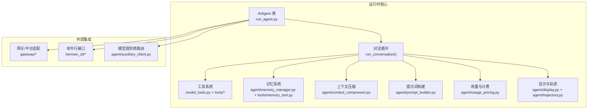
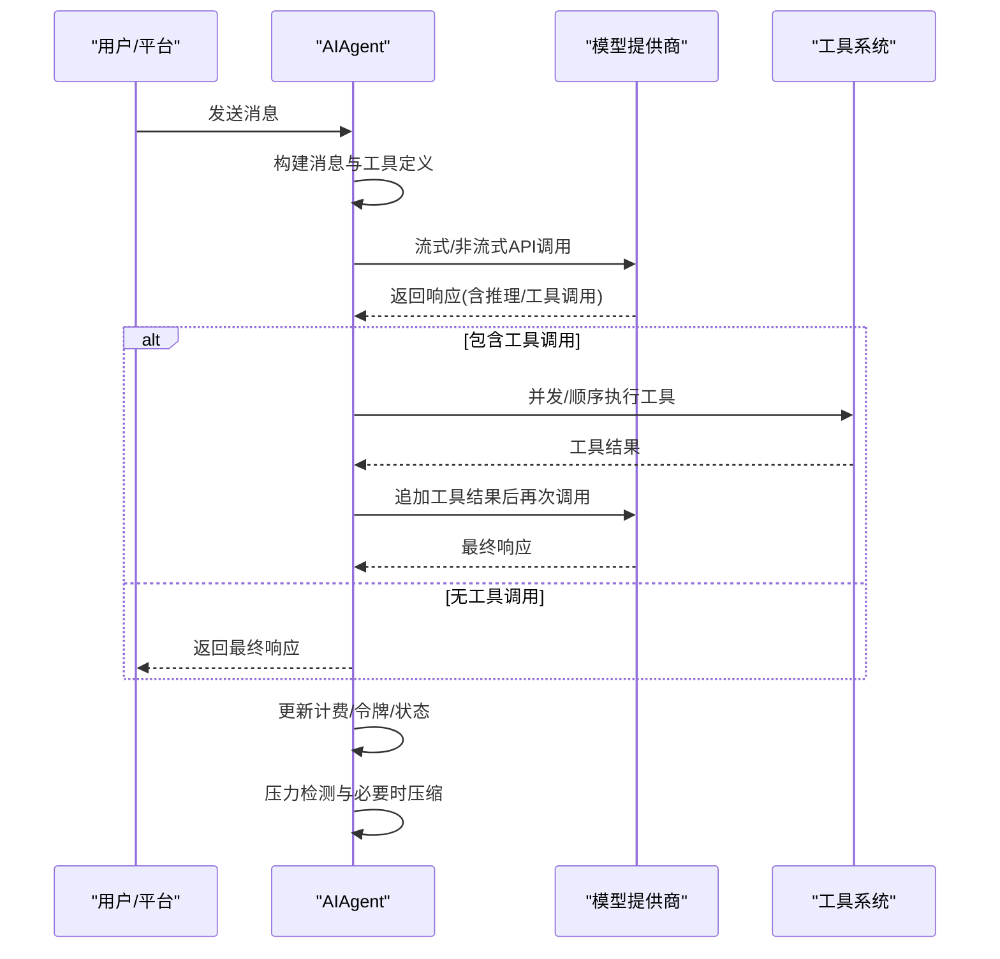
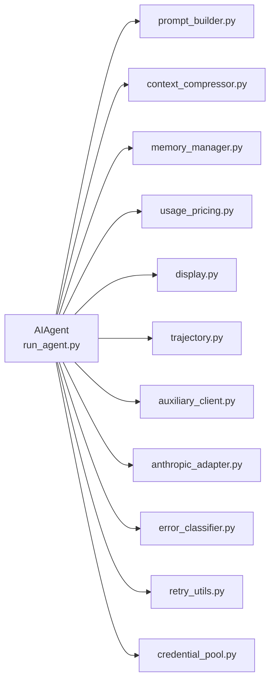

# 代理系统

<cite>
**本文引用的文件**
- [run_agent.py](file://run_agent.py)
- [AGENTS.md](file://AGENTS.md)
- [agent/__init__.py](file://agent/__init__.py)
- [agent/memory_manager.py](file://agent/memory_manager.py)
- [agent/retry_utils.py](file://agent/retry_utils.py)
- [agent/error_classifier.py](file://agent/error_classifier.py)
- [agent/prompt_builder.py](file://agent/prompt_builder.py)
- [agent/model_metadata.py](file://agent/model_metadata.py)
- [agent/context_compressor.py](file://agent/context_compressor.py)
- [agent/subdirectory_hints.py](file://agent/subdirectory_hints.py)
- [agent/prompt_caching.py](file://agent/prompt_caching.py)
- [agent/usage_pricing.py](file://agent/usage_pricing.py)
- [agent/display.py](file://agent/display.py)
- [agent/trajectory.py](file://agent/trajectory.py)
- [agent/smart_model_routing.py](file://agent/smart_model_routing.py)
- [agent/credential_pool.py](file://agent/credential_pool.py)
- [agent/rate_limit_tracker.py](file://agent/rate_limit_tracker.py)
- [agent/redact.py](file://agent/redact.py)
- [agent/title_generator.py](file://agent/title_generator.py)
- [agent/skill_utils.py](file://agent/skill_utils.py)
- [agent/skill_commands.py](file://agent/skill_commands.py)
- [agent/insights.py](file://agent/insights.py)
- [agent/manual_compression_feedback.py](file://agent/manual_compression_feedback.py)
- [agent/memory_provider.py](file://agent/memory_provider.py)
- [agent/models_dev.py](file://agent/models_dev.py)
- [agent/auxiliary_client.py](file://agent/auxiliary_client.py)
- [agent/anthropic_adapter.py](file://agent/anthropic_adapter.py)
- [agent/context_engine.py](file://agent/context_engine.py)
- [agent/context_references.py](file://agent/context_references.py)
- [agent/copilot_acp_client.py](file://agent/copilot_acp_client.py)
- [agent/error_classifier.py](file://agent/error_classifier.py)
- [agent/insights.py](file://agent/insights.py)
- [agent/smart_model_routing.py](file://agent/smart_model_routing.py)
- [agent/subdirectory_hints.py](file://agent/subdirectory_hints.py)
- [agent/title_generator.py](file://agent/title_generator.py)
- [agent/trajectory.py](file://agent/trajectory.py)
- [agent/usage_pricing.py](file://agent/usage_pricing.py)
- [agent/display.py](file://agent/display.py)
- [agent/memory_manager.py](file://agent/memory_manager.py)
- [agent/memory_provider.py](file://agent/memory_provider.py)
- [agent/models_dev.py](file://agent/models_dev.py)
- [agent/prompt_builder.py](file://agent/prompt_builder.py)
- [agent/prompt_caching.py](file://agent/prompt_caching.py)
- [agent/retry_utils.py](file://agent/retry_utils.py)
- [agent/skill_commands.py](file://agent/skill_commands.py)
- [agent/skill_utils.py](file://agent/skill_utils.py)
- [agent/subdirectory_hints.py](file://agent/subdirectory_hints.py)
- [agent/title_generator.py](file://agent/title_generator.py)
- [agent/trajectory.py](file://agent/trajectory.py)
- [agent/usage_pricing.py](file://agent/usage_pricing.py)
- [agent/display.py](file://agent/display.py)
- [agent/memory_manager.py](file://agent/memory_manager.py)
- [agent/memory_provider.py](file://agent/memory_provider.py)
- [agent/models_dev.py](file://agent/models_dev.py)
- [agent/prompt_builder.py](file://agent/prompt_builder.py)
- [agent/prompt_caching.py](file://agent/prompt_caching.py)
- [agent/retry_utils.py](file://agent/retry_utils.py)
- [agent/skill_commands.py](file://agent/skill_commands.py)
- [agent/skill_utils.py](file://agent/skill_utils.py)
- [agent/subdirectory_hints.py](file://agent/subdirectory_hints.py)
- [agent/title_generator.py](file://agent/title_generator.py)
- [agent/trajectory.py](file://agent/trajectory.py)
- [agent/usage_pricing.py](file://agent/usage_pricing.py)
- [agent/display.py](file://agent/display.py)
- [agent/memory_manager.py](file://agent/memory_manager.py)
- [agent/memory_provider.py](file://agent/memory_provider.py)
- [agent/models_dev.py](file://agent/models_dev.py)
- [agent/prompt_builder.py](file://agent/prompt_builder.py)
- [agent/prompt_caching.py](file://agent/prompt_caching.py)
- [agent/retry_utils.py](file://agent/retry_utils.py)
- [agent/skill_commands.py](file://agent/skill_commands.py)
- [agent/skill_utils.py](file://agent/skill_utils.py)
- [agent/subdirectory_hints.py](file://agent/subdirectory_hints.py)
- [agent/title_generator.py](file://agent/title_generator.py)
- [agent/trajectory.py](file://agent/trajectory.py)
- [agent/usage_pricing.py](file://agent/usage_pricing.py)
- [agent/display.py](file://agent/display.py)
- [agent/memory_manager.py](file://agent/memory_manager.py)
- [agent/memory_provider.py](file://agent/memory_provider.py)
- [agent/models_dev.py](file://agent/models_dev.py)
- [agent/prompt_builder.py](file://agent/prompt_builder.py)
- [agent/prompt_caching.py](file://agent/prompt_caching.py)
- [agent/retry_utils.py](file://agent/retry_utils.py)
- [agent/skill_commands.py](file://agent/skill_commands.py)
- [agent/skill_utils.py](file://agent/skill_utils.py)
- [agent/subdirectory_hints.py](file://agent/subdirectory_hints.py)
- [agent/title_generator.py](file://agent/title_generator.py)
- [agent/trajectory.py](file://agent/trajectory.py)
- [agent/usage_pricing.py](file://agent/usage_pricing.py)
- [agent/display.py](file://agent/display.py)
- [agent/memory_manager.py](file://agent/memory_manager.py)
- [agent/memory_provider.py](file://agent/memory_provider.py)
- [agent/models_dev.py](file://agent/models_dev.py)
- [agent/prompt_builder.py](file://agent/prompt_builder.py)
- [agent/prompt_caching.py](file://agent/prompt_caching.py)
- [agent/retry_utils.py](file://agent/retry_utils.py)
- [agent/skill_commands.py](file://agent/skill_commands.py)
- [agent/skill_utils.py](file://agent/skill_utils.py)
- [agent/subdirectory_hints.py](file://agent/subdirectory_hints.py)
- [agent/title_generator.py](file://agent/title_generator.py)
- [agent/trajectory.py](file://agent/trajectory.py)
- [agent/usage_pricing.py](file://agent/usage_pricing.py)
- [agent/display.py](file://agent/display.py)
- [agent/memory_manager.py](file://agent/memory_manager.py)
- [agent/memory_provider.py](file://agent/memory_provider.py)
- [agent/models_dev.py](file://agent/models_dev.py)
- [agent/prompt_builder.py](file://agent/prompt_builder.py)
- [agent/prompt_caching.py](file://agent/prompt_caching.py)
- [agent/retry_utils.py](file://agent/retry_utils.py)
- [agent/skill_commands.py](file://agent/skill_commands.py)
- [agent/skill_utils.py](file://agent/skill_utils.py......)
</cite>

## 目录
1. [简介](#简介)
2. [项目结构](#项目结构)
3. [核心组件](#核心组件)
4. [架构总览](#架构总览)
5. [详细组件分析](#详细组件分析)
6. [依赖分析](#依赖分析)
7. [性能考虑](#性能考虑)
8. [故障排查指南](#故障排查指南)
9. [结论](#结论)
10. [附录](#附录)

## 简介
本文件面向Hermes Agent的代理系统，聚焦于AIAgent类的核心架构、对话循环机制与工具调用流程。文档从初始化、配置参数、回调函数与状态管理入手，深入解析迭代预算系统、中断机制与子代理委托机制；并覆盖错误处理、重试策略与故障转移，以及与工具系统、记忆系统、上下文压缩系统的集成关系。最后提供性能优化建议与最佳实践。

## 项目结构
Hermes Agent将运行时主逻辑集中在run_agent.py中的AIAgent类，并将代理内部功能模块化拆分至agent/包中，形成清晰的职责边界：提示词构建、上下文压缩、模型元数据、错误分类与重试、显示与轨迹、记忆与技能等。工具系统通过model_tools.py统一注册与调度，gateway与CLI层负责会话与平台接入。

图表来源
- [run_agent.py](file://run_agent.py)
- [agent/memory_manager.py](file://agent/memory_manager.py)
- [agent/context_compressor.py](file://agent/context_compressor.py)
- [agent/prompt_builder.py](file://agent/prompt_builder.py)
- [agent/usage_pricing.py](file://agent/usage_pricing.py)
- [agent/display.py](file://agent/display.py)
- [agent/trajectory.py](file://agent/trajectory.py)
- [agent/auxiliary_client.py](file://agent/auxiliary_client.py)

章节来源
- [run_agent.py](file://run_agent.py)
- [agent/__init__.py](file://agent/__init__.py)

## 核心组件
- AIAgent类：代理运行时主体，负责初始化、对话循环、工具执行、上下文压缩、错误恢复、计费统计与持久化。
- 工具系统：通过model_tools统一发现、校验与调用工具，支持并发批处理与路径隔离。
- 记忆系统：内置memory_tool与可插拔memory_provider，支持会话内记忆写入与外部存储桥接。
- 上下文压缩：基于配置选择内置或插件式上下文引擎，在接近阈值时自动压缩以维持长对话稳定性。
- 提示词与推理：prompt_builder组装系统提示，prompt_caching与reasoning配置提升推理质量与成本控制。
- 错误分类与重试：error_classifier对错误进行结构化分类，结合retry_utils与credential_pool实现智能重试与凭证轮换。
- 显示与轨迹：display提供进度与动画，trajectory负责会话轨迹保存，便于复盘与训练数据生成。

章节来源
- [run_agent.py](file://run_agent.py)
- [agent/prompt_builder.py](file://agent/prompt_builder.py)
- [agent/context_compressor.py](file://agent/context_compressor.py)
- [agent/memory_manager.py](file://agent/memory_manager.py)
- [agent/usage_pricing.py](file://agent/usage_pricing.py)
- [agent/display.py](file://agent/display.py)
- [agent/trajectory.py](file://agent/trajectory.py)

## 架构总览
AIAgent在初始化阶段完成客户端构建、工具加载、记忆与上下文引擎装配、会话数据库连接与日志目录准备。对话循环采用“模型请求—工具调用—消息追加”的迭代模式，结合迭代预算、上下文压力检测与压缩、错误分类与重试、以及可中断的流式API调用，确保在多变的外部环境与复杂任务场景下的鲁棒性与效率。

图表来源
- [run_agent.py](file://run_agent.py)

## 详细组件分析

### AIAgent类与初始化
- 初始化要点
  - 客户端构建：根据api_mode与provider自动选择OpenAI或Anthropic客户端，支持Copilot ACP、默认头部注入与细粒度工具流式（如OpenRouter+Claude）。
  - 工具加载：按enabled/disabled_toolsets过滤工具集合，检查依赖并打印可用工具列表。
  - 记忆与上下文：加载内置memory_tool与可选memory_provider插件；初始化上下文压缩器（内置或插件），并设置压缩阈值、目标比例与保护窗口。
  - 会话与持久化：生成session_id，准备JSON日志与SQLite会话库；记录token用量、缓存命中、计费估算与活动状态。
  - 回调与显示：安装安全stdio包装，配置各类回调（工具进度、思考、推理、澄清、步进、流式增量、状态等）。
  - 预算与限制：初始化迭代预算、最大线程数、破坏性命令检测、路径隔离工具集等。

- 关键属性与状态
  - 迭代预算：IterationBudget，父子代理共享但独立计数，支持退款（execute_code等）。
  - 中断机制：线程安全的中断标志与活跃子代理跟踪，支持跨线程传播。
  - 提示词缓存：针对Claude+OpenRouter或原生Anthropic启用prompt caching。
  - 账单与用量：会话级累计prompt/completion/total tokens、缓存读写、推理tokens与估算费用。

章节来源
- [run_agent.py](file://run_agent.py)
- [agent/auxiliary_client.py](file://agent/auxiliary_client.py)
- [agent/anthropic_adapter.py](file://agent/anthropic_adapter.py)
- [agent/prompt_caching.py](file://agent/prompt_caching.py)
- [agent/usage_pricing.py](file://agent/usage_pricing.py)

### 对话循环机制
- 主循环流程
  - 消息构建：预填充、系统提示、上下文压缩后的消息序列。
  - API调用：优先流式调用，支持中断；失败时进行错误分类与恢复（凭证刷新、轮换、回退链）。
  - 推理提取：从结构化reasoning字段或<think>标签中抽取推理文本，触发推理回调。
  - 工具调用：根据工具批是否可并发执行，分别走顺序或线程池并发路径；执行后追加工具结果消息。
  - 结束条件：当finish_reason为stop且无工具调用，或达到迭代预算上限时退出。

- 压力与压缩
  - 压力检测：基于近似token估算与阈值比较，85%/95%两级警告，避免过早中断。
  - 自动压缩：接近阈值时触发压缩，保留关键信息并重建系统提示；必要时分割会话并更新标题。

- 中断与清理
  - 中断：后台线程发起API调用，主线程轮询中断标志，立即关闭工作客户端以避免共享客户端被污染。
  - 清理：VM/Browser资源回收，持久化会话与数据库写入，清理flush标记与临时消息。

章节来源
- [run_agent.py](file://run_agent.py)
- [agent/context_compressor.py](file://agent/context_compressor.py)

### 工具调用流程
- 批处理并发策略
  - 不可并发工具：clarify等交互型工具强制串行。
  - 只读安全工具：如文件读取、搜索、视觉分析等可并发。
  - 路径隔离工具：read_file/write_file/patch按绝对路径去重，避免冲突。
  - 最大并发线程：受_MAX_TOOL_WORKERS限制，避免资源争用。

- 工具执行
  - 代理级工具：todo、session_search、memory、memory_provider工具由AIAgent直接处理。
  - 注册工具：其余工具通过model_tools.handle_function_call分发，返回JSON字符串结果。
  - 结果注入：将工具结果转换为tool消息并追加到对话历史。

章节来源
- [run_agent.py](file://run_agent.py)

### 迭代预算系统、中断机制与子代理委托
- 迭代预算
  - 共享预算：父代理与所有子代理共享同一预算实例，api_call_count递增；子代理独立预算用于委托深度控制。
  - 退款机制：execute_code等不消耗实际迭代次数，可通过refund回退一次。

- 中断机制
  - 请求级中断：后台线程执行API调用，主线程定期检查中断标志，若触发则关闭工作客户端并抛出中断异常。
  - 子代理传播：活跃子代理列表与深度计数，支持跨层级中断传播与资源清理。

- 子代理委托
  - 委托工具：delegate_task创建子AIAgent，继承模型、工具与上下文，通过回调汇总动作摘要。
  - 状态隔离：子代理拥有独立迭代预算与会话ID，避免与父代理混淆。

章节来源
- [run_agent.py](file://run_agent.py)

### 错误处理、重试策略与故障转移
- 错误分类
  - 使用error_classifier对API错误进行结构化分类（如限流、账单、认证失败、上游超时等），决定后续恢复策略。
- 重试与回退
  - 指数抖动退避：jittered_backoff控制重试间隔，避免雪崩。
  - 凭证池轮换：按错误类型尝试刷新当前凭证或轮换到下一个凭证条目，支持一次性429重试与连续失败轮换。
  - 回退链：当主模型不可用或输出异常时，按顺序切换到备用模型/提供商。
- 特殊处理
  - Codex Responses：处理流式回填、终端事件与缺失completed的兼容路径。
  - 思维预算耗尽：检测模型将全部输出token用于推理而无可见响应的情况，给出明确提示并返回部分结果。
  - Unicode/编码问题：自动剥离代理字符或ASCII净化，最多两次净化后仍失败则报错。

章节来源
- [run_agent.py](file://run_agent.py)
- [agent/error_classifier.py](file://agent/error_classifier.py)
- [agent/retry_utils.py](file://agent/retry_utils.py)
- [agent/credential_pool.py](file://agent/credential_pool.py)

### 与工具系统、记忆系统、上下文压缩系统的集成
- 工具系统
  - 统一schema收集与可用性检查，按toolset过滤，支持动态跨工具引用与post-processing。
- 记忆系统
  - 内置memory_tool与可插拔memory_provider双轨：内置用于会话内记忆，插件用于外部持久化；写入时桥接通知插件。
- 上下文压缩
  - 在压缩前触发内存flush，确保即将丢失的信息先落盘；压缩后重建系统提示并更新会话标题与数据库索引。

章节来源
- [run_agent.py](file://run_agent.py)
- [agent/memory_manager.py](file://agent/memory_manager.py)
- [agent/context_compressor.py](file://agent/context_compressor.py)

### 代码示例（路径指引）
以下示例均以“代码片段路径”形式给出，便于快速定位实现位置：

- 创建与配置AIAgent（含工具过滤、回调、推理配置）
  - [AIAgent.__init__ 参数与初始化流程](file://run_agent.py)
- 启动一次完整对话（返回最终响应与消息）
  - [AIAgent.run_conversation 主循环与工具调用](file://run_agent.py)
- 执行工具调用（并发/顺序）
  - [AIAgent._execute_tool_calls 并发/顺序入口](file://run_agent.py)
  - [AIAgent._invoke_tool 单工具调用](file://run_agent.py)
- 触发上下文压缩
  - [AIAgent._compress_context 压缩与会话分割](file://run_agent.py)
- 记忆flush与写入
  - [AIAgent.flush_memories 记忆落盘](file://run_agent.py)
- 错误分类与凭证轮换
  - [AIAgent._recover_with_credential_pool 凭证恢复](file://run_agent.py)
  - [AIAgent._try_activate_fallback 回退链切换](file://run_agent.py)
- 提示词构建与推理配置
  - [agent/prompt_builder.py 系统提示组装](file://agent/prompt_builder.py)
  - [agent/prompt_caching.py 提示词缓存](file://agent/prompt_caching.py)
- 用量与计费统计
  - [agent/usage_pricing.py 用量归一化与费用估算](file://agent/usage_pricing.py)

章节来源
- [run_agent.py](file://run_agent.py)
- [agent/prompt_builder.py](file://agent/prompt_builder.py)
- [agent/prompt_caching.py](file://agent/prompt_caching.py)
- [agent/usage_pricing.py](file://agent/usage_pricing.py)

## 依赖分析
- 组件耦合
  - AIAgent与agent/*模块强耦合：提示词、压缩、记忆、定价、显示、轨迹等均通过模块化封装降低耦合。
  - 工具系统通过model_tools统一调度，避免AIAgent直接依赖具体工具实现。
- 外部依赖
  - OpenAI/Anthropic SDK、HTTP客户端、SQLite、环境变量与配置文件。
- 循环依赖
  - 通过模块导入与延迟初始化避免循环依赖；工具注册在导入时完成，AIAgent仅在需要时访问。

图表来源
- [run_agent.py](file://run_agent.py)
- [agent/prompt_builder.py](file://agent/prompt_builder.py)
- [agent/context_compressor.py](file://agent/context_compressor.py)
- [agent/memory_manager.py](file://agent/memory_manager.py)
- [agent/usage_pricing.py](file://agent/usage_pricing.py)
- [agent/display.py](file://agent/display.py)
- [agent/trajectory.py](file://agent/trajectory.py)
- [agent/auxiliary_client.py](file://agent/auxiliary_client.py)
- [agent/anthropic_adapter.py](file://agent/anthropic_adapter.py)
- [agent/error_classifier.py](file://agent/error_classifier.py)
- [agent/retry_utils.py](file://agent/retry_utils.py)
- [agent/credential_pool.py](file://agent/credential_pool.py)

## 性能考虑
- 流式优先：即使无消费者也优先使用流式API，以便健康检查与更快的失败反馈。
- 并发工具批：合理利用只读与路径隔离工具的并发能力，同时限制最大并发线程数。
- 提示词缓存：对Claude+OpenRouter或原生Anthropic启用prompt caching，显著降低输入token成本。
- 上下文压缩：在接近阈值前主动压缩，避免频繁触发压缩导致的重复计算与会话分裂。
- 用量与缓存：关注缓存命中率与写入成本，结合reasoning配置平衡质量与成本。
- 客户端生命周期：避免共享客户端被意外关闭，必要时重建请求级客户端并及时关闭。

## 故障排查指南
- 常见问题
  - 无效响应/空输出：检查回退链激活、错误分类与重试策略；必要时降低reasoning努力或提高max_tokens。
  - 思维预算耗尽：降低reasoning努力或增加输出token上限。
  - 编码/Unicode错误：启用消息净化（代理字符剥离与ASCII净化），最多两次净化。
  - 中断与悬挂：确认中断标志正确传播，工作客户端被正确关闭；检查流式回调与消费者状态。
- 调试手段
  - 详尽日志：verbose模式开启第三方库日志抑制，聚焦关键路径。
  - 请求转储：在特定环境下导出请求体与错误详情，辅助定位上游问题。
  - 会话持久化：确保消息与数据库写入成功，避免数据丢失。

章节来源
- [run_agent.py](file://run_agent.py)

## 结论
AIAgent通过模块化的内部组件、严谨的错误分类与重试策略、灵活的工具并发执行、以及完善的上下文与记忆集成，实现了在复杂外部环境与多样化任务场景下的高鲁棒性与高效率。遵循本文的最佳实践与性能建议，可在保证稳定性的同时最大化吞吐与成本效益。

## 附录
- 开发与测试
  - 项目提供大量测试用例，建议在修改前运行全量测试套件，确保回归稳定。
- 配置与扩展
  - 支持通过config.yaml与环境变量调整模型、工具、记忆、压缩与推理行为；插件系统允许扩展上下文引擎与记忆提供者。