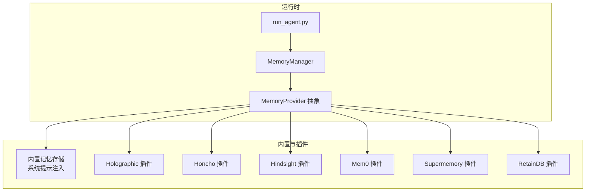
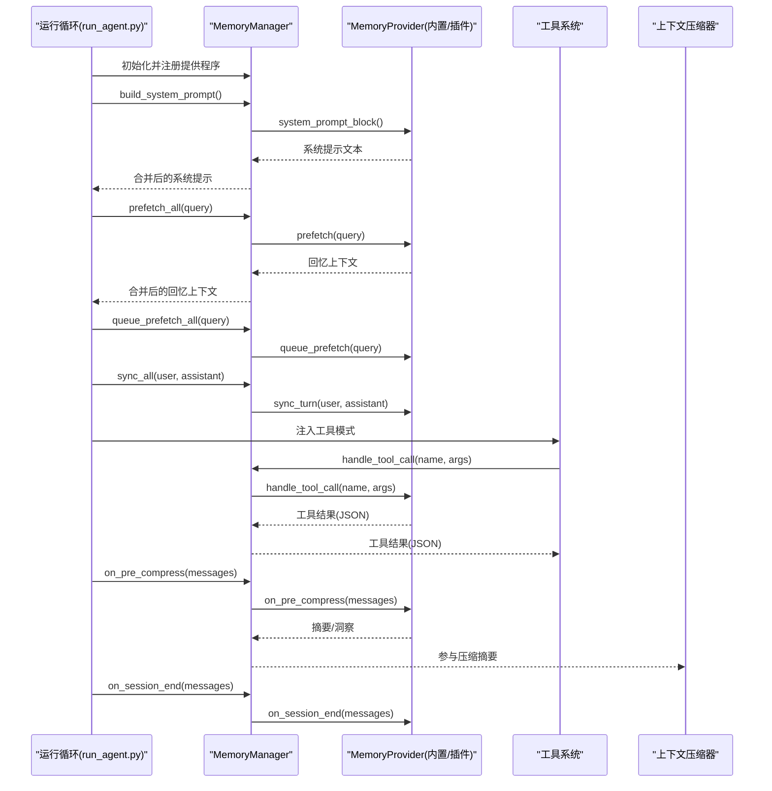
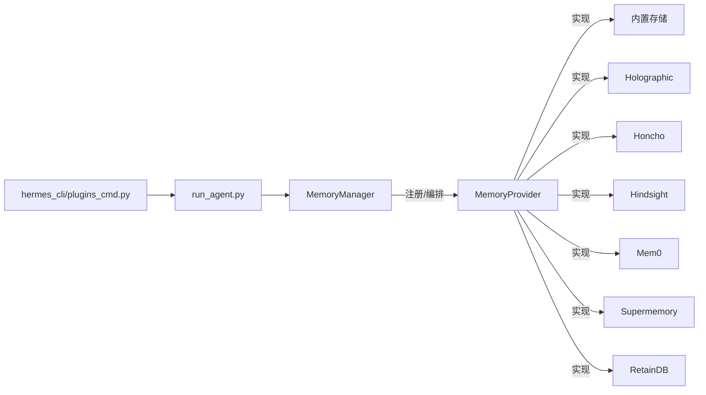

# 内存管理

<cite>
**本文引用的文件**
- [agent/memory_manager.py](file://agent/memory_manager.py)
- [agent/memory_provider.py](file://agent/memory_provider.py)
- [plugins/memory/holographic/__init__.py](file://plugins/memory/holographic/__init__.py)
- [plugins/memory/honcho/__init__.py](file://plugins/memory/honcho/__init__.py)
- [plugins/memory/hindsight/__init__.py](file://plugins/memory/hindsight/__init__.py)
- [plugins/memory/mem0/__init__.py](file://plugins/memory/mem0/__init__.py)
- [plugins/memory/supermemory/__init__.py](file://plugins/memory/supermemory/__init__.py)
- [plugins/memory/retaindb/__init__.py](file://plugins/memory/retaindb/__init__.py)
- [run_agent.py](file://run_agent.py)
- [hermes_cli/plugins_cmd.py](file://hermes_cli/plugins_cmd.py)
- [tests/agent/test_memory_provider.py](file://tests/agent/test_memory_provider.py)
- [tests/plugins/test_retaindb_plugin.py](file://tests/plugins/test_retaindb_plugin.py)
- [tests/tools/test_memory_tool.py](file://tests/tools/test_memory_tool.py)
- [website/docs/user-guide/features/memory.md](file://website/docs/user-guide/features/memory.md)
</cite>

## 目录
1. [简介](#简介)
2. [项目结构](#项目结构)
3. [核心组件](#核心组件)
4. [架构总览](#架构总览)
5. [详细组件分析](#详细组件分析)
6. [依赖关系分析](#依赖关系分析)
7. [性能考量](#性能考量)
8. [故障排查指南](#故障排查指南)
9. [结论](#结论)
10. [附录](#附录)

## 简介
本文件系统性阐述 Hermes Agent 的记忆管理系统：如何构建记忆块、在上下文中注入与检索、以及通过插件化的记忆提供程序实现持久化与检索。文档覆盖内置与外部插件（Holographic、Honcho、Hindsight、Mem0、Supermemory、RetainDB）的架构、生命周期钩子、检索算法、去重与压缩策略，并说明与上下文压缩器、工具系统、会话管理的集成方式，同时给出性能优化与隐私保护建议。

## 项目结构
- 记忆管理核心位于 agent/ 目录：
  - MemoryManager：统一编排内置与最多一个外部记忆提供程序，负责系统提示拼装、预取、同步、工具路由与生命周期钩子。
  - MemoryProvider：抽象基类，定义提供程序的标准接口与可选钩子。
- 外部记忆提供程序位于 plugins/memory/ 下，每个插件实现 MemoryProvider 接口并注册到系统。
- 运行时集成点：
  - run_agent.py：初始化 MemoryManager，注册提供程序，注入系统提示与工具，驱动每轮的预取与同步。
  - hermes_cli/plugins_cmd.py：提供选择与配置记忆提供程序的交互入口。

图示来源
- [agent/memory_manager.py:72-363](file://agent/memory_manager.py#L72-L363)
- [agent/memory_provider.py:42-232](file://agent/memory_provider.py#L42-L232)
- [plugins/memory/holographic/__init__.py:114-408](file://plugins/memory/holographic/__init__.py#L114-L408)
- [plugins/memory/honcho/__init__.py:119-723](file://plugins/memory/honcho/__init__.py#L119-L723)
- [plugins/memory/hindsight/__init__.py:185-884](file://plugins/memory/hindsight/__init__.py#L185-L884)
- [plugins/memory/mem0/__init__.py:119-374](file://plugins/memory/mem0/__init__.py#L119-L374)
- [plugins/memory/supermemory/__init__.py:420-792](file://plugins/memory/supermemory/__init__.py#L420-L792)
- [plugins/memory/retaindb/__init__.py:452-767](file://plugins/memory/retaindb/__init__.py#L452-L767)

章节来源
- [agent/memory_manager.py:1-363](file://agent/memory_manager.py#L1-L363)
- [agent/memory_provider.py:1-232](file://agent/memory_provider.py#L1-L232)
- [run_agent.py:1163-1185](file://run_agent.py#L1163-L1185)
- [hermes_cli/plugins_cmd.py:666-710](file://hermes_cli/plugins_cmd.py#L666-L710)

## 核心组件
- MemoryManager
  - 职责：注册与编排多个 MemoryProvider；收集系统提示、执行预取、同步回合、路由工具调用、触发生命周期钩子；保证单个外部提供程序限制与非致命错误隔离。
  - 关键方法：add_provider、build_system_prompt、prefetch_all、queue_prefetch_all、sync_all、get_all_tool_schemas、handle_tool_call、on_* 钩子等。
- MemoryProvider（抽象）
  - 职责：定义提供程序生命周期与可选钩子（initialize、system_prompt_block、prefetch、queue_prefetch、sync_turn、get_tool_schemas、handle_tool_call、shutdown、on_turn_start、on_session_end、on_pre_compress、on_memory_write、on_delegation 等）。
- 内置记忆存储
  - 作为第一个提供程序始终激活，负责系统提示注入与容量管理，遵循“冻结快照模式”在会话开始时固定注入，避免中间变更影响模型前缀缓存。

章节来源
- [agent/memory_manager.py:72-363](file://agent/memory_manager.py#L72-L363)
- [agent/memory_provider.py:42-232](file://agent/memory_provider.py#L42-L232)
- [website/docs/user-guide/features/memory.md:41-143](file://website/docs/user-guide/features/memory.md#L41-L143)

## 架构总览
下图展示了 MemoryManager 如何在运行期与各提供程序协作，以及与上下文压缩器、工具系统、会话管理的关系。

图示来源
- [agent/memory_manager.py:146-332](file://agent/memory_manager.py#L146-L332)
- [run_agent.py:1163-1185](file://run_agent.py#L1163-L1185)

章节来源
- [agent/memory_manager.py:146-332](file://agent/memory_manager.py#L146-L332)
- [run_agent.py:1163-1185](file://run_agent.py#L1163-L1185)

## 详细组件分析

### MemoryManager：统一编排与上下文注入
- 上下文围栏与注入
  - 提供 sanitize_context 与 build_memory_context_block，确保从提供程序返回的回忆内容被安全地包裹在围栏标签中，防止模型将回忆误认为用户输入。
- 生命周期与并发
  - 支持 on_turn_start、on_session_end、on_pre_compress、on_memory_write、on_delegation 等钩子，按提供程序顺序调用，异常不阻断其他提供程序。
- 工具路由
  - 维护 tool_name → provider 映射，处理工具调用并统一错误包装。

章节来源
- [agent/memory_manager.py:49-70](file://agent/memory_manager.py#L49-L70)
- [agent/memory_manager.py:167-332](file://agent/memory_manager.py#L167-L332)
- [tests/agent/test_memory_provider.py:670-697](file://tests/agent/test_memory_provider.py#L670-L697)

### MemoryProvider 抽象：插件契约
- 必需接口：name、is_available、initialize、get_tool_schemas、handle_tool_call（可选：prefetch、queue_prefetch、sync_turn、system_prompt_block、shutdown、on_turn_start、on_session_end、on_pre_compress、on_memory_write、on_delegation）。
- 可选钩子：on_pre_compress 用于在压缩前抽取关键洞察；on_memory_write 用于镜像内置写入；on_delegation 用于父代理观察子代理工作。

章节来源
- [agent/memory_provider.py:42-232](file://agent/memory_provider.py#L42-L232)

### 内置记忆存储：系统提示注入与容量管理
- 特性：会话开始时冻结快照，后续不随内存增删变化；严格字符上限与容量提示；支持 add/replace/remove 动作；内置注入到系统提示。
- 容量与最佳实践：接近上限时建议合并条目，避免频繁超出。

章节来源
- [website/docs/user-guide/features/memory.md:41-143](file://website/docs/user-guide/features/memory.md#L41-L143)
- [tests/tools/test_memory_tool.py:102-199](file://tests/tools/test_memory_tool.py#L102-L199)

### Holographic 记忆插件
- 结构化事实存储：实体解析、信任评分、HRR 向量检索；支持 add/search/probe/reason/contradict/update/remove/list 等工具。
- 自动提取：会话结束时可自动抽取偏好与决策类内容。
- 镜像写入：内置 add 会同步为 user/general 类别事实。

章节来源
- [plugins/memory/holographic/__init__.py:114-408](file://plugins/memory/holographic/__init__.py#L114-L408)
- [plugins/memory/holographic/__init__.py:226-355](file://plugins/memory/holographic/__init__.py#L226-L355)

### Honcho 记忆插件
- 用户建模与对话式问答：支持 profile/search/context/conclude 工具；支持“上下文/工具/混合”三种注入模式；成本感知的轮次节流与令牌预算截断。
- 延迟会话初始化：工具模式下可延迟创建会话以节省资源。
- 镜像写入：内置 user profile 写入会映射为结论。

章节来源
- [plugins/memory/honcho/__init__.py:119-723](file://plugins/memory/honcho/__init__.py#L119-L723)
- [plugins/memory/honcho/__init__.py:604-621](file://plugins/memory/honcho/__init__.py#L604-L621)

### Hindsight 记忆插件
- 长期记忆与知识图谱：云/本地双模式；多策略检索（语义、关键词、实体图遍历、重排序）；反射合成。
- 异步保留：会话回合批量异步保留，支持标签过滤与预算控制；自动保留与自动检索开关。
- 事件循环复用：为异步调用维护长驻事件循环线程，避免泄漏。

章节来源
- [plugins/memory/hindsight/__init__.py:185-884](file://plugins/memory/hindsight/__init__.py#L185-L884)
- [plugins/memory/hindsight/__init__.py:672-714](file://plugins/memory/hindsight/__init__.py#L672-L714)

### Mem0 记忆插件
- 平台 API：服务端事实抽取、语义检索与重排序；自动去重；电路断路器防抖。
- 会话保留：非阻塞异步保留；失败自动重试与冷却。

章节来源
- [plugins/memory/mem0/__init__.py:119-374](file://plugins/memory/mem0/__init__.py#L119-L374)
- [plugins/memory/mem0/__init__.py:272-296](file://plugins/memory/mem0/__init__.py#L272-L296)

### Supermemory 记忆插件
- 多容器标签：支持主容器与自定义容器；工具参数可指定容器标签；实体上下文可裁剪。
- 去重与格式化：预取上下文时对静态/动态/搜索结果进行去重与格式化；会话结束批量摄入。
- 写入线程：独立线程异步写入，避免阻塞主流程。

章节来源
- [plugins/memory/supermemory/__init__.py:420-792](file://plugins/memory/supermemory/__init__.py#L420-L792)
- [plugins/memory/supermemory/__init__.py:189-251](file://plugins/memory/supermemory/__init__.py#L189-L251)

### RetainDB 记忆插件
- 写入队列：SQLite 持久化后台写队列，崩溃后重启重放；异步会话摄入。
- 预取组合：上下文查询、用户综合、代理自我模型三路预取，消费时去重叠加。
- 文件工具：上传/列出/读取/摄入/删除共享文件，便于跨会话知识保留。

章节来源
- [plugins/memory/retaindb/__init__.py:452-767](file://plugins/memory/retaindb/__init__.py#L452-L767)
- [tests/plugins/test_retaindb_plugin.py:751-776](file://tests/plugins/test_retaindb_plugin.py#L751-L776)

## 依赖关系分析
- 单一外部提供程序限制：MemoryManager 仅允许一个非内置提供程序，避免工具模式冲突与后端冲突。
- 提供程序注册与发现：通过 hermes_cli/plugins_cmd.py 提供选择界面；run_agent.py 在启动时根据配置加载并初始化。
- 生命周期耦合：提供程序通过 MemoryManager 的钩子与运行循环解耦，异常隔离，顺序调用。

图示来源
- [agent/memory_manager.py:86-131](file://agent/memory_manager.py#L86-L131)
- [run_agent.py:1163-1185](file://run_agent.py#L1163-L1185)
- [hermes_cli/plugins_cmd.py:666-710](file://hermes_cli/plugins_cmd.py#L666-L710)

章节来源
- [agent/memory_manager.py:86-131](file://agent/memory_manager.py#L86-L131)
- [run_agent.py:1163-1185](file://run_agent.py#L1163-L1185)
- [hermes_cli/plugins_cmd.py:666-710](file://hermes_cli/plugins_cmd.py#L666-L710)

## 性能考量
- 预取与并发
  - 各提供程序普遍采用后台线程或事件循环执行检索/保留，避免阻塞主流程；MemoryManager 在每轮结束后统一 queue_prefetch_all，减少重复计算。
- 去重与压缩
  - 提供程序内部实现去重（如 RetainDB 的 overlay 去重、Supermemory 的三路去重），减少冗余信息进入上下文。
  - 上下文压缩器在达到阈值时进行压缩，MemoryManager 的 on_pre_compress 钩子可用于抽取关键洞察，提升压缩效果。
- 成本与节流
  - Honcho 支持注入频率与轮次节流；Hindsight 支持预算与最大输入长度控制；Mem0 使用电路断路器降低失败风暴。
- I/O 与持久化
  - RetainDB 使用 SQLite 写队列保障崩溃恢复；Hindsight 使用长驻事件循环避免会话泄漏；Supermemory 使用独立线程异步写入。

章节来源
- [plugins/memory/honcho/__init__.py:477-523](file://plugins/memory/honcho/__init__.py#L477-L523)
- [plugins/memory/hindsight/__init__.py:80-85](file://plugins/memory/hindsight/__init__.py#L80-L85)
- [plugins/memory/mem0/__init__.py:180-202](file://plugins/memory/mem0/__init__.py#L180-L202)
- [plugins/memory/retaindb/__init__.py:330-408](file://plugins/memory/retaindb/__init__.py#L330-L408)
- [plugins/memory/supermemory/__init__.py:583-594](file://plugins/memory/supermemory/__init__.py#L583-L594)

## 故障排查指南
- 提供程序不可用
  - 检查 is_available 返回与配置可用性；查看日志中的初始化/网络错误。
- 工具调用失败
  - MemoryManager 对工具调用进行统一错误包装；检查 provider.handle_tool_call 是否抛出异常。
- 预取/同步失败
  - 各提供程序的 prefetch/sync_turn 默认为非致命错误；查看对应日志定位具体原因。
- 上下文注入问题
  - 确认围栏标签未被注入内容污染；使用 sanitize_context 与 build_memory_context_block 的测试用例验证行为。
- RetainDB 写队列
  - 若出现“待处理行”，检查 SQLite 数据库与队列线程状态；确认队列已正确重放。

章节来源
- [agent/memory_manager.py:238-257](file://agent/memory_manager.py#L238-L257)
- [tests/agent/test_memory_provider.py:670-697](file://tests/agent/test_memory_provider.py#L670-L697)
- [tests/plugins/test_retaindb_plugin.py:751-776](file://tests/plugins/test_retaindb_plugin.py#L751-L776)

## 结论
Hermes Agent 的记忆系统通过 MemoryManager 将内置与外部插件提供程序统一编排，结合严格的生命周期钩子与上下文围栏机制，实现了稳定、可扩展且高性能的记忆检索与持久化能力。不同插件在检索算法、去重策略与写入路径上各有侧重，用户可根据场景选择合适的提供程序，并通过配置与工具模式灵活控制成本与效果。

## 附录

### 记忆检索与会话记忆要点
- 短期记忆：每轮预取由提供程序返回，MemoryManager 统一注入；内置存储在会话开始冻结快照。
- 长期记忆：通过插件工具显式保留或自动保留；会话结束批量摄入；支持跨会话检索与合成。
- 跨会话知识保留：RetainDB/Supermemory/Hindsight/Mem0/Honcho/Holographic 均支持跨会话检索与结论/事实/记忆的持久化。

章节来源
- [agent/memory_manager.py:167-209](file://agent/memory_manager.py#L167-L209)
- [plugins/memory/honcho/__init__.py:622-635](file://plugins/memory/honcho/__init__.py#L622-L635)
- [plugins/memory/hindsight/__init__.py:715-773](file://plugins/memory/hindsight/__init__.py#L715-L773)
- [plugins/memory/mem0/__init__.py:272-296](file://plugins/memory/mem0/__init__.py#L272-L296)
- [plugins/memory/supermemory/__init__.py:595-616](file://plugins/memory/supermemory/__init__.py#L595-L616)
- [plugins/memory/retaindb/__init__.py:627-640](file://plugins/memory/retaindb/__init__.py#L627-L640)
- [plugins/memory/holographic/__init__.py:236-242](file://plugins/memory/holographic/__init__.py#L236-L242)

### 代码示例路径（创建/查询/更新）
- 创建事实（Holographic）
  - [plugins/memory/holographic/__init__.py:264-271](file://plugins/memory/holographic/__init__.py#L264-L271)
- 查询检索（Hindsight）
  - [plugins/memory/hindsight/__init__.py:686-705](file://plugins/memory/hindsight/__init__.py#L686-L705)
- 存储结论（Mem0）
  - [plugins/memory/mem0/__init__.py:350-356](file://plugins/memory/mem0/__init__.py#L350-L356)
- 会话摄入（Supermemory）
  - [plugins/memory/supermemory/__init__.py:611-616](file://plugins/memory/supermemory/__init__.py#L611-L616)
- 写队列（RetainDB）
  - [plugins/memory/retaindb/__init__.py:632-639](file://plugins/memory/retaindb/__init__.py#L632-L639)