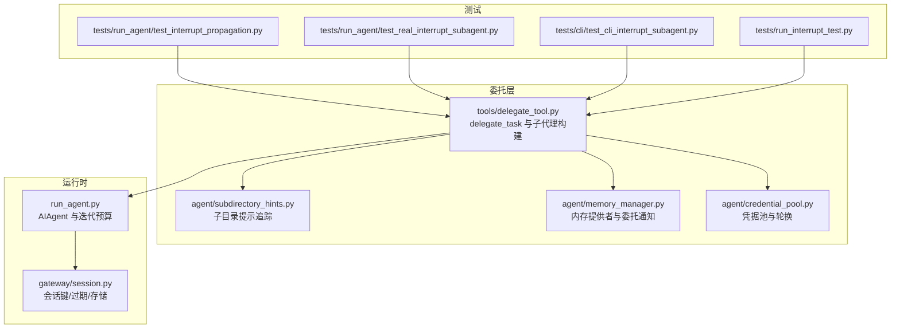
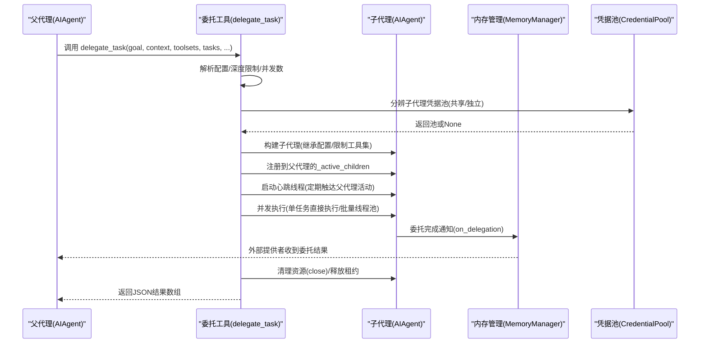
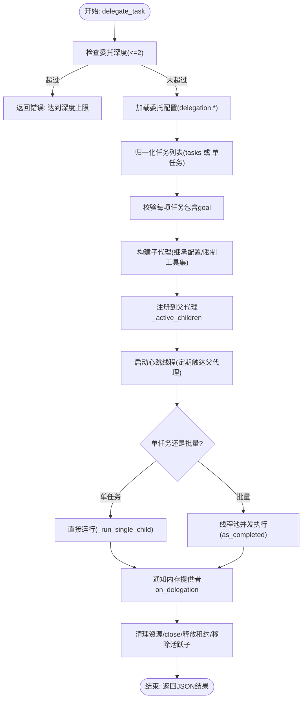
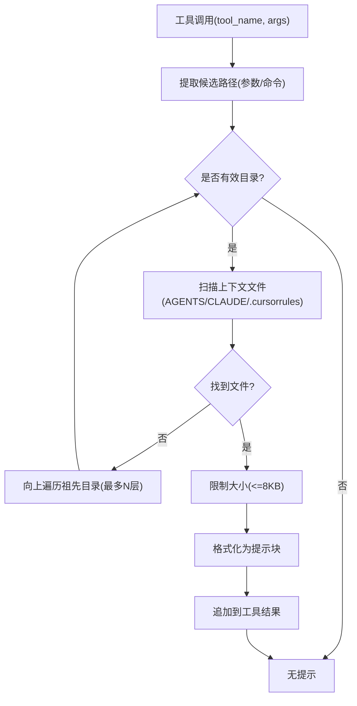
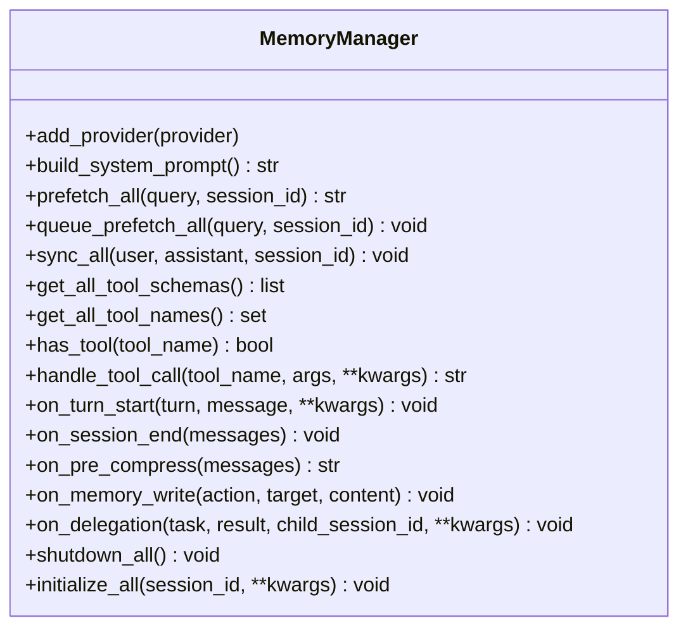
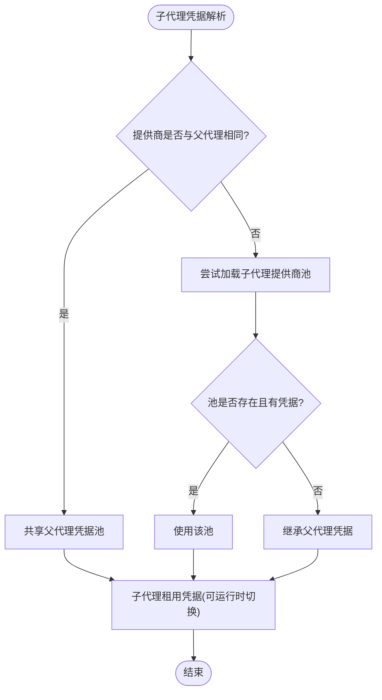
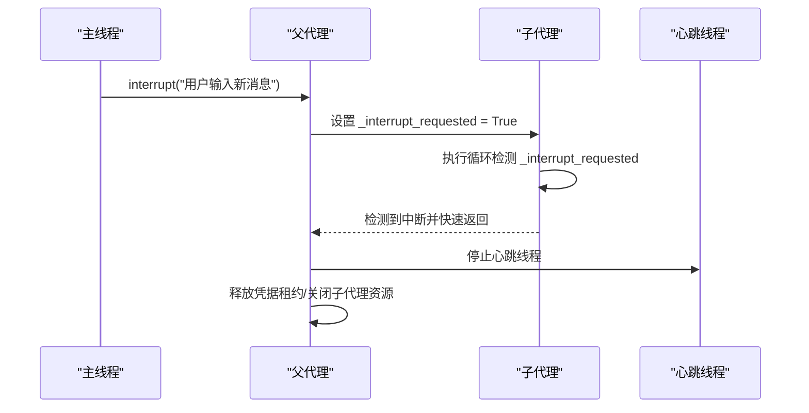
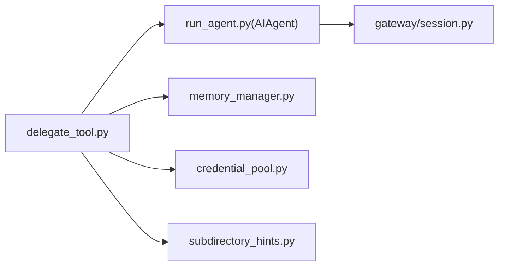

# 子代理委托机制

<cite>
**本文档引用的文件**
- [tools/delegate_tool.py](file://tools/delegate_tool.py)
- [agent/subdirectory_hints.py](file://agent/subdirectory_hints.py)
- [agent/memory_manager.py](file://agent/memory_manager.py)
- [agent/credential_pool.py](file://agent/credential_pool.py)
- [run_agent.py](file://run_agent.py)
- [tests/run_agent/test_interrupt_propagation.py](file://tests/run_agent/test_interrupt_propagation.py)
- [tests/run_agent/test_real_interrupt_subagent.py](file://tests/run_agent/test_real_interrupt_subagent.py)
- [tests/cli/test_cli_interrupt_subagent.py](file://tests/cli/test_cli_interrupt_subagent.py)
- [tests/run_interrupt_test.py](file://tests/run_interrupt_test.py)
- [gateway/session.py](file://gateway/session.py)
- [agent/skill_commands.py](file://agent/skill_commands.py)
</cite>

## 目录
1. [简介](#简介)
2. [项目结构](#项目结构)
3. [核心组件](#核心组件)
4. [架构总览](#架构总览)
5. [详细组件分析](#详细组件分析)
6. [依赖关系分析](#依赖关系分析)
7. [性能考虑](#性能考虑)
8. [故障排查指南](#故障排查指南)
9. [结论](#结论)
10. [附录](#附录)

## 简介
本文件系统性阐述 Hermes Agent 的子代理委托机制，覆盖子代理创建、委托流程、状态管理、委托深度控制、迭代预算分配、中断传播、配置继承、资源隔离与通信协调、技能命令执行、子目录提示以及代理间协作等主题。文档同时提供可操作的使用场景与调试建议，帮助开发者在不同入口（CLI、Gateway、平台适配器）中正确集成与优化子代理委托。

## 项目结构
围绕子代理委托的关键模块与文件如下：
- 委托工具：tools/delegate_tool.py 提供 delegate_task 工具函数与子代理生命周期管理
- 子目录提示：agent/subdirectory_hints.py 提供跨目录上下文发现与注入
- 内存管理：agent/memory_manager.py 提供内存提供者注册与委托结果通知
- 凭据池：agent/credential_pool.py 提供多凭据轮换与冷却策略
- 运行时代理：run_agent.py 定义 AIAgent 类与迭代预算、会话管理等基础设施
- 测试用例：tests/* 下的中断传播与真实场景测试
- 网关会话：gateway/session.py 提供会话键生成、过期策略与存储

图表来源
- [tools/delegate_tool.py:623-813](file://tools/delegate_tool.py#L623-L813)
- [agent/subdirectory_hints.py:48-225](file://agent/subdirectory_hints.py#L48-L225)
- [agent/memory_manager.py:320-332](file://agent/memory_manager.py#L320-L332)
- [agent/credential_pool.py:358-800](file://agent/credential_pool.py#L358-L800)
- [run_agent.py:170-200](file://run_agent.py#L170-L200)
- [gateway/session.py:436-493](file://gateway/session.py#L436-L493)

章节来源
- [tools/delegate_tool.py:1-1104](file://tools/delegate_tool.py#L1-L1104)
- [agent/subdirectory_hints.py:1-225](file://agent/subdirectory_hints.py#L1-L225)
- [agent/memory_manager.py:1-363](file://agent/memory_manager.py#L1-L363)
- [agent/credential_pool.py:1-800](file://agent/credential_pool.py#L1-L800)
- [run_agent.py:1-200](file://run_agent.py#L1-L200)
- [gateway/session.py:1-800](file://gateway/session.py#L1-L800)

## 核心组件
- 委托工具 delegate_task：负责解析配置、构建子代理、并发调度、进度回调、心跳与资源清理
- 子目录提示 SubdirectoryHintTracker：在工具调用过程中发现并注入跨目录上下文
- 内存管理 MemoryManager：统一注册与路由内存提供者，并在委托完成后通知外部提供者
- 凭据池 CredentialPool：按策略选择可用凭据，支持轮换与冷却，子代理可共享或独立加载
- AIAgent 与迭代预算：每个代理拥有独立迭代预算，父代与子代预算相互独立
- 会话管理：Gateway 侧提供会话键生成、过期策略与持久化存储

章节来源
- [tools/delegate_tool.py:623-813](file://tools/delegate_tool.py#L623-L813)
- [agent/subdirectory_hints.py:48-225](file://agent/subdirectory_hints.py#L48-L225)
- [agent/memory_manager.py:72-332](file://agent/memory_manager.py#L72-L332)
- [agent/credential_pool.py:358-800](file://agent/credential_pool.py#L358-L800)
- [run_agent.py:170-200](file://run_agent.py#L170-L200)
- [gateway/session.py:436-493](file://gateway/session.py#L436-L493)

## 架构总览
下图展示从父代理到子代理的委托流程，包括配置继承、工具集限制、凭据池共享、进度回调、心跳与资源清理。

图表来源
- [tools/delegate_tool.py:623-813](file://tools/delegate_tool.py#L623-L813)
- [agent/memory_manager.py:320-332](file://agent/memory_manager.py#L320-L332)
- [agent/credential_pool.py:816-845](file://agent/credential_pool.py#L816-L845)

## 详细组件分析

### 委托工具与子代理生命周期
- 深度限制与并发控制：最大深度为2（父→子→孙被拒绝），并发数由配置项控制，默认3；超过限制返回错误
- 配置解析与继承：优先从运行时配置读取 delegation.*，再回退到持久化配置；子代理默认继承父代理的模型、令牌、推理配置、工具集、平台等
- 工具集限制：自动剔除禁止工具集（如 delegation、clarify、memory、code_execution），确保子代理不越权
- 子目录提示注入：从父代理工作目录候选中提取绝对路径，向子代理系统提示注入“工作区路径”，避免容器式路径误导
- 进度回调与显示：子代理工具调用事件通过回调上报父代理，支持 CLI 与 Gateway 两种显示路径
- 心跳机制：子代理运行期间周期性向父代理“触达”活动时间戳，防止网关因父代理空闲而超时终止
- 资源清理：结束时关闭子代理工具资源、释放凭据租约、从父代理活跃子列表移除

图表来源
- [tools/delegate_tool.py:645-793](file://tools/delegate_tool.py#L645-L793)
- [tools/delegate_tool.py:399-622](file://tools/delegate_tool.py#L399-L622)

章节来源
- [tools/delegate_tool.py:52-82](file://tools/delegate_tool.py#L52-L82)
- [tools/delegate_tool.py:125-147](file://tools/delegate_tool.py#L125-L147)
- [tools/delegate_tool.py:150-156](file://tools/delegate_tool.py#L150-L156)
- [tools/delegate_tool.py:158-235](file://tools/delegate_tool.py#L158-L235)
- [tools/delegate_tool.py:399-591](file://tools/delegate_tool.py#L399-L591)
- [tools/delegate_tool.py:623-813](file://tools/delegate_tool.py#L623-L813)

### 子目录提示与上下文注入
- 触发点：工具调用参数中出现文件路径或 shell 命令时，扫描候选目录
- 上下文文件：优先扫描 AGENTS.md、CLAUDE.md、.cursorrules 等，限制单文件大小，避免上下文膨胀
- 路径提取：支持直接路径参数与 shell 命令中的路径 token，排除 URL 与标志
- 层级遍历：向上最多遍历固定层级，避免扫描至根目录
- 注入方式：将发现的上下文以格式化文本追加到工具结果，不修改系统提示，保留提示缓存

图表来源
- [agent/subdirectory_hints.py:67-225](file://agent/subdirectory_hints.py#L67-L225)

章节来源
- [agent/subdirectory_hints.py:1-225](file://agent/subdirectory_hints.py#L1-L225)

### 内存管理与委托通知
- 提供者注册：内置提供者始终注册，仅允许一个外部提供者；冲突时警告
- 工具路由：根据工具名路由到对应提供者，避免名称冲突
- 委托通知：委托完成后调用 on_delegation(task, result, child_session_id)，通知所有提供者（外部提供者除外内置）
- 生命周期钩子：turn 开始/结束、预压缩、写入事件等均有相应回调

图表来源
- [agent/memory_manager.py:72-363](file://agent/memory_manager.py#L72-L363)

章节来源
- [agent/memory_manager.py:72-332](file://agent/memory_manager.py#L72-L332)

### 凭据池与子代理凭据继承
- 共享策略：若子代理提供商与父代理相同，则共享同一 CredentialPool，保持冷却状态与轮换同步
- 独立策略：不同提供商时尝试加载其自有池；若不可用则回退到父代理继承
- 轮换与冷却：支持多种选择策略（填满优先、轮询、随机、最少使用），对 OAuth 凭据进行刷新与同步
- 租约机制：子代理可从池中租用凭据并在运行时切换，结束后释放

图表来源
- [agent/credential_pool.py:816-845](file://agent/credential_pool.py#L816-L845)
- [tools/delegate_tool.py:816-845](file://tools/delegate_tool.py#L816-L845)

章节来源
- [agent/credential_pool.py:358-800](file://agent/credential_pool.py#L358-L800)
- [tools/delegate_tool.py:816-845](file://tools/delegate_tool.py#L816-L845)

### 中断传播与资源隔离
- 中断传播：父代理在主线程调用 interrupt() 时，设置 _interrupt_requested 标志；子代理在其执行循环中检测该标志并快速退出
- 线程隔离：每个子代理运行在线程池中，中断不会影响其他线程；心跳线程在子代理结束后停止
- 资源清理：异常/正常退出均会释放凭据租约、关闭子代理工具资源、从活跃子列表移除

图表来源
- [tests/run_agent/test_interrupt_propagation.py:16-139](file://tests/run_agent/test_interrupt_propagation.py#L16-L139)
- [tests/run_agent/test_real_interrupt_subagent.py:154-186](file://tests/run_agent/test_real_interrupt_subagent.py#L154-L186)
- [tests/cli/test_cli_interrupt_subagent.py:130-164](file://tests/cli/test_cli_interrupt_subagent.py#L130-L164)
- [tests/run_interrupt_test.py:105-147](file://tests/run_interrupt_test.py#L105-L147)

章节来源
- [tests/run_agent/test_interrupt_propagation.py:16-139](file://tests/run_agent/test_interrupt_propagation.py#L16-L139)
- [tests/run_agent/test_real_interrupt_subagent.py:154-186](file://tests/run_agent/test_real_interrupt_subagent.py#L154-L186)
- [tests/cli/test_cli_interrupt_subagent.py:130-164](file://tests/cli/test_cli_interrupt_subagent.py#L130-L164)
- [tests/run_interrupt_test.py:105-147](file://tests/run_interrupt_test.py#L105-L147)

### 技能命令执行与子目录提示协作
- 技能命令：通过扫描 SKILL.md 构建 /slash 命令映射，支持在 CLI/Gateway 中直接调用技能
- 子目录提示：当技能涉及文件操作或代码阅读时，提示追踪器会在工具调用后注入相关上下文，提升技能执行效果
- 配置注入：技能前端元数据声明的配置值可被解析并注入到消息体中，便于子代理理解当前环境

章节来源
- [agent/skill_commands.py:200-369](file://agent/skill_commands.py#L200-L369)
- [agent/subdirectory_hints.py:67-225](file://agent/subdirectory_hints.py#L67-L225)

### 会话管理与委托集成
- 会话键：基于平台、聊天类型、聊天标识、线程标识与参与者标识生成，保证 DM/群组/线程的会话隔离
- 过期策略：支持空闲重置与每日重置，后台观察者可主动刷新内存；会话过期时子会话会被孤儿化而非级联删除
- 委托与会话：子代理拥有独立会话 ID 与数据库连接，父代理通过 session_db 与 parent_session_id 维持父子关联

章节来源
- [gateway/session.py:436-493](file://gateway/session.py#L436-L493)
- [gateway/session.py:579-615](file://gateway/session.py#L579-L615)
- [tools/delegate_tool.py:369-370](file://tools/delegate_tool.py#L369-L370)

## 依赖关系分析
- 委托工具依赖运行时代理类 AIAgent 构建子代理，依赖内存管理器进行委托结果通知，依赖凭据池实现凭据共享与轮换
- 子目录提示作为工具调用后的上下文增强，不改变系统提示，仅追加到工具结果
- 网关会话提供会话键生成与过期策略，委托工具通过 session_db 与 parent_session_id 与会话系统协作

图表来源
- [tools/delegate_tool.py:264-397](file://tools/delegate_tool.py#L264-L397)
- [agent/memory_manager.py:320-332](file://agent/memory_manager.py#L320-L332)
- [agent/credential_pool.py:816-845](file://agent/credential_pool.py#L816-L845)
- [agent/subdirectory_hints.py:67-225](file://agent/subdirectory_hints.py#L67-L225)
- [gateway/session.py:436-493](file://gateway/session.py#L436-L493)

章节来源
- [tools/delegate_tool.py:264-397](file://tools/delegate_tool.py#L264-L397)
- [agent/memory_manager.py:320-332](file://agent/memory_manager.py#L320-L332)
- [agent/credential_pool.py:816-845](file://agent/credential_pool.py#L816-L845)
- [agent/subdirectory_hints.py:67-225](file://agent/subdirectory_hints.py#L67-L225)
- [gateway/session.py:436-493](file://gateway/session.py#L436-L493)

## 性能考虑
- 并发与深度：合理设置 delegation.max_concurrent_children 与 delegation.max_iterations，避免过度并发导致资源争用
- 心跳频率：心跳间隔默认 30 秒，可在高负载场景适当降低频率以减少父代理触达开销
- 工具集裁剪：仅启用必要工具集，减少子代理上下文与工具调用成本
- 凭据池策略：根据提供商特性选择合适轮换策略，减少 429/配额耗尽导致的重试与延迟
- 上下文注入：限制子目录提示文件大小，避免上下文膨胀影响响应速度

## 故障排查指南
- 委托深度超限：当父→子→孙被拒绝时，检查 MAX_DEPTH 与调用链路，避免递归委托
- 并发任务过多：当 tasks 数量超过 max_concurrent_children 时返回错误，需调整配置或拆分调用
- 中断未生效：确认父代理主线程调用 interrupt()，子代理执行循环中检测 _interrupt_requested；检查心跳线程是否及时停止
- 凭据轮换失败：查看凭据池日志，确认提供商凭据是否有效；必要时手动刷新或更换提供商
- 内存提供者冲突：仅允许一个外部内存提供者，重复注册会触发警告；检查配置项 memory.provider
- 会话过期与孤儿化：子会话可能被孤儿化但不级联删除，检查会话过期策略与后台观察者行为

章节来源
- [tools/delegate_tool.py:645-680](file://tools/delegate_tool.py#L645-L680)
- [tests/run_agent/test_interrupt_propagation.py:16-139](file://tests/run_agent/test_interrupt_propagation.py#L16-L139)
- [agent/memory_manager.py:86-131](file://agent/memory_manager.py#L86-L131)
- [gateway/session.py:579-615](file://gateway/session.py#L579-L615)

## 结论
Hermes Agent 的子代理委托机制通过严格的深度控制、独立迭代预算、凭据池共享与轮换、子目录提示注入、中断传播与资源隔离，实现了安全、可控且高效的代理协作。配合内存管理器的委托通知与网关会话的键生成策略，委托模式在 CLI、Gateway 与平台适配器中均可稳定集成。建议在生产环境中合理配置并发与迭代预算，关注凭据池策略与上下文大小，以获得最佳性能与稳定性。

## 附录
- 使用场景示例（以路径代替具体代码）
  - 单任务委托：[tools/delegate_tool.py:623-736](file://tools/delegate_tool.py#L623-L736)
  - 批量并行委托：[tools/delegate_tool.py:737-793](file://tools/delegate_tool.py#L737-L793)
  - 子目录提示注入：[agent/subdirectory_hints.py:67-225](file://agent/subdirectory_hints.py#L67-L225)
  - 内存提供者委托通知：[agent/memory_manager.py:320-332](file://agent/memory_manager.py#L320-L332)
  - 凭据池共享策略：[agent/credential_pool.py:816-845](file://agent/credential_pool.py#L816-L845)
  - 中断传播测试：[tests/run_agent/test_interrupt_propagation.py:16-139](file://tests/run_agent/test_interrupt_propagation.py#L16-L139)
  - CLI 中断测试：[tests/cli/test_cli_interrupt_subagent.py:130-164](file://tests/cli/test_cli_interrupt_subagent.py#L130-L164)
  - 真实中断子代理测试：[tests/run_agent/test_real_interrupt_subagent.py:154-186](file://tests/run_agent/test_real_interrupt_subagent.py#L154-L186)
  - 运行中断测试：[tests/run_interrupt_test.py:105-147](file://tests/run_interrupt_test.py#L105-L147)