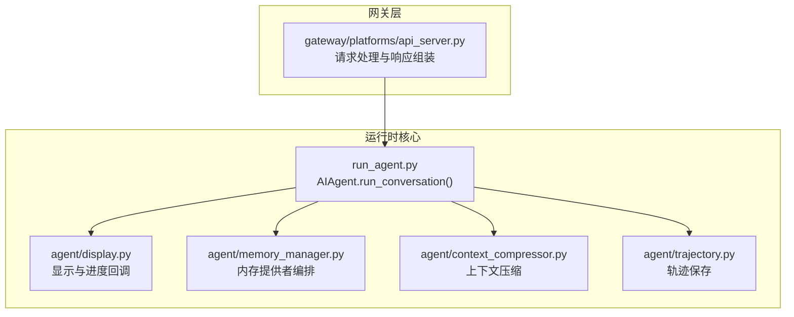
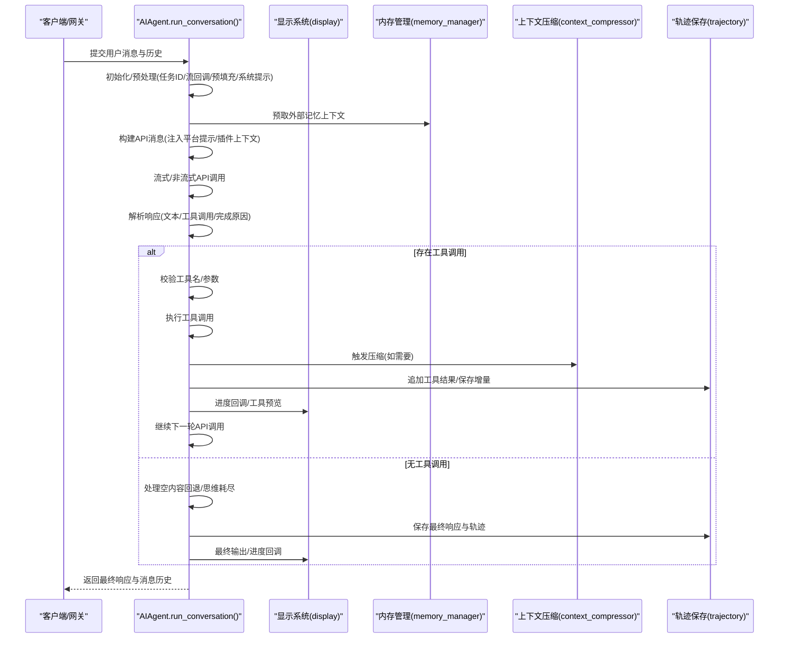
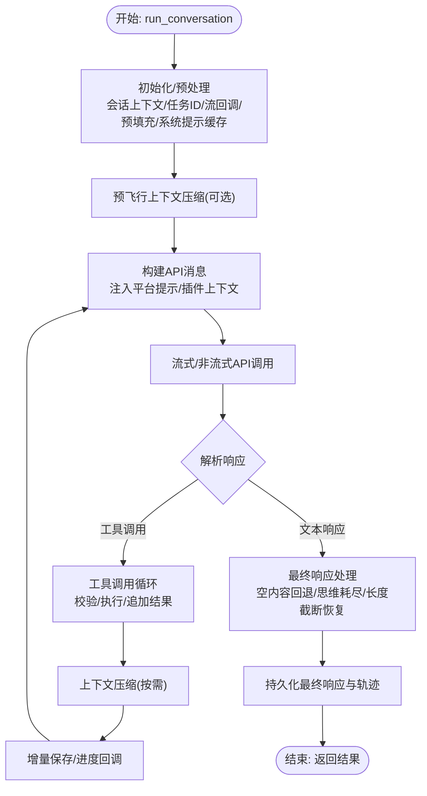
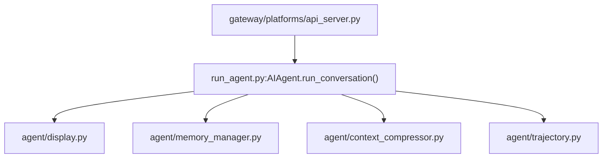

# 对话循环机制

<cite>
**本文档引用的文件**
- [run_agent.py](file://run_agent.py)
- [agent/display.py](file://agent/display.py)
- [agent/memory_manager.py](file://agent/memory_manager.py)
- [agent/context_compressor.py](file://agent/context_compressor.py)
- [agent/trajectory.py](file://agent/trajectory.py)
- [gateway/platforms/api_server.py](file://gateway/platforms/api_server.py)
- [website/docs/developer-guide/agent-loop.md](file://website/docs/developer-guide/agent-loop.md)
</cite>

## 目录
1. [简介](#简介)
2. [项目结构](#项目结构)
3. [核心组件](#核心组件)
4. [架构总览](#架构总览)
5. [详细组件分析](#详细组件分析)
6. [依赖关系分析](#依赖关系分析)
7. [性能考量](#性能考量)
8. [故障排查指南](#故障排查指南)
9. [结论](#结论)
10. [附录](#附录)

## 简介
本文件深入解析 Hermes Agent 的对话循环机制，围绕 AIAgent.run_conversation() 方法展开，系统阐述消息历史管理、工具调用循环、响应生成流程、对话状态跟踪、迭代预算控制与中断处理、预填充消息与平台提示注入、轨迹保存、对话超时与流式响应及进度回调等关键能力。文档同时说明与工具系统、显示系统、轨迹压缩器的集成关系，并提供可操作的使用指引。

## 项目结构
Hermes Agent 的对话循环主要集中在运行时模块中，核心入口为 run_agent.py 中的 AIAgent 类及其 run_conversation() 方法；与之紧密协作的还有：
- 显示系统：用于 CLI/TUI 反馈与工具执行过程中的可视化（agent/display.py）
- 内存管理：在每轮对话前进行外部记忆提供者的预取与同步（agent/memory_manager.py）
- 上下文压缩：根据令牌占用动态触发压缩以维持上下文窗口（agent/context_compressor.py）
- 轨迹保存：将对话与工具调用序列化为可复现的轨迹（agent/trajectory.py）
- 网关层：接收外部请求并组织最终响应（gateway/platforms/api_server.py）

**图表来源**
- [run_agent.py](file://run_agent.py)
- [agent/display.py](file://agent/display.py)
- [agent/memory_manager.py](file://agent/memory_manager.py)
- [agent/context_compressor.py](file://agent/context_compressor.py)
- [agent/trajectory.py](file://agent/trajectory.py)
- [gateway/platforms/api_server.py](file://gateway/platforms/api_server.py)

**章节来源**
- [run_agent.py](file://run_agent.py)
- [agent/display.py](file://agent/display.py)
- [agent/memory_manager.py](file://agent/memory_manager.py)
- [agent/context_compressor.py](file://agent/context_compressor.py)
- [agent/trajectory.py](file://agent/trajectory.py)
- [gateway/platforms/api_server.py](file://gateway/platforms/api_server.py)

## 核心组件
- AIAgent.run_conversation()：对话主循环，负责消息构建、系统提示缓存、预填充注入、工具调用循环、响应解析与持久化。
- 显示系统（display）：提供思考动画、工具预览、差异渲染、进度回调等用户反馈。
- 内存管理（memory_manager）：统一接入内置与外部记忆提供者，支持预取、同步与工具路由。
- 上下文压缩（context_compressor）：基于令牌估算与阈值触发压缩，避免超出模型上下文窗口。
- 轨迹保存（trajectory）：将对话与工具调用序列化为可复现格式，支持预填充消息不落盘。
- 网关（api_server）：接收请求、组织历史、注入平台提示、保存完整历史并返回最终响应。

**章节来源**
- [run_agent.py](file://run_agent.py)
- [agent/display.py](file://agent/display.py)
- [agent/memory_manager.py](file://agent/memory_manager.py)
- [agent/context_compressor.py](file://agent/context_compressor.py)
- [agent/trajectory.py](file://agent/trajectory.py)
- [gateway/platforms/api_server.py](file://gateway/platforms/api_server.py)

## 架构总览
对话循环从 run_conversation() 入手，贯穿以下关键路径：
- 初始化与预处理：会话上下文设置、任务ID生成、流回调注册、预填充注入、系统提示缓存、预飞行压缩。
- 主循环：构建 API 消息、注入平台提示与插件上下文、选择流式或非流式调用、解析响应、处理工具调用、更新状态与令牌计数。
- 工具调用循环：校验工具名与参数、去重与限额、执行工具、追加结果、触发压缩与增量保存。
- 响应生成：处理空内容回退、思维耗尽检测、长度截断恢复、最终文本提取与持久化。
- 结果输出：网关层组装完整历史与最终响应，CLI/TUI 层通过回调实时反馈。

**图表来源**
- [run_agent.py](file://run_agent.py)
- [agent/display.py](file://agent/display.py)
- [agent/memory_manager.py](file://agent/memory_manager.py)
- [agent/context_compressor.py](file://agent/context_compressor.py)
- [agent/trajectory.py](file://agent/trajectory.py)

**章节来源**
- [run_agent.py](file://run_agent.py)
- [website/docs/developer-guide/agent-loop.md](file://website/docs/developer-guide/agent-loop.md)

## 详细组件分析

### AIAgent.run_conversation() 工作原理
- 输入参数与职责
  - 用户消息、系统消息、历史消息、任务ID、流回调、持久化用户消息等。
  - 负责整轮对话的生命周期管理：初始化、消息构建、API 调用、工具循环、响应生成、持久化与输出。
- 消息历史管理
  - 复制传入的历史列表，避免污染调用方状态。
  - 在网关场景下，从会话数据库恢复系统提示以保持缓存前缀一致。
  - 支持“预填充消息”（prefill_messages）在系统提示后注入，仅本次调用有效，不落盘。
- 平台提示注入与插件上下文
  - 将平台标识、用户ID等信息注入到系统提示或用户消息中（由平台层决定），确保模型理解交互环境。
  - 插件 pre_llm_call 钩子可在用户消息中注入临时上下文，且不持久化。
- 预飞行上下文压缩
  - 若历史过长超过阈值，先进行一次压缩尝试，避免后续 API 错误。
- API 调用与流式处理
  - 默认优先流式调用，具备健康检查与中断感知；若无消费者则回退至非流式。
  - 支持对齐不同 API 模式（Chat Completions、Responses、Anthropic Messages）的消息格式。
- 工具调用循环
  - 校验工具名与参数，自动修复常见拼写错误；对无效 JSON 或截断参数进行恢复策略。
  - 去重与限额控制，执行工具并将结果追加到消息历史。
  - 对于仅包含“家务型”工具（如 memory、todo、skill_manage、session_search）的工具调用，可能静默后续输出以避免重复展示。
- 响应生成与回退
  - 处理空内容回退：若工具调用后无可见文本，回退到上一轮可见内容。
  - 思维耗尽检测：当输出令牌全部用于思维而无可见文本时，给出明确提示并建议降低思维努力或提高输出上限。
  - 长度截断恢复：对长度截断的响应进行最多三次续写尝试，否则回滚至上一完整状态。
- 迭代预算与中断
  - 使用 IterationBudget 控制工具调用次数，支持“宽限期”一次性强制模型总结。
  - 支持线程级中断标记，可在任意阶段打断工具循环与 API 调用。
- 轨迹保存与持久化
  - 仅保存实际对话与工具调用，预填充消息不落盘。
  - 会话结束或失败时，将当前轮次消息持久化到会话数据库，便于后续恢复与分析。
- 输出与网关集成
  - 网关层将最终响应与完整历史组装，确保包含工具调用与最终消息，形成可复现的对话记录。

**图表来源**
- [run_agent.py](file://run_agent.py)

**章节来源**
- [run_agent.py](file://run_agent.py)
- [website/docs/developer-guide/agent-loop.md](file://website/docs/developer-guide/agent-loop.md)

### 对话状态跟踪与预算控制
- 状态跟踪
  - 记录最后一次活动时间、活动描述、当前工具、API 调用计数、速率限制状态等，用于超时报告与进度通知。
  - 支持“内存提醒”与“技能提醒”计数，基于轮次与工具迭代触发。
- 预算控制
  - IterationBudget 限制工具调用轮次，支持“宽限期”一次性强制模型总结。
  - 对于仅包含特定工具的工具调用，可退还预算，避免浪费。
- 中断处理
  - 线程级中断标记，支持在 API 调用与工具执行期间快速退出。
  - 重试等待期间也能响应中断，避免长时间阻塞。

**章节来源**
- [run_agent.py](file://run_agent.py)

### 预填充消息、平台提示注入与轨迹保存
- 预填充消息（prefill_messages）
  - 注入时机：API 调用前，在系统提示之后、历史消息之前插入。
  - 特性：仅本次调用有效，不保存到会话数据库与轨迹文件。
- 平台提示注入
  - 由平台层决定注入位置与内容，确保模型理解交互环境（如 CLI、Telegram、Discord 等）。
- 轨迹保存
  - 仅保存实际对话与工具调用，预填充消息不落盘。
  - 支持将对话转换为可复现的轨迹格式，便于调试与复现。

**章节来源**
- [run_agent.py](file://run_agent.py)
- [agent/trajectory.py](file://agent/trajectory.py)

### 对话超时处理、流式响应与进度回调
- 超时处理
  - 通过“最后活动时间”与“活动描述”记录，网关层可据此报告当前状态。
  - 流式调用具备健康检查与超时检测，避免挂起。
- 流式响应
  - 默认优先流式，支持增量文本与工具调用的分块传输。
  - 支持在工具执行前关闭已打开的流式显示，避免内容错位。
- 进度回调
  - 提供多种回调：工具进度、思考回调、推理回调、状态回调、流式增量回调等。
  - 显示系统配合思考动画与工具预览，提升交互体验。

**章节来源**
- [run_agent.py](file://run_agent.py)
- [agent/display.py](file://agent/display.py)

### 与工具系统、显示系统、轨迹压缩器的集成
- 工具系统
  - 工具名称与参数校验、自动修复、去重与限额控制。
  - 工具执行前后进行增量保存与进度回调。
- 显示系统
  - 工具预览、差异渲染、思考动画、进度条等。
  - 与流式回调协同，实现实时反馈。
- 轨迹压缩器
  - 基于令牌估算与阈值触发压缩，避免上下文溢出。
  - 压缩后更新系统提示缓存，保证缓存前缀一致性。

**章节来源**
- [run_agent.py](file://run_agent.py)
- [agent/display.py](file://agent/display.py)
- [agent/context_compressor.py](file://agent/context_compressor.py)

## 依赖关系分析
- AIAgent.run_conversation() 作为中枢，依赖以下模块：
  - 显示系统：用于进度与反馈。
  - 内存管理：预取与同步外部记忆上下文。
  - 上下文压缩：动态压缩以维持上下文窗口。
  - 轨迹保存：序列化对话与工具调用。
  - 网关层：请求处理与最终响应组装。
- 模块间耦合与内聚
  - 耦合点：run_conversation() 与各模块的接口清晰，通过回调与工具路由解耦。
  - 内聚性：对话循环逻辑集中，工具执行、显示反馈、上下文管理相对独立。

**图表来源**
- [run_agent.py](file://run_agent.py)
- [agent/display.py](file://agent/display.py)
- [agent/memory_manager.py](file://agent/memory_manager.py)
- [agent/context_compressor.py](file://agent/context_compressor.py)
- [agent/trajectory.py](file://agent/trajectory.py)
- [gateway/platforms/api_server.py](file://gateway/platforms/api_server.py)

**章节来源**
- [run_agent.py](file://run_agent.py)
- [agent/display.py](file://agent/display.py)
- [agent/memory_manager.py](file://agent/memory_manager.py)
- [agent/context_compressor.py](file://agent/context_compressor.py)
- [agent/trajectory.py](file://agent/trajectory.py)
- [gateway/platforms/api_server.py](file://gateway/platforms/api_server.py)

## 性能考量
- 流式优先：默认采用流式调用，具备健康检查与中断感知，减少挂起风险。
- 预取与缓存：外部记忆提供者预取一次，避免每轮重复调用；系统提示缓存与提示词缓存（如 Anthropic）减少输入成本。
- 压缩与阈值：基于令牌估算与阈值触发压缩，避免频繁 API 错误与超限。
- 回退策略：对无效工具名、JSON 参数、截断响应等提供恢复策略，减少重试成本。
- 速率限制与配额：通过速率限制跟踪与备用提供者链路，提升可用性。

## 故障排查指南
- 常见错误类型与恢复
  - 无效响应：重试并尝试备用提供者；必要时记录请求详情以便诊断。
  - 思维耗尽：提示降低思维努力或提高输出上限。
  - 长度截断：最多三次续写尝试，否则回滚至上一完整状态。
  - 413/429/上下文溢出：触发压缩或降低输出上限；必要时切换到更小上下文窗口。
- 中断与超时
  - 支持线程级中断，重试等待期间也能快速响应。
  - 网关层可依据“最后活动时间”与“活动描述”报告当前状态。
- 日志与调试
  - 详细日志与请求转储（HERMES_DUMP_REQUESTS）有助于定位问题。
  - 轨迹保存便于复现与分析。

**章节来源**
- [run_agent.py](file://run_agent.py)

## 结论
Hermes Agent 的对话循环通过 run_conversation() 将消息管理、工具调用、响应生成、上下文压缩与轨迹保存有机整合，配合显示系统与网关层，实现了高鲁棒性与可观测性的对话体验。其预算控制、中断处理与流式响应机制确保了在复杂任务下的稳定性与效率；预填充与平台提示注入提升了模型对交互环境的理解；轨迹保存与压缩器保障了长期会话的可持续性。

## 附录
- 启动与控制对话循环的示例路径
  - [run_agent.py](file://run_agent.py) 中的 run_conversation() 方法定义与实现
  - [agent/display.py](file://agent/display.py) 中的进度回调与显示辅助函数
  - [agent/memory_manager.py](file://agent/memory_manager.py) 中的预取与同步接口
  - [agent/context_compressor.py](file://agent/context_compressor.py) 中的压缩策略与阈值
  - [agent/trajectory.py](file://agent/trajectory.py) 中的轨迹序列化逻辑
  - [gateway/platforms/api_server.py](file://gateway/platforms/api_server.py) 中的请求处理与响应组装