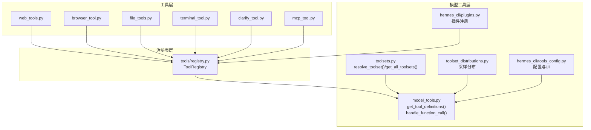
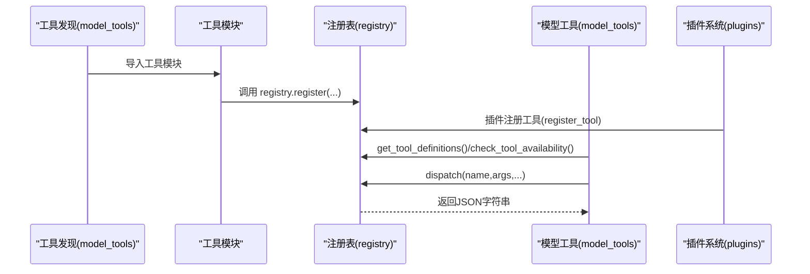
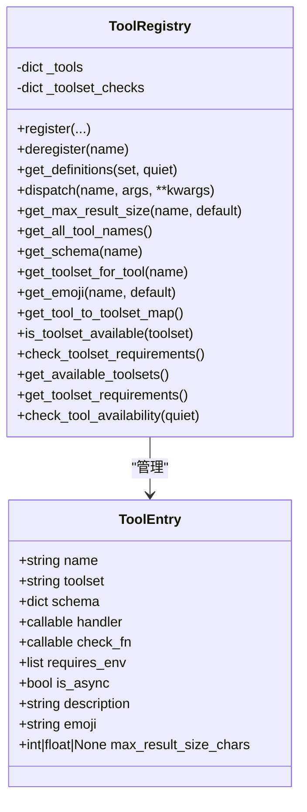
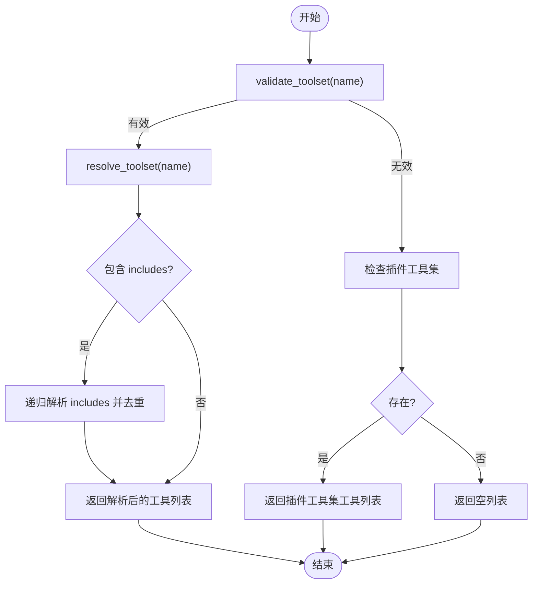
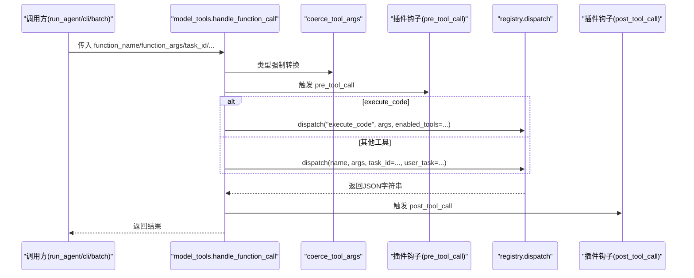
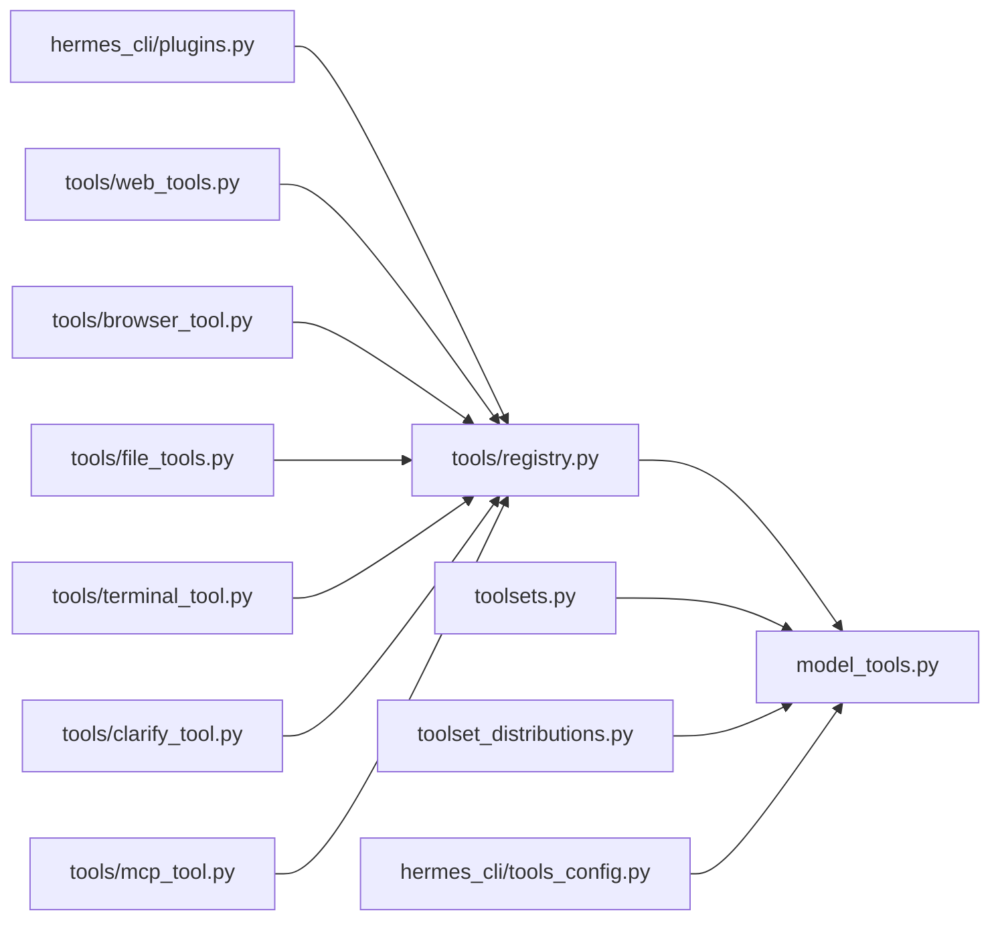

# 工具发现与注册

<cite>
**本文档引用的文件**
- [tools/registry.py](file://tools/registry.py)
- [model_tools.py](file://model_tools.py)
- [toolsets.py](file://toolsets.py)
- [toolset_distributions.py](file://toolset_distributions.py)
- [tools/file_tools.py](file://tools/file_tools.py)
- [tools/clarify_tool.py](file://tools/clarify_tool.py)
- [tools/browser_tool.py](file://tools/browser_tool.py)
- [tools/web_tools.py](file://tools/web_tools.py)
- [tools/terminal_tool.py](file://tools/terminal_tool.py)
- [tools/mcp_tool.py](file://tools/mcp_tool.py)
- [hermes_cli/plugins.py](file://hermes_cli/plugins.py)
- [hermes_cli/tools_config.py](file://hermes_cli/tools_config.py)
</cite>

## 目录
1. [简介](#简介)
2. [项目结构](#项目结构)
3. [核心组件](#核心组件)
4. [架构总览](#架构总览)
5. [详细组件分析](#详细组件分析)
6. [依赖分析](#依赖分析)
7. [性能考虑](#性能考虑)
8. [故障排除指南](#故障排除指南)
9. [结论](#结论)

## 简介
本文件系统化阐述 Hermes Agent 的工具发现与注册体系，覆盖以下主题：
- 工具注册表的工作原理与数据结构
- 工具集（toolset）的组织结构与解析机制
- 工具发现与动态加载策略
- 工具定义格式、参数验证与元数据管理
- 工具集过滤、可用性检查与优先级排序
- 依赖检查、冲突检测与版本兼容性处理
- 与模型工具系统的集成关系与工具调用前准备
- 提供可追溯的代码路径以定位实现细节

## 项目结构
工具发现与注册系统由三层协作构成：
- 工具层：各工具模块在导入时通过注册表进行自注册
- 注册表层：集中存储工具元数据、Schema、处理器与可用性检查函数
- 模型工具层：对外提供工具定义生成、调用分发与参数类型强制转换

**图表来源**
- [tools/web_tools.py:1-200](file://tools/web_tools.py#L1-L200)
- [tools/browser_tool.py:1-200](file://tools/browser_tool.py#L1-L200)
- [tools/file_tools.py:820-836](file://tools/file_tools.py#L820-L836)
- [tools/terminal_tool.py:1-200](file://tools/terminal_tool.py#L1-L200)
- [tools/clarify_tool.py:120-142](file://tools/clarify_tool.py#L120-L142)
- [tools/mcp_tool.py:1-200](file://tools/mcp_tool.py#L1-L200)
- [tools/registry.py:48-290](file://tools/registry.py#L48-L290)
- [model_tools.py:132-170](file://model_tools.py#L132-L170)
- [toolsets.py:410-467](file://toolsets.py#L410-L467)
- [toolset_distributions.py:223-288](file://toolset_distributions.py#L223-L288)
- [hermes_cli/plugins.py:124-161](file://hermes_cli/plugins.py#L124-L161)
- [hermes_cli/tools_config.py:44-90](file://hermes_cli/tools_config.py#L44-L90)

**章节来源**
- [tools/registry.py:1-336](file://tools/registry.py#L1-L336)
- [model_tools.py:1-578](file://model_tools.py#L1-L578)
- [toolsets.py:1-656](file://toolsets.py#L1-L656)
- [toolset_distributions.py:1-365](file://toolset_distributions.py#L1-L365)
- [hermes_cli/plugins.py:1-200](file://hermes_cli/plugins.py#L1-L200)
- [hermes_cli/tools_config.py:1-800](file://hermes_cli/tools_config.py#L1-L800)

## 核心组件
- 工具注册表（ToolRegistry）
  - 存储每个工具的名称、Schema、处理器、可用性检查函数、环境变量要求、是否异步、描述、表情符号、最大结果长度等元数据
  - 提供注册、反注册、Schema查询、可用性检查、工具集映射与工具集可用性检查等功能
- 模型工具适配器（model_tools）
  - 触发工具发现（导入所有工具模块）
  - 提供 get_tool_definitions 过滤工具集并生成 OpenAI 兼容的工具定义
  - 提供 handle_function_call 分发工具调用，包含参数类型强制转换、插件钩子、错误处理与异步桥接
- 工具集系统（toolsets）
  - 定义工具集（toolset）及其组合关系，支持静态与插件动态扩展
  - 提供 resolve_toolset、get_all_toolsets、validate_toolset 等能力
- 工具集分布（toolset_distributions）
  - 定义不同场景下的工具集采样分布，用于数据生成或任务模拟
- 插件系统（hermes_cli/plugins）
  - 插件通过 PluginContext.register_tool 将工具注册到全局注册表
- 配置与UI（hermes_cli/tools_config）
  - 提供工具集选择、提供商配置、令牌估算与平台工具集保存逻辑

**章节来源**
- [tools/registry.py:24-290](file://tools/registry.py#L24-L290)
- [model_tools.py:132-578](file://model_tools.py#L132-L578)
- [toolsets.py:410-543](file://toolsets.py#L410-L543)
- [toolset_distributions.py:223-302](file://toolset_distributions.py#L223-L302)
- [hermes_cli/plugins.py:124-161](file://hermes_cli/plugins.py#L124-L161)
- [hermes_cli/tools_config.py:44-110](file://hermes_cli/tools_config.py#L44-L110)

## 架构总览
工具发现与注册的端到端流程如下：

**图表来源**
- [model_tools.py:132-170](file://model_tools.py#L132-L170)
- [tools/registry.py:59-94](file://tools/registry.py#L59-L94)
- [hermes_cli/plugins.py:133-161](file://hermes_cli/plugins.py#L133-L161)

**章节来源**
- [model_tools.py:132-170](file://model_tools.py#L132-L170)
- [tools/registry.py:59-94](file://tools/registry.py#L59-L94)
- [hermes_cli/plugins.py:133-161](file://hermes_cli/plugins.py#L133-L161)

## 详细组件分析

### 工具注册表（ToolRegistry）
- 数据结构
  - ToolEntry：封装单个工具的元数据字段（名称、工具集、Schema、处理器、检查函数、环境变量、是否异步、描述、表情、最大结果长度）
  - ToolRegistry：维护工具字典与工具集检查函数映射，提供注册、反注册、Schema查询、分发、可用性检查等方法
- 关键能力
  - 注册与覆盖警告：当同名工具被不同工具集覆盖时发出告警
  - 反注册：清理工具并按需移除工具集检查函数
  - Schema 查询：仅返回通过 check_fn 的工具，自动补全 name 字段
  - 分发：统一调度同步/异步处理器，捕获异常并返回标准化错误
  - 工具集可用性：对 check_fn 异常进行保护性降级
  - 元数据查询：工具集映射、工具集要求、最大结果长度、工具集可用性统计

**图表来源**
- [tools/registry.py:24-94](file://tools/registry.py#L24-L94)
- [tools/registry.py:116-286](file://tools/registry.py#L116-L286)

**章节来源**
- [tools/registry.py:24-290](file://tools/registry.py#L24-L290)

### 工具集系统（toolsets）
- 工具集定义
  - 静态工具集：如 web、terminal、file、browser、vision、image_gen、moa、tts、skills、todo、memory、session_search、clarify、code_execution、delegation、cronjob、messaging、rl、homeassistant 等
  - 场景化工具集：如 hermes-cli、hermes-telegram、hermes-discord 等平台工具集；hermes-gateway 组合多个平台
  - 复合工具集：通过 includes 组合其他工具集，支持递归解析与环路检测
- 解析与校验
  - resolve_toolset：递归解析工具集，去重并处理环路
  - get_all_toolsets / get_toolset_names：合并静态与插件动态工具集
  - validate_toolset：校验工具集名称有效性
- 插件扩展
  - 支持插件注册的工具集在运行时被识别并纳入解析

**图表来源**
- [toolsets.py:547-564](file://toolsets.py#L547-L564)
- [toolsets.py:410-467](file://toolsets.py#L410-L467)
- [toolsets.py:489-504](file://toolsets.py#L489-L504)

**章节来源**
- [toolsets.py:66-391](file://toolsets.py#L66-L391)
- [toolsets.py:410-543](file://toolsets.py#L410-L543)

### 模型工具适配器（model_tools）
- 工具发现
  - _discover_tools：显式导入各工具模块触发其注册
  - MCP 与插件动态发现：通过 discover_mcp_tools 与 discover_plugins 注入外部工具
- 工具定义生成
  - get_tool_definitions：根据启用/禁用工具集解析工具集合，过滤不可用工具，动态调整 execute_code 与 browser_navigate 的描述
- 工具调用分发
  - handle_function_call：参数类型强制转换、插件钩子（pre_tool_call/post_tool_call）、代理循环工具拦截、异步桥接与错误包装
- 参数类型强制转换
  - coerce_tool_args：基于 JSON Schema 对字符串类型的数值/布尔进行安全转换
- 异步桥接
  - _run_async：在主线程/工作线程/异步上下文下选择合适的事件循环，避免“Event loop is closed”问题

**图表来源**
- [model_tools.py:459-548](file://model_tools.py#L459-L548)
- [model_tools.py:372-457](file://model_tools.py#L372-L457)
- [model_tools.py:81-125](file://model_tools.py#L81-L125)

**章节来源**
- [model_tools.py:132-170](file://model_tools.py#L132-L170)
- [model_tools.py:234-353](file://model_tools.py#L234-L353)
- [model_tools.py:459-548](file://model_tools.py#L459-L548)
- [model_tools.py:372-457](file://model_tools.py#L372-L457)
- [model_tools.py:81-125](file://model_tools.py#L81-L125)

### 工具定义格式与元数据管理
- 工具定义字段
  - 名称（name）：唯一标识
  - 工具集（toolset）：所属工具集，决定可用性与过滤
  - Schema：OpenAI 兼容的 JSON Schema（含参数、描述、必填项等）
  - 处理器（handler）：实际执行逻辑
  - 检查函数（check_fn）：可用性检查，失败则工具不参与定义生成
  - 环境变量要求（requires_env）：工具运行所需的环境变量清单
  - 是否异步（is_async）：影响分发与异步桥接
  - 描述（description）、表情（emoji）、最大结果长度（max_result_size_chars）
- 示例
  - 文件工具：read_file/write_file/patch/search_files 在导入时完成注册
  - 提问澄清工具：clarify 在导入时完成注册
  - 浏览器工具：browser_navigate/browser_snapshot/browser_click 等批量注册

**章节来源**
- [tools/registry.py:33-91](file://tools/registry.py#L33-L91)
- [tools/file_tools.py:832-836](file://tools/file_tools.py#L832-L836)
- [tools/clarify_tool.py:131-141](file://tools/clarify_tool.py#L131-L141)
- [tools/browser_tool.py:2305-2379](file://tools/browser_tool.py#L2305-L2379)

### 工具集过滤机制与优先级排序
- 过滤策略
  - 启用工具集：仅包含指定工具集的工具
  - 禁用工具集：从全部工具集中剔除指定工具集
  - 兼容旧版工具集别名：通过 LEGACY_TOOLSET_MAP 映射
- 动态调整
  - execute_code：仅列出当前会话中可用的沙箱工具
  - browser_navigate：当 web_search/web_extract 不可用时，去除描述中的交叉引用提示
- 优先级与排序
  - 工具集解析遵循 includes 的拓扑顺序，使用 visited 集合防止环路
  - 工具集可用性检查按 check_fn 结果判定，失败的工具集整体不可用

**章节来源**
- [model_tools.py:234-353](file://model_tools.py#L234-L353)
- [toolsets.py:410-467](file://toolsets.py#L410-L467)

### 依赖检查、冲突检测与版本兼容性
- 冲突检测
  - 同名工具被不同工具集覆盖时发出警告，避免静默覆盖
- 依赖检查
  - requires_env：工具集层面记录所需环境变量，用于 UI 展示与可用性统计
  - check_fn：工具/工具集可用性检查，异常时视为不可用
- 版本兼容性
  - MCP SDK 可选依赖：未安装时模块为 no-op，日志提示
  - 异步桥接：兼容不同运行时（主线程持久 loop、工作线程 loop、已有运行时）

**章节来源**
- [tools/registry.py:73-80](file://tools/registry.py#L73-L80)
- [tools/mcp_tool.py:89-138](file://tools/mcp_tool.py#L89-L138)
- [model_tools.py:81-125](file://model_tools.py#L81-L125)

### 动态加载策略与插件集成
- 动态加载
  - _discover_tools：显式导入工具模块，失败时记录警告但不影响其余模块
  - MCP 与插件：在启动阶段尝试发现并注册外部工具
- 插件注册
  - PluginContext.register_tool：委托至 tools.registry.register，同时记录插件提供的工具名称
  - 插件工具集：通过工具集名称动态注入，参与 resolve_toolset 与 get_all_toolsets

**章节来源**
- [model_tools.py:132-184](file://model_tools.py#L132-L184)
- [hermes_cli/plugins.py:133-161](file://hermes_cli/plugins.py#L133-L161)
- [toolsets.py:489-504](file://toolsets.py#L489-L504)

### 工具调用前准备与参数验证
- 参数类型强制转换
  - coerce_tool_args：依据 JSON Schema 对字符串类型的数值/布尔进行安全转换
- 插件钩子
  - pre_tool_call/post_tool_call：在工具调用前后注入横切逻辑
- 代理循环工具拦截
  - _AGENT_LOOP_TOOLS：todo/memory/session_search/delegate_task 由代理循环处理，直接返回错误提示

**章节来源**
- [model_tools.py:372-457](file://model_tools.py#L372-L457)
- [model_tools.py:459-548](file://model_tools.py#L459-L548)

## 依赖分析
- 模块耦合
  - tools/registry.py 无对 model_tools 与工具模块的反向导入，避免循环依赖
  - model_tools 仅依赖 tools/registry 与 toolsets，形成清晰的上层接口
- 外部依赖
  - MCP SDK：可选依赖，未安装时降级为 no-op
  - tiktoken：用于工具 Schema 令牌估算（可选）

**图表来源**
- [tools/registry.py:1-336](file://tools/registry.py#L1-L336)
- [model_tools.py:1-578](file://model_tools.py#L1-L578)
- [toolsets.py:1-656](file://toolsets.py#L1-L656)
- [toolset_distributions.py:1-365](file://toolset_distributions.py#L1-L365)
- [hermes_cli/plugins.py:1-200](file://hermes_cli/plugins.py#L1-L200)
- [hermes_cli/tools_config.py:1-800](file://hermes_cli/tools_config.py#L1-L800)

**章节来源**
- [tools/registry.py:1-336](file://tools/registry.py#L1-L336)
- [model_tools.py:1-578](file://model_tools.py#L1-L578)

## 性能考虑
- 事件循环复用
  - 主线程与工作线程分别持有持久事件循环，避免频繁创建/销毁导致的客户端资源泄漏
- 工具 Schema 令牌估算缓存
  - 使用进程级缓存减少重复计算
- 工具集解析去重
  - 使用集合去重与 visited 集合避免重复解析与环路

[本节为通用指导，无需特定文件引用]

## 故障排除指南
- 工具未出现在工具集中
  - 检查工具是否正确注册（导入时是否调用 registry.register）
  - 检查 check_fn 是否返回 True；若抛出异常会被视为不可用
  - 检查工具集过滤参数（启用/禁用工具集）是否正确
- 工具调用报错
  - 查看 handle_function_call 的异常捕获与返回值
  - 检查参数类型是否需要强制转换（coerce_tool_args）
- MCP 工具不可用
  - 确认 MCP SDK 已安装且配置正确
  - 检查连接超时、凭证与通知类型支持情况
- 插件工具缺失
  - 确认插件已加载且 register_tool 被调用
  - 检查插件工具集是否参与 resolve_toolset

**章节来源**
- [tools/registry.py:128-143](file://tools/registry.py#L128-L143)
- [model_tools.py:459-548](file://model_tools.py#L459-L548)
- [tools/mcp_tool.py:89-138](file://tools/mcp_tool.py#L89-L138)
- [hermes_cli/plugins.py:133-161](file://hermes_cli/plugins.py#L133-L161)

## 结论
Hermes Agent 的工具发现与注册系统通过“工具模块自注册 + 注册表集中管理 + 模型工具适配器”的分层设计，实现了：
- 清晰的工具定义格式与元数据管理
- 灵活的工具集组织与动态扩展（插件与 MCP）
- 可靠的可用性检查与冲突检测
- 高效的工具调用与异步桥接
- 与配置系统的无缝集成

该体系为工具生态的演进提供了稳定基础，便于在不破坏现有接口的前提下引入新工具与新协议。