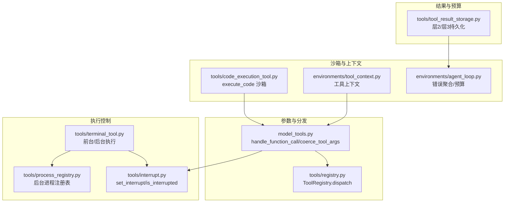
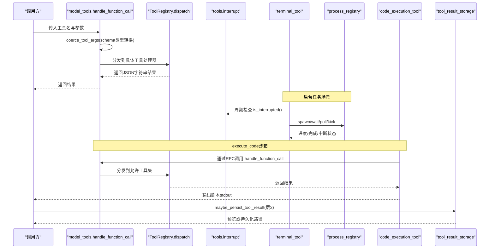
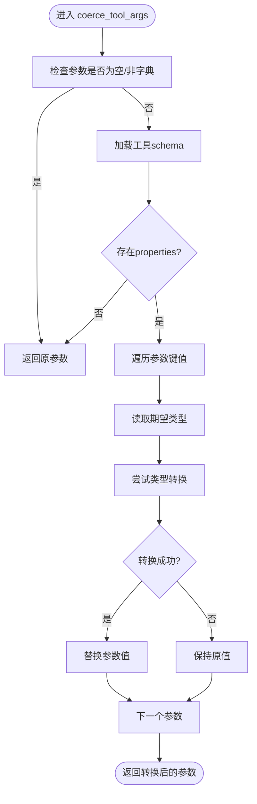
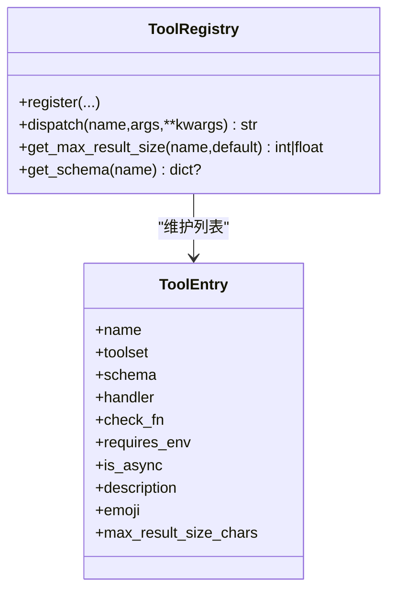
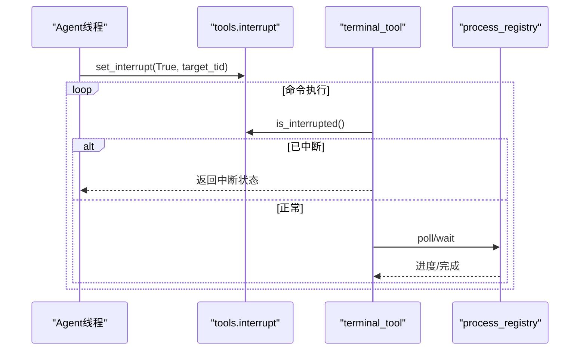
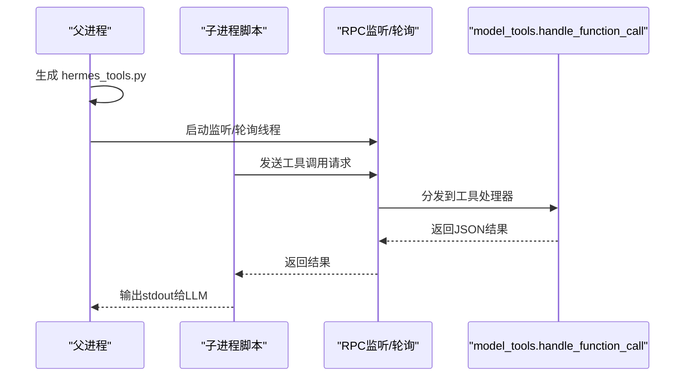
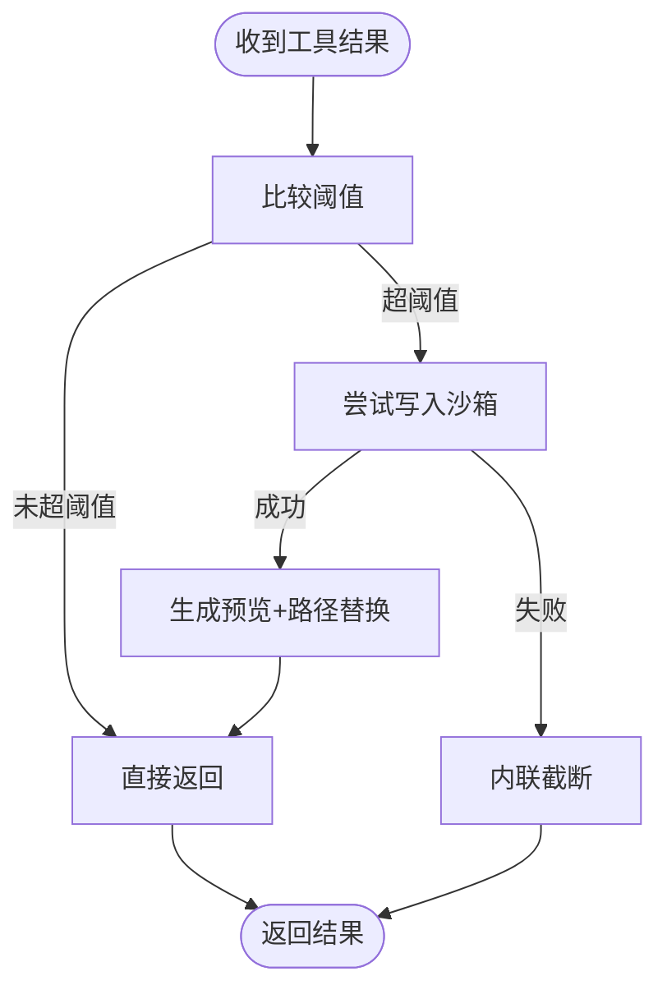
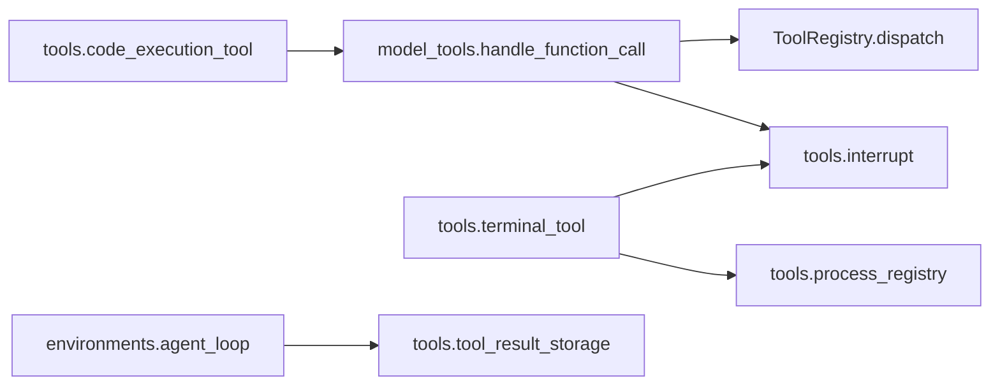

# 工具执行控制

<cite>
**本文引用的文件**
- [tools/interrupt.py](file://tools/interrupt.py)
- [tools/tool_result_storage.py](file://tools/tool_result_storage.py)
- [tools/code_execution_tool.py](file://tools/code_execution_tool.py)
- [model_tools.py](file://model_tools.py)
- [tools/registry.py](file://tools/registry.py)
- [tools/process_registry.py](file://tools/process_registry.py)
- [tools/terminal_tool.py](file://tools/terminal_tool.py)
- [environments/tool_context.py](file://environments/tool_context.py)
- [environments/agent_loop.py](file://environments/agent_loop.py)
- [tests/tools/test_code_execution.py](file://tests/tools/test_code_execution.py)
- [tests/run_agent/test_interrupt_propagation.py](file://tests/run_agent/test_interrupt_propagation.py)
- [tests/tools/test_tool_result_storage.py](file://tests/tools/test_tool_result_storage.py)
- [tests/tools/test_interrupt.py](file://tests/tools/test_interrupt.py)
</cite>

## 目录
1. [简介](#简介)
2. [项目结构](#项目结构)
3. [核心组件](#核心组件)
4. [架构总览](#架构总览)
5. [详细组件分析](#详细组件分析)
6. [依赖分析](#依赖分析)
7. [性能考虑](#性能考虑)
8. [故障排查指南](#故障排查指南)
9. [结论](#结论)
10. [附录](#附录)

## 简介
本文件系统性阐述 Hermes Agent 的“工具执行控制系统”，围绕以下目标展开：
- 工具执行流程：从参数解析、校验与转换，到执行调度、超时与中断控制、异常捕获与结果处理。
- 执行状态管理：线程级中断信号、后台进程注册表、终端工具的前台/后台模式与会话隔离。
- 结果持久化与传递：大结果自动落盘、预览与路径提示、回合预算强制溢出处理。
- 性能监控与统计：调用计数、耗时统计、失败追踪与回调通知。

## 项目结构
本节概览与工具执行控制直接相关的关键模块及其职责：
- 参数解析与类型转换：model_tools.coerce_tool_args
- 工具分发与注册：tools.registry.ToolRegistry、model_tools.handle_function_call
- 执行控制与中断：tools.interrupt（线程级）、tools.process_registry（后台进程）
- 终端执行与环境：tools.terminal_tool（前台/后台、容器后端、sudo处理）
- 代码沙箱执行：tools.code_execution_tool（本地 UDS/远程文件传输）
- 结果持久化与预算：tools.tool_result_storage（层2/层3策略）
- 上下文与回调：environments.tool_context、environments.agent_loop（错误聚合、进度回调）

图表来源
- [model_tools.py:359-548](file://model_tools.py#L359-L548)
- [tools/registry.py:149-167](file://tools/registry.py#L149-L167)
- [tools/interrupt.py:24-48](file://tools/interrupt.py#L24-L48)
- [tools/process_registry.py:106-142](file://tools/process_registry.py#L106-L142)
- [tools/terminal_tool.py:537-800](file://tools/terminal_tool.py#L537-L800)
- [tools/code_execution_tool.py:706-800](file://tools/code_execution_tool.py#L706-L800)
- [tools/tool_result_storage.py:116-173](file://tools/tool_result_storage.py#L116-L173)
- [environments/tool_context.py:44-65](file://environments/tool_context.py#L44-L65)
- [environments/agent_loop.py:436-460](file://environments/agent_loop.py#L436-L460)

章节来源
- [model_tools.py:359-548](file://model_tools.py#L359-L548)
- [tools/registry.py:149-167](file://tools/registry.py#L149-L167)
- [tools/interrupt.py:24-48](file://tools/interrupt.py#L24-L48)
- [tools/process_registry.py:106-142](file://tools/process_registry.py#L106-L142)
- [tools/terminal_tool.py:537-800](file://tools/terminal_tool.py#L537-L800)
- [tools/code_execution_tool.py:706-800](file://tools/code_execution_tool.py#L706-L800)
- [tools/tool_result_storage.py:116-173](file://tools/tool_result_storage.py#L116-L173)
- [environments/tool_context.py:44-65](file://environments/tool_context.py#L44-L65)
- [environments/agent_loop.py:436-460](file://environments/agent_loop.py#L436-L460)

## 核心组件
- 参数解析与类型转换
  - 通过 schema 的 JSON 类型声明对字符串参数进行安全转换，支持整数、数值、布尔与联合类型，避免 LLM 返回的字符串导致下游工具报错。
- 工具分发与注册
  - ToolRegistry 统一注册与分发，支持同步/异步工具处理，并在异常时返回统一的 JSON 错误格式。
- 执行控制与中断
  - 线程级中断信号 set_interrupt/is_interrupted，确保多会话并发场景下仅影响目标线程；后台进程注册表提供阻塞等待、超时与中断感知。
- 终端执行与环境
  - 支持本地与多种容器/云后端；前台命令即时返回，后台命令返回会话 ID 并可轮询/等待；内置 sudo 处理与危险命令审批。
- 代码沙箱执行
  - execute_code 提供本地 UDS 与远程文件传输两种 RPC 通道，限制允许工具集，控制最大工具调用次数与超时。
- 结果持久化与预算
  - 层2：超过阈值的结果写入沙箱临时目录并以预览替换；层3：回合内聚合预算不足时优先持久化最大结果。
- 上下文与回调
  - ToolContext 提供受控的全量工具访问；agent_loop 聚合工具错误、调用统计与进度回调。

章节来源
- [model_tools.py:372-457](file://model_tools.py#L372-L457)
- [tools/registry.py:149-167](file://tools/registry.py#L149-L167)
- [tools/interrupt.py:24-48](file://tools/interrupt.py#L24-L48)
- [tools/process_registry.py:67-104](file://tools/process_registry.py#L67-L104)
- [tools/terminal_tool.py:515-536](file://tools/terminal_tool.py#L515-L536)
- [tools/code_execution_tool.py:706-800](file://tools/code_execution_tool.py#L706-L800)
- [tools/tool_result_storage.py:116-173](file://tools/tool_result_storage.py#L116-L173)
- [environments/tool_context.py:44-65](file://environments/tool_context.py#L44-L65)
- [environments/agent_loop.py:436-460](file://environments/agent_loop.py#L436-L460)

## 架构总览
工具执行控制的整体数据流与交互如下：

图表来源
- [model_tools.py:459-548](file://model_tools.py#L459-L548)
- [tools/registry.py:149-167](file://tools/registry.py#L149-L167)
- [tools/interrupt.py:40-48](file://tools/interrupt.py#L40-L48)
- [tools/process_registry.py:688-760](file://tools/process_registry.py#L688-L760)
- [tools/terminal_tool.py:537-800](file://tools/terminal_tool.py#L537-L800)
- [tools/code_execution_tool.py:706-800](file://tools/code_execution_tool.py#L706-L800)
- [tools/tool_result_storage.py:116-173](file://tools/tool_result_storage.py#L116-L173)

## 详细组件分析

### 参数解析、校验与转换
- 解析流程
  - 在 handle_function_call 中先调用 coerce_tool_args，基于工具 schema 的 properties 对参数逐项进行类型转换。
  - 支持联合类型按顺序尝试，遇到首个成功即采用；数值类型区分整数/浮点；布尔类型大小写不敏感。
- 典型行为
  - 字符串数字转整数/浮点；字符串布尔转布尔；非 schema 定义字段保持原样。
- 复杂度
  - O(N) 遍历参数字典，N 为参数数量；每项转换为 O(1)。

图表来源
- [model_tools.py:372-457](file://model_tools.py#L372-L457)

章节来源
- [model_tools.py:372-457](file://model_tools.py#L372-L457)

### 工具分发与注册
- 注册与查询
  - ToolRegistry.register 记录工具 schema、处理器、可用性检查等元数据。
  - dispatch 统一入口，支持同步/异步处理器，异常捕获并返回标准 JSON 错误。
- 动态 schema
  - execute_code 的可用工具集合根据当前会话启用工具动态生成，避免模型看到不可用工具。

图表来源
- [tools/registry.py:48-94](file://tools/registry.py#L48-L94)
- [tools/registry.py:149-167](file://tools/registry.py#L149-L167)

章节来源
- [tools/registry.py:48-94](file://tools/registry.py#L48-L94)
- [tools/registry.py:149-167](file://tools/registry.py#L149-L167)

### 执行控制与中断
- 线程级中断
  - set_interrupt(active, thread_id) 将目标线程加入/移除中断集合；is_interrupted() 仅检查当前线程状态，避免跨会话干扰。
- 后台进程注册表
  - 提供 spawn、poll、wait、kill 等能力；wait 支持超时与中断感知；输出缓冲与速率限制的观察者模式。
- 终端工具中断
  - 终端执行循环中周期检查 is_interrupted()，在前台/后台模式下均能及时响应中断。

图表来源
- [tools/interrupt.py:24-48](file://tools/interrupt.py#L24-L48)
- [tools/process_registry.py:688-760](file://tools/process_registry.py#L688-L760)
- [tools/terminal_tool.py:537-800](file://tools/terminal_tool.py#L537-L800)

章节来源
- [tools/interrupt.py:24-48](file://tools/interrupt.py#L24-L48)
- [tools/process_registry.py:688-760](file://tools/process_registry.py#L688-L760)
- [tools/terminal_tool.py:537-800](file://tools/terminal_tool.py#L537-L800)

### 代码沙箱执行（execute_code）
- 本地 UDS 通道
  - 父进程生成 hermes_tools.py，建立 Unix 域套接字监听，子进程脚本通过 RPC 调用父进程工具；内部屏蔽工具 handler 的 stdout/stderr。
- 远程文件通道
  - 通过 env.execute 写入请求/响应文件，后台线程轮询并派发；支持超时与错误回退。
- 安全与限制
  - 仅允许 SANDBOX_ALLOWED_TOOLS 列表中的工具；限制最大工具调用次数；禁止 terminal 的后台/pty/notify 等参数透传。

图表来源
- [tools/code_execution_tool.py:307-425](file://tools/code_execution_tool.py#L307-L425)
- [tools/code_execution_tool.py:564-704](file://tools/code_execution_tool.py#L564-L704)
- [model_tools.py:459-548](file://model_tools.py#L459-L548)

章节来源
- [tools/code_execution_tool.py:307-425](file://tools/code_execution_tool.py#L307-L425)
- [tools/code_execution_tool.py:564-704](file://tools/code_execution_tool.py#L564-L704)
- [model_tools.py:459-548](file://model_tools.py#L459-L548)

### 结果持久化与预算
- 层2：单结果持久化
  - 当工具返回内容超过 per-tool 阈值时，写入沙箱临时目录并生成预览；若无法写入则回退内联截断。
- 层3：回合预算强制溢出
  - 对一轮所有工具结果计算总字符数，按大小排序优先持久化最大未持久化结果，直至满足预算。
- 存储路径与预览
  - 使用 env.get_temp_dir 或默认 /tmp/hermes-results；预览按换行截断，保留HEREDOC分隔符避免冲突。

图表来源
- [tools/tool_result_storage.py:116-173](file://tools/tool_result_storage.py#L116-L173)
- [tools/tool_result_storage.py:175-227](file://tools/tool_result_storage.py#L175-L227)

章节来源
- [tools/tool_result_storage.py:116-173](file://tools/tool_result_storage.py#L116-L173)
- [tools/tool_result_storage.py:175-227](file://tools/tool_result_storage.py#L175-L227)

### 上下文与回调（ToolContext 与 agent_loop）
- ToolContext
  - 提供 terminal/read_file/write_file/upload_file 等便捷方法，统一使用 rollout 的 task_id 保证会话隔离；内部通过 _run_tool_in_thread 避免事件循环死锁。
- agent_loop
  - 在工具执行后尝试解析 JSON 错误并记录 ToolError；调用 maybe_persist_tool_result；通过回调上报每个工具的完成状态与耗时。

章节来源
- [environments/tool_context.py:44-65](file://environments/tool_context.py#L44-L65)
- [environments/agent_loop.py:436-460](file://environments/agent_loop.py#L436-L460)

## 依赖分析
- 松耦合设计
  - 参数转换与分发解耦于具体工具实现；注册表集中管理工具元数据与分发逻辑。
- 关键依赖链
  - model_tools.handle_function_call → ToolRegistry.dispatch → 工具处理器
  - tools.interrupt ↔ tools.process_registry ↔ tools.terminal_tool
  - tools.code_execution_tool ↔ model_tools.handle_function_call
  - environments.agent_loop ↔ tools.tool_result_storage

图表来源
- [model_tools.py:459-548](file://model_tools.py#L459-L548)
- [tools/registry.py:149-167](file://tools/registry.py#L149-L167)
- [tools/interrupt.py:24-48](file://tools/interrupt.py#L24-L48)
- [tools/process_registry.py:106-142](file://tools/process_registry.py#L106-L142)
- [tools/terminal_tool.py:537-800](file://tools/terminal_tool.py#L537-L800)
- [tools/code_execution_tool.py:706-800](file://tools/code_execution_tool.py#L706-L800)
- [tools/tool_result_storage.py:116-173](file://tools/tool_result_storage.py#L116-L173)
- [environments/agent_loop.py:436-460](file://environments/agent_loop.py#L436-L460)

章节来源
- [model_tools.py:459-548](file://model_tools.py#L459-L548)
- [tools/registry.py:149-167](file://tools/registry.py#L149-L167)
- [tools/interrupt.py:24-48](file://tools/interrupt.py#L24-L48)
- [tools/process_registry.py:106-142](file://tools/process_registry.py#L106-L142)
- [tools/terminal_tool.py:537-800](file://tools/terminal_tool.py#L537-L800)
- [tools/code_execution_tool.py:706-800](file://tools/code_execution_tool.py#L706-L800)
- [tools/tool_result_storage.py:116-173](file://tools/tool_result_storage.py#L116-L173)
- [environments/agent_loop.py:436-460](file://environments/agent_loop.py#L436-L460)

## 性能考虑
- 参数转换开销
  - O(N) 遍历参数，建议在工具 schema 中尽量明确类型，减少不必要的字符串输入。
- 分发与序列化
  - ToolRegistry.dispatch 与工具处理器返回 JSON 字符串，注意避免过大的中间对象。
- 后台进程与轮询
  - process_registry 的轮询间隔与速率限制可平衡可观测性与资源占用；watch 模式在高输出速率下会触发抑制与禁用保护。
- 沙箱写入
  - 层2持久化涉及 env.execute 的文件写入，建议合理设置阈值与预览长度，避免频繁磁盘 IO。

## 故障排查指南
- 中断未生效
  - 确认 set_interrupt 传入的是目标线程 ID；is_interrupted() 仅对当前线程有效。
- 后台进程卡住
  - 使用 process(action="poll") 查看输出预览；必要时 process(action="kill") 强制终止。
- execute_code 超时或被杀
  - 检查配置的 timeout 与 max_tool_calls；远程后端需确保 Python 可用。
- 结果过大导致上下文溢出
  - 使用 maybe_persist_tool_result 的阈值策略；关注回合预算 enforce_turn_budget 的持久化行为。
- 单元测试参考
  - 代码执行中断测试、线程中断传播测试、SIGTERM 升级测试、结果持久化阈值测试。

章节来源
- [tests/tools/test_code_execution.py:784-817](file://tests/tools/test_code_execution.py#L784-L817)
- [tests/run_agent/test_interrupt_propagation.py:137-176](file://tests/run_agent/test_interrupt_propagation.py#L137-L176)
- [tests/tools/test_interrupt.py:164-194](file://tests/tools/test_interrupt.py#L164-L194)
- [tests/tools/test_tool_result_storage.py:295-402](file://tests/tools/test_tool_result_storage.py#L295-L402)

## 结论
Hermes Agent 的工具执行控制系统通过“参数类型转换 + 注册表分发 + 线程级中断 + 后台进程管理 + 沙箱执行 + 结果持久化”的组合，实现了高可靠性、可观测与可扩展的工具执行闭环。在多会话并发与复杂后端环境下，该体系既保障了安全性，也兼顾了性能与用户体验。

## 附录
- 术语
  - 工具：由工具文件注册的可调用函数单元，具备 schema、处理器与可用性检查。
  - 会话（task_id）：用于终端/浏览器/进程等资源隔离的标识。
  - 层2/层3：工具结果持久化的两级策略，分别针对单结果与回合聚合预算。
- 最佳实践
  - 在工具 schema 中明确参数类型，减少字符串输入。
  - 合理设置 execute_code 的 timeout 与 max_tool_calls。
  - 使用 process(action="poll") 实时监控后台任务，必要时中断或清理。
  - 对可能产生大量输出的工具设置合适的阈值，避免上下文溢出。