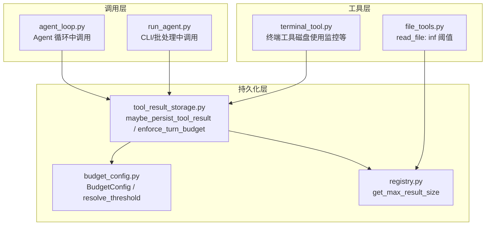
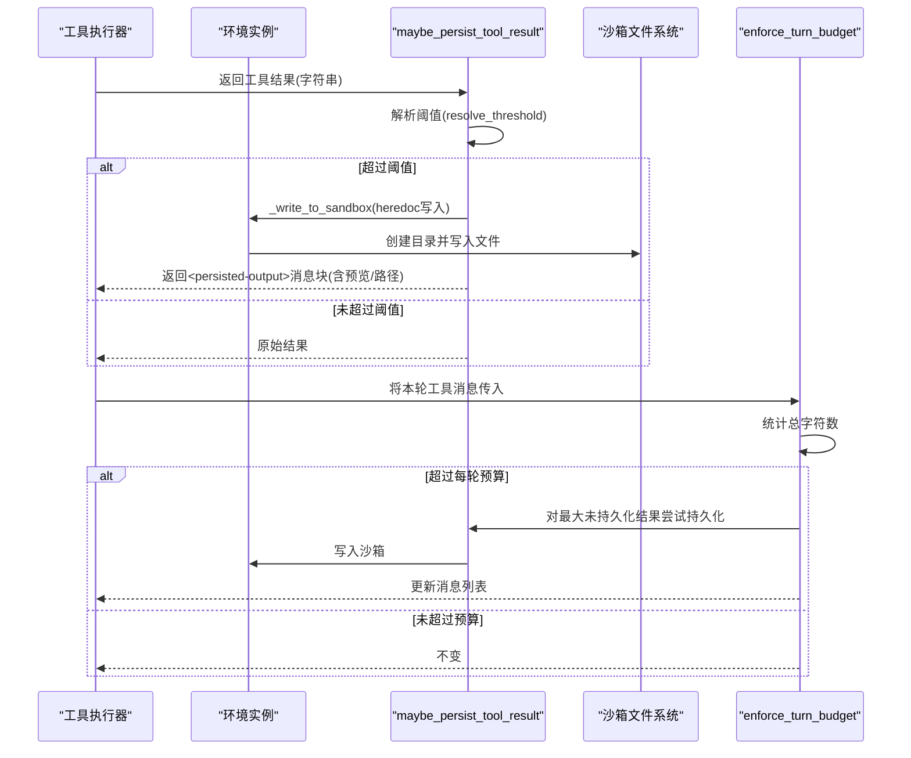
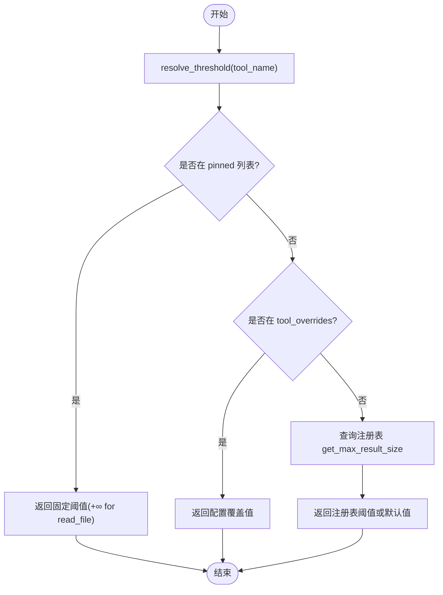
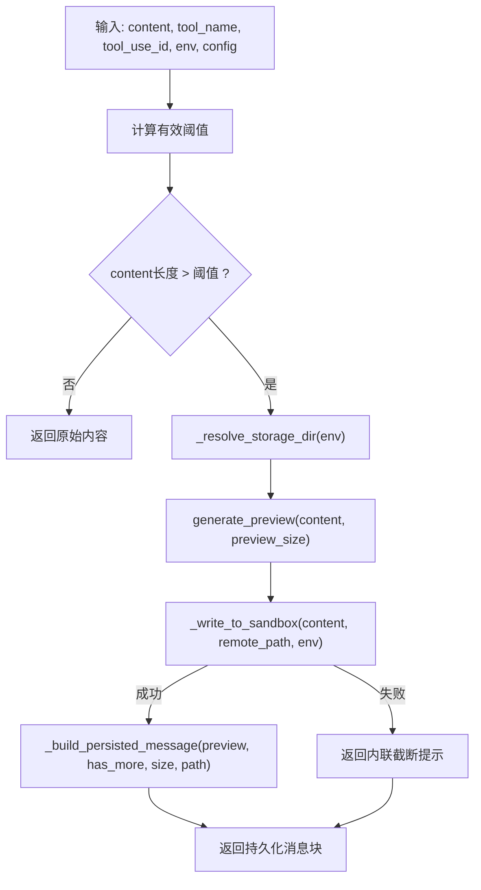
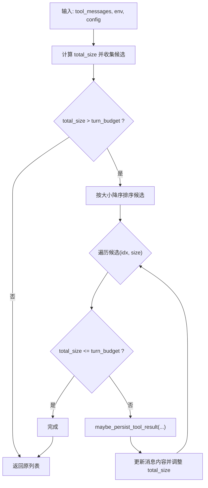
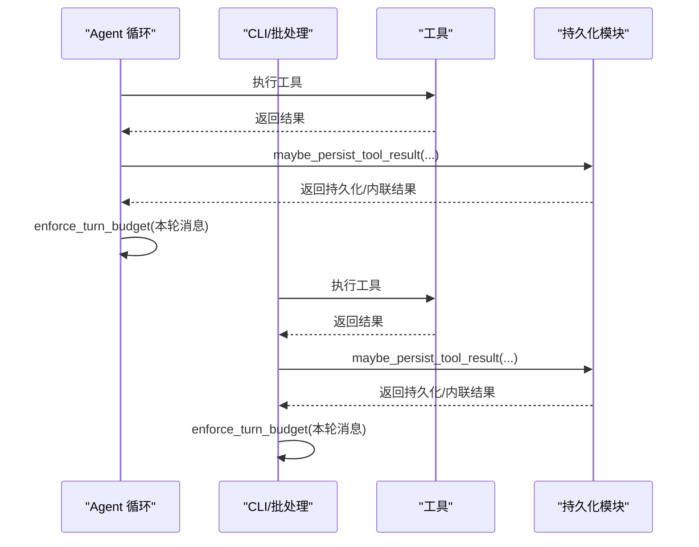
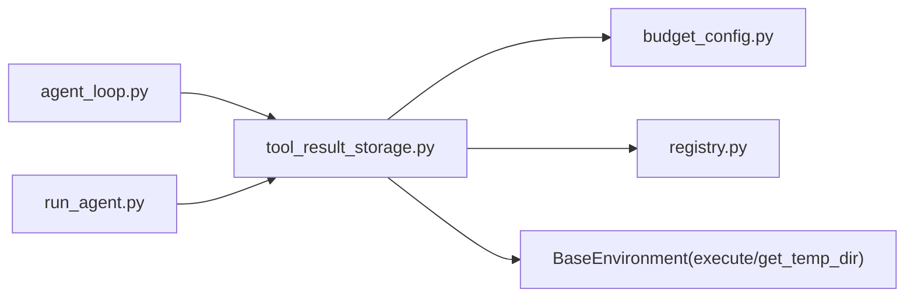

# 工具结果持久化

<cite>
**本文引用的文件**
- [tools/tool_result_storage.py](file://tools/tool_result_storage.py)
- [tools/budget_config.py](file://tools/budget_config.py)
- [tools/registry.py](file://tools/registry.py)
- [environments/agent_loop.py](file://environments/agent_loop.py)
- [run_agent.py](file://run_agent.py)
- [tests/tools/test_tool_result_storage.py](file://tests/tools/test_tool_result_storage.py)
- [tests/tools/test_budget_config.py](file://tests/tools/test_budget_config.py)
- [tools/terminal_tool.py](file://tools/terminal_tool.py)
- [tools/file_tools.py](file://tools/file_tools.py)
</cite>

## 目录
1. [简介](#简介)
2. [项目结构](#项目结构)
3. [核心组件](#核心组件)
4. [架构总览](#架构总览)
5. [详细组件分析](#详细组件分析)
6. [依赖分析](#依赖分析)
7. [性能考量](#性能考量)
8. [故障排查指南](#故障排查指南)
9. [结论](#结论)
10. [附录](#附录)

## 简介
本文件系统性阐述 Hermes Agent 的“工具结果持久化”体系，覆盖三层防护机制：单工具输出上限、单轮聚合预算、以及沙箱内临时文件持久化。重点说明：
- 存储策略与持久化流程（预览截断、Herderoc 写入、路径生成）
- 结果缓存与临时文件管理（沙箱目录解析、环境隔离）
- 长期存储方案（通过 read_file 工具按需读取）
- 序列化与完整性（文本预览、大小提示、标签包裹）
- 性能优化与空间管理（阈值优先级、逐轮预算、最小化上下文占用）
- 安全与可靠性（命令注入防护、只读 read_file、清理策略）

## 项目结构
与工具结果持久化直接相关的模块与调用点如下：
- 持久化核心：tools/tool_result_storage.py
- 预算配置：tools/budget_config.py
- 注册中心：tools/registry.py
- 调用入口（Agent 循环）：environments/agent_loop.py
- 调用入口（CLI/批处理）：run_agent.py
- 测试用例：tests/tools/test_tool_result_storage.py、tests/tools/test_budget_config.py
- 工具阈值注册：tools/file_tools.py、tools/terminal_tool.py

**图表来源**
- [tools/tool_result_storage.py:116-227](file://tools/tool_result_storage.py#L116-L227)
- [tools/budget_config.py:23-53](file://tools/budget_config.py#L23-L53)
- [tools/registry.py:172-180](file://tools/registry.py#L172-L180)
- [environments/agent_loop.py:457-480](file://environments/agent_loop.py#L457-L480)
- [run_agent.py:6980-7004](file://run_agent.py#L6980-L7004)
- [run_agent.py:7303-7349](file://run_agent.py#L7303-L7349)
- [tools/file_tools.py:831-834](file://tools/file_tools.py#L831-L834)
- [tools/terminal_tool.py:85-112](file://tools/terminal_tool.py#L85-L112)

**章节来源**
- [tools/tool_result_storage.py:1-227](file://tools/tool_result_storage.py#L1-L227)
- [tools/budget_config.py:1-53](file://tools/budget_config.py#L1-L53)
- [tools/registry.py:1-200](file://tools/registry.py#L1-L200)
- [environments/agent_loop.py:457-480](file://environments/agent_loop.py#L457-L480)
- [run_agent.py:6980-7004](file://run_agent.py#L6980-L7004)
- [run_agent.py:7303-7349](file://run_agent.py#L7303-L7349)
- [tools/file_tools.py:831-834](file://tools/file_tools.py#L831-L834)
- [tools/terminal_tool.py:85-112](file://tools/terminal_tool.py#L85-L112)

## 核心组件
- 预算配置（BudgetConfig）
  - 提供默认阈值、每轮预算、预览大小
  - 解析工具阈值优先级：固定值（pinned）> 配置覆盖 > 注册表 > 默认
- 注册中心（ToolRegistry）
  - 每个工具可声明最大结果字符数；read_file 固定返回无穷大
- 单结果持久化（maybe_persist_tool_result）
  - 当内容长度超过阈值时，写入沙箱临时目录并返回“已持久化”消息块
  - 否则原样返回
- 每轮预算强制（enforce_turn_budget）
  - 对一轮内所有工具结果进行聚合统计，按大小排序，优先持久化最大的未持久化结果，直到低于预算
- 沙箱写入与预览
  - Heredoc 分隔符自适应避免冲突
  - 预览按换行边界截断，确保语义完整

**章节来源**
- [tools/budget_config.py:23-53](file://tools/budget_config.py#L23-L53)
- [tools/registry.py:172-180](file://tools/registry.py#L172-L180)
- [tools/tool_result_storage.py:116-227](file://tools/tool_result_storage.py#L116-L227)

## 架构总览
下图展示了从工具执行到结果持久化的端到端流程，包括阈值解析、沙箱写入、预览构建与每轮预算强制。

**图表来源**
- [tools/tool_result_storage.py:116-227](file://tools/tool_result_storage.py#L116-L227)
- [tools/budget_config.py:38-48](file://tools/budget_config.py#L38-L48)
- [tools/registry.py:172-180](file://tools/registry.py#L172-L180)
- [environments/agent_loop.py:476-480](file://environments/agent_loop.py#L476-L480)
- [run_agent.py:6980-7004](file://run_agent.py#L6980-L7004)
- [run_agent.py:7303-7349](file://run_agent.py#L7303-L7349)

## 详细组件分析

### 组件A：阈值解析与预算配置
- 预算配置（BudgetConfig）
  - default_result_size、turn_budget、preview_size
  - resolve_threshold 优先级链：pinned > tool_overrides > registry > default
- 注册中心（ToolRegistry）
  - 每个工具可设置 max_result_size_chars
  - read_file 默认返回无穷大，防止无限循环
- 测试验证
  - 自定义 BudgetConfig 可覆盖默认值
  - 优先级链行为符合预期

**图表来源**
- [tools/budget_config.py:38-48](file://tools/budget_config.py#L38-L48)
- [tools/registry.py:172-180](file://tools/registry.py#L172-L180)
- [tests/tools/test_budget_config.py:137-176](file://tests/tools/test_budget_config.py#L137-L176)

**章节来源**
- [tools/budget_config.py:23-53](file://tools/budget_config.py#L23-L53)
- [tools/registry.py:172-180](file://tools/registry.py#L172-L180)
- [tests/tools/test_budget_config.py:117-176](file://tests/tools/test_budget_config.py#L117-L176)

### 组件B：单结果持久化（maybe_persist_tool_result）
- 功能要点
  - 预览生成：按换行边界截断，保留语义完整
  - Heredoc 写入：自动选择分隔符，避免与内容冲突
  - 沙箱目录解析：优先使用环境提供的临时目录，否则回退到默认路径
  - 失败降级：无法写入时返回内联截断提示
- 关键路径
  - _resolve_storage_dir
  - generate_preview
  - _heredoc_marker
  - _write_to_sandbox
  - _build_persisted_message

**图表来源**
- [tools/tool_result_storage.py:116-173](file://tools/tool_result_storage.py#L116-L173)
- [tools/tool_result_storage.py:44-57](file://tools/tool_result_storage.py#L44-L57)
- [tools/tool_result_storage.py:60-68](file://tools/tool_result_storage.py#L60-L68)
- [tools/tool_result_storage.py:71-76](file://tools/tool_result_storage.py#L71-L76)
- [tools/tool_result_storage.py:78-88](file://tools/tool_result_storage.py#L78-L88)
- [tools/tool_result_storage.py:91-113](file://tools/tool_result_storage.py#L91-L113)

**章节来源**
- [tools/tool_result_storage.py:116-173](file://tools/tool_result_storage.py#L116-L173)
- [tests/tools/test_tool_result_storage.py:29-66](file://tests/tools/test_tool_result_storage.py#L29-L66)
- [tests/tools/test_tool_result_storage.py:68-80](file://tests/tools/test_tool_result_storage.py#L68-L80)
- [tests/tools/test_tool_result_storage.py:82-154](file://tests/tools/test_tool_result_storage.py#L82-L154)
- [tests/tools/test_tool_result_storage.py:156-164](file://tests/tools/test_tool_result_storage.py#L156-L164)

### 组件C：每轮预算强制（enforce_turn_budget）
- 功能要点
  - 统计本轮所有工具结果总字符数
  - 若超出 turn_budget，则按大小降序对未持久化结果进行“尝试持久化”
  - 已持久化的结果不再重复持久化
- 关键路径
  - 遍历消息，收集候选
  - 排序后逐个尝试 maybe_persist_tool_result
  - 在原地更新消息内容

**图表来源**
- [tools/tool_result_storage.py:175-227](file://tools/tool_result_storage.py#L175-L227)

**章节来源**
- [tools/tool_result_storage.py:175-227](file://tools/tool_result_storage.py#L175-L227)
- [tests/tools/test_tool_result_storage.py:482-492](file://tests/tools/test_tool_result_storage.py#L482-L492)
- [tests/tools/test_tool_result_storage.py:494-513](file://tests/tools/test_tool_result_storage.py#L494-L513)

### 组件D：调用集成（Agent 循环与 CLI）
- Agent 循环
  - 在工具调用完成后立即执行 maybe_persist_tool_result
  - 对本轮工具消息执行 enforce_turn_budget
- CLI/批处理
  - 同样在工具完成后调用 maybe_persist_tool_result
  - 对本轮工具消息执行 enforce_turn_budget

**图表来源**
- [environments/agent_loop.py:457-480](file://environments/agent_loop.py#L457-L480)
- [run_agent.py:6980-7004](file://run_agent.py#L6980-L7004)
- [run_agent.py:7303-7349](file://run_agent.py#L7303-L7349)

**章节来源**
- [environments/agent_loop.py:457-480](file://environments/agent_loop.py#L457-L480)
- [run_agent.py:6980-7004](file://run_agent.py#L6980-L7004)
- [run_agent.py:7303-7349](file://run_agent.py#L7303-L7349)

### 组件E：工具阈值注册与 read_file 特例
- read_file 使用无穷大阈值，确保不会被持久化，避免“持久化→读取→再持久化”的死循环
- 其他文件类工具通常设置为 100K 字符左右，平衡上下文占用与实用性

**章节来源**
- [tools/registry.py:172-180](file://tools/registry.py#L172-L180)
- [tools/file_tools.py:831-834](file://tools/file_tools.py#L831-L834)

## 依赖分析
- 模块耦合
  - tool_result_storage.py 依赖 budget_config.py（阈值与预算）、registry.py（工具阈值解析）
  - 调用方（agent_loop.py、run_agent.py）仅依赖 tool_result_storage.py 的公共接口
- 外部依赖
  - 环境实例 env 提供 get_temp_dir 与 execute，用于沙箱写入
  - 注册表 registry 提供 per-tool 阈值

**图表来源**
- [tools/tool_result_storage.py:30-34](file://tools/tool_result_storage.py#L30-L34)
- [tools/budget_config.py:38-48](file://tools/budget_config.py#L38-L48)
- [tools/registry.py:172-180](file://tools/registry.py#L172-L180)
- [environments/agent_loop.py:457-464](file://environments/agent_loop.py#L457-L464)
- [run_agent.py:6980-6986](file://run_agent.py#L6980-L6986)

**章节来源**
- [tools/tool_result_storage.py:30-34](file://tools/tool_result_storage.py#L30-L34)
- [tools/budget_config.py:38-48](file://tools/budget_config.py#L38-L48)
- [tools/registry.py:172-180](file://tools/registry.py#L172-L180)
- [environments/agent_loop.py:457-464](file://environments/agent_loop.py#L457-L464)
- [run_agent.py:6980-6986](file://run_agent.py#L6980-L6986)

## 性能考量
- 阈值优先级与最小化上下文占用
  - 通过 resolve_threshold 的优先级链，允许针对高产工具降低阈值，减少上下文压力
- 预览截断与换行边界
  - 预览按换行截断，避免在中间打断语义，提升可读性
- 每轮预算强制
  - 以“最大未持久化结果”优先持久化，快速回收上下文空间
- 沙箱写入的安全性
  - heredoc 分隔符自适应；路径与命令参数经 shlex.quote 处理，防止注入
- 磁盘使用监控（终端工具）
  - 终端工具内置磁盘使用检查，超阈值给出告警，便于用户清理

**章节来源**
- [tools/tool_result_storage.py:60-68](file://tools/tool_result_storage.py#L60-L68)
- [tools/tool_result_storage.py:71-76](file://tools/tool_result_storage.py#L71-L76)
- [tools/tool_result_storage.py:78-88](file://tools/tool_result_storage.py#L78-L88)
- [tools/terminal_tool.py:85-112](file://tools/terminal_tool.py#L85-L112)

## 故障排查指南
- 沙箱写入失败
  - 现象：返回内联截断提示
  - 排查：确认 env.execute 是否可用、权限是否足够、磁盘空间是否充足
  - 参考测试：_write_to_sandbox 的失败场景
- heredoc 冲突
  - 现象：默认分隔符被内容包含
  - 处理：自动切换为基于 UUID 的唯一分隔符
  - 参考测试：_heredoc_marker 的冲突处理
- 预览不完整或被截断
  - 现象：预览末尾出现省略号
  - 处理：增大 preview_size 或使用 read_file 分段读取
  - 参考测试：generate_preview 的边界行为
- 每轮预算仍溢出
  - 现象：total_size 仍高于 turn_budget
  - 处理：检查是否存在大量中等规模未持久化结果；适当降低 per-tool 阈值或 turn_budget
  - 参考测试：enforce_turn_budget 的行为验证

**章节来源**
- [tests/tools/test_tool_result_storage.py:82-154](file://tests/tools/test_tool_result_storage.py#L82-L154)
- [tests/tools/test_tool_result_storage.py:68-80](file://tests/tools/test_tool_result_storage.py#L68-L80)
- [tests/tools/test_tool_result_storage.py:29-66](file://tests/tools/test_tool_result_storage.py#L29-L66)
- [tests/tools/test_tool_result_storage.py:482-492](file://tests/tools/test_tool_result_storage.py#L482-L492)

## 结论
该持久化体系通过“工具阈值 + 每轮预算 + 沙箱持久化”三层机制，有效缓解了大结果导致的上下文溢出问题。其设计强调：
- 可配置性：阈值解析链路支持多级覆盖
- 安全性：命令注入防护、只读 read_file、环境隔离
- 可观测性：预览与大小提示、日志记录
- 可维护性：清晰的职责分离与测试覆盖

## 附录

### A. 代码示例：结果存储与检索完整流程（步骤化）
- 步骤1：工具执行完成，获得原始结果字符串
- 步骤2：maybe_persist_tool_result(content, tool_name, tool_use_id, env, config)
  - 计算阈值并比较长度
  - 若超过阈值：写入沙箱（heredoc），返回“已持久化”消息块（含预览与路径）
  - 若未超过：原样返回
- 步骤3：enforce_turn_budget(本轮工具消息, env, config)
  - 统计总字符数，若超预算，按大小优先对未持久化结果尝试持久化
- 步骤4：模型侧通过 read_file 工具按需读取完整内容（read_file 阈值为无穷大，不会被持久化）

**章节来源**
- [tools/tool_result_storage.py:116-227](file://tools/tool_result_storage.py#L116-L227)
- [tools/file_tools.py:831-834](file://tools/file_tools.py#L831-L834)

### B. 数据完整性与序列化
- 文本预览：按换行边界截断，保留语义
- 文件路径：基于 tool_use_id 的唯一文件名，位于沙箱临时目录
- 标签包裹：使用固定标签对“已持久化”消息块进行结构化标识，便于解析与渲染
- 读取机制：通过 read_file 工具按偏移与限制读取指定片段，避免一次性加载全部内容

**章节来源**
- [tools/tool_result_storage.py:91-113](file://tools/tool_result_storage.py#L91-L113)
- [tools/file_tools.py:831-834](file://tools/file_tools.py#L831-L834)

### C. 与工具执行控制、内存与磁盘空间的集成
- 工具执行控制：终端工具内置危险命令检测与磁盘使用监控，超阈值告警
- 内存管理：通过阈值与预览减少上下文中的大对象驻留
- 磁盘空间：沙箱目录由环境提供，支持 Termux 等不同平台；建议定期清理 hermes-results 目录

**章节来源**
- [tools/terminal_tool.py:85-112](file://tools/terminal_tool.py#L85-L112)
- [tools/tool_result_storage.py:44-57](file://tools/tool_result_storage.py#L44-L57)

### D. 安全考虑、备份与恢复
- 安全
  - heredoc 自适应分隔符，避免内容冲突
  - 路径与命令参数经 shlex.quote 处理，防止注入
  - read_file 为只读工具，避免意外修改
- 备份与恢复
  - 沙箱内的持久化文件即为“备份”，可通过 read_file 读取
  - 建议在任务结束后清理 hermes-results 目录，或在需要时手动归档

**章节来源**
- [tests/tools/test_tool_result_storage.py:102-154](file://tests/tools/test_tool_result_storage.py#L102-L154)
- [tools/file_tools.py:831-834](file://tools/file_tools.py#L831-L834)