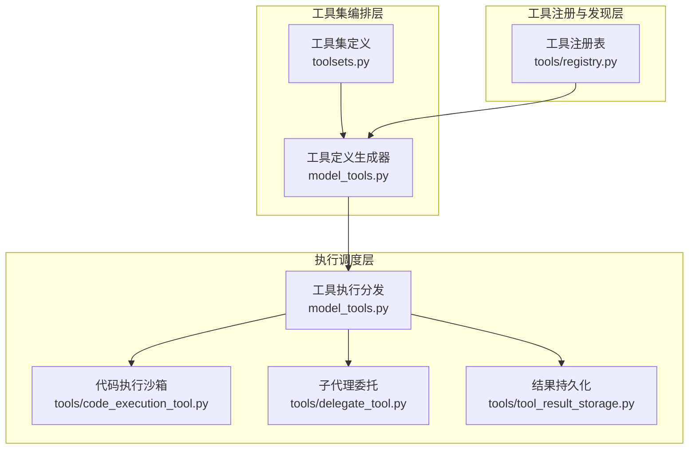
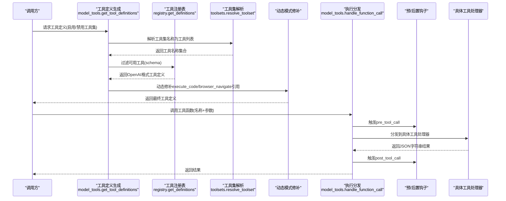
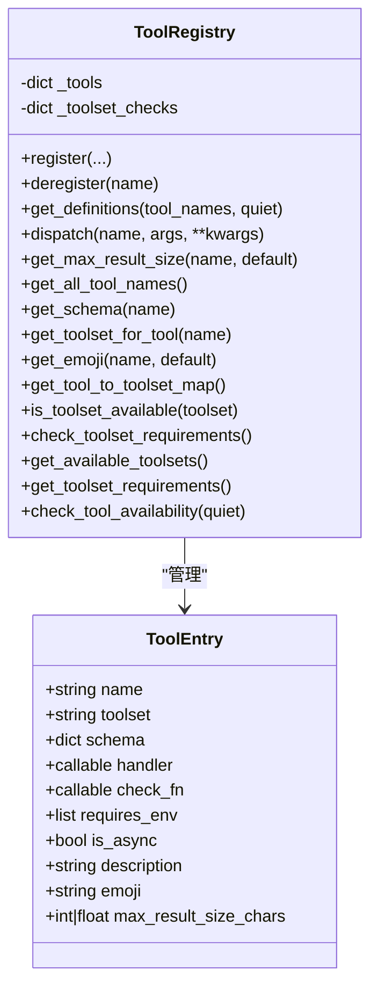
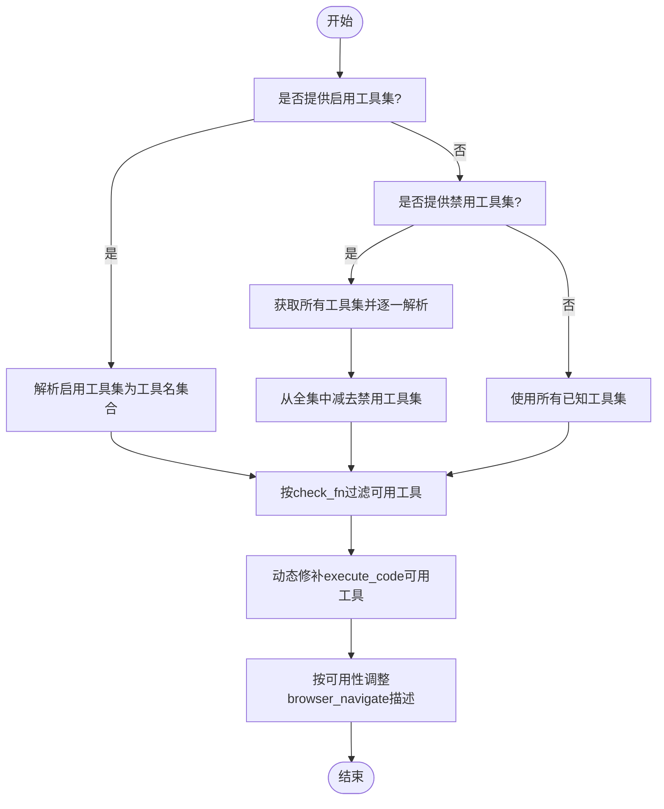
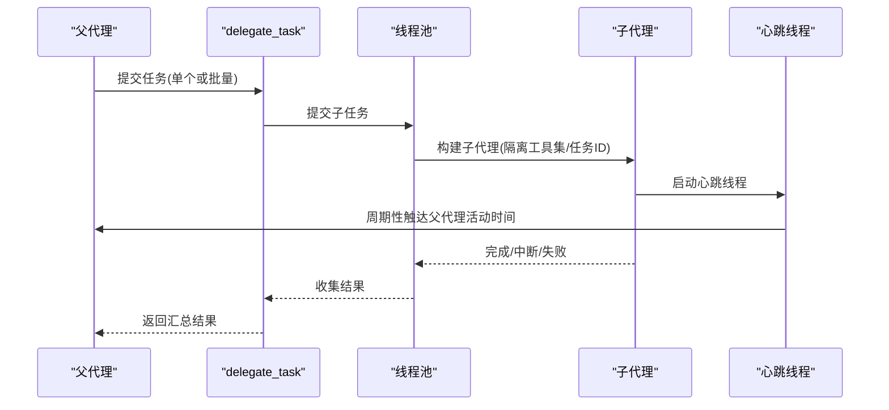
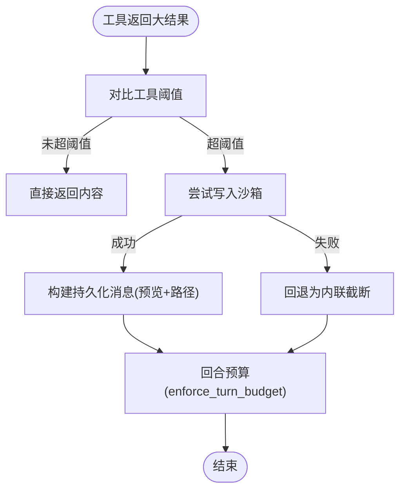
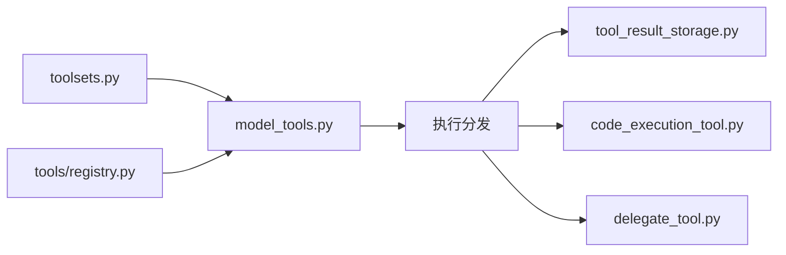

# 工具调用系统

<cite>
**本文档引用的文件**
- [toolsets.py](file://toolsets.py)
- [model_tools.py](file://model_tools.py)
- [tools/registry.py](file://tools/registry.py)
- [tools/tool_result_storage.py](file://tools/tool_result_storage.py)
- [tools/code_execution_tool.py](file://tools/code_execution_tool.py)
- [tools/delegate_tool.py](file://tools/delegate_tool.py)
- [tools/web_tools.py](file://tools/web_tools.py)
- [tools/terminal_tool.py](file://tools/terminal_tool.py)
- [tools/file_tools.py](file://tools/file_tools.py)
- [tools/path_security.py](file://tools/path_security.py)
- [agent/retry_utils.py](file://agent/retry_utils.py)
- [tools/budget_config.py](file://tools/budget_config.py)
</cite>

## 目录
1. [简介](#简介)
2. [项目结构](#项目结构)
3. [核心组件](#核心组件)
4. [架构总览](#架构总览)
5. [详细组件分析](#详细组件分析)
6. [依赖分析](#依赖分析)
7. [性能考虑](#性能考虑)
8. [故障排查指南](#故障排查指南)
9. [结论](#结论)
10. [附录](#附录)

## 简介
本文件系统性阐述 Hermes Agent 的工具调用系统，覆盖工具发现机制、工具集过滤、工具执行流程、并行工具执行、路径作用域工具与并发安全控制、工具参数验证、结果存储与持久化、执行超时与错误处理及重试策略，并通过序列图与类图展示关键流程与数据流。目标是帮助开发者与使用者在不深入源码的前提下，理解工具调用的完整生命周期与最佳实践。

## 项目结构
工具调用系统由三层组成：
- 工具注册与发现层：集中于工具注册表，负责收集各工具的模式与处理器。
- 工具集编排层：基于工具集（toolset）进行筛选与动态模式修补，输出模型可用的工具定义。
- 执行调度层：统一调度工具执行，支持同步/异步桥接、参数类型强制、错误捕获与钩子扩展。



**图表来源**
- [toolsets.py:1-656](file://toolsets.py#L1-L656)
- [model_tools.py:1-578](file://model_tools.py#L1-L578)
- [tools/registry.py:1-336](file://tools/registry.py#L1-L336)
- [tools/code_execution_tool.py:1-800](file://tools/code_execution_tool.py#L1-L800)
- [tools/delegate_tool.py:1-800](file://tools/delegate_tool.py#L1-L800)
- [tools/tool_result_storage.py:1-227](file://tools/tool_result_storage.py#L1-L227)

**章节来源**
- [toolsets.py:1-656](file://toolsets.py#L1-L656)
- [model_tools.py:1-578](file://model_tools.py#L1-L578)
- [tools/registry.py:1-336](file://tools/registry.py#L1-L336)

## 核心组件
- 工具注册表（ToolRegistry）：集中管理工具元数据、可用性检查、模式生成与分发。
- 工具集（Toolsets）：以可组合的方式定义工具集合，支持继承与别名解析。
- 工具定义生成器（model_tools.get_tool_definitions）：根据启用/禁用工具集，结合可用性检查与动态模式修补，输出 OpenAI 兼容的工具定义。
- 工具执行分发（model_tools.handle_function_call）：统一入口，执行参数类型强制、预/后置钩子、代理环特殊工具拦截与结果返回。
- 结果持久化（tool_result_storage）：三层防御（单工具阈值、会话级持久化、回合预算），避免上下文溢出。
- 并行与沙箱（code_execution_tool、delegate_tool）：本地 UDS 或远程文件 RPC 沙箱；线程池并行执行多个子任务。
- 参数验证与路径安全（path_security、file_tools、terminal_tool）：路径合法性校验、危险命令审批、工作目录白名单等。

**章节来源**
- [tools/registry.py:48-290](file://tools/registry.py#L48-L290)
- [toolsets.py:66-391](file://toolsets.py#L66-L391)
- [model_tools.py:234-354](file://model_tools.py#L234-L354)
- [model_tools.py:459-549](file://model_tools.py#L459-L549)
- [tools/tool_result_storage.py:1-227](file://tools/tool_result_storage.py#L1-L227)
- [tools/code_execution_tool.py:1-800](file://tools/code_execution_tool.py#L1-L800)
- [tools/delegate_tool.py:1-800](file://tools/delegate_tool.py#L1-L800)
- [tools/path_security.py:1-44](file://tools/path_security.py#L1-L44)
- [tools/file_tools.py:1-200](file://tools/file_tools.py#L1-L200)
- [tools/terminal_tool.py:1-200](file://tools/terminal_tool.py#L1-L200)

## 架构总览
工具调用从“工具定义生成”到“执行与持久化”的端到端流程如下：



**图表来源**
- [model_tools.py:234-354](file://model_tools.py#L234-L354)
- [tools/registry.py:116-143](file://tools/registry.py#L116-L143)
- [toolsets.py:410-467](file://toolsets.py#L410-L467)
- [model_tools.py:501-541](file://model_tools.py#L501-L541)

## 详细组件分析

### 工具发现与注册机制
- 注册表（ToolRegistry）维护工具条目（ToolEntry），包含名称、工具集、模式、处理器、可用性检查、异步标记、最大结果尺寸等。
- 工具模块在导入时调用注册表的 register，完成工具的自描述与可用性声明。
- 可用性检查（check_fn）失败的工具不会出现在最终工具定义中；注册表还维护工具集级别的检查函数映射。



**图表来源**
- [tools/registry.py:24-111](file://tools/registry.py#L24-L111)
- [tools/registry.py:48-290](file://tools/registry.py#L48-L290)

**章节来源**
- [tools/registry.py:48-290](file://tools/registry.py#L48-L290)

### 工具集过滤与动态模式修补
- 启用/禁用工具集：优先使用启用列表，否则基于禁用列表排除；若两者都为空则包含全部已知工具集。
- 工具集解析：递归展开复合工具集，去重合并；支持插件动态注册的工具集。
- 动态模式修补：针对 execute_code 仅列出实际可用的沙箱工具；当 web_search/web_extract 不可用时，移除 browser_navigate 描述中的相关提示，防止模型“幻觉”。



**图表来源**
- [model_tools.py:252-353](file://model_tools.py#L252-L353)
- [toolsets.py:410-467](file://toolsets.py#L410-L467)

**章节来源**
- [model_tools.py:234-354](file://model_tools.py#L234-L354)
- [toolsets.py:410-467](file://toolsets.py#L410-L467)

### 工具执行流程与并发控制
- 统一分发：handle_function_call 对非读取/搜索类工具调用，通知文件工具重置连续读计数；对代理环特殊工具（todo/memory/session_search/delegate_task）直接返回错误提示。
- 钩子扩展：执行前后触发 pre_tool_call/post_tool_call 钩子，便于审计与可观测性。
- 类型强制：对字符串参数尝试按 JSON Schema 强制为整数/浮点/布尔，提升健壮性。
- 异步桥接：registry.dispatch 与 model_tools._run_async 统一处理异步工具，避免“事件循环已关闭”问题；子线程使用独立事件循环，避免竞争。

```mermaid
sequenceDiagram
participant Agent as "代理环"
participant MT as "handle_function_call"
participant Hook as "pre_tool_call钩子"
participant Reg as "registry.dispatch"
participant Exec as "_run_async(异步)"
participant Tool as "工具处理器"
Agent->>MT : 调用工具(名称, 参数, 任务ID)
MT->>Hook : 触发pre_tool_call
alt 特殊工具
MT-->>Agent : 返回错误提示
else 正常工具
MT->>Reg : 分发到处理器
opt 异步工具
Reg->>Exec : 在持久事件循环运行
Exec->>Tool : 执行协程
Tool-->>Exec : 返回结果
Exec-->>Reg : JSON字符串
else 同步工具
Reg->>Tool : 直接调用
Tool-->>Reg : 返回JSON字符串
end
Reg-->>MT : 结果
MT->>Hook : 触发post_tool_call
MT-->>Agent : 返回结果
end
```

**图表来源**
- [model_tools.py:459-549](file://model_tools.py#L459-L549)
- [tools/registry.py:149-167](file://tools/registry.py#L149-L167)
- [model_tools.py:81-126](file://model_tools.py#L81-L126)

**章节来源**
- [model_tools.py:459-549](file://model_tools.py#L459-L549)
- [tools/registry.py:149-167](file://tools/registry.py#L149-L167)
- [model_tools.py:81-126](file://model_tools.py#L81-L126)

### 并行工具执行与路径作用域工具
- 子代理委托（delegate_task）：支持单任务与批量任务并行执行，使用线程池限制并发数量；每个子代理拥有隔离的任务ID、受限工具集与独立系统提示词；支持心跳保活，避免网关空闲超时。
- 路径作用域工具：文件与终端工具均提供路径合法性校验与工作目录白名单，防止越权访问与注入风险；终端工具对危险命令进行审批与阻断。



**图表来源**
- [tools/delegate_tool.py:623-800](file://tools/delegate_tool.py#L623-L800)

**章节来源**
- [tools/delegate_tool.py:1-800](file://tools/delegate_tool.py#L1-L800)
- [tools/path_security.py:15-43](file://tools/path_security.py#L15-L43)
- [tools/terminal_tool.py:148-200](file://tools/terminal_tool.py#L148-L200)
- [tools/file_tools.py:99-126](file://tools/file_tools.py#L99-L126)

### 工具参数验证与类型强制
- 类型强制：对字符串参数尝试转换为整数/浮点/布尔，支持联合类型；失败时保留原值，避免破坏调用。
- 路径验证：提供路径必须位于允许根目录内的校验函数，阻止路径穿越；快速检测“..”组件。
- 危险命令与敏感路径：终端工具对危险命令进行审批；写入敏感系统路径前阻断。

**章节来源**
- [model_tools.py:372-457](file://model_tools.py#L372-L457)
- [tools/path_security.py:15-43](file://tools/path_security.py#L15-L43)
- [tools/terminal_tool.py:148-200](file://tools/terminal_tool.py#L148-L200)
- [tools/file_tools.py:99-126](file://tools/file_tools.py#L99-L126)

### 结果存储与持久化机制
- 三层防御：
  1) 单工具输出上限：工具内部预截断。
  2) 会话级持久化：超过阈值时写入沙箱临时目录，返回预览与文件路径引用，模型可通过 read_file 访问全文。
  3) 回合预算：对一轮内所有工具结果进行聚合预算控制，优先持久化最大的未持久化结果，直至低于预算。
- 预览与标签：持久化消息包含大小信息、路径与预览，便于模型定位与按需读取。



**图表来源**
- [tools/tool_result_storage.py:116-227](file://tools/tool_result_storage.py#L116-L227)
- [tools/budget_config.py:23-53](file://tools/budget_config.py#L23-L53)

**章节来源**
- [tools/tool_result_storage.py:1-227](file://tools/tool_result_storage.py#L1-L227)
- [tools/budget_config.py:1-53](file://tools/budget_config.py#L1-L53)

### 工具执行超时、错误处理与重试策略
- 代码执行沙箱：本地 UDS 与远程文件 RPC 均设置工具调用上限与超时；远程执行要求后端具备 Python3。
- 错误处理：工具执行异常被捕获并统一为 JSON 错误字符串；注册表与执行分发层均做异常兜底。
- 重试策略：采用去相关抖动退避算法，避免多个会话同时重试导致“惊群效应”，并支持从错误上下文中解析重置时间或延迟。

**章节来源**
- [tools/code_execution_tool.py:706-800](file://tools/code_execution_tool.py#L706-L800)
- [tools/registry.py:149-167](file://tools/registry.py#L149-L167)
- [agent/retry_utils.py:19-58](file://agent/retry_utils.py#L19-L58)

### 与工具注册表、结果存储与并发控制的集成关系
- 工具注册表提供统一的模式与处理器入口，工具定义生成器基于其进行过滤与修补；执行分发层通过其完成调度。
- 结果持久化在工具执行后介入，依据预算配置决定是否持久化；回合预算在多工具结果汇聚阶段生效。
- 并发控制通过线程池与事件循环持久化策略实现：delegate_tool 使用 ThreadPoolExecutor 控制并发；model_tools 为异步工具提供持久化事件循环，避免“事件循环已关闭”。

**章节来源**
- [model_tools.py:172-185](file://model_tools.py#L172-L185)
- [tools/delegate_tool.py:741-751](file://tools/delegate_tool.py#L741-L751)
- [model_tools.py:81-126](file://model_tools.py#L81-L126)

## 依赖分析
- 工具集定义与解析：toolsets.py 提供静态与动态工具集，model_tools.py 在生成工具定义时调用其解析函数。
- 注册表依赖：model_tools 依赖 tools/registry.py 获取工具定义与可用性检查；工具模块在导入时注册自身。
- 执行与持久化：model_tools 调度执行；结果持久化在工具返回后按预算策略介入；代码执行沙箱与委托工具分别在本地与远程环境下运行。



**图表来源**
- [toolsets.py:410-467](file://toolsets.py#L410-L467)
- [model_tools.py:234-354](file://model_tools.py#L234-L354)
- [tools/registry.py:116-143](file://tools/registry.py#L116-L143)
- [tools/tool_result_storage.py:116-227](file://tools/tool_result_storage.py#L116-L227)
- [tools/code_execution_tool.py:307-425](file://tools/code_execution_tool.py#L307-L425)
- [tools/delegate_tool.py:741-751](file://tools/delegate_tool.py#L741-L751)

**章节来源**
- [toolsets.py:410-467](file://toolsets.py#L410-L467)
- [model_tools.py:234-354](file://model_tools.py#L234-L354)
- [tools/registry.py:116-143](file://tools/registry.py#L116-L143)
- [tools/tool_result_storage.py:116-227](file://tools/tool_result_storage.py#L116-L227)
- [tools/code_execution_tool.py:307-425](file://tools/code_execution_tool.py#L307-L425)
- [tools/delegate_tool.py:741-751](file://tools/delegate_tool.py#L741-L751)

## 性能考虑
- 事件循环复用：避免频繁创建/销毁事件循环，减少“事件循环已关闭”异常与客户端清理开销。
- 并发限制：delegate_task 通过线程池限制并发子任务数量，避免资源争用；远程 RPC 轮询采用指数退避与抖动，降低后端压力。
- 结果预算：分层预算策略减少上下文窗口占用，提高吞吐；持久化优先选择最大收益的结果，平衡成本与信息完整性。
- 参数类型强制：减少因类型不匹配导致的重试与错误恢复成本。

[本节为通用指导，无需特定文件来源]

## 故障排查指南
- 工具不可用：检查工具集可用性与 check_fn 是否抛出异常；查看 model_tools.check_toolset_requirements 与 registry.check_tool_availability 的输出。
- 执行失败：查看工具返回的 JSON 错误字符串；确认 pre_tool_call/post_tool_call 钩子是否引发异常。
- 超时与重试：确认代码执行沙箱超时配置；使用去相关抖动退避策略，必要时从错误上下文提取重置时间。
- 路径与权限：核对路径是否越权；终端工具的危险命令审批与敏感路径写入阻断。

**章节来源**
- [tools/registry.py:224-286](file://tools/registry.py#L224-L286)
- [model_tools.py:545-549](file://model_tools.py#L545-L549)
- [agent/retry_utils.py:19-58](file://agent/retry_utils.py#L19-L58)
- [tools/terminal_tool.py:148-200](file://tools/terminal_tool.py#L148-L200)
- [tools/file_tools.py:99-126](file://tools/file_tools.py#L99-L126)

## 结论
Hermes Agent 的工具调用系统通过“工具注册表 + 工具集编排 + 统一分发”的架构，实现了高可扩展、强安全与高可靠的工具生态。配合三层结果持久化、去相关抖动重试与路径/命令安全控制，既能满足复杂任务的多工具协同，又能在大规模并发下保持稳定与高效。

[本节为总结，无需特定文件来源]

## 附录
- 示例参考（以路径代替代码片段）：
  - 工具定义生成：[model_tools.py:234-354](file://model_tools.py#L234-L354)
  - 工具执行分发：[model_tools.py:459-549](file://model_tools.py#L459-L549)
  - 注册表注册与分发：[tools/registry.py:59-167](file://tools/registry.py#L59-L167)
  - 结果持久化与回合预算：[tools/tool_result_storage.py:116-227](file://tools/tool_result_storage.py#L116-L227)
  - 代码执行沙箱（本地/远程）：[tools/code_execution_tool.py:307-800](file://tools/code_execution_tool.py#L307-L800)
  - 子代理委托并行执行：[tools/delegate_tool.py:731-794](file://tools/delegate_tool.py#L731-L794)
  - 路径安全与危险命令审批：[tools/path_security.py:15-43](file://tools/path_security.py#L15-L43)、[tools/terminal_tool.py:148-200](file://tools/terminal_tool.py#L148-L200)
  - 重试策略：[agent/retry_utils.py:19-58](file://agent/retry_utils.py#L19-L58)

[本节为补充说明，无需特定文件来源]