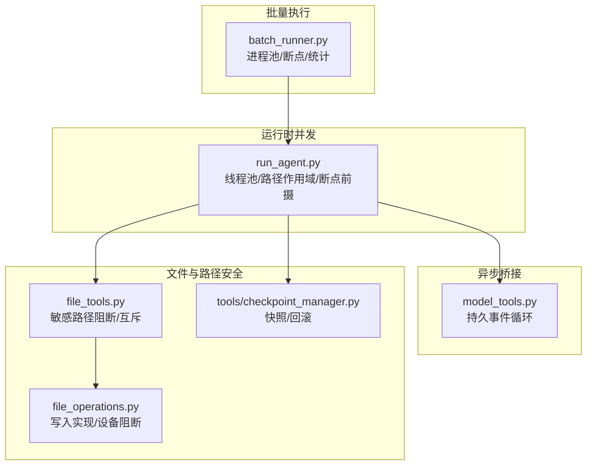
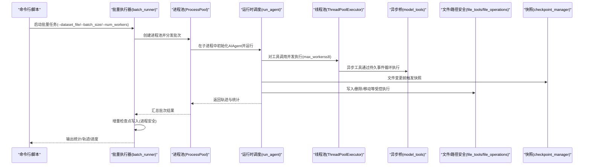
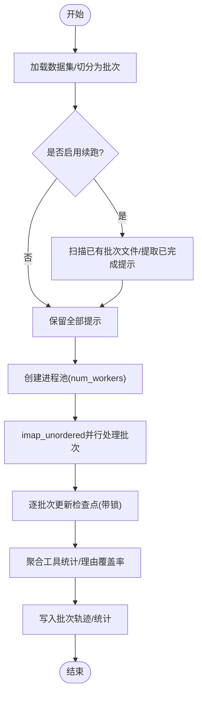
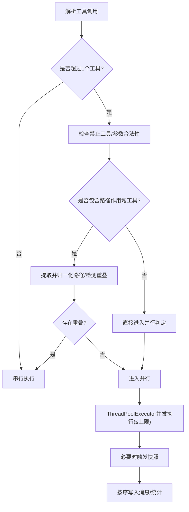
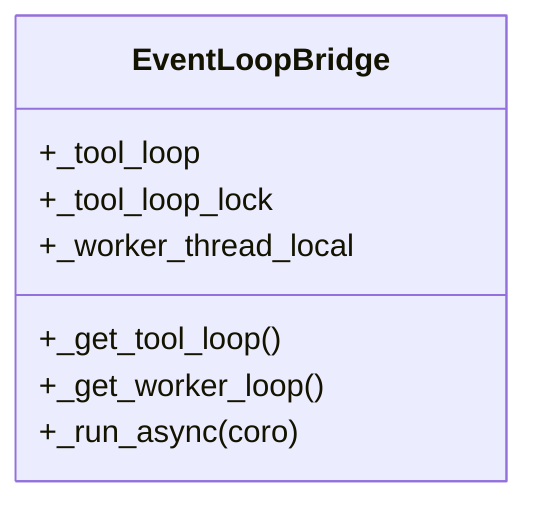
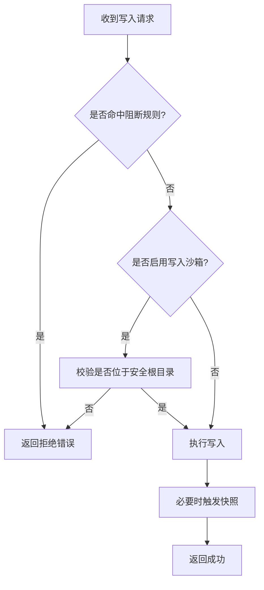
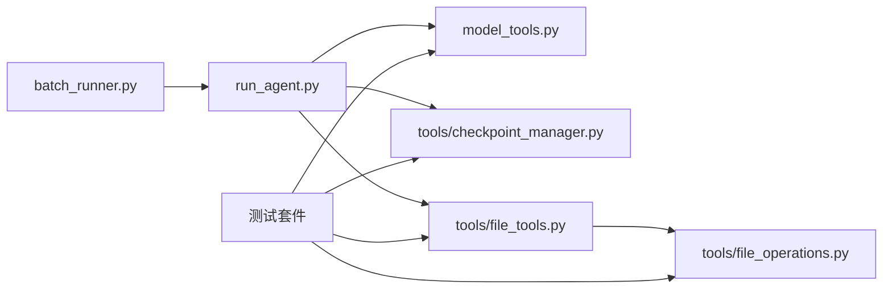

# 并发工具执行

<cite>
**本文引用的文件**
- [batch_runner.py](file://batch_runner.py)
- [run_agent.py](file://run_agent.py)
- [model_tools.py](file://model_tools.py)
- [checkpoint_manager.py](file://tools/checkpoint_manager.py)
- [file_tools.py](file://tools/file_tools.py)
- [file_operations.py](file://tools/file_operations.py)
- [test_checkpoint_manager.py](file://tests/tools/test_checkpoint_manager.py)
- [test_file_write_safety.py](file://tests/tools/test_file_write_safety.py)
- [test_file_read_guards.py](file://tests/tools/test_file_read_guards.py)
- [test_model_tools_async_bridge.py](file://tests/test_model_tools_async_bridge.py)
- [website/docs/user-guide/features/batch-processing.md](file://website/docs/user-guide/features/batch-processing.md)
</cite>

## 目录
1. [简介](#简介)
2. [项目结构](#项目结构)
3. [核心组件](#核心组件)
4. [架构总览](#架构总览)
5. [详细组件分析](#详细组件分析)
6. [依赖分析](#依赖分析)
7. [性能考虑](#性能考虑)
8. [故障排除指南](#故障排除指南)
9. [结论](#结论)
10. [附录](#附录)

## 简介
本文件面向Hermes Agent的并发工具执行系统，系统性阐述并发执行策略、线程池管理、并发安全控制与资源竞争规避；详解工具批处理机制、并行安全检查与路径作用域工具的互斥策略；说明与工具分类、路径检查和并发锁机制的集成关系，并提供可操作的配置与使用示例，以及监控、调试与故障排除建议。

## 项目结构
围绕并发执行的关键模块包括：
- 批量运行器：负责多提示并行批处理、进程池与进度可视化、断点续跑与统计聚合
- 运行时调度器：在单轮对话中对工具调用进行并发执行与路径作用域互斥控制
- 异步桥接层：为异步工具处理器提供持久事件循环，避免“事件循环已关闭”错误
- 文件与路径安全：写入保护、设备路径阻断、写入沙箱、文件互斥锁
- 快照与回滚：基于shadow git的透明快照与回滚，保障文件变更可恢复

图示来源
- [batch_runner.py](file://batch_runner.py)
- [run_agent.py](file://run_agent.py)
- [model_tools.py](file://model_tools.py)
- [checkpoint_manager.py](file://tools/checkpoint_manager.py)
- [file_tools.py](file://tools/file_tools.py)
- [file_operations.py](file://tools/file_operations.py)

章节来源
- [batch_runner.py](file://batch_runner.py)
- [run_agent.py](file://run_agent.py)
- [model_tools.py](file://model_tools.py)
- [checkpoint_manager.py](file://tools/checkpoint_manager.py)
- [file_tools.py](file://tools/file_tools.py)
- [file_operations.py](file://tools/file_operations.py)

## 核心组件
- 批量执行器（进程池）：以多进程并行处理多个批次，支持断点续跑、轨迹落盘、统计聚合与增量检查点写入
- 运行时并发执行（线程池）：在单轮对话内对工具调用进行并发执行，内置路径作用域互斥与并行安全检查
- 异步桥接（事件循环）：为工具处理器提供持久事件循环，避免多线程/多调用场景下的“事件循环已关闭”
- 路径作用域与互斥：针对文件类工具的目标路径进行归一化与重叠检测，确保不同路径间并发、相同路径串行
- 文件安全与互斥：敏感路径阻断、设备路径阻断、写入沙箱、文件级互斥锁
- 快照与回滚：在文件变更前自动快照，支持差异预览与按需回滚

章节来源
- [batch_runner.py](file://batch_runner.py)
- [run_agent.py](file://run_agent.py)
- [model_tools.py](file://model_tools.py)
- [checkpoint_manager.py](file://tools/checkpoint_manager.py)
- [file_tools.py](file://tools/file_tools.py)
- [file_operations.py](file://tools/file_operations.py)

## 架构总览
下图展示了从批量到运行时的并发执行链路，以及与安全与快照子系统的交互。

图示来源
- [batch_runner.py](file://batch_runner.py)
- [run_agent.py](file://run_agent.py)
- [model_tools.py](file://model_tools.py)
- [checkpoint_manager.py](file://tools/checkpoint_manager.py)
- [file_tools.py](file://tools/file_tools.py)
- [file_operations.py](file://tools/file_operations.py)

## 详细组件分析

### 组件A：批量执行器（进程池与断点续跑）
- 并发模型：使用进程池对“批次”进行并行处理，每个子进程独立初始化AIAgent并运行
- 断点续跑：扫描已有批次文件，过滤已完成提示；支持原子JSON写入检查点，带锁保证并发写入安全
- 统计聚合：对工具使用次数、成功/失败进行规范化统计，便于下游分析
- 可视化：Rich进度条显示批次进度、剩余时间与完成数量
- 配置入口：支持批大小、工作进程数、推理参数、系统提示覆盖等

图示来源
- [batch_runner.py](file://batch_runner.py)
- [website/docs/user-guide/features/batch-processing.md](file://website/docs/user-guide/features/batch-processing.md)

章节来源
- [batch_runner.py](file://batch_runner.py)
- [website/docs/user-guide/features/batch-processing.md](file://website/docs/user-guide/features/batch-processing.md)

### 组件B：运行时并发执行（线程池与路径作用域）
- 并行判定：根据工具集合与参数解析结果判断是否允许并发；禁止列表、路径作用域重叠、并行安全工具集合共同决定
- 路径作用域互斥：对read/write/patch等文件类工具，提取目标路径并归一化，检测是否与已占用路径重叠，避免同路径并发
- 线程池上限：最大并发工作线程数不超过内部常量上限，避免过度争抢
- 断点前摄：在可能破坏性操作（如写文件、补丁、危险终端命令）前触发快照，降低风险
- 结果收集：保持原始顺序写入消息历史，保证后续推理一致性

图示来源
- [run_agent.py](file://run_agent.py)
- [checkpoint_manager.py](file://tools/checkpoint_manager.py)

章节来源
- [run_agent.py](file://run_agent.py)
- [checkpoint_manager.py](file://tools/checkpoint_manager.py)

### 组件C：异步桥接（持久事件循环）
- 设计目标：避免每次调用都创建/销毁事件循环导致的“事件循环已关闭”问题
- 实现策略：主线程使用全局持久循环；工作线程使用线程局部存储的持久循环；在已有运行循环上下文中使用一次性线程执行
- 测试验证：多线程复用同一循环、不同线程拥有独立循环、主线程与工作线程分离

图示来源
- [model_tools.py](file://model_tools.py)
- [test_model_tools_async_bridge.py](file://tests/test_model_tools_async_bridge.py)

章节来源
- [model_tools.py](file://model_tools.py)
- [test_model_tools_async_bridge.py](file://tests/test_model_tools_async_bridge.py)

### 组件D：文件与路径安全控制
- 敏感路径阻断：对系统关键路径（如/etc/shadow、~/.ssh）拒绝写入
- 设备路径阻断：阻断/dev/zero、/proc/self/fd/*等特殊路径
- 写入沙箱：支持HERMES_WRITE_SAFE_ROOT环境变量限定写入根目录
- 文件互斥：写入/删除/移动等操作通过统一接口执行，减少竞态
- 回滚能力：在写入前自动快照，支持差异预览与按需回滚

图示来源
- [file_tools.py](file://tools/file_tools.py)
- [file_operations.py](file://tools/file_operations.py)
- [checkpoint_manager.py](file://tools/checkpoint_manager.py)
- [test_file_write_safety.py](file://tests/tools/test_file_write_safety.py)
- [test_file_read_guards.py](file://tests/tools/test_file_read_guards.py)

章节来源
- [file_tools.py](file://tools/file_tools.py)
- [file_operations.py](file://tools/file_operations.py)
- [checkpoint_manager.py](file://tools/checkpoint_manager.py)
- [test_file_write_safety.py](file://tests/tools/test_file_write_safety.py)
- [test_file_read_guards.py](file://tests/tools/test_file_read_guards.py)

## 依赖分析
- 批量执行器依赖运行时调度器（通过AIAgent封装），并依赖工具集分布与模型工具映射
- 运行时调度器依赖异步桥接层以稳定异步工具执行，依赖快照管理器进行文件变更前摄，依赖文件工具的安全检查
- 文件工具与文件操作相互协作，前者负责规则判定，后者负责具体执行
- 测试覆盖了异步桥接的线程隔离、快照的路径校验与回滚安全性、写入沙箱与设备路径阻断

图示来源
- [batch_runner.py](file://batch_runner.py)
- [run_agent.py](file://run_agent.py)
- [model_tools.py](file://model_tools.py)
- [checkpoint_manager.py](file://tools/checkpoint_manager.py)
- [file_tools.py](file://tools/file_tools.py)
- [file_operations.py](file://tools/file_operations.py)

章节来源
- [batch_runner.py](file://batch_runner.py)
- [run_agent.py](file://run_agent.py)
- [model_tools.py](file://model_tools.py)
- [checkpoint_manager.py](file://tools/checkpoint_manager.py)
- [file_tools.py](file://tools/file_tools.py)
- [file_operations.py](file://tools/file_operations.py)

## 性能考虑
- 线程/进程数限制
  - 单轮对话最大并发工作线程数受内部上限约束，避免CPU/IO过载
  - 批量执行的进程数由用户指定，建议与机器核数匹配或略低以留出系统开销
- 负载均衡
  - 批量执行采用进程池并行，结合imap_unordered实现结果就绪即返回，提升吞吐
  - 运行时并发仅在路径不冲突且工具安全的前提下并行，避免无效争用
- I/O与快照
  - 快照采用shadow git，避免频繁大文件拷贝；对超大目录有文件数量阈值保护
- 异步稳定性
  - 持久事件循环显著降低异步客户端重建成本，减少GC引发的异常重试

[本节为通用性能讨论，无需特定文件来源]

## 故障排除指南
- 并发工具执行未生效
  - 检查工具是否在禁止并发列表中，或参数解析失败导致回退串行
  - 路径作用域工具若存在重叠，会被强制串行
  - 章节来源
    - [run_agent.py](file://run_agent.py)
- “事件循环已关闭”异常
  - 确认使用异步桥接函数而非直接asyncio.run
  - 多线程场景下确保每线程拥有独立事件循环
  - 章节来源
    - [model_tools.py](file://model_tools.py)
    - [test_model_tools_async_bridge.py](file://tests/test_model_tools_async_bridge.py)
- 写入被拒绝
  - 检查是否命中敏感路径阻断或设备路径阻断
  - 若启用写入沙箱，请确认目标路径位于安全根目录
  - 章节来源
    - [file_tools.py](file://tools/file_tools.py)
    - [file_operations.py](file://tools/file_operations.py)
    - [test_file_write_safety.py](file://tests/tools/test_file_write_safety.py)
    - [test_file_read_guards.py](file://tests/tools/test_file_read_guards.py)
- 快照/回滚异常
  - 确认git可用且工作目录存在
  - 使用绝对路径或相对路径越界会触发校验失败
  - 章节来源
    - [checkpoint_manager.py](file://tools/checkpoint_manager.py)
    - [test_checkpoint_manager.py](file://tests/tools/test_checkpoint_manager.py)
- 批量执行断点续跑无效
  - 确认检查点文件存在且格式正确
  - 确认批次输出文件命名与扫描逻辑一致
  - 章节来源
    - [batch_runner.py](file://batch_runner.py)

## 结论
Hermes Agent的并发工具执行体系通过“进程池+线程池”的双层并发、严格的路径作用域互斥与异步桥接的事件循环持久化，实现了高吞吐、低风险的工具执行。配合文件安全与快照回滚机制，系统在复杂I/O场景下仍能保持稳健与可恢复性。建议在生产环境中合理设置并发度、开启必要的快照与日志级别，并通过测试验证异步桥接与路径阻断策略的有效性。

## 附录
- 配置与使用示例（批量执行）
  - 示例命令与参数参考：[批量处理文档](file://website/docs/user-guide/features/batch-processing.md)
  - 关键参数：数据集文件、批大小、运行名、工具集分布、最大迭代、工作进程数、推理配置等
  - 章节来源
    - [website/docs/user-guide/features/batch-processing.md](file://website/docs/user-guide/features/batch-processing.md)
- 并发执行监控与调试
  - 批量执行：Rich进度条实时反馈；检查点文件用于断点续跑
  - 运行时并发：工具启动/完成回调、详细日志、结果摘要
  - 章节来源
    - [batch_runner.py](file://batch_runner.py)
    - [run_agent.py](file://run_agent.py)