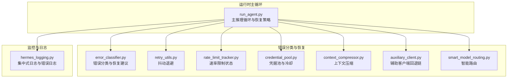
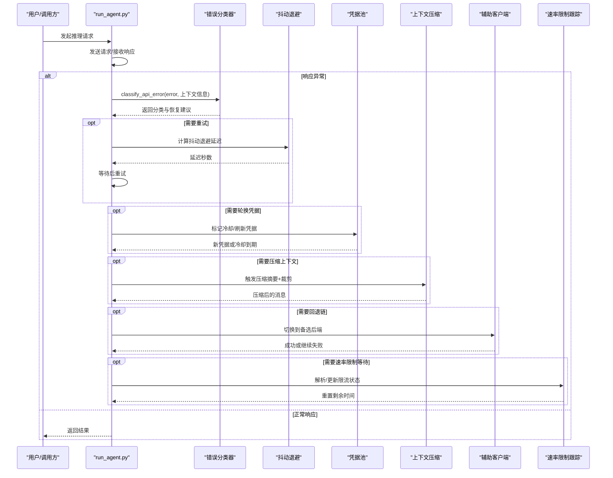
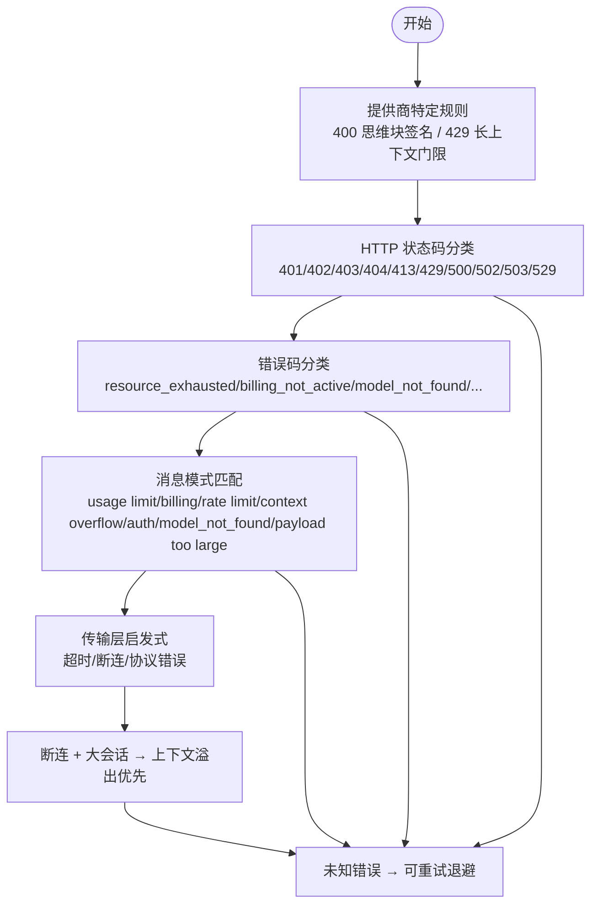
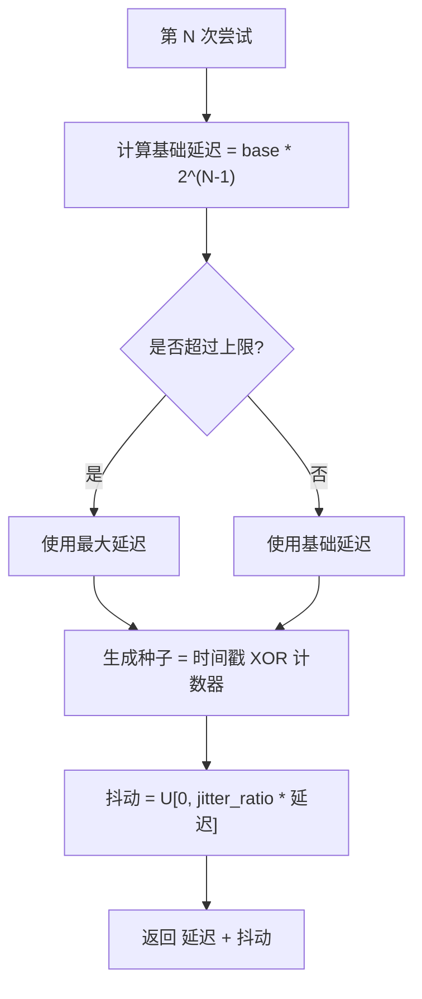
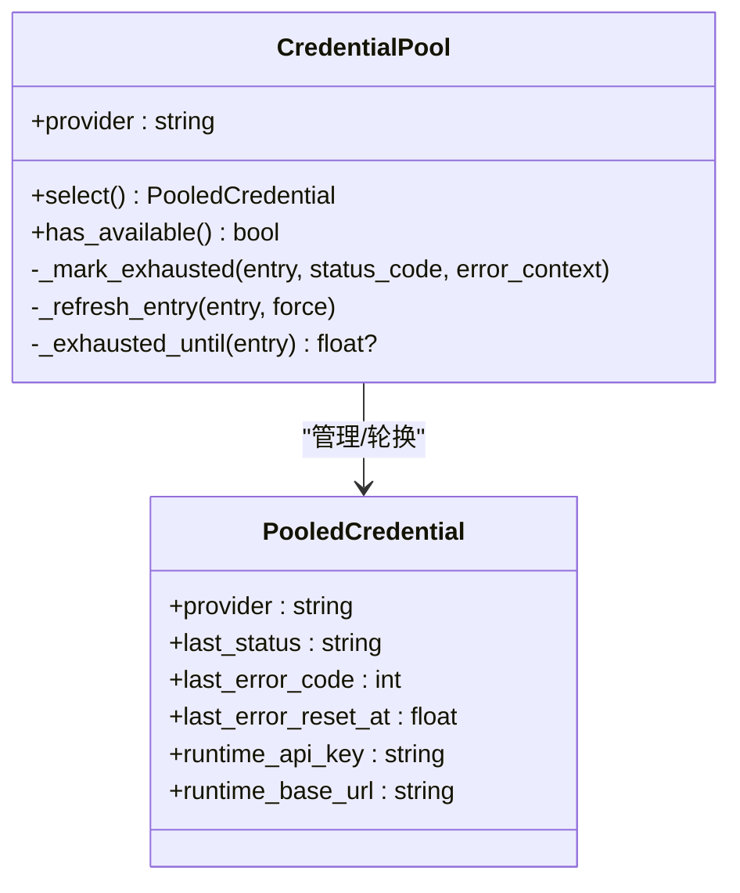
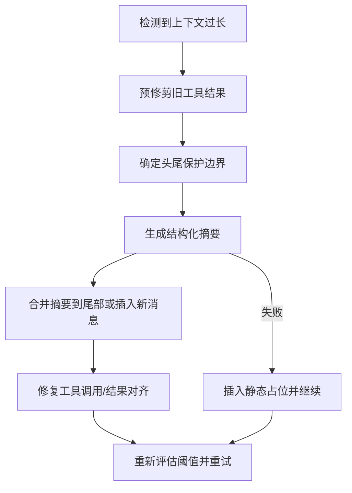
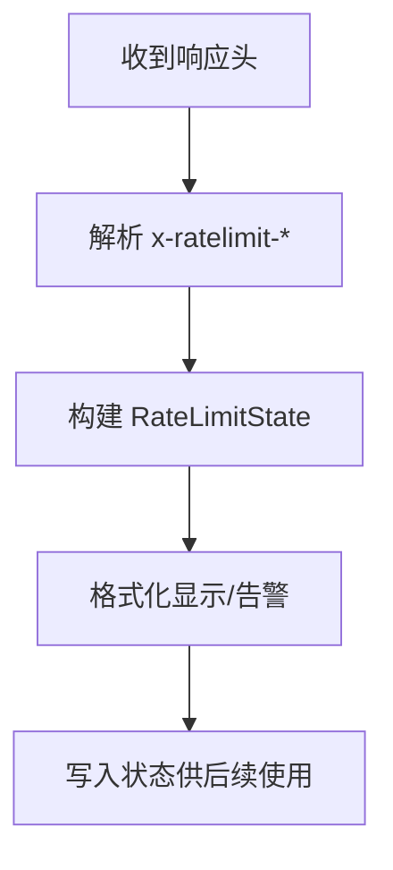
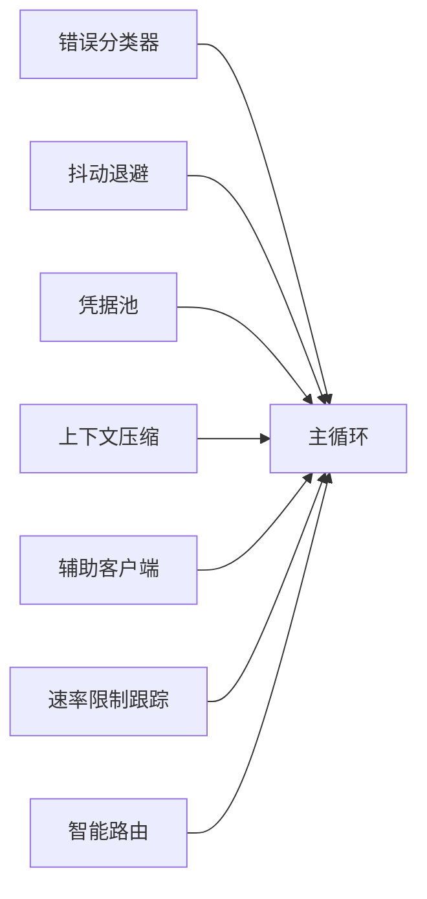

# 错误处理与恢复

<cite>
**本文引用的文件**
- [error_classifier.py](file://agent/error_classifier.py)
- [retry_utils.py](file://agent/retry_utils.py)
- [rate_limit_tracker.py](file://agent/rate_limit_tracker.py)
- [run_agent.py](file://run_agent.py)
- [credential_pool.py](file://agent/credential_pool.py)
- [context_compressor.py](file://agent/context_compressor.py)
- [auxiliary_client.py](file://agent/auxiliary_client.py)
- [smart_model_routing.py](file://agent/smart_model_routing.py)
- [hermes_logging.py](file://hermes_logging.py)
</cite>

## 目录
1. [简介](#简介)
2. [项目结构](#项目结构)
3. [核心组件](#核心组件)
4. [架构总览](#架构总览)
5. [详细组件分析](#详细组件分析)
6. [依赖分析](#依赖分析)
7. [性能考虑](#性能考虑)
8. [故障排查指南](#故障排查指南)
9. [结论](#结论)
10. [附录](#附录)

## 简介
本文件系统化阐述 Hermes Agent 的错误处理与恢复机制，覆盖以下主题：
- API 错误分类与优先级判定流程
- 故障转移策略（凭据轮换、模型回退、上下文压缩）
- 重试机制与退避算法（含抖动 decorrelation）
- 超时与资源限制应对（上下文溢出、负载过载、413 载荷过大）
- 中断处理、异常传播与优雅降级
- 与模型路由、速率限制、网络异常的集成
- 错误监控、日志记录与故障诊断最佳实践

## 项目结构
围绕错误处理与恢复的关键模块如下：
- 错误分类与恢复建议：agent/error_classifier.py
- 重试退避：agent/retry_utils.py
- 速率限制跟踪：agent/rate_limit_tracker.py
- 主循环与恢复策略：run_agent.py
- 凭据池与冷却策略：agent/credential_pool.py
- 上下文压缩：agent/context_compressor.py
- 辅助客户端与回退链：agent/auxiliary_client.py
- 智能模型路由：agent/smart_model_routing.py
- 日志与错误监控：hermes_logging.py

**图表来源**
- [run_agent.py](file://run_agent.py)
- [error_classifier.py](file://agent/error_classifier.py)
- [retry_utils.py](file://agent/retry_utils.py)
- [rate_limit_tracker.py](file://agent/rate_limit_tracker.py)
- [credential_pool.py](file://agent/credential_pool.py)
- [context_compressor.py](file://agent/context_compressor.py)
- [auxiliary_client.py](file://agent/auxiliary_client.py)
- [smart_model_routing.py](file://agent/smart_model_routing.py)
- [hermes_logging.py](file://hermes_logging.py)

**章节来源**
- [run_agent.py](file://run_agent.py)
- [error_classifier.py](file://agent/error_classifier.py)
- [retry_utils.py](file://agent/retry_utils.py)
- [rate_limit_tracker.py](file://agent/rate_limit_tracker.py)
- [credential_pool.py](file://agent/credential_pool.py)
- [context_compressor.py](file://agent/context_compressor.py)
- [auxiliary_client.py](file://agent/auxiliary_client.py)
- [smart_model_routing.py](file://agent/smart_model_routing.py)
- [hermes_logging.py](file://hermes_logging.py)

## 核心组件
- 错误分类器：对 HTTP 状态码、错误体、错误消息进行多阶段分类，输出可执行的恢复建议（是否重试、是否压缩、是否轮换凭据、是否回退）。
- 重试工具：实现抖动化的指数退避，避免并发“惊群”。
- 凭据池：按错误类型设置冷却时间，支持 OAuth 刷新与凭据轮换。
- 上下文压缩：在上下文溢出时进行结构化压缩，保护头尾并生成摘要。
- 速率限制跟踪：解析 x-ratelimit-* 头，格式化显示与健康检查。
- 辅助客户端：统一的“备选后端”解析链，用于压缩、搜索等副作用任务。
- 智能路由：根据消息复杂度选择廉价模型，失败时回退到主模型。
- 日志系统：集中化日志与错误日志分离，便于快速定位。

**章节来源**
- [error_classifier.py](file://agent/error_classifier.py)
- [retry_utils.py](file://agent/retry_utils.py)
- [credential_pool.py](file://agent/credential_pool.py)
- [context_compressor.py](file://agent/context_compressor.py)
- [rate_limit_tracker.py](file://agent/rate_limit_tracker.py)
- [auxiliary_client.py](file://agent/auxiliary_client.py)
- [smart_model_routing.py](file://agent/smart_model_routing.py)
- [hermes_logging.py](file://hermes_logging.py)

## 架构总览
错误处理与恢复贯穿主推理循环，形成“分类—决策—执行”的闭环：
- 分类：优先依据 HTTP 状态码与错误体，其次消息模式，最后传输层与连接断开启发式。
- 决策：根据分类结果决定是否重试、是否压缩上下文、是否轮换凭据、是否切换回退链。
- 执行：结合抖动退避、凭据池冷却、上下文压缩、模型回退与速率限制状态，完成恢复。

**图表来源**
- [run_agent.py](file://run_agent.py)
- [error_classifier.py](file://agent/error_classifier.py)
- [retry_utils.py](file://agent/retry_utils.py)
- [credential_pool.py](file://agent/credential_pool.py)
- [context_compressor.py](file://agent/context_compressor.py)
- [auxiliary_client.py](file://agent/auxiliary_client.py)
- [rate_limit_tracker.py](file://agent/rate_limit_tracker.py)

## 详细组件分析

### 错误分类与恢复建议（error_classifier.py）
- 分类维度：
  - 认证/授权：401/403，区分瞬时与永久；支持刷新与轮换。
  - 账单/配额：402，区分瞬时配额与硬耗尽；需轮换凭据并回退。
  - 服务器端：500/502/503/529，瞬时错误或过载，建议重试或退避。
  - 传输/超时：连接/读取超时、协议错误，映射为超时并重建客户端。
  - 上下文/载荷：413、上下文过长，触发压缩而非 failover。
  - 请求格式：400，区分上下文溢出、模型不存在、速率限制伪装、通用格式错误。
  - 提供商特定：Anthropic 思维块签名无效、长上下文额外用量门限。
  - 兜底：未知错误，按可重试退避处理。
- 分类优先级：提供商特定规则 > HTTP 状态 > 错误码 > 消息模式 > 传输层启发式 > 上下文溢出兜底 > 未知。

**图表来源**
- [error_classifier.py](file://agent/error_classifier.py)

**章节来源**
- [error_classifier.py](file://agent/error_classifier.py)

### 抖动退避与指数退避（retry_utils.py）
- 采用“去相关抖动”的指数退避：
  - 基础延迟按 2^attempt 缩放，上限为最大延迟。
  - 引入随机抖动，抖动范围为延迟的 fraction，种子由时间戳与单调计数器组合，避免并发会合。
  - 适用于高并发场景，降低“惊群”风险。

**图表来源**
- [retry_utils.py](file://agent/retry_utils.py)

**章节来源**
- [retry_utils.py](file://agent/retry_utils.py)

### 凭据池与冷却策略（credential_pool.py）
- 冷却 TTL：
  - 429（速率限制）与 402（账单/配额）默认 1 小时冷却。
  - 支持从错误上下文中解析绝对重置时间或相对秒数，优先使用。
- 凭据刷新：
  - OAuth 凭据池支持刷新，失败时同步外部状态（如 Claude Code 或 Codex CLI 的令牌文件），必要时二次重试。
  - 刷新成功后同步回 auth.json，避免“旧令牌再次被消耗”的问题。
- 选择策略：
  - 支持填充优先、轮转、随机、最少使用等策略，按配置选择。

**图表来源**
- [credential_pool.py](file://agent/credential_pool.py)

**章节来源**
- [credential_pool.py](file://agent/credential_pool.py)

### 上下文压缩与溢出处理（context_compressor.py）
- 触发条件：当检测到上下文过长或明确的“上下文长度超出”错误时，启动压缩。
- 算法要点：
  - 预修剪旧工具结果，减少体积。
  - 保护前若干条与尾部若干 token（可按比例动态调整）。
  - 使用结构化提示生成摘要，保留关键决策、问题、文件与剩余工作。
  - 迭代更新摘要以保留跨轮次信息。
  - 若摘要生成失败，进入“静态占位”模式，避免静默丢失。
- 与主循环集成：压缩后重新评估阈值，若仍超限则逐步下调探测层级，直至最小阈值或压缩达到最大尝试次数。

**图表来源**
- [context_compressor.py](file://agent/context_compressor.py)

**章节来源**
- [context_compressor.py](file://agent/context_compressor.py)

### 速率限制跟踪与显示（rate_limit_tracker.py）
- 解析 x-ratelimit-* 头，构建速率桶状态（每分钟/每小时请求与 token 限额、剩余、重置时间）。
- 提供人类可读的格式化输出，包含使用百分比、剩余量与重置倒计时，并在接近阈值时给出警告。
- 与主循环配合：在收到上游响应后解析并更新状态，作为后续退避与回退的输入。

**图表来源**
- [rate_limit_tracker.py](file://agent/rate_limit_tracker.py)

**章节来源**
- [rate_limit_tracker.py](file://agent/rate_limit_tracker.py)

### 辅助客户端与回退链（auxiliary_client.py）
- 统一的“备选后端”解析链，用于压缩、搜索、视觉分析等副作用任务。
- 文本任务默认链：OpenRouter → Nous Portal → 自定义端点 → Codex OAuth → 原生 Anthropic → 直连 API Key 提供商 → 无。
- 视觉任务默认链：主提供商（若支持）→ OpenRouter → Nous Portal → Codex OAuth → 原生 Anthropic → 自定义本地视觉模型 → 无。
- 当解析到 402（账单耗尽）时，自动切换到下一个可用提供者，提升可用性。

**章节来源**
- [auxiliary_client.py](file://agent/auxiliary_client.py)

### 智能模型路由（smart_model_routing.py）
- 基于消息复杂度与关键词集合，选择“简单模型”路由，避免在简单任务上浪费昂贵模型。
- 当解析失败（例如智能路由选择的便宜模型不可用）时，回退到主模型配置，确保一致性与可用性。

**章节来源**
- [smart_model_routing.py](file://agent/smart_model_routing.py)

### 主循环中的错误处理与恢复（run_agent.py）
- 主循环在每次推理后检查响应有效性与错误字段，结合分类器结果执行：
  - 立即回退：空/畸形响应时优先尝试回退链，避免长时间等待。
  - 速率限制：根据分类器标记切换回退链或等待。
  - 客户端错误（4xx）：尝试回退后再终止。
  - 上下文溢出：触发压缩与阈值下调，达到最大尝试次数仍未缓解则中止。
  - 超时/断连：重建客户端并按抖动退避重试。
- 速率限制与上下文压力：通过速率限制状态与上下文压力告警，指导用户清理历史或降低复杂度。

**章节来源**
- [run_agent.py](file://run_agent.py)

## 依赖分析
- 错误分类器依赖于 HTTP 状态码、错误体与消息模式，同时考虑传输层错误与断连场景。
- 主循环依赖分类器输出的恢复建议，结合抖动退避、凭据池冷却、上下文压缩与回退链。
- 速率限制跟踪为决策提供实时窗口信息，避免盲目重试。
- 辅助客户端与智能路由为副作用任务提供稳定的备选路径，增强整体鲁棒性。

**图表来源**
- [run_agent.py](file://run_agent.py)
- [error_classifier.py](file://agent/error_classifier.py)
- [retry_utils.py](file://agent/retry_utils.py)
- [credential_pool.py](file://agent/credential_pool.py)
- [context_compressor.py](file://agent/context_compressor.py)
- [auxiliary_client.py](file://agent/auxiliary_client.py)
- [rate_limit_tracker.py](file://agent/rate_limit_tracker.py)
- [smart_model_routing.py](file://agent/smart_model_routing.py)

**章节来源**
- [run_agent.py](file://run_agent.py)
- [error_classifier.py](file://agent/error_classifier.py)
- [retry_utils.py](file://agent/retry_utils.py)
- [credential_pool.py](file://agent/credential_pool.py)
- [context_compressor.py](file://agent/context_compressor.py)
- [auxiliary_client.py](file://agent/auxiliary_client.py)
- [rate_limit_tracker.py](file://agent/rate_limit_tracker.py)
- [smart_model_routing.py](file://agent/smart_model_routing.py)

## 性能考虑
- 抖动退避：显著降低并发重试的峰值压力，适合高并发与多会话场景。
- 上下文压缩：在不牺牲关键信息的前提下，大幅降低 token 使用，缓解昂贵模型与长上下文瓶颈。
- 速率限制感知：基于真实头信息进行退避与等待，避免无效重试。
- 凭据池冷却：防止在配额/速率限制期间反复重试同一凭据，提高成功率。

[本节为通用指导，无需具体文件引用]

## 故障排查指南
- 快速定位：
  - 查看错误日志（errors.log）以获取警告级别以上错误摘要。
  - 在 agent.log 中查找会话标签，结合时间线定位问题发生点。
- 常见场景与处置：
  - 429/402：检查速率限制状态与凭据池冷却时间，必要时切换回退链或等待重置。
  - 413/上下文溢出：启用压缩并降低阈值，或清理历史消息。
  - 超时/断连：确认网络与上游服务状态，必要时重建客户端并增加退避上限。
  - 400/格式错误：检查请求体与消息结构，避免无效字段导致的回退。
- 日志与监控：
  - 启用详细日志（调试级别）以捕获第三方库噪声以外的有用信息。
  - 使用速率限制显示命令查看当前窗口使用情况，提前预警。

**章节来源**
- [hermes_logging.py](file://hermes_logging.py)
- [rate_limit_tracker.py](file://agent/rate_limit_tracker.py)
- [run_agent.py](file://run_agent.py)

## 结论
Hermes Agent 的错误处理与恢复机制通过“分类—决策—执行”的闭环设计，实现了对认证失败、速率限制、账单耗尽、上下文溢出、传输超时与网络异常的稳健应对。结合抖动退避、凭据池冷却、上下文压缩、回退链与速率限制感知，系统在保证可靠性的同时兼顾性能与用户体验。建议在生产环境中启用集中日志与速率限制监控，并根据业务负载调整退避参数与压缩策略。

[本节为总结，无需具体文件引用]

## 附录
- 代码示例路径（仅列出路径，不展示具体代码内容）：
  - 错误分类与恢复建议：[error_classifier.py](file://agent/error_classifier.py)
  - 抖动退避：[retry_utils.py](file://agent/retry_utils.py)
  - 凭据池与冷却：[credential_pool.py](file://agent/credential_pool.py)
  - 上下文压缩：[context_compressor.py](file://agent/context_compressor.py)
  - 速率限制跟踪：[rate_limit_tracker.py](file://agent/rate_limit_tracker.py)
  - 辅助客户端回退链：[auxiliary_client.py](file://agent/auxiliary_client.py)
  - 智能模型路由：[smart_model_routing.py](file://agent/smart_model_routing.py)
  - 主循环错误处理与恢复：[run_agent.py](file://run_agent.py)
  - 日志与错误监控：[hermes_logging.py](file://hermes_logging.py)

[本节为补充说明，无需具体文件引用]